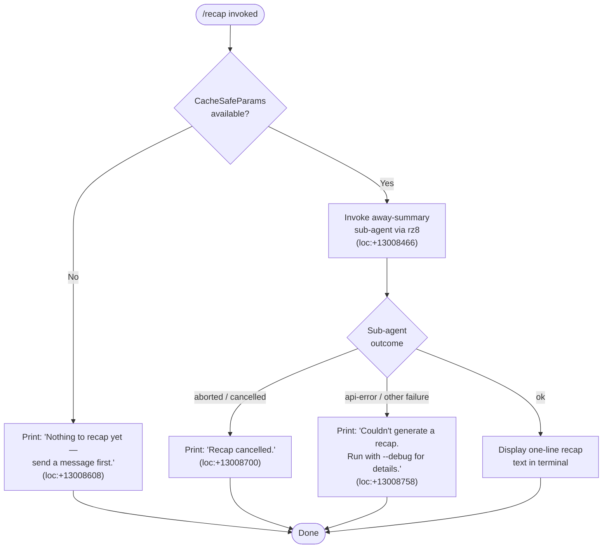

# `/recap`

> Analysis basis: CC v2.1.167 bundle.js (AST extraction + Claude interpretation)
> Minimum version: v2.1.167

---

## Overview

`/recap` generates a one-line summary of the current Claude Code session on demand. It invokes an "away summary" sub-agent pipeline that calls the model with cached session parameters, then displays the resulting single-line recap in the terminal. If no conversation turns have occurred, or if the request is cancelled or fails, it emits a short diagnostic message instead.

---

## Registration

| Field | Value |
|---|---|
| type | `local` |
| name | `recap` |
| description | `Generate a one-line session recap now` |
| loc_byte | `13008858` |
| loc_byte_end | `13009074` |
| supportsNonInteractive | `false` |
| thinClientDispatch | `post-text` |
| load_inline | `true` |
| load_ident | `DFf` |
| arbor_handler.name | `DFf` |
| arbor_handler.kind | `AsyncFunction` |
| arbor_handler.fqn | `claude-2.1.167::DFf` |
| arbor_handler.resolution_path | `load_ident` |
| arbor_handler.n_hits | `0` |

Analysis basis: CC v2.1.167 bundle.js:+13008858

---

## Input Branching

The command has four distinct outcome branches based on session state and sub-agent result, so a Mermaid flowchart is used.



---

## Behavioral Spec

### Top-level handler — `recapHandler` (bundle ident: `DFf`)

The Arbor-resolved handler is the `AsyncFunction` `DFf`, reached via the `load_ident` resolution path from the `load:()=>Promise.resolve({call: DFf})` inline shape in the registration object.

```
async function recapHandler(context):
    result = await awaySummaryRunner(context)   // calls rz8
    return result
```

Analysis basis: CC v2.1.167 bundle.js:+13008466

---

### Away-summary runner — `awaySummaryRunner` (bundle ident: `rz8`)

This function is the primary orchestrator. It checks whether a prior model turn has populated a `CacheSafeParams` snapshot, then sets up an abort controller and fires the sub-agent query.

```
async function awaySummaryRunner(context):

    // Step 1: guard — require at least one completed turn
    params = getCacheSafeParams(context)          // getAppState lookup
    if params is null or undefined:
        log.debug("[awaySummary] no CacheSafeParams saved, skipping")
        // literal at loc:+5488597
        return { status: "nothing-to-recap",
                 message: "Nothing to recap yet — send a message first." }

    // Step 2: set up abort signal forwarding
    abortController = new AbortController()
    context.signal.addEventListener("abort", () => abortController.abort())
    // literal "abort" at loc:+5488711

    // Step 3: run the query with tool-use denied
    //   - tool permission policy: "deny" (literal at loc:+5488888)
    //   - meta label: "away_summary" (literal at loc:+5488971)
    //   - no-tool mode message: "Away summary cannot use tools"
    //     (literal at loc:+5488903)
    queryResult = await runAgentQuery(
        params,
        abortController.signal,
        toolPolicy = "deny",
        label = "away_summary"
    )                                              // dispatches through EG → HDf

    // Step 4: interpret result
    match queryResult.status:
        "no-turn":                                 // literal at loc:+5488655
            return { status: "nothing-to-recap",
                     message: "Nothing to recap yet — send a message first." }
        "aborted":                                 // literal at loc:+5489115
            return { status: "cancelled",
                     message: "Recap cancelled." }
        "api-error":                               // literal at loc:+5489204
            return { status: "error",
                     message: "Couldn't generate a recap. Run with --debug for details." }
        "ok":                                      // literal at loc:+5489265
            return { status: "ok", text: queryResult.text }
        default ("other"):                         // literal at loc:+5488956
            return { status: "error",
                     message: "Couldn't generate a recap. Run with --debug for details." }
```

Analysis basis: CC v2.1.167 bundle.js:+5488466 – +5489265

---

### CacheSafeParams retrieval — `getCacheSafeParams` (bundle ident: `GAH`)

Called at the start of `awaySummaryRunner`. Reads stored model-call parameters (model ID, system prompt tokens, conversation cache keys) from app state so that the recap query can reuse the same caching tier as the main session without re-uploading the context.

```
function getCacheSafeParams(context):
    state = context.getAppState()
    return state.cacheSafeParams   // null when no turn has been processed
```

Analysis basis: CC v2.1.167 bundle.js:+5488576

---

### Agent query pipeline — `runAgentQuery` → `agentQueryDispatcher` (bundle idents: `EG` → `HDf`)

This is the shared main-loop query function reused by `/recap`'s away-summary path. For `/recap`, it is configured with tool use denied and the `away_summary` label.

```
async function runAgentQuery(params, signal, toolPolicy, label):

    // 1. Record start time
    startTime = Date.now()                        // loc:+10941704

    // 2. Build message list from cached params via buildMessageList
    //    (CN8 at loc:+10941827)

    // 3. Retrieve app state; apply avoid_prompts flag
    //    (literal "avoid_prompts" at loc:+10939084)

    // 4. Call model via callModel (HDf → D.callModel at loc:+10900172)
    //    - Streaming is used (literal "query_api_streaming_start" at loc:+10900123)
    //    - Tool use is blocked (policy = "deny")

    // 5. Process streaming events in a loop
    //    - On each stream_event (loc:+10905906): accumulate text deltas
    //    - On message_delta (loc:+10905938): update running output
    //    - On query_api_streaming_end (loc:+10906808): finalize

    // 6. Handle error conditions
    //    - model_error → return status "api-error"   (loc:+10909710)
    //    - interrupt / aborted_streaming → return "aborted"

    // 7. On clean completion return status "ok" with accumulated text

    return { status, text }
```

Analysis basis: CC v2.1.167 bundle.js:+10941704, +10900172, +10905906

---

### Transcript log persistence — `transcriptLogger` (bundle ident: `enK`)

During the sub-agent query, session transcript data is persisted to disk asynchronously. Key operations observed in the call graph:

```
async function transcriptLogger(entry, logDir):
    targetDir = path.dirname(logDir)              // IHH.dirname at loc:+206115
    await fs.mkdir(targetDir, { recursive: true }) // tnK → ly.mkdir at loc:+205836
    await fs.appendFile(logPath, serialised)       // tnK → ly.appendFile at loc:+205895
    byteCount = Buffer.byteLength(serialised)      // loc:+206290

    // Rotate log file if size threshold exceeded
    if currentSize > threshold:
        await rotateLogs(logPath)                  // cl8 at loc:+206284
            // cl8 checks endsWith(".txt") at loc:+205500
            // then calls ly.rename (loc:+205563) or ly.unlink (loc:+205603)
```

Analysis basis: CC v2.1.167 bundle.js:+206082 – +206445

---

### Result display — `thinClientDispatch: "post-text"`

Because the registration sets `thinClientDispatch` to `"post-text"`, the recap text returned in the `"ok"` case is posted directly as a text block to the terminal output stream. No additional rendering step is required by the command itself; the dispatch layer handles insertion.

Analysis basis: CC v2.1.167 bundle.js:+13008858 (registration field)

---

## State & Side Effects

| Item | Detail |
|---|---|
| Telemetry — feature outcome | `tengu_feature_ok` (loc:+1010950), `tengu_feature_bad` (loc:+1011012), `tengu_feature_sad` (loc:+1011093) — emitted by the shared feature-result wrapper (`o6`) reached through the call chain |
| Telemetry — query lifecycle | `tengu_query_error` (loc:+10908997), `tengu_query_before_attachments` (loc:+10918692), `tengu_query_after_attachments` (loc:+10921018) |
| Telemetry — auto-compact | `tengu_auto_compact_rapid_refill_breaker` (loc:+10896850), `tengu_auto_compact_succeeded` (loc:+10897313) |
| Telemetry — model fallback | `tengu_model_fallback_triggered` (loc:+10908302) |
| Telemetry — refusal fallback | `tengu_refusal_fallback_triggered` (loc:+10903624), `tengu_refusal_fallback_suppressed` (loc:+10900041) |
| Telemetry — MCP tools | `tengu_mcp_tools_refreshed_mid_turn` (loc:+10921321) |
| Telemetry — forked agent | `tengu_forked_agent_default_turns_exceeded` (loc:+10943239), `tengu_fork_agent_query` (loc:+10943682) |
| Abort signal | An `AbortController` is created and wired to the parent context signal; the sub-agent is aborted if the parent context aborts (loc:+5488692, +5488723) |
| appState reads | `getAppState()` called to retrieve `CacheSafeParams` and `avoid_prompts` flag (loc:+10938854, +10939084) |
| appState writes | `setAppState()` called during the query loop to update turn metadata (loc:+10940018) |
| Tool use | Explicitly denied for the recap sub-agent; tool policy set to `"deny"` (literal at loc:+5488888) |
| Transcript log | Session transcript written and potentially rotated on disk via `fs.appendFile` / `fs.rename` / `fs.unlink` (loc:+205895, +205563, +205603) |
| Hook registration | `VPA.register` (via `j9` at loc:+60369) — stop-hook registration wired during query setup |
| Sound | <!-- TODO: not found in depth-2 traversal; needs --depth 4 --> |
| Non-interactive support | `supportsNonInteractive: false` — command is blocked in non-interactive (headless) mode |

---

## Version History

| Version | Change |
|---|---|
| v2.1.167 | Initial analysis |

---

## Common Mistakes

1. **Running `/recap` before the first message.** The command guards on `CacheSafeParams` being present in app state. If no assistant turn has completed, it prints "Nothing to recap yet — send a message first." and exits immediately. There is no way to force a recap on an empty session.

2. **Expecting multi-line output.** The command is explicitly described as generating a *one-line* recap. The model is prompted accordingly; any multi-paragraph summary will be truncated or reformatted by the dispatch layer (`thinClientDispatch: "post-text"`).

3. **Using `/recap` in non-interactive/headless mode.** `supportsNonInteractive: false` means the command is disabled in `--print` / pipe mode. Attempting to invoke it there will result in the command being unavailable.

4. **Assuming tools are available during recap.** The sub-agent query is always launched with tool use denied (policy `"deny"`). Any tool-requiring summarisation logic will not execute; the model receives only the conversation context.

5. **Misreading the debug output flag.** When a recap fails due to an API error, the CLI prints "Run with `--debug` for details." The debug logging in this path uses the string literal `"debug"` (loc:+206570) in the transcript logger, not a separate flag name.

---

## Appendix — Identifier Mapping

> For bundle debugging only. Identifiers change across versions.

| Identifier | Role |
|---|---|
| `DFf` | Top-level recap handler (`AsyncFunction`; Arbor-resolved entry point) |
| `rz8` | Away-summary runner (orchestrates the full recap flow) |
| `GAH` | CacheSafeParams retrieval (reads cached model-call parameters from app state) |
| `v` | Prompt/message builder (assembles message list for the sub-agent call) |
| `onK` | Message serialisation helper |
| `vPA` | Sub-helper for message field encoding |
| `H` | Bootstrap fetch / HTTP utility (also reused as generic variable name in many scopes) |
| `Y3` | Bootstrap response handler |
| `uj_` | String-splitting / header-parsing utility |
| `lHH` | Cache-key set membership check |
| `uj` | String replacement utility |
| `H9` | Nested string-processing helper |
| `o6` | Feature-result wrapper (emits `tengu_feature_ok/bad/sad`) |
| `RH` | JSON serialisation wrapper |
| `G4` | Path / filename manipulation utility |
| `q0A` | File list mapper |
| `EUH` | Output write coordinator |
| `lWA` | Low-level write helper |
| `enK` | Transcript logger (disk persistence, log rotation) |
| `npH` | Async flush / debounce scheduler (uses `setTimeout`/`setImmediate`/`clearTimeout`) |
| `YKH` | Log path builder |
| `d6` | Directory initialisation helper |
| `U76` | Error-code classifier (`EISDIR` guard) |
| `M0A` | Log path joiner |
| `cl8` | Log file rotation handler (rename / unlink) |
| `tnK` | Append-and-rotate log writer |
| `j9` | Stop-hook registrar (`VPA.register`) |
| `EG` | Agent query entry point (Date.now start, dispatches to `CN8` and `HDf`) |
| `CN8` | Message list / model-call setup (builds request, sets app state) |
| `Kb` | Session-cache loader |
| `MfH` | Conversation dump/load helper |
| `jjH` | Turn-metadata updater |
| `sj9` | Pre-query state transition helper |
| `M` | App-state message-map accessor |
| `Yy8` | Query-options normaliser |
| `PS` | Random-bytes token generator |
| `bN8` | Post-query cleanup helper |
| `A9H` | Forked-agent sub-query dispatcher |
| `r4` | Hook registration relay |
| `vbH` | Anthropic-provider filter (checks `"ant"` prefix) |
| `Xp` | Turn processor (dispatches to `HDf` and cleans up via `OD8`) |
| `HDf` | Core agent query loop (streaming, tool execution, compaction, refusal fallback) |
| `OD8` | Sub-agent state cleanup (removes from maps/sets on exit) |
| `SH` | Success logger helper |
| `CH` | Error logger helper |
| `Hh6` | Event-type membership check (uses `jOf` set) |
| `I9H` | Inter-turn state propagator |
| `ey8` | Post-turn summary emitter |
| `iCq` | Conditional event-type check |
| `D` | Forced-shutdown handler (`process.exit`, `z.abort`) |
| `IJ` | Shutdown message formatter |
| `z` | Daemon-stop coordinator |
| `QfH` | Rate-limit event handler |
| `fJ` | Rate-limit record constructor |
| `Lw7` | Event-list finder |
| `L` | Promise-set lifecycle manager (add/delete/finally) |
| `l` | Low-level logger / output primitive |
| `wDf` | Forked-agent result formatter |
| `J6` | Terminal output renderer |
| `u8` | Terminal/PTY session manager (attach, resize, replay) |
| `P` | PTY process controller |
| `J` | Write-stream wrapper |
| `j` | Process-pool killer |
| `Y` | Supervisor session lifecycle manager |
| `h` | Background session sweep (idle/stale/low-memory handling) |
| `w` | Worker spawn / claim / retire logic |
| `TOA` | Vim-mode action-set builder |
| `C` | Command execution queue |
| `X` | IPC message framing (buffer, parse, dispatch) |
| `X5` | IPC send helper |
| `i$5` | Supervisor IPC protocol handler (full message router) |
| `GH` | String coercion wrapper |
| `IN9` | Flat-map message expander |

---

Note: index built via Arbor fallback; some signals (telemetry, literals) may be missing — see arbor-fallback.js.