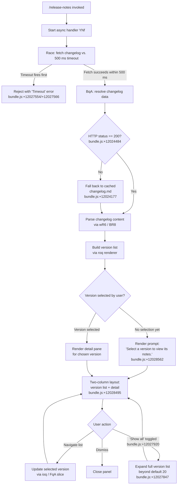

# `/release-notes`

> Analysis basis: CC v2.1.167 bundle.js (AST extraction + Claude interpretation)
> Minimum version: v2.1.167

---

## Overview

`/release-notes` opens an interactive, paginated UI panel that displays the Claude Code changelog. The command fetches or caches the `changelog.md` file, parses it into per-version sections, and renders a two-column layout (version list on the left, release-note detail on the right) with keyboard navigation. Users can browse all versions or jump directly to a specific release.

---

## Registration

| Field | Value |
|---|---|
| type | `local-jsx` |
| name | `release-notes` |
| description | `View release notes` |
| loc_byte | `12029274` |
| loc_byte_end | `12029415` |
| loc_line | `8321` |
| module_id | `ooq` |
| load_inline | `true` |
| arbor_handler.name | `YNf` |
| arbor_handler.fqn | `claude-2.1.167::YNf` |
| arbor_handler.kind | `AsyncFunction` |
| arbor_handler.resolution_path | `module_id` |
| arbor_handler.n_hits | `0` |

Analysis basis: CC v2.1.167 bundle.js:+12029274

---

## Input Branching

The command has four distinct runtime branches: initial load, timeout/error path, changelog data-ready path, and the interactive UI rendering sub-branches (version selected vs. none selected). A Mermaid diagram is therefore used.



---

## Behavioral Spec

### 1. Changelog Fetch with Timeout Race

The handler (`YNf`) immediately starts a `Promise.race` between the changelog-fetch promise and a 500 ms `setTimeout` rejection.

```
async function releaseNotesHandler():
    timeoutPromise = new Promise((_, reject) =>
        setTimeout(() => reject(new Error("Timeout")), 500)
    )
    dataPromise = fetchChangelog()          // BqA
    result = await Promise.race([dataPromise, timeoutPromise])
    return buildUI(result)
```

Analysis basis: CC v2.1.167 bundle.js:+12027530, +12027548, +12027554, +12027566, +12027580

---

### 2. Changelog Resolution (`BqA`)

`BqA` is responsible for resolving the changelog text. It checks the HTTP response status against `200`; on success it returns the fresh body, otherwise it falls back to the locally cached file `changelog.md` located inside a `cache` subdirectory. The resolved content is passed downstream for parsing.

```
async function resolveChangelog():
    cacheDir  = path.join(configDir, "cache")
    cacheFile = path.join(cacheDir, "changelog.md")

    response = await fetchWithHeaders(changelogUrl)   // U_ + $q
    if response.status == 200:
        rawText = await response.text()
        persistToCache(cacheFile, rawText)            // UqA via t8
        return rawText
    else:
        return readFileSync(cacheFile)
```

Analysis basis: CC v2.1.167 bundle.js:+12024415, +12024430, +12024460, +12024484, +12024526, +12024549, +12024177, +12024169

---

### 3. Changelog Parsing (`BR8` / `wR6`)

`BR8` splits the raw markdown text into version-keyed sections. `wR6` handles per-section text cleanup, including trimming whitespace, splitting on version-header delimiters, and normalising bullet markers (`" - "` and `"- "`).

```
function parseChangelog(rawText):
    sections = {}
    chunks   = splitOnVersionHeaders(rawText)    // wR6 / H.split

    for each chunk in chunks:
        header, body = splitHeaderBody(chunk)    // d1 (indexOf + slice)
        version      = header.trim()             // q.trim
        body         = cleanupBody(body)         // normalise "- " bullets
        sections[version] = body

    keys = Object.keys(sections)
    return { sections, keys }
```

Analysis basis: CC v2.1.167 bundle.js:+12024854, +12024903, +12024980, +12025020, +12025043, +12025493, +12025510, +12025524, +12024985, +12025063

---

### 4. Version List Rendering (`roq` component)

`roq` is the top-level JSX component. It maintains an internal memoisation cache (identified by the `"react.memo_cache_sentinel"` sentinel) and renders a `"column"` flex layout.

- The version list is initially capped at **20 entries** (bundle.js:+12027847).
- A **"Show all"** toggle (bundle.js:+12027920) expands beyond 20.
- `FqA` maps the raw version keys to list-item elements via `_.map`.
- `ioq` slices the version array to the current visible window via `H.slice`.

```
function VersionListComponent(sections, keys):
    [showAll, setShowAll] = useState(false)
    [selected, setSelected] = useState(null)

    visibleKeys = showAll ? keys : keys.slice(0, 20)   // ioq

    leftPane  = visibleKeys.map(k => renderVersionRow(k))   // FqA
    if not showAll and keys.length > 20:
        leftPane.append(ShowAllButton("Show all"))

    rightPane = selected
        ? renderNotes(sections[selected])
        : renderPlaceholder("Select a version to view its notes.")

    return Column(leftPane, rightPane)
```

Analysis basis: CC v2.1.167 bundle.js:+12027841, +12027847, +12027920, +12027405, +12027330, +12028003, +12028243, +12028495, +12028562, +12028946

---

### 5. File Writing Sub-system (`enK` / `tnK`)

`enK` orchestrates safe async file writes used to persist the fetched changelog to the cache directory. It calls `tnK` (bound via `.bind`) which performs `mkdir` (recursive), `appendFile`, and manages file rotation (`cl8` renames `.txt`-suffixed working files, trims to 4 entries, then unlinks overflow). Buffer byte-length is computed before writing to guard against empty flushes.

```
async function asyncFileWriter(targetPath, content):
    dir = path.dirname(targetPath)
    await fs.mkdir(dir, { recursive: true })          // tnK -> ly.mkdir
    await fs.appendFile(targetPath, content)          // tnK -> ly.appendFile
    await rotateLogs(targetPath)                      // cl8
```

File rotation detail (`cl8`):
- Checks `fs.stat` on the path.
- If filename ends with `".txt"` (bundle.js:+205511), strips suffix then renames.
- Keeps at most **4** rotated files (bundle.js:+205533).
- Removes excess files via `ly.unlink`.

Analysis basis: CC v2.1.167 bundle.js:+206082, +206107, +206115, +206145, +206160, +206252, +206284, +206290, +206323, +206340, +206349, +205407, +205500, +205511, +205522, +205533, +205563, +205603, +205836, +205895

---

### 6. Bootstrap API Fetch (`H` utility)

The network request used by `BqA` goes through a shared bootstrap fetch helper. It logs `"[Bootstrap] Fetching"` before the request and `"[Bootstrap] Fetch ok"` on success. On JSON parse failure it records a `"parse_failed"` annotation. A **5 000 ms** network-level timeout is applied separately from the 500 ms UI-level race.

```
async function bootstrapFetch(url, options):
    log("[Bootstrap] Fetching", url)
    response = await fetch(url, {
        headers: {
            "Content-Type": "application/json",
            "User-Agent":   userAgentString,
        },
        timeout: 5000,
    })
    log("[Bootstrap] Fetch ok")
    try:
        return await response.json()
    except ParseError:
        record("parse_failed")
        return null
```

Analysis basis: CC v2.1.167 bundle.js:+15797460, +15797458, +15797545, +15797560, +15797579, +15797592, +15797661, +15797782, +15797804, +15797834

---

## State & Side Effects

| Item | Detail |
|---|---|
| Telemetry | `tengu_feature_sad` (bundle.js:+1011093); `tengu_config_lock_contention` (bundle.js:+3265476); `tengu_config_stale_write` (bundle.js:+3265612); `tengu_config_parse_error` (bundle.js:+3268051); `tengu_config_auth_loss_prevented` (bundle.js:+3265955) |
| Cache write | Fetched `changelog.md` is persisted to the `cache/` subdirectory under the Claude config dir (bundle.js:+12024169, +12024177) |
| File rotation | Up to 4 rotated log/cache files retained; excess unlinked (bundle.js:+205533) |
| Config lock | Lock-acquisition contention is guarded; long waits emit `tengu_config_lock_contention`; stale-write protection prevents overwriting auth fields (bundle.js:+3265387, +3265803) |
| Network | One outbound HTTPS request to the changelog endpoint; 5 000 ms timeout at network layer, 500 ms race at UI layer |
| React memoisation | `roq` component uses React memo cache sentinel for slot-based memoisation (bundle.js:+12028421) |
| Hook registration | `j9` calls `VPA.register` — registers a cleanup/undo hook (bundle.js:+60369) |
| Sound | <!-- TODO: not found in depth-2 traversal; needs --depth 4 --> |
| appState changes | <!-- TODO: not found in depth-2 traversal; needs --depth 4 --> |

---

## Version History

| Version | Change |
|---|---|
| v2.1.167 | Initial analysis |

---

## Common Mistakes

1. **Expecting instant rendering** — the command races against a 500 ms timeout. If the network is slow or the cache is cold, the timeout fires and the panel may show an error rather than the changelog.
2. **Assuming the full list is always visible** — the version list is capped at 20 items by default. Users must activate the "Show all" toggle to see older releases.
3. **Editing the cached `changelog.md` manually** — the auth-loss-prevention logic in the config writer (`tengu_config_auth_loss_prevented`) can silently refuse to write if cached data appears inconsistent; manual edits to config-adjacent files may trigger this guard.
4. **Running multiple Claude instances simultaneously** — concurrent instances compete for the config lock; one will see `"Lock acquisition took longer than expected"` and emit `tengu_config_lock_contention`.
5. **Confusing the 500 ms UI race with the 5 000 ms network timeout** — they are independent. The UI race is specific to the `/release-notes` handler; the network timeout belongs to the shared bootstrap fetch utility.

---

## Appendix — Identifier Mapping

> For bundle debugging only. Identifiers change across versions.

| Identifier | Role |
|---|---|
| `YNf` | Main async handler for `/release-notes` (arbor_handler) |
| `BqA` | Changelog fetch + cache resolution function |
| `UqA` | Cache path builder (joins `YR6` dir + `"changelog.md"`) |
| `DR6` | Secondary data-fetch helper (uses `UqA` + `V9`) |
| `BR8` | Changelog text parser; splits raw markdown into version sections |
| `wR6` | Per-section text normaliser (split, trim, bullet cleanup) |
| `d1` | Header/body splitter (indexOf + slice) |
| `roq` | Top-level JSX component for the release-notes UI panel |
| `ioq` | Version-array slicer (applies visible-window limit) |
| `FqA` | Version list-item mapper (_.map over visible keys) |
| `cw` | Shared utility referenced by both `BR8` and `YNf` (likely a React helper) |
| `H` | Bootstrap fetch utility / HTTP helper |
| `v` | Low-level fetch wrapper with header injection |
| `onK` | Request-header assembly helper |
| `vPA` | Sub-helper used by `onK` (calls `sdK`/`tdK`) |
| `RH` | JSON serialiser helper (wraps `JSON.stringify`) |
| `G4` | Version-string normaliser (replace, lastIndexOf, slice) |
| `q0A` | Map helper used by `G4` |
| `EUH` | File-write dispatcher (calls `lWA`) |
| `lWA` | Stream write helper |
| `enK` | Async file-write orchestrator |
| `npH` | Debounced/buffered write queue (setTimeout + setImmediate pattern) |
| `YKH` | Path-assembly helper used within `enK` |
| `U76` | Sub-utility called by `enK` and `tnK` (calls `V8`) |
| `M0A` | Path-join helper (joins `IHH` path segments) |
| `cl8` | Log/cache file-rotation handler |
| `tnK` | Bound async writer (mkdir + appendFile + rotate) |
| `j9` | Hook-registration caller (calls `VPA.register`) |
| `X8` | Config persistence orchestrator (calls `aP_`, `LwH`, etc.) |
| `aP_` | Config save-with-lock implementation |
| `LwH` | Config file reader/validator |
| `oP_` | Global-config write fallback |
| `$$6` | Atomic file-write helper (temp file + rename + fsync) |
| `sP_` | Backup path builder |
| `Zo1` | Object.entries iterator helper |
| `AK8` | Timestamp helper (Date.now-based) |
| `QlH` | Config cache helper |
| `S21` | Config-object factory (calls `gM_` + `Object.assign`) |
| `V9` | AsyncLocalStorage store getter |
| `V8` | Shared utility (called by `U76`, `aP_`, `LwH`, `$$6`) |
| `oj6` | Config-object accessor |
| `o6` | Feature-sad telemetry emitter (calls `l` + `J6`) |
| `J6` | Telemetry dispatch helper (calls `ym6`) |
| `ym6` | Low-level telemetry transport |
| `lHH` | Set membership check helper |
| `Y3` | Helper called during bootstrap fetch |
| `uj_` | String split/trim/slice utility |
| `uj` | String replace utility |
| `H9` | Markdown-to-text conversion entry point (calls `m6H`, `s9`, `FJ`) |
| `m6H` | Markdown block parser (calls `Q0`, `aqH`, `yA`, `qB`) |
| `qB` | Markdown list/item parser |
| `s9` | Token normaliser / model-name resolver |
| `Y2` | Token lookup helper |
| `h4H` | Inclusion checker against known token set |
| `CI` | Token classifier (calls `lM`, `N5`) |
| `DdH` | Alternate classifier (calls `N5`) |
| `bT` | Token type mapper (calls `lM`, `N5`, `MA`) |
| `cP1` | Token wrapper (calls `bT`) |
| `lM` | Token data accessor (calls `MA`) |
| `VH8` | Inclusion check against `HKL` list |
| `wdH` | Token transform (calls `_6`) |
| `FJ` | Composite parser (calls `s9`, `_G`) |
| `_G` | Multi-classifier dispatcher |
| `_6` | String coercion helper (wraps `String`) |
| `$q` | Request wrapper (calls `QRA`) |
| `QRA` | Request normaliser (calls `_6`) |
| `U_` | Fetch initiator used by `BqA` |
| `hH` | HTTP response handler / error logger |
| `AA` | Error/String constructor wrapper |
| `zG4` | Request-queue manager (shift + push on `Sc6`) |
| `zLK` | Telemetry timing helper (Date.now + `V9` + `RH`) |
| `K` | Column formatter (map + padEnd) |
| `$` | Outer utility calling `zLK` |
| `P` | Interactive input component (onChange, setOffset, execute) |
| `E` | Array slice helper |
| `d6` | Path / directory helper |
| `Q0` | Markdown block type detector |
| `aqH` | Markdown attribute parser |

---

Note: index built via Arbor fallback; some signals (telemetry, literals) may be missing — see arbor-fallback.js.