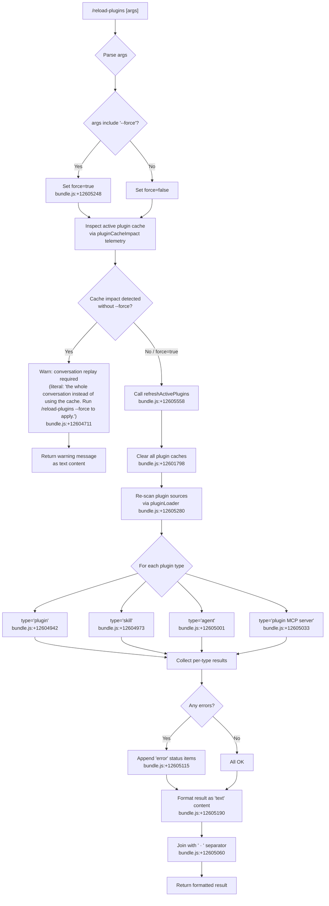

# `/reload-plugins`

> Analysis basis: CC v2.1.167 bundle.js (AST extraction + Claude interpretation)
> Minimum version: v2.1.167

---

## Overview

`/reload-plugins` activates pending plugin changes—including skills, agents, and MCP servers—within the current Claude Code session without requiring a full restart. It discovers which plugin caches would be invalidated, optionally forces a deep cache clear with `--force`, and then re-initialises every active plugin subsystem, reporting success or error status for each.

---

## Registration

| Field | Value |
|---|---|
| type | `local` |
| name | `reload-plugins` |
| description | `Activate pending plugin changes in the current session` |
| argumentHint | `[--force]` |
| supportsNonInteractive | `false` |
| thinClientDispatch | `"control-request"` |
| module_id | `v9K` |
| load_inline | `true` |
| loc_byte | `12606128` |
| loc_byte_end | `12606372` |
| loc_line | `9056` |
| arbor_handler.name | `Tbf` |
| arbor_handler.fqn | `claude-2.1.167::Tbf` |
| arbor_handler.kind | `AsyncFunction` |
| arbor_handler.resolution_path | `module_id` |
| arbor_handler.n_hits | `0` |

Analysis basis: CC v2.1.167 bundle.js:+12606128

---

## Input Branching

The handler has 4+ distinct branches depending on the `--force` flag, the presence of an argument string, the current plugin cache state, and per-plugin-type outcomes (plugin / skill / agent / MCP server). A Mermaid flowchart is used.



---

## Behavioral Spec

### Top-level handler: `Tbf` (AsyncFunction)

```
async function reloadPluginsHandler(args, context):

    // 1. Parse raw argument string
    rawArgs = args.trim()                              // bundle.js:+12605212

    // 2. Detect --force flag
    forceFlag = rawArgs.includes("--force")            // bundle.js:+12605248
    if forceFlag:
        mode = "force"                                 // bundle.js:+12605263
    else:
        mode = "normal"

    // 3. Inspect cache-impact of a non-forced reload
    cacheImpact = computePluginCacheImpact(context)    // bundle.js:+12604826
    emit telemetry: "tengu_reload_plugins_cache_impact" // bundle.js:+12604120

    // 4. Guard: if cache impact detected and --force not set, warn and abort
    if cacheImpact > 0 and not forceFlag:
        return textContent(
            "...the whole conversation instead of using the cache. "
            + "Run /reload-plugins --force to apply."
        )                                              // bundle.js:+12604711

    // 5. Re-initialise all active plugins
    result = await refreshActivePlugins(context, forceFlag)  // bundle.js:+12605558

    // 6. Format output
    parts = []
    for each pluginType in ["plugin", "skill", "agent", "plugin MCP server"]:
        typeResult = result[pluginType]
        if typeResult.status == "error":
            parts.append(formatErrorEntry(pluginType, typeResult))
        else:
            parts.append(formatOkEntry(pluginType, typeResult))

    return textContent(parts.join(" · "))             // bundle.js:+12605060
```

Analysis basis: CC v2.1.167 bundle.js:+12604826, +12605212, +12605248, +12605558

---

### Sub-feature: `computePluginCacheImpact` (mapped from `eP` → `oL`)

```
function computePluginCacheImpact(context):
    // Reads the current plugin loader state
    loaderState = getLoaderState()                   // bundle.js:+12604826
    // Calls internal plugin-load helper (oL)
    impactCount = pluginLoadHelper(loaderState)      // bundle.js:+1097989
    return impactCount                               // 0 means no impact
```

Analysis basis: CC v2.1.167 bundle.js:+12604826, +1097989

---

### Sub-feature: `refreshActivePlugins` (mapped from `N$H`)

```
async function refreshActivePlugins(context, force):

    if force:
        logDebug("refreshActivePlugins: clearing all plugin caches")
        // bundle.js:+12601798
        await clearInstalledPluginsCache()           // bundle.js:+12601856 (a$)
        // logs "Cleared installed plugins cache"    // bundle.js:+10041960
        clearSkillIndexCache()                       // via mm, bundle.js:+13191539
        clearInternalMcpStateCache()                 // via vm → sv8.clear, bundle.js:+9984556

    // Scan all plugin configuration sources
    pluginConfigs = await loadAllPluginConfigs()     // bundle.js:+12601905 (Promise.all)

    // Rebuild per-source plugin lists
    pluginList     = buildPluginList(pluginConfigs, "plugin")
    skillList      = buildPluginList(pluginConfigs, "skill")
    agentList      = buildPluginList(pluginConfigs, "agent")
    mcpServerList  = buildPluginList(pluginConfigs, "plugin MCP server")

    // Re-connect / re-initialise MCP servers
    await reconnectMcpServers(mcpServerList)         // bundle.js:+12602904 (Nm.emit)

    // Collect and return structured results
    results = {
        plugin:            pluginList,
        skill:             skillList,
        agent:             agentList,
        "plugin MCP server": mcpServerList,
    }
    return results
```

Analysis basis: CC v2.1.167 bundle.js:+12601798, +12601856, +12601905, +12602904

---

### Sub-feature: `loadAllPluginSources` (mapped from `V9K` → `Sp9`)

```
async function loadAllPluginSources(context):
    // Calls internal plugin-server bootstrap (Sp9)
    allSources = await pluginServerBootstrap()        // bundle.js:+12603844

    // Iterates Object.entries of discovered sources
    for each [key, source] in Object.entries(allSources):  // bundle.js:+6846163
        activeSources.add(source)                    // bundle.js:+6846208

    // Also handles plugin-server type checks
    if not pluginServerMap.has(key):                 // bundle.js:+12603894
        continue
    if not activeSet.has(key):                       // bundle.js:+12603933
        resolvePluginNormalization(key)              // nN, bundle.js:+12603977
        resolvePluginScope(key)                      // Ns, bundle.js:+12603983
        resolvePluginDimension(key)                  // yD, bundle.js:+12604004

    return activeSources
```

Analysis basis: CC v2.1.167 bundle.js:+12603844, +12603894, +12603933

---

### Sub-feature: `buildPluginTypeString` (mapped from `Ti` → `b8`)

```
function buildPluginTypeString(pluginEntry):
    // Determines the display category for a plugin entry
    // Selects among: "plugin", "skill", "agent", "plugin MCP server"
    // based on plugin metadata flags
    category = classifyPluginEntry(pluginEntry)       // bundle.js:+12604922 (Ti → b8)
    return category
```

Analysis basis: CC v2.1.167 bundle.js:+12604922

---

### Sub-feature: `formatReloadResult` (mapped from `_AH`)

```
function formatReloadResult(resultsByType):
    // Maps each plugin type result to a display string
    lines = resultsByType.map(entry =>
        buildDisplayLine(entry)                       // bundle.js:+12605633
    )
    // Joins with " · " separator                     // bundle.js:+12605060
    return lines.join(" · ")
```

Analysis basis: CC v2.1.167 bundle.js:+12605633, +12605060

---

### Sub-feature: `lspManagerFilter` (mapped from `Wbf` / `Gbf`)

During the plugin reload, LSP-manager entries are filtered separately from the main plugin list.

```
function filterLspManagerEntries(allPlugins, activeSet):
    // Wbf: filter by "lsp-manager" prefix      bundle.js:+12603294, +12603319
    lspEntries = allPlugins.filter(p =>
        p.source.startsWith("lsp-manager")            // literal bundle.js:+12603319
    )
    // Gbf: further map and filter              bundle.js:+12603569
    return lspEntries
        .map(p => normalise(p))
        .filter(p => !activeSet.has(p.id))
```

Analysis basis: CC v2.1.167 bundle.js:+12603294, +12603569

---

## State & Side Effects

| Item | Detail |
|---|---|
| Telemetry | `tengu_reload_plugins_cache_impact` (bundle.js:+12604120) — fired once per invocation with the cache-impact count |
| Telemetry (plugin loader) | `plugin_load_all`, `plugin_load_total_failure`, `plugin_load_partial_failures` (bundle.js:+5352868, +5352886, +5352955) — fired during source re-scan |
| Cache cleared (force) | Installed-plugins disk cache, skill-index cache, internal MCP state cache (bundle.js:+12601798) |
| MCP server reconnection | `Nm.emit` triggers MCP server re-connect cycle (bundle.js:+12602904) |
| appState changes | Plugin list and MCP server registry updated in-place; no full session restart |
| Hook registration | LSP-manager hooks re-registered after reload (bundle.js:+12603294) |
| `thinClientDispatch` | Set to `"control-request"` — in thin-client mode this command is forwarded to the controlling process rather than executed locally |
| Sound | None observed |
| Non-interactive support | `false` — command is interactive-only; will not run in `--print` / CI mode |

---

## Version History

| Version | Change |
|---|---|
| v2.1.167 | Initial analysis |

---

## Common Mistakes

1. **Omitting `--force` when caches are stale.** Without `--force`, the command detects cache impact and returns a warning rather than performing a reload. The user must re-run with `--force` to actually apply changes (bundle.js:+12604711).
2. **Expecting a session restart.** `/reload-plugins` only re-initialises plugin subsystems in the live session; it does not restart the Claude Code process or reset conversation history.
3. **Using in non-interactive mode.** `supportsNonInteractive` is `false`; invoking this command from a script or `--print` session will be rejected or ignored.
4. **Confusing plugin types.** The command distinguishes four separate plugin categories — `plugin`, `skill`, `agent`, and `plugin MCP server` — each reported independently in the output. Errors in one category do not suppress results from others.
5. **Assuming instant MCP reconnection.** MCP server re-connection is asynchronous. Tools exposed by newly connected MCP servers may not be available immediately after the command returns.

---

## Appendix — Identifier Mapping

> For bundle debugging only. Identifiers change across versions.

| Identifier | Role |
|---|---|
| `Tbf` | Main handler for `/reload-plugins` (AsyncFunction) |
| `eP` | Compute plugin cache impact (calls `oL`) |
| `oL` | Plugin-load helper / impact counter |
| `uTH` | Internal utility called by plugin-load helper |
| `Ti` | Plugin type classifier (selects "plugin" / "skill" / "agent" / "plugin MCP server") |
| `b8` | Plugin entry category builder |
| `V9K` | Load all plugin sources (calls `Sp9`) |
| `Sp9` | Plugin-server bootstrap / source enumeration |
| `N9K` | Helper called during plugin-load initialisation |
| `Ebf` | Argument splitter (splits raw args string) |
| `N$H` | Refresh active plugins — core reload orchestrator |
| `uNq` | Internal utility in `N$H` path |
| `a$` | Plugin cache clear coordinator |
| `k9f` | Installed-plugins cache accessor |
| `A0` | Plugin load result assembler |
| `Nk` | Marketplace / skill cache clear coordinator |
| `mm` | Clears skill-index cache |
| `vm` | Clears internal MCP state (`sv8.clear`) |
| `Rs` | Plugin configuration reader |
| `ZP` | MCP config file loader (reads `.mcp.json`) |
| `bs` | Plugin-server manager |
| `Gj7` | Plugin-server registry diff/update |
| `TD8` | Plugin-server connection table updater |
| `_PH` | Per-plugin-server connection handler |
| `yS_` | Plugin load result assembler (skill/marketplace path) |
| `RS_` | Plugin result aggregator |
| `hS_` | Plugin loader entry point |
| `Wbf` | LSP-manager plugin filter (prefix `lsp-manager`) |
| `Gbf` | LSP-manager plugin secondary filter |
| `Z9K` | LSP-manager entry finaliser |
| `MT8` | LSP extension-conflict resolver |
| `SRH` | LSP config file reader (`.lsp.json`) |
| `Kg7` | LSP plugin path validator |
| `f$H` | Plugin slot loader / connection initialiser |
| `y06` | Plugin resolution engine (MCP slot lifecycle) |
| `xbH` | MCP connection attempt handler |
| `XF8` | MCP connection result applier |
| `dDA` | MCP state update dispatcher |
| `Tk` | Known-marketplaces config reader |
| `R5` | Known-marketplaces JSON file reader |
| `OI8` | Marketplace config path builder |
| `Ps` | Plugin marketplace.json reader |
| `CS_` | Combined plugin config reader |
| `fE` | Plugin config + marketplace merger |
| `gZ` | Plugin state file loader (`load-from-disk`) |
| `ts_` | Plugin state file synchronous reader |
| `p2` | Plugin source URL parser |
| `Fj9` | URL scheme extractor |
| `JW6` | Plugin source validator |
| `oA` | Plugin scope checker |
| `mN` | Plugin source normaliser |
| `rJ9` | Plugin dependency resolver |
| `o_` | Settings file writer / plugin config persister |
| `_AH` | Reload result formatter (joins with " · ") |
| `Qhq` | MCP SDK connect / reconnect handler |
| `jH` | MCP server registry manager |
| `n` | MCP server lifecycle coordinator |
| `nN` | Plugin normalisation resolver |
| `Ns` | Plugin scope name resolver |
| `yD` | Plugin dimension resolver |
| `aC_` | Plugin context builder |
| `oC_` | Plugin auto-count parser |
| `D6` | Plugin tool-search gate |
| `hH` | Error logger / plugin load error handler |
| `GH` | String coercion utility |
| `v` | Fetch / HTTP utility |
| `H` | Bootstrap HTTP helper |
| `_6` | Boolean/string coercion utility |
| `jK` | String coercion utility |
| `MA` | Model-alias resolver |
| `h8` | EISDIR / filesystem error handler |
| `V8` | Filesystem error code checker |
| `R6` | Renderer / output writer |
| `tv` | Terminal output writer |
| `LY` | Settings cache clear helper |
| `W_` | Output pipe helper |
| `SH` | Success-path renderer |
| `CH` | Error-path renderer |

---

Note: index built via Arbor fallback; some signals (telemetry, literals) may be missing — see arbor-fallback.js.