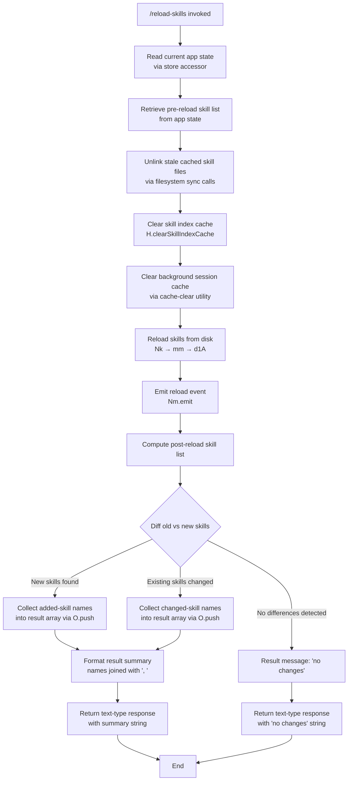

# `/reload-skills`

> Analysis basis: CC v2.1.167 bundle.js (AST extraction + Claude interpretation)
> Minimum version: v2.1.167

---

## Overview

`/reload-skills` rescans the filesystem for skill definitions that have been added or modified during the current session, clears all relevant in-memory skill caches, reloads skill data from disk, and emits a summary message reporting which skills changed, were added, or saw no changes. It is designed to be invoked interactively or non-interactively (thin-client dispatch: `post-text`) without restarting the Claude Code process.

---

## Registration

| Field | Value |
|---|---|
| type | `local` |
| name | `reload-skills` |
| description | `Pick up skills added or changed on disk during this session` |
| supportsNonInteractive | `true` |
| thinClientDispatch | `post-text` |
| module_id | `y9K` |
| load_inline | `true` |
| loc_byte | `12606922` |
| loc_byte_end | `12607139` |
| loc_line | `9056` |
| arbor_handler.name | `Vbf` |
| arbor_handler.fqn | `claude-2.1.167::Vbf` |
| arbor_handler.kind | `AsyncFunction` |
| arbor_handler.resolution_path | `module_id` |
| arbor_handler.n_hits | `0` |

Analysis basis: CC v2.1.167 bundle.js:+12606922

---

## Input Branching

The command produces output across 3+ distinct outcome branches depending on the result of cache clearing, skill reloading, and diffing of skill sets. A Mermaid flowchart is used below.



Analysis basis: CC v2.1.167 bundle.js:+12606444 through +12606806

---

## Behavioral Spec

### 1. State Acquisition

```
async function reloadSkillsHandler(context):
    appState = getAppState()                    // u6 → mc6 → uc6.getStore
    preReloadSkills = getSkillList(appState)    // u6 → W_ → tv
```

The handler first resolves the current application state store using an async store accessor (`u6`), which in turn calls `mc6` to retrieve the async-local store via `uc6.getStore`, and falls back via `BQ` if needed. A second call via `W_` (→ `tv`) extracts the skill list present before the reload.

Analysis basis: CC v2.1.167 bundle.js:+12606444 (u6), +1021187 (uc6.getStore), +1021257 (W_)

---

### 2. Stale Cache Eviction

```
function evictStaleCaches(skillList):
    for each skill in skillList:
        unlinkSyncIfExists(skill.cachePath)   // q → ipK.unlinkSync
    clearSkillIndexCache()                    // Nk → mm → H.clearSkillIndexCache
    clearBackgroundSessionCache()             // vm → sv8.clear
```

Before reloading, all stale on-disk cache entries associated with the current skill list are removed synchronously via `ipK.unlinkSync` (Analysis basis: CC v2.1.167 bundle.js:+16173867). The in-memory skill index cache is then purged through `H.clearSkillIndexCache` (Analysis basis: CC v2.1.167 bundle.js:+13191539). A separate background-session cache store is also cleared via `sv8.clear` (Analysis basis: CC v2.1.167 bundle.js:+9984556).

---

### 3. Skill Index Reload

```
async function reloadSkillIndex():
    await Promise.resolve()                   // mm: yields to microtask queue
    freshData = await d1A()                   // mm → d1A: re-reads skill definitions
    H.clearSkillIndexCache()                  // mm: second pass clear after read
    newSkillEntries = await EbH()             // Nk → EbH → Ly6
    for each entry in newSkillEntries:
        record = SI8.get(entry)              // Ly6 → SI8.get
        process via qy6(record)              // Ly6 → qy6
    return [KI8, jNq]                        // Nk: two structured skill collections
```

`Nk` orchestrates the reload in three steps: clear, re-read (`d1A`), and fetch updated index entries via `EbH` (→ `Ly6`). `Ly6` performs a map-store lookup (`SI8.get`) and applies per-entry processing (`qy6`). Two result collections — represented by `KI8` and `jNq` — are returned for diff analysis.

Analysis basis: CC v2.1.167 bundle.js:+12606493 (Nk), +13191487 (Promise.resolve), +13191517 (d1A), +13191539 (H.clearSkillIndexCache), +13191591 (KI8), +13191597 (jNq), +13191603 (EbH), +10188007 (SI8.get)

---

### 4. Reload Event Emission

```
function emitReloadEvent(skillData):
    Nm.emit(reloadEventPayload)   // Nm.emit
```

After the skill data is reloaded, a reload event is emitted on the `Nm` event emitter so that any listeners (e.g., UI subscribers or internal state observers) can react to the updated skill registry.

Analysis basis: CC v2.1.167 bundle.js:+12606551

---

### 5. Background Session Processing

```
async function processBackgroundSessions(newSkillList):
    for each skill in newSkillList:             // L.map
        session = openSession(skill)            // L → q.add
        try:
            result = await session.process()
            session.toLowerCaseNormalize()      // A → f.toLowerCase
        finally:
            session.close()                    // f → A.close, f → q.close
            removeFromActiveSet(skill)         // L → q.delete
```

Each newly loaded skill may be associated with a background session. Sessions are tracked in an active set; the `finally` block ensures sessions are closed and removed from the active set even on failure. Column formatting with a pad-width of **40 characters** is applied (Analysis basis: CC v2.1.167 bundle.js:+16223575) and two-space padding `"  "` separates columns (Analysis basis: CC v2.1.167 bundle.js:+16221604).

The string `"stopped"` (Analysis basis: CC v2.1.167 bundle.js:+16233608) and `"background session"` (Analysis basis: CC v2.1.167 bundle.js:+16233651) appear as status labels used when constructing background-session display entries via `b8`.

Analysis basis: CC v2.1.167 bundle.js:+12606531 (L.map), +16202781 (q.add), +16202804 (q.delete), +16208773 (A.close)

---

### 6. Diff and Result Formatting

```
function buildResultMessage(preReloadSkills, postReloadSkills, addedSkills):
    changed = postReloadSkills.filter(s => K.has(s))   // L.filter + K.has
    added   = addedSkills.filter(s => f.has(s))        // q.filter + f.has

    resultParts = []
    for each skill in (changed ∪ added):
        resultParts.push(formatSkillEntry(skill))       // O.push → b8

    if resultParts is empty:
        summary = "no changes"                          // literal: bundle.js:+12606736
    else:
        summary = resultParts.join(", ")                // O.join, separator ", " bundle.js:+12606730

    return { type: "text", content: summary }           // literal "text": bundle.js:+12606761
```

The diff logic filters the post-reload skill collection against a set of known changed (`K`) and newly-added (`f`) skills. Each matched skill is formatted via `b8` and pushed into a results array. If no changes are detected, the fixed string `"no changes"` is returned. Otherwise, skill names are joined with `", "`. The final return object carries `type: "text"` and the summary string.

The literal `"skill"` appears at +12606818 and is used in the return object's secondary field (e.g., as a category label alongside the text content).

Analysis basis: CC v2.1.167 bundle.js:+12606567 (L.filter), +12606582 (K.has), +12606606 (q.filter), +12606621 (f.has), +12606655 (O.push), +12606723 (O.join), +12606730 (","), +12606736 ("no changes"), +12606761 ("text"), +12606806 (b8), +12606818 ("skill")

---

### 7. Bootstrap / HTTP Fetch (Indirect, via Skill Index)

During skill index reload, a bootstrap HTTP fetch may be triggered via `H` (the skill-index module). Observed behavior:

- Logs `"[Bootstrap] Fetching"` at debug level before the request (Analysis basis: CC v2.1.167 bundle.js:+15797460)
- Sends `Content-Type: application/json` and `User-Agent` headers (Analysis basis: CC v2.1.167 bundle.js:+15797545, +15797579)
- Applies a **5000 ms** timeout (Analysis basis: CC v2.1.167 bundle.js:+15797661)
- Emits telemetry event `"api_bootstrap_fetch"` with parse failure labeled `"parse_failed"` (Analysis basis: CC v2.1.167 bundle.js:+15797782, +15797804)
- Logs `"[Bootstrap] Fetch ok"` on success (Analysis basis: CC v2.1.167 bundle.js:+15797834)
- Uses `qA.get` for cache lookup and `Y3` / `uj_` for URL/path processing (Analysis basis: CC v2.1.167 bundle.js:+15797496, +15797592)

`uj_` parses path components: splits on delimiter, trims whitespace, uses `indexOf` to locate a separator at index **1**, then slices from index **0** (Analysis basis: CC v2.1.167 bundle.js:+2979391, +2979430, +2979454, +2979477, +2979494, +2979502).

---

## State & Side Effects

| Item | Detail |
|---|---|
| Telemetry | `tengu_feature_sad` (emitted via `o6` → `l`; Analysis basis: CC v2.1.167 bundle.js:+1011093) |
| Skill index cache | Cleared via `H.clearSkillIndexCache` before and after re-read (bundle.js:+13191539) |
| Background session cache | Cleared via `sv8.clear` (bundle.js:+9984556) |
| Stale file cache | Synchronously unlinked via `ipK.unlinkSync` per skill (bundle.js:+16173867) |
| Event emission | `Nm.emit` fires a reload event after new skills are loaded (bundle.js:+12606551) |
| Active session set | Skills added to / deleted from an active set (`q.add`, `q.delete`) during background-session processing |
| Return type | `{ type: "text", content: <summary string> }` — compatible with `thinClientDispatch: "post-text"` |
| supportsNonInteractive | `true` — command may be called in scripted/headless contexts |
| Hook registration | <!-- TODO: not found in depth-2 traversal; needs --depth 4 --> |
| appState changes | Updated skill list reflected in store after reload; pre-reload snapshot used for diff only |
| Sound | <!-- TODO: not found in depth-2 traversal; needs --depth 4 --> |

---

## Version History

| Version | Change |
|---|---|
| v2.1.167 | Initial analysis |

---

## Common Mistakes

1. **Expecting immediate UI feedback without `post-text` support**: Because `thinClientDispatch` is `"post-text"`, thin clients must handle the returned text message explicitly; they will not receive a rendered component response.
2. **Running in a context without filesystem access**: The command calls `ipK.unlinkSync` synchronously. In environments where the skill cache path is not writable, this will throw and abort the reload before the index is refreshed.
3. **Assuming skills are reloaded atomically**: The cache is cleared before re-reading; there is a window during which `H.clearSkillIndexCache` has run but `d1A` has not yet completed. Concurrent reads of the skill index during this window may find an empty cache.
4. **Misinterpreting `"no changes"` as an error**: This is the normal success message when no skills differ between the pre- and post-reload snapshots; it does not indicate a failure condition.
5. **Triggering `/reload-skills` during an active background session**: The background-session set is being mutated (`q.add` / `q.delete`) concurrently with the reload; invoking the command while long-running background sessions are active may produce incomplete diff results.

---

## Appendix — Identifier Mapping

> For bundle debugging only. Identifiers change across versions.

| Identifier | Role |
|---|---|
| `Vbf` | Main handler — async function implementing the full `/reload-skills` flow |
| `u6` | App-state accessor — retrieves current application state from the async-local store |
| `mc6` | Store resolver — calls `uc6.getStore` to obtain the async-local storage context |
| `BQ` | Fallback state provider — used when the primary store lookup returns null |
| `W_` | Pre-reload skill list extractor — reads the current skill list from app state |
| `tv` | Skill list getter — low-level accessor called by `W_` |
| `q` | Stale-file unlinker / active-session set — dual role: `ipK.unlinkSync` wrapper and session membership set |
| `Nk` | Skill reload orchestrator — sequences cache clear, disk read, and index fetch |
| `mm` | Async skill re-reader — awaits `Promise.resolve`, calls `d1A`, clears index cache |
| `H` | Skill index module — owns `clearSkillIndexCache`, bootstrap fetch, and URL/path helpers |
| `v` | Bootstrap HTTP response handler — processes fetch result, emits debug log, normalises headers |
| `Y3` | URL builder used by skill index bootstrap fetch |
| `uj_` | Path component parser — splits, trims, and slices URL/path segments |
| `lHH` | Cache membership checker — calls `i74.has` to test whether an entry is already cached |
| `uj` | String sanitiser — applies `H.replace` to normalise skill identifiers |
| `H9` | Skill entry formatter — calls `m6H`, `s9`, `FJ` to construct a skill display record |
| `o6` | Telemetry emitter — fires `tengu_feature_sad` via `l` |
| `KI8` | First structured skill collection returned by reload orchestrator |
| `jNq` | Second structured skill collection returned by reload orchestrator |
| `EbH` | Updated index entry fetcher — calls `Ly6` to retrieve post-reload index records |
| `Ly6` | Index entry processor — performs `SI8.get` lookup and applies `qy6` per record |
| `qy6` | Per-record processor called by `Ly6` during index rebuild |
| `vm` | Background-session cache clearer — calls `sv8.clear` |
| `L` | Background-session mapper / skill list — drives `q.add`, `q.delete`, `f.finally` |
| `f` | Individual session object — exposes `close`, `finally`, `has`, `toLowerCase` methods |
| `A` | Session close helper — normalises name via `f.toLowerCase` before closing |
| `K` | Changed-skill set — used in `K.has` check during diff; also formats column labels |
| `O` | Result-parts accumulator — receives `O.push` calls and produces final `O.join` output |
| `b8` | Skill entry display formatter — called by `O` and directly by `Vbf` to render skill names |