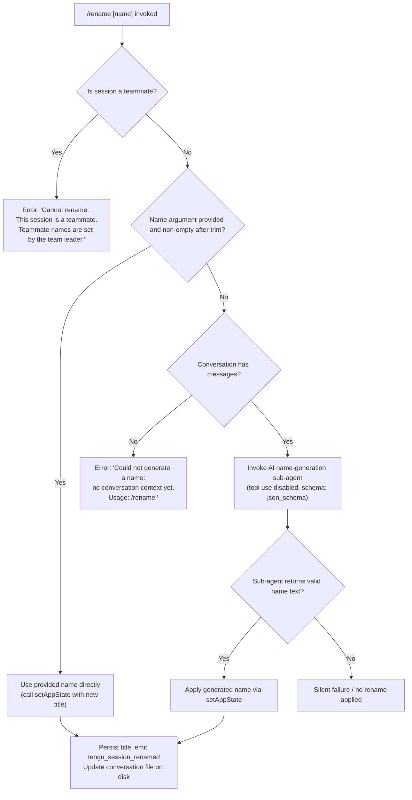

# `/rename`

> Analysis basis: CC v2.1.167 bundle.js (AST extraction + Claude interpretation)
> Minimum version: v2.1.167

---

## Overview

The `/rename` command renames the current Claude Code conversation session. It accepts an optional inline name argument; if none is supplied and the conversation has sufficient context, it delegates to a model-backed name-generation sub-agent to produce one automatically. The resulting name is persisted to the session storage layer and emits a telemetry event confirming the rename.

---

## Registration

| Field | Value |
|---|---|
| type | `local-jsx` |
| name | `rename` |
| description | `Rename the current conversation` |
| argumentHint | `[name]` |
| immediate | `true` |
| aliases | `["name"]` |
| module_id | `Kaq` |
| load_inline | `true` |
| loc_byte | `12035159` |
| loc_byte_end | `12035358` |
| loc_line | `8341` |
| arbor_handler.name | `PNf` |
| arbor_handler.fqn | `claude-2.1.167::PNf` |
| arbor_handler.kind | `AsyncFunction` |
| arbor_handler.resolution_path | `module_id` |
| arbor_handler.n_hits | `0` |

Analysis basis: CC v2.1.167 bundle.js:+12035159

---

## Input Branching

The command has four distinct execution paths depending on whether a name argument is provided, whether the session is a teammate session, and whether sufficient conversation context exists for AI name generation.



Analysis basis: CC v2.1.167 bundle.js:+12034303 (teammate guard), +12034422 (trim), +12034534 (no-context error), +12034323 (teammate error literal)

---

## Behavioral Spec

### Top-level handler (`PNf`)

The Arbor-resolved handler is `PNf` (AsyncFunction), entered from the command registration via `module_id` resolution path.

```
async function renameCommandHandler(args, context):
    nameArgument = args.trim()
    
    # Step 1: teammate guard
    if currentSessionIsTeammate(context):
        displayError("Cannot rename: This session is a teammate. ...")
        return
    
    # Step 2: direct rename if name supplied
    if nameArgument is not empty:
        applyRename(nameArgument, origin="other", context)
        return
    
    # Step 3: AI-generated rename
    messages = getConversationMessages(context)
    if messages is empty:
        displayError("Could not generate a name: no conversation context yet. ...")
        return
    
    generatedName = await generateNameViaSubAgent(messages, context)
    if generatedName:
        applyRename(generatedName, origin="rename_generate_name", context)
```

Analysis basis: CC v2.1.167 bundle.js:+12034855 (PNf entry), +12034185 (teammate check call), +12034422 (trim), +12034662 (setAppState call)

---

### Teammate guard (`QR8` / `NE`)

```
function isTeammateSession(context):
    store = getAsyncLocalStore()   # via qG → GM_.getStore
    return store.sessionRole === "teammate"
```

Analysis basis: CC v2.1.167 bundle.js:+12034185, +2255441

---

### Name trimming and validation (`dR8`)

The immediate sub-handler `dR8` orchestrates the full rename flow. It trims the raw argument string, checks the teammate flag, decides between direct-apply and AI-generation paths, calls `setAppState`, and invokes the session-file write helpers.

```
async function renameOrchestrator(rawArg, context):
    trimmedName = rawArg.trim()   # loc +12034422
    
    if isTeammateSession(context):
        return errorMessage("Cannot rename: ...")   # loc +12034323
    
    if trimmedName.length > 0:
        persistSessionName(trimmedName, "other", context)
    else:
        conversationMessages = collectMessages(context)
        if conversationMessages.length === 0:
            return errorMessage("Could not generate a name: ...")   # loc +12034534
        generatedName = await runNameGenerationAgent(conversationMessages, context)
        if generatedName:
            persistSessionName(generatedName, "rename_generate_name", context)
```

Analysis basis: CC v2.1.167 bundle.js:+12034303, +12034456, +12034662, +12034704

---

### AI name-generation sub-agent (`R96` → `XNf`)

When no name is supplied and messages exist, `R96` sets up a forked sub-agent call. Key behaviours observed from the call graph and literals:

```
async function runNameGenerationAgent(messages, context):
    # Telemetry: fork started
    emit("tengu_rename_full_session_fork")   # loc +12033011
    
    abortController = createAbortController()
    abortController.signal.addEventListener("abort", ...)   # loc +12032257
    
    # Tool use is explicitly denied for this sub-agent
    # Literal "deny" at loc +12032453
    # Literal "Session name generation cannot use tools" at loc +12032468
    toolPolicy = { mode: "deny", reason: "Session name generation cannot use tools" }
    
    # Response schema is json_schema with a "name" field
    # Literal "json_schema" at loc +12033383
    # Literal "name" at loc +12032116
    responseSchema = { type: "json_schema", schema: { name: string } }
    
    # Sub-agent uses "rename" as the call type
    # Literal "rename" at loc +12032547
    # Literal "rename_generate_name" at loc +12032571
    subAgentResult = await invokeForkedAgent(
        messages = messages,
        toolPolicy = toolPolicy,
        responseSchema = responseSchema,
        callType = "rename_generate_name"
    )
    
    # Extract text content from result
    # Literal "text" at loc +12032794
    nameText = extractTextContent(subAgentResult)
    return nameText.trim()
```

Analysis basis: CC v2.1.167 bundle.js:+12033008, +12032207, +12032257, +12032335, +12032453, +12032468, +12032547, +12032571, +12033383, +12032116, +12032794

---

### Message collection for name generation (`FR8`)

```
function collectMessagesForRename(conversationState):
    messages = []
    for each message in conversationState:
        if message.origin === "human" or message.isMeta === false:
            messages.push(message)   # loc +12029826
    # Array check and join performed before passing to sub-agent
    if Array.isArray(messages):
        return messages.join(separator)   # loc +12029942
    return messages.slice(...)   # loc +12029974
```

Analysis basis: CC v2.1.167 bundle.js:+12029826, +12029844, +12029942

---

### Session rename persistence (`abH` → `HR` / `lMH`)

After a name (direct or AI-generated) is determined, it is written to both the in-memory app state and the on-disk session file:

```
function persistSessionName(name, origin, context):
    # Write to app state
    context.setAppState({ sessionTitle: name })   # loc +12034662
    
    # Determine title type tag
    titleTag = (origin === "other") ? "custom-title" : "ai-title"
    # Literals "custom-title" loc +13234083, "ai-title" loc +13234247
    
    # Write to session log file
    appendToSessionFile(name, titleTag)   # via Q$H → A.appendFileSync loc +13233130
    
    # Update session-key mapping files
    updateSessionKeyMapping(name)   # via lMH → ed
    
    # Emit telemetry
    emit("tengu_session_renamed")   # loc +13234175
    
    # Emit agent name event if sub-agent context
    emit("tengu_agent_name_set")    # loc +13237203
    
    # Emit PMA event
    PMA.emit(...)    # loc +13237190
```

Analysis basis: CC v2.1.167 bundle.js:+12034662, +13234083, +13234247, +13233130, +13234175, +13237203

---

### Session file operations (`enK` → `cl8`)

The session file rename/update logic handles the on-disk conversation log:

```
async function renameSessionFile(oldPath, newName, context):
    stats = await fs.stat(oldPath)   # loc +205407
    
    if oldPath.endsWith(".txt"):     # loc +205500
        trimmedPath = oldPath.slice(0, -4)   # loc +205522
    
    newPath = buildNewPath(trimmedPath, newName)
    await fs.rename(oldPath, newPath)   # loc +205563
    
    # If old file still exists (e.g. EISDIR edge case), unlink it
    if oldFileExists:
        await fs.unlink(oldPath)   # loc +205603
```

Analysis basis: CC v2.1.167 bundle.js:+205407, +205500, +205522, +205563, +205603

---

### Path construction helpers (`YKH`, `M0A`)

```
function buildSessionTitlePath(baseDir, name):
    return path.join(IHH, name)   # via IHH.join loc +206844

function buildSessionMetaPath(baseDir):
    return path.join(IHH, R6)    # via M0A → IHH.join loc +205767
```

Analysis basis: CC v2.1.167 bundle.js:+206792, +206844, +205767

---

## State & Side Effects

| Item | Detail |
|---|---|
| Telemetry: `tengu_rename_full_session_fork` | Fired when the AI name-generation sub-agent is invoked (no user-supplied name, messages exist) — bundle.js:+12033011 |
| Telemetry: `tengu_session_renamed` | Fired after every successful rename (direct or AI-generated) — bundle.js:+13234175 |
| Telemetry: `tengu_agent_name_set` | Fired when the agent name is updated in the sub-agent context — bundle.js:+13237203 |
| Telemetry: `tengu_fork_agent_query` | Fired during forked sub-agent query lifecycle — bundle.js:+10943682 |
| Telemetry: `tengu_forked_agent_default_turns_exceeded` | Fired if the name-generation sub-agent exceeds turn limits — bundle.js:+10943239 |
| `appState` changes | `setAppState` called with new session title — bundle.js:+12034662 |
| On-disk session file | File renamed via `fs.rename` / `fs.unlink`; title appended via `appendFileSync` with `custom-title` or `ai-title` tag — bundle.js:+205563, +13233130 |
| Session key mapping | Updated via `ed` / `mz6` helpers using `Vh.readFile` + `Vh.writeFile` — bundle.js:+2258607, +2258636 |
| Event emission | `PMA.emit` fired after persistent write — bundle.js:+13237190 |
| `$b6.emit` | Emitted during HR/He rename finalisation path — bundle.js:+13234162, +13234320 |
| Sub-agent tool use | Explicitly denied (`"deny"`) during AI name generation; no tools may be called — bundle.js:+12032453 |
| Sound | <!-- TODO: not found in depth-2 traversal; needs --depth 4 --> |

---

## Version History

| Version | Change |
|---|---|
| v2.1.167 | Initial analysis |

---

## Common Mistakes

1. **Providing the command in a teammate session** — The command will immediately error with "Cannot rename: This session is a teammate. Teammate names are set by the team leader." (bundle.js:+12034323). The rename must be performed by the team leader session.

2. **Invoking `/rename` with no argument before any messages exist** — The AI name-generation path requires at least one conversation message. With an empty conversation the command fails with "Could not generate a name: no conversation context yet. Usage: /rename \<name\>" (bundle.js:+12034534).

3. **Expecting the alias `/name` to behave differently** — `/name` is a registered alias for `/rename` and executes the identical handler. There is no behavioral difference.

4. **Assuming the rename is purely in-memory** — The name is written to the on-disk session file (via `fs.rename` and `appendFileSync`) as well as to app state. Concurrent external modifications to the session file may conflict.

5. **Expecting tool use during AI name generation** — The name-generation sub-agent runs with `tool use = deny`. Any expectation that it can read files or run commands to pick a name is incorrect; it works only from the conversation messages already in context.

---

## Appendix — Identifier Mapping

> For bundle debugging only. Identifiers change across versions.

| Identifier | Role |
|---|---|
| `PNf` | Top-level async handler for `/rename` (Arbor-resolved entry point) |
| `dR8` | Rename orchestrator: trims arg, branches between direct/AI-generate paths |
| `QR8` | Teammate-session guard check |
| `NE` | Helper called by teammate guard to retrieve session role |
| `JM` | Async store accessor (calls `qG`) |
| `qG` | Retrieves value from `GM_.getStore` (async local storage) |
| `R96` | AI name-generation sub-agent launcher (forks agent, sets up abort) |
| `XNf` | Forked agent executor: sets tool-deny policy, schema, abort listener |
| `EG` | Core forked-query runner (calls `CN8`, `bN8`, etc.) |
| `CN8` | Gets/sets app state during sub-agent execution |
| `FR8` | Message collector / serialiser for rename context |
| `qaq` | Message normalisation helper used in name-generation path |
| `tR` | Trim helper on message text |
| `abH` | Session rename finaliser: writes title tag, updates files, emits events |
| `HR` | Writes title to session log (`custom-title` tag path) |
| `He` | Writes title to session log (`ai-title` tag path) |
| `lMH` | Session key-mapping updater; emits `tengu_agent_name_set` and `PMA.emit` |
| `ed` | Conversation metadata read/write (reads then rewrites session file) |
| `mz6` | Low-level file read+write for session metadata JSON |
| `Q$H` | Appends title entry to session log file via `appendFileSync` |
| `Zv` | Title formatting helper (builds log line with `R6`, `TM`, `W_`) |
| `enK` | Session file rename/update orchestrator |
| `cl8` | Performs `fs.stat`, `fs.rename`, `fs.unlink` on session file |
| `YKH` | Builds destination path for renamed session file |
| `M0A` | Builds session metadata file path |
| `U76` | Path utility used in session file operations |
| `tnK` | Creates destination directory and appends to new session file |
| `YjH` | Session job/state watcher; manages file watch lifecycle |
| `e9` | Reads and parses session state file; manages R7H cache |
| `zf` | Atomic file writer (random-bytes temp file + rename) |
| `XY` | Low-level atomic write: `writeFile` + `rename` / `copyFile` / `unlink` |
| `aj` | Derives session basename from path and `R6` format |
| `D6` | Session loader / cache manager (checks `IB`, `HwH`) |
| `C6` | Session initialiser (calls `LwH`, `IVL`, timestamps) |
| `LwH` | Session config file reader (reads JSON, creates dirs, backups) |
| `IVL` | File watcher registration for session config |
| `dq8` | Deduplication helper: checks `SP_`/`HwH` before loading session |
| `yP_` | Emits `growthbook_experiment` event; used in session init path |
| `xP_` | Processes loaded session data |
| `GH` | String coercion utility (`String(...)`) |
| `GzK` | Main agent query loop (streaming, tool dispatch, retry logic) |
| `qS` | Wraps sub-agent call: passes messages through `oI8`, `ME`, `fuH` |
| `oI8` | Message serialiser / cache-hash builder for API calls |
| `ME` | Message normalisation for API request body |
| `fuH` | Sub-agent result extractor; throws if no assistant message found |
| `$e_` | Filters and collects sub-agent output blocks |
| `D2` | Constructs model/provider config for sub-agent |
| `MA` | Model alias resolver (`_6`) |
| `YM_` | Auth-key type detector (`/login managed key`, `sk-ant-` prefix) |
| `H9` | Title/heading sanitiser for model names |
| `s9` | Normalises model shorthand (opusplan, sonnet, haiku, opus, best) |
| `v` | Title-string builder: upper-cases, replaces chars, trims |
| `G4` | File-extension stripper and path-component extractor |
| `EUH` | Session write helper (calls `lWA`) |
| `lWA` | Calls `H.write` to persist session data |
| `npH` | Debounce/flush utility (clearTimeout/setTimeout/setImmediate) |
| `j9` | Registers VPA handler |
| `Yh8` | Object-keys helper for app state pruning |
| `Xp` | Sub-agent exit-reason classifier (completed, hook_stopped, etc.) |
| `Hh6` | Checks `jOf` set for message-type tombstone/summary filtering |
| `iCq` | Calls `Hh6` for secondary message type filtering |
| `D` | Process-exit / abort handler (`IJ`, `process.exit`, `z.abort`) |
| `QfH` | Filters messages by set membership (`L.has`) |
| `wDf` | Renders fork-agent result as JSX (`l`, `J6`) |
| `u8` | Text-input component builder (calls `P`, `X`) |
| `P` | Input field component with onChange/setOffset/execute |
| `X` | Buffer reader with timeout and subarray handling |
| `PS` | Random-bytes generator (`fw8.randomBytes`, 8 bytes, hex) |
| `A9H` | Post-sub-agent handler (calls `r4`, `vbH`) |
| `r4` | Registers cleanup via `j9` |
| `sK` | Filters conversation messages by type for rename context |
| `M` | MCP server manager (xbH, XF8, L.get, dDA) |
| `xbH` | MCP connection handler per server entry |
| `XF8` | Applies MCP connection result, handles orphaned connections |
| `dDA` | Reconciles MCP server config changes |
| `oL` | CCR-mode helper (calls `uTH`) |
| `G2` | Additional session-context helper in abH path |
| `q9H` | Session metadata accessor in abH path |
| `TE` | Teardown/cleanup entry in abH path |
| `pt` | Promise wrapper in abH path |
| `_6` | String coercion (`String(value)`) |
| `AA` | Error formatter (`Error`, `String`) |
| `hH` | Error logging helper (`_6`, `$q`, `zG4`, `PFH.push`, `pr.logError`) |
| `$q` | Queries `QRA` for error context |
| `zG4` | Rotates `Sc6` buffer (shift/push) |
| `RK` | Path join helper using `y2.join` and `sT` |
| `sT` | Builds path segment with `t8` |
| `oj` | Deletes entry from `R7H` |
| `fz` | Checks `eTH` membership before writing; calls `GH`, `hH` |
| `Tf` | Calls `V8` error handler |
| `h8` | Calls `V8` error handler (alternate) |
| `V8` | Core error/exception handler |
| `Lf` | Provider/locale formatter in D2 path |
| `nT` | Finaliser called after sub-agent qS completes |
| `K4` | Configuration accessor used in sub-agent setup |
| `tv` | Translation/i18n string lookup |
| `qy` | Formatter helper used by TM/Zv |
| `TM` | Builds formatted title string (`xR`, `SO`, `W_`, join) |
| `xR` | Calls `tv` for string lookup |
| `W_` | Calls `tv` for string lookup |
| `SO` | Separator/spacer in title formatting |
| `lHH` | Checks `i74` set (feature-flag membership test) |
| `uj_` | Splits and trims model identifier strings |
| `uj` | Replaces characters in model name strings |
| `IJ` | Import-job helper referenced in forced-shutdown path |
| `cy6` | Connection classification helper in MCP path |
| `yhq` | MCP connection metrics collector |
| `UD8` | Calls `pD8` and `EP` in MCP diagnostics |
| `uD8` | Calls `z4` in MCP auth path |
| `M8` | Pushes to `PFH` and calls `pr.logMCPDebug` |
| `Dk8` | OAuth tool registration handler |
| `wk8` | OAuth callback completion handler |
| `mhq` | MCP pending-auth resolver |
| `Ee_` | MCP error display (`EP`, `z4`, `M8`, `GH`) |
| `Chq` | Calls `AF` for MCP connection type check |
| `K16` | Parses integer MCP port config |
| `ck8` | Parses integer MCP retry config |
| `bbH` | Calls `tXH` in MCP connection result application |
| `_y` | MCP cleanup (`A16`, `K.cleanup`, `tN`) |
| `zLK` | Persists session snapshot (`Yo`, `Date.now`, `V9`, `zC6`, `RH`) |
| `lD8` | Checks `Dj7` and `hx_` sets for MCP auth state |
| `A16` | Calls `tXH` in MCP teardown path |
| `tN` | Calls `D6` in MCP/session node creation |
| `yx_` | Checks `A.includes` against `X8` allowlist |
| `k` | Chokidar file-watcher wrapper (`v`, `l`, `P6`, `R`) |
| `v7` | MCP error logger (`PFH.push`, `pr.logMCPError`) |
| `j` | Process kill handler (`A.values`, `S.kill`) |
| `$` | Calls `zLK` for session snapshot persistence |