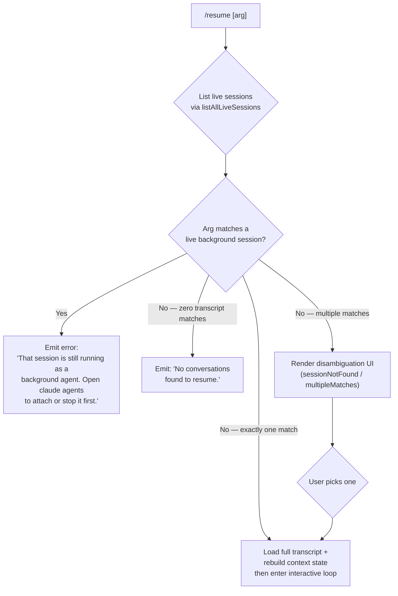

# `/resume`

> Analysis basis: CC v2.1.167 bundle.js (AST extraction + Claude interpretation)
> Minimum version: v2.1.167

---

## Overview

`/resume` (alias: `/continue`) allows the user to re-enter a previously saved conversation by supplying either a conversation UUID or a free-text search term. The command queries live session state and the on-disk conversation store, presents matching candidates when needed, then reconstructs the full conversation context before handing off to the standard interactive loop.

---

## Registration

| Field | Value |
|---|---|
| type | `local-jsx` |
| name | `resume` |
| description | `Resume a previous conversation` |
| aliases | `["continue"]` |
| argumentHint | `[conversation id or search term]` |
| module_id | `geq` |
| load_inline | `true` |
| loc_byte | `12215122` |
| loc_byte_end | `12215319` |
| loc_line | `8529` |
| arbor_handler.name | `kyf` |
| arbor_handler.fqn | `claude-2.1.167::kyf` |
| arbor_handler.kind | `AsyncFunction` |
| arbor_handler.resolution_path | `module_id` |
| arbor_handler.n_hits | `0` |

Analysis basis: CC v2.1.167 bundle.js:+12215122

---

## Input Branching

Four distinct execution paths are present, depending on session live-state and argument matching.



Analysis basis: CC v2.1.167 bundle.js:+12213724 (live-session guard string), +12214159 (no-match string), +12211368 (sessionNotFound key), +12211439 (multipleMatches key)

---

## Behavioral Spec

### 1. Entry point — `resumeCommandHandler` (`kyf`)

The Arbor-resolved handler is `kyf` (AsyncFunction, resolved via `module_id` → `geq`).

```
async function resumeCommandHandler(commandInput, appContext):

    # Step 1 — query live sessions
    liveSessions = await listAllLiveSessions(appContext)   // AMH → A.listAllLiveSessions

    # Step 2 — guard: block resuming active background sessions
    for each session in liveSessions:
        if session.mode == "interactive" and matchesArg(commandInput.arg, session):
            return renderError(
                "That session is still running as a background agent. " +
                "Open `claude agents` to attach to it, or stop it there first to resume here."
            )

    # Step 3 — timestamp the resume attempt
    resumeTimestamp = Date.now()       // kyf → Date.now

    # Step 4 — enumerate worktree conversation candidates
    candidates = await enumerateSessionCandidates(appContext, commandInput)  // _MH

    # Step 5 — filter by argument
    filtered = filterCandidates(candidates, commandInput.arg)  // f.filter, BF

    # Step 6 — branch on match count
    if filtered.length == 0:
        return renderMessage("No conversations found to resume.")

    if filtered.length == 1:
        selected = filtered[0]
    else:
        selected = await presentDisambiguationUI(filtered)   // Ueq → j6.bold, X$H
        // keys: sessionNotFound / multipleMatches

    # Step 7 — load full transcript store for selected session
    transcriptStore = await loadTranscriptState(selected)  // n86 → A3K → r1H

    # Step 8 — compute context (tools, MCP, settings)
    sessionContext = await buildContextFromTranscript(transcriptStore)  // LMH, Mi, SC8

    # Step 9 — emit telemetry
    emitTelemetry("slash_command_session_id", selected.uuid)   // literal +12214420
    emitTelemetry("slash_command_title", selected.title)        // literal +12214644

    # Step 10 — enter interactive loop with restored context
    return renderRestoredSession(sessionContext, fj.createElement)
```

Analysis basis: CC v2.1.167 bundle.js:+12213714 (AMH call), +12213722 (H live-session loop), +12213724 (guard string), +12213945 (hH logger), +12214036 (Date.now), +12214081 (_MH), +12214260 (BF filter), +12214278 (f.filter), +12214292 (S$ render), +12214386 (Et), +12214398 (LMH), +12214414 (q), +12214465 (n86), +12214526 (X$H), +12214545 (Mi), +12214694 (Ueq)

---

### 2. Session enumeration — `worktreeSessionEnumerator` (`_MH`)

```
async function worktreeSessionEnumerator(appContext, inputArg):

    # Discover git worktrees
    worktrees = runGit(["worktree", "list", "--porcelain"])   // literals +9033131,+9033138

    for each worktree path:
        # Normalise path
        normPath = normalizePath(worktree)            // jO → H.normalize

        # Prefix match against "worktree " prefix (9 chars)
        if line.startsWith("worktree "):              // literal +9033339, number 9 at +9033373
            extract worktree root

    # Locate daemon status files
    statusFiles = findStatusFiles("daemon.status.json")   // literal +12780168 via zLK/zC6

    # Filter + sort candidates by localeCompare
    result = candidates
        .filter(c => c.path.startsWith(searchRoot))       // H.startsWith +9033484
        .filter(c => matchesArg(c, inputArg))              // L.filter +9033511
        .sort((a, b) => a.id.localeCompare(b.id))          // $.localeCompare +9033544

    return result
```

Analysis basis: CC v2.1.167 bundle.js:+9033076 (_MH entry), +9033114 (LA), +9033301 (A.split), +9033326 ($.startsWith), +9033362 (jO), +9033365 ($.slice), +9033465 (L.find), +9033484 (H.startsWith), +9033511 (L.filter), +9033544 ($.localeCompare)

---

### 3. Transcript store loading — `transcriptStateLoader` (`n86` / `A3K` / `r1H`)

```
async function transcriptStateLoader(selectedSession):

    # Parse on-disk JSONL transcript via r1H (the core transcript reader)
    rawRecords = await readTranscriptFile(selectedSession.path)  // r1H → wL.readFile +13248654

    # Reconstruct message chain
    messageChain = buildMessageChain(rawRecords)    // KMH → eQf, Adf

    # Hydrate metadata maps (summary, last-prompt, custom-title, ai-title, tags, …)
    metaMaps = hydrateMetaMaps(rawRecords)
    # Known metadata keys found in literals:
    #  "summary"            +13246552
    #  "last-prompt"        +13246619
    #  "custom-title"       +13246715
    #  "ai-title"           +13246793
    #  "tag"                +13246863
    #  "agent-name"         +13246924
    #  "agent-color"        +13246998
    #  "agent-setting"      +13247074
    #  "mode"               +13247154
    #  "permission-mode"    +13247217
    #  "isolation-latch"    +13247301
    #  "worktree-state"     +13247375
    #  "pr-link"            +13247459
    #  "bridge-session"     +13247590
    #  "file-history-snapshot"    +13247711
    #  "attribution-snapshot"     +13247773
    #  "fork-context-ref"         +13248050

    # Read binary snapshot if present (wdf — JSONL binary parser)
    if snapshotExists:
        snapshot = parseJSONLBinary(selectedSession.snapshotPath)  // wdf +13244245

    return { messageChain, metaMaps, snapshot }
```

Analysis basis: CC v2.1.167 bundle.js:+13250558 (Jdf entry), +13250573 (A3K → r1H), +13248654 (wL.readFile), +13246552–+13248050 (metadata key literals)

---

### 4. Context rebuild — `sessionContextBuilder` (`LMH` + `Mi`)

```
async function sessionContextBuilder(transcriptStore):

    # Rebuild tool availability from stored snapshot
    toolState   = buildToolState(transcriptStore.metaMaps)      // LMH → r1H → u$K

    # Re-init MCP connections listed in session metadata
    mcpState    = rebuildMCPConnections(transcriptStore)         // LMH → dDA / xbH / XF8

    # Re-establish file-context (worktree paths, real paths)
    fileContext = buildFileContext(transcriptStore)              // Mi → q3K → wL.realpath

    # Apply compact boundaries if present
    if transcriptStore has "compact_boundary" records:           // literal +10780519
        applyCompactBoundary(fileContext)

    return { toolState, mcpState, fileContext }
```

Analysis basis: CC v2.1.167 bundle.js:+13238856 (LMH → Et), +13239284 (r1H), +13240588 (Mi → _MH), +13240606 (Mi → q3K), +13253107 (SC8 → zb6 → q3K)

---

### 5. Live-session guard — `liveSessionFilter` (`AMH`)

```
async function liveSessionFilter(appContext):
    # Resolve active sessions from daemon
    resolvedSessions = await Promise.resolve(appContext)    // AMH → Promise.resolve +9042261
    allLive          = await Q86(resolvedSessions)          // AMH → Q86 +9042291
    liveSessions     = allLive.listAllLiveSessions()        // A.listAllLiveSessions +9042313

    # Only "interactive" sessions are relevant for the guard
    interactiveSessions = liveSessions.filter(s => s.mode == "interactive")  // literal +9042404

    return interactiveSessions
```

Analysis basis: CC v2.1.167 bundle.js:+12213714 (kyf → AMH), +9042261–+9042404

---

### 6. Disambiguation UI renderer (`Ueq`)

```
function renderDisambiguationUI(candidates):
    # Bold-format session titles for display
    formattedItems = candidates.map(c => j6.bold(c.title))   // Ueq → j6.bold +12211403

    # Render two possible states:
    #   "sessionNotFound"   — arg was given but nothing matched  (+12211368)
    #   "multipleMatches"   — arg matched more than one entry    (+12211439)
    if candidates.length == 0:
        return render(key="sessionNotFound")
    else:
        return render(key="multipleMatches", items=formattedItems)
```

Analysis basis: CC v2.1.167 bundle.js:+12214694 (kyf → Ueq), +12211403 (j6.bold), +12211368 (sessionNotFound), +12211439 (multipleMatches)

---

## State & Side Effects

| Item | Detail |
|---|---|
| Telemetry — `slash_command_session_id` | Emitted with the UUID of the session being resumed (bundle.js:+12214420) |
| Telemetry — `slash_command_title` | Emitted with the display title of the session (bundle.js:+12214644) |
| Telemetry — `tengu_worktree_detection` | Fired during worktree enumeration (bundle.js:+9033220) |
| Telemetry — `tengu_feature_ok` / `tengu_feature_bad` / `tengu_feature_sad` | Feature-level outcome events emitted by the outer command dispatcher (bundle.js:+1010950, +1011012, +1011093) |
| File I/O | Reads JSONL transcript files via `wL.readFile` and binary snapshot parsing via `wdf`; may call `ly.rename` / `ly.unlink` on stale `.txt` temp files (bundle.js:+205511, +205563, +205603) |
| appState changes | Restores all session metadata maps (summary, mode, MCP connections, tool state, file-history snapshots, attribution snapshots, worktree-state) into the running app state via `r1H` |
| MCP re-connection | Calls `dDA` → `xbH` → `XF8` (`H.applyMcpUpdate`) to re-apply any MCP server configuration stored in the session (bundle.js:+15879395) |
| Process context | Conversation history is re-injected into the daemon context; daemon background-session guards prevent double-attach (literal: "That session is still running…" at +12213724) |
| JSX rendering | Uses `fj.createElement` (bundle.js:+12214010) to produce the React/Ink UI for the disambiguation picker and restored session header |
| Hook registration | `j9` → `VPA.register` (bundle.js:+60369) — registers a cleanup/teardown hook after transcript append begins |

---

## Version History

| Version | Change |
|---|---|
| v2.1.167 | Initial analysis |

---

## Common Mistakes

1. **Trying to resume a running background session** — `/resume` will refuse with an explicit error message directing the user to `claude agents`. The session must be stopped there first.
2. **Ambiguous search terms** — If the free-text argument matches more than one stored conversation, a disambiguation picker is shown; supplying a full UUID avoids this.
3. **Using `/resume` with no argument when multiple conversations exist** — Without an argument, all conversations match; the disambiguation UI will appear listing all candidates.
4. **Expecting immediate tool availability** — MCP connections are re-established asynchronously during context rebuild; tools that rely on MCP servers may not be immediately available at the first turn of the resumed session.
5. **Confusing `/resume` with `/continue`** — Both names invoke the same handler; there is no behavioral difference between them.

---

## Appendix — Identifier Mapping

> For bundle debugging only. Identifiers change across versions.

| Identifier | Role |
|---|---|
| `kyf` | Main async handler for `/resume` (Arbor-resolved entry point) |
| `Feq` | Outer command wrapper / registration loader |
| `AMH` | Live-session query helper (calls `listAllLiveSessions`) |
| `_MH` | Worktree session enumerator (git worktree list + candidate sorting) |
| `n86` | Conversation candidate loader (delegates to `A3K`) |
| `A3K` | Transcript store initialiser (wraps `r1H` + `Object.assign`) |
| `r1H` | Core transcript state machine (reads JSONL, builds all metadata maps) |
| `LMH` | Session context builder (tool state, MCP, file context) |
| `Mi` | File-context assembler (delegates to `q3K`, `IuH`, `_MH`) |
| `SC8` | Sub-command context builder (wraps `zb6`) |
| `zb6` | Context formatter (joins paths, calls `q3K`) |
| `q3K` | Directory/file walker and context aggregator |
| `Ueq` | Disambiguation UI renderer (bold-formats session titles) |
| `X$H` | Session picker component |
| `hH` | Error/log helper (wraps `AA` and `_6`) |
| `GH` | String-coercing display helper |
| `BF` | Candidate filter (applies regex `Rj7.test`) |
| `S$` | Render helper used in multiple branches |
| `Et` | Transcript entry-type classifier |
| `enK` | Append-to-transcript / persist helper |
| `KMH` | Message-chain builder (topological sort of JSONL records) |
| `Adf` | Message chain compaction / deduplication |
| `eQf` | Chain walk helper (shift/push ordered list) |
| `t$K` | Metadata key→value extractor |
| `_df` | NaN-safe metadata validator |
| `wdf` | Binary JSONL snapshot parser (uses `XR.openSync`/`readSync`) |
| `jdf` | Secondary binary snapshot reader |
| `Ddf` | Buffer-based JSONL diff/patch reader |
| `Eu8` | Date-parse utility for transcript timestamps |
| `Jdf` | Candidate path resolver (stat + hW directory walk) |
| `xR` | Path root resolver (calls `tv`) |
| `hW` | Recursive directory walker |
| `_MA` | Metadata accessor combining `DMA`, `l86`, `jMA` |
| `DMA` | Message display-text extractor |
| `l86` | Message list mapper |
| `jMA` | Content-type classifier (`qdf`/`Kdf`) |
| `u$K` | Tool-capability state rebuilder |
| `tQf` | Tool-chain relink walker |
| `KH` | Transcript record dispatcher |
| `dDA` | MCP connection state reconciler |
| `xbH` | MCP client connection manager |
| `XF8` | MCP connection result applier (`H.applyMcpUpdate`) |
| `C_` | Child-process / conversation runtime launcher |
| `YZH` | Subprocess spawn coordinator |
| `zLK` | Daemon status file reader |
| `zC6` | Daemon status path builder |
| `jO` | Path normaliser (`H.normalize`, NFC) |
| `V8` | App-state accessor |
| `W_` | Current-working-directory resolver (calls `tv`) |
| `j9` | Hook registrar (`VPA.register`) |
| `enK` | Transcript append orchestrator |
| `cl8` | Transcript file rename/unlink helper |
| `tnK` | Transcript mkdir + appendFile helper |
| `M0A` | Transcript path builder |
| `U76` | Conversation directory resolver |
| `npH` | Buffered-write queue (setTimeout/setImmediate flush) |
| `YKH` | Write-queue renderer |
| `Ueq` | Disambiguation UI renderer |
| `Feq` | Outer command wrapper |

---

Note: index built via Arbor fallback; some signals (telemetry, literals) may be missing — see arbor-fallback.js.