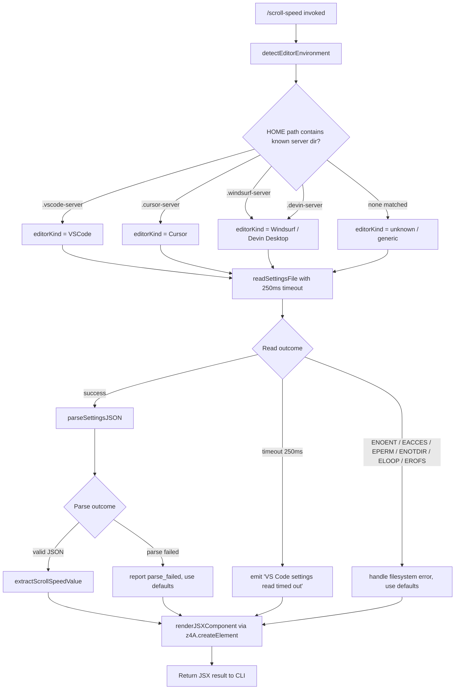

# `/scroll-speed`

> Analysis basis: CC v2.1.167 bundle.js (AST extraction + Claude interpretation)
> Minimum version: v2.1.167

---

## Overview

The `/scroll-speed` command adjusts the mouse wheel scroll speed within the Claude Code terminal UI. Its implementation reads the host editor's `settings.json` file (detecting VS Code, Cursor, Windsurf, or Devin Desktop environments), applies a timed read with a 250 ms timeout, and renders a JSX component to expose the resulting scroll-speed configuration to the user.

---

## Registration

| Field | Value |
|---|---|
| type | `local-jsx` |
| name | `scroll-speed` |
| description | Adjust mouse wheel scroll speed |
| loc_byte | 12267859 |
| loc_byte_end | 12268107 |
| loc_line | 8646 |
| module_id | `gHK` |
| load_inline | `true` |
| arbor_handler.name | `hhf` |
| arbor_handler.fqn | `claude-2.1.167::hhf` |
| arbor_handler.kind | `AsyncFunction` |
| arbor_handler.resolution_path | `module_id` |
| arbor_handler.n_hits | 0 |

Analysis basis: CC v2.1.167 bundle.js:+12267859

---

## Input Branching

The command has 3+ distinct branches based on editor environment detection and file-read outcomes. A Mermaid flowchart is used.



Analysis basis: CC v2.1.167 bundle.js:+12267622, +12267625, +12267631, +12267635, +4034689, +4034700, +4038863

---

## Behavioral Spec

### 1. Handler Entry (`hhf`)

The main handler is the async function `hhf` (resolved via `module_id → gHK`). It orchestrates the following steps in sequence:

```
async function scrollSpeedHandler(context):
    result = await timedSettingsRead(250)        // 250 ms hard timeout
    editorSettings = await readEditorSettings()  // reads settings.json
    jsxElement = createScrollSpeedComponent(result, editorSettings)
    return jsxElement
```

Analysis basis: CC v2.1.167 bundle.js:+12267622, +12267625, +12267693

---

### 2. Timed Settings Read (`IL`)

A utility function wraps any async operation in a `Promise.race` against a `setTimeout`-based timeout promise. The timeout value is **250 milliseconds** (bundle.js:+12267631). If the timeout fires first, the function resolves with a sentinel indicating timeout; `clearTimeout` is called on the winner path to prevent leaks.

```
function timedRead(asyncFn, timeoutMs = 250):
    timeoutPromise = new Promise(resolve =>
        handle = setTimeout(() => resolve(TIMEOUT_SENTINEL), timeoutMs)
    )
    result = await Promise.race([asyncFn(), timeoutPromise])
    clearTimeout(handle)
    if result === TIMEOUT_SENTINEL:
        emit("VS Code settings read timed out")   // literal at +12267635
    return result
```

Analysis basis: CC v2.1.167 bundle.js:+2298995, +2299026, +2299073, +12267631, +12267635

---

### 3. Editor Environment Detection (`uE_` → `qf8`)

The function `uE_` determines which IDE/editor is hosting the Claude Code session by inspecting the filesystem paths available in the environment. The sub-function `qf8` checks whether known server-directory substrings appear in the path set:

| Substring checked | Mapped editor label |
|---|---|
| `.vscode-server` | VSCode |
| `.cursor-server` | Cursor |
| `.windsurf-server` | Windsurf / Devin Desktop |
| `.devin-server` | Devin Desktop |

```
function detectEditorEnvironment(paths):
    if paths.includes(".vscode-server"):
        return { display: "VSCode", kind: "vscode" }
    if paths.includes(".cursor-server"):
        return { display: "Cursor", kind: "cursor" }
    if paths.includes(".windsurf-server") or paths.includes(".devin-server"):
        return { display: "Devin Desktop" / "Windsurf", kind: "windsurf" }
    return { display: null, kind: null }
```

Analysis basis: CC v2.1.167 bundle.js:+4038816, +4038829, +4034689, +4034700, +4034730, +4034760, +4034792, +4039152, +4039167, +4039180, +4039195, +4039208, +4039225

---

### 4. Settings File Read (`uE_` → `v2.readFile`)

Once the editor environment is identified, the handler constructs the path to the editor's `settings.json` and reads it using the filesystem API:

```
function readEditorSettingsFile(editorKind, homePath):
    settingsPath = path.join(homePath, editorServerDir, "settings.json")
    try:
        raw = await fs.readFile(settingsPath, "utf-8")
        return parseJSON(raw)
    catch error:
        if error.code in [ENOENT, EACCES, EPERM, ENOTDIR, ELOOP, EROFS]:
            return DEFAULT_SETTINGS   // graceful degradation
        else:
            logError(error)
            return DEFAULT_SETTINGS
```

Encoding used: `"utf-8"` (bundle.js:+4038923). File name: `"settings.json"` (bundle.js:+4038896).

Filesystem errors handled gracefully include: `ENOENT`, `EACCES`, `EPERM`, `ENOTDIR`, `ELOOP`, `EROFS` (bundle.js:+176093–176162).

Analysis basis: CC v2.1.167 bundle.js:+4038863, +4038875, +4038889, +4038896, +4038923, +176093

---

### 5. Settings Parsing and Normalization (`h$6`, `Hu`)

After the raw file content is obtained, the parser normalizes it:

```
function parseAndNormalizeSettings(raw):
    lines = raw.split(...)             // remove comments / trailing commas
    for each line:
        if line.startsWith("//"):
            skip
        trimmed = line.slice(...)
    parsed = JSON.parse(cleaned)
    if typeof parsed !== "object":
        return { error: "error" }
    return parsed
```

The parser uses `String()` coercion when building the cleaned output (bundle.js:+1144838). On parse failure, the literal `"error"` is recorded (bundle.js:+1144857).

Analysis basis: CC v2.1.167 bundle.js:+1144754, +1144758, +1144487, +1144510, +1144781, +1144838, +1144857

---

### 6. Boolean/Truthy Normalization (`_6`)

Certain settings values are normalized from user-friendly strings to booleans. The literals `"yes"` and `"on"` are recognized as truthy (bundle.js:+27137, +27143).

```
function normalizeBooleanValue(val):
    s = String(val).toLowerCase()
    if s in ["yes", "on", "true", "1"]:
        return true
    return false
```

Analysis basis: CC v2.1.167 bundle.js:+27088, +27137, +27143

---

### 7. History / Ring-Buffer Management (`zG4`)

A bounded ring buffer tracks recent settings-read attempts. When the buffer reaches its capacity, the oldest entry is shifted out before pushing the new one:

```
function recordToRingBuffer(buffer, maxSize, newEntry):
    if buffer.length >= maxSize:
        buffer.shift()
    buffer.push(newEntry)
```

Analysis basis: CC v2.1.167 bundle.js:+1015992, +1016004

---

### 8. JSX Rendering (`z4A.createElement`)

The handler's final step assembles the scroll-speed UI as a React/JSX element tree using `z4A.createElement`. The resulting component is returned directly to the CLI render pipeline.

```
function createScrollSpeedComponent(settingsResult, editorInfo):
    return createElement(ScrollSpeedPanel, {
        editorKind: editorInfo.kind,
        editorDisplay: editorInfo.display,
        settings: settingsResult,
    })
```

Analysis basis: CC v2.1.167 bundle.js:+12267693

---

## State & Side Effects

| Item | Detail |
|---|---|
| Telemetry | `tengu_feature_sad` (bundle.js:+1011093) — fired on a sad-path/error branch |
| Timeout side effect | A 250 ms `setTimeout` is started per invocation; always cleared via `clearTimeout` after `Promise.race` settles (bundle.js:+2298995, +2299073) |
| Filesystem read | Reads `settings.json` from the detected editor's server config directory; read-only, no writes |
| Error logging | `pr.logError` called on unexpected errors (bundle.js:+1016712) |
| Ring buffer mutation | Appends to an in-memory ring buffer of recent read attempts; shifts oldest entry when full (bundle.js:+1015992, +1016004) |
| appState changes | <!-- TODO: not found in depth-2 traversal; needs --depth 4 --> |
| Sound | <!-- TODO: not found in depth-2 traversal; needs --depth 4 --> |
| Hook registration | <!-- TODO: not found in depth-2 traversal; needs --depth 4 --> |

---

## Version History

| Version | Change |
|---|---|
| v2.1.167 | Initial analysis |

---

## Common Mistakes

1. **Expecting the command to work outside a supported IDE environment**: `/scroll-speed` relies on detecting `.vscode-server`, `.cursor-server`, `.windsurf-server`, or `.devin-server` paths. Outside these environments, the editor kind is `null` and settings fall back to defaults.
2. **Slow filesystem causing timeout**: The settings file read has a hard **250 ms timeout**. On slow or network-mounted filesystems, the read will time out and the command will fall back silently without surfacing the actual settings.
3. **Malformed `settings.json`**: If the editor's `settings.json` contains syntax errors not cleaned by the pre-parser (e.g., nested comments), parsing will fail and the `"error"` sentinel is used instead of the real value.
4. **Assuming telemetry is always fired**: `tengu_feature_sad` is only emitted on the error/sad path, not on successful invocations.
5. **Confusing `"yes"`/`"on"` with booleans**: Scroll-speed–related boolean settings accept `"yes"` and `"on"` as truthy strings, not just `true`. Setting them to `"True"` (capital T) may not behave as expected depending on normalization.

---

## Appendix — Identifier Mapping

> For bundle debugging only. Identifiers change across versions.

| Identifier | Role |
|---|---|
| `hhf` | Main async handler for `/scroll-speed` (entry point via module `gHK`) |
| `IL` | Timed async wrapper — races an operation against a `Promise.race` / `setTimeout` timeout |
| `uE_` | Editor settings reader — detects environment and reads `settings.json` |
| `gBL` | Sub-utility called by editor settings reader (exact role unclear at depth 2) |
| `qf8` | Editor environment detector — checks paths for known server directory substrings |
| `H` | HTTP/bootstrap fetch utility (also used for path/environment resolution) |
| `v` | Bootstrap request builder — constructs headers, User-Agent, debug flags |
| `Y3` | Helper called during bootstrap fetch (exact role unclear at depth 2) |
| `uj_` | String parser — splits, trims, and slices structured strings |
| `lHH` | Set membership checker (`i74.has`) |
| `uj` | String replacer utility |
| `H9` | Compound helper — delegates to error formatter, string coercer, and flag resolver |
| `o6` | Telemetry sad-path emitter — calls `tengu_feature_sad` |
| `h$6` | JSON settings parser and normalizer |
| `Hu` | Comment-line stripper — detects and removes `//`-prefixed lines |
| `xE_` | Array type guard (`Array.isArray` wrapper) |
| `t1` | Filesystem error classifier — maps error codes to known categories |
| `V8` | Error-code constant set (ENOENT, EACCES, EPERM, etc.) |
| `hH` | Error handler / logging coordinator for settings read failures |
| `AA` | Error message builder (`Error` + `String` coercion) |
| `_6` | Boolean/truthy normalizer — recognizes `"yes"`, `"on"`, etc. |
| `$q` | Ring-buffer read coordinator |
| `QRA` | Ring-buffer string formatter (delegates to `_6`) |
| `zG4` | Ring-buffer mutation — shift oldest, push newest |

---

Note: index built via Arbor fallback; some signals (telemetry, literals) may be missing — see arbor-fallback.js.