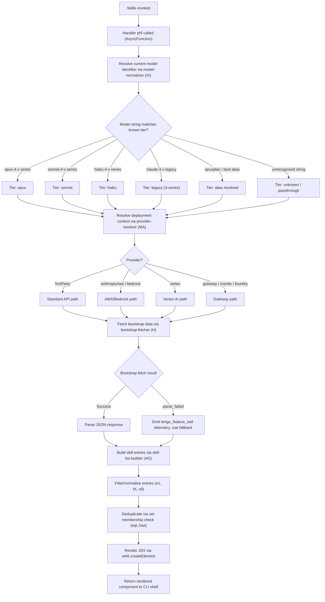

# `/skills`

> Analysis basis: CC v2.1.167 bundle.js (AST extraction + Claude interpretation)
> Minimum version: v2.1.167

---

## Overview

The `/skills` command is a `local-jsx` slash command that lists available skills accessible to Claude Code in the current session. It executes immediately (no additional user input required), renders its results as a JSX component, and introspects the current model configuration and available skill/capability registry to surface a human-readable list.

---

## Registration

| Field | Value |
|---|---|
| type | `local-jsx` |
| name | `skills` |
| description | `List available skills` |
| loc_byte | `12277584` |
| loc_byte_end | `12277716` |
| loc_line | `8646` |
| immediate | `true` |
| module_id | `A6K` |
| load_inline | `true` |
| arbor_handler.name | `phf` |
| arbor_handler.fqn | `claude-2.1.167::phf` |
| arbor_handler.kind | `AsyncFunction` |
| arbor_handler.resolution_path | `module_id` |
| arbor_handler.n_hits | `0` |

Analysis basis: CC v2.1.167 bundle.js:+12277584

---

## Input Branching

The handler (`phf`) has more than three distinct processing branches based on call graph evidence: model-tier resolution, API-bootstrap path selection, skill-list construction, and JSX rendering. A Mermaid flowchart is used.



Analysis basis: CC v2.1.167 bundle.js:+12277399 (createElement call), +12277473 (AG call), +2245617 (s9), +2245625 (e1), +2245681 (eqL.has)

---

## Behavioral Spec

### 1. Handler Entry — `phf` (AsyncFunction)

`phf` is the top-level async handler resolved via `module_id` → `A6K`. It orchestrates three sequential phases: model resolution, skill-list construction, and JSX rendering.

```
async function skillsHandler(context):
    modelId    = resolveModelString(context)          // tX → model-string normalizer
    provider   = resolveProvider(context)             // MA → provider resolver
    bootstrap  = await fetchBootstrapData(context)    // H  → bootstrap fetcher
    skillList  = buildSkillList(bootstrap, modelId)   // AG → skill-list builder
    return createElement(SkillsView, { skills: skillList })
```

Analysis basis: CC v2.1.167 bundle.js:+12277399, +12277473

---

### 2. Bootstrap Data Fetcher — `H`

`H` performs an HTTP fetch to retrieve session capability data. It sets `Content-Type: application/json` and a `User-Agent` header, enforces a 5000 ms timeout, and logs `[Bootstrap] Fetching` at start and `[Bootstrap] Fetch ok` on success.

```
async function fetchBootstrapData(context):
    log("[Bootstrap] Fetching")                    // literal at +15797460
    headers = {
        "Content-Type": "application/json",        // +15797545, +15797560
        "User-Agent": <agent string>               // +15797579
    }
    response = await fetch(endpoint, { headers, timeout: 5000 })   // +15797661
    if parse fails:
        emitTelemetry("api_bootstrap_fetch", { status: "parse_failed" })
        // literal "parse_failed" at +15797804
        return fallback
    log("[Bootstrap] Fetch ok")                    // +15797834
    return parsedData
```

Analysis basis: CC v2.1.167 bundle.js:+15797458, +15797496, +15797661, +15797782, +15797804

---

### 3. Model-String Normalizer — `tX`

`tX` lower-cases the raw model identifier, checks for known substrings, and maps them to canonical tier names. It handles the full matrix of versioned model strings extracted from the bundle.

Known model strings (from literals):
- `claude-opus-4-8` through `claude-opus-4-0` (+2244474 – +2244791)
- `claude-sonnet-4-6` through `claude-sonnet-4-0` (+2244823 – +2244979)
- `claude-haiku-4-5` (+2245013)
- `claude-3-7-sonnet`, `claude-3-5-sonnet`, `claude-3-5-haiku` (+2245072 – +2245194)
- `claude-3-opus`, `claude-3-sonnet`, `claude-3-haiku` (+2245253 – +2245363)

Special alias keywords: `opusplan` (+2247508), `sonnet` (+2247549), `haiku` (+2247588), `opus` (+2247627), `best` (+2247664), `[1m]` (+2247534).

It also checks for `application-inference-profile` as a special deployment marker (+2245499).

```
function normalizeModelString(rawModelId):
    lower = rawModelId.toLowerCase()
    if lower.includes("application-inference-profile"):
        return handleInferenceProfile(lower)
    for each knownModel in MODEL_TABLE:
        if lower.includes(knownModel.substring):
            return knownModel.tier
    return rawModelId   // passthrough
```

Analysis basis: CC v2.1.167 bundle.js:+2244447, +2244463, +2245411, +2245499

---

### 4. Skill-List Builder — `AG`

`AG` coordinates two sub-routines: `s9` (individual skill-entry normaliser) and `e1` (skill-list filter/mapper). It checks a known-skills set (`eqL`) to deduplicate entries, keeping at most the first occurrence of any given skill key. A numeric constant of `4` at +2245609 suggests a maximum of four top-level skill categories are rendered, and `3` at +2245694 is used in a related slice or limit within the filter pass.

```
function buildSkillList(bootstrapData, modelId):
    rawEntries = getRegisteredSkills(bootstrapData)     // lt6 → registry reader
    filtered   = filterAndMapEntries(rawEntries, modelId)  // e1
    seen       = new Set()   // eqL
    result     = []
    for entry in filtered:
        key = normalizeSkillKey(entry)    // s9
        if not seen.has(key):
            seen.add(key)
            result.append(entry)
    return result
```

Analysis basis: CC v2.1.167 bundle.js:+2245617, +2245625, +2245681, +2245609, +2245694

---

### 5. Skill-Entry Normaliser — `s9`

`s9` trims and lower-cases the raw skill name, applies regex replacements to remove version suffixes, and maps tier keywords (`opusplan`, `sonnet`, `haiku`, `opus`, `best`) to canonical display names. It delegates to helper functions for provider-specific badge logic.

```
function normalizeSkillEntry(entry):
    name = entry.trim().toLowerCase()         // H.trim at +2247412, _.toLowerCase at +2247423
    name = applyVersionReplacements(name)     // _.replace at +2247754, A.replace at +2247451
    tier = resolveModelTier(name)             // Y2 → tier resolver at +2247441
    if isUnsupportedVariant(name):            // h4H check at +2247487
        return null
    badge = resolveBadge(name, tier)          // CI at +2247526, DdH at +2247603, bT at +2247641
    includeExtended = checkExtendedFlag(name) // VH8 at +2247702, wdH at +2247710
    return { name, tier, badge, includeExtended }
```

Analysis basis: CC v2.1.167 bundle.js:+2247412, +2247423, +2247441, +2247487, +2247526, +2247603, +2247641, +2247702, +2247710, +2247754

---

### 6. Registry Reader — `lt6`

`lt6` reads the current skill registry by calling a loader function (`l_`) and then iterating `Object.entries` over the resulting map to produce a flat array of `[key, descriptor]` pairs.

```
function readSkillRegistry():
    registry = loadSkillRegistry()        // l_ → registry loader at +2102878
    return Object.entries(registry)       // +2102943
```

Analysis basis: CC v2.1.167 bundle.js:+2102878, +2102943

---

### 7. Provider Resolver — `MA`

`MA` maps the current runtime context to one of the known provider strings: `firstParty`, `anthropicAws`, `gateway`, `bedrock`, `foundry`, `mantle`, `vertex`.

```
function resolveProvider(context):
    switch context.deploymentMode:
        case "bedrock":       return "anthropicAws"  // +2100952
        case "foundry":       return "foundry"       // +2101002
        case "mantle":        return "mantle"        // +2101112
        case "vertex":        return "vertex"        // +2101160
        case "firstParty":    return "firstParty"    // +2101607
        case "anthropicAws":  return "anthropicAws"  // +2101625
        case "gateway":       return "gateway"       // +2101645
        default:              return "firstParty"
```

Analysis basis: CC v2.1.167 bundle.js:+2100912, +2100952, +2101002, +2101112, +2101160, +2101607, +2101625, +2101645

---

### 8. Path-Parser Utility — `uj_`

`uj_` parses structured skill path strings (e.g. `"category/skill-name"`) into `{ prefix, name }` objects by splitting on a delimiter, trimming whitespace, and using `indexOf`/`slice` for the component extraction.

```
function parseSkillPath(pathString):
    parts   = pathString.split(delimiter)    // _.split at +2979391
    trimmed = parts.map(p => p.trim())       // q.trim at +2979430
    sep     = trimmed.indexOf(marker, 1)     // q.indexOf at +2979454, literal 1 at +2979477
    if sep < 0:
        return { prefix: "", name: trimmed[0] }
    return {
        prefix: trimmed.slice(0, sep),       // q.slice at +2979494, literal 0 at +2979502
        name:   trimmed.slice(sep)
    }
```

Analysis basis: CC v2.1.167 bundle.js:+2979391, +2979430, +2979454, +2979494

---

### 9. Bootstrap-Cache Guard — `lHH`

`lHH` checks an internal Set (`i74`) to determine whether bootstrap data for a given key has already been fetched and cached, preventing redundant network requests.

```
function isBootstrapCached(key):
    return bootstrapCacheSet.has(key)    // i74.has at +844383
```

Analysis basis: CC v2.1.167 bundle.js:+844383

---

### 10. JSX Rendering

The final step calls `w4A.createElement` to render the skill list into a JSX tree that the CLI shell displays as formatted output.

```
function renderSkillsView(skillList):
    return createElement(SkillsViewComponent, {
        skills: skillList
    })
```

Analysis basis: CC v2.1.167 bundle.js:+12277399

---

## State & Side Effects

| Item | Detail |
|---|---|
| Telemetry | `tengu_feature_sad` — emitted on bootstrap fetch failure or parse error (bundle.js:+1011093) |
| Bootstrap telemetry event | `api_bootstrap_fetch` with `status: "parse_failed"` on JSON parse failure (+15797782, +15797804) |
| Hook registration | <!-- TODO: not found in depth-2 traversal; needs --depth 4 --> |
| appState changes | No direct appState mutations observed within depth-2 traversal |
| Network I/O | HTTP fetch with `Content-Type: application/json`, `User-Agent` header, 5000 ms timeout (+15797545, +15797560, +15797579, +15797661) |
| Cache side effect | Writes to internal bootstrap cache Set (`i74`) on successful fetch (+844383) |
| Sound | <!-- TODO: not found in depth-2 traversal; needs --depth 4 --> |

---

## Version History

| Version | Change |
|---|---|
| v2.1.167 | Initial analysis |

---

## Common Mistakes

1. **Expecting output when no skills are registered**: `/skills` renders whatever the bootstrap fetch returns; if the current session has no registered skills or the fetch fails, the output list will be empty or show only fallback entries.
2. **Confusing `/skills` with MCP tool listing**: `/skills` lists first-party and provider-resolved skills, not MCP server tools (those appear under `mcp__` prefixed commands).
3. **Running `/skills` in a network-isolated environment**: The command performs a live HTTP bootstrap fetch. In air-gapped or offline environments the fetch will fail and only fallback data will be shown.
4. **Assuming immediate output without model context**: Because tier resolution and provider resolution run before skill-list construction, sessions using non-standard model aliases (e.g. custom inference profiles) may see a different or incomplete skill set than expected.
5. **Expecting real-time skill refresh**: The bootstrap fetch result is cached in an internal Set (`i74`); subsequent `/skills` calls in the same session may return cached data rather than a fresh fetch.

---

## Appendix — Identifier Mapping

> For bundle debugging only. Identifiers change across versions.

| Identifier | Role |
|---|---|
| `phf` | Top-level async handler for `/skills` command (AsyncFunction, entry point) |
| `AG` | Skill-list builder — orchestrates entry construction and deduplication |
| `s9` | Skill-entry normaliser — trims, lower-cases, resolves tier/badge |
| `H` | Bootstrap data fetcher — performs HTTP fetch with headers and timeout |
| `v` | Debug/log utility — emits debug-level log messages |
| `Y3` | <!-- TODO: not found in depth-2 traversal; needs --depth 4 --> |
| `uj_` | Skill path parser — splits `"prefix/name"` strings into components |
| `lHH` | Bootstrap cache guard — checks Set `i74` for cached fetch results |
| `uj` | String replacement utility — applies regex replace to model/skill strings |
| `H9` | Compound skill-info resolver — calls normaliser and classifier |
| `o6` | Low-level utility dispatcher — calls `l` and `J6` sub-helpers |
| `_` | Generic iterable / string value (context-dependent) |
| `Y2` | Model tier resolver — maps normalised name to tier enum |
| `R4H` | Tier classification helper — delegates to string formatter `_6` |
| `A` | String value holding a model identifier undergoing lower-casing |
| `f` | Resource handle with `.close` methods (connection or stream) |
| `h4H` | Unsupported-variant checker — tests against exclusion list `y4H` |
| `CI` | Badge resolver — delegates to `lM` (provider mapper) and `N5` (variant handler) |
| `lM` | Provider-to-display-label mapper — returns `firstParty`/`anthropicAws`/`gateway` labels |
| `N5` | Variant/tier handler — dispatches to `upH`, `WAL`, `U31`, `ct6`, `MA` |
| `DdH` | Extended-tier badge resolver — calls `N5` |
| `bT` | Composite badge builder — calls `lM`, `N5`, `MA` |
| `MA` | Provider resolver — maps deployment mode to canonical provider string |
| `cP1` | Badge pipeline entry — delegates to `bT` |
| `VH8` | Extended-flag checker — tests string against include-list `HKL` |
| `wdH` | Extended-flag string formatter — calls `_6` |
| `_6` | String coercion utility — wraps `String()` built-in |
| `e1` | Skill-list filter and mapper — applies `lt6`, `tX`, `Kc8`, `uj` passes |
| `lt6` | Skill registry reader — loads registry via `l_` and iterates `Object.entries` |
| `l_` | Registry loader — calls `gU` to obtain the raw registry map |
| `tX` | Model-string normaliser — lower-cases, substring-matches, replaces version suffixes |
| `Kc8` | <!-- TODO: not found in depth-2 traversal; needs --depth 4 --> |

---

Note: index built via Arbor fallback; some signals (telemetry, literals) may be missing — see arbor-fallback.js.