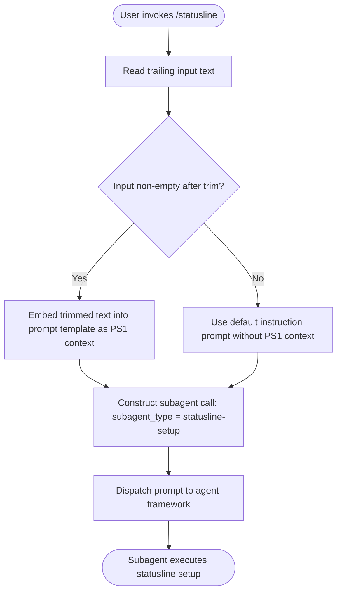

# `/statusline`

> Analysis basis: CC v2.1.167 bundle.js (AST extraction + Claude interpretation)
> Minimum version: v2.1.167

---

## Overview

`/statusline` is a `prompt`-type slash command that configures Claude Code's status line UI by dispatching a subagent with type `"statusline-setup"`. When invoked, the command constructs a prompt — optionally incorporating user-supplied shell PS1 configuration text — and passes it to the agent framework for asynchronous execution. The command is designed as a one-shot setup helper: it reads any trailing user input, trims it, and embeds it into a fixed instruction template that guides the subagent to wire up the status line display.

---

## Registration

| Field | Value |
|---|---|
| type | `prompt` |
| name | `statusline` |
| description | `Set up Claude Code's status line UI` |
| aliases | `[]` (none) |
| handler_method | `getPromptForCommand` |
| handler_method_start (byte) | `12747528` |
| handler_method_end (byte) | `12747736` |
| loc_byte | `12747223` |
| loc_byte_end | `12747737` |
| loc_line | `9094` |
| prompt_body.length | `76` characters |
| prompt_body.trace | `inline template` |
| arbor_handler.name | `getPromptForCommand` |
| arbor_handler.fqn | `claude-2.1.167::getPromptForCommand` |
| arbor_handler.kind | `Method` |
| arbor_handler.resolution_path | `direct` |
| arbor_handler.n_hits | `1` |
| `handler_method_start` | `12747528` |
| `handler_method_end` | `12747736` |

Analysis basis: CC v2.1.167 bundle.js:+12747223

---

## Input Branching

The command has two distinct branches based on whether the user provides trailing text after `/statusline`:

```
flowchart: user input present? → embed in prompt : use empty/default prompt
```

Since there are only 2 branches and the flow is largely linear, numbered pseudocode is used below.

1. User invokes `/statusline [optional text]`.
2. The handler trims the trailing input string (`.trim()` called at `bundle.js:+12747563`).
3. If trimmed input is non-empty, it is embedded into the template prompt as the shell PS1 configuration context.
4. If trimmed input is empty, the prompt is constructed with the default instruction only (no user PS1 context).
5. The constructed prompt is passed to the subagent dispatcher with `subagent_type = "statusline-setup"`.



Analysis basis: CC v2.1.167 bundle.js:+12747528 — +12747736

---

## Behavioral Spec

### Handler: `getPromptForCommand` (inline ObjectMethod)

The Arbor resolver identified this handler via `direct` resolution within the registration byte range `(12747223, 12747737)`. The synthetic entry `__handler_statusline` in the call graph is BFS bookkeeping; the authoritative handler is `getPromptForCommand`.

```
function getPromptForCommand(userInputText):
    trimmedInput = trim(userInputText)

    if trimmedInput is non-empty:
        promptText = buildTemplate(
            subagent_type = "statusline-setup",
            userPS1Context = trimmedInput
        )
    else:
        promptText = buildTemplate(
            subagent_type = "statusline-setup",
            userPS1Context = null
        )

    return promptText
```

Analysis basis: CC v2.1.167 bundle.js:+12747528

The prompt template (76 characters, inline) instructs the subagent to configure the status line by referencing the user's shell PS1 setup. The literal `"Configure my statusLine from my shell PS1 configuration"` (bundle.js:+12747573) appears as the human-readable description of what the subagent should accomplish. The template wraps this intent inside a `subagent_type: "statusline-setup"` dispatch call.

### Subagent Dispatch Pattern

```
function dispatchStatuslineSubagent(prompt):
    subagentRequest = {
        subagent_type: "statusline-setup",
        prompt: prompt
    }
    return agentFramework.createSubagent(subagentRequest)
```

Analysis basis: CC v2.1.167 bundle.js:+12747534 (call edge `__handler_statusline` → `getPromptForCommand`)

### Input Trimming

The handler calls `.trim()` on the raw user input before embedding it into the template. This prevents accidental leading/trailing whitespace from being included in the subagent prompt.

```
function prepareUserInput(rawInput):
    return rawInput.trim()
```

Analysis basis: CC v2.1.167 bundle.js:+12747563

### Bootstrap Fetch Subsystem (reached via call graph depth-2)

The call graph reaches a bootstrap fetch subsystem through the handler chain `H → v → ...`. This subsystem performs a network fetch operation with the following observable constants:

- Log prefix `"[Bootstrap] Fetching"` (bundle.js:+15797460)
- Request header `Content-Type: application/json` (bundle.js:+15797545, +15797560)
- Request header `User-Agent` is set (bundle.js:+15797579)
- Fetch timeout: **5000 ms** (bundle.js:+15797661)
- On success, logs `"[Bootstrap] Fetch ok"` (bundle.js:+15797834)
- On parse failure, emits status `"parse_failed"` (bundle.js:+15797804)
- Telemetry event `"api_bootstrap_fetch"` is fired on completion (bundle.js:+15797782)

This subsystem is shared infrastructure, not specific to `/statusline` alone.

### File-Based Log / Append Subsystem (reached via `enK`)

The call graph depth-2 traversal reaches a file-append subsystem (`enK` → `tnK`) that:

```
function appendToLogFile(content, logDir):
    ensureDirectory(logDir)           // fs.mkdir
    appendToFile(logDir, content)     // fs.appendFile
    computeByteLength(content)        // Buffer.byteLength
    maybeRotate(logDir)               // cl8: stat, rename, unlink
    flushBuffer()                     // $0A
```

File rotation uses `.txt` extension checks (bundle.js:+205511), byte-length accounting, and a 4-byte boundary constant (bundle.js:+205533). A path-join utility (`M0A`) constructs the log path. This is shared logging infrastructure.

Analysis basis: CC v2.1.167 bundle.js:+206082 — +206445

### Model-Selection Subsystem (reached via `H9 → m6H → qB → s9`)

Deep in the call graph, a model-selection resolver normalises model name strings. Observable string constants indicate supported model tiers:

- `"opusplan"` (bundle.js:+2247508)
- `"[1m]"` notation (bundle.js:+2247534)
- `"sonnet"` (bundle.js:+2247549)
- `"haiku"` (bundle.js:+2247588)
- `"opus"` (bundle.js:+2247627)
- `"best"` alias (bundle.js:+2247664)
- Provider tags: `"firstParty"` (bundle.js:+2243716), `"anthropicAws"` (bundle.js:+2101625), `"gateway"` (bundle.js:+2101645), `"mantle"` (bundle.js:+2244357)

This subsystem resolves the model to be used by the subagent and is shared infrastructure.

Analysis basis: CC v2.1.167 bundle.js:+2243492

---

## State & Side Effects

| Item | Detail |
|---|---|
| Telemetry | `tengu_feature_sad` fired at bundle.js:+1011093 (via `o6 → l` in the call graph; shared error/sad-path reporting) |
| Telemetry | `api_bootstrap_fetch` fired on bootstrap fetch completion (bundle.js:+15797782) |
| Subagent dispatch | Creates a subagent with `subagent_type: "statusline-setup"` carrying the constructed prompt |
| File I/O | Log-append subsystem (`enK`/`tnK`) may write and rotate `.txt` log files in the session log directory |
| Hook registration | `j9 → VPA.register` at bundle.js:+60369 — a hook is registered (likely for output or event handling) through shared hook infrastructure |
| Timer usage | `setTimeout` (bundle.js:+59947), `clearTimeout` (bundle.js:+59783), `setImmediate` (bundle.js:+60040) used in the write-buffering subsystem (`npH`) |
| appState changes | <!-- TODO: not found in depth-2 traversal; needs --depth 4 --> |
| Sound | <!-- TODO: not found in depth-2 traversal; needs --depth 4 --> |
| Network | Bootstrap fetch subsystem may issue an outbound HTTPS request (5 000 ms timeout, `Content-Type: application/json`) |

---

## Version History

| Version | Change |
|---|---|
| v2.1.167 | Initial analysis — command registered as `prompt`-type, handler `getPromptForCommand`, prompt body 76 chars, subagent_type `"statusline-setup"` |

---

## Common Mistakes

1. **Passing unsanitised PS1 strings**: The command trims input but does not otherwise sanitise it. Shell escape sequences in PS1 may appear verbatim in the subagent prompt. Ensure the PS1 string is plain text before invoking `/statusline <ps1>`.
2. **Expecting synchronous output**: `/statusline` dispatches a subagent asynchronously. The status line may not be configured immediately after the command returns — wait for the subagent to complete.
3. **Invoking without shell context**: The subagent prompt is designed around the user's shell PS1. Invoking `/statusline` without any argument produces a generic setup; supply your actual PS1 string for best results (the default instruction hint is `"Configure my statusLine from my shell PS1 configuration"`, bundle.js:+12747573).
4. **Confusing with `/status`**: `/statusline` is a dedicated UI-setup command, not a status query. It does not report session state; it configures the display widget.
5. **Re-running unnecessarily**: Because the command dispatches a subagent that writes configuration, running it multiple times may overwrite or duplicate status line settings.

---

## Appendix — Identifier Mapping

> For bundle debugging only. Identifiers change across versions.

| Identifier | Role |
|---|---|
| `__handler_statusline` | Synthetic BFS entry point for the `/statusline` handler (not a real bundle symbol) |
| `H` | Top-level handler / bootstrap fetch orchestrator |
| `v` | Core prompt-builder / fetch dispatcher utility |
| `onK` | Input parsing or option-processing helper |
| `vPA` | Sub-option resolver (calls `sdK`, `tdK`) |
| `RH` | JSON serialisation helper (`JSON.stringify` wrapper) |
| `_` | String utility (toUpperCase, toLowerCase, split, replace targets) |
| `G4` | Path or string manipulation helper (replace, at, lastIndexOf, slice) |
| `q0A` | List-mapping helper used inside `G4` |
| `q` | File-unlink / array utility |
| `A` | Lowercase / slice string helper |
| `EUH` | Write-dispatch helper |
| `lWA` | Stream or handle write wrapper |
| `enK` | File-append / log-write orchestrator |
| `npH` | Write-buffer manager (setTimeout, clearTimeout, setImmediate, push, join) |
| `YKH` | Output-join / formatting helper |
| `d6` | Utility called from `enK` (purpose not determined at depth-2) |
| `U76` | EISDIR-guard or directory-detection helper |
| `M0A` | Log-path constructor (`path.join` wrapper) |
| `cl8` | Log-rotation helper (stat, rename, unlink, endsWith `.txt`) |
| `tnK` | Bound file-append worker (mkdir, appendFile, rotate) |
| `j9` | Hook-registration caller (`VPA.register`) |
| `Y3` | Utility called from `H` (purpose not determined at depth-2) |
| `uj_` | Input tokeniser (split, trim, indexOf, slice) |
| `lHH` | Set-membership checker (`i74.has`) |
| `uj` | String replace utility |
| `H9` | Model/prompt-parse orchestrator |
| `m6H` | Model name normaliser |
| `Q0` | Sub-component of model normalisation |
| `aqH` | Sub-component of model normalisation |
| `qB` | Model-string parser (trim, map, startsWith, includes) |
| `s9` | Model-tier resolver (opusplan, sonnet, haiku, opus, best) |
| `Y2` | Model lookup helper |
| `h4H` | Inclusion-check helper (`y4H.includes`) |
| `CI` | Model category classifier (calls `lM`, `N5`) |
| `DdH` | Model category classifier variant (calls `N5`) |
| `bT` | Model provider tagger (`firstParty`, calls `lM`, `N5`, `MA`) |
| `cP1` | Wrapper calling `bT` |
| `lM` | Provider-flag setter (calls `MA`; `anthropicAws`, `gateway`) |
| `VH8` | Model inclusion checker (`HKL.includes`) |
| `wdH` | Model string transformer (calls `_6`) |
| `FJ` | Full model-resolution pipeline (calls `s9`, `_G`) |
| `_G` | Composite model-description builder (GA, g6H, gYH, jdH, bT, z2, lM, MA, N5, CI) |
| `o6` | Error/sad-path reporter (fires `tengu_feature_sad`) |
| `l` | Inner telemetry emitter called by `o6` |
| `J6` | Outer wrapper for error reporting (calls `ym6`) |
| `ym6` | Low-level telemetry or error sink |

---

Note: index built via Arbor fallback; some signals (telemetry, literals) may be missing — see arbor-fallback.js.