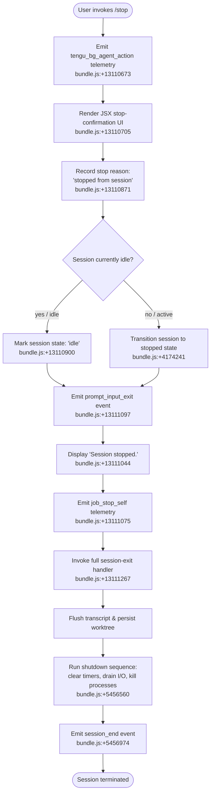

# `/stop`

> Analysis basis: CC v2.1.167 bundle.js (AST extraction + Claude interpretation)
> Minimum version: v2.1.167

---

## Overview

The `/stop` command terminates the current background session gracefully, recording a "stopped from session" status while preserving both the conversation transcript and any associated git worktree. It is a `local-jsx` command that executes immediately upon invocation, firing a `stop_command` telemetry event and rendering a "Session stopped." confirmation before triggering a full session teardown sequence.

---

## Registration

| Field | Value |
|---|---|
| type | `local-jsx` |
| name | `stop` |
| description | Stop this background session; transcript and worktree are kept |
| loc_byte | `13111538` |
| loc_byte_end | `13111722` |
| loc_line | `9713` |
| immediate | `true` |
| module_id | `eMK` |
| load_inline | `true` |
| arbor_handler.name | `cgf` |
| arbor_handler.fqn | `claude-2.1.167::cgf` |
| arbor_handler.kind | `AsyncFunction` |
| arbor_handler.resolution_path | `module_id` |
| arbor_handler.n_hits | `0` |

Analysis basis: CC v2.1.167 bundle.js:+13111538

---

## Input Branching

The command follows a mostly linear flow but has three distinct internal branches: a pre-stop state check, a session teardown path, and the post-stop UI rendering path. A Mermaid flowchart is used.



---

## Behavioral Spec

### 1. Handler Entry — Background Agent Action

The primary handler (`cgf`, resolved via `module_id` path) is an `AsyncFunction`.

```
async function stopCommandHandler(context):
    emitTelemetry("tengu_bg_agent_action")   // bundle.js:+13110673
    render stopConfirmationComponent()        // bundle.js:+13110705
    await sessionStopFlow(context)
```

Analysis basis: CC v2.1.167 bundle.js:+13110673

---

### 2. Stop Confirmation UI Component

The JSX rendering component (`$u8`) renders inline within the command's `immediate` execution path. It does not await user confirmation — it is informational only.

```
function renderStopConfirmation():
    createElement(layoutComponent)
    createElement(iconComponent, { variant: "stop" })
    createTextNode("Session stopped.")           // bundle.js:+13111044
    emitEvent("prompt_input_exit")               // bundle.js:+13111097
    return renderedElement
```

Analysis basis: CC v2.1.167 bundle.js:+13111044

---

### 3. Session State Transition

The session-state manager (`e9`) checks current state before writing the stopped status. States encountered in the call graph include `"active"`, `"idle"`, `"done"`, `"success"`, `"failed"`, `"failure"`, `"stopped"`.

```
async function updateSessionState(sessionId):
    currentState = readStateFile(sessionId)    // bundle.js:+4167560

    if currentState == "active":
        writeNewState(sessionId, "stopped")    // bundle.js:+4174241
    else if currentState == "idle":
        writeNewState(sessionId, "idle")       // bundle.js:+13110900

    deleteFromActiveSet(sessionId)             // bundle.js:+4167527
    deleteFromObservedSet(sessionId)           // bundle.js:+4167541
    persistStateOrder("order", "stateOrder")  // bundle.js:+4167302
```

Analysis basis: CC v2.1.167 bundle.js:+4167560

The stop reason string `"stopped from session"` is written as a status annotation. Analysis basis: CC v2.1.167 bundle.js:+13110871

---

### 4. Transcript Persistence (Transcript Writer)

The transcript-writing subsystem (`enK` → `tnK`) runs before process teardown to ensure conversation history is not lost:

```
async function persistTranscript(sessionDir, messages):
    targetDir = path.join(sessionDir, transcriptSubdir)
    await fs.mkdir(targetDir, { recursive: true })   // bundle.js:+205836
    await fs.appendFile(transcriptFile, newContent)  // bundle.js:+205895

    byteLen = Buffer.byteLength(content)             // bundle.js:+206290
    if transcriptFile.endsWith(".txt"):              // bundle.js:+205500
        rotate and rename as needed                  // bundle.js:+205563
    await cleanupOldTranscripts()                    // bundle.js:+205603
```

Analysis basis: CC v2.1.167 bundle.js:+205836

---

### 5. Shutdown Sequence

The main shutdown orchestrator (`A9`) drives the ordered teardown:

```
async function shutdownSession():
    // Phase 1: render final scroll summary
    emitTelemetry("tengu_scroll_summary")        // bundle.js:+5455866

    // Phase 2: stop active renderers / supervisors
    stopSupervisorRenderer()                     // bundle.js:+16211691

    // Phase 3: flush pending I/O
    drainIoQueue()                               // bundle.js:+60412

    // Phase 4: wait for sub-processes with timeout
    timeout = Math.max(3500, configuredTimeout)  // bundle.js:+5456584
    await Promise.race([
        waitForChildren(),
        AbortSignal.timeout(timeout)             // bundle.js:+5456862
    ])

    // Phase 5: write final sync output
    writeSync(stdoutFd, finalOutput)             // bundle.js:+5457044

    // Phase 6: settle all cleanup promises
    await Promise.allSettled(cleanupHandlers)    // bundle.js:+13293982

    // Phase 7: emit session_end
    emitEvent("session_end")                     // bundle.js:+5456974

    // Phase 8: hard process exit if needed
    if processStillAlive:
        process.exit()                           // bundle.js:+5454697
```

Key timeout constants:
- Subprocess wait ceiling: **3500 ms** (bundle.js:+5456584)
- Post-race grace period: **2000 ms** (bundle.js:+5456762)
- Unref timer delay: **500 ms** (bundle.js:+5456155)

Analysis basis: CC v2.1.167 bundle.js:+5456560

---

### 6. Process Kill Fallback

If the ordered shutdown does not complete within the allotted window, the kill-fallback (`vR_`) issues a `SIGKILL`:

```
function forceKillFallback(childPid):
    clearTimeout(gracePeriodTimer)          // bundle.js:+5454616
    if process still exists:
        process.kill(childPid, "SIGKILL")   // bundle.js:+5454747
    else:
        process.exit()                      // bundle.js:+5454697
    throw new Error("unreachable")          // bundle.js:+5454770
```

Analysis basis: CC v2.1.167 bundle.js:+5454697

---

### 7. Bootstrap / Config Reload During Stop

During stop the daemon config reload path (`tengu_daemon_config_reload`) may fire to synchronise any last-minute config state before shutdown. Analysis basis: CC v2.1.167 bundle.js:+16212216

---

### 8. Atomic File Writer

Session-state files are written atomically via the atomic-write helper (`XY`):

```
function atomicWriteFile(targetPath, data):
    tmpName = crypto.randomBytes(N).toString("hex")  // bundle.js:+2287893
    await fs.writeFile(tmpPath, data, "utf8")        // bundle.js:+2287940
    await fs.rename(tmpPath, targetPath)             // bundle.js:+2287994
    if copyNeeded:
        await fs.copyFile(src, dst)                  // bundle.js:+2288068
    if unlinkNeeded:
        await fs.unlink(oldPath)                     // bundle.js:+2288123
```

Analysis basis: CC v2.1.167 bundle.js:+2287893

---

## State & Side Effects

| Item | Detail |
|---|---|
| Telemetry — tengu_bg_agent_action | Fired at handler entry (bundle.js:+13110673) |
| Telemetry — tengu_bg_state_read_transient | Fired when reading transient session state (bundle.js:+4167723) |
| Telemetry — tengu_scroll_summary | Fired during shutdown scroll flush (bundle.js:+5455866) |
| Telemetry — tengu_scroll_summary | Associated with shutdown render phase |
| Telemetry — tengu_daemon_config_reload | Fired if config sync occurs at shutdown (bundle.js:+16212216) |
| Telemetry — tengu_cache_eviction_hint | Fired during cache cleanup at session end (bundle.js:+5456936) |
| Telemetry — tengu_startup_perf | Startup profiling report emitted (bundle.js:+217609) |
| Telemetry — tengu_pewter_brook | Fired during terminal-mode detection (bundle.js:+3446839) |
| Telemetry — tengu_feature_ok | Fired on successful feature path (bundle.js:+1010950) |
| Telemetry — tengu_feature_sad | Fired on error feature path (bundle.js:+1011093) |
| Named event — prompt_input_exit | Emitted from UI component after rendering stop confirmation (bundle.js:+13111097) |
| Named event — job_stop_self | Emitted to signal self-initiated job stop (bundle.js:+13111075) |
| Named event — session_end | Emitted at the very end of the shutdown sequence (bundle.js:+5456974) |
| Named event — stop_command | Emitted at callGraph entry into stop handler (bundle.js:+13111271) |
| appState changes | Session state written as `"stopped"` or retained as `"idle"`; active-session set entries deleted |
| Transcript persistence | Conversation transcript appended/rotated to disk; worktree is **not** deleted |
| Timer cleanup | All `setTimeout`/`clearTimeout` timers cancelled; heartbeat unref'd |
| Process signals | `SIGKILL` sent to child processes only if graceful shutdown exceeds 3500 ms |
| Atomic file writes | State files updated via temp-rename pattern to avoid corruption |
| Sound | <!-- TODO: not found in depth-2 traversal; needs --depth 4 --> |

---

## Version History

| Version | Change |
|---|---|
| v2.1.167 | Initial analysis |

---

## Common Mistakes

1. **Expecting `/stop` to delete the worktree** — the description explicitly states the worktree is kept; users must manually clean it up if desired.
2. **Invoking `/stop` in a non-background session** — the command is designed for background (`bg` / `daemon` / `daemon-worker`) session types; invoking it in an interactive foreground session may produce unexpected behaviour since the state-machine paths branch on session type strings (`"bg"`, `"daemon"`, `"daemon-worker"` — bundle.js:+2256766).
3. **Assuming immediate process termination** — the shutdown sequence waits up to **3500 ms** for child processes before issuing `SIGKILL`; the parent process may linger briefly after the "Session stopped." message appears.
4. **Expecting transcript loss** — the transcript is flushed and appended to disk *before* the process exits; `/stop` is safe to use without fear of losing conversation history.
5. **Confusing `/stop` with an abort/interrupt** — `/stop` performs an ordered teardown with state finalisation; it is not equivalent to `Ctrl+C` which triggers the `abort` code path (bundle.js:+2298716).

---

## Appendix — Identifier Mapping

> For bundle debugging only. Identifiers change across versions.

| Identifier | Role |
|---|---|
| `cgf` | Primary stop-command handler (AsyncFunction; Arbor-resolved via module_id) |
| `$u8` | Stop-confirmation JSX component renderer |
| `H` | Bootstrap fetch / session config loader |
| `v` | Session state write helper |
| `onK` | State-update orchestrator |
| `vPA` | State persistence helper |
| `RH` | JSON stringify wrapper |
| `G4` | Path/string manipulation utility |
| `q0A` | Line-map builder |
| `q` | File unlink helper |
| `A` | Lowercase path normaliser |
| `EUH` | Write-through helper |
| `lWA` | Handle write wrapper |
| `enK` | Transcript persistence coordinator |
| `npH` | Timer-managed batch writer |
| `YKH` | Transcript line formatter |
| `d6` | Directory existence check |
| `U76` | Directory creator utility |
| `M0A` | Path join + R6 helper |
| `cl8` | Transcript rotation handler |
| `tnK` | Transcript append worker (bound) |
| `j9` | VPA register call |
| `Y3` | Session config accessor |
| `uj_` | String split/trim/slice utility |
| `lHH` | Set-has membership check |
| `uj` | String replace utility |
| `H9` | Model-string parser entry |
| `m6H` | Model object builder |
| `Q0` | Model query helper |
| `aqH` | Model attribute extractor |
| `qB` | Model name parser |
| `s9` | Model normaliser |
| `Y2` | Model alias resolver |
| `h4H` | Model provider inclusion check |
| `CI` | Model capability resolver (lM + N5) |
| `DdH` | Model N5 resolver |
| `bT` | Model lM/N5/MA resolver |
| `cP1` | Model bT wrapper |
| `lM` | MA-based model lookup |
| `VH8` | HKL includes check |
| `wdH` | _6 delegator |
| `FJ` | Model parse flow controller |
| `_G` | Model composite resolver |
| `o6` | Feature telemetry reporter |
| `l` | React createElement / JSX helper |
| `J6` | JSX component factory |
| `ym6` | Issue-reporting base URL |
| `P6` | JSX icon/component |
| `R6` | tv delegator (R6→tv) |
| `tv` | Terminal-value resolver |
| `dgf` | Stop-reason string constant holder |
| `J9` | Session type classifier (bg/daemon/daemon-worker) |
| `dYH` | Session type enum |
| `e9` | Session state file reader/writer |
| `h8` | V8 error handler (ENOENT/EISDIR) |
| `V8` | Filesystem error classifier |
| `Tf` | V8 wrapper for read path |
| `U6` | JSON.parse wrapper |
| `VY` | GN delegator for state normalisation |
| `GN` | DjH state normaliser |
| `DjH` | State string mapper (done/success/failed/stopped) |
| `zf` | Atomic state-flush coordinator |
| `XY` | Atomic file writer (randomBytes → writeFile → rename) |
| `oj` | R7H.delete wrapper |
| `bH8` | Pre-stop flag setter |
| `S9H` | "Session stopped." string constant holder |
| `SH` | JSX session-stopped renderer |
| `A9` | Shutdown sequence orchestrator |
| `K` | Process list mapper |
| `L` | Promise-tracked worker wrapper |
| `f` | Stream close handler |
| `oyH` | Terminal unmount + final write helper |
| `xC` | Terminal cursor restore helper |
| `dL8` | ANSI escape / terminal output writer |
| `NR_` | Shutdown summary writer |
| `wT` | Shutdown config accessor |
| `Cx` | Process context accessor |
| `_G6` | Filesystem stat for shutdown path |
| `s$` | R6 + r4 helper |
| `sV9` | Summary string builder |
| `vR_` | Force-kill fallback (SIGKILL / process.exit) |
| `ipH` | VPA drain caller |
| `Y` | Supervisor/renderer stop + restart coordinator |
| `$GH` | Config key scanner |
| `mfK` | Object.keys / Math.max column formatter |
| `T` | Spinner/renderer stop controller |
| `E` | Daemon config updater (stop/updateConfig/start) |
| `WUK` | S8H heartbeat helper |
| `V` | Renderer start helper |
| `LN9` | Promise.allSettled cleanup waiter |
| `_f6` | An8 + Z0A startup profiling helper |
| `An8` | k0A profiling metric collector |
| `Z0A` | Startup profiling report emitter |
| `Bz8` | wT + $1 scroll-summary builder |
| `aV9` | Scroll summary config reader |
| `oV9` | Scroll timing calculator (Date.now/Math.max/Math.round) |
| `$1` | Terminal-mode detector (tmux/ConPTY/fullscreen) |
| `DL6` | Cache eviction hint emitter |
| `Fz8` | Child-process race-wait helper |
| `r8` | Abort/timeout race wrapper |

---

Note: index built via Arbor fallback; some signals (telemetry, literals) may be missing — see arbor-fallback.js.