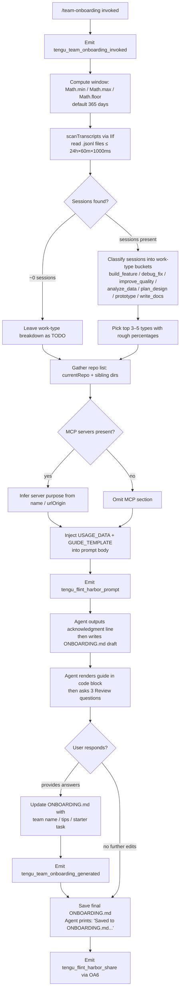

# `/team-onboarding`

> Analysis basis: CC v2.1.167 bundle.js (AST extraction + Claude interpretation)
> Minimum version: v2.1.167

---

## Overview

`/team-onboarding` is a `prompt`-type slash command that reads the invoking user's local Claude Code session transcripts (up to 365 days) and co-authors a personalized `ONBOARDING.md` guide suitable for teammates who are new to Claude Code. The command injects scanned usage data and a guide template into a structured agent prompt, then conducts a brief interactive review loop before saving the final document.

---

## Registration

| Field | Value |
|---|---|
| type | `prompt` |
| name | `team-onboarding` |
| description | `Help teammates ramp on Claude Code with a guide from your usage` |
| isHidden | `false` |
| handler_method | `getPromptForCommand` |
| handler_method_start (loc_byte) | `12117141` |
| handler_method_end (loc_byte) | `12117851` |
| loc_byte | `12116803` |
| loc_byte_end | `12117852` |
| loc_line | `8499` |
| prompt_body.length | `4539` characters |
| prompt_body.trace | `identifier→$ (local→1 ext vars)` |
| arbor_handler.name | `getPromptForCommand` |
| arbor_handler.kind | `Method` |
| arbor_handler.fqn | `claude-2.1.167::getPromptForCommand` |
| arbor_handler.resolution_path | `direct` |
| arbor_handler.n_hits | `2` |
| `handler_method_start` | `12117141` |
| `handler_method_end` | `12117851` |

Analysis basis: CC v2.1.167 bundle.js:+12116803

---

## Input Branching

The handler contains 4+ distinct branches: transcript scan result (sessions found vs. zero sessions), MCP server data present vs. absent, `generatedBy` name present vs. absent, and review-loop follow-up edits vs. no edits. A flowchart is required.



Analysis basis: CC v2.1.167 bundle.js:+12117141

---

## Behavioral Spec

### 1. Handler Entry and Window Calculation

```
function getPromptForCommand(context):
    emit telemetry("tengu_team_onboarding_invoked")

    // Clamp the look-back window to a valid day count
    windowDays = Math.floor(
        Math.max(1,
            Math.min(365, context.windowDaysParam ?? 365)
        )
    )
    // 365 is the hard upper limit baked into the bundle
    // Analysis basis: CC v2.1.167 bundle.js:+12117344–12117390
```

Analysis basis: CC v2.1.167 bundle.js:+12117344

---

### 2. Transcript Scanning (`scanTranscriptsAsync` / `Stq`)

```
async function scanTranscripts(projectDir, windowDays):
    cutoffMs = Date.now() - windowDays * 24 * 60 * 1000
    // 24 h × 60 min × 1000 ms  (Analysis basis: +12105639–12105648)

    entries = await fs.readdir(transcriptsDir)
    jsonlFiles = entries.filter(e => path.extname(e) === ".jsonl")

    results = await Promise.all(
        jsonlFiles.map(async file =>
            stat = await fs.stat(join(transcriptsDir, file))
            if not stat.isFile(): return null

            raw = await fs.readFile(join(transcriptsDir, file))
            lines = raw.split("\n")

            for each line:
                if line.includes('"name":"mcp__'):
                    // record MCP tool usage  (+12106333)
                if line.matchAll(contentArrayPattern):
                    // extract message content  (+12106211)
                if ZIf regex matches line:
                    // parse session descriptor  (+12106705)
                if line.startsWith('"content":['):
                    // detect multi-content blocks  (+12106683)
            return sessionDescriptor
        )
    )
    return results.filter(Boolean)
```

Analysis basis: CC v2.1.167 bundle.js:+12105626

---

### 3. MCP Config Resolution (`vIf`)

```
async function resolveMcpConfig(workspaceDir):
    raw = await fs.readFile(join(workspaceDir, ".mcp.json"), "utf8")
    parsed = JSON.parse(raw)   // U6 wrapper  (+12107888)
    servers = parsed.mcpServers ?? {}
    // For each server entry: name + optional urlOrigin → human description
    return servers
    // On any read/parse error: return empty map (h8 error guard, +12108017)
```

Analysis basis: CC v2.1.167 bundle.js:+12107841

---

### 4. Git Metadata Extraction (`IIf` → `C_`)

```
async function fetchGitMetadata(cwd):
    userName = await exec("git", ["config", "user.name"], cwd)
    // +12108488–12108504
    remoteUrl = await exec("git", ["remote", "get-url", "origin"], cwd)
    // +12108560–12108579
    repoName = path.basename(remoteUrl.trim())
    // JZH normalises: strips "git/" prefix if present (+12108676)
    return { userName, remoteUrl, repoName }
```

Analysis basis: CC v2.1.167 bundle.js:+12108485

---

### 5. Prompt Assembly and Template Injection

```
function buildPrompt(windowDays, usageData, guideTemplate):
    body = PROMPT_BODY_TEMPLATE          // 4539-char constant
    body = body.replaceAll("{{WINDOW_DAYS}}", String(windowDays))
    // +12117588–12117619
    body = body.replaceAll("{{USAGE_DATA}}", JSON.stringify(usageData))
    // +12117676
    body = body.replaceAll("{{GUIDE_TEMPLATE}}", guideTemplate)
    // +12117641
    emit telemetry("tengu_flint_harbor_prompt")
    // +12117178
    return { type: "text", content: body }
    // literal "text" at +12117835
```

Analysis basis: CC v2.1.167 bundle.js:+12117579

---

### 6. Agent Behavior as Specified by the Prompt Body

The prompt body (4 539 chars, traced via `identifier→$`) instructs the agent to behave as follows:

**Step 1 — Immediate acknowledgment (mandatory, before any reasoning):**
The agent must emit a blockquote line referencing `{{WINDOW_DAYS}}` before any classification or extended thinking. The prompt explicitly states the guide creator is waiting and that "Classification is step 2, not step 1."

**Step 2 — Work-type classification:**
The agent reads the `sessionDescriptors` array (title, `prNumbers`, first user message) and classifies each session into one of seven canonical buckets. Display names use title case with spaces (e.g., "Build Feature", not "build_feature"). Top 3–5 buckets with rough percentages are selected. If the session count is approximately zero, the breakdown is left as a `TODO` placeholder.

**Step 3 — Repository and MCP data collection:**
`currentRepo` is used as the primary repository; sibling workspace directories are checked for additional repos. MCP server entries use `name` and optional `urlOrigin` to produce human-readable access instructions.

**Step 4 — Write `ONBOARDING.md`:**
The guide follows `{{GUIDE_TEMPLATE}}`, populated with real numbers from the usage data. ASCII bar charts use `█` for filled bars and `░` for empty bars, 20 characters wide. `generatedBy` provides the author name; if absent, the name is omitted. An HTML comment at the bottom is preserved verbatim.

**Step 5 — Review loop:**
After rendering the guide in a code block, the agent adds a `---` separator and a `**Review**` heading, then asks three numbered questions:
1. Confirm or correct the inferred team name.
2. Request an optional starter task (ticket or doc link).
3. Request team tips not already in `CLAUDE.md`.

After the user answers, the agent updates `ONBOARDING.md` and closes with a fixed, non-paraphrased confirmation line referencing `ONBOARDING.md` and instructing the user to share it with the team. Further edits from the user are applied to the file.

Analysis basis: CC v2.1.167 bundle.js:+12117141 (prompt body length 4539, trace `identifier→$`)

---

### 7. Guide Share / Persistence (`OA6`)

```
function shareOnboardingGuide(context):
    // OA6 calls $q (essential-traffic queue), VZ (config reader), D6 (session dispatcher)
    emit telemetry("tengu_flint_harbor_share")   // +9832044
    emit telemetry("tengu_team_onboarding_generated")  // +12117720
    // Delegates final write path to D6 (session execution pipeline)
```

Analysis basis: CC v2.1.167 bundle.js:+12117697

---

## State & Side Effects

| Item | Detail |
|---|---|
| Telemetry: `tengu_team_onboarding_invoked` | Fired at handler entry (+12117401) |
| Telemetry: `tengu_flint_harbor_prompt` | Fired when prompt is assembled and dispatched (+12117178) |
| Telemetry: `tengu_team_onboarding_generated` | Fired after guide generation completes (+12117720) |
| Telemetry: `tengu_flint_harbor_share` | Fired when guide is shared/persisted via OA6 (+9832044) |
| Telemetry: `tengu_config_parse_error` | Fired if config file parse fails (+3268051) |
| Telemetry: `tengu_config_lock_contention` | Fired on config lock delay (+3265476) |
| Telemetry: `tengu_config_stale_write` | Fired on stale write detection (+3265612) |
| Telemetry: `tengu_config_auth_loss_prevented` | Fired when auth-wiping write is blocked (+3265955) |
| File write | `ONBOARDING.md` created/updated in the working directory after review loop |
| File read | `.mcp.json` read from workspace root to discover MCP servers |
| File read | `.jsonl` transcript files read from project transcript directory |
| Git subprocess | `git config user.name` and `git remote get-url origin` executed in cwd |
| Config access | Global config read via `X8`/`aP_`; guarded against auth-loss (GH #3117) |
| Look-back window | Clamped to `[1, 365]` days via `Math.min` / `Math.max` / `Math.floor` (+12117344) |
| Backup files | Config subsystem maintains up to 5 rolling backups (+3266406) with `.backup.` infix (+3266273) |
| Sound | None observed in depth-2 traversal |
| Hook registration | `j9` → `VPA.register` reached via `IVL` (file-watch hook for config); not specific to this command |

---

## Version History

| Version | Change |
|---|---|
| v2.1.167 | Initial analysis |

---

## Common Mistakes

1. **Running the command with no prior sessions.** If the user has no `.jsonl` transcript files within the look-back window, the work-type breakdown will be left as a `TODO` and the guide will be skeletal. The user should run it after accumulating meaningful usage.
2. **Missing `.mcp.json`.** If the workspace has no `.mcp.json`, the MCP server section is silently omitted from the guide. This is expected but may surprise users who expect MCP context.
3. **Expecting an instant result without responding to Review questions.** The guide is intentionally a draft after the first turn; the Team Tips and Get Started sections remain as `TODO` placeholders until the user answers the three Review questions.
4. **Assuming the team name is always detected.** The agent infers the team name from available context; if it cannot determine it, it asks the user directly in Review question 1. No fallback name is substituted silently.
5. **Pasting the raw draft before finishing the review loop.** The `ONBOARDING.md` file is written in its final form only after the user completes the review loop. Pasting the intermediate code-block output will miss the team name, tips, and starter task.
6. **Very large transcript directories.** The scan reads all `.jsonl` files within the window in parallel via `Promise.all`; extremely large transcript directories may cause noticeable latency before the first output line appears.

---

## Appendix — Identifier Mapping

> For bundle debugging only. Identifiers change across versions.

| Identifier | Role |
|---|---|
| `__handler_team-onboarding` | Synthetic BFS entry point for the command handler (BFS bookkeeping; prefer `getPromptForCommand` per arbor_handler) |
| `D6` | Session execution / dispatch pipeline |
| `dj6` | Session dispatch helper A |
| `cj6` | Session dispatch helper B |
| `hu` | Session state initialiser |
| `yu` | Session context builder |
| `kC` | Core session runner |
| `dq8` | Deduplication / session-seen guard |
| `yP_` | New session creator |
| `EvH` | Session event emitter |
| `ZB` | Random-token / experiment-ID generator |
| `RH` | JSON serialiser wrapper |
| `oZL` | Event queue flush helper |
| `xP_` | Session queue processor |
| `Tp1` | Task lock helper |
| `l_` | Utility: generic get |
| `Oo1` | Queue item builder |
| `lHH` | In-flight session checker |
| `C6` | Config loader / file-watcher orchestrator |
| `d6` | Config directory resolver |
| `lP_` | Config value accessor |
| `LwH` | Config file reader/writer with backup |
| `U6` | JSON.parse wrapper |
| `Hu` | String prefix normaliser |
| `V8` | Error reporter / logger |
| `Vo1` | Sibling-repo directory scanner |
| `v` | Model/token string formatter |
| `l` | Generic logger |
| `sP_` | Backup path builder |
| `IVL` | Config file-watcher (inotify/watchFile) |
| `co` | Config change listener |
| `j9` | Hook registrar (VPA.register) |
| `X8` | Global config read entrypoint |
| `aP_` | Save-config-with-lock implementation |
| `S21` | Config object merger |
| `gM_` | Config schema validator |
| `oj6` | Config cache accessor |
| `A` | Process/worker map manager |
| `P` | Text buffer / editor state manager |
| `J` | Worker wrapper |
| `j` | Worker kill helper |
| `H` | Bootstrap fetch / HTTP request handler |
| `z` | Daemon stop controller |
| `Y` | Supervisor config applier |
| `h` | Background sweep / memory manager |
| `TOA` | Vim-mode operator dispatch table |
| `C` | Request executor (enqueue + execute) |
| `E` | Watcher/supervisor instance |
| `$$6` | Atomic file writer (temp + rename) |
| `O` | Stat result wrapper |
| `h8` | Safe error wrapper |
| `QlH` | Config schema builder |
| `Zo1` | Object.entries enumerator for config |
| `AK8` | Timestamp helper (Date.now wrapper) |
| `oP_` | Save-global-config fallback |
| `IIf` | Usage-data collector (orchestrates transcript scan + git + MCP) |
| `W_` | Home-directory resolver |
| `tv` | Platform path helper |
| `ex` | Project transcripts path builder |
| `YI` | Projects base-dir resolver |
| `OY` | Relative path formatter |
| `rG4` | Path abbreviation helper |
| `Stq` | Transcript file scanner (async, reads .jsonl) |
| `t1` | Error-type guard |
| `K` | Array pad/map utility |
| `$` | App-state / global store |
| `zLK` | State mutation helper |
| `D` | Process shutdown / abort handler |
| `IJ` | Forced shutdown initiator |
| `vIf` | `.mcp.json` reader and parser |
| `NIf` | Usage-data normaliser / finaliser |
| `C_` | Git subprocess runner (execa wrapper) |
| `YZH` | Execa core (spawn + stream management) |
| `rxA` | Platform command resolver (win32 .exe / cmd) |
| `f6_` | Stdin pipe helper |
| `M6_` | Argv builder |
| `O6_` | Encoding resolver |
| `AxA` | Timeout validator |
| `z$6` | Subprocess result builder |
| `L6_` | Reflect.apply / property-definition wrapper |
| `CxA` | Exit-event listener attacher |
| `_xA` | Timeout race wrapper |
| `qxA` | Graceful-kill helper |
| `ebA` | stdout data handler |
| `HxA` | SIGKILL escalation handler |
| `SxA` | Promise.all stream drainer |
| `j$6` | Buffer collector |
| `yxA` | stdout pipe attacher |
| `hxA` | stderr pipe attacher |
| `MxA` | oH_ binder (IPC bridge) |
| `FE4` | String coercion helper for exit codes |
| `O$` | Subprocess options normaliser |
| `hH` | Error formatter / logger (uses AA + _6 + $q + zG4) |
| `AA` | Error-to-string converter |
| `_6` | String coercion with fallback |
| `$q` | Essential-traffic request queue |
| `zG4` | Log-ring shift/push manager |
| `JZH` | Git remote URL parser / normaliser |
| `JZ4` | URL host extractor |
| `d1` | String index/slice utility |
| `OA6` | Guide share / persistence coordinator |
| `VZ` | Config reader for share context |

---

Note: index built via Arbor fallback; some signals (telemetry, literals) may be missing — see arbor-fallback.js.