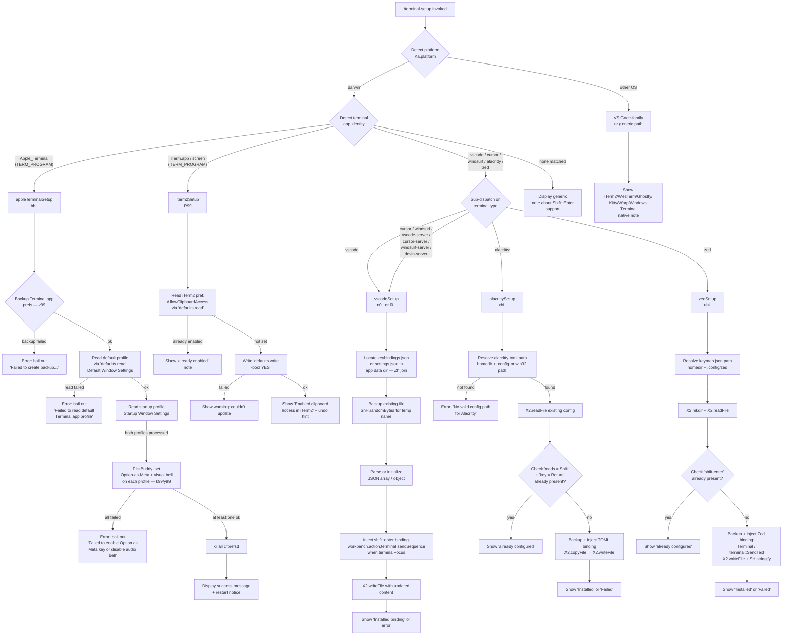

# `/terminal-setup`

> Analysis basis: CC v2.1.162 bundle.js (AST extraction + Claude interpretation)
> Minimum version: v2.1.162

---

## Overview

`/terminal-setup` installs a Shift+Enter key binding (and related terminal ergonomics settings) for the current terminal emulator, allowing users to insert newlines without submitting input. The command detects the running terminal environment at invocation time and dispatches to a terminal-specific configuration routine; it supports Apple Terminal, iTerm2, VSCode/Cursor/Windsurf (VS Code-family), Alacritty, Zed, and a generic fallback path. On supported terminals, it writes or patches configuration files (with automatic backup), then displays a confirmation message indicating what changed and whether a restart is required.

---

## Registration

| Field | Value |
|---|---|
| type | `local-jsx` |
| name | `terminal-setup` |
| description | Install Shift+Enter key binding for newlines |
| loc_byte | `12298564` |
| loc_byte_end | `12299196` |
| loc_line | `8682` |
| module_id | `C99` |
| load_inline | `true` |
| arbor_handler.name | `RbL` |
| arbor_handler.fqn | `claude-2.1.162::RbL` |
| arbor_handler.kind | `AsyncFunction` |
| arbor_handler.resolution_path | `module_id` |
| arbor_handler.n_hits | `1` |

Analysis basis: CC v2.1.162 bundle.js:+12298564

---

## Input Branching

The handler branches on 5+ distinct terminal identity paths plus a generic fallback. A Mermaid flowchart is required.



Analysis basis: CC v2.1.162 bundle.js:+4014490 (handler entry `RbL`), +4012478 (platform/terminal literals), +4015965 (dispatch to `o48`).

---

## Behavioral Spec

### Top-Level Handler (`RbL` — `terminalSetupHandler`)

```
async function terminalSetupHandler(context):
    platform = Ka.platform()                           // +4014490

    // Detect terminal identity
    terminalApp = detectTerminalApp(platform)          // uvH at +4015037

    // iTerm2-specific: always attempt clipboard setup on darwin/iterm2
    if terminalApp == "iTerm.app" or terminalApp == "screen":
        await iterm2Setup()                            // R99 at +4014686

    // Display informational note (iTerm2 / WezTerm / Ghostty etc.)
    displayInfoNote(terminalApp)                       // o6 at +4015089

    // Main per-terminal dispatch
    await terminalDispatch(terminalApp, platform)      // o48 at +4015965
```

Analysis basis: CC v2.1.162 bundle.js:+4014490

---

### Terminal Detection (`uvH` — `detectTerminalApp`)

```
function detectTerminalApp(platform):
    if platform == "darwin":                           // +4012478
        return Ka.platform() / env inspection
        // Checks TERM_PROGRAM for:
        //   "Apple_Terminal"                          // +4012502
        //   "vscode"                                  // +4012534
        //   "cursor"                                  // +4012558
        //   "windsurf"                                // +4012582
        //   "alacritty"                               // +4012608
        //   "zed"                                     // +4012635
    return "your current terminal"                     // +4015063
```

Analysis basis: CC v2.1.162 bundle.js:+4012462

---

### Apple Terminal Setup (`bbL` — `appleTerminalSetup`)

This is the most complex path. It:

1. **Backs up the Terminal.app preference plist** using `v99` (backupTerminalPrefs):
   - Reads the plist from `~/Library/Preferences/com.apple.Terminal.plist` (literals at +4009377, +4009387, +4009401).
   - Runs `defaults export com.apple.Terminal` (+4009500, +4009512, +4009521) via `C8` (runCommand).
   - Saves the backup via `ybL` (writePlistBackup) calling `G8` (writeConfig).
   - On failure: throws `"Failed to create backup of Terminal.app preferences, bailing out"` (+4022153).

2. **Reads the default Terminal profile** using `C8` (runCommand) with `defaults read` + `"Default Window Settings"` (+4022263, +4022291).
   - On failure: throws `"Failed to read default Terminal.app profile"` (+4022351).

3. **Reads the startup Terminal profile** similarly for `"Startup Window Settings"` (+4022468).
   - On failure: throws `"Failed to read startup Terminal.app profile"` (+4022528).

4. **Patches each profile** via `k99` / `y99` (patchTerminalProfile):
   - Invokes `/usr/libexec/PlistBuddy` (+4021380) with `-c` commands (+4021407) to set Option-as-Meta key and disable audio bell.
   - Constructs result messages via `v` (formatOutput).

5. **If all patches fail**: throws `"Failed to enable Option as Meta key or disable audio bell for any Terminal.app profile"` (+4022738).

6. **Flushes prefs daemon**: runs `killall cfprefsd` (+4022837, +4022848) via `ynH` → `G8`.

7. **Displays success output** (+4022877 `"success"`) with lines:
   - `"Configured Terminal.app settings:"` (+4022890)
   - `"- Enabled \"Use Option as Meta key\""` (+4022957)
   - `"- Switched to visual bell"` (+4023019)
   - `"Shift+Return will now enter a newline."` (+4023064)
   - `"Option+Enter will now enter a newline."` (+4023113) *(dim)*
   - `"You must restart Terminal.app for changes to take effect."` (+4023198) *(dim)*

```
async function appleTerminalSetup():
    backupOk = await backupTerminalPrefs()             // v99 at +4022114
    if not backupOk:
        throw Error("Failed to create backup...")      // +4022153

    defaultProfile = await runCommand(
        "defaults", "read", ..., "Default Window Settings"
    ).trim()                                           // +4022263, +4022291
    if not defaultProfile:
        throw Error("Failed to read default Terminal.app profile") // +4022351

    startupProfile = await runCommand(
        "read", "Startup Window Settings"
    ).trim()                                           // +4022468
    if not startupProfile:
        throw Error("Failed to read startup Terminal.app profile") // +4022528

    results = []
    for profile in [defaultProfile, startupProfile]:
        result = await patchTerminalProfile(profile)   // k99 / y99
        results.push(result)

    if all results failed:
        throw Error("Failed to enable Option as Meta key...")  // +4022738

    await runCommand("killall", "cfprefsd")            // +4022837

    displaySuccess(results)                            // +4022877
```

Analysis basis: CC v2.1.162 bundle.js:+4012721

---

### Backup Terminal Prefs (`v99` — `backupTerminalPrefs`)

```
async function backupTerminalPrefs():
    prefsPath = path.join(
        os.homedir(), "Library", "Preferences",        // +4009377, +4009387
        "com.apple.Terminal.plist"                     // +4009401
    )
    // Export via 'defaults export com.apple.Terminal <tmpfile>'
    // (hnH builds the homedir-relative path)
    exportResult = await runCommand(
        "defaults", "export", "com.apple.Terminal", tmpPath // +4009500-4009521
    )
    backup = readPlistBackup(exportResult)             // ybL
    if not backup:
        return { status: "no_backup" }                 // +4009784
    writeConfig(backup)                                // G8
    return { status: "ok" }
```

Analysis basis: CC v2.1.162 bundle.js:+4009456

---

### iTerm2 Setup (`R99` — `iterm2Setup`)

```
async function iterm2Setup():
    domain = "com.googlecode.iterm2"                   // +4013547
    key    = "AllowClipboardAccess"                    // +4013571

    current = await runCommand("defaults", "read", domain, key)  // C8
                   .trim()                             // +4013606
    if current is truthy:
        displayNote("iTerm2 clipboard access already enabled")   // +4013646
        return

    result = await runCommand(
        "defaults", "write", domain, key, "-bool", "YES"         // +4013734, +4013789
    )
    if result.failed:
        displayWarning("Couldn't update iTerm2 clipboard setting.") // +4013840
        return

    displaySuccess(
        "Enabled \"Applications in terminal may access clipboard\" in iTerm2" // +4013931
    )
    displayNote(
        "Restart iTerm2 for this to take effect. Undo: defaults write ..." // +4014014
    )
```

Analysis basis: CC v2.1.162 bundle.js:+4013482

---

### VS Code-family Setup (`n0_` — `vscodeSetupInstall` / `l0_` — `vscodeSetupUpdate`)

Two routines handle the initial install and update of `keybindings.json`. The server-variant detection checks environment paths for `.vscode-server` (+4011992), `.cursor-server` (+4012022), `.windsurf-server` (+4012052), `.devin-server` (+4012084).

```
async function vscodeSetupInstall(appDataDir):
    // Warn if running inside a remote server context
    if isRemoteServer(homeDir):                        // r48 checks .vscode-server etc.
        displayWarning("VSCode", ...)                  // +4019352, +4019385

    kbPath = path.join(appDataDir, "keybindings.json") // +4020044
    X2.mkdir(appDataDir, { recursive: true })           // +4020074
    raw = await X2.readFile(kbPath, "utf-8")            // +4020134
       ?? "[]"                                          // +4020107

    bindings = parseJSON(raw)                           // AM6 + mCA
    alreadySet = bindings.find(b =>
        b.key == "shift+enter" &&                       // +4020493
        b.command == "workbench.action.terminal.sendSequence" && // +4020515
        b.when == "terminalFocus"                       // +4020582
    )
    if alreadySet: return

    // Generate backup filename with 4 random hex bytes
    backupPath = kbPath + "." + randomBytes(4).toString("hex")   // +4020241, +4020253
    await X2.copyFile(kbPath, backupPath)               // +4020288

    binding = {
        key:     "shift+enter",
        command: "workbench.action.terminal.sendSequence",
        args:    { text: "\x1b\r" },                   // +4020567 (ESC + CR)
        when:    "terminalFocus"
    }
    bindings.push(binding)
    await X2.writeFile(kbPath, serialize(bindings))     // +4020993

    displaySuccess("Installed VS Code Shift+Enter key binding")
    displayNote("...")
```

`l0_` (vscodeSetupRead/Merge) operates similarly but reads `settings.json` (+4016711) defaulting to `"{}"` (+4016738) and merges `terminal_setup_gpu_accel` (+4017877) and `remote_ssh` (+4017904) settings in addition to the key binding.

Analysis basis: CC v2.1.162 bundle.js:+4012755 (`n0_`), +4012780 (`l0_`).

---

### Alacritty Setup (`xbL` — `alacrittySetup`)

```
async function alacrittySetup():
    // Resolve config path: alacritty.toml           // +4023842
    platform = Ka.platform()                          // +4023938
    homedir  = Ka.homedir()                           // +4023881
    candidates = [
        path.join(homedir, ".config", "alacritty", "alacritty.toml"), // +4023894
        // win32 variant                              // +4023954
    ]
    configPath = candidates.find(p => fileExists(p))
    if not configPath:
        throw Error("No valid config path found for Alacritty")  // +4024203

    raw = await X2.readFile(configPath, "utf-8")
    if raw.includes('mods = "Shift"') and            // +4024271
       raw.includes('key = "Return"'):               // +4024301
        displayNote("Alacritty Shift+Enter key binding already configured") // +4024344
        return

    // Backup
    backupPath = configPath + ".backup." + randomBytes(...)
    try:
        await X2.copyFile(configPath, backupPath)
    catch:
        throw Error("Error backing up existing Alacritty config. Bailing out.") // +4024554

    // Inject TOML binding block
    newContent = raw + tomlBindingBlock            // appended TOML stanza
    await X2.mkdir(path.dirname(configPath), { recursive: true }) // +4024702
    await X2.writeFile(configPath, newContent)    // +4024872

    displaySuccess("Installed Alacritty Shift+Enter key binding")  // +4024928
    displayNote("You may need to restart Alacritty for changes to take effect") // +4024998
```

Analysis basis: CC v2.1.162 bundle.js:+4013060

---

### Zed Setup (`ubL` — `zedSetup`)

```
async function zedSetup():
    configDir  = path.join(Ka.homedir(), ".config", "zed")
    keymapPath = path.join(configDir, "keymap.json")    // +4025357
    await X2.mkdir(configDir, { recursive: true })       // +4025382
    raw = await X2.readFile(keymapPath, "utf-8") ?? "[]"

    if raw.includes("shift-enter"):                      // +4025523
        displayNote("Zed Shift+Enter key binding already configured") // +4025563
        return

    // Backup
    backupPath = keymapPath + randomBytes(...)
    try:
        await X2.copyFile(keymapPath, backupPath)
    catch:
        throw Error("Error backing up existing Zed keymap. Bailing out.") // +4025767

    // Parse, inject, serialize
    bindings = JSON.parse(raw)                           // p6
    bindings.push({
        context: "Terminal",                             // +4025976
        bindings: {
            "shift-enter": "terminal::SendText"          // +4026012
        }
    })
    await X2.writeFile(keymapPath, SH(bindings))        // +4026052, +4026067

    displaySuccess("Installed Zed Shift+Enter key binding")  // +4026123
```

On any `writeFile` error: `"Failed to install Zed Shift+Enter key binding"` (+4026332).

Analysis basis: CC v2.1.162 bundle.js:+4013091

---

### Command Runner (`C8` — `runCommand`)

Wraps child-process execution; passes through to `C_` (spawnWithTimeout). Relevant constants observed in its call graph:

- Buffer size limit: 10 (pool size, +1092724)
- Spawn timeout cap: 1,000,000 ms (+1093246)
- Error severity `"error"` (+1093673)

Analysis basis: CC v2.1.162 bundle.js:+1092779

---

### Config Persistence (`G8` — `writeConfig` / `kH` — `persistConfig`)

Used by the Apple Terminal backup path and profile write. `kH` implements a lock-protected write with a contention warning when lock acquisition takes longer than expected. On detecting that re-read config is missing auth fields that the in-memory cache holds, it refuses to write to avoid data loss (literal: `"saveGlobalConfig fallback: re-read config is missing auth…"` +3251580).

Analysis basis: CC v2.1.162 bundle.js:+3251373 (`G8`), +1013597 (`kH`)

---

## State & Side Effects

| Item | Detail |
|---|---|
| Telemetry: `tengu_feature_ok` | Emitted on successful feature path (bundle.js:+1008233) |
| Telemetry: `tengu_feature_bad` | Emitted on failure path (bundle.js:+1008295) |
| Telemetry: `tengu_feature_sad` | Emitted on non-fatal degraded path (bundle.js:+1008376) |
| Telemetry: `tengu_config_auth_loss_prevented` | Emitted when stale-write guard refuses to overwrite config (bundle.js:+3251708) |
| Telemetry: `tengu_config_lock_contention` | Emitted when config lock acquisition is slow (bundle.js:+3254559) |
| Telemetry: `tengu_config_stale_write` | Emitted on stale-write detection (bundle.js:+3254695) |
| Telemetry: `tengu_config_parse_error` | Emitted when config JSON fails to parse (bundle.js:+3257134) |
| Telemetry: `tengu_daemon_control` | Emitted during daemon stop sequence (bundle.js:+16032559) |
| File writes | `keybindings.json` (VS Code-family), `settings.json` (VS Code settings), `alacritty.toml` (Alacritty), `keymap.json` (Zed), `com.apple.Terminal.plist` export (Apple Terminal) |
| Backups | Atomic copy with `SnH.randomBytes(4).toString("hex")` suffix before any destructive write |
| Child processes | `defaults read/write/export`, `/usr/libexec/PlistBuddy -c`, `killall cfprefsd` (macOS only) |
| appState changes | `onboarding_project_complete` event fired via `knH` after setup completes (bundle.js:+4008715) |
| Sound | None observed |

---

## Version History

| Version | Change |
|---|---|
| v2.1.162 | Initial analysis |

---

## Common Mistakes

1. **Running on non-macOS for Apple Terminal path**: The `Apple_Terminal` and iTerm2 paths are gated on `platform == "darwin"` (+4012478). Running on Linux/Windows will fall through to the VS Code-family or generic note path even if `TERM_PROGRAM` is set.

2. **Stale preference daemon**: After the command patches `com.apple.Terminal.plist`, it runs `killall cfprefsd` to flush the macOS preferences daemon. If `cfprefsd` is not running or the kill fails silently, the old preferences may persist until the next reboot.

3. **Backup collision**: Backup filenames use 4 random hex bytes (+4020241). On extremely rapid repeated invocations the backup could theoretically overwrite a prior backup; the command does not rotate or enumerate backups.

4. **Remote server detection heuristic**: The VS Code-family path checks `HOME` for `.vscode-server`, `.cursor-server`, `.windsurf-server`, `.devin-server` directory presence (+4011992–4012084). If the user's home directory happens to contain such a directory without actually running in that environment, a spurious warning may appear.

5. **Restart required — not enforced**: The command emits `"You must restart Terminal.app for changes to take effect."` (+4023198) and `"You may need to restart Alacritty…"` (+4024998) as informational text only; no validation or follow-up check is performed.

6. **Zed and Alacritty idempotency check is string-based**: The already-configured check for Alacritty reads the raw TOML string for `'mods = "Shift"'` and `'key = "Return"'` (+4024271, +4024301), and Zed checks for the substring `"shift-enter"` (+4025523). Comments or unrelated bindings that happen to include these strings would produce false-positive "already configured" results.

---

## Appendix — Identifier Mapping

> For bundle debugging only. Identifiers change across versions.

| Identifier | Role |
|---|---|
| `RbL` | `terminalSetupHandler` — top-level async handler (arbor primary) |
| `uvH` | `detectTerminalApp` — reads `Ka.platform` and env to identify terminal |
| `o48` | `terminalDispatch` — dispatches to per-terminal setup functions |
| `bbL` | `appleTerminalSetup` — full Apple Terminal plist patching routine |
| `v99` | `backupTerminalPrefs` — exports Terminal.app plist to backup location |
| `hnH` | `buildPrefsPath` — assembles `~/Library/Preferences/com.apple.Terminal.plist` |
| `C8` | `runCommand` — child-process wrapper |
| `C_` | `spawnWithTimeout` — low-level spawn with timeout |
| `x6` | `spawnHelper` — spawn utility called from `runCommand` |
| `ybL` | `writePlistBackup` — writes backup of exported plist |
| `G8` | `writeConfig` — global config write with auth-loss guard |
| `kH` | `persistConfig` — lock-protected config persistence |
| `t_` | `errorToString` — converts Error/string to string |
| `tH` | `stringNormalizer` — String coercion helper |
| `wq` | `networkTrafficClassifier` — sets `essential-traffic` header |
| `Gj4` | `requestQueueManager` — shift/push on request queue |
| `k99` | `patchDefaultProfile` — PlistBuddy patch for Default Window Settings |
| `y99` | `patchStartupProfile` — PlistBuddy patch for Startup Window Settings |
| `v` | `formatOutput` — output formatting / message assembly |
| `PgK` | `outputWriter` — writes formatted output to display |
| `H` | `fetchBootstrap` — API bootstrap fetch (called from output pipeline) |
| `SH` | `jsonStringifier` — JSON.stringify wrapper |
| `V4` | `pathRedactor` — redacts sensitive path segments |
| `WpH` | `ansiColorApplier` — applies ANSI color codes |
| `EgK` | `fileWriter` — buffered async file write with byte-length tracking |
| `ynH` | `runCommandViaG8` — thin wrapper calling `G8` for shell commands |
| `EA` | `colorStyleFormatter` — maps color name strings to chalk/J6 calls |
| `NYH` | `colorNameToChalk` — maps named colors and rgb/hex/ansi256 to J6 calls |
| `Y` | `processExitController` — manages `process.exit` and abort controller |
| `z` | `abortController` — AbortController wrapper |
| `hH` | `featureOkEmitter` — emits `tengu_feature_ok` |
| `RH` | `featureBadEmitter` — emits `tengu_feature_bad` |
| `Kh` | `daemonControlEmitter` — emits `tengu_daemon_control` |
| `jp` | `gracefulShutdown` — Promise.race-based shutdown with `process.exit` |
| `d48` | `restorePrefsOnFailure` — backup restore path on error |
| `hbL` | `restorePrefsHelper` — calls `C6` (timestampedConfig) during restore |
| `C6` | `timestampedConfigEntry` — creates config entry with `Date.now` timestamp |
| `n0_` | `vscodeSetupInstall` — installs `keybindings.json` for VS Code-family |
| `l0_` | `vscodeSetupUpdate` — updates `settings.json` for VS Code-family |
| `n48` | `vscodeGpuAccelSetup` — VS Code GPU acceleration + remote SSH settings |
| `r48` | `isRemoteServerEnv` — checks home dir for `*-server` subdirs |
| `AM6` | `parseJsonLenient` — lenient JSON parse with `Zx` prefix handling |
| `Zx` | `stripBomOrPrefix` — strips BOM / leading prefix from string |
| `o1` | `safeErrCode` — maps error codes (ENOENT, EACCES, etc.) to strings |
| `V8` | `verboseLogger` — debug/verbose logging |
| `Vh` | `buildHyperlinkOrPath` — builds OSC8 hyperlink via `J2` + `h99.pathToFileURL` |
| `J2` | `hyperlinkFormatter` — constructs terminal hyperlink escape sequence |
| `bD` | `hyperlinkBase` — base hyperlink string assembly |
| `mCA` | `mergeJsonBinding` — parses and merges a JSON key-binding entry |
| `Pe8` | `insertJsonNode` — inserts a node into JSON AST at computed index |
| `yCA` | `jsonAstInserter` — low-level JSON AST insertion with `getInsertionIndex` |
| `We8` | `jsonAstModifier` — JSON AST modification (overlapping-edit guard) |
| `Id6` | `substringExtractor` — `H.substring`-based node text extractor |
| `Ge8` | `mergeJsonBindingAlt` — alternate merge for settings.json format |
| `s0_` | `isArrayGuard` — `Array.isArray` check wrapper |
| `xbL` | `alacrittySetup` — patches Alacritty TOML config |
| `ubL` | `zedSetup` — patches Zed keymap.json |
| `p6` | `jsonParseWrapper` — `JSON.parse` wrapper |
| `knH` | `onboardingComplete` — fires `onboarding_project_complete` event |
| `nO` | `onboardingRenderer` — renders onboarding UI via `C6` + `b9` |
| `E99` | `onboardingStepBuilder` — assembles onboarding steps via `B0_` |
| `B0_` | `workspaceStepFactory` — creates workspace/CLAUDE.md onboarding step |
| `aQ6` | `claudeMdStepRenderer` — renders CLAUDE.md step in onboarding flow |
| `qD` | `projectConfigWriter` — writes project-level config via `jj_` / `Jj_` |
| `jj_` | `saveCurrentProjectConfig` — lock-protected project config write |
| `Pj1` | `configLockAcquire` — acquires config write lock |
| `DYH` | `configFileAccessor` — reads/writes config file with stat + backup |
| `Xw6` | `configCacheUpdater` — updates in-memory config cache |
| `Xj_` | `backupPathBuilder` — builds backup file path with `bY.join` |
| `u56` | `atomicFileWrite` — atomic write via temp file + rename with fchmod/fsync |
| `bcH` | `configLockRelease` — releases config write lock |
| `s18` | `timestampNow` — `Date.now()` wrapper |
| `Jj_` | `saveCurrentProjectConfigLocked` — inner locked project config write |
| `t0_` | `readAndParseConfig` — reads + parses config file via `AM6` + `s0_` |
| `CbL` | `configReadHelper` — helper called at start of `t0_` |
| `a0_` | `configEntryFactory` — creates config entry via `C6` + `G8` |
| `r0_` | `configEntryReader` — reads config entry via `C6` |
| `o0_` | `configEntryUpdater` — updates config entry via `C6` |
| `R99` | `iterm2Setup` — patches iTerm2 clipboard access setting |
| `c48` | `terminalTypeResolver` — resolves terminal type string for display |
| `i6` | `debugLogger` — low-level debug/trace logger |
| `Z6` | `featureSadEmitter` — emits `tengu_feature_sad` |
| `Zx6` | `featureSadInner` — inner implementation of feature-sad telemetry |
| `t6` | `featureSadWrapper` — wrapper around `c` + `Z6` for sad-path reporting |
| `P` | `textEditorComponent` — interactive text editor React/Ink component |
| `Z` | `sliceHelper` — array/string slice utility |