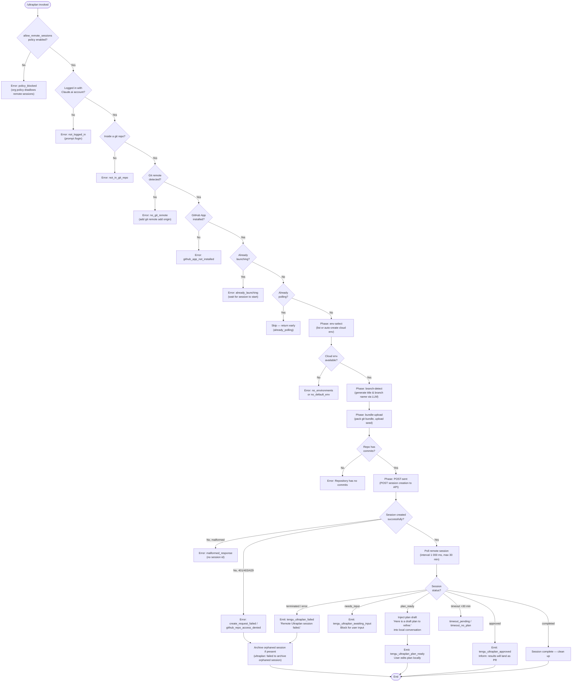

# `/ultraplan`

> Analysis basis: CC v2.1.167 bundle.js (AST extraction + Claude interpretation)
> Minimum version: v2.1.167

---

## Overview

`/ultraplan` drafts an editable plan in Claude Code on the web by launching a remote session (teleport) against a cloud environment. The command performs a multi-phase preflight check (authentication, git repo, remote URL, GitHub App installation, org policy), uploads a git bundle as the session seed, and then polls the remote session until a plan is ready or the session reaches a terminal state. Once the plan is returned, it is injected into the local conversation as an editable draft for the user to refine.

---

## Registration

| Field | Value |
|---|---|
| type | `local-jsx` |
| name | `ultraplan` |
| description | `"Draft an editable plan in Claude Code on the web ( ... ) · See  ... "` |
| argumentHint | `<prompt>` |
| load_inline | `true` |
| load_ident | `syf` |
| loc_byte | `12248316` |
| loc_byte_end | `12248548` |
| loc_line | `8620` |
| arbor_handler.name | `syf` |
| arbor_handler.fqn | `claude-2.1.167::syf` |
| arbor_handler.kind | `AsyncFunction` |
| arbor_handler.resolution_path | `load_ident` |
| arbor_handler.n_hits | `1` |

Analysis basis: CC v2.1.167 bundle.js:+12248316

---

## Input Branching

The handler has many distinct branches across precondition checking, launch-state guards, plan polling, and error handling. A flowchart is used.



---

## Behavioral Spec

### Top-level handler (`syf`)

Analysis basis: CC v2.1.167 bundle.js:+12246456

```
async function ultraplanHandler(args, context):
    // Check org policy gate
    if not appState.allow_remote_sessions:
        return errorResult("policy_blocked",
            "Remote sessions are disabled by your organization's policy...")

    // Parse prompt from args (see promptExtractor)
    prompt = extractPromptText(args)

    // Read appState for session tracking
    state = args.getAppState()

    // Run preflight eligibility checks
    eligibility = await checkRemoteEligibility(context)
    if eligibility.failed:
        return errorResult(eligibility.code, eligibility.message)

    // Guard against double-launch
    if sessionState.isAlreadyLaunching:
        return errorResult("already_launching",
            "ultraplan: already launching. Please wait for the session to start.")
    if sessionState.isAlreadyPolling:
        return SKIP   // return early silently

    // Invoke the plan launch orchestrator
    result = await launchUltraplanSession(prompt, context)

    // On failure, attempt to archive any orphaned session
    if result.failed:
        tryArchiveOrphanedSession()
        if result.code == "create_api_fail":
            emitError("create_api_fail", result.message + ". See --debug for details.")
        else if result.code == "unexpected_error":
            setAppStateMessage("Ultraplan hit an unexpected error during launch.")
        return

    // Update appState
    args.setAppState(newState)
```

Analysis basis: CC v2.1.167 bundle.js:+12246456, +12246791, +12247013

---

### Prompt extraction (`lv8` / `cv8` / `Ns_`)

Analysis basis: CC v2.1.167 bundle.js:+12246456, +9951570, +9951364

```
function extractPromptText(rawInput):
    // Normalize input via startsWith scan (Ns_)
    normalized = normalizeInput(rawInput)    // loc: 9951364

    // Match all occurrences with regex flag "gi" (loc: 9951018)
    matches = normalized.matchAll(/<pattern>/gi)

    // Build text segments, filtering known prefixes
    segments = []
    for match in matches:
        if not segments.some(existingMatch):
            segments.push(match)

    // Slice and clean replacement ("$1$2", loc: 9951695)
    // Truncate to max 5 segments (loc: 9951718)
    result = segments
        .slice(0, 5)
        .join(" ")
        .replace(/<pattern>/, "$1$2")

    // Tag this prompt identifier for telemetry
    emit("tengu_ultraplan_prompt_identifier", result)
    return result
```

Analysis basis: CC v2.1.167 bundle.js:+9950620, +9951018, +9951370, +9951695, +9951718

The literal string `"ultraplan"` (loc: 9951370) is used during matching to detect when the word "ultraplan" appears anywhere in the user's message, enabling implicit invocation without the slash prefix.

---

### Remote eligibility check (`kDq`)

Analysis basis: CC v2.1.167 bundle.js:+9143027

```
async function checkRemoteEligibility(context):
    // 1. Policy check
    if orgPolicy.disallowsRemoteSessions:
        return fail("policy_denied",
            "Remote sessions are disabled by your organization's policy.")

    // 2. First-party provider check
    if not isFirstPartyProvider():
        return fail("not_first_party",
            "Remote sessions are only available on the first-party Anthropic API provider.")

    // 3. Access token check
    token = getAccessToken()
    if not token:
        return fail("no_access_token",
            "No access token found for remote session creation")
        // logs token state as "set"/"unset"

    // 4. Org UUID check
    orgUuid = await getOrgUuid(token)
    if not orgUuid:
        return fail("no_org_uuid",
            "Unable to get organization UUID for remote session creation")

    // 5. Git repo check
    if not inGitRepo():
        return fail("not_in_git_repo")

    // 6. GitHub remote check
    remoteUrl = await getGitRemoteUrl()   // git config --get remote.origin.url
    if not remoteUrl:
        return fail("no_git_remote",
            "Background tasks require a GitHub remote. Add one with `git remote add origin REPO_URL`.")

    // 7. BYOC header setup: "ccr-byoc-2025-07-29" (loc: 9070650)
    headers["anthropic-beta"] = "ccr-byoc-2025-07-29"
    headers["x-organization-uuid"] = orgUuid

    emit("tengu_ccr_bundle_seed_enabled", ...)
    return success
```

Analysis basis: CC v2.1.167 bundle.js:+9143027, +9069708, +9069825, +9069969, +9070297, +9070650, +9070672

---

### Launch orchestrator (`bR6`)

Analysis basis: CC v2.1.167 bundle.js:+12243695

```
async function launchUltraplanSession(prompt, context):
    // Phase: env-select (loc: 9072662)
    log("[teleport] phase: env-select")
    envList = await listTeleportEnvironments()
    if envList.empty:
        // Auto-create default cloud env
        defaultEnv = await createDefaultCloudEnvironment()
        if not defaultEnv:
            warn("Could not create a cloud environment. Set one up at " +
                 "https://claude.ai/code/onboarding?magic=env-setup")
            return fail("no_default_env")
        log("[teleportToRemote] Auto-created default cloud env")

    selectedEnv = pickEnvironment(envList)
    if not selectedEnv:
        return fail("no_environments",
            "No environments available for session creation")

    // Phase: branch-detect (loc: 9074465)
    log("[teleport] phase: branch-detect")
    branchInfo = await generateTitleAndBranch(prompt)
    // Branch name prefix: "claude/task/{description}" truncated to 75 chars (loc: 9057723)

    // Phase: bundle-upload (loc: 9075601)
    log("[teleport] phase: bundle-upload")
    uploadResult = await uploadGitBundle(context)
    if uploadResult.failed:
        return fail(uploadResult.code, uploadResult.message)

    // Determine source decision
    emit("tengu_teleport_source_decision", ...)
    emit("tengu_teleport_bundle_mode", ...)

    // Phase: POST session (loc: 9077649)
    log("[teleport] phase: POST-sent")
    response = await qA.post(sessionCreationEndpoint, payload)

    if response.status >= 500:
        return fail("create_request_failed")
    if response.status in [401, 403, 429]:
        return fail("github_repo_access_denied")
    if response.status not in [200, 201]:
        return fail("create_request_failed")
    if not response.data.sessionId:
        return fail("malformed_response",
            "Server returned a malformed session response (no session id)")

    emit("tengu_ultraplan_launched", ...)

    // Hand off to polling loop
    return await pollUltraplanSession(response.data.sessionId, prompt)
```

Analysis basis: CC v2.1.167 bundle.js:+12243695, +9072662, +9074465, +9075601, +9077649, +9072009, +9072077, +9072458

---

### Git bundle upload (`Ki_`)

Analysis basis: CC v2.1.167 bundle.js:+9054347

```
async function uploadGitBundle(context):
    emit("tengu_ccr_bundle_upload", ...)

    // Verify git repo is not empty
    if not isInGitRepo():
        return fail("empty_repo", "Not in a git repository")

    // Check for commits via git for-each-ref --count=1 refs/
    hasCommits = gitForEachRef(["--count=1", "refs/"])
    if not hasCommits:
        return fail("empty_repo",
            "Repository has no commits — run `git add . && git commit -m \"initial\"` then retry")

    // Create a git stash bundle: refs/seed/stash, refs/seed/root
    stashResult = git(["stash", "create"])
    if stashResult.status != 200:
        return fail("stash_failed")

    // Pack bundle as "ccr-seed.bundle" / "_source_seed.bundle"
    bundlePath = tempDir + "/ccr-seed.bundle"
    packResult = packBundle(bundlePath)
    if packResult.failed:
        return fail("upload_failed", "failed")

    // Upload — choose strategy: head / fallback_head / squashed / fallback_squashed
    uploadMode = chooseBundleMode()
    emit("tengu_ccr_bundle_upload", { mode: uploadMode })

    // Clean up temp file after upload
    r86.unlink(bundlePath)

    return success({ mode: uploadMode })
```

Analysis basis: CC v2.1.167 bundle.js:+9054347, +9054437, +9054477, +9054865, +9055672, +9055979, +9056084, +9056280

---

### Session poll loop (`nyf` / `YHK` / `RDq`)

Analysis basis: CC v2.1.167 bundle.js:+12239796, +12230188

```
async function pollUltraplanSession(sessionId, prompt):
    // Poll interval: 1000 ms (loc: 9151546)
    // Max poll duration: 1 800 000 ms = 30 minutes (loc: 9151553)
    // Timeout for plan delivery: 5 400 seconds (loc: 12239362)

    emit("tengu_ultraplan_timeout_seconds", 5400)

    startTime = Date.now()
    while elapsed < MAX_POLL_DURATION:
        response = await fetchSessionStatus(sessionId)

        if networkError:
            // Retry with back-off; after repeated failures:
            emit("network_or_unknown")
            return fail("Lost connection to the remote session after repeated retries — " +
                        "the session may still be running")

        status = response.status

        if status == "plan_ready":
            planText = extractPlanText(response)
            emit("tengu_ultraplan_plan_ready", ...)
            injectIntoChatAs("Here is a draft plan to refine:\n" + planText)
            return success

        if status == "needs_input":
            emit("tengu_ultraplan_awaiting_input", ...)
            awaitUserInput()
            continue

        if status == "approved":
            emit("tengu_ultraplan_approved", ...)
            injectIntoChatAs("Results will land as a pull request when the remote session finishes. " +
                             "There is nothing to do here.")
            return success

        if status in ["terminated", "archived", "error"]:
            elapsedMin = Math.round(elapsed / 60000)
            emit("tengu_ultraplan_failed", ...)
            injectIntoChatAs("Remote Ultraplan session failed. Wait for the user's next instructions.")
            return fail

        if status == "completed":
            cleanupSession()
            return success

        // Check timeout
        if elapsed > 5400 * 1000:
            emit("tengu_ultraplan_failed", ...)
            if planWasNeverDelivered:
                return fail("timeout_no_plan")
            else:
                return fail("timeout_pending")

        await sleep(1000)
```

Analysis basis: CC v2.1.167 bundle.js:+12239328, +12239362, +12239892, +12240040, +12240448, +12241325, +12230333, +12230686, +12231378, +12231393, +12231731, +12231749, +9151546, +9151553

---

### Plan draft injection (`lyf` / `cyf`)

Analysis basis: CC v2.1.167 bundle.js:+12239662

```
function buildPlanDraftMessage(rawPlanText):
    lines = []
    lines.push("Here is a draft plan to refine:")   // loc: 12239669
    formattedBody = formatPlanBody(rawPlanText)      // cyf: gyf sub-formatter
    lines.push(formattedBody)
    return lines.join("\n")
```

Analysis basis: CC v2.1.167 bundle.js:+12239662, +12239722, +12239752

---

### Environment listing / auto-creation (`Tt` / `g86`)

Analysis basis: CC v2.1.167 bundle.js:+9018324, +9019247

```
async function listTeleportEnvironments():
    emit("teleport_environments_list")
    // Requires first-party provider; timeout 15 000 ms (loc: 9018962)
    response = await qA.get(environmentsEndpoint, { timeout: 15000 })
    return response.data.environments

async function createDefaultCloudEnvironment():
    emit("teleport_default_environment_create")
    // POST with preset: python 3.11, node 20, /home/user workdir (loc: 9019830..9019876)
    payload = {
        name: "Default",
        display_name: "Default - trusted network access",
        provider: "anthropic_cloud",
        home_dir: "/home/user",
        runtimes: [{ name: "python", version: "3.11" }, { name: "node", version: "20" }]
    }
    response = await qA.post(environmentsEndpoint, payload)
    return response.data
```

Analysis basis: CC v2.1.167 bundle.js:+9018327, +9018962, +9019247, +9019692, +9019768, +9019830, +9019847, +9019861, +9019876

---

### GitHub App check (`qCH`)

Analysis basis: CC v2.1.167 bundle.js:+9020664

```
async function checkGithubAppInstalled(token, orgUuid):
    if not token:
        log("checkGithubAppInstalled: No access token found, assuming app not installed")
        return false
    if not orgUuid:
        log("checkGithubAppInstalled: No org UUID found, assuming app not installed")
        return false

    response = await qA.get(githubAppCheckEndpoint)
    if qA.isAxiosError(response):
        if response.status == 400:
            return false
    // log: GitHub App "is" / "is not" installed
    return response.data.installed
```

Analysis basis: CC v2.1.167 bundle.js:+9020697, +9020810, +9021208, +9021213, +9021414, +9021468

---

### Title and branch generation (`gr7`)

Analysis basis: CC v2.1.167 bundle.js:+9057718

```
async function generateTitleAndBranch(promptText):
    // Truncate description to 75 chars (loc: 9057723)
    truncatedDesc = promptText.slice(0, 75)

    // Build branch name: "claude/task/{description}" with replacement
    branchName = ("claude/task/" + truncatedDesc)
        .replace(/[^a-zA-Z0-9\-_\/]/, "-")    // Fr7.replace

    // Call LLM with JSON schema tool: fields "title" and "branch" (loc: 9057953, 9057961)
    schema = I.object({
        title: I.string(),
        branch: I.string()
    })
    emit("teleport_generate_title")
    result = await callLLM({ schema, prompt: promptText })
    return { title: result.title, branch: branchName }
```

Analysis basis: CC v2.1.167 bundle.js:+9057718, +9057723, +9057729, +9057765, +9057953, +9057961, +9058027

---

### Session notification / task tracking (`JCH` / `RDq`)

Analysis basis: CC v2.1.167 bundle.js:+9149865

```
async function manageRemoteAgentSession(sessionId):
    // Generate 8-byte random session token (loc: 13293425)
    token = I3K.randomBytes(8)

    // Open browser/notification link (S86: xe.open)
    openSessionLink(sessionId)

    // Record start time
    startedAt = Date.now()

    // Poll using remote-workflow protocol (loc: 9152206)
    // Handles hook_progress, hook_response, hook_started, SessionStart events
    // States: pending → running → completed / archived / terminated

    // On "result" message: extract plan text
    // On "error" message: "remote session returned an error" (loc: 9154154)
    // Enforce 30-minute hard cap: "remote session exceeded 30 minutes" (loc: 9154195)
    // If no review output: "no review output — orchestrator may have exited early" (loc: 9154232)

    // setTimeout used as hard deadline (loc: 9154764)
    setTimeout(hardStop, MAX_SESSION_DURATION)
```

Analysis basis: CC v2.1.167 bundle.js:+9149865, +9149884, +9150128, +9152206, +9154154, +9154195, +9154232, +9154764

---

## State & Side Effects

| Item | Detail |
|---|---|
| Telemetry | `tengu_ultraplan_create_failed` (loc: 12243732), `tengu_ultraplan_prompt_identifier` (loc: 12239495), `tengu_ultraplan_launched` (loc: 12245414), `tengu_ultraplan_timeout_seconds` (loc: 12239328), `tengu_ultraplan_awaiting_input` (loc: 12239972), `tengu_ultraplan_plan_ready` (loc: 12240040), `tengu_ultraplan_approved` (loc: 12240448), `tengu_ultraplan_failed` (loc: 12241325), `tengu_ccr_bundle_seed_enabled` (loc: 9143500), `tengu_ccr_bundle_upload` (loc: 9054669), `tengu_teleport_bundle_mode` (loc: 9071054), `tengu_ccr_session_link` (loc: 9064602), `tengu_teleport_source_decision` (loc: 9076511), `tengu_teleport_environments_list` (via `Tt`), `tengu_teleport_default_environment_create` (via `g86`), `tengu_teleport_generate_title` (via `gr7`), `tengu_config_parse_error` (loc: 3268051), `tengu_bg_dispatch_sigkill_escalate` (loc: 16196804), `tengu_bg_low_mem_mb` (loc: 13052015), `tengu_bg_dispatch_low_mem` (loc: 16197405), `tengu_bg_spare_enable` (loc: 16198109), `tengu_bg_spare_claim` (loc: 16198237), `tengu_bg_spare_claim_fail` (loc: 16198503) |
| `appState` reads | `allow_remote_sessions` (loc: 12246477), session launching/polling flags via `_.getAppState()` (loc: 12246791) |
| `appState` writes | Session state, prompt identifier, task status via `_.setAppState()` (loc: 12247013) |
| Hook registration | `j9` calls `VPA.register` (loc: 60369); `IVL` registers file-watch hooks (`HK8.watchFile` / `HK8.unwatchFile`) for config changes (loc: 3263671, 3264004) |
| File I/O | Git bundle written to temp file (`ccr-seed.bundle`, `_source_seed.bundle`); deleted via `r86.unlink` after upload (loc: 9056624); config read via `q.readFileSync` (loc: 3267476); config directory created via `q.mkdirSync` (loc: 3268230) |
| Network | `qA.get` for environment list (loc: 9018882, 9021067); `qA.post` for session creation (loc: 9071919, 9080076); `qA.post` for default env creation (loc: 9019639); `qA.isAxiosError` / `qA.isCancel` for error classification (loc: 9021414, 9079577) |
| Browser launch | `xe.open` called to open remote session link (loc: 13292340) |
| Random UUID | `fi_.randomUUID()` (loc: 9069278) for control-request event IDs; `I3K.randomBytes(8)` (loc: 13293409) for session tokens |
| Session cleanup | `av6` calls `wL.unlink` to remove session artefacts (loc: 13204662); orphaned session archived via `Dp` → `qA.post` (loc: 9080076) |
| Daemon / background session | `w` (daemon spawner) creates background session via `YQ.spawn` (loc: 16198566); spare slot management via `mwA` (`YQ.claim`, loc: 16176386); `QwA` manages session lifecycle (add/delete/retire) |
| Sound | <!-- TODO: not found in depth-2 traversal; needs --depth 4 --> |

---

## Version History

| Version | Change |
|---|---|
| v2.1.167 | Initial analysis |

---

## Common Mistakes

1. **Invoking without a Claude.ai login**: `/ultraplan` requires OAuth authentication via `/login` with a Claude.ai account. API key authentication alone is not sufficient and results in a `not_logged_in` error.
2. **Running outside a git repository**: The command requires a git repo with at least one commit. Running in an empty directory or a repo with no commits will fail at the bundle-upload phase with `empty_repo` or `not_in_git_repo`.
3. **Missing GitHub remote**: A `remote.origin.url` pointing to a GitHub host is required. A local-only repo triggers `no_git_remote`. Add one with `git remote add origin REPO_URL`.
4. **GitHub App not installed**: The Anthropic GitHub App must be installed on the target organization. If not, the preflight check returns `github_app_not_installed` and directs users to `https://claude.ai/code`.
5. **Org policy block**: Administrators can disable remote sessions. Users will see a `policy_blocked` message; contact the org admin to enable `allow_remote_sessions`.
6. **Double invocation**: Triggering `/ultraplan` while it is already launching shows "ultraplan: already launching. Please wait for the session to start." The same word "ultraplan" anywhere in a subsequent prompt also re-triggers the command implicitly, which can cause unexpected re-invocations.
7. **Non-first-party API provider**: Remote sessions require the first-party Anthropic API. Custom or enterprise API base URLs will fail with `not_first_party`.

---

## Appendix — Identifier Mapping

> For bundle debugging only. Identifiers change across versions.

| Identifier | Role |
|---|---|
| `syf` | Top-level `ultraplan` async handler (entry point) |
| `lv8` | Prompt text extraction wrapper |
| `cv8` | Inner prompt parser |
| `Ns_` | Input normalizer / regex segment builder |
| `bR6` | Ultraplan session launch orchestrator |
| `ayf` | Plan session manager (wraps poll + injection) |
| `nyf` | Session poll loop controller |
| `YHK` | Session status ingestion / progress tracker |
| `RDq` | Remote session event processor (hook_progress / result) |
| `JCH` | Remote agent session manager (token gen, browser open, hard deadline) |
| `pn` | Teleport-to-remote core function |
| `kDq` | Remote eligibility checker |
| `X9` | Auth / eligibility sub-checker |
| `sIH` | Session info helper |
| `cC` | Plan context builder |
| `KP6` | Config file reader |
| `b7H` | Account type checker (firstParty/enterprise/team) |
| `Tt` | Environment list fetcher |
| `g86` | Default cloud environment creator |
| `gr7` | Title and branch name generator (LLM-assisted) |
| `Ki_` | Git bundle upload handler |
| `qCH` | GitHub App installation checker |
| `jI` | Default branch detector (symbolic-ref / show-ref) |
| `lyf` | Plan draft message builder |
| `cyf` | Plan body formatter |
| `Fyf` | Session finalization helper |
| `oyf` | Plan extraction helper |
| `av6` | Session artefact cleanup |
| `Dp` | Orphaned session archiver / API poster |
| `nYq` | Session link emitter |
| `iYq` | Control-request event builder (randomUUID) |
| `e2H` | Eligibility check dispatcher |
| `uC8` | Session state update helper |
| `xC8` | Session context reader |
| `D6` | Daemon session state manager |
| `Qyf` | Session context resolver |
| `ryf` | Session result router |
| `OD` | Environment URL selector (local/staging/prod) |
| `y_` | Module bootstrap / export helper |
| `bI_` | Claude.ai base URL builder |
| `GHK` | Session guard / in-flight tracker |
| `w` | Daemon background session spawner |
| `mwA` | Spare slot claim manager |
| `QwA` | Session lifecycle manager (add/delete/retire/cleanup) |
| `C6` | Config manager (read/watch) |
| `LwH` | Config file loader with backup |
| `IVL` | Config file watcher (watchFile/unwatchFile) |
| `Vo1` | Config directory resolver |
| `sP_` | Config backup path builder |
| `a96` | Session parallel initializer (Promise.all) |
| `_6` | Telemetry level resolver |
| `$q` | Telemetry level string converter |
| `QRA` | Telemetry mode resolver |
| `ILH` | Telemetry identity helper |
| `hH` | Error logger / telemetry error reporter |
| `Yu` | Org UUID fetcher |
| `F1` | OAuth URL validator |
| `gj` | API version header builder |
| `Oi_` | Access token retriever |
| `sR` | Git remote URL resolver (git config --get remote.origin.url) |
| `H9` | Config schema validator |
| `q6H` | Remote URL parser (protocol classifier: https/http) |
| `aL` | Anthropic API client factory |
| `B3` | Request auth injector |
| `R6` | Environment resolver |
| `v` | Logger / debug writer |
| `J6` | Spinner / progress indicator |
| `P6` | Async task wrapper |
| `l` | Promise utility |
| `L` | In-flight set tracker (add/finally/delete) |
| `Cv6` | Session payload builder |
| `RH` | JSON serializer wrapper |
| `GH` | String coercion helper |
| `AA` | Error message extractor |
| `vz` | Cancellation state checker |
| `rO` | Retry wrapper |
| `Bk` | Random bytes / session ID generator |
| `S86` | Session browser opener |
| `a2` | Session timestamp recorder |
| `To7` | Session status string builder |
| `jv` | Task event dispatcher |
| `w1f` | Task started event emitter |
| `Y1f` | Task updated event emitter |
| `j1f` | Task start recorder |
| `J1f` | Task state updater |
| `f9H` | Task activity tracker |
| `Ws_` | Workflow state writer |
| `K` | Column formatter (padEnd) |
| `mh` | Memory usage checker / daemon health helper |
| `cx8` | macOS memory monitor |
| `CH` | Feature check success handler |
| `SH` | Feature check OK handler |
| `Q` | Process kill / adopt manager |
| `D` | Forced-shutdown handler |
| `co` | Config change callback |
| `$MH` | Session metadata holder |

---

Note: index built via Arbor fallback; some signals (telemetry, literals) may be missing — see arbor-fallback.js.