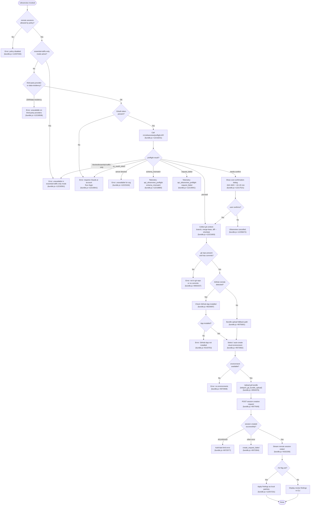

# `/ultrareview`

> Analysis basis: CC v2.1.167 bundle.js (AST extraction + Claude interpretation)
> Minimum version: v2.1.167

---

## Overview

`/ultrareview` launches a cloud-hosted agent session that performs deep bug-finding and verification on the current git branch, running entirely within Claude Code on the web. It executes a multi-phase preflight sequence — checking policy, account, git state, and cost — before teleporting a git bundle to a remote environment where the review agent runs asynchronously. Results (and optional auto-fix patches) are streamed back to the local CLI.

---

## Registration

| Field | Value |
|---|---|
| type | `local-jsx` |
| name | `ultrareview` |
| description | `"Start a cloud agent that finds and verifies bugs in your branch ( ... , ... USD) · Runs in Claude Code on the web. See ..."` |
| loc_byte | `12259838` |
| loc_byte_end | `12260108` |
| loc_line | `8645` |
| module_id | `vHK` |
| load_inline | `true` |
| arbor_handler.name | `Dhf` |
| arbor_handler.fqn | `claude-2.1.167::Dhf` |
| arbor_handler.kind | `AsyncFunction` |
| arbor_handler.resolution_path | `module_id` |
| arbor_handler.n_hits | `1` |

Analysis basis: CC v2.1.167 bundle.js:+12259838

The handler was resolved via `module_id` → module `vHK` → export `Dhf`. The registration block spans bytes `(12259838, 12260108)`.

---

## Input Branching

The command has more than three distinct decision paths (policy check → auth check → git-state check → cost/overage check → preflight API call → environment selection → bundle upload → session launch → result streaming), requiring a Mermaid flowchart.



---

## Behavioral Spec

### 1. Top-level Handler (`Dhf`)

```
async function ultrareviewHandler(args, appState):
    if not isRemoteSessionsAllowed(appState):
        displayError("Remote sessions are disabled by your organization's policy.")
        return

    gitContext    = collectGitContext()          // MHK  — branch, merge-base, diff stats
    preflightData = runPreflightChecks(appState) // eKA  — policy + API preflight
    costConfig    = loadCostConfig(appState)     // H4A  — fetch /v1/ultrareview/preflight result
    sessionUI     = renderUltrareviewUI(args,    // Yhf  — JSX component
                        gitContext,
                        preflightData,
                        costConfig)
    return sessionUI
```

Analysis basis: CC v2.1.167 bundle.js:+12257493

### 2. Policy Guard (`X9`)

```
function checkRemoteSessionPolicy(appState):
    if pgL.has(appState):           // first-party check (bundle.js:+4185137)
        return buildPolicyResult(appState)
    if allow_product_feedback flag missing:
        return blocked
    if UgL.has(appState):           // essential-traffic flag (bundle.js:+4185687)
        return "essential-traffic-only blocked"
    return allowedResult
```

Key literals checked:
- `"firstParty"` — provider type check (bundle.js:+4185137)
- `"enterprise"` / `"team"` — org tier checks (bundle.js:+4185410, +4185445)
- `"allow_remote_sessions"` — feature-flag key (bundle.js:+12257496)
- `"allow_product_feedback"` — secondary flag (bundle.js:+4185711)

Analysis basis: CC v2.1.167 bundle.js:+4185655

### 3. Git Context Collection (`MHK` / `RC8`)

```
function collectGitContext():
    rawBranch = git("branch", "--abbrev-ref", "HEAD")   // bundle.js:+1120949
    defaultBranch = resolveDefaultBranch()               // bundle.js:+1107953
    mergeBase = git("merge-base", defaultBranch, HEAD)   // bundle.js:+12221603
    diffStat  = git("diff", "--shortstat", mergeBase)    // bundle.js:+12222117
    remoteUrl = getRemoteOriginUrl()                     // bundle.js:+1109930
    return { branch, defaultBranch, mergeBase, diffStat, remoteUrl }
```

- Remote URL is sanitized: credentials matching `://***@` pattern are stripped (bundle.js:+1112935).
- Repository detection uses `git rev-parse --is-inside-work-tree` (bundle.js:+9020562).
- Default branch resolution tries `refs/remotes/origin/HEAD` first, then falls back to `main` / `master` (bundle.js:+1121259, +1121266).

Analysis basis: CC v2.1.167 bundle.js:+12219755

### 4. Preflight API Call (`KHK` / `eKA`)

```
async function runPreflight(authToken, orgId):
    if essentialTrafficOnlyMode:
        return { status: "blocked", reason: "essential-traffic-only" }
                                                // bundle.js:+12218325
    if providerIsZDR or dataResidency:
        return { status: "blocked", reason: "data_residency" }
                                                // bundle.js:+12218598
    if not oauthToken:
        return { status: "no-auth", reason: "no_oauth_token" }
                                                // bundle.js:+12218713

    response = POST("/v1/ultrareview/preflight", headers={
        "teleport-org": orgUUID              // bundle.js:+12218265
    })

    emit telemetry("api_ultrareview_preflight", result)
                                             // bundle.js:+12218852

    switch response.status:
        case "proceed":   return proceedResult
        case "server":    return serverBlockedResult
        case "needs-confirm": return confirmResult
        case "blocked":   return blockedResult
```

Analysis basis: CC v2.1.167 bundle.js:+12218231

### 5. Cost / Overage Confirmation (`H4A` / `KHK`)

```
async function loadCostAndConfirm(preflightResult):
    diffLineCount = computeDiffLines()       // bundle.js:+12217401
    estimatedCost = computeCost(diffLines,   // range $10–$20, bundle.js:+12217521
                        500 min lines,       // bundle.js:+12217846
                        50000 max lines)     // bundle.js:+12217880

    if preflightResult.status == "needs-confirm":
        show confirmation dialog
        emit telemetry("tengu_review_overage_dialog_shown")
                                             // bundle.js:+12258165
        if user cancels:
            return "cancelled"
    return "proceed"
```

Analysis basis: CC v2.1.167 bundle.js:+12222862

### 6. Environment Selection & Bundle Upload (`pn` / `Ki_`)

```
async function teleportToRemote(gitContext, sessionConfig):
    // Phase: env-select (bundle.js:+9072662)
    environments = listRemoteEnvironments()
    if environments is empty:
        autoCreate = createDefaultCloudEnvironment()
                                             // bundle.js:+9072769
        if autoCreate fails:
            warn("Could not create a cloud environment. ...")
                                             // bundle.js:+9072927
            emit telemetry("tengu_teleport_bundle_mode")

    // Phase: branch-detect (bundle.js:+9074465)
    branchInfo = detectBranchAndSource()

    // Phase: bundle-upload (bundle.js:+9075601)
    if useGitHub and githubAppInstalled:
        sourceMode = "github"
    else:
        bundle = packGitBundle(gitContext)   // Ki_ — creates .bundle file
        emit telemetry("tengu_ccr_bundle_upload")
                                             // bundle.js:+9054669
        sourceMode = "bundle"

    emit telemetry("tengu_teleport_source_decision", sourceMode)
                                             // bundle.js:+9076511
```

Bundle constraints:
- Maximum bundle size: 5,000,000 bytes (bundle.js:+9051818)
- Git object count threshold for seed enablement is checked via `git count-objects -v` (bundle.js:+9051377)
- Bundle files are written with `.bundle` extension to a temporary path (bundle.js:+9055683)

Analysis basis: CC v2.1.167 bundle.js:+9070799

### 7. Session Creation (`pn` / `qA.post`)

```
async function createRemoteSession(envId, sourceConfig, taskPrompt):
    // Phase: POST-sent (bundle.js:+9077649)
    payload = {
        environment: envId,
        source: sourceConfig,   // "bundle" | "github" | "explicit_source_url"
        task: taskPrompt,
        permissionMode: "user"  // bundle.js:+9069494
    }
    headers = {
        "anthropic-beta": "ccr-byoc-2025-07-29",  // bundle.js:+9070650
        "x-organization-uuid": orgUUID,            // bundle.js:+9070672
    }

    response = POST(sessionEndpoint, payload, headers)

    switch response.status:
        case 201: return { sessionId: response.data.id }
        case 401/403/429: throw auth/rate error
        case other:
            emit telemetry("tengu_review_remote_teleport_failed")
            throw error("create_request_failed")  // bundle.js:+9072304

    if not response.data.id:
        throw error("Server returned a malformed session response (no session id)")
                                                   // bundle.js:+9072458
```

Analysis basis: CC v2.1.167 bundle.js:+9071919

### 8. Session Polling / Streaming (`RDq` / `JCH`)

```
async function monitorRemoteSession(sessionId):
    MAX_DURATION = 1,800,000 ms  // 30 minutes (bundle.js:+9151553)
    startTime = Date.now()

    while elapsed < MAX_DURATION:
        event = pollSessionEvent(sessionId)

        switch event.type:
            case "SessionStart":   updateStatus("starting")
            case "hook_started":   updateStatus("idle")
            case "hook_progress":  appendStreamChunk(event.data)
            case "hook_response":  processToolResponse(event.data)
            case "result":         extractFinalOutput(event.data)
            case "completed":      return success
            case "archived":       break
            case "remote-workflow": handleWorkflowEvent(event)

        if session.error:
            throw "remote session returned an error"  // bundle.js:+9154154

    throw "remote session exceeded 30 minutes"        // bundle.js:+9154195

    if no review output found:
        throw "no review output — orchestrator may have exited early"
                                                      // bundle.js:+9154232
```

Analysis basis: CC v2.1.167 bundle.js:+9150390

### 9. Result Application with `--fix` (`_4A` / `Yhf`)

```
function applyOrDisplayResults(findings, args):
    if args.includes("--fix"):
        // Instruction appended to task: apply findings to local working tree
        // (bundle.js:+12257231)
        for each finding in findings:
            applyPatchToWorkingTree(finding)
        emit telemetry("tengu_review_remote_launched")
    else:
        renderFindingsInCLI(findings)

    emit telemetry("tengu_review_remote_launched")   // bundle.js:+12226273
```

Analysis basis: CC v2.1.167 bundle.js:+12258384

### 10. Git Bundle Seed Upload (`Ki_`)

```
async function uploadGitBundleSeed(gitRoot):
    emit telemetry("teleport_git_bundle_upload")     // bundle.js:+9054376

    if not isInsideGitWorkTree():
        emit error("empty_repo")                     // bundle.js:+9054405
        throw "Not in a git repository"

    // Clean up any previous seed refs
    git("update-ref", "-d", "refs/seed/stash")       // bundle.js:+9054528
    git("update-ref", "-d", "refs/seed/root")

    commitCount = git("for-each-ref", "--count=1", "refs/")
    if commitCount == 0:
        throw "Repository has no commits yet"        // bundle.js:+9054787

    // Create stash bundle
    stashResult = git("stash", "create")             // bundle.js:+9054865
    bundlePath = tempDir + "/ccr-seed.bundle"        // bundle.js:+9055672

    uploadResult = uploadBundle(bundlePath, presignedUrl)
    if uploadResult.status != 200:
        emit error("stash_failed")                   // bundle.js:+9055314
```

Analysis basis: CC v2.1.167 bundle.js:+9054354

---

## State & Side Effects

| Item | Detail |
|---|---|
| Telemetry: `tengu_feature_sad` | Emitted on feature check failure (bundle.js:+1011093) |
| Telemetry: `tengu_feature_ok` | Emitted on feature check success (bundle.js:+1010950) |
| Telemetry: `tengu_review_remote_precondition_failed` | Emitted when any preflight precondition fails (bundle.js:+12219894) |
| Telemetry: `tengu_ccr_bundle_max_bytes` | Emitted when bundle exceeds size limit (bundle.js:+9051292) |
| Telemetry: `tengu_review_bughunter_config` | Emitted with diff-line config values (bundle.js:+12217404) |
| Telemetry: `tengu_review_overage_blocked` | Emitted when cost overage check blocks launch (bundle.js:+12257828) |
| Telemetry: `tengu_review_overage_dialog_shown` | Emitted when cost confirmation dialog is displayed (bundle.js:+12258165) |
| Telemetry: `tengu_ccr_bundle_seed_enabled` | Emitted when seed bundle path is activated (bundle.js:+9143500) |
| Telemetry: `tengu_ccr_bundle_upload` | Emitted on each bundle upload attempt (bundle.js:+9054669) |
| Telemetry: `tengu_teleport_bundle_mode` | Emitted to record the bundle transmission mode chosen (bundle.js:+9071054) |
| Telemetry: `tengu_ccr_session_link` | Emitted with the remote session link URL (bundle.js:+9064602) |
| Telemetry: `tengu_teleport_source_decision` | Records which source mode was selected (github/bundle/none) (bundle.js:+9076511) |
| Telemetry: `tengu_review_remote_teleport_failed` | Emitted when teleport session creation fails (bundle.js:+12225750) |
| Telemetry: `tengu_review_remote_launched` | Emitted on successful remote session launch (bundle.js:+12226273) |
| Telemetry: `teleport_git_bundle_upload` | Records git bundle upload outcome (success/failure/mode) (bundle.js:+9054376) |
| Telemetry: `teleport_environments_list` | Records environment listing result (bundle.js:+9018327) |
| Telemetry: `teleport_default_environment_create` | Records auto-creation of default cloud env (bundle.js:+9019247) |
| Telemetry: `teleport_generate_title` | Records LLM-generated task title (bundle.js:+9058027) |
| Telemetry: `bg_remote_eligibility_check` | Records eligibility check result with reason codes (bundle.js:+9143097) |
| File system | Temporary `.bundle` file written to OS temp directory, unlinked after upload (bundle.js:+9055683, +9056624) |
| File system | Log files appended via `ly.appendFile`; rotated/renamed via `cl8` (bundle.js:+205563) |
| appState changes | Remote session state stored; session events update UI via JSX component `Yhf` |
| Network | HTTP POST to `/v1/ultrareview/preflight` and session creation endpoint; polling loop for events |
| Hook registration | `VPA.register` called within the process output handler (bundle.js:+60369) |
| Sound | None detected |

---

## Version History

| Version | Change |
|---|---|
| v2.1.167 | Initial analysis |

---

## Common Mistakes

1. **Running without a Claude.ai OAuth account**: `/ultrareview` requires OAuth login (`/login`), not just an `ANTHROPIC_API_KEY`. Using only an API key results in a `no_oauth_token` / `no-auth` error (bundle.js:+12218641).
2. **Running in a repo without a GitHub remote**: The primary source mode requires a GitHub remote. Without one the command falls back to bundle upload, which requires the GitHub App to be installed; failing both paths produces a hard error (bundle.js:+9145216).
3. **Running in a repo with no commits**: The command requires at least one commit. An empty repository causes an immediate `empty_repo` / `Repository has no commits yet` failure (bundle.js:+9054787).
4. **Running in essential-traffic-only mode**: Organizations that restrict traffic to essential endpoints cannot use `/ultrareview` because it runs on the Claude Code web platform (bundle.js:+12218361).
5. **Running on a third-party or data-residency provider**: The feature is explicitly blocked for ZDR / data-residency configurations (bundle.js:+12218508).
6. **Expecting instant results**: The review agent runs asynchronously in a cloud environment and has a hard 30-minute timeout (bundle.js:+9154195); long-running reviews may not complete within the window.
7. **Using `--fix` without reviewing diffs first**: The `--fix` flag automatically applies patches to the local working tree. Users should be aware that changes are applied without an additional confirmation step.

---

## Appendix — Identifier Mapping

> For bundle debugging only. Identifiers change across versions.

| Identifier | Role |
|---|---|
| `Dhf` | Main handler for `/ultrareview` (AsyncFunction, entry point) |
| `X9` | Policy guard: checks `allow_remote_sessions` flag and provider type |
| `Yf9` | Sub-checker called by policy guard |
| `sIH` | Inner policy evaluation: combines provider and feature-flag checks |
| `cC` | Provider/account type classifier (firstParty, enterprise, team) |
| `KP6` | File-based config reader (readFileSync, utf-8 decoding) |
| `b7H` | Checks whether specific feature flags are included/excluded |
| `$q` | Telemetry / feature-gate helper |
| `QRA` | Feature flag resolver |
| `_6` | String conversion utility |
| `ILH` | Secondary string helper |
| `H` | Bootstrap fetcher: fetches remote config with `Content-Type`/`User-Agent` headers |
| `v` | HTTP request executor (debug logging, header building) |
| `onK` | Request header assembler |
| `vPA` | SDK/API key helpers (`sdK`, `tdK`) |
| `RH` | JSON serializer for request bodies |
| `G4` | User-agent string builder |
| `q0A` | Maps platform info into UA components |
| `EUH` | Stream writer wrapper |
| `lWA` | Low-level write helper |
| `enK` | Log/output file rotation manager |
| `npH` | Buffered output writer with setTimeout/setImmediate flushing |
| `YKH` | Output path builder |
| `U76` | Directory existence checker |
| `M0A` | Path joining helper for log files |
| `cl8` | File rename/unlink with `.txt` extension handling |
| `tnK` | Append-to-log-file worker (mkdir + appendFile) |
| `j9` | Process signal handler registration (`VPA.register`) |
| `Y3` | Bootstrap config accessor |
| `uj_` | String splitter/trimmer for config parsing |
| `lHH` | Feature flag set membership checker (`i74.has`) |
| `uj` | String replace utility |
| `H9` | Markdown / model ID normalizer |
| `m6H` | Model string parser (splits model family tokens) |
| `qB` | Detailed model metadata extractor |
| `s9` | Model ID normalizer (lowercase, trim, alias resolution) |
| `Y2` | Model alias lookup (`R4H`) |
| `h4H` | Model family membership check (`y4H.includes`) |
| `CI` | Model capability resolver (lM + N5) |
| `DdH` | Model deprecation checker |
| `bT` | Model tier mapper |
| `cP1` | Model tier chain caller |
| `lM` | Model attribute lookup (MA) |
| `VH8` | Model inclusion list checker (`HKL.includes`) |
| `wdH` | Model display-name formatter (`_6`) |
| `FJ` | Full model resolution pipeline |
| `_G` | Composite model descriptor builder |
| `o6` | React component helper / UI element factory |
| `l` | Core React JSX factory |
| `J6` | JSX helper (`ym6`) |
| `MHK` | Git context collector (branch, diff stats, remote URL) |
| `RC8` | Git output parser (trims, splits, replaces whitespace) |
| `SV` | String escape helper (replaces `$` → `\$&`) |
| `M` | MCP server state manager |
| `xbH` | MCP connection builder (stdio/sse/http/sse-ide/ws-ide) |
| `XF8` | MCP connection result applier (`applyMcpUpdate`) |
| `$` | MCP status aggregator (`zLK`) |
| `dDA` | MCP server reconciler (Object.entries + filter + getClients) |
| `eKA` | Preflight orchestrator: auth, git, provider checks + API call |
| `vZ8` | Git repository detector (`git rev-parse --is-inside-work-tree`) |
| `u6` | OAuth token accessor |
| `mc6` | AsyncLocalStorage store accessor (`uc6.getStore`) |
| `W_` | Token cache lookup (`tv`) |
| `C_` | Low-level git command executor (spawns git subprocess) |
| `YZH` | Git process runner with promise wrapping |
| `D` | Process-level abort / forced-shutdown handler |
| `FE4` | Error code stringifier |
| `O$` | Git stderr accumulator |
| `V8` | EISDIR error filter |
| `hH` | Error logging helper (`pr.logError`, `zG4`) |
| `sR` | Remote URL resolver (git config --get remote.origin.url) |
| `Ed` | Remote URL cache wrapper (`Tl6`) |
| `Tl6` | Cached remote-URL getter (`pKH.get`, key `"remoteUrl"`) |
| `uFH` | Credential scrubber (replaces `://***@`) |
| `q6H` | Remote URL parser (HTTPS vs SSH, owner/repo extraction) |
| `XuA` | SSH URL normalizer |
| `d1` | URL substring extractor |
| `lYq` | Bundle size estimator (`git count-objects -v`) |
| `cYq` | Count-objects output parser |
| `dYq` | Diff-stat / branch info collector |
| `D6` | Generic git command runner with caching (`HwH.has`, `IB.has/get`) |
| `R8` | Git auth helper |
| `jI` | Current branch resolver (`git branch --abbrev-ref HEAD`) |
| `Z6_` | Cached current-branch getter |
| `Nw` | Default branch resolver (`git symbolic-ref refs/remotes/origin/HEAD`) |
| `T6_` | Cached default-branch getter |
| `O` | Background session state accessor (`b8`) |
| `ed_` | Diff stat parser (`parseInt`) |
| `AHK` | Diff-line cost calculator (`ixH`, `Number.isFinite`, `Math.floor`) |
| `ixH` | Raw diff-line counter |
| `H4A` | Cost config loader: calls preflight API and maps result |
| `KHK` | Preflight API response handler (proceed/needs-confirm/blocked) |
| `aKA` | Preflight response schema validator |
| `SH` | Shared UI dialog helper |
| `rxH` | Alternative diff-line cost path |
| `E_6` | Subscription / plan info fetcher |
| `lDH` | Subscription type resolver |
| `kL` | Plan accessor (`GY`, `C6`) |
| `GY` | Subscription object builder |
| `C6` | Session context builder (`Date.now`, `IVL`) |
| `GA` | Plan metadata normalizer |
| `YC` | Array/inclusion plan checker |
| `Xh` | User role / plan eligibility checker |
| `Aq` | Admin/billing role resolver |
| `Ee` | Cost estimate display helper |
| `Yhf` | Top-level JSX component for `/ultrareview` UI |
| `_4A` | Core session launch logic (preflight → bundle → POST → monitor) |
| `e2H` | Eligibility gate (calls `kDq`) |
| `kDq` | Background task eligibility checker (policy, auth, git, GitHub) |
| `$MH` | Task prompt builder |
| `_HK` | Secondary diff-line helper |
| `pn` | Teleport-to-remote orchestrator (full async pipeline) |
| `aL` | Auth assertion helper (`MA`) |
| `B3` | Branch info helper (`AJ_`) |
| `Oi_` | Remote session eligibility checker (policy/provider/token) |
| `Yu` | Session context builder (`C6`, `r1`, `aV`) |
| `F1` | OAuth endpoint validator |
| `gj` | HTTP client wrapper (`WW`) |
| `Ki_` | Git bundle seed upload worker |
| `R6` | Timer/rate-limit helper (`tv`) |
| `P6` | React Portal / UI render helper |
| `iYq` | Session event queue (`fi_.randomUUID`) |
| `Cv6` | Session creation payload builder |
| `nYq` | Session link display helper |
| `VZ8` | Session result extractor |
| `Tt` | Remote environment list fetcher |
| `g86` | Default cloud environment creator |
| `GH` | String coercion wrapper |
| `gr7` | Task title generator (LLM call with `json_schema` / `claude/task`) |
| `mh` | Git diff/commit walker with caching |
| `qCH` | GitHub App installation checker |
| `a` | MCP connection event handler (applyMcpUpdate, bbH) |
| `AA` | Error/string normalizer |
| `vz` | Cancel-detection helper |
| `rO` | Result output renderer |
| `JCH` | Remote agent session manager (Bk, S86, a2, RDq) |
| `Bk` | Random bytes generator for session token (`I3K.randomBytes`) |
| `S86` | Session open helper (`xe.open`) |
| `a2` | Session timestamp recorder |
| `To7` | Session status display renderer |
| `RDq` | Session event poller / streaming loop |
| `HWH` | Output diff renderer (`OD`) |
| `OD` | Diff display component (`y_`, `bI_`) |
| `zhf` | Result list mapper (`H.map`) |
| `tKA` | Cancellation / cleanup handler |