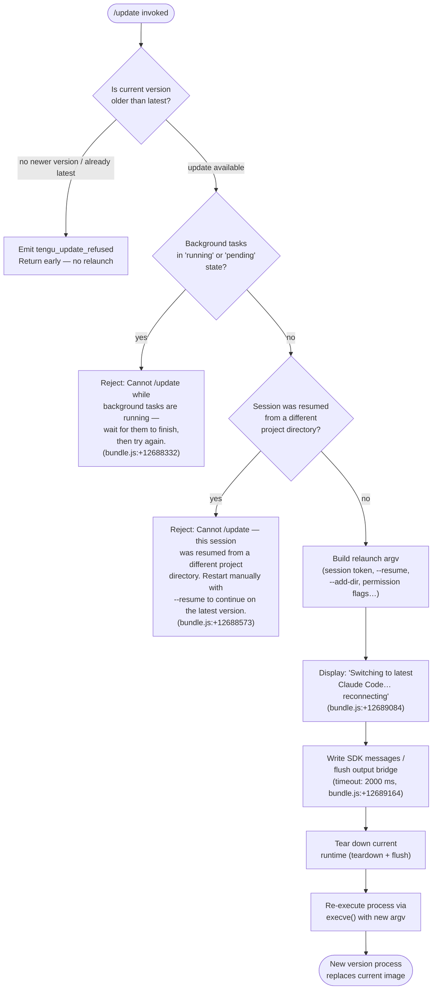

# `/update`

> Analysis basis: CC v2.1.167 bundle.js (AST extraction + Claude interpretation)
> Minimum version: v2.1.167

---

## Overview

The `/update` command switches a running Claude Code session to the latest installed version without ending the conversation. It performs a coordinated in-process relaunch: flushing I/O, tearing down the current runtime context, and re-executing the process image while carrying forward the current session's resume token and CLI arguments.

---

## Registration

| Field | Value |
|---|---|
| type | `local` |
| name | `update` |
| description | `Switch to the latest version (conversation continues)` |
| supportsNonInteractive | `false` |
| isHidden | `true` |
| module_id | `XKK` |
| load_inline | `true` |
| loc_byte | `12690062` |
| loc_byte_end | `12690303` |
| loc_line | `9083` |
| arbor_handler.name | `sxf` |
| arbor_handler.fqn | `claude-2.1.167::sxf` |
| arbor_handler.kind | `AsyncFunction` |
| arbor_handler.resolution_path | `module_id` |
| arbor_handler.n_hits | `0` |

Analysis basis: CC v2.1.167 bundle.js:+12690062

---

## Input Branching

The command handler (`sxf`) follows five or more distinct code paths depending on pre-flight checks and runtime state, so a flowchart is used.



---

## Behavioral Spec

### Pre-flight: Version and Binary Resolution

```
async function resolveInstalledBinary():
    candidate = which("claude")            # via Bun.which (bundle.js:+856361)
    if candidate is null:
        return null
    versionsDir = homedir() + "/.local/share/versions"   # bundle.js:+7990376,+7990385
    binPath     = homedir() + "/.local/share/bin"         # bundle.js:+7990456
    return { candidate, versionsDir, binPath }
```

Analysis basis: CC v2.1.167 bundle.js:+856361, +7990376, +7990385, +7990456

---

### Pre-flight: Guard — Background Tasks

```
function checkNoBackgroundTasks(appState):
    tasks = Object.values(appState.tasks)
    for task in tasks:
        if task.status == "running" or task.status == "pending":   # bundle.js:+12688229,+12688251
            throw UserError(
                "Cannot /update while background tasks are running" +
                " — wait for them to finish, then try again."       # bundle.js:+12688332
            )
```

Analysis basis: CC v2.1.167 bundle.js:+12688229, +12688251, +12688332

---

### Pre-flight: Guard — Project Directory Mismatch

```
function checkProjectDirectoryConsistency(appState, currentCwd):
    if appState.resumedFromDifferentDirectory:
        throw UserError(
            "Cannot /update — this session was resumed from a" +
            " different project directory. Restart manually with" +
            " --resume to continue on the latest version."          # bundle.js:+12688573
        )
```

Analysis basis: CC v2.1.167 bundle.js:+12688573

---

### Relaunch Argument Construction

```
function buildRelaunchArgv(originalArgv, sessionId, addedDirs, permissionMode, effort):
    argv = [...originalArgv]

    # Append session resume token
    argv.push("--resume", sessionId)                    # bundle.js:+12412915

    # Append any extra directories added during the session
    for dir in addedDirs:
        argv.push("--add-dir", dir)                     # bundle.js:+12414439

    # Forward permission-bypass flag if active
    if permissionMode == "bypassPermissions":
        argv.push("--allow-dangerously-skip-permissions")  # bundle.js:+12414608

    # Forward effort and permission-mode flags
    if effort is set:
        argv.push("--effort", effort)                   # bundle.js:+12414750
    if permissionMode is set:
        argv.push("--permission-mode", permissionMode)  # bundle.js:+12414767

    return argv
```

Analysis basis: CC v2.1.167 bundle.js:+12412915, +12414439, +12414608, +12414750, +12414767

---

### Message Identifier Generation

```
function generateMessageId():
    return "assistant-" + randomUUID()     # bundle.js:+12688874, +12686941
```

Analysis basis: CC v2.1.167 bundle.js:+12688874, +12686941

---

### Output Flush Sequence

```
async function flushAndNotify(outputBridge, displayFn):
    displayFn("Switching to latest Claude Code… reconnecting")  # bundle.js:+12689084

    # Write outgoing SDK messages
    outputBridge.writeSdkMessages(...)                          # bundle.js:+12689060

    # Wait for bridge flush with 2 000 ms timeout
    await timedRace(outputBridge.flush(), timeout=2000,
                    label="bridge flush")                        # bundle.js:+12689164,+12689169
```

Analysis basis: CC v2.1.167 bundle.js:+12689060, +12689084, +12689164, +12689169

---

### Teardown and execve Relaunch

```
async function teardownAndRelaunch(outputBridge, newArgv):
    # Gracefully tear down the current output bridge
    await outputBridge.teardown()                      # bundle.js:+12689205

    # Merge environment overrides into process.env
    Object.assign(process.env, envOverrides)           # bundle.js:+12689295

    # Resolve and validate new binary path
    newBinary = resolveBinaryPath(newArgv)             # bundle.js:+12689327 (d0H)

    # Remove all signal listeners so they do not fire after execve
    process.removeAllListeners()                       # bundle.js:+12413484

    # Re-register minimal SIGINT / SIGHUP handlers
    process.on("SIGINT", noopHandler)                  # bundle.js:+12413514 ("SIGINT" bundle.js:+12413455)
    process.on("SIGHUP", noopHandler)                  # ("SIGHUP" bundle.js:+12413474)

    # Await pending cleanup with 30 000 ms timeout
    await Promise.all([
        timedRace(cleanupPromises, timeout=30000,
                  label="flush timeout (relaunch)"),   # bundle.js:+12412982,+12412988
        timedRace(analyticsFlush, timeout=500,
                  label="analytics flush timeout"),    # bundle.js:+12413100
    ])

    # Replace process image — does not return
    M.execve(newBinary, newArgv, process.env)          # bundle.js:+12412418
```

Flush timeout: 30 000 ms (`"flush timeout (relaunch)"` bundle.js:+12412982).  
Analytics flush timeout: 500 ms (`"analytics flush timeout"` bundle.js:+12413100).  
Cleanup timeout label: `"cleanup timeout"` (bundle.js:+12413044).

Analysis basis: CC v2.1.167 bundle.js:+12689205, +12689295, +12413484, +12412982, +12412418

---

### Binary Path Resolution (`d0H`)

```
async function resolveBinaryPath(argv):
    # Locate the currently-running claude binary
    installInfo = getInstallInfo()                        # calls nS (bundle.js:+12412769)
    qy(installInfo)                                       # bundle.js:+12412776

    # stat the target binary to confirm it exists
    stat = await n8K.stat(binaryPath)                    # bundle.js:+12412863

    # Validate path is absolute
    if not Q8K.isAbsolute(binaryPath):                   # bundle.js:+12411932
        binaryPath = path.join(process.cwd(), binaryPath) # bundle.js:+12411974

    # On macOS: dlopen libSystem to call execve via FFI
    if platform == "macos":                              # bundle.js:+12412055
        lib = f.dlopen("bun:ffi",                        # bundle.js:+12412019
                       "/usr/lib/libSystem.B.dylib")     # bundle.js:+12412063
        execve = lib.symbols.execve(...)
    else:
        # Linux path: libc.so.6
        lib = f.dlopen("bun:ffi", "libc.so.6")           # bundle.js:+12412092

    # Encode argv + env as UTF-8 Buffer pointers
    buf = Buffer.from(encodedArgs, "utf8")               # bundle.js:+12412195

    # Call execve — process image replaced
    M.execve(binaryPath, encodedArgv, encodedEnv)        # bundle.js:+12412418
```

Analysis basis: CC v2.1.167 bundle.js:+12412769, +12412863, +12411932, +12412055, +12412019, +12412063, +12412092, +12412195, +12412418

---

### Conversation Carry-Forward (`Lb8`)

```
function buildCarryForwardArgs(sessionState):
    result = Array.from(originalCliArgs)               # bundle.js:+12414264

    # Reconstruct --add-dir flags from session directories
    for dir in sessionState.addedDirectories:
        result.push("--add-dir", dir)                  # bundle.js:+12414439

    # Propagate allowDangerouslySkipPermissions
    if sessionState.allowDangerouslySkipPermissions:
        result.push("--allow-dangerously-skip-permissions")   # bundle.js:+12414608

    # Propagate --effort
    if sessionState.effort:
        result.push("--effort", sessionState.effort)   # bundle.js:+12414750

    # Propagate --permission-mode
    if sessionState.permissionMode:
        result.push("--permission-mode", sessionState.permissionMode)  # bundle.js:+12414767

    return result
```

Analysis basis: CC v2.1.167 bundle.js:+12414264, +12414439, +12414608, +12414750, +12414767

---

### Session-State Snapshot (`b_`, `t$`)

```
function captureSessionSnapshot(appState):
    # Find the last turn/message to preserve context
    lastMessage = appState.messages.findLast(...)    # bundle.js:+10944445
    workingDir  = lastMessage.working_directory      # bundle.js:+10944470
    allowedTools    = lastMessage.allowed_tools      # bundle.js:+10944525
    disallowedTools = lastMessage.disallowed_tools   # bundle.js:+10944580
    avoidPrompts    = lastMessage.avoid_prompts      # bundle.js:+10944641
    permissionMode  = lastMessage.permission_mode    # bundle.js:+10944743
    bypassPerms     = lastMessage.bypassPermissions  # bundle.js:+10944774
    return { workingDir, allowedTools, disallowedTools, avoidPrompts,
             permissionMode, bypassPerms }

function readFlagSettings(appState):
    effort            = appState.effort              # bundle.js:+10945098
    model             = appState.model               # bundle.js:+10945111
    maxThinkingTokens = appState.max_thinking_tokens # bundle.js:+10945123
    flagSettings      = appState.flag_settings       # bundle.js:+10945149
    return { effort, model, maxThinkingTokens, flagSettings }
```

Analysis basis: CC v2.1.167 bundle.js:+10944445, +10944470, +10944525, +10944541, +10944743, +10945098

---

## State & Side Effects

| Item | Detail |
|---|---|
| Telemetry — `tengu_update_refused` | Fired when a newer version is not available or the update is blocked (bundle.js:+12687968) |
| Telemetry — `tengu_feature_sad` | Fired on an unexpected error path within the output-bridge helpers (bundle.js:+1011093) |
| Telemetry — `tengu_feature_bad` | Fired on a bad-result code path in bridge helpers (bundle.js:+1011012) |
| Telemetry — `tengu_feature_ok` | Fired on success code path in bridge helpers (bundle.js:+1010950) |
| Telemetry — `tengu_scroll_summary` | Fired during terminal-scroll summary rendering before relaunch (bundle.js:+5455866) |
| Telemetry — `tengu_amber_creek` / `tengu_pewter_brook` | Fullscreen/flicker detection telemetry emitted during UI teardown (bundle.js:+3446931, +3446839) |
| Telemetry — `tengu_disable_bypass_permissions_mode` | Fired if bypass-permissions mode is disabled before relaunch (bundle.js:+4204496) |
| Telemetry — `tengu_config_parse_error` | Fired if configuration file cannot be parsed during binary resolution (bundle.js:+3268051) |
| appState changes | `_.getAppState` is read at bundle.js:+12688820; `_.setAppState` is written at bundle.js:+12688974 to record that a relaunch is in progress |
| Output bridge | `O.writeSdkMessages` → `O.flush` → `O.teardown` called in sequence before execve (bundle.js:+12689060, +12689154, +12689205) |
| Process signal handlers | All existing listeners removed via `process.removeAllListeners()` (bundle.js:+12413484); minimal SIGINT/SIGHUP stubs re-registered (bundle.js:+12413514) |
| execve relaunch | `M.execve` replaces the current process image; on macOS uses `/usr/lib/libSystem.B.dylib` via `bun:ffi`, on Linux uses `libc.so.6` (bundle.js:+12412063, +12412092) |
| Session resume token | `--resume <sessionId>` appended to relaunch argv so the conversation continues uninterrupted (bundle.js:+12412915) |
| Hook registration | `VPA.register` called via `j9` during pre-flight (bundle.js:+60369); `VPA.drain` called during teardown (bundle.js:+60412) |
| Sound | <!-- TODO: not found in depth-2 traversal; needs --depth 4 --> |

---

## Version History

| Version | Change |
|---|---|
| v2.1.167 | Initial analysis |

---

## Common Mistakes

1. **Running `/update` while background tasks are active.** The command explicitly blocks if any task has status `"running"` or `"pending"`. Wait for all background tasks to complete before invoking `/update`.

2. **Invoking `/update` after resuming a session in a different project directory.** Because the relaunch must chdir to the original working directory, a cross-directory resume prevents a safe hot-restart. The error message instructs users to restart manually with `--resume` instead.

3. **Expecting `/update` to appear in the slash-command menu.** The registration sets `isHidden: true`, so the command does not surface in autocomplete but can still be typed explicitly.

4. **Expecting an interactive prompt before the relaunch.** The command sets `supportsNonInteractive: false` and immediately proceeds to relaunch once all guards pass — there is no confirmation step.

5. **Assuming the relaunch always succeeds silently.** If `execve` fails (e.g., the new binary cannot be found or stat fails), the command falls back to a `spawnSync`-based restart path and may emit a `"relaunch_spawn_error"` event (bundle.js:+12413766).

---

## Appendix — Identifier Mapping

> For bundle debugging only. Identifiers change across versions.

| Identifier | Role |
|---|---|
| `sxf` | Main async handler for `/update` (Arbor-resolved, FQN: `claude-2.1.167::sxf`) |
| `Ub8` | Version availability checker; calls `BM` (which()) and `nS` (install-path resolver) |
| `BM` | Wraps `Bun.which` to locate the `claude` binary on PATH |
| `XIA` | Inner helper inside `BM`; calls `Bun.which` directly |
| `nS` | Install-path resolver; builds versioned binary path under `~/.local/share/versions` |
| `uV8` | Constructs path using `versions` segment and `vCH.join` |
| `X3` | Array-test utility used by `uV8` and `nS` |
| `h5H` | Homedir-join helper; calls `q08` (homedir) and `tZ6.join` |
| `q08` | Wraps `os.homedir()` |
| `V1H` | Alternate path builder; produces `~/.local/share/bin` path |
| `J9` | Emits `tengu_update_refused` telemetry event |
| `dYH` | Telemetry dispatch helper called by `J9` |
| `l` | Generic logging utility |
| `aj` | Path basename resolver; calls `y2.basename` and `R6` |
| `R6` | Rendering / React component helper (calls `tv`) |
| `tv` | Low-level render primitive |
| `qy` | Assertion / invariant helper |
| `c4A` | Pre-relaunch state-freeze helper; writes dirname, calls `SO` and `$4` |
| `W_` | Sub-helper of `c4A`; calls `tv` |
| `$4` | Sub-helper of `c4A`; calls `tv` |
| `SO` | State accessor used during freeze |
| `_qH` | Prefix string constant used to filter assistant messages (`"assistant-"`) |
| `ke` | Checks attachment/hook state; queries `Tu8` and `Pdf.has` |
| `Tu8` | Hook-type constant source |
| `$7A` | Appends `"last-prompt"` entry to conversation log; calls `r4`, `_.appendEntry`, `R6` |
| `r4` | Hook/register helper; calls `j9` (`VPA.register`) |
| `j9` | Wraps `VPA.register` |
| `hH` | Output-bridge write helper; logs errors via `pr.logError` |
| `AA` | Error constructor helper |
| `_6` | String coercion utility |
| `$q` | Queue-drain helper; calls `QRA` |
| `QRA` | Queue reader; calls `_6` |
| `zG4` | Ring-buffer manager (`Sc6.shift` / `Sc6.push`) |
| `TE` | App-state transition helper called after bridge write |
| `O` | Output-bridge object (`writeSdkMessages`, `flush`, `teardown`) |
| `b8` | Low-level bridge implementation used by `O` |
| `jKK` | UUID-prefixed message-ID generator; calls `pb8.randomUUID` |
| `IL` | Timed-race utility; uses `setTimeout` / `Promise.race` / `clearTimeout` |
| `zjH` | String formatter used for status message construction |
| `d0H` | Core teardown-and-relaunch orchestrator |
| `HG6` | Interval-clear helper; calls `bR_` (`clearInterval`) |
| `bR_` | Wraps `clearInterval` |
| `oyH` | Terminal unmount sequence; calls `H.unmount`, `xC`, `dL8` |
| `H` | Ink/terminal renderer instance |
| `v` | Low-level terminal escape-code writer |
| `Y3` | Terminal helper used during unmount |
| `uj_` | String-splitting/trimming utility |
| `lHH` | Set-membership guard (`i74.has`) |
| `uj` | String-replace helper |
| `H9` | Formatter calling `m6H`, `s9`, `FJ` |
| `o6` | Logging adapter calling `l` and `J6` |
| `xC` | Terminal cursor-restore helper |
| `dL8` | Terminal write helper; writes ANSI escape sequences |
| `MIH` | Terminal-version detector; checks ghostty/iTerm |
| `evH` | Terminal event helper |
| `QW` | tmux/screen escape-sequence rewriter |
| `O$` | Terminal output finalizer |
| `Bz8` | Scroll-summary renderer; fires `tengu_scroll_summary` |
| `wT` | Sub-helper of `Bz8` |
| `aV9` | Sub-helper of `Bz8` |
| `oV9` | Frame-timing calculator; uses `Date.now`, `Math.max`, `Math.round` |
| `iV9` | Frame-state updater inside `oV9` |
| `$1` | Fullscreen/flicker-detection renderer; fires `tengu_amber_creek` / `tengu_pewter_brook` |
| `VW_` | Fullscreen check helper; calls `_6` |
| `qa` | Sub-helper of `$1`; calls `VIL` |
| `ZW_` | Windows-SSH detection helper; calls `r6` and `Boolean` |
| `l_` | UI layout helper; calls `gU` |
| `NIL` | Conditional renderer inside `$1`; calls `D6` |
| `D6` | Render-component dispatcher |
| `vE` | Post-teardown hook caller; calls `r4` |
| `ipH` | Wraps `VPA.drain` |
| `Fz8` | Async cleanup sequencer; uses `Promise.all`, `Promise.race`, `r8` |
| `r8` | Process-spawn/exec wrapper; uses `setTimeout`, `clearTimeout`, `L.unref` |
| `K` | Process map/padding helper |
| `q` | File-unlink helper (`ipK.unlinkSync`) |
| `L` | Active-process tracker (`q.add`, `q.delete`) |
| `d8K` | execve executor; handles FFI dlopen on macOS/Linux, calls `M.execve` |
| `f` | FFI library handle |
| `A` | Process/library registry map |
| `$` | Spawn-record array; tracks launched processes |
| `zLK` | Spawn-record factory; uses `Date.now`, `V9`, `zC6`, `RH` |
| `w` | Background-process supervisor loop |
| `b` | Background-process handle |
| `CH` | Background-session create logger; fires `tengu_bg_dispatch_sigkill_escalate`-adjacent path |
| `SH` | Background-session logger (ok path) |
| `cx8` | Low-memory check; fires `tengu_bg_low_mem_mb` |
| `tX6` | Config-file reader; uses `k2.readFile`, `Array.isArray`, `_.filter` |
| `Q` | Process-retirement manager; uses `process.kill`, `setTimeout`, `Math.min` |
| `mwA` | Spare-session claim handler; fires `tengu_bg_sendclaim_failed` |
| `QwA` | Session lifecycle tracker; fires `tengu_bg_spare_claim`, `tengu_bg_spare_claim_fail` |
| `D` | Forced-shutdown handler; calls `process.exit`, `z.abort` |
| `V8` | Version-string constant holder |
| `J6` | Low-level log sink |
| `B` | Disposable resource handle |
| `M` | MCP/execve multiplexer object |
| `xbH` | MCP connection initialiser |
| `XF8` | MCP update applicator; calls `H.applyMcpUpdate` |
| `dDA` | MCP diff-and-apply helper; calls `xbH`, `XF8`, `_.getClients` |
| `z` | Daemon control object; fires `tengu_daemon_control` |
| `xh` | Daemon event push helper; calls `yu`, `Vc.push`, `EvH`, `kP_` |
| `sp` | Daemon shutdown sequencer; uses `Promise.race`, `Promise.all`, `process.exit` |
| `GH` | String coercion wrapper |
| `SJ` | Crash-report writer; calls `GUH.writeFileSync` with `bl8.join` path |
| `Lb8` | Full CLI-argument reconstructor for relaunch |
| `vTH` | Argument-serialisation helper used by `Lb8` |
| `C6` | Config-system bootstrapper; calls `LwH`, `IVL`, `Date.now` |
| `d6` | Config-path resolver |
| `lP_` | Config lock-file helper |
| `LwH` | Config-file reader/writer; handles backup, migration, `q.readFileSync` |
| `U6` | JSON parse wrapper |
| `Hu` | Version-prefix stripper (`H.startsWith` / `H.slice`) |
| `Vo1` | Config directory enumerator; uses `_.readdirStringSync`, `_.statSync` |
| `sP_` | Backup-directory path builder |
| `IVL` | File-watcher setup; uses `HK8.watchFile` / `HK8.unwatchFile` |
| `co` | Config-change coalescer |
| `b_` | Session-snapshot extractor; reads `working_directory`, `allowed_tools`, etc. |
| `sy8` | Sub-helper of `b_`; calls `L1` |
| `L1` | State-accessor base |
| `ty8` | Sub-helper of `b_`; calls `L1` |
| `aB` | Permission-mode handler; fires `tengu_disable_bypass_permissions_mode` |
| `t$` | Flag-settings reader (`effort`, `model`, `max_thinking_tokens`, `flag_settings`) |

---

Note: index built via Arbor fallback; some signals (telemetry, literals) may be missing — see arbor-fallback.js.