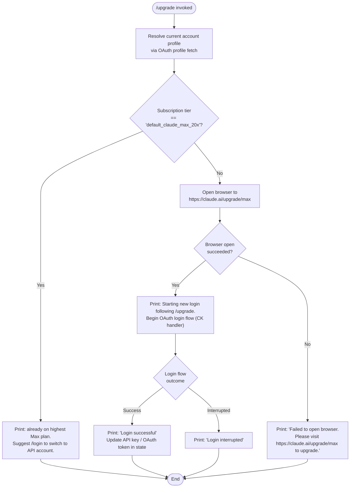

# `/upgrade`

> Analysis basis: CC v2.1.167 bundle.js (AST extraction + Claude interpretation)
> Minimum version: v2.1.167

---

## Overview

The `/upgrade` command guides the user through upgrading their Claude subscription to the **Max** plan, which offers higher rate limits and more Claude Opus usage. It inspects the current account's subscription tier, and if the user is not already on the highest Max plan, opens a browser to `https://claude.ai/upgrade/max` and initiates a fresh OAuth login flow. If the user is already on the maximum Max tier (`default_claude_max_20x`), it prints an informational message and exits early without opening a browser.

---

## Registration

| Field | Value |
|---|---|
| type | `local-jsx` |
| name | `upgrade` |
| description | `Upgrade to Max for higher rate limits and more Opus` |
| module_id | `v7A` |
| load_inline | `true` |
| loc_byte | `12738057` |
| loc_byte_end | `12738304` |
| loc_line | `9094` |
| arbor_handler.name | `LC6` |
| arbor_handler.fqn | `claude-2.1.167::LC6` |
| arbor_handler.kind | `AsyncFunction` |
| arbor_handler.resolution_path | `module_id` |
| arbor_handler.n_hits | `0` |

Analysis basis: CC v2.1.167 bundle.js:+12738057

---

## Input Branching

Four distinct branches exist depending on subscription tier and browser-open outcome, so a flowchart is used.



Analysis basis: CC v2.1.167 bundle.js:+12737102, +12737188, +12737213, +12737332, +12737418, +12737583, +12737586, +12737658, +12737777, +12737796, +12737850

---

## Behavioral Spec

### 1. Handler Entry — `upgradeCommandHandler` (`LC6`)

The handler is an `AsyncFunction` resolved via `module_id` → `v7A`.

```
async function upgradeCommandHandler(context):
    profile = await fetchAccountProfile(context)   // GA → GY
    currentTier = profile.subscriptionTier          // reads "claude_max" / tier string

    if currentTier == "default_claude_max_20x":
        // Already on the highest Max plan
        displayMessage(
            "You are already on the highest Max subscription plan. " +
            "For additional usage, run /login to switch to an API usage-billed account."
        )
        return

    // Attempt to open upgrade URL in browser
    opened = openURL("https://claude.ai/upgrade/max")   // CK → nY / platform dispatcher

    if not opened:
        displayMessage(
            "Failed to open browser. Please visit https://claude.ai/upgrade/max to upgrade."
        )
        return

    displayMessage(
        "Starting new login following /upgrade. Exit with Ctrl-C to use existing account."
    )

    // Run OAuth login flow (same machinery as /login)
    result = await runOAuthLoginFlow(context)   // CK → R8 → C_

    if result.success:
        displayMessage("Login successful")
        applyNewAPIKey(result)   // _.onChangeAPIKey
    else:
        displayMessage("Login interrupted")
```

Analysis basis: CC v2.1.167 bundle.js:+12737102, +12737274, +12737418, +12737583, +12737619, +12737658, +12737754, +12737773, +12737777, +12737796, +12737829, +12737850

---

### 2. Account Profile Fetch — `fetchAccountProfile` (`GA` → `GY`)

Retrieves the current user's OAuth profile to determine subscription tier.

```
async function fetchAccountProfile(context):
    authContext = resolveAuthContext(context)   // GY → Bj (credential resolution)
    profile = await httpGet(
        oauthProfileEndpoint,
        headers: {
            "Content-Type": "application/json"
        },
        timeout: 10000   // ms
    )
    if fetch fails:
        emitTelemetry("oauth_profile_token_failed")
        return null
    emitTelemetry("oauth_profile_fetch")
    return profile
```

Analysis basis: CC v2.1.167 bundle.js:+3022399, +2107648, +2107702, +2107749, +2107764, +2107792, +2107808, +2107875

---

### 3. Subscription Tier Check

The handler reads the tier string from the fetched profile and compares it against two known constants:

- `"max"` — generic Max subscription identifier (bundle.js:+12737188)
- `"default_claude_max_20x"` — the highest-tier Max plan (bundle.js:+12737213); triggers the early-exit message

The early-exit message is a fixed string literal that explicitly mentions `/login` as an alternative path for additional usage. (bundle.js:+12737433)

The subscription type field checked internally is `"claude_max"` (bundle.js:+12737332).

---

### 4. Browser URL Open — `openURL` (`CK`)

Platform-aware URL dispatcher.

```
function openURL(url):
    validate url scheme in ["http:", "https:"]   // bundle.js:+6814646, +6814668
    platform = process.platform
    if platform == "darwin":
        spawn("open", [url])
    else if platform == "win32":
        spawn("rundll32", ["url,OpenURL", url])
    else:
        spawn("xdg-open", [url])   // Linux / other
    return success
```

Analysis basis: CC v2.1.167 bundle.js:+6814883, +6814896, +6814955, +6814971, +6815055, +6815067, +6815129, +6815136

---

### 5. OAuth Login Flow — `runOAuthLoginFlow` (`R8` → `C_` → `YZH`)

This is the same login machinery used by `/login`. On invocation from `/upgrade`, the flow begins after the upgrade URL has been opened in the browser.

```
async function runOAuthLoginFlow(context):
    loginContext = buildLoginContext()   // C_ → YZH
    try:
        token = await performOAuthExchange(loginContext)
        // Sets ANTHROPIC_API_KEY / OAuth token env / file descriptor
        return { success: true, token }
    except Interrupted:
        return { success: false }
    except Error:
        logError(error)
        return { success: false }
```

Key sub-operations within `YZH` (oauth exchange orchestrator):
- Resolves OAuth endpoints; supports `prod`, `staging`, `local` environments (bundle.js:+852924, +853198, +853285, +853375)
- Uses client ID `22422756-60c9-4084-8eb7-27705fd5cf9a` (bundle.js:+853872)
- Validates `CLAUDE_CODE_CUSTOM_OAUTH_URL` against approved endpoints; throws `"CLAUDE_CODE_CUSTOM_OAUTH_URL is not an approved endpoint."` if unapproved (bundle.js:+854263)
- Reads `CLAUDE_CODE_OAUTH_TOKEN_FILE_DESCRIPTOR` (bundle.js:+2123218) and `CLAUDE_CODE_API_KEY_FILE_DESCRIPTOR` (bundle.js:+2123361) for file-descriptor-based credential passing

Analysis basis: CC v2.1.167 bundle.js:+1095504, +1091183, +852924, +853872, +854263, +2123218, +2123361

---

### 6. Credential Resolution — `resolveAuthCredentials` (`GY` → `Bj` → `AN`)

Before the profile fetch, credentials are resolved from the environment in priority order. Known credential sources:

| Priority | Source |
|---|---|
| 1 | `ANTHROPIC_API_KEY` environment variable (bundle.js:+3004067) |
| 2 | `user_oauth` profile (bundle.js:+3001112) |
| 3 | `profile-implicit` (bundle.js:+3001039) |
| 4 | OAuth token via `CLAUDE_CODE_OAUTH_TOKEN_FILE_DESCRIPTOR` (bundle.js:+2123218) |
| 5 | API key via `CLAUDE_CODE_API_KEY_FILE_DESCRIPTOR` (bundle.js:+2123361) |

Unsupported provider types (`bedrock`, `foundry`, `anthropicAws`, `mantle`, `vertex`) are excluded from the upgrade path (bundle.js:+2100952–+2101160). If no valid auth is present, throws: `"ANTHROPIC_API_KEY, ANTHROPIC_AUTH_TOKEN, CLAUDE_CODE_OAUTH_TOKEN, or WIF env vars (ANTHROPIC_FEDERATION_RULE_ID + ANTHROPIC_ORGANIZATION_ID) required"` (bundle.js:+3004536).

Analysis basis: CC v2.1.167 bundle.js:+3002048, +3002146, +3002167, +3004067, +3001039, +3001112, +2123218, +2123361, +3004536

---

### 7. JSX Render — `upgradeCommandHandler` rendering (`LC6` → `N7A.createElement`)

The `/upgrade` command is registered as `local-jsx`, meaning its output messages are rendered as JSX elements rather than plain text. The handler calls `N7A.createElement` (bundle.js:+12737619) to build the inline UI components displayed in the terminal (e.g., status messages, prompts for login).

Analysis basis: CC v2.1.167 bundle.js:+12737619

---

## State & Side Effects

| Item | Detail |
|---|---|
| Telemetry | `tengu_feature_ok` (bundle.js:+1010950), `tengu_feature_sad` (bundle.js:+1011093), `oauth_profile_fetch` (bundle.js:+2107808), `oauth_profile_token_failed` (bundle.js:+2107875), `api_bootstrap_fetch` (bundle.js:+15797782) |
| Browser side effect | Opens `https://claude.ai/upgrade/max` in the system browser (platform-specific: `open` / `rundll32` / `xdg-open`) |
| API key / OAuth token | Updated via `_.onChangeAPIKey` callback (bundle.js:+12737754) if login succeeds |
| appState changes | New OAuth token or API key applied to session state after successful login; existing credentials unchanged on interruption |
| File descriptors | May write OAuth token to `CLAUDE_CODE_OAUTH_TOKEN_FILE_DESCRIPTOR` or API key to `CLAUDE_CODE_API_KEY_FILE_DESCRIPTOR` |
| Hook registration | `VPA.register` called via `j9` (bundle.js:+60369) during login flow setup |
| Sound | None observed |
| Logging | Errors logged via `pr.logError` (bundle.js:+1016712) |

---

## Version History

| Version | Change |
|---|---|
| v2.1.167 | Initial analysis |

---

## Common Mistakes

1. **Running `/upgrade` on an enterprise or cloud-provider account** — Credentials sourced from `bedrock`, `foundry`, `anthropicAws`, `mantle`, or `vertex` are not eligible for the upgrade flow. The command will fail to resolve a valid auth context before reaching the browser step.
2. **Already on the highest tier** — If the account is already on `default_claude_max_20x`, the command exits immediately with an informational message. No browser is opened. Users expecting a confirmation or a plan page will be confused.
3. **Browser unavailable in headless / CI environments** — The browser open step will fail silently (returns false), and the fallback message directing the user to visit `https://claude.ai/upgrade/max` manually is printed. The OAuth flow is not started.
4. **Interrupting mid-flow** — Pressing Ctrl-C during the OAuth login step (after the browser opens) will print "Login interrupted" and leave the account credentials unchanged. This is expected behavior, not an error.
5. **Custom OAuth URL misconfiguration** — Setting `CLAUDE_CODE_CUSTOM_OAUTH_URL` to an unapproved endpoint throws immediately with a clear error message. Only Anthropic-approved endpoints pass validation.

---

## Appendix — Identifier Mapping

> For bundle debugging only. Identifiers change across versions.

| Identifier | Role |
|---|---|
| `LC6` | Main handler for `/upgrade` command (`upgradeCommandHandler`); AsyncFunction |
| `GA` | Account profile fetch orchestrator |
| `GY` | Credential + auth context resolver |
| `O4` | Auth option builder |
| `_6` | String/value utility |
| `Bj` | OAuth credential source selector |
| `tt6` | OAuth token file-descriptor reader |
| `AlH` | Auth header assembler |
| `sU` | OAuth token validator; reads `CLAUDE_CODE_OAUTH_TOKEN_FILE_DESCRIPTOR` |
| `AN` | Flag-settings and API key checker |
| `YC` | Array/value membership checker |
| `aL` | Provider type classifier (bedrock/vertex/etc.) |
| `MA` | Provider exclusion guard |
| `pX` | Auth context propagator |
| `GO` | Auth resolution root; assembles full credential object |
| `dw6` | API key helper resolver |
| `BpH` | VS Code environment detector |
| `tO6` | API key file-descriptor reader |
| `C6` | Telemetry event emitter |
| `DC` | Response slice/truncation utility |
| `lw6` | Auth header builder (alternate path) |
| `SYH` | OAuth profile HTTP fetch |
| `F1` | OAuth endpoint URL builder |
| `wIA` | Environment (prod/staging/local) resolver |
| `t54` | OAuth client ID lookup |
| `SH` | Feature telemetry reporter (ok path) |
| `l` | Low-level telemetry primitive |
| `J6` | Telemetry event dispatcher |
| `ym6` | Telemetry event name resolver |
| `o6` | Feature telemetry reporter (sad/failure path) |
| `rO` | Auth error handler |
| `v` | HTTP request executor (fetch wrapper) |
| `onK` | HTTP response processor |
| `vPA` | HTTP status code handler |
| `H` | Bootstrap / config fetch orchestrator |
| `Y3` | User-agent string builder |
| `uj_` | Config value parser |
| `lHH` | Cache-hit checker |
| `uj` | URL sanitizer |
| `H9` | HTTP response body parser |
| `RH` | JSON serializer wrapper |
| `G4` | Redacted value formatter |
| `q0A` | Header map builder |
| `q` | File unlink utility |
| `A` | Path lowercaser |
| `EUH` | Write stream utility |
| `lWA` | Stream write wrapper |
| `enK` | Log appender / file logger |
| `npH` | Batched write scheduler |
| `YKH` | Log line formatter |
| `d6` | Debug logger |
| `U76` | Log directory resolver |
| `M0A` | Log file path builder |
| `cl8` | Log file rotation handler |
| `tnK` | Async log file write handler |
| `j9` | Signal/hook registrar |
| `hH` | Async queue / task runner |
| `AA` | Error wrapper |
| `$q` | Queue drain handler |
| `QRA` | Queue item processor |
| `zG4` | Queue shift/push manager |
| `CK` | URL opener / browser launcher |
| `tw7` | URL scheme validator |
| `nY` | Platform-specific open command resolver |
| `R8` | OAuth login flow entry point |
| `C_` | OAuth session builder |
| `YZH` | OAuth exchange orchestrator |
| `D` | Forced shutdown / process exit handler |
| `FE4` | String coercion utility |
| `O$` | OAuth state manager |
| `V8` | File system utility |
| `u6` | Async context / store accessor |
| `mc6` | AsyncLocalStorage store reader |
| `W_` | Timer/tick utility |

---

Note: index built via Arbor fallback; some signals (telemetry, literals) may be missing — see arbor-fallback.js.