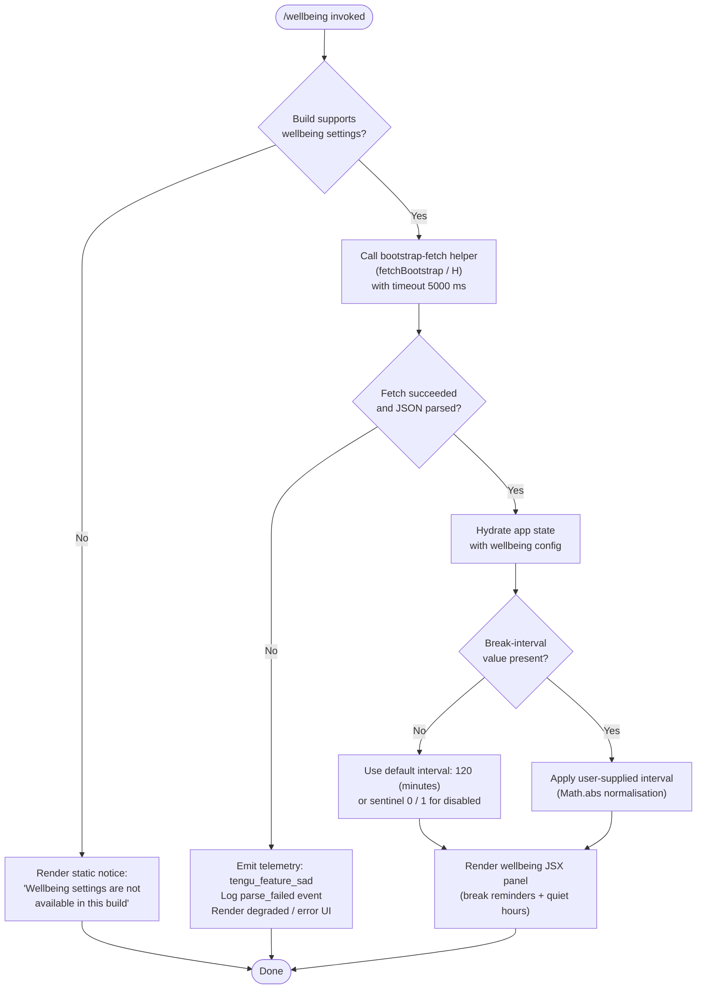

# `/wellbeing`

> Analysis basis: CC v2.1.167 bundle.js (AST extraction + Claude interpretation)
> Minimum version: v2.1.167

---

## Overview

`/wellbeing` (also accessible as `/breaks`, `/break-reminder`, and `/downtime`) is a local JSX command that surfaces UI controls for configuring optional break reminders and quiet-hours nudges. When invoked, the handler (`Imf`) immediately checks whether wellbeing settings are supported in the current build; if not, it renders a static unavailability notice rather than the configuration panel.

---

## Registration

| Field | Value |
|---|---|
| type | `local-jsx` |
| name | `wellbeing` |
| description | Configure optional break reminders and quiet-hours nudges |
| aliases | `breaks`, `break-reminder`, `downtime` |
| immediate | `true` |
| module_id | `m4K` |
| load_inline | `true` |
| loc_byte | `12764463` |
| loc_byte_end | `12764716` |
| loc_line | `9103` |
| arbor_handler.name | `Imf` |
| arbor_handler.fqn | `claude-2.1.167::Imf` |
| arbor_handler.kind | `AsyncFunction` |
| arbor_handler.resolution_path | `module_id` |
| arbor_handler.n_hits | `0` |

Analysis basis: CC v2.1.167 bundle.js:+12764463

---

## Input Branching

The handler has three distinct paths: (1) build does not support wellbeing → unavailability notice; (2) build supports wellbeing, settings loaded → render configuration UI; (3) build supports wellbeing, fetch/parse of remote bootstrap data needed → async fetch then render. A Mermaid flowchart is used.



---

## Behavioral Spec

### Availability Guard

When `Imf` is called it first evaluates whether the running build exposes wellbeing settings. If the check fails, it immediately returns a JSX element that displays the string `"Wellbeing settings are not available in this build"` and takes no further action.

```
async function wellbeingHandler(context):
    if NOT buildSupportsWellbeing():
        return renderStaticNotice(
            "Wellbeing settings are not available in this build"
        )
    return await renderWellbeingPanel(context)
```

Analysis basis: CC v2.1.167 bundle.js:+12763812 (call to `H` / fetchBootstrap entry), +12763814 (unavailability string literal)

---

### Break-Interval Normalisation (`Nmf`)

A helper normalises a raw numeric break-interval value. It applies `Math.abs` so that negative inputs are treated as their absolute value, and maps two sentinel integers to well-known states:

- Sentinel `0` — break reminders disabled
- Sentinel `1` — break reminders enabled with the default cadence
- Default cadence — **120 minutes** (bundle constant)

```
function normaliseBreakInterval(rawValue):
    absValue = Math.abs(rawValue)
    if absValue == 0:
        return BREAKS_DISABLED          // sentinel 0
    if absValue == 1:
        return BREAKS_DEFAULT_ENABLED   // sentinel 1 → default 120 min
    return absValue                     // explicit minute count
```

Analysis basis: CC v2.1.167 bundle.js:+12763547 (`Math.abs` call), +12763497 (literal `120`), +12763661 (literal `0`), +12763673 (literal `1`)

---

### Bootstrap Fetch (`H` → `fetchBootstrap`)

The main handler delegates to a shared async bootstrap-fetch utility. Key observable behaviours:

- Logs `"[Bootstrap] Fetching"` at the start of the request.
- Sets request headers `Content-Type: application/json` and `User-Agent`.
- Applies a **5 000 ms** timeout to the fetch call.
- On a successful response, logs `"[Bootstrap] Fetch ok"`.
- On a JSON parse failure, records the `parse_failed` event and emits `tengu_feature_sad` telemetry.
- Caches the result via `qA.get` / map lookup to avoid redundant network round-trips.

```
async function fetchBootstrap(url, appState):
    log("[Bootstrap] Fetching", url)
    cached = bootstrapCache.get(url)
    if cached != null:
        return cached

    response = await fetch(url, {
        headers: {
            "Content-Type": "application/json",
            "User-Agent": buildUserAgentString()
        },
        timeoutMs: 5000
    })

    try:
        data = await response.json()
        log("[Bootstrap] Fetch ok")
        bootstrapCache.set(url, data)
        return data
    catch ParseError:
        emitTelemetry("tengu_feature_sad")
        recordEvent("api_bootstrap_fetch", { result: "parse_failed" })
        return null
```

Analysis basis: CC v2.1.167 bundle.js:+15797458 (entry), +15797460 (fetch-start literal), +15797545 (`Content-Type` header), +15797560 (`application/json`), +15797579 (`User-Agent`), +15797661 (5 000 ms timeout), +15797782 (`api_bootstrap_fetch` event), +15797804 (`parse_failed` literal), +15797834 (`[Bootstrap] Fetch ok` literal), +1011091 (`tengu_feature_sad` emission site)

---

### Transcript / Append-Log Pipeline (`enK` → `appendLogWriter`)

The `wellbeing` command participates in the shared structured transcript pipeline. On first use, `enK` (appendLogWriter) performs the following steps:

1. Resolves the target log directory via `IHH.dirname`.
2. Ensures the directory exists (`ly.mkdir`).
3. Checks the current log file with `ly.stat`; if it ends in `.txt` it rotates the file name by slicing the extension and appending a version suffix.
4. Appends the serialised entry via `ly.appendFile`.
5. Computes `Buffer.byteLength` of the payload and checks against a rolling size budget.
6. Calls `cl8` (fileRotator) to rename or unlink stale log segments when the budget is exceeded.
7. Schedules deferred writes through `setTimeout` / `setImmediate` and tracks pending handles with `$.push` / `L.push`.

```
async function appendLogWriter(entry, logDir):
    dir = path.dirname(resolveLogPath(logDir))
    await fs.mkdir(dir, { recursive: true })

    filePath = buildLogFilePath(dir)
    stat = await fs.stat(filePath)

    if filePath.endsWith(".txt"):
        filePath = filePath.slice(0, -4) + versionSuffix

    await fs.appendFile(filePath, serialize(entry))

    byteLen = Buffer.byteLength(serialize(entry))
    if byteLen > sizeThreshold:
        await fileRotator(filePath)

    scheduleDeferredFlush()
```

Analysis basis: CC v2.1.167 bundle.js:+206115 (`IHH.dirname`), +206145 (`KI`), +206252 (`M0A`), +206284 (`cl8`), +206290 (`Buffer.byteLength`), +205407 (`ly.stat`), +205500 (`H.endsWith`), +205511 (`.txt` literal), +205563 (`ly.rename`), +205603 (`ly.unlink`), +205836 (`ly.mkdir`), +205895 (`ly.appendFile`)

---

### Quiet-Hours / Notification Scheduler (`npH` → `notificationScheduler`)

A timer-based scheduler manages the quiet-hours nudge. Behaviour:

- Clears any active timer with `clearTimeout` before rescheduling.
- Joins queued notification strings from two separate arrays (`$.join`, `L.join`, `J.join`) to build a composite message.
- Arms a new `setTimeout` for the next nudge delivery.
- On delivery, uses `setImmediate` to dispatch the notification off the main call stack.
- Pushes the fired handle into `$` for cleanup tracking, and appends to `L` for the quiet-hours audit log.

```
function scheduleNextNotification(state):
    clearTimeout(state.activeTimer)

    message = buildMessage(
        state.pendingItems.join(" "),
        state.quietLog.join(" "),
        state.auditItems.join(" ")
    )

    state.activeTimer = setTimeout(function():
        setImmediate(function():
            deliverNotification(message)
            state.pendingItems.push(handle)
            state.quietLog.push(message)
        )
    , computeDelay(state))
```

Analysis basis: CC v2.1.167 bundle.js:+59783 (`clearTimeout`), +59824 (`H` call), +59857 (`$.join`), +59901 (`L.join`), +59922 (`O`), +59947 (`setTimeout`), +59982 (`$.push`), +60040 (`setImmediate`), +60080 (`J.join`), +60131 (`L.push`), +59671 (literal `1000`), +59692 (literal `100`)

---

### Shorthand-Key / Command Dispatch Registration (`j9` → `hotkeyRegistrar`)

After the panel is rendered, `j9` registers keyboard shortcuts via `VPA.register` so that the user can toggle break reminders or dismiss the wellbeing panel without retyping the slash command.

```
function registerWellbeingHotkeys(panelRef):
    hotkeySystem.register(panelRef, {
        onToggleBreaks: handleToggleBreaks,
        onDismiss: handleDismiss
    })
```

Analysis basis: CC v2.1.167 bundle.js:+206445 (`j9` call), +60369 (`VPA.register`)

---

## State & Side Effects

| Item | Detail |
|---|---|
| Telemetry | `tengu_feature_sad` — fired on bootstrap JSON parse failure (bundle.js:+1011093) |
| Named events | `api_bootstrap_fetch` with sub-field `parse_failed` (bundle.js:+15797782, +15797804) |
| Hook registration | Keyboard shortcuts registered via `VPA.register` after panel mount (bundle.js:+60369) |
| Timer handles | `setTimeout` + `setImmediate` armed for break-reminder delivery; handles tracked in module-level arrays (bundle.js:+59947, +60040) |
| File I/O | Structured append-log written to a versioned `.txt`-free path; rotated when byte budget exceeded (bundle.js:+205895, +205563) |
| appState changes | Bootstrap cache updated via `qA.get` map; wellbeing config hydrated into app state on successful fetch (bundle.js:+15797496) |
| Sound | <!-- TODO: not found in depth-2 traversal; needs --depth 4 --> |
| Network | One `fetch` call to bootstrap endpoint; 5 000 ms timeout; `Content-Type: application/json` + `User-Agent` headers (bundle.js:+15797661) |

---

## Version History

| Version | Change |
|---|---|
| v2.1.167 | Initial analysis |

---

## Common Mistakes

1. **Invoking `/wellbeing` in a stripped or embedded build** — the build-availability guard fires immediately and no configuration UI appears; the user sees only the static unavailability notice. Switching to a full Claude Code installation resolves this.
2. **Expecting persistence without a writable home directory** — the append-log pipeline (`enK`) calls `ly.mkdir` and `ly.appendFile`; if the process lacks write permissions the quiet-hours audit log will fail silently without surfacing an error in the panel.
3. **Setting a negative break interval** — `Math.abs` normalisation means `-30` is treated identically to `30`. This is intentional but may surprise users who expect negative values to disable reminders (use `0` instead).
4. **Confusing the aliases** — `/breaks`, `/break-reminder`, and `/downtime` are exact aliases; they invoke the same handler and produce the same UI.
5. **Relying on immediate hotkey availability** — keyboard shortcuts are registered only after the JSX panel mounts; issuing a hotkey before the panel fully renders will have no effect.

---

## Appendix — Identifier Mapping

> For bundle debugging only. Identifiers change across versions.

| Identifier | Role |
|---|---|
| `vmf` | Module-level initialiser for the wellbeing feature module |
| `Nmf` | Break-interval normaliser (applies `Math.abs`, maps sentinels 0/1) |
| `Imf` | Main async handler for `/wellbeing` (arbor-resolved entry point) |
| `H` | Bootstrap-fetch utility (shared async fetch + cache layer) |
| `v` | Core fetch-pipeline dispatcher (headers, timeout, parse) |
| `onK` | HTTP options builder (assembles request config) |
| `vPA` | Header-set constructor helper |
| `RH` | JSON serialiser wrapper (`JSON.stringify` delegate) |
| `G4` | URL path normaliser (replace, lastIndexOf, slice) |
| `q0A` | Segment mapper for URL construction (`lnK.map`) |
| `q` | File-unlink utility (`ipK.unlinkSync`) |
| `A` | Lowercase filename utility (`f.toLowerCase`) |
| `EUH` | Write-stream entry point for structured output |
| `lWA` | Low-level `H.write` wrapper |
| `enK` | Append-log / transcript pipeline writer |
| `npH` | Notification / quiet-hours scheduler (setTimeout + setImmediate) |
| `YKH` | Notification message formatter |
| `d6` | Log-path resolver helper |
| `U76` | Directory-existence utility (EISDIR guard) |
| `M0A` | Log file path builder (`IHH.join` + `R6`) |
| `cl8` | File rotator (stat → rename / unlink stale segments) |
| `tnK` | Deferred append-file writer (mkdir + appendFile + rotate) |
| `j9` | Hotkey / shortcut registrar (`VPA.register`) |
| `Y3` | App-state accessor helper |
| `uj_` | Argument string splitter (split + trim + indexOf + slice) |
| `lHH` | Feature-flag map checker (`i74.has`) |
| `uj` | String sanitiser (`H.replace` delegate) |
| `H9` | Model-resolution pipeline entry |
| `m6H` | Model metadata aggregator |
| `Q0` | Model capability query helper |
| `aqH` | Model alias resolver |
| `qB` | Model-string parser (trim, startsWith, map) |
| `s9` | Model normaliser (lowercase, replace, classify) |
| `Y2` | Model-family router (`R4H` lookup) |
| `h4H` | Model allow-list checker (`y4H.includes`) |
| `CI` | Tier classifier (lM + N5) |
| `DdH` | Tier fallback classifier (`N5`) |
| `bT` | Provider resolver (lM + N5 + MA) |
| `cP1` | Provider chain entry (delegates to `bT`) |
| `lM` | Provider-to-string mapper (`MA`) |
| `VH8` | Region/variant include checker (`HKL.includes`) |
| `wdH` | Variant extractor (`_6` delegate) |
| `FJ` | Full model-resolution orchestrator (s9 + _G) |
| `_G` | Model object builder (GA, g6H, gYH, jdH, bT, z2, lM, MA, N5, CI) |
| `o6` | Feature-sad telemetry emitter (`tengu_feature_sad`) |
| `l` | Telemetry dispatch primitive |
| `J6` | Telemetry transport layer |
| `ym6` | Low-level telemetry send primitive |

---

Note: index built via Arbor fallback; some signals (telemetry, literals) may be missing — see arbor-fallback.js.