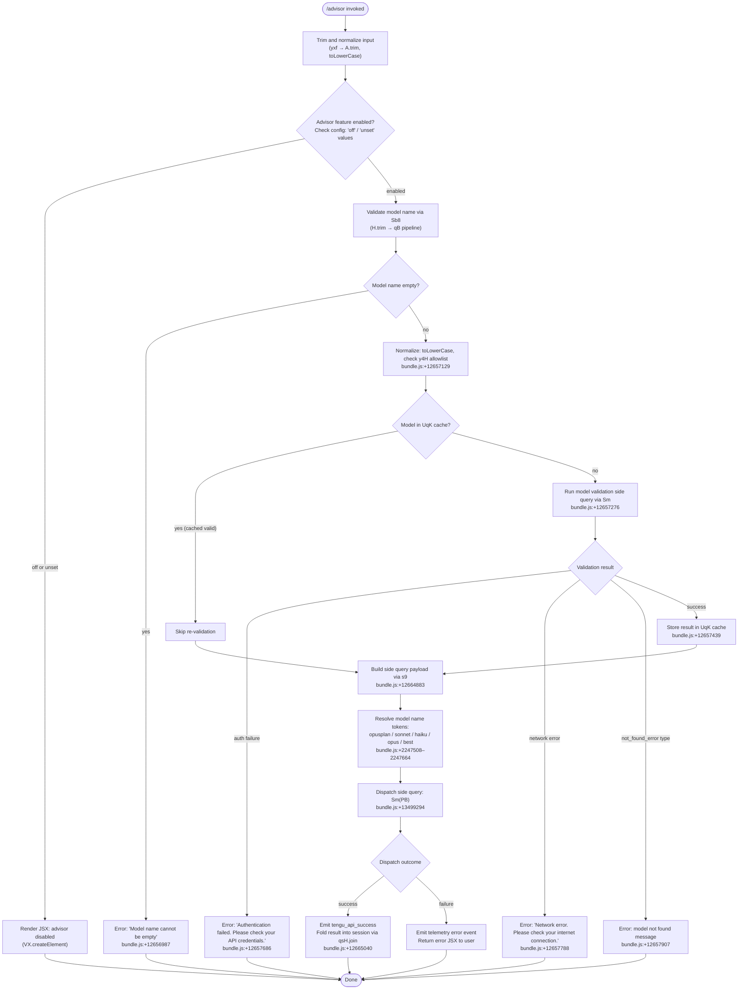

# `/advisor`

> Analysis basis: CC v2.1.168 bundle.js (AST extraction + Claude interpretation)
> Minimum version: v2.1.168

---

## Overview

The `/advisor` command allows Claude Code's primary agent to consult a stronger or more capable model at key decision points during a session. Rather than routing the entire conversation to a different model, it performs a targeted "side query" — dispatching the current context to the advisor model and folding the result back into the main session. This provides selective escalation without replacing the primary model.

---

## Registration

| Field | Value |
|---|---|
| type | `local-jsx` |
| name | `advisor` |
| description | `Let Claude consult a stronger model at key moments` |
| loc_byte | `12665273` |
| loc_byte_end | `12665514` |
| loc_line | `9077` |
| argumentHint | `null` |
| isHidden | `null` |
| module_id | `dqK` |
| load_inline | `true` |
| arbor_handler.name | `yxf` |
| arbor_handler.fqn | `claude-2.1.168::yxf` |
| arbor_handler.kind | `AsyncFunction` |
| arbor_handler.resolution_path | `module_id` |
| arbor_handler.n_hits | `1` |

Analysis basis: CC v2.1.168 bundle.js:+12665273

---

## Input Branching

The command handler follows more than three distinct paths based on model validation state, advisor feature enablement, and query dispatch outcomes, so a Mermaid flowchart is used.



---

## Behavioral Spec

### 1. Handler Entry — Input Normalization (`yxf`)

The main handler (`yxf`) is an `AsyncFunction` resolved via module `dqK`.

```
async function advisorHandler(commandInput, appContext):
    rawText = commandInput.trim()                    // yxf → A.trim (bundle.js:+12664729)
    lowerText = rawText.toLowerCase()

    if advisorFeatureState in ["off", "unset"]:      // literals bundle.js:+12664805, +12664816
        return renderDisabledUI()                    // VX.createElement (bundle.js:+12664765)

    modelResult = validateModel(lowerText)           // Sb8 (bundle.js:+12664897)
    if modelResult.error:
        return renderError(modelResult.error)

    queryContext = buildSideQueryPayload(lowerText)  // s9 (bundle.js:+12664883)
    dispatchResult = await dispatchSideQuery(queryContext) // Sm (bundle.js:+12664883→13499294)
    
    outputParts = dispatchResult.parts
    finalText = outputParts.join(...)                // qsH.join (bundle.js:+12665040)
    return renderResult(finalText)
```

Analysis basis: CC v2.1.168 bundle.js:+12664729

---

### 2. Model Validation (`Sb8`)

The validation sub-routine normalizes and checks the advisor model name before any API call.

```
function validateModel(modelNameRaw):
    trimmed = modelNameRaw.trim()                    // Sb8 → H.trim (bundle.js:+12656950)
    if trimmed is empty:
        return error("Model name cannot be empty")   // literal bundle.js:+12656987

    lower = trimmed.toLowerCase()                    // bundle.js:+12657110

    if lower in y4H allowlist:                       // y4H.includes (bundle.js:+12657129)
        pass  // known-good short alias

    if validationCache.has(lower):                   // UqK.has (bundle.js:+12657231)
        return cached result

    // Perform live validation side query
    validationResult = runModelValidation(lower)     // Sm (bundle.js:+12657276)
    // telemetry event: "model_validation" (literal bundle.js:+12657326)

    if validationResult is auth error:
        return error("Authentication failed. Please check your API credentials.")
        // literal bundle.js:+12657686

    if validationResult is network error:
        return error("Network error. Please check your internet connection.")
        // literal bundle.js:+12657788

    if validationResult.type == "not_found_error":   // literal bundle.js:+12657907
        return error(validationResult.message)       // literal bundle.js:+12657926 ("model:" prefix bundle.js:+12657989)

    validationCache.set(lower, validationResult)     // UqK.set (bundle.js:+12657439)
    return success(validationResult)
```

Analysis basis: CC v2.1.168 bundle.js:+12656950

---

### 3. Model Name Resolution and Alias Expansion (`s9`)

Before constructing the side-query payload, model name tokens are resolved to canonical model identifiers.

```
function buildSideQueryPayload(normalizedInput):
    trimmed = normalizedInput.trim()                 // s9 → H.trim (bundle.js:+2247412)
    lower = trimmed.toLowerCase()                    // s9 → _.toLowerCase (bundle.js:+2247423)

    // Normalize replacement patterns
    cleaned = lower.replace(...)                     // s9 → A.replace (bundle.js:+2247451)

    // Check short-alias tokens (in order):
    if contains "opusplan":  resolve to opusplan variant  // literal bundle.js:+2247508
    if contains "[1m]":      resolve to 1M-context model  // literal bundle.js:+2247534
    if contains "sonnet":    resolve to sonnet variant    // literal bundle.js:+2247549
    if contains "haiku":     resolve to haiku variant     // literal bundle.js:+2247588
    if contains "opus":      resolve to opus variant      // literal bundle.js:+2247627
    if contains "best":      resolve to best available    // literal bundle.js:+2247664

    // Validate prefix rules
    checkAnthropicPrefix(cleaned)                    // h4H (bundle.js:+2247487)
    // "anthropic." prefix check at bundle.js:+2241469
    // "claude-" prefix check at bundle.js:+2241090

    buildPayload = assemblePayload(cleaned)          // CI, lM, N5 pipeline (bundle.js:+2247526)
    return buildPayload
```

Analysis basis: CC v2.1.168 bundle.js:+2247412

---

### 4. Side-Query Dispatch (`Sm` / `PB`)

The core mechanism that sends a query to the advisor model and retrieves the response.

```
async function dispatchSideQuery(payload):
    // Label this as a side_query context
    // literal "side_query" at bundle.js:+13499326

    sessionId = resolveSession()                     // PB → KD (bundle.js:+2973403)
    headers = buildHeaders({
        "x-app": "cli-bg" or "cli",                  // literals bundle.js:+2973432, +2973441
        "X-Claude-Code-Session-Id": sessionId,       // literal bundle.js:+2973465
    })

    // Auth token check
    oauthToken = T.getToken()                        // PB → T.getToken (bundle.js:+2977899)
    // logs "[API:auth] OAuth token check starting" bundle.js:+2974002
    // logs "[API:auth] OAuth token check complete" bundle.js:+2974056

    // Resolve model and send request
    requestConfig = buildRequestConfig(payload)      // GY, Bj pipeline (bundle.js:+2974136, +2977820)
    
    // Inject cache control for 1h prompt cache if configured
    // telemetry: "tengu_prompt_cache_1h_config" (bundle.js:+13459373)

    startTime = performance.now()                    // bundle.js:+13500743

    response = await sendToAdvisorModel(requestConfig)

    elapsedMs = Date.now() - startTime               // bundle.js:+13500879

    // On success:
    // emit tengu_api_success (bundle.js:+13500907)
    // lone surrogate sanitization: emit tengu_lone_surrogate_sanitized if needed (bundle.js:+13500656)

    return response
```

Analysis basis: CC v2.1.168 bundle.js:+13499294

---

### 5. Model Alias Name Mapping (`Pxf` / `Wxf`)

An additional alias layer normalizes variant model name strings to canonical API identifiers. This runs after validation succeeds.

```
function normalizeAdvisorModelAlias(inputAlias):
    strValue = String(inputAlias)                    // Pxf → String (bundle.js:+12658176)
    lower = strValue.toLowerCase()                   // Wxf → H.toLowerCase (bundle.js:+12658226)

    // Check if lower contains known variant substrings:
    // "opus-4-8" / "opus_4_8"   → canonical id  (literals bundle.js:+12658256, +12658280)
    // "opus-4-7" / "opus_4_7"   → canonical id  (literals bundle.js:+12658325, +12658349)
    // "opus-4-6" / "opus_4_6"   → canonical id  (literals bundle.js:+12658394, +12658418)
    // "opus-4-5" / "opus_4_5"   → canonical id  (literals bundle.js:+12658463, +12658487)
    // "sonnet-4-6" / "sonnet_4_6" → canonical id (literals bundle.js:+12658532, +12658558)
    // "sonnet-4-5" / "sonnet_4_5" → canonical id (literals bundle.js:+12658607, +12658633)

    if lower in modelAliasMap:                       // Wxf → _.includes (bundle.js:+12658245)
        return resolveViaModelRegistry(lower)        // Wxf → N5 (bundle.js:+12658299)

    return lower  // pass through unchanged
```

Analysis basis: CC v2.1.168 bundle.js:+12657480

---

### 6. Feature-State Guard and JSX Rendering (`yxf` + `r06`)

Before any model work is attempted, the handler checks whether the advisor feature is active.

```
function checkFeatureEnabled(configValue):
    lower = configValue.toLowerCase()               // r06 → H.toLowerCase (bundle.js:+5446587)
    if lower in disabledStates:                     // r06 → _.includes (bundle.js:+5446610)
        // disabled states include "off", "unset"   // literals bundle.js:+12664805, +12664816
        return false
    return true
```

When disabled, `VX.createElement` is called at bundle.js:+12664765 to produce a JSX element informing the user that the advisor feature is not active.

Analysis basis: CC v2.1.168 bundle.js:+12664765

---

## State & Side Effects

| Item | Detail |
|---|---|
| Telemetry — `tengu_api_success` | Fired on successful advisor model response (bundle.js:+13500907) |
| Telemetry — `tengu_lone_surrogate_sanitized` | Fired if lone Unicode surrogates are found and sanitized in the response (bundle.js:+13500656) |
| Telemetry — `tengu_prompt_cache_1h_config` | Fired when a 1-hour prompt cache configuration is active for the side query (bundle.js:+13459373) |
| Telemetry — `tengu_feature_sad` | Fired from the feature-flag check path (bundle.js:+1011093) |
| Telemetry — `tengu_daemon_yield` | Fired when a background daemon yields to a foreground process (bundle.js:+16216637); reached transitively through the dispatch stack |
| Telemetry — `tengu_bg_*` (multiple) | Background worker lifecycle events fired transitively through the dispatch path; not directly user-visible |
| Model validation cache | `UqK` (a Map/Set) is populated after a successful live model validation; subsequent calls with the same model name skip re-validation (bundle.js:+12657231, +12657439) |
| Side query isolation | The query is dispatched as `"side_query"` context (literal bundle.js:+13499326), keeping it separate from the main conversation thread |
| Session headers | HTTP headers including `X-Claude-Code-Session-Id`, `x-app`, `x-claude-code-agent-id` are injected into the advisor API call (bundle.js:+2973465) |
| OAuth token refresh | `T.getToken()` is called before the API request; triggers OAuth token check cycle (bundle.js:+2977899) |
| Cache control | 1-hour prompt cache (`"1h"` literal at bundle.js:+13500178, `"cache_control"` literal at bundle.js:+13501402) may be applied to the side query depending on configuration |
| appState changes | No direct appState writes observed in depth-2 traversal from `yxf`; result is folded into output via `qsH.join` (bundle.js:+12665040) |
| Sound | <!-- TODO: not found in depth-2 traversal; needs --depth 4 --> |

---

## Version History

| Version | Change |
|---|---|
| v2.1.168 | Initial analysis |

---

## Common Mistakes

1. **Using a model name that is empty or whitespace-only**: The handler will immediately reject the input with "Model name cannot be empty" (bundle.js:+12656987) before any API call is made.

2. **Using a model name not on the recognized alias list and not prefixed with `claude-` or `anthropic.`**: The model registry validation (via `Sb8` → `qB`) performs prefix checks. Model identifiers not matching known patterns may fail the allowlist check at bundle.js:+12657129.

3. **Expecting the advisor result to replace the active model**: `/advisor` issues a side query in a `"side_query"` execution context (bundle.js:+13499326). It does not change the primary session model. The result is folded back as additional context, not a model switch.

4. **Invoking the command when the advisor feature is set to `off` or `unset`**: The command will render a disabled notice (bundle.js:+12664805, +12664816) and perform no model query. Check your configuration before invoking.

5. **Providing a model variant string with underscores when dashes are expected (or vice versa)**: The alias normalizer (`Wxf`) handles both forms (e.g., `"opus-4-5"` and `"opus_4_5"` are both accepted — literals at bundle.js:+12658463 and +12658487), but strings that do not match either form will not be mapped.

---

## Appendix — Identifier Mapping

> For bundle debugging only. Identifiers change across versions.

| Identifier | Role |
|---|---|
| `yxf` | Main async handler for `/advisor` command |
| `Sb8` | Model name validation sub-routine |
| `s9` | Side-query payload builder and model alias resolver |
| `Sm` | Side-query orchestrator / advisor model dispatcher |
| `PB` | Core API call executor used by the side query |
| `Pxf` | Model alias normalization entry point |
| `Wxf` | Inner alias mapping function (hyphen/underscore variants) |
| `r06` | Feature-state guard (checks "off"/"unset") |
| `qB` | Conversation/model message builder |
| `xbH` | MCP connection table builder |
| `PF8` | MCP connection result applicator |
| `cDA` | MCP server connection coordinator |
| `kH8` | Request context assembler |
| `vH8` | Async store accessor |
| `wM_` | Request metadata enricher |
| `$K8` | Model configuration resolver |
| `hhH` | Prompt construction helper (cache + model config) |
| `GA` | Model parameter builder |
| `_c8` | Model configuration flag reader |
| `D6` | Telemetry dispatch helper |
| `Ac8` | Auxiliary configuration accessor |
| `_N` | HIPAA/compliance policy resolver |
| `oj_` | Policy model applicator |
| `tNH` | Policy string builder |
| `ZzK` | Lone surrogate sanitizer |
| `u18` | Temperature/parameter override injector |
| `$2` | Message map builder |
| `TjH` | Token estimation and routing handler |
| `ZB` | Random nonce generator |
| `kL` | Model selector with GY pipeline |
| `aWA` | Message array pop/push mutation helper |
| `HB6` | Message block type checker |
| `ZW` | Structured clone wrapper |
| `AB6` | Array mutation helper (pop/push variant) |
| `oWA` | Message content replacement helper |
| `t3H` | Timing/performance metric collector |
| `y1` | Logging sink helper |
| `hm6` | Base log writer |
| `IW6` | Streaming output processor |
| `mJ9` | Stream chunk handler |
| `_aH` | Stream buffer manager |
| `vW6` | Stream resume/continuation handler |
| `Nl` | Agent/builtin name resolver |
| `zH7` | Agent name prefix parser |
| `c_H` | Thread context classifier |
| `hH` | Error logger with telemetry |
| `JL6` | Cache control finalizer |
| `snK` | Debug log formatter |
| `RH` | JSON serializer helper |
| `G4` | Log entry formatter |
| `EUH` | Log level mapper |
| `_iK` | File-based log writer |
| `mj_` | String split/trim/slice parser |
| `lHH` | Token-type membership checker |
| `uj` | String replacement utility |
| `H9` | Message normalization pipeline |
| `m6H` | Inner message builder |
| `FJ` | Message finalization helper |
| `Y2` | Model string mapper |
| `R4H` | Model ID formatter |
| `_6` | String coercion utility |
| `h4H` | Model family allowlist checker |
| `CI` | Composite model config resolver |
| `lM` | Base model config loader |
| `MA` | Provider-aware model selector |
| `N5` | Model-to-provider mapping resolver |
| `TAL` | Provider token builder |
| `B31` | Provider entry enumerator |
| `lt6` | Model registry lookup |
| `DdH` | Model delegation helper |
| `bT` | Model config combiner |
| `lP1` | Layered model config builder |
| `NH8` | Model string inclusion checker |
| `wdH` | Model string converter |
| `KD` | Async storage context reader |
| `J9` | Background task type resolver |
| `bo` | Background session initiator |
| `R6` | URL/token formatter |
| `JM_` | URI component encoder |
| `B3` | API endpoint builder |
| `sP1` | Boolean coercion helper |
| `GY` | Credentials and auth parameter builder |
| `J2L` | Azure token resolver |
| `U_` | Auth header composer |
| `co6` | Proxy auth helper executor |
| `Z2L` | Streaming response handler |
| `jY` | Model output format resolver |
| `wY` | Proxy header builder |
| `X2L` | Bedrock request formatter |
| `iYH` | Response timing tracker |
| `Zd8` | Timestamp helper |
| `xw6` | Header normalizer |
| `UDH` | SDK error logger |
| `N18` | Request parameter compiler |
| `R` | Output stream writer |
| `h` | Background process health monitor |
| `y` | Away-summary generator |
| `E` | Error handler hook |
| `FTH` | Model family prefix finder |
| `xW` | Credentials gateway resolver |
| `Bj` | OAuth flow executor |
| `oYH` | WIF token exchange handler |
| `kdH` | WIF credentials resolver |
| `T` | Token store accessor |
| `X` | IPC/socket communication handler |
| `J` | Socket event emitter |
| `w` | Worker/subprocess lifecycle manager |
| `X5` | IPC write helper |
| `o$5` | Full IPC message dispatcher |
| `GH` | String coercion wrapper |
| `eNH` | Filter model for context-aware dispatch |
| `e1` | Context enrichment helper |
| `Xh` | Gateway model accessor |
| `W` | Teammate/network mailbox manager |
| `nV6` | Mailbox read-lock coordinator |
| `dlf` | Find helper for user/text content |
| `O$A` | SHA-256 hash generator |