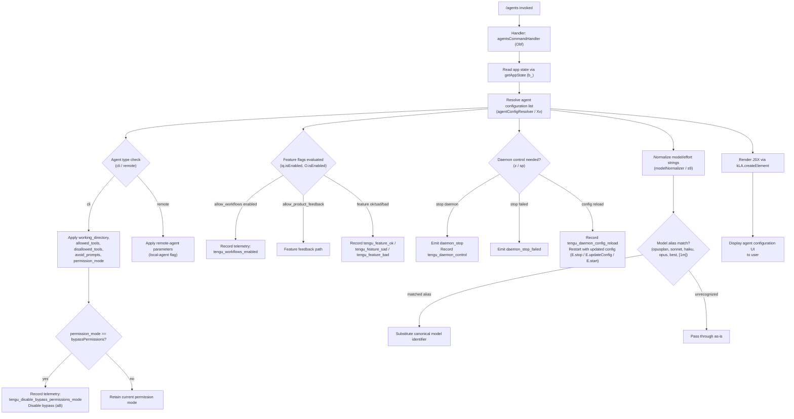

# `/agents`

> Analysis basis: CC v2.1.168 bundle.js (AST extraction + Claude interpretation)
> Minimum version: v2.1.168

---

## Overview

The `/agents` command provides a management interface for agent configurations within Claude Code. It renders a JSX-based UI component that allows users to inspect and control agent session parameters — including tool permissions, working directory, model settings, and daemon lifecycle — by reading and mutating application state through a rich call graph of configuration and daemon-control utilities.

---

## Registration

| Field | Value |
|---|---|
| type | `local-jsx` |
| name | `agents` |
| description | `Manage agent configurations` |
| module_id | `D9K` |
| load_inline | `true` |
| loc_byte | `12598210` |
| loc_byte_end | `12598335` |
| loc_line | `9054` |
| arbor_handler.name | `Obf` |
| arbor_handler.fqn | `claude-2.1.168::Obf` |
| arbor_handler.kind | `AsyncFunction` |
| arbor_handler.resolution_path | `module_id` |
| arbor_handler.n_hits | `0` |

Analysis basis: CC v2.1.168 bundle.js:+12598210

---

## Input Branching

The command's execution involves more than three distinct branching paths across agent configuration reads, permission-mode checks, feature-flag evaluation, daemon control, and model/effort normalization. A Mermaid flowchart is used below.



Analysis basis: CC v2.1.168 bundle.js:+12598069, +12598082, +10944550, +4204609, +9882212

---

## Behavioral Spec

### 1. Command Entry — `agentsCommandHandler` (Obf)

The top-level handler is an `AsyncFunction` resolved via module `D9K`. It invokes two primary sub-routines in sequence: `appStateReader` (`b_`) to gather current session context, and `agentConfigResolver` (`Xv`) to build the full agent configuration view. It then calls `kLA.createElement` to produce the JSX node rendered to the terminal UI.

```
async function agentsCommandHandler(context):
    appState = await appStateReader(context)
    configView = await agentConfigResolver(appState, context)
    return kLA.createElement(AgentsUIComponent, configView)
```

Analysis basis: CC v2.1.168 bundle.js:+12598061, +12598069, +12598082

---

### 2. App State Reading — `appStateReader` (b_)

Reads application state using `H.getAppState`. It searches backward through conversation history for the most-recent agent-relevant entry via `A.findLast`, then extracts the following named configuration keys:

- `working_directory` (bundle.js:+10944655)
- `allowed_tools` (bundle.js:+10944710)
- `disallowed_tools` (bundle.js:+10944765)
- `avoid_prompts` (bundle.js:+10944826)
- `permission_mode` (bundle.js:+10944928)
- `bypassPermissions` (bundle.js:+10944959)
- `session` (bundle.js:+10945258)
- `effort` (bundle.js:+10945283)
- `model` (bundle.js:+10945296)
- `max_thinking_tokens` (bundle.js:+10945308)
- `flag_settings` (bundle.js:+10945334)

```
function appStateReader(context):
    state = H.getAppState(context)
    lastAgentEntry = state.history.findLast(isAgentEntry)
    return extractFields(lastAgentEntry, [
        "working_directory", "allowed_tools", "disallowed_tools",
        "avoid_prompts", "permission_mode", "bypassPermissions",
        "session", "effort", "model", "max_thinking_tokens", "flag_settings"
    ])
```

Analysis basis: CC v2.1.168 bundle.js:+10944550, +10944630

---

### 3. Agent Configuration Resolution — `agentConfigResolver` (Xv)

This is the central orchestrator. It coordinates fetching, normalizing, filtering, and presenting agent configurations. It pushes results into display buffers (`Y.push`, `z.push`) and calls several specialized sub-routines.

```
async function agentConfigResolver(appState, context):
    agentList = buildAgentList(appState)         // wG
    filteredAgents = filterAgents(agentList)     // K9H

    for each agent in filteredAgents:
        normalizedConfig = normalizeAgentConfig(agent)  // zP
        enrichedConfig   = enrichWithFeatureFlags(normalizedConfig)  // qs_, y4

    displayEntries = buildDisplayEntries(enrichedConfig)  // Vg
    displayEntries.push(...renderAgentRows(displayEntries))  // Y.push, z.push
    return displayEntries
```

Analysis basis: CC v2.1.168 bundle.js:+9882212, +9882284, +9882422

---

### 4. Agent List Construction — `agentListBuilder` (wG)

Constructs an agent list by resolving transport type (`cli` vs `remote`) and converting boolean string flags to canonical form (`yes`/`on` → true; `no`/`off` → false). Also invokes the permission registry `D6` for each entry.

```
function agentListBuilder(appState):
    agents = []
    for each rawAgent in appState.agentSources:
        type = rawAgent.type  // "cli" or "remote"
        flagValue = normalizeBoolean(rawAgent.flag)  // jK / _6
        permEntry = permissionRegistry(rawAgent)     // D6
        agents.push({ type, flagValue, permEntry })
    return agents
```

Boolean literals recognized: `"yes"`, `"on"` (bundle.js:+27137, +27143), `"no"`, `"off"` (bundle.js:+27288, +27293).

Analysis basis: CC v2.1.168 bundle.js:+4802132, +4802149, +4802194, +4802284, +4802295, +4802311

---

### 5. Model/Effort String Normalization — `modelNormalizer` (s9)

Trims and lowercases the model string, then applies alias substitution based on well-known short names. Recognized aliases and their canonical expansions:

| Alias | Category |
|---|---|
| `opusplan` | Opus planning variant (bundle.js:+2247508) |
| `[1m]` | 1-million-token context variant (bundle.js:+2247534) |
| `sonnet` | Sonnet family (bundle.js:+2247549) |
| `haiku` | Haiku family (bundle.js:+2247588) |
| `opus` | Opus family (bundle.js:+2247627) |
| `best` | Highest-capability alias (bundle.js:+2247664) |

```
function modelNormalizer(rawModelString):
    s = rawModelString.trim().toLowerCase()
    for each alias in KNOWN_ALIASES:
        if s contains alias:
            return resolveCanonical(s, alias)
    return s
```

Analysis basis: CC v2.1.168 bundle.js:+2247412, +2247423, +2247441

---

### 6. Permission Mode Management — `permissionDisabler` (aB)

When `permission_mode` equals `bypassPermissions`, this routine disables bypass mode and emits a telemetry event. It delegates to the core permission state machine `D6` and then calls `yA` to persist the updated state.

```
function permissionDisabler(state):
    if state.permission_mode == "bypassPermissions":
        emit telemetry: tengu_disable_bypass_permissions_mode
        permissionRegistry(state, { mode: "disable" })  // D6
        persistState(state)                              // yA
```

Literal `"disable"` at bundle.js:+4204713. Telemetry at bundle.js:+4204612.

Analysis basis: CC v2.1.168 bundle.js:+4204609, +4204659

---

### 7. Daemon Lifecycle Control — `daemonController` (z / sp)

Manages agent daemon start, stop, and config-reload operations. Uses `Promise.race` and `Promise.all` for concurrent shutdown coordination, with a 500 ms grace-period timeout (bundle.js:+16229015) before `process.exit`.

```
async function daemonController(action):
    if action == "stop":
        emit event: "daemon_stop"
        record telemetry: tengu_daemon_control
        try:
            await Promise.race([
                Promise.all([shutdownDaemon()]),  // RLH → SLH.shutdown
                timeoutAfter(500)                 // r8
            ])
        catch:
            emit event: "daemon_stop_failed"
            process.exit()

    if action == "config_reload":
        agentProcess.stop()           // E.stop
        agentProcess.updateConfig()   // E.updateConfig
        agentProcess.start()          // E.start
        record telemetry: tengu_daemon_config_reload
```

Analysis basis: CC v2.1.168 bundle.js:+16233897, +16233934, +16228971, +16228985, +16229012, +16229054, +16212414

---

### 8. Feature Flag Evaluation — `featureFlagEvaluator` (zP / X9)

Checks feature-flag registry entries for `allow_product_feedback` (bundle.js:+4185827) and `allow_workflows` (bundle.js:+4187254). The `allow_workflows` path emits `tengu_workflows_enabled` when activated. Feature outcomes route to `tengu_feature_ok`, `tengu_feature_sad`, or `tengu_feature_bad` telemetry.

```
function featureFlagEvaluator(flagSettings):
    if flagSettings.has("allow_product_feedback"):
        evaluateProductFeedback()  // X9 → FgL.has / ggL.has

    if flagSettings.has("allow_workflows"):
        emit telemetry: tengu_workflows_enabled
        applyWorkflowsConfig()    // dgL → D6

    featureResult = checkFeatureState()
    if featureResult == OK:
        emit telemetry: tengu_feature_ok
    elif featureResult == SAD:
        emit telemetry: tengu_feature_sad
    else:
        emit telemetry: tengu_feature_bad
```

Analysis basis: CC v2.1.168 bundle.js:+4186927, +4185755, +4185827, +4187254, +4187455, +1010950, +1011093, +1011012

---

### 9. Network Bootstrap for Agent Data — `bootstrapFetcher` (H / v)

When remote agent data must be fetched, a bootstrap fetch is initiated. The request sets `Content-Type: application/json` (bundle.js:+15797743, +15797758) and a `User-Agent` header (bundle.js:+15797777). A 5000 ms timeout applies (bundle.js:+15797859). On success, logs `"[Bootstrap] Fetch ok"` (bundle.js:+15798032); on parse failure, emits `"parse_failed"` under event `"api_bootstrap_fetch"` (bundle.js:+15797980, +15798002).

```
async function bootstrapFetcher(url):
    log("[Bootstrap] Fetching", url)
    response = await fetch(url, {
        headers: {
            "Content-Type": "application/json",
            "User-Agent": buildUserAgent()
        },
        timeout: 5000
    })
    if response.ok:
        data = parseJSON(response)
        if parseFailed:
            emit event: "api_bootstrap_fetch", status: "parse_failed"
        else:
            log("[Bootstrap] Fetch ok")
            return data
```

Analysis basis: CC v2.1.168 bundle.js:+15797656, +15797658, +15797743, +15797790, +15797859, +15797980

---

### 10. Agent Team Configuration — `agentTeamsConfig` (nN / sC_)

Handles `--agent-teams` CLI argument (bundle.js:+5490909). Recognizes three team modes:

| Mode | Literal |
|---|---|
| `standard` | bundle.js:+6590006 |
| `tst` | bundle.js:+6590085 |
| `tst-auto` | bundle.js:+6590135 |

Delegates to `teamNetworkConfig` (`sC_`) which checks current network provider (`bedrock`, `foundry`, `anthropicAws`, `mantle`, `vertex` — bundle.js:+2100952…+2101160) and applies team-specific overrides. Emits a Vertex-specific warning when tool-search beta header is incompatible (bundle.js:+6591019).

```
function agentTeamsConfig(teamArg):
    mode = parseTeamMode(teamArg)  // one of: standard, tst, tst-auto
    provider = detectNetworkProvider()  // MA → _6
    if provider == "vertex" and toolSearchEnabled:
        warn("[ToolSearch:optimistic] disabled: Vertex AI does not accept...")
    applyTeamOverrides(mode, provider)  // sC_
```

Analysis basis: CC v2.1.168 bundle.js:+5490909, +6590006, +6590085, +6590135, +6591019

---

### 11. Tool Permission Narrowing — `toolPermissionNarrower` (K9H / Xk6)

Filters the agent tool list using two narrowing strategies: `cliArg` (bundle.js:+10677639) and `toolsNarrowing` (bundle.js:+10677660). Blocked tools are identified by the `"blocked"` literal (bundle.js:+9881579). `deny` entries (bundle.js:+10676965) are excluded from the active tool set.

```
function toolPermissionNarrower(agents, filters):
    return agents.filter(agent =>
        not agent.tools.some(t => t.status == "blocked")
    ).map(agent => {
        agent.tools = applyNarrowing(agent.tools, filters.cliArg)
        agent.tools = applyNarrowing(agent.tools, filters.toolsNarrowing)
        agent.tools = agent.tools.filter(t => t.permission != "deny")
        return agent
    })
```

Analysis basis: CC v2.1.168 bundle.js:+9881518, +9881533, +9881579, +10676965, +10677639, +10677660

---

### 12. Daemon Status Display — `daemonStatusDisplay` (DLK)

Reads `daemon.status.json` (bundle.js:+12780353) to determine current daemon state. Possible status values observed: `"stopped"` (bundle.js:+16233806), `"supervisor"` (bundle.js:+16211621), `"background session"` (bundle.js:+16233849), `"heartbeat"` (bundle.js:+16210842). Timestamps are rendered via `Date.now`. Output columns are padded to width 40 characters (bundle.js:+16223773) using two-space separator `"  "` (bundle.js:+16221802).

```
function daemonStatusDisplay(statusPath):
    raw = readJSON(statusPath + "/daemon.status.json")
    rows = buildTableRows(raw)
    colWidth = Math.max(40, computeMaxWidth(rows))  // UfK
    for each row in rows:
        line = row.key.padEnd(colWidth) + "  " + row.value
        output.write(line)
```

Analysis basis: CC v2.1.168 bundle.js:+12780353, +16233806, +16223773, +16221802

---

## State & Side Effects

| Item | Detail |
|---|---|
| Telemetry: `tengu_feature_sad` | Emitted when a feature check yields a degraded/sad result (bundle.js:+1011093) |
| Telemetry: `tengu_disable_bypass_permissions_mode` | Emitted when bypass-permissions mode is disabled (bundle.js:+4204612) |
| Telemetry: `tengu_slate_harbor` | Emitted during agent transport initialization (bundle.js:+4802314) |
| Telemetry: `tengu_daemon_config_reload` | Emitted when the daemon config is reloaded and the agent process restarted (bundle.js:+16212414) |
| Telemetry: `tengu_workflows_enabled` | Emitted when the `allow_workflows` feature flag is active (bundle.js:+4187455) |
| Telemetry: `tengu_cobalt_ridge` | Emitted during agent transport construction (bundle.js:+4918944) |
| Telemetry: `tengu_feature_ok` | Emitted when a feature check succeeds (bundle.js:+1010950) |
| Telemetry: `tengu_feature_bad` | Emitted when a feature check fails hard (bundle.js:+1011012) |
| Telemetry: `tengu_daemon_control` | Emitted on any daemon start/stop action (bundle.js:+16233972) |
| Telemetry: `tengu_amber_flint` | Emitted during agent-teams configuration (bundle.js:+5491021) |
| appState changes | Writes updated `permission_mode`, model, effort, tool lists, and flag_settings back via `D6` + `yA` |
| Daemon lifecycle | May call `E.stop`, `E.updateConfig`, `E.start`, `SLH.shutdown`, or `process.exit` |
| File I/O | Reads `daemon.status.json`; may call `opK.unlinkSync` for cleanup |
| Timers | Sets/clears timeouts: 5000 ms bootstrap fetch, 500 ms daemon shutdown grace period |
| Crypto | Uses `IP_.randomUUID` for new session IDs (bundle.js:+3236916) |
| Event emission | Emits `daemon_stop`, `daemon_stop_failed`, `firstParty` events via `H.emit` |

---

## Version History

| Version | Change |
|---|---|
| v2.1.168 | Initial analysis |

---

## Common Mistakes

1. **Assuming `/agents` only lists agents** — the command is a full management interface that can also modify permission modes, reload daemon configs, and control agent lifecycle.
2. **Expecting a text-only response** — the command type is `local-jsx` and renders a structured UI component, not plain text output.
3. **Providing an unrecognized model alias** — only the six canonical aliases (`opusplan`, `[1m]`, `sonnet`, `haiku`, `opus`, `best`) are substituted; all other strings pass through unchanged and may cause downstream errors.
4. **Invoking `/agents` with `bypassPermissions` active** — the command will automatically disable bypass mode and emit telemetry; callers relying on bypass mode for subsequent operations must re-enable it.
5. **Assuming daemon stop is synchronous** — the shutdown races against a 500 ms timeout; if the daemon does not stop within that window the process exits forcefully.
6. **Ignoring Vertex AI tool-search incompatibility** — when running on Vertex AI, tool-search beta headers are silently dropped unless `ENABLE_TOOL_SEARCH=true` is set.

---

## Appendix — Identifier Mapping

> For bundle debugging only. Identifiers change across versions.

| Identifier | Role |
|---|---|
| `Obf` | Top-level agents command handler (AsyncFunction, entry point) |
| `b_` | App state reader — extracts agent config fields from session state |
| `H` | App state / HTTP client namespace (getAppState, bootstrap fetch) |
| `v` | Bootstrap fetch executor |
| `snK` | Field extraction helper for agent config keys |
| `RH` | JSON serialization utility (wraps JSON.stringify) |
| `G4` | String path manipulation utility (slice, lastIndexOf, replace) |
| `EUH` | Normalization wrapper (delegates to nWA) |
| `_iK` | File/buffer utility (dirname, byteLength, Buffer ops) |
| `mj_` | String splitting and trimming utility |
| `lHH` | Set membership check helper |
| `uj` | String replace utility wrapper |
| `H9` | Composite string normalizer orchestrator |
| `m6H` | Model string parser (Q0, aqH, yA, qB sub-steps) |
| `s9` | Model/effort alias normalizer (trim, toLowerCase, alias substitution) |
| `FJ` | Full model normalization pipeline combining s9 and _G |
| `o6` | UI rendering utility (l, J6 sub-calls) |
| `J6` | JSX element factory wrapper (hm6) |
| `A` | General array/string operand (contextual) |
| `f` | File handle / stream operand (contextual) |
| `L` | Promise tracking set (add, finally, delete) |
| `ty8` | Agent configuration type handler variant A (L1) |
| `ey8` | Agent configuration type handler variant B (L1) |
| `L1` | Shared agent config type resolution logic |
| `aB` | Permission mode disabler (disable bypassPermissions) |
| `D6` | Core permission registry / agent state machine |
| `cj6` | Permission registry sub-initializer A |
| `lj6` | Permission registry sub-initializer B |
| `hu` | Permission registry helper (yu delegation) |
| `cq8` | Permission cache lookup/store (RP_ set, HwH map) |
| `C6` | Permission registry state updater (d6, qZ, nP_, LwH, Date.now) |
| `Xv` | Agent configuration resolver — central orchestrator |
| `wG` | Agent list builder (type detection, boolean normalization) |
| `Yd` | Agent entry constructor |
| `jK` | Boolean-string-to-value converter ("yes"/"on" → true) |
| `_6` | Boolean-string-to-value converter ("no"/"off" → false) |
| `Y` | Display output buffer (write, push, get, set, delete) |
| `$GH` | Agent display row renderer (V9, V8, pfA, GH, x9, mfA, Object.keys) |
| `V9` | Async store context accessor (eNL.getStore) |
| `V8` | Display row secondary data fetcher |
| `pfA` | Display row formatter (mfA delegation) |
| `GH` | String coercion helper for display |
| `K` | Column layout helper (map, padEnd, some, filter) |
| `UfK` | Table column width calculator (Object.keys, Math.max, bD) |
| `T` | Agent process handle (stop, ly6, Y46) |
| `E` | Agent daemon process controller (stop, updateConfig, start) |
| `TUK` | Daemon control signal dispatcher (S8H) |
| `V` | Agent daemon monitor (start) |
| `As_` | Configuration applicator (rEq, y_) |
| `y_` | Module export initializer (__esModule, wTH, Sg8, Im6, km6, jBK, TjA) |
| `km6` | Module binding helper |
| `zP` | Feature flag and config normalizer (rf8, jf9, mZ_, QgL) |
| `rf8` | Config reader sub-step (_6, aE) |
| `aE` | Config field accessor |
| `jf9` | Feature flag check orchestrator (X9) |
| `X9` | Individual feature flag evaluator (FgL, ggL, cC, $q, ILH, sIH) |
| `mZ_` | Workflow config applicator (dgL) |
| `dgL` | Workflow config writer (_6, D6, jK, Aq) |
| `QgL` | Config normalization finalizer (aE) |
| `K9H` | Tool list filter (H.filter, Xk6) |
| `Xk6` | Tool narrowing applicator (at, y6A, VCq) |
| `at` | Tool list flattener (wy8.flatMap, w$) |
| `y6A` | Individual tool entry processor (n$6, i$6, VZH, omA, $Z) |
| `VCq` | Tool validation finalizer |
| `qs_` | Agent config snapshot builder (fb, __6, y_) |
| `fb` | Transport config constructor (r6, _6, jK, uKH, D6) |
| `y4` | Agent config secondary builder (r6, uKH) |
| `z` | Daemon lifecycle event emitter / display push target |
| `SH` | Daemon stop success handler (l, J6) |
| `CH` | Daemon stop failure handler (l, J6) |
| `uh` | New session initializer (yu, Vc.push, EvH, yP_) |
| `yu` | Session base constructor (kC) |
| `EvH` | Session event emitter (xh) |
| `yP_` | Session UUID and event registrar (pq8, IP_.randomUUID, flH, ZB, H.emit) |
| `sp` | Daemon shutdown coordinator (Promise.race, Promise.all, RLH, pLH, r8, process.exit) |
| `RLH` | Daemon shutdown invoker (SLH.shutdown) |
| `pLH` | Shutdown timeout cleaner (clearTimeout, q2_) |
| `r8` | Timeout-with-abort helper (K, Error, q, setTimeout, O, clearTimeout, L.unref) |
| `Vg` | Full agent display builder (y4, GP, ow, _6, LA6, As_, B9, uAf, mAf, qs_, cZq, nN) |
| `GP` | Local-agent config builder (_6, $d8) |
| `$d8` | Local-agent config sub-constructor |
| `ow` | Transport type wrapper (jK) |
| `LA6` | Agent label/alias resolver |
| `B9` | Agent-teams arg processor (_6, z47, D6) |
| `z47` | Agent-teams sub-processor |
| `uAf` | Agent config update handler A (yEq, y_) |
| `mAf` | Agent config update handler B (xEq, y_) |
| `nN` | Agent network/team orchestrator (sC_, v, MA, Lf) |
| `sC_` | Team network config applier (tNH, aC_, qO7, _6, jK) |
| `MA` | Network provider detector (_6) |
| `Lf` | Network config finalizer |
| `Y4` | Feature state enum/check helper |
| `O` | Feature enabled checker (b8, isEnabled) |
| `b8` | Feature registry backing store |
| `$` | Display includes checker (DLK) |
| `DLK` | Status display renderer (Yo, Date.now, V9, YC6, RH) |
| `Yo` | Status entry formatter (b4H) |
| `YC6` | Status path joiner (YLK.join, t8) |

---

Note: index built via Arbor fallback; some signals (telemetry, literals) may be missing — see arbor-fallback.js.