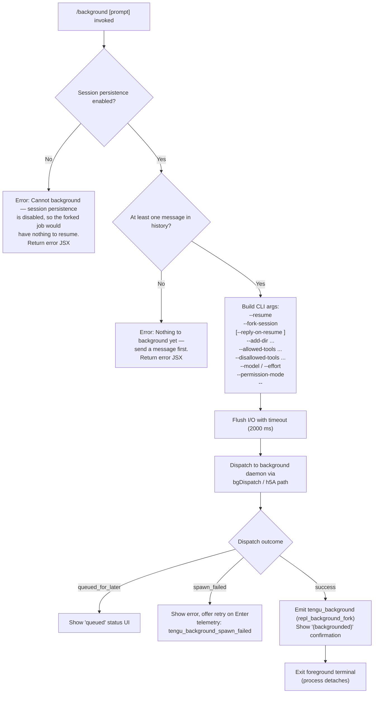

# `/background`

> Analysis basis: CC v2.1.168 bundle.js (AST extraction + Claude interpretation)
> Minimum version: v2.1.168

---

## Overview

The `/background` command (alias `/bg`) detaches the current interactive Claude Code session from the terminal and hands it off to the background daemon, freeing the terminal for other use. It validates that the session has at least one message exchanged and that daemon-based session persistence is available, then dispatches the session as a background job with an optional continuation prompt, passing through the current tool, model, effort, and permission settings.

---

## Registration

| Field | Value |
|---|---|
| type | `local-jsx` |
| name | `background` |
| description | `Send this session to the background and free the terminal` |
| aliases | `["bg"]` |
| argumentHint | `[prompt]` |
| immediate | `null` |
| module_id | `tMK` |
| load_inline | `true` |
| loc_byte | `13110534` |
| loc_byte_end | `13110774` |
| loc_line | `9713` |
| arbor_handler.name | `xgf` |
| arbor_handler.fqn | `claude-2.1.168::xgf` |
| arbor_handler.kind | `AsyncFunction` |
| arbor_handler.resolution_path | `module_id` |
| arbor_handler.n_hits | `0` |

Analysis basis: CC v2.1.168 bundle.js:+13110534

---

## Input Branching

Four distinct execution paths exist, warranting a Mermaid flowchart.



Analysis basis: CC v2.1.168 bundle.js:+13109818 (handler entry `xgf`), +13109899 (persistence guard), +13110075 (empty-history guard), +13105354 (CLI flag `--resume`), +13105298 (2000 ms flush timeout), +13106646 (`repl_background_fork`), +13106669 (`queued_for_later`), +13106720 (`spawn_failed`)

---

## Behavioral Spec

### Guard: Session Persistence Check

```
function checkPersistenceEnabled(appState):
    if appState.sessionPersistenceDisabled:
        return Error(
            "Cannot background — session persistence is disabled, " +
            "so the forked job would have nothing to resume."
        )
    return OK
```

The handler inspects an application-state flag. When persistence is off, it returns a JSX error element immediately without reaching the daemon layer.

Analysis basis: CC v2.1.168 bundle.js:+13109899

---

### Guard: Non-Empty History Check

```
function checkHasMessages(conversationHistory):
    if conversationHistory.length == 0:
        return Error("Nothing to background yet — send a message first.")
    return OK
```

A session with zero exchanged messages cannot be forked; the daemon job would have no context to resume.

Analysis basis: CC v2.1.168 bundle.js:+13110075

---

### CLI Argument Construction

```
function buildBackgroundArgs(session, opts, userPrompt):
    args = []

    // Core identity
    args.push("--resume", session.id)
    args.push("--fork-session")

    // Optional reply on resume
    if userPrompt is not empty:
        args.push("--reply-on-resume", userPrompt)

    // Working directories
    for dir in session.additionalDirs:
        args.push("--add-dir", dir)

    // Tool allow/deny lists
    if opts.allowedTools:
        args.push("--allowed-tools", opts.allowedTools.join(","))
    if opts.disallowedTools:
        args.push("--disallowed-tools", opts.disallowedTools.join(","))

    // Model / effort
    if opts.model:
        args.push("--model", opts.model)
    if opts.effort:
        args.push("--effort", opts.effort)

    // Permission mode
    if opts.permissionMode:
        args.push("--permission-mode", opts.permissionMode)

    args.push("--")   // end-of-flags sentinel
    return args
```

Key CLI flags observed in literals: `--resume` (+13105354), `--fork-session` (+13105367), `--reply-on-resume` (+13105409), `--add-dir` (+13105461), `--allowed-tools` (+13105496), `--disallowed-tools` (+13105537), `--model` (+13105568), `--effort` (+13105590), `--permission-mode` (+13105607), `--` (+13105635).

Analysis basis: CC v2.1.168 bundle.js:+13105354–13105635

---

### Permission Pre-flight (bypassPermissions / auto mode)

Before dispatching, the handler validates that certain permission modes were previously acknowledged interactively:

```
function checkPermissionPreflights(opts, settings):
    if opts.permissionMode == "bypassPermissions":
        if not settings.dangerouslySkipPermissionsAccepted:
            return Error(
                "--bg with bypassPermissions requires accepting the disclaimer first. " +
                "Run `claude --dangerously-skip-permissions` once interactively."
            )
    if opts.permissionMode == "auto":
        if not settings.autoModeOptedIn:
            return Error(
                "--bg with auto mode requires opting in first. " +
                "Run `claude --permission-mode auto` once interactively."
            )
    return OK
```

Analysis basis: CC v2.1.168 bundle.js:+13102413 (`bypassPermissions` guard message), +13102575 (`auto` guard message)

---

### I/O Flush with Timeout

```
async function flushBeforeDetach(flushTarget, timeoutMs = 2000):
    try:
        await Promise.race([
            flushTarget.flush(),
            timeout(timeoutMs)   // raises "flush timeout"
        ])
    catch err:
        log.warn("flush timeout", err)
    // proceed regardless
```

The flush timeout is 2000 ms (literal `2000` at +13105298; string `"flush timeout"` at +13105303). Even on timeout the dispatch continues.

Analysis basis: CC v2.1.168 bundle.js:+13105298

---

### Background Dispatch

```
async function dispatchToBackground(args, sessionState):
    result = await bgDispatch(args, sessionState)

    switch result.status:
        case "queued_for_later":
            showQueuedUI()
            return

        case "spawn_failed":
            emit(tengu_background_spawn_failed)
            showRetryPrompt("couldn't start in the background — press Enter to retry")
            return

        default:  // success
            emit(tengu_background, { origin: "repl_background_fork" })
            showConfirmation("(backgrounded)")
            detachForegroundTerminal()
```

The daemon path goes through `h5A` → `$Q` → `gC6` (daemon ensure-running), then `Zgf` (job creation), then `Wz` (control socket dispatch).

Analysis basis: CC v2.1.168 bundle.js:+13106646 (`repl_background_fork`), +13106669 (`queued_for_later`), +13106720 (`spawn_failed`), +13106354 (retry prompt text), +13107529 (`(backgrounded)`)

---

### Already-Backgrounded Guard

```
function checkNotAlreadyBackground(sessionState):
    if sessionState.mode == "background":
        emit(tengu_background_already_bg)
        return Error("Session is already running in the background.")
```

Analysis basis: CC v2.1.168 bundle.js:+13109832 (`tengu_background_already_bg` telemetry)

---

### Daemon Ensure-Running Sub-flow

Before dispatching, the daemon is started if not already running. Key sub-paths (via `$Q`):

- On Linux, if no daemon is running: prompt `"Install as a service now? [y/N/never, or 'once' just for now] "` (+13049211)
- Answers: `yes` / `once` / `no` / `never`; `once` does a transient spawn (+13049364)
- Stale exec path: `"daemon service exec path is stale (binary deleted) — falling back to transient spawn."` (+13041733)

Analysis basis: CC v2.1.168 bundle.js:+13041615 (`daemon_ensure_running`), +13042580 (`ask`), +13049211 (install prompt)

---

## State & Side Effects

| Item | Detail |
|---|---|
| Telemetry: `tengu_background` | Fired on successful dispatch; carries `origin: "repl_background_fork"` (bundle.js:+13106794) |
| Telemetry: `tengu_background_spawn_failed` | Fired when daemon dispatch returns `spawn_failed` (bundle.js:+13105991) |
| Telemetry: `tengu_background_already_bg` | Fired when the session is already backgrounded (bundle.js:+13109832) |
| Telemetry: `tengu_bg_dispatch` | Fired inside the dispatch sub-system (bundle.js:+13082112) |
| Telemetry: `tengu_bg_dispatch_fallback` | Fired when primary dispatch path fails and a fallback is tried (bundle.js:+13082642) |
| Telemetry: `tengu_bg_dispatch_rescued` | Fired when a stalled dispatch is rescued (bundle.js:+13088463) |
| Telemetry: `tengu_bg_daemon_cold_start_ask` | Fired when asking user to install daemon (bundle.js:+13042638) |
| Telemetry: `tengu_bg_daemon_cold_start_ask_answer` | Fired after user answers the install prompt (bundle.js:+13049286) |
| Telemetry: `tengu_bg_daemon_spawn_failed` | Fired when transient daemon spawn fails (bundle.js:+13043157) |
| Telemetry: `tengu_rename_full_session_fork` | Fired during session-name generation for the forked job (bundle.js:+12033196) |
| I/O flush | 2000 ms timeout before detach; non-blocking on timeout |
| Session state | The foreground session transitions from `active` to detached; the background job is created with state `bg` |
| Daemon socket | A new Unix socket connection (`Wz` / `xF8.connect`) is opened to the daemon control socket |
| Terminal | Foreground terminal is freed after detach; the daemon worker continues in a headless PTY |
| File system | A dispatch file may be written to the daemon temp directory; cleaned up on completion |

---

## Version History

| Version | Change |
|---|---|
| v2.1.168 | Initial analysis |

---

## Common Mistakes

1. **Running `/background` before sending any message.** The command will refuse with *"Nothing to background yet — send a message first."* You must have at least one completed exchange in the session.

2. **Using `bypassPermissions` mode without prior interactive acknowledgement.** Attempting `/background` while `--dangerously-skip-permissions` is active without having run it once interactively will block with an error. Run `claude --dangerously-skip-permissions` once in interactive mode first.

3. **Session persistence disabled.** If the CLI is started with persistence turned off (e.g., certain API-only or ephemeral configurations), `/background` is entirely unavailable — the session has no resumable state to hand off.

4. **Daemon not installed on Linux, answering "never".** Selecting `never` at the *"Install as a service now?"* prompt permanently suppresses daemon installation for that user; future `/background` calls will also fail unless the daemon is manually installed via `claude daemon install`.

5. **Confusing `/background` with a non-interactive flag.** The command only applies to an active REPL session. Passing `--bg` on the command line at startup is a separate code path (`cli-bg-dispatch`) and does not invoke this slash command.

---

## Appendix — Identifier Mapping

> For bundle debugging only. Identifiers change across versions.

| Identifier | Role |
|---|---|
| `xgf` | Main handler for `/background` command (AsyncFunction, arbor-resolved) |
| `Mu8` | Background command top-level orchestrator; builds args, orchestrates flush + dispatch |
| `$u8` | Argument normalization / CLI-arg builder helper called from `xgf` |
| `Q0` | Session list / active session retrieval helper |
| `GM` | Application state getter |
| `U5A` | Feature-flag / gate check wrapper |
| `r4` | Telemetry emission core |
| `j9` | Hook registration utility |
| `IL` | Promise-with-timeout helper (2000 ms flush timeout) |
| `vE` | Telemetry dispatch wrapper (calls `r4`) |
| `vTH` | Tool/permission settings resolver |
| `ki` | Background job creation / session fork orchestrator |
| `Zgf` | Job dispatch with socket connection logic |
| `h5A` | Daemon-ensure-running orchestrator (includes cold-start prompt) |
| `$Q` | Daemon health check + service install flow |
| `gC6` | Daemon process management and spawn |
| `Wz` | Control socket connect + message send |
| `wS8` | Fallback socket connection helper |
| `mMK` | Dispatch acknowledgement wait / timeout handler |
| `k5A` | Dispatch result parser and error classifier |
| `Rgf` | CLI argument parsing for background flags (resume, session-id, etc.) |
| `iMK` | `--resume=` / `-r=` flag parser |
| `Ku8` | `--session-id` flag parser |
| `rMK` | Additional flag parser (cloud, remote) |
| `bgf` | Guard check for `bypassPermissions` flag |
| `D5A` | `--cloud` / `--remote` prefix checker |
| `Cc` | Permission-mode string validator |
| `C6` | Config file watcher and reader |
| `LwH` | Config file read/parse with backup rotation |
| `hVL` | Config file watch registration |
| `u6` | Async-local-storage context reader |
| `pc6` | Store getter for async context |
| `W_` | Telemetry context / session writer |
| `zf` | Atomic file writer (randomBytes temp + rename) |
| `XY` | Low-level atomic file write implementation |
| `oj` | File cache invalidation helper |
| `P_H` | Path relativisation helper |
| `G4` | Path display formatter |
| `xMK` | Tool list mapper |
| `Egf` | Error logger for dispatch failures |
| `dc6` | Structured log writer |
| `Sgf` | Arg suffix builder |
| `oMK` | Output-mode resolver |
| `HI` | Daemon health probe |
| `Ngf` | Notification helper after fork |
| `R8H` | Background service anchor helper |
| `bLH` | Background service descriptor |
| `ZHH` | Session temp-dir cleanup |
| `mR` | Model/effort argument serializer |
| `KsH` | Permission-mode serializer |
| `jXH` | Additional-dirs serializer |
| `o6` | Telemetry: `tengu_feature_sad` emitter |
| `C96` | Session-name generation for forked job |
| `WNf` | Session-name LLM query orchestrator |
| `EG` | Core agent query executor |
| `bN8` | App-state updater for ongoing queries |
| `xN8` | Query cancellation helper |
| `WS` | Auth token/random-bytes helper |
| `A9H` | Telemetry for agent queries |
| `Xp` | Subagent exit / command lifecycle telemetry |
| `_h6` | Stream-event filter (tombstone, tool_use_summary, etc.) |
| `I9H` | Stream idle timeout handler |
| `Hh8` | Stream event accumulator |
| `rCq` | Repeated stream-event filter |
| `QfH` | Notification push helper |
| `JDf` | Fork-agent telemetry emitter |
| `u8` | Tool-call context builder |
| `Laq` | Text content extractor from API response |
| `eR` | String trim utility |
| `gR8` | Message array flattener |
| `KS` | Full query pipeline (schema build → API call → result) |
| `K4` | Query schema builder |
| `aI8` | File-attachment processor |
| `oI8` | Attachment type discriminator |
| `ME` | Message normaliser (full pipeline) |
| `XLf` | Content-block mapper |
| `sIq` | Image attachment serialiser |
| `fuH` | Fork-agent executor wrapper |
| `Oe_` | Attachment list processor |
| `EzK` | Main query engine (API streaming loop) |
| `D2` | Provider credential resolver |
| `MA` | Auth mode discriminator |
| `Lf` | Credential loader |
| `DM_` | API key type detector (managed key / sk-ant- prefix) |
| `H9` | OAuth token resolver |
| `DdH` | Network error classifier |
| `nT` | Query cleanup / teardown |
| `sK` | Tool filter by name |
| `RO` | Compact-boundary detector |
| `Vy8` | Compact flag extractor |
| `fJ` | Message-role classifier |
| `YjH` | File-state snapshot writer |
| `fz` | State-file validity checker |
| `uF` | Array type guard |
| `O` | Error code replacer |
| `b8` | Error code normaliser |
| `Wy8` | Tool-name pattern matcher |
| `ES` | Enabled-tools resolver |
| `cn` | Tool capability checker |
| `v9H` | `--cloud` / `--remote` prefix detector |
| `s$` | Session ID generator |
| `R6` | UUID-based ID generator |
| `tv` | UUID v4 primitive |
| `mg` | Model ID generator |
| `J9` | Daemon-worker connection helper |
| `dYH` | Daemon worker protocol reader |
| `oMH` | Detach-request sender to daemon worker |
| `xH8` | Worker task type resolver |
| `Cpq` | Worker message serialiser |
| `By8` | Worker message type constants |
| `Ae` | Raw byte writer to worker pipe |
| `DGH` | Environment mode resolver (production/test) |
| `_6` | String coercion utility |
| `r$K` | Build-environment tag reader |
| `Cx` | Runtime environment validator |
| `SH` | `tengu_feature_ok` emitter |
| `CH` | `tengu_feature_bad` emitter |
| `J6` | Feature telemetry dispatcher |
| `uh` | Daemon control event emitter |
| `yu` | Daemon control event builder |
| `EvH` | First-party event tagger |
| `yP_` | Telemetry payload builder |
| `sp` | Graceful shutdown orchestrator |
| `RLH` | MCP server shutdown helper |
| `pLH` | Shutdown timeout cleaner |
| `r8` | Timeout-promise with abort helper |
| `X` | IPC frame reader/writer |
| `J` | IPC connection manager |
| `w` | Worker session manager |
| `H` | HTTP bootstrap fetcher |
| `lx8` | macOS memory probe |
| `eX6` | File-state reader |
| `hH` | Structured logger |
| `Q` | Process lifecycle manager (retire/kill) |
| `D6` | MCP connection state manager |
| `pwA` | Spare worker claim handler |
| `dwA` | Worker state machine |
| `V8` | Logging primitive |
| `X5` | IPC frame encoder |
| `RH` | JSON serialiser wrapper |
| `o$5` | Supervisor attach/dispatch handler |
| `U6` | JSON parser wrapper |
| `$` | IPC write stream |
| `DLK` | Dispatch log entry builder |
| `M` | MCP state aggregator |
| `xbH` | MCP tool list builder |
| `PF8` | MCP connection result applier |
| `v` | HTTP header builder |
| `cDA` | MCP client state synchroniser |
| `Sz` | Background service descriptor lookup |
| `AwH` | Background service anchor resolver |
| `FwA` | Worker ID generator |
| `HUK` | Dispatch acknowledgement handler |
| `P` | Repaint / display orchestrator |
| `j` | Worker kill dispatcher |
| `Y` | Supervisor config updater |
| `h` | Sweep / heartbeat tick handler |
| `EOA` | Vim-mode key binding registrar |
| `C` | Command executor (enqueue) |
| `e9` | File-watcher state reader |
| `h8` | Log level gate |
| `Tf` | Trace log writer |
| `RK` | Job directory path builder |
| `sT` | Job temp-path builder |
| `tHH` | CLAUDE.md / context file scanner |
| `zY` | Symlink realpath resolver |
| `ex` | File extension classifier |
| `hW` | Directory recursive scanner |
| `oG4` | File content type scanner |
| `nx8` | Background-upgrade check |
| `i$5` | Stall counter helper |
| `m` | Timed write helper |
| `V` | Interval clear helper |
| `S9H` | Signal handler registrar |
| `r$5` | Respawn-on-stall orchestrator |
| `y` | Away-summary generator |
| `_N8` | App-state snapshot reader |
| `GL5` | Away-summary cache reader |
| `_hK` | Draft-input presence checker |
| `oz8` | Away-summary LLM caller |
| `ybq` | UUID generator for away summary |
| `g` | Output rate-limiter / write batcher |
| `n` | MCP update processor |
| `AF` | Async iterator / readable stream mapper |
| `L16` | Integer parser (radix 10) |
| `T` | MCP tool-list diff calculator |
| `lk8` | Integer parser variant |
| `r` | Agent turn runner |
| `HH` | Voice recording session manager |
| `bbH` | MCP connection status classifier |
| `GH` | String coercion (display) |
| `U` | Interval clear wrapper |
| `a` | MCP reconnect orchestrator |
| `G` | MCP tool initialiser |
| `d` | Scheduled task runner |
| `c` | Permission-file reader/writer |
| `DS6` | Permission file reader |
| `dgq` | Permission file deleter |
| `Cu6` | IPC frame destructor |
| `W` | Teammate mailbox reader |
| `nV6` | Teammate message processor |