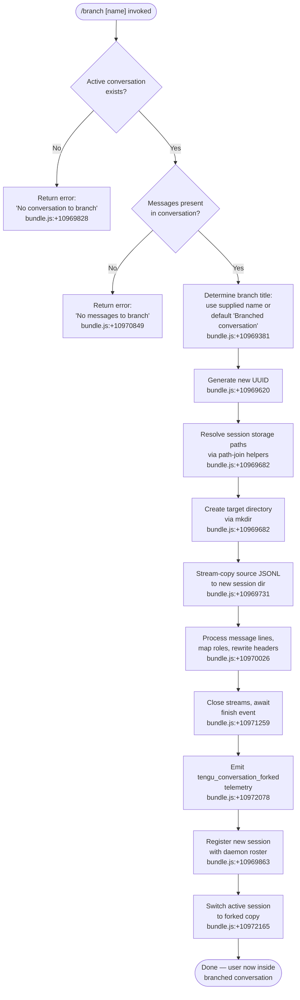

# `/branch`

> Analysis basis: CC v2.1.168 bundle.js (AST extraction + Claude interpretation)
> Minimum version: v2.1.168

---

## Overview

The `/branch` command creates a divergent copy of the current conversation at the point it is invoked, carrying forward all messages up to that moment into a new independent session. It works by copying the conversation's JSONL transcript file into a fresh directory, registering the new session with the daemon, and then switching the user's active window to that forked session. An optional `[name]` argument sets the title of the branched conversation.

---

## Registration

| Field | Value |
|---|---|
| type | `local-jsx` |
| name | `branch` |
| description | Create a branch of the current conversation at this point |
| argumentHint | `[name]` |
| loc_byte | 12511476 |
| loc_byte_end | 12511653 |
| loc_line | 8941 |
| module_id | `M_A` |
| load_inline | `true` |
| arbor_handler.name | `uDf` |
| arbor_handler.fqn | `claude-2.1.168::uDf` |
| arbor_handler.kind | `AsyncFunction` |
| arbor_handler.resolution_path | `module_id` |
| arbor_handler.n_hits | 0 |

Analysis basis: CC v2.1.168 bundle.js:+12511476

---

## Input Branching

The command execution has four distinct outcomes depending on conversation state and messaging:



---

## Behavioral Spec

### Main Handler — `uDf` (AsyncFunction)

The top-level async handler dispatches into the forking orchestrator.

```
async function branchCommandHandler(context):
    result = await forkOrchestrator(context)
    return result
```

Analysis basis: CC v2.1.168 bundle.js:+10972863

---

### Fork Orchestrator — `Xmq`

This function is the primary body of the branch command. It coordinates all steps from validation through copy to session registration.

```
async function forkOrchestrator(context):
    // 1. Resolve current session state
    sessionState = getCurrentSessionState()          // via s$ / R6
    if sessionState is null or empty:
        throw Error("No conversation to branch")     // bundle.js:+10969828

    // 2. Collect messages to copy
    messages = gatherSessionMessages(sessionState)   // via jmq (find + replace)
    if messages is empty:
        return errorResult("No messages to branch")  // bundle.js:+10970849

    // 3. Determine the branch title
    customName = context.args?.trim() or null
    branchTitle = customName ?? "Branched conversation"  // bundle.js:+10969381

    // 4. Generate a new unique session identifier
    newSessionId = crypto.randomUUID()               // bundle.js:+10969620

    // 5. Build storage paths for new session
    newSessionDir = buildSessionDir(newSessionId)    // Zv / TM / path.join

    // 6. Create directory for new session
    await fs.mkdir(newSessionDir, { recursive: true }) // bundle.js:+10969682

    // 7. Stream-copy conversation content
    readStream  = fs.createReadStream(sourcePath, { encoding: "utf8", highWaterMark: 448 })
                                                     // bundle.js:+10969731, 10969713, 10969764
    writeStream = fs.createWriteStream(destPath)     // bundle.js:+10969877

    // 8. Process each JSONL line
    lineReader = readline.createInterface(readStream) // Dmq — bundle.js:+10969971
    for each line in lineReader:
        transformedLine = transformMessageLine(line) // H.map pipeline
        writeStream.write(transformedLine)

    // 9. Wait for write stream to finish
    await streamFinished(writeStream)                // wmq.finished — bundle.js:+10971259

    // 10. Register new session and write metadata
    await registerSession(newSessionId, branchTitle) // hH — bundle.js:+10969863

    // 11. Emit fork telemetry
    emitTelemetry("tengu_conversation_forked", { mode: "fork" })
                                                     // bundle.js:+10972078, 10972599

    // 12. Switch active window to new session
    switchToSession(newSessionId)                    // d1 — bundle.js:+10972165

    return success
```

Analysis basis: CC v2.1.168 bundle.js:+10971882

---

### Message Gathering — `jmq`

Collects and normalises the conversation message list from current session state.

```
function gatherSessionMessages(sessionState):
    messages = Array.find(sessionState.messages, matchAllMessages)
                                                     // _.find — bundle.js:+10969433
    normalised = messages.replace(normalisationPattern, ...)
                                                     // A.replace — bundle.js:+10969511
    return normalised
```

Analysis basis: CC v2.1.168 bundle.js:+10969433

---

### Message Line Transformer — `H` → `v` pipeline

Processes each JSONL line during the stream copy phase, rewriting role fields and content.

```
function transformMessageLine(line):
    // Parse and validate content type "text"     // bundle.js:+10969454
    // Uppercase role label where required        // v, _.toUpperCase — bundle.js:+206696
    // Inject or rewrite Content-Type header      // snK / IPA
    // Apply any content-replacement rules        // "content-replacement" — bundle.js:+10970308
    // Write line to output stream                // EUH / nWA — bundle.js:+193365
    return transformedLine
```

Analysis basis: CC v2.1.168 bundle.js:+10970026

---

### Session Registration — `hH`

Writes the new session's metadata into the session roster file and updates the in-memory index.

```
async function registerSession(sessionId, title):
    // Validate session identifier format        // AA / _6 — bundle.js:+1016312
    // Append entry to history ring              // DG4 (shift + push) — bundle.js:+1016654
    // Push entry into session list              // PFH.push — bundle.js:+1016672
    // On failure, log error                     // pr.logError — bundle.js:+1016712
```

Analysis basis: CC v2.1.168 bundle.js:+10969863

---

### Path Resolution — `Zv` / `TM`

Constructs the filesystem paths for the new session directory, joining base data directory with session ID components.

```
function buildSessionDir(sessionId):
    basePath = getDataRoot()           // R6 — bundle.js:+13203765
    parts    = [basePath, sessionId]   // ND.join — bundle.js:+13203810
    return path.join(...parts)
```

Analysis basis: CC v2.1.168 bundle.js:+13203765

---

### Session Switch — `d1`

Extracts and applies the target session ID from the fork result to redirect the UI.

```
function switchToSession(forkResult):
    idx       = forkResult.indexOf(delimiter)   // H.indexOf — bundle.js:+195745
    sessionId = forkResult.slice(idx)           // H.slice  — bundle.js:+195774
    activateSession(sessionId)
```

Analysis basis: CC v2.1.168 bundle.js:+10972165

---

### Title / Custom-Name Handling — `xDf` / `_R` / `lMH`

Applies the optional user-supplied branch name, or fires the `tengu_session_renamed` telemetry if the title is customised.

```
function applyBranchTitle(sessionId, title, isCustom):
    if isCustom:
        writeSessionMetadata(sessionId, { "custom-title": title })
                                                 // "custom-title" — bundle.js:+13234268
        emitTelemetry("tengu_session_renamed")   // bundle.js:+13234360
    else:
        writeSessionMetadata(sessionId, { "agent-name": title })
                                                 // "agent-name" — bundle.js:+13237290
        emitTelemetry("tengu_agent_name_set")    // bundle.js:+13237388
```

Analysis basis: CC v2.1.168 bundle.js:+10972014, 10972045, 10972063

---

### Progress Events — `Xmq` inline

During the copy phase the orchestrator emits `"progress"` events so the UI can render a spinner or status indicator.

```
function emitProgress(payload):
    emit("progress", payload)   // "progress" — bundle.js:+10970767
```

Analysis basis: CC v2.1.168 bundle.js:+10970767

---

## State & Side Effects

| Item | Detail |
|---|---|
| Telemetry — `tengu_conversation_forked` | Fired once on successful fork; includes `mode: "fork"` (bundle.js:+10972078, +10972599) |
| Telemetry — `tengu_session_renamed` | Fired when the user supplies a custom branch name (bundle.js:+13234360) |
| Telemetry — `tengu_agent_name_set` | Fired when the default "Branched conversation" title is written (bundle.js:+13237388) |
| Filesystem — new session directory | Created via `fs.mkdir` under the CC data root (bundle.js:+10969682) |
| Filesystem — JSONL transcript copy | Source conversation streamed to the new directory (bundle.js:+10969731, +10969877) |
| Filesystem — session metadata | Roster entry written with title and UUID (bundle.js:+10969863) |
| appState changes | Active session ID updated to the new fork; UI switches window (bundle.js:+10972165) |
| Error — no conversation | Returns `"No conversation to branch"` if no active session (bundle.js:+10969828) |
| Error — no messages | Returns `"No messages to branch"` if message list is empty (bundle.js:+10970849) |
| Stream buffer size | Read stream high-water mark: 448 bytes (bundle.js:+10969713) |
| Hook registration | `j9` registers a hook via `NPA.register` during message write (bundle.js:+60369) |

---

## Version History

| Version | Change |
|---|---|
| v2.1.168 | Initial analysis |

---

## Common Mistakes

1. **Running `/branch` before any conversation turns exist** — the command will return `"No messages to branch"` if the current session has no messages yet. Send at least one message first.
2. **Expecting the original conversation to be modified** — `/branch` is non-destructive. The original session is left intact; only a copy is created.
3. **Omitting the name argument when a specific title is desired** — without a `[name]` argument the fork always receives the generic title `"Branched conversation"`. Provide a name immediately: `/branch my-experiment`.
4. **Assuming the branch inherits future messages from the parent** — after the fork the two sessions are fully independent. There is no synchronisation between parent and branch.
5. **Conflating `/branch` with a git branch** — the command operates on the CC conversation transcript, not on any git repository in the working directory.

---

## Appendix — Identifier Mapping

> For bundle debugging only. Identifiers change across versions.

| Identifier | Role |
|---|---|
| `uDf` | Main async handler for the `/branch` command (Arbor-resolved entry point) |
| `Xmq` | Fork orchestrator — coordinates validation, copy, registration, and session switch |
| `jmq` | Message gathering — finds and normalises the message list from session state |
| `Jmq` | Stream copy worker — manages read/write streams for JSONL transcript duplication |
| `xDf` | Title application helper — writes custom or default branch name to metadata |
| `_R` | Session rename writer — appends `custom-title` metadata and emits renamed telemetry |
| `lMH` | Agent-name writer — appends `agent-name` metadata and emits agent-name telemetry |
| `d1` | Session switch — parses fork result and activates the new session in the UI |
| `s$` | Current session state accessor |
| `Zv` | Session directory path builder (upper level) |
| `TM` | Session directory path builder (inner join) |
| `hH` | Session registration — writes roster entry for the newly created session |
| `Mi` | Worktree detection helper used during path resolution |
| `_MH` | Git worktree status runner |
| `L3K` | Directory listing / path-scanning helper |
| `IuH` | Buffer allocation helper used during stream processing |
| `SV` | String replacement helper used in title sanitisation |
| `Q$H` | Metadata file writer — `appendFileSync` / `mkdirSync` |
| `R6` | Data-root / base-path resolver |
| `W_` | Path component helper |
| `SO` | Session options helper |
| `Ky` | Conversation-key helper |
| `hH` | Session history ring manager (also handles append + error logging) |
| `AA` | Session ID validator |
| `_6` | String coercion / ID formatting utility |
| `DG4` | History ring rotation (shift + push) |
| `H` | Generic stream / collection variable (context-dependent) |
| `v` | Message-line transform function |
| `snK` | Role / content-type normaliser |
| `IPA` | Content-encoding helper |
| `EUH` | Output write wrapper |
| `nWA` | Buffered write helper |
| `_iK` | File append / rotation helper |
| `j9` | Hook registration caller (`NPA.register`) |
| `tv` | Path resolution primitive |
| `GH` | String coercion wrapper |
| `RH` | JSON stringify wrapper |
| `ed` | Metadata persistence helper (read/write JSON files) |
| `pz6` | Config file read/write helper |
| `Tf` | Error construction helper |
| `V8` | Error code classifier |
| `h8` | Silent error handler (ENOENT swallower) |
| `b8` | Stream data event handler |
| `U6` | JSON parse wrapper |
| `DLK` | Daemon status writer |
| `YC6` | Daemon status path builder |
| `Yo` | Session summary builder |
| `V9` | Async-local-storage store accessor |