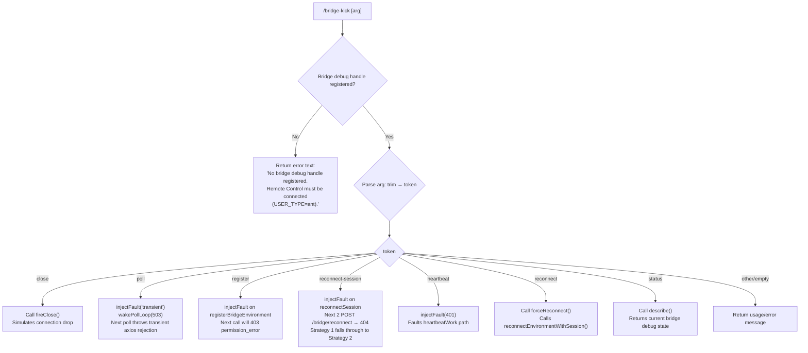

# `/bridge-kick`

> Analysis basis: CC v2.1.168 bundle.js (AST extraction + Claude interpretation)
> Minimum version: v2.1.168

---

## Overview

`/bridge-kick` is a local developer/testing command that injects synthetic Remote Control bridge failures into a live Claude Code session, enabling recovery-path testing without requiring an actual network outage. The command dispatches one of several fault modes — close, poll, register, reconnect-session, heartbeat, reconnect, or status — against an internal bridge debug handle that is only available when the Remote Control subsystem is active (`USER_TYPE=ant`). It is not intended for end-user workflows.

---

## Registration

| Field | Value |
|---|---|
| type | `local` |
| name | `bridge-kick` |
| description | `Inject Remote Control failures for recovery testing` |
| supportsNonInteractive | `false` |
| load_inline | `true` |
| load_ident | `mbf` |
| loc_byte | `12623623` |
| loc_byte_end | `12623802` |
| loc_line | `9074` |
| arbor_handler.name | `mbf` |
| arbor_handler.fqn | `claude-2.1.168::mbf` |
| arbor_handler.kind | `AsyncFunction` |
| arbor_handler.resolution_path | `load_ident` |
| arbor_handler.n_hits | `0` |

Analysis basis: CC v2.1.168 bundle.js:+12623623

The handler was inlined via `load:()=>Promise.resolve({call: mbf})`. Arbor resolved it through the `load_ident` path. `mbf` is the authoritative handler name for all pseudocode and the Appendix table below.

---

## Input Branching

The command accepts a sub-command token as its argument and dispatches across seven distinct fault modes, each with its own side-effect shape. A Mermaid flowchart is used because there are 7+ distinct branches.



Analysis basis: CC v2.1.168 bundle.js:+12621382 through +12623536

---

## Behavioral Spec

### Guard: Bridge Debug Handle Check

Before any fault injection is attempted, `mbf` acquires the bridge debug handle via `getBridgeDebugHandle` (obfuscated: `o9K`).

```
async function bridgeKickHandler(context):
    rawArg = context.userInput
    debugHandle = getBridgeDebugHandle()          // o9K — bundle.js:+12621382

    if debugHandle is null or undefined:
        return {
            type: "text",
            content: "No bridge debug handle registered. Remote Control must be
                      connected (USER_TYPE=ant)."
        }                                         // bundle.js:+12621419

    token = rawArg.trim()                         // bundle.js:+12621518
    dispatch(debugHandle, token)
```

Analysis basis: CC v2.1.168 bundle.js:+12621382, +12621406, +12621419, +12621518

The error string `"No bridge debug handle registered. Remote Control must be connected (USER_TYPE=ant)."` is returned verbatim as a `"text"`-typed message when the guard fails (bundle.js:+12621406, +12621419).

---

### Dispatch: `close` Mode

```
if token == "close":
    debugHandle.fireClose()                       // bundle.js:+12621671
    // Simulates an abrupt connection-level close event on the bridge
```

Analysis basis: CC v2.1.168 bundle.js:+12621554, +12621671

---

### Dispatch: `poll` Mode

```
if token == "poll":
    debugHandle.injectFault("transient")          // bundle.js:+12621800, +12621819
    debugHandle.wakePollLoop("pollForWork", 503)  // bundle.js:+12621841, +12621879, +12621893
    // Confirmation message:
    // "Next poll will throw a transient (axios rejection). Poll loop woken."
    //                                            // bundle.js:+12621929
```

Analysis basis: CC v2.1.168 bundle.js:+12621785, +12621800, +12621819, +12621841, +12621879, +12621893, +12621929

The fault type `"transient"` (bundle.js:+12621800) causes the next `pollForWork` invocation to surface an axios-level rejection. The poll loop is immediately woken so the fault fires promptly rather than waiting for the next scheduled poll interval.

---

### Dispatch: `register` Mode

```
if token == "register":
    debugHandle.injectFault("registerBridgeEnvironment", {
        statusCode: 403,
        errorType: "permission_error"
    })                                            // bundle.js:+12622429, +12622477, +12622491
    // Confirmation:
    // "Next registerBridgeEnvironment will 403. Trigger with close/reconnect."
    //                                            // bundle.js:+12622539
```

Analysis basis: CC v2.1.168 bundle.js:+12622373, +12622429, +12622477, +12622491, +12622539

---

### Dispatch: `reconnect-session` Mode

```
if token == "reconnect-session":
    debugHandle.injectFault("reconnectSession", {
        count: 2,
        statusCode: 404,
        errorType: "not_found_error"
    })                                            // bundle.js:+12622897, +12622848
    // Confirmation:
    // "Next 2 POST /bridge/reconnect calls will 404. doReconnect Strategy 1
    //  falls through to Strategy 2."             // bundle.js:+12622997
```

Analysis basis: CC v2.1.168 bundle.js:+12622848, +12622897, +12622997

The fault count of 2 causes both the primary reconnect attempt and its first retry to fail, exercising the strategy-fallback logic inside the bridge reconnect coordinator. The error codes `404` / `"not_found_error"` are taken from the depth-1 literals at bundle.js:+12622129, +12622133.

---

### Dispatch: `heartbeat` Mode

```
if token == "heartbeat":
    debugHandle.injectFault("heartbeatWork", {
        statusCode: 401
    })                                            // bundle.js:+12623102, +12623132, +12623165
```

Analysis basis: CC v2.1.168 bundle.js:+12623102, +12623132, +12623165

A `401` status injected into the `heartbeatWork` path exercises the authentication-failure recovery branch of the heartbeat subsystem.

---

### Dispatch: `reconnect` Mode

```
if token == "reconnect":
    debugHandle.forceReconnect()                  // bundle.js:+12623379, +12623398
    // Confirmation:
    // "Called reconnectEnvironmentWithSession(). Watch debug.log."
    //                                            // bundle.js:+12623436
```

Analysis basis: CC v2.1.168 bundle.js:+12623379, +12623398, +12623436

Unlike the fault-injection modes, `reconnect` triggers an actual (non-faulted) reconnect sequence, useful for verifying that the nominal reconnect path succeeds after a prior fault scenario has been cleared.

---

### Dispatch: `status` Mode

```
if token == "status":
    result = debugHandle.describe()               // bundle.js:+12623502, +12623536
    return formatStatus(result)
```

Analysis basis: CC v2.1.168 bundle.js:+12623502, +12623536

`describe()` returns a snapshot of the current bridge debug state (pending faults, connection state, etc.) without mutating any state.

---

### Number Parsing (Argument Coercion)

The handler converts the raw argument string to a number at one point in its flow to validate numeric sub-arguments:

```
numericValue = Number(rawArg)                     // bundle.js:+12621569
if not Number.isFinite(numericValue):             // bundle.js:+12621583
    // treat as string token for named-mode dispatch
```

Analysis basis: CC v2.1.168 bundle.js:+12621569, +12621583

This coercion enables future numeric fault parameters while falling back cleanly to string-based dispatch for all current named modes.

---

## State & Side Effects

| Item | Detail |
|---|---|
| Telemetry | `tengu_feature_sad` (bundle.js:+1011093) — fired via the `o6` → `l` call path; indicates a degraded-feature signal |
| Bridge debug handle | Read-only acquisition via `getBridgeDebugHandle` (`o9K`); null when Remote Control is not active |
| Fault injection | Writes pending-fault state into the bridge debug handle for `poll`, `register`, `reconnect-session`, and `heartbeat` modes |
| Connection state | `close` mode fires an immediate connection close; `reconnect` mode initiates a live reconnect sequence |
| appState changes | None observed in depth-2 traversal |
| Sound | None observed in depth-2 traversal |
| Log output | `reconnect` mode directs operator to watch `debug.log` (bundle.js:+12623436) |
| Hook registration | `j9` → `NPA.register` (bundle.js:+60369) is reached via the logging subsystem (`_iK`), not directly from `/bridge-kick` logic |

---

## Version History

| Version | Change |
|---|---|
| v2.1.168 | Initial analysis |

---

## Common Mistakes

1. **Running without Remote Control active**: The command silently returns an error if no bridge debug handle is registered. The session must be running with `USER_TYPE=ant` and Remote Control connected; otherwise every sub-command fails with the guard error (bundle.js:+12621419).
2. **Confusing `reconnect` with `reconnect-session`**: `reconnect-session` injects a *fault* (two 404 responses) to test strategy fallback; `reconnect` triggers a genuine reconnect without any fault. Using the wrong one gives misleading test results.
3. **Expecting `poll` faults to fire immediately without wakeup**: The fault is coupled with an explicit `wakePollLoop` call (bundle.js:+12621893), so the fault fires on the *next* poll. If `wakePollLoop` is not reached (e.g., due to handle being null), the fault is queued but may not surface for a full poll interval.
4. **Calling `/bridge-kick status` to clear faults**: `status`/`describe()` is read-only; it reports state but does not clear injected faults.
5. **Passing numeric arguments**: The handler coerces the argument through `Number()` / `Number.isFinite()` (bundle.js:+12621569, +12621583) before string dispatch, so purely numeric inputs will not match any named mode and will fall through to an unknown-token path.

---

## Appendix — Identifier Mapping

> For bundle debugging only. Identifiers change across versions.

| Identifier | Role |
|---|---|
| `mbf` | Main handler — `bridgeKickHandler` (AsyncFunction) |
| `o9K` | `getBridgeDebugHandle` — acquires the bridge debug singleton |
| `v` | Bootstrap/fetch orchestrator reached via call graph |
| `snK` | Log-level or config subsystem helper |
| `IPA` | Inner config accessor (calls `edK`, `HcK`) |
| `RH` | JSON serialisation helper (calls `JSON.stringify`) |
| `G4` | Path / token manipulation utility |
| `K0A` | Array-map helper over `inK` |
| `q` | File unlink / path helper |
| `A` | Lowercase / slice string helper |
| `EUH` | Write-stream dispatcher (calls `nWA`) |
| `nWA` | Low-level write (`H.write`) |
| `_iK` | Transcript / append-log writer |
| `npH` | Async queue / debounce scheduler (uses `setTimeout`, `setImmediate`, `clearTimeout`) |
| `YKH` | Log-file path builder (calls `r76`, `t8`, `R6`) |
| `d6` | Directory or config path resolver |
| `B76` | EISDIR-safe write helper (calls `V8`) |
| `$0A` | Path join helper |
| `ll8` | Atomic file rename helper (stat → rename → unlink via `ny.*`) |
| `HiK` | Append-file writer with mkdir (calls `ny.mkdir`, `ny.appendFile`) |
| `j9` | Hook/listener registrar (calls `NPA.register`) |
| `Y3` | Bootstrap state checker |
| `mj_` | Argument parser (split, trim, indexOf, slice) |
| `lHH` | Known-host set lookup (`o74.has`) |
| `uj` | String sanitiser (`H.replace`) |
| `H9` | Model-string parser (calls `m6H`, `s9`, `FJ`) |
| `m6H` | Model-name decomposer (calls `Q0`, `aqH`, `yA`, `qB`) |
| `Q0` | Model token base extractor |
| `aqH` | Model alias resolver |
| `qB` | Model qualifier parser (startsWith, includes, trim checks) |
| `s9` | Model tier classifier (opusplan, sonnet, haiku, opus, best) |
| `Y2` | Model ID normaliser (calls `R4H`) |
| `h4H` | First-party model checker (`y4H.includes`) |
| `CI` | Model context builder (calls `lM`, `N5`) |
| `DdH` | Model fallback builder (calls `N5`) |
| `bT` | Model endpoint selector (calls `lM`, `N5`, `MA`) |
| `lP1` | Model tier fallback (calls `bT`) |
| `lM` | Provider mapper (calls `MA`) |
| `NH8` | Allowed-model guard (`AKL.includes`) |
| `wdH` | Region resolver (calls `_6`) |
| `FJ` | Full model descriptor builder (calls `s9`, `_G`) |
| `_G` | Model descriptor assembler (calls `GA`, `g6H`, `gYH`, `jdH`, `bT`, `z2`, `lM`, `MA`, `N5`, `CI`) |
| `o6` | Telemetry emitter — fires `tengu_feature_sad` (calls `l`, `J6`) |
| `l` | Telemetry transport |
| `J6` | Telemetry event builder (calls `hm6`) |
| `hm6` | Telemetry payload formatter |

---

Note: index built via Arbor fallback; some signals (telemetry, literals) may be missing — see arbor-fallback.js.