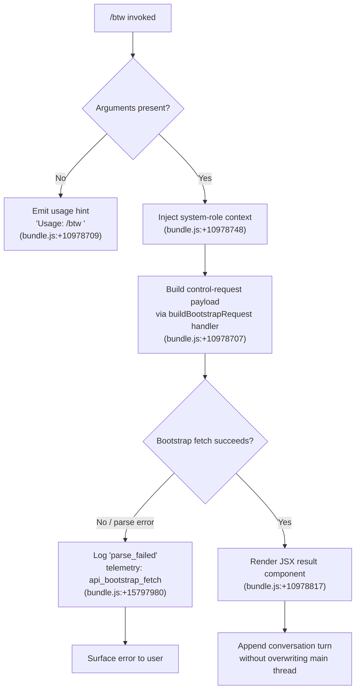

# `/btw`

> Analysis basis: CC v2.1.168 bundle.js (AST extraction + Claude interpretation)
> Minimum version: v2.1.168

---

## Overview

`/btw` ("by the way") lets the user pose a quick side question to the agent without disrupting the flow of the primary conversation. It dispatches the question as a `control-request` and executes immediately (`immediate: true`), ensuring the side query is handled in-band without waiting for an ongoing tool-call cycle to complete. The command renders a JSX component as its result, meaning the response surface can include rich inline UI elements.

---

## Registration

| Field | Value |
|---|---|
| type | `local-jsx` |
| name | `btw` |
| description | `Ask a quick side question without interrupting the main conversation` |
| argumentHint | `<question>` |
| immediate | `true` |
| thinClientDispatch | `control-request` |
| module_id | `Gmq` |
| load_inline | `true` |
| loc_byte | `10979116` |
| loc_byte_end | `10979355` |
| loc_line | `7280` |
| arbor_handler.name | `cDf` |
| arbor_handler.fqn | `claude-2.1.168::cDf` |
| arbor_handler.kind | `AsyncFunction` |
| arbor_handler.resolution_path | `module_id` |
| arbor_handler.n_hits | `0` |

Analysis basis: CC v2.1.168 bundle.js:+10979116

---

## Input Branching

The command has three distinct paths based on whether arguments are present, whether argument parsing succeeds, and whether the dispatch pipeline resolves:



---

## Behavioral Spec

### 1. Argument Validation

```
function validateBtwInput(rawArgs):
    if rawArgs is empty or whitespace only:
        emit usageHint("Usage: /btw <your question>")  // bundle.js:+10978709
        return ABORT
    return rawArgs.trim()
```

Analysis basis: CC v2.1.168 bundle.js:+10978709

---

### 2. Main Handler — `cDf` (AsyncFunction)

The Arbor-resolved handler `cDf` (resolution via `module_id`) is the command's entry point.

```
async function btwCommandHandler(commandInput, appState):
    question = validateBtwInput(commandInput.args)
    if question == ABORT:
        return

    // Inject a system-role framing message to signal this is a side query
    systemMessage = buildSystemMessage("system", question)  // bundle.js:+10978748

    // Delegate to bootstrap-request builder
    requestPayload = buildBootstrapRequest(appState, systemMessage)
    // bundle.js:+10978707 (call edge cDf → H)

    // Dispatch as control-request (thinClientDispatch field)
    response = await dispatchControlRequest(requestPayload)
    // bundle.js:+10978771 (call edge cDf → X8)

    // Render result as JSX element
    uiElement = createElement(resultComponent, response)
    // bundle.js:+10978817 (call edge cDf → j4.createElement)

    return uiElement
```

Analysis basis: CC v2.1.168 bundle.js:+10978707, +10978771, +10978817

---

### 3. Bootstrap Request Construction — `buildBootstrapRequest` (mapped from `H`)

```
function buildBootstrapRequest(appState, systemMessage):
    log("[Bootstrap] Fetching")               // bundle.js:+15797658
    headers = {
        "Content-Type": "application/json",   // bundle.js:+15797743, +15797758
        "User-Agent": <clientVersion>          // bundle.js:+15797777
    }
    cachedValue = requestCache.get(cacheKey)  // bundle.js:+15797694

    if cachedValue present:
        return cachedValue

    // Parse conversation context
    parsedContext = parseConversationContext(appState)  // bundle.js:+15797798 (H → mj_)

    // Check feature-sad suppression set
    if suppressionSet.has(contextKey):         // bundle.js:+15797829 (H → lHH)
        return suppressedResult

    // Normalize and sanitize question text
    sanitizedText = sanitizeInput(parsedContext)  // bundle.js:+15797841 (H → uj)

    // Resolve model alias
    modelConfig = resolveModelConfig(sanitizedText)  // bundle.js:+15797844 (H → H9)

    // Apply timeout guard
    withTimeout(5000, fetchOperation)          // bundle.js:+15797859

    result = performFetch(headers, modelConfig)

    onSuccess:
        log("[Bootstrap] Fetch ok")            // bundle.js:+15798032
        cacheResult(result)

    onParseFailure:
        recordTelemetry("api_bootstrap_fetch", "parse_failed")  // bundle.js:+15797980, +15798002

    return result
```

Analysis basis: CC v2.1.168 bundle.js:+15797656, +15797658, +15797859, +15797980

---

### 4. Context Dispatch & File I/O — `dispatchAndPersist` (mapped from `X8`)

The second top-level call from `cDf` handles context persistence before dispatch.

```
async function dispatchAndPersist(appState, payload):
    currentState = getAppState()              // bundle.js:+3262410
    sessionId    = getSessionId()             // bundle.js:+3262430
    diagnostics  = collectDiagnostics()       // bundle.js:+3262462 (X8 → dlH)
    contextEntries = buildContextEntries()    // bundle.js:+3262481 (X8 → Vo1)
    // Vo1 uses Object.entries internally     // bundle.js:+3263631

    timestamp = timestampedEntry()            // bundle.js:+3262506 (X8 → qK8)
    // qK8 calls Date.now()                   // bundle.js:+3264184

    conversationHistory = readContextFile()   // bundle.js:+3262587 (X8 → LwH)
    // LwH guards with "Config accessed before allowed." check  // bundle.js:+3267536
    // LwH reads UTF-8 file                   // bundle.js:+3267619

    auxiliaryData = loadAuxData()             // bundle.js:+3262603 (X8 → aj6)

    // Attempt to write side-question turn
    writeResult = await persistSideQuery(conversationHistory, payload)
    // bundle.js:+3262853 (X8 → aP_)

    return writeResult
```

Analysis basis: CC v2.1.168 bundle.js:+3262406, +3262587, +3262853

---

### 5. Config Persistence Sub-routine — `saveConfigWithLock` (mapped from `sP_`)

Called during context serialization. Key behaviors:

```
async function saveConfigWithLock(configData):
    ensureDirectoryExists(dirname(configPath))   // bundle.js:+3265298–3265319
    acquireLock():
        if lock takes too long:
            recordTelemetry("tengu_config_lock_contention")  // bundle.js:+3265592
            warn("Lock acquisition took longer than expected...")  // bundle.js:+3265503

    freshConfig = readCurrentConfig()

    // Auth-loss guard (GH #3117)
    if cachedConfigHasAuth AND freshConfigLacksAuth:
        recordTelemetry("tengu_config_auth_loss_prevented")  // bundle.js:+3266071
        warn("saveConfigWithLock: re-read config is missing auth...")  // bundle.js:+3265919
        releaseLock()
        return

    if staleness detected:
        recordTelemetry("tengu_config_stale_write")  // bundle.js:+3265728

    // Atomic write: write to temp, then rename
    writeFileAtomically(configData, permissions=384)  // bundle.js:+3266804
    // Up to 5 backup copies retained         // bundle.js:+3266522
    // Backup suffix pattern: ".backup."      // bundle.js:+3266389
    // Lock timeout guard: 60000 ms           // bundle.js:+3266273
    releaseLock()
```

Analysis basis: CC v2.1.168 bundle.js:+3265503, +3265592, +3265919, +3266071, +3266273

---

### 6. Conversation-Turn Append — `appendConversationTurn` (mapped from `_iK`)

Handles low-level appending of the side query turn to the conversation log.

```
async function appendConversationTurn(sessionDir, turnData):
    outputPath   = buildOutputPath(sessionDir)    // bundle.js:+206107 (_iK → YKH)
    parentDir    = path.dirname(outputPath)       // bundle.js:+206115

    existingSize = Buffer.byteLength(turnData)    // bundle.js:+206290

    // Rotate if file is too large
    if currentFile.size + existingSize > threshold:
        rotateTurnFile()                          // bundle.js:+206284 (_iK → ll8)
        // ll8: renames .txt → timestamped backup  // bundle.js:+205563

    // Write new turn
    await mkdir(parentDir, {recursive: true})     // via HiK → ny.mkdir, bundle.js:+205836
    await appendFile(outputPath, turnData)        // via HiK → ny.appendFile, bundle.js:+205895

    // Register cleanup hook
    registerCleanupHook(outputPath)               // bundle.js:+206445 (_iK → j9)
    // j9 calls NPA.register                      // bundle.js:+60369
```

Analysis basis: CC v2.1.168 bundle.js:+206082, +206107, +206115, +206290, +206445

---

### 7. Model Alias Resolution — `resolveModelAlias` (mapped from `s9`)

```
function resolveModelAlias(rawModelString):
    normalized = rawModelString.trim().toLowerCase()  // bundle.js:+2247412, +2247423

    // Aliases checked in order:
    if normalized contains "opusplan": return opusPlanAlias  // bundle.js:+2247508
    if normalized contains "[1m]":     return extendedContextAlias  // bundle.js:+2247534
    if normalized contains "sonnet":   return sonnetAlias    // bundle.js:+2247549
    if normalized contains "haiku":    return haikuAlias     // bundle.js:+2247588
    if normalized contains "opus":     return opusAlias      // bundle.js:+2247627
    if normalized contains "best":     return bestAlias      // bundle.js:+2247664

    // Provider routing
    routeToProvider(normalized)   // bundle.js:+2247526 (s9 → CI), +2247603 (s9 → DdH)

    return resolvedModel
```

Analysis basis: CC v2.1.168 bundle.js:+2247412, +2247508, +2247549, +2247588

---

### 8. Atomic File Write — `atomicWriteFile` (mapped from `O$6`)

Used by config/context persistence layers.

```
function atomicWriteFile(targetPath, data):
    // Generate a 6-byte hex random suffix for temp file  // bundle.js:+1058130, +1058142
    tempPath = targetPath + "." + randomHex(6)

    // Detect and follow symlinks                          // bundle.js:+1057882
    if lstat(targetPath).isSymbolicLink():
        resolvedTarget = resolveSymlink(targetPath)        // bundle.js:+1057485–1057535
        handle ELOOP, ENOTDIR errors                       // bundle.js:+1057771, +1057784

    fd = fs.openSync(tempPath, flags)                      // bundle.js:+1057644
    fs.writeFileSync(fd, data)                             // bundle.js:+1058550

    // Preserve original file permissions (mode bits)
    originalMode = stat(targetPath).mode & 0o777          // bundle.js:+1058292
    fs.fchmodSync(fd, originalMode)                        // bundle.js:+1058608
    // Log: "Applied original permissions to temp file"    // bundle.js:+1058629
    fs.fsyncSync(fd)                                       // bundle.js:+1058674
    fs.closeSync(fd)                                       // bundle.js:+1057631

    fs.renameSync(tempPath, targetPath)                    // bundle.js:+1058802

    // Cleanup temp on failure
    on error: fs.unlinkSync(tempPath)                      // bundle.js:+1058959
```

Analysis basis: CC v2.1.168 bundle.js:+1057644, +1058550, +1058608, +1058674, +1058802

---

## State & Side Effects

| Item | Detail |
|---|---|
| Telemetry — `tengu_feature_sad` | Fired when a "feature sad" suppression condition is hit during bootstrap (bundle.js:+1011093) |
| Telemetry — `tengu_config_lock_contention` | Fired when config lock acquisition exceeds expected duration (bundle.js:+3265592) |
| Telemetry — `tengu_config_stale_write` | Fired when a stale config write is detected (bundle.js:+3265728) |
| Telemetry — `tengu_config_parse_error` | Fired on config JSON parse failure (bundle.js:+3268167) |
| Telemetry — `tengu_config_auth_loss_prevented` | Fired when an auth-losing write is blocked per GH #3117 (bundle.js:+3266071) |
| Telemetry — `tengu_bg_dispatch_sigkill_escalate` | Fired when background dispatch escalates to SIGKILL (bundle.js:+16197002) |
| Telemetry — `tengu_bg_dispatch_low_mem` | Fired under low-memory pressure in background session manager (bundle.js:+16197603) |
| Telemetry — `tengu_bg_spare_enable` | Fired when a spare background worker is enabled (bundle.js:+16198307) |
| Telemetry — `tengu_bg_spare_claim` | Fired when a spare worker is successfully claimed (bundle.js:+16198435) |
| Telemetry — `tengu_bg_spare_claim_fail` | Fired when spare worker claim fails (bundle.js:+16198701) |
| Telemetry — `tengu_daemon_control` | Fired on daemon stop/control events (bundle.js:+16233972) |
| Telemetry — `tengu_daemon_config_reload` | Fired on daemon config reload (bundle.js:+16212414) |
| Telemetry — `tengu_bg_retire_pinned_low_mem` | Fired when pinned workers are retired under low memory (bundle.js:+16201607) |
| Telemetry — `tengu_bg_prewarm_per_sweep` | Fired each background prewarm sweep (bundle.js:+16201728) |
| Hook registration | `j9` calls `NPA.register` to register a cleanup hook for the appended turn file (bundle.js:+60369) |
| appState changes | Side query turn is appended to the conversation log file without modifying main-thread history |
| File I/O | Config written atomically with 6-byte-hex temp suffix; up to 5 `.backup.` copies retained; lock timeout 60 000 ms (bundle.js:+3266273, +3266389, +3266522, +3266804) |
| thinClientDispatch | Payload routed as `control-request` — bypasses normal user-turn queue |
| immediate | `true` — command fires without waiting for pending tool calls to drain |
| Sound | <!-- TODO: not found in depth-2 traversal; needs --depth 4 --> |

---

## Version History

| Version | Change |
|---|---|
| v2.1.168 | Initial analysis |

---

## Common Mistakes

1. **Omitting the argument entirely.** Running `/btw` with no text causes the handler to emit `Usage: /btw <your question>` and abort. Always supply a non-empty question string.
2. **Expecting the side question to appear in the main conversation history.** `/btw` appends to the conversation log via a separate append path; the main thread's turn sequence is not modified.
3. **Assuming synchronous resolution.** The handler is an `AsyncFunction` (`cDf`). Callers (e.g. integration tests) must await the returned promise; fire-and-forget patterns will lose the JSX result.
4. **Confusing `control-request` with a normal user turn.** The `thinClientDispatch: "control-request"` field routes the question outside the standard user-message queue, so the agent may answer out of visual order in thin-client environments.
5. **Assuming model selection is irrelevant.** The bootstrap request builder resolves a model alias (opusplan, sonnet, haiku, opus, best, extended-context) from the current `appState`; a misconfigured model alias will fall through to provider routing and may use an unintended backend.

---

## Appendix — Identifier Mapping

> For bundle debugging only. Identifiers change across versions.

| Identifier | Role |
|---|---|
| `cDf` | Main async handler for `/btw` command (Arbor-resolved, AsyncFunction) |
| `H` | Bootstrap request builder / fetch orchestrator |
| `v` | Input normalization / conversation-context builder |
| `snK` | Sub-normalizer called from `v` |
| `IPA` | Inner parse helper called from `snK` |
| `RH` | JSON serializer helper (calls JSON.stringify) |
| `G4` | Path/extension utility (calls lastIndexOf, slice) |
| `K0A` | Array mapper over input entries |
| `EUH` | Write flusher (calls `nWA` → H.write) |
| `nWA` | Low-level stream write wrapper |
| `_iK` | Conversation-turn append orchestrator |
| `npH` | Debounced write scheduler (uses clearTimeout / setTimeout / setImmediate) |
| `YKH` | Output-path builder |
| `d6` | Directory/path utility (referenced widely) |
| `B76` | Internal utility called by `_iK` and `HiK` |
| `$0A` | Path-join helper using `IHH.join` and `R6` |
| `ll8` | Turn-file rotation handler (stat, endsWith `.txt`, rename, unlink) |
| `HiK` | Directory-create + file-append writer |
| `j9` | Cleanup hook registrar (calls `NPA.register`) |
| `mj_` | Conversation-context string splitter/trimmer |
| `lHH` | Feature-suppression set checker |
| `uj` | Text sanitizer (calls H.replace) |
| `H9` | Model config resolver entry point |
| `m6H` | Model configuration builder |
| `qB` | Model-string parser |
| `s9` | Model alias normalizer |
| `Y2` | Model alias lookup (calls `R4H`) |
| `h4H` | Provider list membership check |
| `CI` | Provider router (calls `lM`, `N5`) |
| `DdH` | Alternate provider router (calls `N5`) |
| `bT` | Firstparty provider handler |
| `lP1` | Wrapper delegating to `bT` |
| `lM` | Provider resolver base (calls `MA`) |
| `NH8` | Provider inclusion list checker |
| `wdH` | Provider fallback handler (calls `_6`) |
| `FJ` | Full model-resolution pipeline |
| `_G` | Model descriptor aggregator |
| `o6` | Feature-sad event emitter |
| `l` | Logging / console utility |
| `J6` | Secondary logger (calls `hm6`) |
| `hm6` | Low-level log sink |
| `X8` | Dispatch-and-persist orchestrator |
| `sP_` | `saveConfigWithLock` — atomic config writer with auth-loss guard |
| `L` | File-set manager (add/delete/finally) |
| `f` | Resource handle manager (close operations) |
| `R21` | Config merge helper (calls `QM_`, `Object.assign`) |
| `QM_` | Config schema normalizer (calls `S21`) |
| `V8` | Error classifier / EISDIR handler |
| `LwH` | Context-file reader with parse/backup logic |
| `U6` | JSON parse wrapper |
| `Hu` | String prefix stripper (startsWith/slice) |
| `No1` | Directory walker for context file lookup |
| `tP_` | Path join + timestamp helper |
| `w` | Background session manager / worker pool |
| `aj6` | Auxiliary data loader |
| `V` | Scrollable view / viewport component |
| `P` | Terminal UI / prompt input component |
| `J` | Worker accessor wrapper |
| `j` | Worker kill helper |
| `z` | Daemon state machine |
| `Y` | Supervisor / daemon runner |
| `h` | Background worker health sweeper |
| `EOA` | Vim-mode action registry |
| `C` | Request executor (enqueue + randomUUID) |
| `E` | Worker instance (start/stop/updateConfig) |
| `O$6` | Atomic file write utility |
| `O` | fs-stat wrapper (isSymbolicLink) |
| `h8` | EISDIR-safe error thrower |
| `dlH` | Diagnostic collector |
| `Vo1` | Context-entry builder (uses Object.entries) |
| `qK8` | Timestamped entry builder (uses Date.now) |
| `aP_` | Side-query write helper |

---

Note: index built via Arbor fallback; some signals (telemetry, literals) may be missing — see arbor-fallback.js.