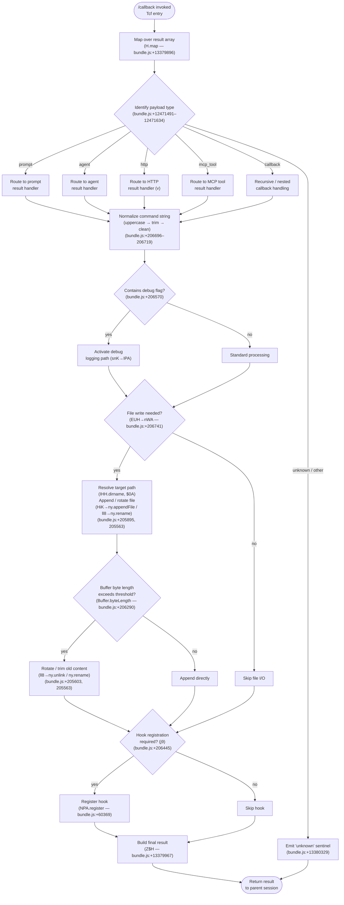

# `/callback`

> Analysis basis: CC v2.1.168 bundle.js (AST extraction + Claude interpretation)
> Minimum version: v2.1.168

---

## Overview

The `/callback` command is an internal slash-command of type `callback` that receives and processes the return value of a previously dispatched operation (such as a `prompt`, `agent`, `http`, or `mcp_tool` invocation). It does not expose a user-facing description and is not intended to be typed manually; instead it is invoked programmatically by the CLI runtime when a dispatched sub-operation completes and needs to deliver its result back into the command pipeline. The handler (`Tcf`) maps over the result collection, resolves file-write side effects, and registers any follow-on hooks before returning control to the parent session context.

---

## Registration

| Field | Value |
|---|---|
| type | `callback` |
| name | `callback` |
| description | `null` |
| loc_byte | `13380283` |
| loc_byte_end | `13380316` |
| loc_line | `10710` |
| arbor_handler.name | `Tcf` |
| arbor_handler.fqn | `claude-2.1.168::Tcf` |
| arbor_handler.kind | `Function` |
| arbor_handler.resolution_path | `direct` |
| arbor_handler.n_hits | `1` |

Analysis basis: CC v2.1.168 bundle.js:+13380283

---

## Input Branching

The handler touches more than three distinct branching paths across its call graph: it distinguishes the type of the incoming callback payload (at least `prompt`, `agent`, `http`, `mcp_tool`, `callback`, and `unknown`), decides whether to perform a file-write, and conditionally registers a follow-on hook. A Mermaid flowchart is used.



---

## Behavioral Spec

### 1 — Entry Point and Result Mapping (`Tcf` / `handlerMain`)

The Arbor-resolved handler `Tcf` is the sole entry point for the `/callback` command. On invocation it immediately calls `resultCollection.map(…)` to iterate over each item in the callback payload array.

```
function handlerMain(resultCollection, context):
    mappedResults = resultCollection.map(item =>
        processCallbackItem(item, context)
    )
    finalResult = buildFinalResult(mappedResults)   // Z$H
    return finalResult
```

Analysis basis: CC v2.1.168 bundle.js:+13379896, +13379967

---

### 2 — Payload Type Dispatch (`v` / `dispatchByType`)

Each item in the result collection carries a `type` discriminant. The dispatcher checks the type string against the known set of values: `"prompt"`, `"agent"`, `"http"`, `"mcp_tool"`, `"callback"`, and `"unknown"`. When the type is unrecognised, the literal `"unknown"` is emitted as the result sentinel.

```
function dispatchByType(item, context):
    switch item.type:
        case "prompt":   return handlePromptResult(item, context)
        case "agent":    return handleAgentResult(item, context)
        case "http":     return handleHttpResult(item, context)   // RH→JSON.stringify
        case "mcp_tool": return handleMcpToolResult(item, context)
        case "callback": return handleNestedCallback(item, context)
        default:         return { type: "unknown" }
```

Analysis basis: CC v2.1.168 bundle.js:+12471491, +12471520, +12471548, +12471572, +12471634, +13380329

---

### 3 — HTTP Result Serialisation (`RH` / `httpResultSerializer`)

When the payload type is `"http"`, the result body is passed through `JSON.stringify` before being returned. No additional transformation beyond serialisation is applied at this layer.

```
function httpResultSerializer(item):
    return JSON.stringify(item.body)
```

Analysis basis: CC v2.1.168 bundle.js:+185264

---

### 4 — Command String Normalisation (`v` inline / `normaliseCommandString`)

After type dispatch the command string associated with the item is normalised through three sequential operations:

1. Convert to upper-case (`_.toUpperCase`).
2. Trim surrounding whitespace (`H.trim`).
3. Pass through path-extension cleaner `G4` which: maps known extensions via `K0A`, performs a `replace` on the raw string, looks up the last character via `q.at`, finds the last index separator via `A.lastIndexOf`, and slices the result.

```
function normaliseCommandString(raw):
    upper   = raw.toUpperCase()
    trimmed = upper.trim()
    cleaned = cleanPathExtension(trimmed)   // G4
    return cleaned
```

Analysis basis: CC v2.1.168 bundle.js:+206696, +206716, +206719, +198173, +198200, +198310, +198336, +198362

The string `"[REDACTED]"` appears as a replacement literal inside `G4` at bundle.js:+198252 (used when a path segment must be suppressed in output). The numeric constant `2` at bundle.js:+198281 governs a slice offset within that function.

---

### 5 — Debug-Mode Branch (`snK` / `debugModeHandler`)

When the normalised command string contains the flag value `"debug"` (bundle.js:+206570), the handler activates a debug logging sub-path via `snK`. Inside `snK`, the numeric constant `1` (bundle.js:+205186) indexes the first element of an argument list, and `IPA` is called to prepend logging context. `IPA` in turn invokes `edK` and `HcK` (bundle.js:+61502, +61516).

```
function debugModeHandler(commandString, args):
    if commandString.includes("debug"):
        firstArg = args[1]                  // literal 1 at +205186
        loggingCtx = buildLoggingContext()  // IPA → edK, HcK
        return withDebugContext(firstArg, loggingCtx)
    return withoutDebugContext(args)
```

Analysis basis: CC v2.1.168 bundle.js:+206570, +205174, +205288, +205301, +61502, +61516

---

### 6 — File Write and Rotation (`_iK` / `fileWriteOrchestrator`)

The file-write path is the most complex sub-feature. It is entered when the callback result must be persisted to disk (e.g. transcript append or log rotation).

**Sub-steps:**

1. **Resolve target directory** — `IHH.dirname` resolves the directory component; `$0A` joins the final path using `IHH.join` and `R6`.
2. **Stat the file** — `ll8` calls `ny.stat`; if the path ends with `".txt"` (bundle.js:+205511) it slices 4 characters (literal `4`, bundle.js:+205533) from the name, then conditionally renames via `ny.rename` or unlinks via `ny.unlink`.
3. **Measure byte length** — `Buffer.byteLength` determines current file size.
4. **Append or rotate** — `HiK` first ensures the directory exists (`ny.mkdir`), then appends content (`ny.appendFile`). If the byte length after appending exceeds the internal threshold, `ll8` triggers rotation and `ny.unlink` removes the old file.
5. **Flush buffer** — `npH` manages a write-queue using `clearTimeout`, `setTimeout` (delay: numeric constants `1000` at bundle.js:+59671 and `100` at bundle.js:+59692), `setImmediate`, and array joins (`$.join`, `L.join`, `J.join`). It drains via `H.write` through `nWA`.

```
function fileWriteOrchestrator(payload, context):
    dir      = path.dirname(context.basePath)       // IHH.dirname
    filePath = path.join(dir, resolveFileName())    // $0A → IHH.join, R6
    stat     = fs.stat(filePath)                    // ll8 → ny.stat
    if filePath.endsWith(".txt"):
        filePath = filePath.slice(0, -4)            // literal 4
    size = Buffer.byteLength(pendingContent)
    if size > threshold:
        rotateFile(filePath)                        // ll8 → ny.rename / ny.unlink
    else:
        ensureDir(dir)                              // HiK → ny.mkdir
        fs.appendFile(filePath, pendingContent)     // ny.appendFile
    flushWriteQueue(filePath)                       // npH: clearTimeout / setTimeout / setImmediate
```

Analysis basis: CC v2.1.168 bundle.js:+206082, +206107, +206115, +206145, +206235, +206252, +206284, +206290, +206323, +206340, +206349, +205767, +205836, +205895, +205927, +205944, +205982, +205988, +206021, +205407, +205500, +205522, +205563, +205591, +205603

The `"EISDIR"` error code (bundle.js:+175692) is caught inside `B76` / `directoryErrorGuard` to silently skip writes that would land on a directory instead of a regular file.

---

### 7 — Write-Queue Flush (`npH` / `writeQueueFlusher`)

The write queue coalesces multiple small writes into batched flushes:

```
function writeQueueFlusher(filePath, content):
    clearTimeout(pendingTimer)
    pendingBuffer.push(content)               // $.push
    delay = computeDelay(pendingBuffer)       // 1000ms base, 100ms fast path
    pendingTimer = setTimeout(() => {
        batch = pendingBuffer.join("")        // $.join
        lines = batch.split("\n")            // L.join, J.join
        handle.write(batch)                  // H.write → nWA
        setImmediate(drainRemaining)
        longLines.push(...)                  // L.push
        processChunk(D, w, Y)
    }, delay)
```

Analysis basis: CC v2.1.168 bundle.js:+59783, +59824, +59855, +59857, +59901, +59922, +59947, +59982, +60040, +60080, +60131, +60153, +60175, +60198, +59671, +59692

---

### 8 — Hook Registration (`j9` / `hookRegistrar`)

After file I/O completes, `j9` conditionally calls `NPA.register(…)` to install a follow-on hook. This allows downstream commands (e.g. a subsequent `prompt` or `agent` step) to be notified when the callback result has been fully written.

```
function hookRegistrar(context):
    if context.requiresHook:
        NPA.register(context.hookDescriptor)
```

Analysis basis: CC v2.1.168 bundle.js:+206445, +60369

---

### 9 — Bootstrap Fetch Sub-path (`H` / `bootstrapFetcher`)

A secondary call chain reachable from `Tcf` via `H.map` leads into a bootstrap HTTP fetch path. This path logs `"[Bootstrap] Fetching"` (bundle.js:+15797658), sets headers `Content-Type: application/json` (bundle.js:+15797758) and `User-Agent` (bundle.js:+15797777), calls `qA.get`, applies a 5000 ms timeout (literal `5000`, bundle.js:+15797859), and emits telemetry event `api_bootstrap_fetch` on completion or `parse_failed` on JSON parse error.

```
function bootstrapFetcher(url):
    log("[Bootstrap] Fetching", url)
    response = http.get(url, {
        headers: {
            "Content-Type": "application/json",
            "User-Agent":   userAgentString
        },
        timeout: 5000
    })
    if parseError:
        emitTelemetry("api_bootstrap_fetch", { status: "parse_failed" })
        return null
    log("[Bootstrap] Fetch ok")
    return parsedBody
```

Analysis basis: CC v2.1.168 bundle.js:+15797656, +15797658, +15797694, +15797743, +15797758, +15797777, +15797829, +15797841, +15797859, +15797868, +15797977, +15797980, +15798002, +15798032

---

### 10 — Model Alias Resolution (`H9` / `s9` / `modelAliasResolver`)

The call graph also reaches a model-name normalisation chain. Input model strings are lowercased, trimmed, and matched against known aliases: `"opusplan"`, `"[1m]"`, `"sonnet"`, `"haiku"`, `"opus"`, `"best"`. Provider prefixes `"anthropic."`, `"anthropicAws"`, `"gateway"`, and `"mantle"` are recognised. `"firstParty"` marks first-party model entries.

```
function modelAliasResolver(rawName):
    name = rawName.trim().toLowerCase()
    name = applyAliasMap(name)            // Y2 → R4H
    name = stripProviderPrefix(name)      // h4H checks y4H.includes
    tier = classifyTier(name)             // CI, DdH, bT, lP1, lM
    return { resolvedName: name, tier }
```

Analysis basis: CC v2.1.168 bundle.js:+2247412, +2247423, +2247441, +2247451, +2247487, +2247508, +2247526, +2247534, +2247549, +2247588, +2247603, +2247627, +2247641, +2247664, +2247678, +2247696, +2247702, +2247710, +2247754, +2241469, +2243716, +2101625, +2101645, +2244357

---

### 11 — Error / Feature Sadness Telemetry (`o6` / `featureErrorHandler`)

`o6` is reachable from the top-level map chain and fires the `tengu_feature_sad` telemetry event on certain error conditions. It also calls `J6` → `hm6` for low-level error formatting, and `l` for locale-aware message construction. The GitHub issues URL `https://github.com/anthropics/claude-code/issues` (bundle.js:+3961) and the documentation URL `https://code.claude.com/docs/en/overview` (bundle.js:+3883) are referenced in error messages at this layer.

```
function featureErrorHandler(err, context):
    emit("tengu_feature_sad", { feature: "callback", error: err.code })
    message = formatError(err)           // J6 → hm6
    localised = localise(message)        // l
    if isUnrecoverable(err):
        suggest("report the issue at https://github.com/anthropics/claude-code/issues")
    return { error: localised }
```

Analysis basis: CC v2.1.168 bundle.js:+1011091, +1011093, +1011127, +3628, +3761, +3883, +3961

---

## State & Side Effects

| Item | Detail |
|---|---|
| Telemetry | `tengu_feature_sad` (bundle.js:+1011093) — fired when an unrecoverable feature error is encountered inside `o6` |
| Telemetry | `api_bootstrap_fetch` with sub-status `parse_failed` or success (bundle.js:+15797980) — fired from the bootstrap fetcher sub-path `o6` / `H` |
| File I/O | `ny.appendFile`, `ny.rename`, `ny.unlink`, `ny.mkdir`, `ny.stat` — triggered by `_iK` / `HiK` / `ll8` when a result must be persisted |
| File I/O | Write queue coalesced via `npH` using `setTimeout` (1000 ms / 100 ms) and `setImmediate` |
| Hook registration | `NPA.register(…)` called by `j9` when `context.requiresHook` is truthy (bundle.js:+60369) |
| appState changes | <!-- TODO: not found in depth-2 traversal; needs --depth 4 --> |
| Sound | <!-- TODO: not found in depth-2 traversal; needs --depth 4 --> |
| Network | HTTP GET with `Content-Type: application/json`, `User-Agent` header, 5000 ms timeout (bundle.js:+15797859) via bootstrap fetcher |
| Error surfacing | `"EISDIR"` suppressed silently (bundle.js:+175692); other errors forwarded to `tengu_feature_sad` |

---

## Version History

| Version | Change |
|---|---|
| v2.1.168 | Initial analysis — `callback` command registered at bundle.js:+13380283; handler `Tcf` resolved via Arbor direct path |

---

## Common Mistakes

1. **Typing `/callback` manually** — this command has `description: null` and is not surfaced in the help menu. It is dispatched programmatically by the runtime; invoking it from the REPL will produce no useful output.
2. **Expecting a prompt body** — `/callback` is of type `callback`, not `prompt`. It does not send instructions to the agent; it only processes a result already returned by a prior operation.
3. **Assuming synchronous file writes** — the write queue in `npH` batches output with up to a 1000 ms delay. Monitoring the output file immediately after the command completes may show incomplete data.
4. **Conflating with the `unknown` sentinel** — if the dispatched payload carries an unrecognised type, the command silently returns `{ type: "unknown" }` (bundle.js:+13380329) rather than raising an error. Callers should check the returned type discriminant.
5. **Ignoring `"EISDIR"` suppression** — writes targeting a path that resolves to a directory are silently skipped (bundle.js:+175692). This can cause data loss if the output path is misconfigured.
6. **Overlooking the 5000 ms bootstrap timeout** — the bootstrap HTTP fetch sub-path will time out silently after 5 seconds (bundle.js:+15797859); if a callback result depends on a remote resource, it may arrive as `null`.

---

## Appendix — Identifier Mapping

> For bundle debugging only. Identifiers change across versions.

| Identifier | Role |
|---|---|
| `Tcf` | Main handler function for `/callback` (Arbor-resolved, direct) |
| `H` | Bootstrap fetcher / result collection map host |
| `v` | Per-item callback dispatcher (type-switches on payload) |
| `snK` | Debug-mode handler (activates debug logging path) |
| `IPA` | Logging context builder (called within debug path) |
| `RH` | HTTP result serialiser (calls `JSON.stringify`) |
| `G4` | Path/extension cleaner (normalises command string) |
| `K0A` | Extension mapping table builder (maps known extensions) |
| `q` | File unlink helper (calls `opK.unlinkSync`) |
| `A` | Lowercase path normaliser (calls `f.toLowerCase`) |
| `EUH` | File-write dispatcher (routes to `nWA` write helper) |
| `nWA` | Low-level write executor (calls `H.write`) |
| `_iK` | File-write orchestrator (top-level I/O coordinator) |
| `npH` | Write-queue flusher (setTimeout/setImmediate coalescer) |
| `YKH` | Path join helper used inside write orchestrator |
| `d6` | Auxiliary context resolver within `_iK` |
| `B76` | Directory-error guard (catches `EISDIR`) |
| `$0A` | File path joiner (`IHH.join` + `R6`) |
| `ll8` | File stat / rotate helper (`ny.stat`, `ny.rename`, `ny.unlink`) |
| `HiK` | Append-with-mkdir helper (`ny.mkdir` + `ny.appendFile`) |
| `j9` | Hook registrar (calls `NPA.register`) |
| `Y3` | Auxiliary fetch helper inside bootstrap path |
| `mj_` | Query-string / argument parser (`split`, `trim`, `indexOf`, `slice`) |
| `lHH` | Seen-set membership checker (`o74.has`) |
| `uj` | String replacement utility (`H.replace`) |
| `H9` | Model alias resolver entry point |
| `m6H` | Model classification dispatcher |
| `Q0` | Sub-classifier within model chain |
| `aqH` | Auxiliary model attribute helper |
| `qB` | Full model-name parser (trim, map, startsWith, includes) |
| `s9` | Core model string normaliser (lowercase, alias, tier) |
| `Y2` | Alias map lookup (calls `R4H`) |
| `h4H` | Provider-prefix checker (`y4H.includes`) |
| `CI` | Tier classifier A (calls `lM`, `N5`) |
| `DdH` | Tier classifier B (calls `N5`) |
| `bT` | Tier classifier C (calls `lM`, `N5`, `MA`) |
| `lP1` | Tier classifier D (delegates to `bT`) |
| `lM` | Base tier resolver (calls `MA`) |
| `NH8` | Allowlist membership checker (`AKL.includes`) |
| `wdH` | Replacement helper within model normaliser (calls `_6`) |
| `FJ` | Composed model resolver (calls `s9` + `_G`) |
| `_G` | Multi-path model finaliser (calls `GA`, `g6H`, `gYH`, `jdH`, `bT`, `z2`, `lM`, `MA`, `N5`, `CI`) |
| `o6` | Feature error handler (fires `tengu_feature_sad`) |
| `l` | Locale-aware message constructor |
| `J6` | Error formatter (calls `hm6`) |
| `hm6` | Low-level error detail builder |
| `Z$H` | Final result builder (assembles return value from mapped results) |

---

Note: index built via Arbor fallback; some signals (telemetry, literals) may be missing — see arbor-fallback.js.