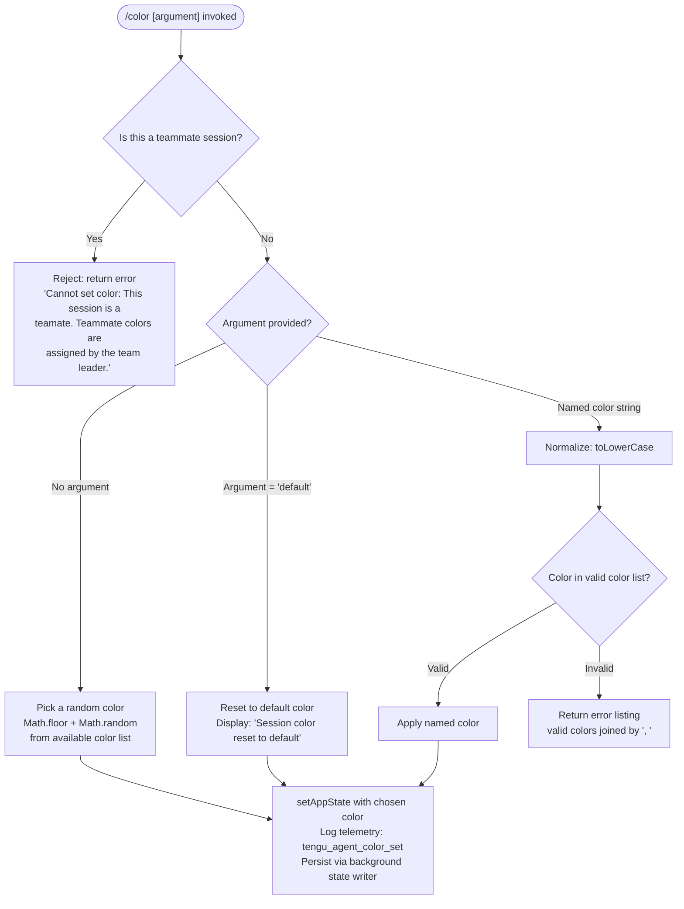

# `/color`

> Analysis basis: CC v2.1.167 bundle.js (AST extraction + Claude interpretation)
> Minimum version: v2.1.167

---

## Overview

The `/color` command sets the prompt bar color for the current Claude Code session. It accepts a named color or the special keyword `default` to reset to the default appearance. When invoked in a teammate session, the command rejects the request because teammate colors are managed exclusively by the team leader.

---

## Registration

| Field | Value |
|---|---|
| type | `local-jsx` |
| name | `color` |
| description | `Set the prompt bar color for this session` |
| argumentHint | `null` |
| immediate | `true` |
| module_id | `Lpq` |
| load_inline | `true` |
| loc_byte | `11022554` |
| loc_byte_end | `11022771` |
| loc_line | `7301` |
| arbor_handler.name | `hwf` |
| arbor_handler.fqn | `claude-2.1.167::hwf` |
| arbor_handler.kind | `AsyncFunction` |
| arbor_handler.resolution_path | `module_id` |
| arbor_handler.n_hits | `0` |

Analysis basis: CC v2.1.167 bundle.js:+11022554

---

## Input Branching

Four distinct input paths are covered by this command (teammate guard, random color, named color, and default/reset), requiring a Mermaid flowchart.



Analysis basis: CC v2.1.167 bundle.js:+11021393, +11021533, +11021570, +11021588, +11021634, +11021716, +11021732, +11021774, +11021793, +11021922, +11021993

---

## Behavioral Spec

### Guard: Teammate Session Check

Before any color logic runs, the handler `hwf` delegates to a session-context resolver (mapped to `resolveSessionContext`) to determine whether the current session belongs to a teammate.

```
async function colorCommandHandler(input, appState):
    sessionContext = resolveSessionContext()        // hwf → H (bundle.js:+11021324)
    if sessionContext.isTeammateSession:
        return errorResult(
            "Cannot set color: This session is a teammate. " +
            "Teammate colors are assigned by the team leader."
        )                                           // bundle.js:+11021404
    return colorSelectionHandler(input, appState)  // hwf → wh8 (bundle.js:+11021332)
```

Analysis basis: CC v2.1.167 bundle.js:+11021324, +11021332, +11021404

---

### Color Selection Logic

The main color selection logic lives in the handler mapped to `colorSelectionHandler` (`wh8`).

```
async function colorSelectionHandler(input, appState):
    argument = input.trim()

    // Step 1: Determine target color
    if argument is empty:
        // Pick a random color from the available list
        colorList = getAvailableColors()            // Yh8 + Object.keys (bundle.js:+11021793, +11021097)
        index = Math.floor(Math.random() * colorList.length)
                                                    // bundle.js:+11021533, +11021544
        chosenColor = colorList[index]

    else if argument.toLowerCase() == "default":   // bundle.js:+11021732
        chosenColor = "default"
        displayMessage = "Session color reset to default"
                                                    // bundle.js:+11021993

    else:
        normalized = argument.toLowerCase()         // bundle.js:+11021570
        if not validColorList.includes(normalized): // bundle.js:+11021588
            validNames = validColorList.join(", ")  // bundle.js:+11021634, +11021642
            return errorResult("Invalid color. Valid colors: " + validNames)
        chosenColor = normalized

    // Step 2: Apply color to appState
    appState.setAppState({ promptBarColor: chosenColor })
                                                    // _.setAppState (bundle.js:+11021774)

    // Step 3: Persist color via background state writer
    persistColorToBackgroundState(chosenColor)      // cf8 (bundle.js:+11021922)

    // Step 4: Build and return JSX result component
    return buildColorResultComponent(chosenColor)   // Swf (bundle.js:+11021984)
```

Analysis basis: CC v2.1.167 bundle.js:+11021533, +11021544, +11021570, +11021588, +11021634, +11021716, +11021732, +11021774, +11021793, +11021922, +11021984

---

### Available Color Enumeration

The function mapped to `getAvailableColors` (`Yh8`) calls `Object.keys` on a static color-map object to obtain the list of valid named colors.

```
function getAvailableColors():
    return Object.keys(colorMapObject)    // bundle.js:+11021097
```

The result feeds both random selection (no-argument path) and validation (named-argument path).

Analysis basis: CC v2.1.167 bundle.js:+11021097, +11021793

---

### Color Result Component Construction

The function mapped to `buildColorResultComponent` (`Swf`) produces the JSX element rendered in the terminal after a successful color change.

```
function buildColorResultComponent(chosenColor):
    label = formatColorLabel(chosenColor)           // TE (bundle.js:+11022077)
    preview = buildColorPreview(chosenColor)        // pt (bundle.js:+11022118)
    if chosenColor == "default":
        return Promise.resolve(defaultResetDisplay) // bundle.js:+11022123
    uiWidget = buildInteractiveWidget(chosenColor)  // iWH (bundle.js:+11022153)
    confirmation = buildConfirmationElement(...)    // q (bundle.js:+11022205)
    footer = buildFooterElement(...)                // q9H (bundle.js:+11022223)
    return assembledJSXResult
```

Analysis basis: CC v2.1.167 bundle.js:+11022077, +11022118, +11022123, +11022153, +11022205, +11022223

---

### Background State Persistence

The function mapped to `persistColorToBackgroundState` (`cf8`) coordinates reading/writing the persistent background state store. It uses an async job queue with file I/O operations to safely persist the chosen color.

```
async function persistColorToBackgroundState(chosenColor):
    stateFilePath = buildStateFilePath(...)         // RK + sT (bundle.js:+4169779)
    currentState  = await readBackgroundState(...)  // e9 (bundle.js:+4169793)
    currentState["agent-color"] = chosenColor       // literal (bundle.js:+13237294)
    await writeBackgroundStateAtomic(currentState)  // zf (bundle.js:+4169896)
    invalidateCaches()                              // oj (bundle.js:+4169838)
    notifyStateChange()                             // fz (bundle.js:+4169980)
    logTelemetry("tengu_agent_color_set")           // Fh6 (bundle.js:+11021763, +13237378)
```

The atomic write path (`XY`) uses `randomBytes` for a temporary filename, writes to the temp file, then renames it into place — ensuring crash-safe persistence.

Analysis basis: CC v2.1.167 bundle.js:+4169779, +4169793, +4169838, +4169896, +4169974, +4169980, +13237294, +13237378

---

### Telemetry Logging Path

Telemetry emission occurs through `Fh6` → `Zv` → logging infrastructure (`Q$H`). The log entry carries the key `"agent-color"` (bundle.js:+13237294) and is appended to a log file via `appendFileSync` (bundle.js:+13233130). Directory creation (`mkdirSync`) is attempted if required (bundle.js:+13233169).

```
function emitColorTelemetry(colorValue):
    entry = buildLogEntry("agent-color", colorValue)   // Zv (bundle.js:+13237273)
    appendLogEntry(entry)                              // Q$H (bundle.js:+13237282)
    registerHook()                                     // r4 → j9 → VPA.register (bundle.js:+13237344)
    emit("tengu_agent_color_set")                      // bundle.js:+13237378
```

Analysis basis: CC v2.1.167 bundle.js:+13237273, +13237282, +13237294, +13237344, +13237378

---

## State & Side Effects

| Item | Detail |
|---|---|
| Telemetry | `tengu_agent_color_set` (bundle.js:+13237378); `tengu_bg_state_read_transient` (bundle.js:+4167723) |
| appState changes | `setAppState` called with updated prompt-bar color (bundle.js:+11021774); `getAppState` read to verify current state (bundle.js:+11021817) |
| Background state persistence | Atomic file write via temp-file + rename pattern using `randomBytes`, `writeFile`, `rename` (bundle.js:+2287893, +2287940, +2287994) |
| Hook registration | `VPA.register` called via `j9` after telemetry log append (bundle.js:+60369) |
| File I/O | `appendFileSync` for log entries (bundle.js:+13233130); `mkdirSync` to ensure log directory exists (bundle.js:+13233169); `readFile` (utf-8) to load current state (bundle.js:+4167923, +4167937); `unlink` for cleanup (bundle.js:+2288123) |
| Cache invalidation | `R7H.delete`, `OjH.delete`, `R7H.clear` called during state refresh cycle (bundle.js:+4167527, +4167541, +4168406) |
| Error logging | `pr.logError` called on background state error paths (bundle.js:+1016712) |
| Sound | <!-- TODO: not found in depth-2 traversal; needs --depth 4 --> |

---

## Version History

| Version | Change |
|---|---|
| v2.1.167 | Initial analysis |

---

## Common Mistakes

1. **Using `/color` in a teammate session** — the command will be rejected with the error "Cannot set color: This session is a teammate. Teammate colors are assigned by the team leader." (bundle.js:+11021404). There is no workaround from within the teammate session itself.
2. **Supplying an unrecognised color name** — the argument is validated against `Object.keys` of the internal color map after `toLowerCase` normalization (bundle.js:+11021570, +11021588). Misspellings or hex values are not accepted; the command will return a list of valid names separated by `", "` (bundle.js:+11021642).
3. **Expecting persistence across CLI restarts without background state** — the color is persisted through the background state store via an atomic write. If the background state directory is unwritable, the in-memory `setAppState` change still occurs for the current session but the color will not survive restart.
4. **Omitting the argument expecting a prompt** — `/color` with no argument does **not** prompt the user; it immediately selects a random color from the available palette (bundle.js:+11021533, +11021544).
5. **Case sensitivity** — the argument is normalised via `toLowerCase` before matching (bundle.js:+11021570), so `Red`, `RED`, and `red` are treated identically. However, `default` must be spelled exactly as that word (after case folding).

---

## Appendix — Identifier Mapping

> For bundle debugging only. Identifiers change across versions.

| Identifier | Role |
|---|---|
| `hwf` | Top-level async command handler for `/color` (arbor_handler; resolves teammate guard then delegates) |
| `wh8` | Core color selection logic (argument parsing, random pick, validation, state update) |
| `JM` | Teammate session context check helper |
| `qG` | Async store getter used inside teammate check |
| `Yh8` | Available-color enumerator (`Object.keys` over color map) |
| `TM` | Color name formatter / label builder |
| `xR` | Sub-formatter called within color label builder |
| `W_` | Sub-formatter called within color label builder |
| `R6` | Color preview/swatch renderer |
| `tv` | Low-level terminal styling primitive |
| `Fh6` | Telemetry emission coordinator for `tengu_agent_color_set` |
| `Zv` | Log entry builder called within telemetry path |
| `Q$H` | Log file appender (`appendFileSync` / `mkdirSync`) |
| `RH` | JSON serialiser wrapper (`JSON.stringify`) |
| `r4` | Hook registrar coordinator |
| `j9` | Hook registration caller (`VPA.register`) |
| `cf8` | Background state persistence orchestrator |
| `RK` | State file path builder |
| `sT` | Sub-path component joiner |
| `e9` | Background state reader (async, with cache management) |
| `h8` | Cache lookup/error-code helper |
| `V8` | Error-code constants provider |
| `oj` | Cache-entry invalidator (`R7H.delete`) |
| `zf` | Atomic state writer coordinator |
| `XY` | Atomic file write implementation (`randomBytes` + `writeFile` + `rename`) |
| `fz` | State-change notifier (post-write) |
| `GH` | String coercion utility |
| `hH` | Background state job-queue processor |
| `AA` | Error construction helper |
| `_6` | String coercion helper |
| `$q` | Job queue drain helper |
| `zG4` | Ring-buffer manager for job history (`shift` / `push`) |
| `aj` | Basename extractor for state file path |
| `caH` | <!-- TODO: not found in depth-2 traversal; needs --depth 4 --> |
| `Swf` | JSX result component builder for color command output |
| `TE` | Color label formatter used in result component |
| `pt` | Color preview renderer used in result component |
| `q9H` | Footer element builder for result component |
| `v` | File-context resolver / config file reader |
| `onK` | Config file loader helper |
| `H` | Bootstrap fetch / remote config resolver |
| `G4` | Path manipulation utility (lastIndexOf / slice) |
| `EUH` | Locale/encoding wrapper |
| `enK` | File content loader with byte-length tracking |
| `Tf` | Stat-based file validator |
| `U6` | JSON parse wrapper |
| `qy` | Sub-formatter in log entry builder |
| `d6` | Log field encoder |
| `l` | Promise/callback utility |
| `_` | AppState accessor object (`setAppState`, `getAppState`) |

---

Note: index built via Arbor fallback; some signals (telemetry, literals) may be missing — see arbor-fallback.js.