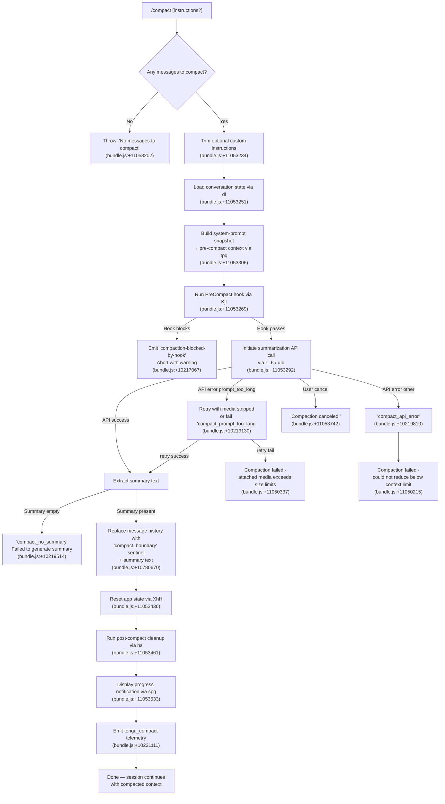

# `/compact`

> Analysis basis: CC v2.1.168 bundle.js (AST extraction + Claude interpretation)
> Minimum version: v2.1.168

---

## Overview

`/compact` frees up context window space by generating a concise summary of the current conversation, replacing the full message history with that summary, and resetting internal state to continue the session from a clean but informed baseline. An optional argument allows passing custom summarization instructions to guide the summary content. The command supports both interactive (REPL) and non-interactive (`--no-interactive`) modes.

---

## Registration

| Field | Value |
|---|---|
| type | `local` |
| name | `compact` |
| description | `Free up context by summarizing the conversation so far` |
| argumentHint | `<optional custom summarization instructions>` |
| supportsNonInteractive | `true` |
| thinClientDispatch | `post-text` |
| module_id | `epq` |
| load_inline | `true` |
| loc_byte | `11054140` |
| loc_byte_end | `11054440` |
| loc_line | `7430` |
| arbor_handler.name | `qjf` |
| arbor_handler.kind | `AsyncFunction` |
| arbor_handler.resolution_path | `module_id` |
| arbor_handler.fqn | `claude-2.1.168::qjf` |
| arbor_handler.n_hits | `0` |

Analysis basis: CC v2.1.168 bundle.js:+11054140

---

## Input Branching

The `/compact` command has 4+ distinct branches depending on message availability, hook outcome, API result, and error type. A Mermaid flowchart is used.



---

## Behavioral Spec

### Handler Entry — `qjf` (compact command handler)

Analysis basis: CC v2.1.168 bundle.js:+11053171

```
async function compactCommandHandler(context, args):
    instructions = args.trim()   // optional custom summarization text

    messages = loadCurrentMessages(context)   // via conversationLoader
    if messages is empty:
        throw Error("No messages to compact")

    snapshot = buildPreCompactState(context)  // tpq: appState + system prompt
    hookResult = await runPreCompactHook(context, snapshot)  // Kjf

    if hookResult.blocked:
        emitWarning("compaction-blocked-by-hook")
        return

    summaryResult = await runSummarizationPipeline(
        context,
        messages,
        instructions,
        snapshot
    )  // L_6 → uIq

    if summaryResult.canceled:
        display("Compaction canceled.")
        return

    if summaryResult.error:
        handleCompactionError(summaryResult.error)  // hH
        return

    replacedHistory = buildCompactedHistory(summaryResult.summaryText)
    // inserts "compact_boundary" sentinel message of type "system"
    // followed by the summary text as a new message

    resetAppState(context)    // XhH: FG6.setState
    runPostCompactCleanup(context)  // hs
    displayCompletionNotification(context, summaryResult)  // spq
    emitCompactTelemetry(context, summaryResult)
```

---

### Pre-Compact State Snapshot — `tpq`

Analysis basis: CC v2.1.168 bundle.js:+11053306, +11052658

```
function buildPreCompactState(context):
    appState = context.getAppState()
    contextItems = Array.from(getContextItems(appState))  // b_
    systemPrompt = loadSystemPrompt(context)              // Pp
    toolPermissions = resolveToolPermissions(context)     // GE
    return { appState, contextItems, systemPrompt, toolPermissions }
```

---

### Pre-Compact Hook Execution — `Kjf`

Analysis basis: CC v2.1.168 bundle.js:+11049254, +11049393

```
async function runPreCompactHook(context, snapshot):
    startTime = performance.now()

    // Run hooks registered for "PreCompact" event
    // via hook-runner cl (bundle.js:+11049318)
    hookResults = await Promise.all(runHooks("PreCompact", snapshot))

    // If any hook instructs block:
    if anyHookBlocked(hookResults):
        emitTelemetry("compaction-blocked-by-hook", { reason: "immediate" })
        return { blocked: true }

    // Fire pre_compact progress notification
    emitProgressStatus("pre_compact")      // literal: "pre_compact" (+11049171)
    emitProgressStatus("hooks_start")      // literal: "hooks_start" (+11049148)

    return { blocked: false, hookData: hookResults }
```

---

### Summarization Pipeline — `L_6` / `uIq`

Analysis basis: CC v2.1.168 bundle.js:+11053292, +10217894, +10218112

```
async function runSummarizationPipeline(context, messages, instructions, snapshot):
    span = startOtelSpan("claude_code.compaction")   // +10217918

    mode = instructions ? "compact_manual" : "compact_auto"
    emitTelemetry("tengu_compact_cache_prefix", { mode })

    // Determine what the compaction agent should summarize
    // Uses "summary" request type (+10218138)
    compactionRequest = buildCompactionRequest(
        messages,
        instructions,
        systemPrompt = "You are a helpful AI assistant tasked with summarizing conversations.",
        // (+10231067)
        toolUsePolicy = "deny",   // "Tool use is not allowed during compaction" (+10228697)
    )

    // Check context window — if already at limit, attempt media stripping
    if estimatedTokens > contextWindowLimit:
        emitTelemetry("tengu_compact_ptl_retry")
        compactionRequest = stripMediaFromRequest(compactionRequest)

    // Execute the API call
    response = await callCompactionAPI(compactionRequest, context)

    if response.aborted:
        return { canceled: true }

    summaryText = extractTextContent(response)

    if summaryText is empty:
        emitTelemetry("tengu_compact_failed")
        return { error: "no_summary", message: "compact_no_summary" }

    // Post-compact file state restoration
    tryRestoreFileState(context)  // tengu_post_compact_file_restore_success/error

    // Cache-sharing optimization
    emitTelemetry("tengu_compact_cache_sharing_success" or "_fallback")

    return { summaryText, mode, durationMs: performance.now() - startTime }
```

---

### Compact Boundary Insertion — `RO`

Analysis basis: CC v2.1.168 bundle.js:+11053171, +10780670, +10780648

```
function buildCompactedHistory(summaryText):
    // Insert a sentinel message to mark the compaction point
    sentinelMessage = {
        role: "system",
        type: "compact_boundary",
        // indices 1 and 0 mark the slice positions (+10780724, +10780729)
    }
    summaryMessage = {
        role: "user",
        content: summaryText
    }
    return [sentinelMessage, summaryMessage]
```

---

### Post-Compact Cleanup — `hs`

Analysis basis: CC v2.1.168 bundle.js:+11053461, +6779899

```
function runPostCompactCleanup(context):
    clearInFlightRequests()          // zD8: Im.delete, Hx_.delete, QG6.delete
    clearToolPermissionCache()       // DD8: LCq.clear
    clearContextCaches()             // $m9: gG6.clear, tb_.clear
    resetConversationState()         // Km9, QXH
    resetAutonomousLoopDelivered()   // Lw7.resetAutonomousLoopDelivered
    clearSessionValues()             // yD: Object.values
    runAdditionalCleanupHooks()      // fx_
    emitPostCompactHookEvent()       // "post_compact_cleanup" (+6779899)
```

---

### Completion Notification — `spq`

Analysis basis: CC v2.1.168 bundle.js:+11053533, +11052602, +11052595

```
function displayCompletionNotification(context, summaryResult):
    // Displays dim-styled summary of what was compacted
    // Format: "Compacted <N> messages" (literal prefix "Compacted " at +11052602)
    // Also registers keybinding "ctrl+o" for app:toggleTranscript (+11052495)
    // under scope "Global" (+11052486)
    showNotification({
        text: "Compacted " + formatMessageCount(summaryResult),
        style: "dim",
        keybinding: { key: "ctrl+o", action: "app:toggleTranscript" }
    })
    emitTelemetry("tengu_compact", { outcome: "success" })
    emitProgressStatus("compact_end")   // literal at +11051089
```

---

### Reactive Compaction (automatic, triggered by context pressure) — `Ox_`

Analysis basis: CC v2.1.168 bundle.js:+11049845, +6784326

The reactive compact path (`Ox_`) is a separate but structurally similar flow invoked automatically when the context window fills. It uses `KD8` to select messages for summarization and operates in the background. Key differences:

- Emits `tengu_reactive_compact_attempt` and `tengu_reactive_compact_succeeded` / `tengu_reactive_compact_failed`
- The literal `"compact_reactive"` (+6786272) labels this mode
- Can be aborted, emitting `"compact_reactive_aborted"` (+6784326)
- Requires at least 2 groups of messages; fewer triggers `"too_few_groups"` (+6764337)
- If no assistant messages exist in the target set, bails with `"exhausted"` (+6764911)

---

## State & Side Effects

| Item | Detail |
|---|---|
| Telemetry — compact lifecycle | `tengu_compact` (+10221111), `tengu_compact_failed` (+10232400), `tengu_compact_cache_prefix` (+10218694), `tengu_compact_cache_sharing_success` (+10229574), `tengu_compact_cache_sharing_fallback` (+10230204), `tengu_compact_ptl_retry` (+10219170) |
| Telemetry — reactive compact | `tengu_reactive_compact_attempt` (+6764970), `tengu_reactive_compact_succeeded` (+6786294), `tengu_reactive_compact_failed` (+6783833), `tengu_precomputed_compact_consumed` (+6778659), `tengu_precomputed_compact_discarded` (+6779282) |
| Telemetry — file restore | `tengu_post_compact_file_restore_success` (+10232886), `tengu_post_compact_file_restore_error` (+10232928) |
| Telemetry — other | `tengu_compact_cache_prefix`, `tengu_sepia_moth` (+6772280), `tengu_amber_redwood3` (+10236830) |
| Hook registration | Fires `PreCompact` hook event before summarization (block-capable); fires `PostCompact` hook after completion |
| appState changes | `FG6.setState` called via `XhH` (+6766295) to reset conversation state after compaction |
| Conversation history | Replaced with a `compact_boundary` sentinel message (type `"system"`) followed by the generated summary |
| Caches cleared | In-flight request map (`Im`), tool permission cache (`LCq`), context caches (`gG6`, `tb_`) |
| Keybinding registered | `ctrl+o` → `app:toggleTranscript`, scope `Global` (+11052495) |
| OTEL tracing span | `claude_code.compaction` span opened and closed around the summarization request (+10217918) |
| Sound | <!-- TODO: not found in depth-2 traversal; needs --depth 4 --> |

---

## Version History

| Version | Change |
|---|---|
| v2.1.168 | Initial analysis |

---

## Common Mistakes

1. **Running `/compact` with an empty conversation** — the command immediately throws `"No messages to compact"` and exits without performing any API call. Ensure at least one message exchange exists before invoking it.
2. **Expecting tool-use inside the summarization turn** — the compaction agent explicitly disallows tool use (`"Tool use is not allowed during compaction"`). Any expectation that the summary will invoke tools will be denied.
3. **Assuming compaction preserves full history** — after `/compact`, the visible context is replaced by the summary. The `compact_boundary` sentinel marks the transition point; earlier messages are gone from the active window.
4. **Confusing manual and automatic compaction** — the `/compact` command is `compact_manual`; the system may also trigger `compact_auto` or `compact_reactive` independently. Telemetry differentiates them.
5. **Providing custom instructions that trigger a refusal** — the optional argument is passed as part of the summarization prompt. Instructions that conflict with policy may cause `compact_no_summary` or `compact_api_error` outcomes.

---

## Appendix — Identifier Mapping

> For bundle debugging only. Identifiers change across versions.

| Identifier | Role |
|---|---|
| `qjf` | Main compact command handler (AsyncFunction) |
| `RO` | Conversation message loader / slice helper |
| `Vy8` | Message normalization helper |
| `fJ` | Conversation format utility |
| `v` | Message content builder / normalizer |
| `snK` | Message content sub-processor |
| `RH` | JSON serialization helper |
| `G4` | Message role/content transformer |
| `EUH` | Attachment normalization utility |
| `_iK` | File-based context item loader |
| `mj_` | String split/parse utility |
| `lHH` | Set membership check helper |
| `uj` | String replace utility |
| `H9` | Message chain processor |
| `m6H` | Sub-message builder |
| `s9` | Model alias resolver |
| `FJ` | Turn formatter |
| `o6` | Notification/log output helper |
| `l` | Logger / structured log emitter |
| `J6` | Structured notification builder |
| `dl` | Conversation state loader (calls `U_`, `D6`) |
| `U_` | Internal state accessor |
| `D6` | Config/session loader |
| `cj6` | Config sub-loader A |
| `lj6` | Config sub-loader B |
| `hu` | Config cache reader |
| `yu` | Config initializer |
| `cq8` | Config cache-or-load dispatcher |
| `hP_` | Config fetch helper |
| `uP_` | Config result processor |
| `C6` | File-based config store |
| `d6` | Directory resolver |
| `nP_` | Path normalizer |
| `LwH` | Config file reader with backup |
| `hVL` | Config file watcher |
| `Kjf` | Pre-compact hook runner and compaction orchestrator |
| `m2` | Message-array builder |
| `ELf` | Request constructor for compaction |
| `AJH` | API client factory |
| `we_` | Message attachment normalizer for API |
| `cl` | Hook executor (PreCompact) |
| `BL` | Hook loader |
| `R6` | Hook type dispatcher |
| `ev` | Hook type helper |
| `h2` | Model capability checker |
| `EN` | Effort level resolver |
| `Zv` | Hook path builder |
| `u6` | Hook path helper |
| `S0` | Hook execution engine |
| `kB` | Policy settings loader |
| `d$H` | Hook result deserializer |
| `dMA` | Hook filter by event type |
| `O` | Background session checker |
| `EOK` | Hook environment resolver |
| `QMA` | Hook input filter |
| `VOK` | Hook variable resolver |
| `hH` | Error display helper |
| `CH` | Notification channel helper |
| `aEH` | Async hook adapter |
| `aN` | Abort/timeout manager |
| `J` | Callback dispatcher |
| `EAH` | Error aggregator |
| `iN` | Hook input normalizer |
| `au8` | Context key resolver |
| `UMA` | MCP tool hook resolver |
| `eu8` | Hook output text parser |
| `O9H` | Hook output JSON transformer |
| `pMA` | HTTP hook dispatcher |
| `TOK` | Hook output validator |
| `Z$H` | Hook context builder |
| `Hm8` | Shell hook executor |
| `IRH` | Hook result integrator |
| `SH` | Notification output helper |
| `XF` | Telemetry flush helper |
| `K` | Hook result accumulator |
| `L` | Promise tracker |
| `f` | Session/stream handle |
| `M` | MCP connection manager |
| `xbH` | MCP server connector |
| `PF8` | MCP connection result applicator |
| `$` | Utility/shared constant |
| `cDA` | MCP client registry |
| `tpq` | Pre-compact state snapshot builder |
| `GE` | System prompt + tool context assembler |
| `q$A` | Tool permission context getter |
| `_68` | Code-style config accessor |
| `UOK` | Confirmation-mode resolver |
| `AI8` | Tool permission mapper |
| `l_` | Logging gate |
| `$E` | Prompt instruction assembler |
| `Scf` | Code style prompt fragment |
| `Rcf` | Confirmation prompt fragment |
| `M$A` | Task continuity prompt assembler |
| `$lf` | Brief mode flag checker |
| `ccf` | Tool/permission context assembler |
| `wJ6` | Memory prompt loader |
| `ecf` | Environment info assembler (static) |
| `tcf` | Environment info assembler (simple) |
| `mcf` | Language setting resolver |
| `pcf` | Output style resolver |
| `_lf` | Working-directory context builder |
| `Alf` | Scratchpad context builder |
| `Klf` | Brief mode checker |
| `Mlf` | Focus context injector |
| `icf` | Act-don't-rederive instruction builder |
| `xcf` | Heron-brook prompt assembler |
| `ucf` | Autonomy append fragment |
| `tu9` | Tool availability checker |
| `ncf` | Base system prompt selector |
| `Ucf` | Reproduce/verify workflow builder |
| `Bcf` | Tool use prompt builder |
| `Fcf` | Doing-tasks prompt builder |
| `gcf` | Task-continuity system prompt |
| `Qcf` | Using-tools prompt builder |
| `lcf` | Tone/style prompt fragment |
| `Ra1` | Memory session builder |
| `gDH` | AWS provider resolver |
| `b_` | Context item extractor |
| `A` | String/array generic |
| `ty8` | Context item type extractor A |
| `ey8` | Context item type extractor B |
| `aB` | Permission mode resolver |
| `Pp` | System prompt loader |
| `K4` | Model string parser |
| `b2` | Model config builder |
| `y_` | Module initializer |
| `pz` | Prompt formatter |
| `P6` | Prompt output renderer |
| `BI8` | Request options builder |
| `lt_` | Long-running task limiter |
| `Ljf` | Compaction API call executor |
| `qx_` | Stream abort controller |
| `fD8` | Request state tracker |
| `QsH` | Compacted result processor |
| `MD8` | API call dispatcher |
| `s3` | Token count estimator |
| `y1` | Yield / async step helper |
| `Kx_` | Message slice finder |
| `OD8` | Duration + progress reporter |
| `jD8` | Full compaction turn executor |
| `dkH` | Message type discriminator |
| `c_H` | Content prefix checker |
| `HJ` | Message sender/channel |
| `s_H` | Active session checker |
| `Wj9` | Wait/yield helper |
| `sa` | Abort signal helper |
| `OW6` | Header entry builder |
| `oIH` | Object introspection helper |
| `gl` | Tool metadata resolver |
| `Vu9` | Tool schema builder |
| `RG6` | Tool result handler |
| `cY8` | Content-start checker |
| `DhH` | File write helper |
| `CpH` | Content path helper |
| `csH` | Session context saver |
| `r4` | Request context accessor |
| `dG6` | UUID generator for compaction |
| `NAH` | Token counter helper |
| `DLf` | Array-type discriminator |
| `YLf` | Token normalizer |
| `Mw7` | Parallel compaction sub-tasks orchestrator |
| `XD8` | Tool state collector |
| `TD8` | App-state tool extractor |
| `PD8` | Plan-state extractor |
| `GD8` | Context-item extractor |
| `WD8` | REPL-context extractor |
| `FfH` | File notification helper |
| `GhH` | Agent listing delta builder |
| `ThH` | Agent listing push helper |
| `R1` | Request ID generator |
| `xF` | Plugin hook loader |
| `nXH` | Message-context compiler |
| `zx_` | Message array normalizer |
| `vbH` | Message filter (Anthropic-only) |
| `gfH` | Gap/fill helper |
| `nY8` | Token-rounding helper |
| `lY8` | Message token mapper |
| `ME` | Message content normalizer (full) |
| `s5` | Token rounding utility |
| `FD7` | File-path-to-token mapper |
| `tT` | Model+effort combiner |
| `t$` | App-state reader for messages |
| `Ox_` | Reactive compact trigger |
| `KD8` | Reactive compact message selector |
| `UG6` | Message range resolver |
| `au9` | Math floor/max helper |
| `D` | Process exit controller |
| `j` | Subprocess tracker |
| `aD7` | Reactive compact summarizer |
| `w` | Worker process manager |
| `sD7` | Reactive compact gap helper |
| `ZY9` | Abort reason classifier |
| `EY9` | Abort enum accessor |
| `Vm` | Text sanitizer/redactor |
| `QK7` | MCP server name redactor |
| `uK7` | Phone/special-char redactor |
| `pK7` | IP-address redactor |
| `RK7` | Email redactor |
| `kK7` | Email-address redactor |
| `vK7` | Home-directory path redactor |
| `BK7` | Path placeholder redactor |
| `UK7` | API-error body redactor |
| `gK7` | URL userinfo redactor |
| `VY9` | Abort signal mapper |
| `GH` | String coercion helper |
| `hs` | Post-compact cleanup executor |
| `zD8` | In-flight request clearer |
| `YW6` | Context reset helper |
| `XG` | Context gate |
| `VAH` | Away-summary disabler |
| `ed8` | Away-summary state accessor |
| `$c8` | Away-summary config checker |
| `DD8` | Tool-permission cache clearer |
| `$m9` | Context cache clearer |
| `Km9` | Conversation-state resetter |
| `QXH` | Session-value resetter |
| `yD` | Output token counter resetter |
| `fx_` | Additional cleanup hooks |
| `XhH` | App-state setter (FG6.setState) |
| `spq` | Completion notification builder |
| `phH` | Model display name resolver |
| `rJ7` | Model alias mapper |
| `OP` | Action keybinding registrar |
| `G78` | Keybinding lookup |
| `T78` | Keybinding template builder |
| `vJH` | OTEL metric emitter |
| `h4` | OTEL span attribute builder |
| `LyH` | OTEL resource attribute builder |
| `QL6` | OTEL span name builder |
| `nQ8` | OTEL event emitter |
| `iQ8` | OTEL histogram recorder |
| `L_6` | Compaction span wrapper / full flow controller |
| `OT6` | OTEL span starter |
| `afH` | OTEL attribute formatter |
| `oN` | OTEL span namer |
| `PS` | Active process checker |
| `psH` | Pre-span state reader |
| `qD8` | Request text trimmer |
| `u8` | UI renderer / TUI output |
| `P` | TUI app entry point |
| `z` | TUI scroll controller |
| `Y` | TUI writer |
| `h` | TUI background sweeper |
| `EOA` | Vim/editor mode dispatcher |
| `C` | Command queue executor |
| `X` | Socket/stream reader |
| `X5` | Stream end handler |
| `o$5` | Main IPC message handler |
| `uIq` | Compaction agent query loop |
| `eZq` | Cache-sharing probe |
| `bv8` | Cache state getter |
| `tZq` | Cache-token counter |
| `_6` | String coercer |
| `EG` | Turn runner (compaction agent) |
| `bN8` | App-state updater during turn |
| `xN8` | Session nonce generator |
| `WS` | Random bytes generator |
| `A9H` | Message context builder |
| `Xp` | Turn abort handler |
| `_h6` | Off-switch checker |
| `I9H` | Usage metrics collector |
| `Hh8` | Stream event handler |
| `rCq` | Rate-limit checker |
| `QfH` | Message filter for compaction |
| `JDf` | Turn completion handler |
| `ab_` | Abort flag helper |
| `BfH` | Max-output-token resolver |
| `BDH` | Output token limit table |
| `a_H` | Token limit parser |
| `cZ` | Last-message finder |
| `AD8` | Message tail locator |
| `_D8` | FindLast wrapper |
| `a8` | Underscore/utility |
| `y` | Away-summary gate |
| `_N8` | GrowthBook state getter |
| `GL5` | Away-summary allowed checker |
| `_hK` | Away-summary draft checker |
| `V` | Display scroller |
| `oz8` | Away-summary generator |
| `ybq` | UUID generator for away-summary |
| `g` | Spinner/timer |
| `p4f` | Notification renderer |
| `$r` | Error formatter |
| `zy6` | Tool search mode decision |
| `r3H` | Tool-search telemetry payload builder |
| `Ns` | Platform/OS normalizer |
| `MbH` | Tool availability checker |
| `sC_` | Tool-search mode classifier |
| `wLf` | Tool-search auto threshold |
| `ob_` | Attachment stripper |
| `x4f` | Array-type discriminator B |
| `u4f` | Message filter B |
| `m4f` | Message content mapper |
| `Oy6` | Media-type handler |
| `dt_` | Recursive content walker |
| `SIq` | Surrogate-pair detector |
| `e_6` | Compaction extra context builder |
| `Oe_` | Internal context push helper |
| `EzK` | Full query executor (compaction model call) |
| `FY8` | Tool context filter |
| `e1` | Capability flag reader |
| `W` | Worker message queue |
| `nV6` | Worker dispatch helper |
| `uF` | Array-type guard |
| `CIq` | Message slice + trim |
| `UsH` | Message push helper |
| `YrH` | Token window calculator |
| `p7H` | Array structure checker |
| `WP6` | Token-count parser |
| `Hk` | Path-prefix checker |
| `U` | Interval clearer |
| `TM` | Model+context combiner |
| `uR` | Context string builder |
| `tv` | Base context type |
| `W_` | Context wrapper |
| `wG` | CLI/remote mode resolver |
| `Yd` | Mode enum |
| `jK` | String coercer B |
| `V26` | REPL context getter |
| `BG6` | Code-block formatter |
| `oD7` | Code block normalizer |
| `ta` | Stop-hook checker |
| `xIq` | Error display helper |
| `hN` | History ring buffer |
| `JT` | History entry builder |
| `goL` | History cache accessor |
| `$T6` | Status bar updater |
| `NhH` | Status setter |
| `He_` | Post-compact flag setter |