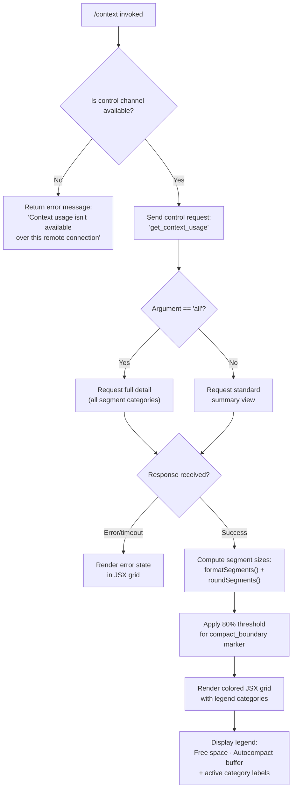

# `/context`

> Analysis basis: CC v2.1.168 bundle.js (AST extraction + Claude interpretation)
> Minimum version: v2.1.168

---

## Overview

`/context` visualizes the current context window usage as a colored grid, breaking down token consumption by category (system prompt, tools, memory files, messages, etc.). It sends a `control-request` over the thin-client dispatch channel to retrieve live token-usage data, then renders a JSX grid component locally. An optional `all` argument expands the view to show additional detail categories.

---

## Registration

| Field | Value |
|---|---|
| type | `local-jsx` |
| name | `context` |
| description | `Visualize current context usage as a colored grid` |
| argumentHint | `[all]` |
| thinClientDispatch | `control-request` |
| module_id | `sFq` |
| load_inline | `true` |
| loc_byte | `11460775` |
| loc_byte_end | `11461001` |
| loc_line | `7486` |
| arbor_handler.name | `Y2f` |
| arbor_handler.fqn | `claude-2.1.168::Y2f` |
| arbor_handler.kind | `AsyncFunction` |
| arbor_handler.resolution_path | `module_id` |
| arbor_handler.n_hits | `0` |

Analysis basis: CC v2.1.168 bundle.js:+11460775

---

## Input Branching

The command has four distinct branches depending on connectivity mode, the presence of the `all` argument, and the shape of the response data. A Mermaid flowchart is used.



Analysis basis: CC v2.1.168 bundle.js:+11459369, +11459400, +11459453, +11459535, +11459911

---

## Behavioral Spec

### Handler Entry — `contextCommandHandler` (bundle: `Y2f`)

The main handler is an `AsyncFunction` resolved via `module_id` → `sFq`.

```
async function contextCommandHandler(args, appState):
    trimmedArg = args.trim()                         // +11459375
    showAll = (trimmedArg == "all")                  // +11459400

    channelType = getActiveChannelType(appState)     // +11459423 (wI → oL)
    if channelType != "controlChannel":              // +11459426
        return errorText(                            // +11459453
            "Context usage isn't available over this remote connection"
        )

    rawResponse = await sendControlRequest(          // +11459535
        channel = appState.controlChannel,
        requestType = "get_context_usage"            // +11459565
    )

    segmentData = buildSegmentList(rawResponse, showAll)  // +11459705 (fS6)
    boundaryMarker = computeCompactBoundary(segmentData)  // +11459878 (z2f → RO)
    usagePercent = computeUsagePercent(rawResponse)       // +11459916

    return renderContextGrid(                        // +11459599 (MS6.createElement)
        segments     = segmentData,
        boundary     = boundaryMarker,
        usagePercent = usagePercent,
        threshold    = 80                            // +11459911
    )
```

Analysis basis: CC v2.1.168 bundle.js:+11459369

---

### Segment Builder — `buildSegmentList` (bundle: `fS6`)

Constructs the ordered array of context segments for rendering. Each segment has a label, token count, and color class.

```
function buildSegmentList(rawResponse, showAll):
    allSegments = rawResponse.filter(isKnownCategory)   // +11457472
    visibleSegments = allSegments

    if not showAll:
        visibleSegments = allSegments.filter(isTopLevel)

    systemEntry  = visibleSegments.find(s => s.type == "system")   // +11457790
    // Recognized category labels (from literals):
    //   "System prompt"       → color "promptBorder"   (+10251589, +10251620)
    //   "System tools"        → color "inactive"        (+10251669, +10251700)
    //   "MCP tools"           → color "cyan_FOR_SUBAGENTS_ONLY" (+10251733, +10251760)
    //   "MCP tools (deferred)"→ color "cyan_FOR_SUBAGENTS_ONLY" (+10251808)
    //   "System tools (deferred)" → color "inactive"   (+10251893)
    //   "Custom agents"       → color "permission"      (+10251981, +10252012)
    //   "Memory files"        → color "claude"          (+10252047, +10252077)
    //   "Skills"              → color "warning"         (+10252108)
    //   "Messages"            → color "purple_FOR_SUBAGENTS_ONLY" (+10252629, +10252655)
    //   "Free space"                                     (+11457507)
    //   "Autocompact buffer"                             (+11457530)
    // Additional setting-sourced labels:
    //   "projectSettings" → "Project"   (+11458456, +11458476)
    //   "userSettings"    → "User"      (+11458496, +11458513)
    //   "localSettings"   → "Local"     (+11458530, +11458548)
    //   "Flag"/"Policy"/"Plugin"/"Built-in" (+11458583–+11458681)
    //   "mcp" → "MCP"     (+1147730, +1147742)

    return formatNumberLocale(visibleSegments, "en-US", "compact")  // +214438, +214456
```

Analysis basis: CC v2.1.168 bundle.js:+11457431, +11457472, +11457790, +10251589

---

### Compact Boundary Marker — `computeCompactBoundary` (bundle: `z2f` → `RO`)

Identifies the position in the segment array where the auto-compact watermark falls.

```
function computeCompactBoundary(segmentData):
    boundaryKey = "compact_boundary"                    // +10780670
    entry = segmentData.find(s => s.key == boundaryKey)
    if entry:
        sliceIndex = entry.slicePosition               // +10780823 (RO → H.slice)
        return sliceIndex
    return null
```

Analysis basis: CC v2.1.168 bundle.js:+11459878, +10780670

---

### Number Formatter — `formatSegmentNumber` (bundle: `gq` → `yK`)

Formats token counts for display using locale-aware compact notation.

```
function formatSegmentNumber(count):
    // Uses Intl.NumberFormat with locale "en-US", style "compact"  (+214438, +214456)
    // Appends ".0" suffix when fractional part is zero             (+212426)
    formatted = count.toLocaleString("en-US", {notation: "compact"})
    if count < 20:                                                   // +212465 ("< 20")
        return formatted                                             // threshold: 20 (+212456)
    rounded = Math.round(count / 10)                                // +212485 (hHH)
    return rounded.toString()
```

Analysis basis: CC v2.1.168 bundle.js:+212412, +212426, +212456, +212465, +212485

---

### Control Request — `sendControlRequest` (bundle: `K.sendControlRequest`)

Dispatches the `get_context_usage` message over the active control channel.

```
async function sendControlRequest(channel, requestType):
    // channel identity verified: type == "controlChannel"  (+11459426)
    response = await channel.sendControlRequest({
        type: requestType                                    // "get_context_usage" (+11459565)
    })
    // Raw response is processed by formatResponse (GH6 → QB → Va → EIH)
    // EIH assembles JSX layout from segment array          (+3819119)
    return response
```

Analysis basis: CC v2.1.168 bundle.js:+11459535, +11459565, +7955444

---

### Response Renderer — `renderContextGrid` (bundle: `GH6` → `QB`)

Assembles the final JSX output. Uses React-compatible `createElement` calls.

```
function renderContextGrid(segments, boundary, usagePercent, threshold):
    // threshold = 80 (+11459911)
    // Renders a grid of colored cells proportional to token counts
    // Each cell maps to a segment category with its color class
    // A boundary marker is inserted at the compact_boundary position
    // A legend row lists: "Free space" + "Autocompact buffer" + active categories
    // usagePercent is shown as a numeric label (e.g. "42%")
    // If usagePercent >= threshold (80), cells are rendered in warning color
    return createElement(GridComponent, {
        segments,
        boundary,
        usagePercent,
        warnThreshold: threshold
    })
```

Analysis basis: CC v2.1.168 bundle.js:+11459595, +11459599, +7955511, +11459911

---

### Channel Type Detection — `getChannelType` (bundle: `wI` → `oL`)

Checks whether the current session has a live control channel.

```
function getChannelType(appState):
    // oL calls uTH (+1097917) to read channel metadata
    // wI wraps oL (+1098067) and returns the channel type string
    channelType = readChannelMetadata(appState)         // oL → uTH
    return channelType                                  // expected: "controlChannel" (+11459426)
```

Analysis basis: CC v2.1.168 bundle.js:+11459408, +11459423

---

## State & Side Effects

| Item | Detail |
|---|---|
| Telemetry | No `tengu_*` event directly in `Y2f` at depth ≤ 2; downstream `EIH` fires `tengu_marlin_porch` (+3819205) and `tengu_native_cursor` (+3819466) during JSX assembly; `tengu_amber_redwood2` (+10236945) and `tengu_amber_redwood3` (+10236830) are reachable via `cIq`/`dl` (auto-compact window resolution, not on critical path for display) |
| Hook registration | `j9` → `NPA.register` (+60369) is reachable via `_iK`; registers a shutdown/cleanup hook for the log writer subsystem (not directly triggered by `/context`) |
| Control channel | Sends exactly one outbound `get_context_usage` control request per invocation; no persistent state change |
| appState changes | Read-only: reads channel type and sends request; does not mutate conversation history or settings |
| Sound | None |
| thinClientDispatch | `control-request` — command requires thin-client control channel; fails gracefully with an inline error message when unavailable (+11459453) |

---

## Version History

| Version | Change |
|---|---|
| v2.1.168 | Initial analysis |

---

## Common Mistakes

1. **Running over a remote connection without control channel support** — `/context` will display `"Context usage isn't available over this remote connection"` when the `controlChannel` is absent. This is expected behavior, not a bug.
2. **Expecting `/context` to modify the session** — The command is entirely read-only; it does not alter context, trigger compaction, or change any settings.
3. **Misinterpreting the compact-boundary marker** — The `compact_boundary` segment marks where auto-compaction would activate, not where the current message history ends. It may appear at a different position than the last message cell.
4. **Omitting the `all` argument when debugging token usage** — Without `all`, only top-level categories are shown. Pass `/context all` to see every sub-category (plugin, built-in, flag, policy, MCP, etc.).
5. **Expecting real-time updates** — The grid is a snapshot at invocation time; it does not auto-refresh as the conversation continues.

---

## Appendix — Identifier Mapping

> For bundle debugging only. Identifiers change across versions.

| Identifier | Role |
|---|---|
| `Y2f` | Main handler: `contextCommandHandler` (AsyncFunction) |
| `$1` | Inner JSX render helper invoked by the main handler |
| `lHH` | Channel presence check (uses `o74.has`) |
| `NW_` | Control channel type resolver (wraps `_6`) |
| `_6` | String coercion utility |
| `qa` | Environment/channel info query |
| `IIL` | Terminal type detection (iTerm2/tmux/screen detection) |
| `vIL` | Terminal name prefix checker (`H.startsWith`) |
| `v` | Log writer / output utility |
| `snK` | Structured logger helper |
| `IPA` | Log entry formatter (`edK`/`HcK`) |
| `H` | HTTP fetch / bootstrap utility |
| `mj_` | URL parser helper |
| `uj` | String replace utility |
| `H9` | Message formatter (`m6H`/`s9`/`FJ`) |
| `o6` | File output helper |
| `RH` | JSON serializer (`JSON.stringify`) |
| `G4` | Path basename extractor |
| `K0A` | Path segment mapper |
| `EUH` | Write-stream helper (`nWA`) |
| `nWA` | Raw stream writer (`H.write`) |
| `_iK` | Log file writer / rotation manager |
| `npH` | Buffered write scheduler (uses `setTimeout`/`setImmediate`) |
| `YKH` | Log rotation helper (`r76`/`IHH.join`/`t8`/`R6`) |
| `d6` | Directory path resolver |
| `B76` | Log path builder (`V8`) |
| `$0A` | Log path joiner (`IHH.join`/`R6`) |
| `ll8` | Log file rename/unlink helper |
| `HiK` | Log append+rotate handler |
| `j9` | Hook registrar (`NPA.register`) |
| `VW_` | Fullscreen detection guard (`r6`/`Boolean`) |
| `l_` | Settings loader entry point |
| `gU` | Settings disk load orchestrator |
| `aE` | Settings parse helper |
| `b9` | Memory-usage sampler during settings load |
| `A__` | Settings load telemetry emitter |
| `kd` | Settings field extractor (many sub-fields) |
| `wp6` | Settings post-process helper |
| `kIL` | Fullscreen mode initializer |
| `D6` | React state / store dispatcher |
| `cj6` | Fullscreen store action: enable |
| `lj6` | Fullscreen store action: disable |
| `hu` | Fullscreen state reducer (`yu`) |
| `cq8` | Fullscreen dedup guard (`RP_.has`/`HwH.get`) |
| `C6` | App-state updater with timestamp (`Date.now`) |
| `oL` | Channel metadata reader (`uTH`) |
| `uTH` | Low-level channel type accessor |
| `wI` | Channel type wrapper (calls `oL`) |
| `K` | Control channel object (has `.sendControlRequest`, `.map`, `.padEnd`) |
| `L` | Promise set manager (`q.add`/`q.delete`/`f.finally`) |
| `f` | Stream/connection handle (`A.close`/`q.close`) |
| `GH6` | Response event listener + JSX assembler |
| `QB` | JSX render dispatcher (`wT_`/`IT_`/`Va`) |
| `IT_` | React createElement wrapper |
| `Va` | Context grid layout component (`_6`/`EIH`/`D6`) |
| `EIH` | Grid segment renderer (fires `tengu_marlin_porch`, `tengu_native_cursor`) |
| `fS6` | Segment list builder (main data pipeline) |
| `gq` | Number formatter entry (`yK`) |
| `yK` | Locale-compact number formatter (`KiK`) |
| `KiK` | Inner Intl.NumberFormat helper |
| `QFH` | Segment color classifier |
| `hHH` | Rounded count formatter (`Math.round`) |
| `GH` | String coercion wrapper |
| `z2f` | Compact boundary locator (calls `RO`) |
| `RO` | Boundary slice extractor (`Vy8`/`H.slice`) |
| `Vy8` | Boundary key lookup (`fJ`) |
| `fJ` | Compact boundary key constant (`"compact_boundary"`) |
| `QI8` | Full context-window token accounting engine |
| `JZ` | Message token counter (`m6H`/`bT`/`CI`) |
| `m6H` | Message segment serializer |
| `qB` | Message body tokenizer |
| `bT` | Token-count builder (`lM`/`N5`/`MA`) |
| `lM` | Token segment leaf (`MA`) |
| `N5` | Token segment node (`upH`/`TAL`/`B31`) |
| `MA` | Segment formatter (`_6`) |
| `CI` | Combined segment counter (`lM`/`N5`) |
| `OE` | Auto-compact settings reader (`_6`/`u4`) |
| `u4` | Config flag reader (`gV`/`x8`/`C6`) |
| `gV` | Feature-flag set checker |
| `x8` | Compact window config resolver (`vn6`/`kd`) |
| `rn` | Context window calculator (env/settings/model defaults) |
| `e1` | Token segment entry formatter |
| `nt6` | Settings entry loader (`l_`/`Object.entries`) |
| `tX` | Token segment text normalizer |
| `HN` | Token count parser (parseInt/isNaN/`Y2`/`KB`/`p6H`/`k18`) |
| `Y2` | Context limit resolver (`R4H`) |
| `KB` | Context limit with claude-3 override |
| `p6H` | Context limit with jY fallback |
| `k18` | Context limit with finite-check |
| `d0` | Default context window constant |
| `a_H` | Compact window env-var parser |
| `cIq` | Auto-compact window resolver (`OE`/`U_`/`D6`/`at_`) |
| `U_` | Compact window settings reader |
| `at_` | Compact window value parser (parseFloat/parseInt/Math.round) |
| `GE` | System-prompt assembly engine |
| `q$A` | Prompt template selector |
| `u6` | AsyncLocalStorage store reader (`pc6`/`W_`) |
| `pc6` | Store getter (`mc6.getStore`/`BQ`) |
| `W_` | Fallback value wrapper (`tv`) |
| `_68` | Prompt feature-flag segment (`e1`/`LW1`) |
| `LW1` | Prompt include-check helper |
| `UOK` | Prompt segment key constant (`:C`/`:L`) |
| `AI8` | Tool-list segment builder |
| `Scf` | Prompt segment: code style |
| `Rcf` | Prompt segment: confirmation policy |
| `M$A` | Prompt segment: task continuity / additive modes |
| `jK` | String wrapper helper |
| `$lf` | Prompt segment: task-continuity addon |
| `ccf` | Prompt segment: session-guidance / memory |
| `dQ` | Permission query helper |
| `GP` | Prompt segment formatter (`_6`/`$d8`) |
| `dcf` | Session-guidance sub-builder (`$b`) |
| `FS_` | Feature flag for session guidance |
| `$b` | Flag-state accessor (`Xw9`) |
| `pL` | Prompt list joiner |
| `eg` | Prompt segment: emoji / tone rule |
| `bg` | Tool-block flat-mapper |
| `wJ6` | Memory-prompt builder (loads memory files) |
| `m4` | Memory file reader (`mR`/`_6`/`jK`/`rq8`/`l_`) |
| `iLH` | Memory directory initializer (`d6`/`_.mkdir`/`V8`) |
| `ro` | Memory file stat helper (`f.isFile`/`f.isDirectory`) |
| `P6` | Path helper (`hm6`) |
| `SH` | File read helper (`l`/`J6`) |
| `Ma1` | Memory file batch loader (`Promise.allSettled`) |
| `Y` | Supervisor/daemon write stream |
| `DJ6` | Memory filename parser (stem extractor) |
| `dw` | Memory store dispatcher (`D6`) |
| `Za1` | Memory path joiner (`N2_.join`) |
| `Ea1` | Memory path: ephemeral (`bvH`) |
| `Ta1` | Memory path: team (`bvH`) |
| `b2_` | Memory path: base (`bvH`) |
| `l` | Generic async file reader |
| `ecf` | Prompt segment: env-info static |
| `xj` | Model display name resolver |
| `K$A` | Model knowledge-cutoff table |
| `tcf` | Prompt segment: env-info full |
| `f$A` | OS info collector (`SuH.version`/`.release`/`.type`) |
| `GM` | Git worktree detector |
| `L$A` | Shell type detector |
| `mcf` | Prompt segment: language |
| `pcf` | Prompt segment: output-style |
| `_lf` | Prompt segment: worktree/bg-session |
| `ad_` | Worktree status checker (`l_`) |
| `Alf` | Prompt segment: scratchpad/tmp path |
| `YqH` | Scratchpad path builder (`D6`) |
| `PGH` | Tmp path builder (`cK.join`/`_K6`/`R6`) |
| `Klf` | Prompt segment: brief mode |
| `Mlf` | Prompt segment: context-management (focus mode) |
| `icf` | Prompt segment: GrowthBook flags |
| `xcf` | Prompt segment: heron-brook feature |
| `ucf` | Prompt segment: autonomy-append |
| `tu9` | Tool permission cache accessor |
| `ncf` | Prompt segment: base persona |
| `Ucf` | Prompt segment: act-dont-rederive |
| `Bcf` | Prompt segment: auto-compaction notice |
| `bcf` | Auto-compact body builder |
| `Fcf` | Prompt segment: reproduce-verify workflow |
| `gcf` | Prompt segment: task-continuity addons |
| `Qcf` | Prompt segment: doing-tasks guide |
| `wG` | CLI/remote context formatter (`Yd`/`jK`/`_6`/`D6`) |
| `lcf` | Prompt segment: tone/style |
| `Ra1` | Full memory prompt assembler (`Sa1`/`b2_`) |
| `Sa1` | Memory prompt pre-builder (`m4`/`dw`/`pvH`) |
| `gDH` | Model family default resolver (`_N`/`Lf`/`MA`) |
| `_N` | Model name normalizer (`oj_`/`tNH`) |
| `Lf` | Model alias resolver |
| `Pp` | System-prompt + tool list combiner |
| `K4` | Tool definition formatter |
| `b2` | Tool block builder (`_6`/`wT`/`Q9`) |
| `wT` | Tool schema formatter |
| `Q9` | Tool output schema formatter |
| `y_` | Ink/React renderer bootstrap |
| `M` | MCP server manager |
| `xbH` | MCP connection handler |
| `PF8` | MCP update applier |
| `$` | MCP event bus |
| `cDA` | MCP client reconciler |
| `pz` | Permission-checker for tools |
| `J6` | Async file read with error wrapper |
| `hm6` | Path join utility |
| `s4f` | Context token breakdown calculator |
| `a4f` | CLAUDE.md section extractor |
| `cI8` | Context section pre-processor |
| `Hlf` | System-prompt token segmenter |
| `Ca1` | Memory context section builder |
| `mOK` | Context section label parser |
| `UA6` | Token count for tool definitions |
| `kbH` | Single-tool token estimator |
| `hH` | Error logger helper |
| `iIq` | MCP tool token estimator |
| `t4f` | Attachment token counter |
| `DW6` | Attachment filter (`D6`/`H.filter`) |
| `e4f` | Message-history token counter |
| `mWH` | Message batch token estimator |
| `lI8` | Single-message token estimator |
| `z` | Daemon/supervisor handle |
| `CH` | File content reader (`l`/`J6`) |
| `uh` | Conversation context pusher |
| `sp` | Daemon race/exit handler (`Promise.race`/`process.exit`) |
| `W` | Subagent mailbox / set |
| `nV6` | Teammate mailbox reader |
| `X` | IPC socket connection handle |
| `J` | IPC message buffer |
| `w` | Daemon worker process |
| `X5` | IPC stream end helper |
| `o$5` | Full IPC message dispatcher |
| `ALf` | Prompt-token accumulator (Math.round, Promise.all) |
| `s5` | Safe rounding utility (`Math.round`) |
| `O` | Background session list |
| `b8` | Background session entry |
| `D` | Forced-shutdown handler (`process.exit`/`z.abort`) |
| `IJ` | Immediate-exit helper |
| `qLf` | MCP tool token batch processor |
| `HLf` | Permission-scoped token counter |
| `iS_` | Permission query (`KJ`/`JAH`/`dQ`) |
| `JAH` | Permission filter (`H.filter`/`_.some`/`x$K`) |
| `nIq` | Nested token counter (`hK`) |
| `hK` | Recursive token lookup (`Bo1.get`/`K.get`/`Bo1.set`) |
| `MLf` | Token segment map builder |
| `KLf` | Token segment: system-prompt row (`RH`/`s5`) |
| `LLf` | Token segment: tools row (`s5`/`RH`/`A.get`) |
| `fLf` | Token segment: messages row (`RH`/`s5`) |
| `ME` | Full conversation message normalizer |
| `NOf` | Message segment pusher |
| `o6A` | Message segment noop/passthrough |
| `SOf` | Queued-command segment (`q59`) |
| `hOf` | Content-type router (`zV_`/`YV_`/`DV_`/`L58`/`wV_`/`wrH`) |
| `ROf` | Tool-use attachment checker |
| `k` | File-watcher / chokidar instance |
| `Wy8` | Deferred-tool filter (`_.some`) |
| `dOf` | UUID generator for tool results (`qy.randomUUID`) |
| `u8` | Message UUID tagger |
| `NE` | Message normalizer no-op |
| `bo_` | Message passthrough |
| `Gy8` | Tool-use ID injector (`Ty8`/`Ebq`/`uOf`) |
| `nN` | Standard tool-call builder (`sC_`/`v`/`MA`/`Lf`) |
| `_8A` | Tool-result array normalizer |
| `vOf` | Tool-use attachment mapper |
| `V` | Conversation history array |
| `y` | Away-summary / cache-freshness checker |
| `IOf` | Thinking-block filter |
| `QOf` | MCP tool-name prefix checker (`mcp__`) |
| `Y4` | Message content merger |
| `Bbq` | Message dedup helper |
| `bOf` | Message filter + Gbq dispatcher |
| `Gbq` | Message grouper (`Y2_`/`_`/`l`/`H.filter`) |
| `we_` | System-prompt injection builder (many content types) |
| `cOf` | Context-efficiency segment builder |
| `E` | Tool execution pipeline |
| `COf` | Tool-call formatter (`Ty8`/`Ebq`/`mOf`) |
| `gv6` | Orphaned-thinking-block filter |
| `tOf` | Trailing-thinking-block filter |
| `Fv6` | Whitespace-only assistant filter |
| `eOf` | Empty-assistant-content fixer |
| `xOf` | Message slicer for context window |
| `Wbq` | System-reminder injector |
| `Tbq` | Tool-use ID backfiller |
| `yOf` | Message tail trimmer |
| `_Lf` | Deferred-prompt token segmenter |
| `rS_` | Permission-scoped deferred token counter |
| `AG` | Token segment label builder (`s9`/`e1`) |
| `s9` | Token count string formatter |
| `Ay6` | Attachment size estimator (`s5`/`bt_`) |
| `bt_` | Attachment byte-length helper |
| `AA` | Error string formatter |
| `$9H` | Context window min-calc (`Math.min`/`BfH`/`OE`/`rn`) |
| `BfH` | Max-output-token cap resolver (`BDH`/`a_H`) |
| `BDH` | Output token limit calculator |
| `t` | React ref / recording state |
| `T` | React ref container (`ly6`/`Y46`) |
| `ly6` | React.useRef factory |
| `Y46` | React ref initializer |
| `Q` | Session timeout / kill timer |
| `U` | clearInterval wrapper |
| `b4H` | Session kill helper (`_6H`/`_.trim`) |
| `C` | Rate-limit event enqueuer |
| `g` | Spinner/progress renderer |
| `j` | Worker kill iterator |
| `r` | Voice recording + transcription session |
| `G` | MCP connection list |
| `d` | Scheduled task runner |
| `jH` | MCP send-message dispatcher |
| `r8` | Abort controller with timeout |
| `SpH` | Platform detector (`H.toLowerCase`/`$PA.has`) |
| `dzA` | File watcher registration helper |
| `Ux8` | Voice WebSocket stream client |
| `NH` | IPC channel wrapper |
| `vH` | Viewport/terminal size reader |
| `bH` | Buffer accumulator for IPC |
| `wH` | Message history slice helper |
| `UoH` | Usage-stats reader (`s_H`) |
| `s_H` | Usage store getter (`BoH.has`) |
| `dl` | Context window delta calculator (`U_`/`D6`) |
| `pH` | Message-history push queue |
| `aH` | Conversation history appender |
| `Lb6` | History length limiter |
| `xH` | Active messages accessor |
| `ke` | GrowthBook experiment checker (`Eu8`/`Gdf.has`) |
| `_qH` | Phantom-parent hint emitter |
| `gt` | Conversation turn builder (fires `tengu_phantom_parent_hint`) |
| `$M` | Message metadata store |
| `PH` | Pending-task list |
| `OH` | Output handler (`PH`/`Ulf`) |
| `Ulf` | Output formatter |
| `QH` | Conversation history map |
| `oH` | Transcript writer |
| `XH` | Transcript push buffer |
| `R1` | Transcript record creator (`xs_.randomUUID`) |

---

Note: index built via Arbor fallback; some signals (telemetry, literals) may be missing — see arbor-fallback.js.