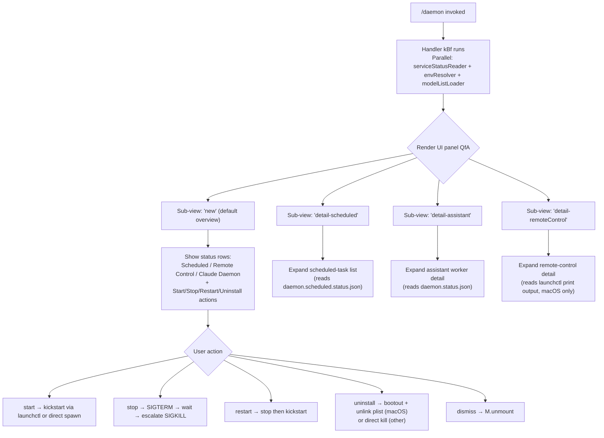

# `/daemon`

> Analysis basis: CC v2.1.168 bundle.js (AST extraction + Claude interpretation)
> Minimum version: v2.1.168

---

## Overview

The `/daemon` command manages the Claude Code background daemon service — the persistent process that coordinates background sessions, scheduled tasks, MCP server connections, and pre-warmed worker pools. It presents an interactive UI panel that shows live status across three service categories (Scheduled, Remote Control, and Claude Daemon workers) and exposes sub-actions such as starting, stopping, restarting, and uninstalling the daemon. On macOS the daemon integrates with `launchctl` as a LaunchAgent; on other platforms it is managed via direct process signaling.

---

## Registration

| Field | Value |
|---|---|
| type | `local-jsx` |
| name | `daemon` |
| description | `Manage background services and routines` |
| loc_byte | `12995635` |
| loc_byte_end | `12995803` |
| loc_line | `9616` |
| immediate | `true` |
| module_id | `dfA` |
| load_inline | `true` |
| arbor_handler.name | `kBf` |
| arbor_handler.fqn | `claude-2.1.168::kBf` |
| arbor_handler.kind | `AsyncFunction` |
| arbor_handler.resolution_path | `module_id` |
| arbor_handler.n_hits | `0` |

Analysis basis: CC v2.1.168 bundle.js:+12995635

---

## Input Branching

The command resolves to five or more distinct rendering branches depending on sub-view selection and available state, requiring a flowchart.



Analysis basis: CC v2.1.168 bundle.js:+12984383 (handler entry), +12985214 (sub-view literals), +12985025 (uninstall literal), +11502126 (start/stop/restart literals)

---

## Behavioral Spec

### 1. Handler Entry — `asyncDaemonCommandHandler` (kBf)

```
async function asyncDaemonCommandHandler():
    [serviceStatus, envInfo, modelList] = await Promise.all([
        readAllServiceStatus(),   // gfA
        resolveEnvironmentInfo(), // UfA
        loadModelChoices()        // A5K
    ])
    mountInteractivePanel(serviceStatus, envInfo, modelList)
    // panel unmounts via M.unmount on dismiss
```

Analysis basis: CC v2.1.168 bundle.js:+12984383

---

### 2. Parallel Service Status Reader — `readAllServiceStatus` (gfA)

Concurrently reads status files and checks running processes for each service category.

```
async function readAllServiceStatus():
    [daemonStatus, scheduledStatus, rosterEntries] = await Promise.all([
        readDaemonStatusFile(),         // jLK — reads daemon.status.json
        readScheduledStatusFile(),      // F7K — reads daemon.scheduled.status.json
        readRosterAndCleanStale()       // afK — reads roster.json, unlinks stale sockets
    ])
    mcpStatus = collectMcpServerStatus()  // dfK — Object.keys scan
    workerKeys = Object.keys(daemonStatus ?? {})
    return { daemonStatus, scheduledStatus, rosterEntries, mcpStatus, workerKeys }
```

Analysis basis: CC v2.1.168 bundle.js:+12983904

**File paths resolved** (via path-join helpers):

| Literal | Purpose |
|---|---|
| `daemon.status.json` | Live assistant worker status (bundle.js:+12780353) |
| `daemon.scheduled.status.json` | Scheduled task status (bundle.js:+12870855) |
| `roster.json` | Background session roster (bundle.js:+11505742) |
| `daemon.json` | Primary daemon PID/socket record (bundle.js:+11499686) |

---

### 3. Roster Reader and Stale Socket Cleanup — `readRosterAndCleanStale` (afK)

```
async function readRosterAndCleanStale():
    raw = readJsonFile(rosterPath)        // hq6 → n7A: Lx8.readFile, JSON.parse
    entries = validateIsArray(raw)        // GfA: Array.isArray guard
    staleEntries = filterStale(entries)   // PfA
    for entry in staleEntries:
        q.push(entry)                     // queues for opK.unlinkSync
    activeEntries = entries - staleEntries
    processQueue()                        // hH → DG4 circular buffer shift/push
    return activeEntries
```

Reading uses encoding `"utf8"` (bundle.js:+12781149). Stale entries with the literal tag `"scheduled"` are specially handled (bundle.js:+12872360). Socket files for dead roster entries are removed synchronously via `unlinkSync` (bundle.js:+16174065).

Analysis basis: CC v2.1.168 bundle.js:+12978606

---

### 4. Daemon Status File Reader — `readDaemonStatusFile` (jLK)

```
async function readDaemonStatusFile():
    path = buildPath(stateDir, "daemon.status.json")  // YC6 → YLK.join
    try:
        raw = await readFile(path)
        return parseJson(raw)                          // x9
    catch ENOENT:
        return null                                    // literal "ENOENT" at +12966682
    on stale PID:
        process.kill(pid, 0)                          // liveness probe
        if dead: w2()                                 // Zh helper — remove stale file
```

Analysis basis: CC v2.1.168 bundle.js:+12780639

---

### 5. Scheduled Status File Reader — `readScheduledStatusFile` (F7K)

Structurally identical to `readDaemonStatusFile` but targets `daemon.scheduled.status.json` (bundle.js:+12870855). Uses the same liveness-probe pattern (`process.kill`) and stale-file removal helper `w2`.

Analysis basis: CC v2.1.168 bundle.js:+12871062

---

### 6. MCP Status Collector — `collectMcpServerStatus` (dfK)

```
async function collectMcpServerStatus():
    store = getAsyncLocalStore()         // $GH → V9: eNL.getStore
    serverMap = store?.mcpServers ?? {}
    keys = Object.keys(serverMap)        // +12966983
    for key in keys:
        if K.has(key):                   // dedup check
            entry = buildStatusEntry(key, serverMap[key])  // mfA
            statusList.push(entry)
    pidDir = buildPath(stateDir, "same-dir")  // literal at +12972287
    for pid in pidList:
        baseName = x$H.basename(pidPath)
    return statusList
```

Analysis basis: CC v2.1.168 bundle.js:+12972120

---

### 7. Environment Resolver — `resolveEnvironmentInfo` (UfA)

```
async function resolveEnvironmentInfo():
    homeDir = BfK.homedir()              // +12968266
    joined  = b$H.join(homeDir, "assistant")  // literal "assistant" at +12968287
    try:
        stat = await yC6.stat(joined)    // +12968310
    catch:
        stat = null
    if stat:
        role = buildRole(stat)           // v → snK → IPA chain
    envText = GH(role)                   // string-coerce helper
    return { homeDir, joined, envText }
```

Analysis basis: CC v2.1.168 bundle.js:+12968227

---

### 8. macOS launchctl Service Control — `launchctlServiceControl` (Di / R8 / fS8)

```
function launchctlServiceControl(action):
    plistPath = buildPlistPath()   // M1A → jS6.join + L1A.homedir
                                   // path: ~/Library/LaunchAgents/<plist>
    uid = getProcessUID()          // igq → process.getuid  (+11500070)
    label = "gui/" + uid + "/" + plistLabel

    match action:
        "start"   → execLaunchctl("kickstart", label)   // literal at +11502137
        "stop"    → execLaunchctl("stop", label)
        "restart" → stopThenKickstart(label)
        "uninstall" →
            if platform == "darwin":            // literal at +11502785
                execLaunchctl("bootout", label) // literal at +11501774
                unlink(plistPath)
            else:
                raiseError("service uninstall not available on darwin")
                // literal at +11501906

    timeout = 5000  // ms, literal at +11503263
    launchctlArgs = ["launchctl", "print", label]  // literals at +11503216, +11503229
```

Analysis basis: CC v2.1.168 bundle.js:+11503213

**Restart guard**: if the daemon does not exit within 10 seconds of SIGTERM, the restart is aborted before `kickstart` — literal: `"daemon did not exit within 10s of SIGTERM; restart aborted before kickstart"` (bundle.js:+11502459).

---

### 9. Interactive UI Panel — `DaemonPanelComponent` (QfA)

```
function DaemonPanelComponent(props):
    [view, setView] = useState("new")   // yq.useState, literal "new" at +12985312
    clock = useClock()                  // w1 → s19.useContext
    startTime = Date.now()              // +12984643
    perfNow  = f.now()                  // +12984660

    // Render sub-panels based on view state:
    match view:
        "new"                 → renderOverview(serviceStatus)
        "detail-scheduled"    → renderScheduledDetail(scheduledStatus)   // +12985214
        "detail-assistant"    → renderAssistantDetail(daemonStatus)      // +12985372
        "detail-remoteControl"→ renderRemoteControlDetail()              // +12985493

    // Section labels rendered (literals):
    //   "Scheduled"      (+12986141)
    //   "Remote Control" (+12986462)
    //   "Claude Daemon"  (+12986747)

    // Actions rendered:
    //   "start" / "stop" / "restart" / "uninstall"
    //   "system" role indicator (+12985745)
    //   "remoteControl" type    (+12985790)
    //   "permission" indicator  (+12986845)

    onDismiss: M.unmount()    // +12995222
```

Analysis basis: CC v2.1.168 bundle.js:+12984594

---

### 10. Daemon Stop / Signal Escalation

The daemon stop flow follows an escalation strategy:

```
async function stopDaemon(pid):
    send(pid, SIGTERM)               // literal "SIGTERM" at +16198957
    wait up to 10s
    if still running:
        send(pid, SIGKILL)           // literal "SIGKILL" at +16197050
        emit telemetry tengu_bg_dispatch_sigkill_escalate
```

Analysis basis: CC v2.1.168 bundle.js:+16197050

---

### 11. Roster File JSON Parser — `parseRosterJson` (n7A)

```
async function parseRosterJson(filePath):
    raw = await Lx8.readFile(filePath, "utf8")   // encoding literal +12781149
    trimmed = raw.trim()
    parsed  = JSON.parse(trimmed)
    if not parsed:
        throw new Hu()                           // custom error type
    if not Array.isArray(parsed):
        throw new Error("expected array")
    return parsed
```

Analysis basis: CC v2.1.168 bundle.js:+12781115

---

## State & Side Effects

| Item | Detail |
|---|---|
| Telemetry — roster parse failure | `tengu_bg_roster_parse_failed` (bundle.js:+11509405) |
| Telemetry — daemon config reload | `tengu_daemon_config_reload` (bundle.js:+16212414) |
| Telemetry — daemon stop | `daemon_stop` literal (bundle.js:+16233897); failure: `daemon_stop_failed` (bundle.js:+16233934) |
| Telemetry — daemon yield | `tengu_daemon_yield` (bundle.js:+16216637) |
| Telemetry — daemon control | `tengu_daemon_control` (bundle.js:+16233972) |
| Telemetry — daemon idle exit | `tengu_daemon_idle_exit` (bundle.js:+16217667) |
| Telemetry — bg session create | `daemon_bg_session_create` literal (bundle.js:+16197318) |
| Telemetry — bg spare claim | `tengu_bg_spare_claim` (bundle.js:+16198435) |
| Telemetry — bg spare claim fail | `tengu_bg_spare_claim_fail` (bundle.js:+16198701) |
| Telemetry — bg spare enable | `tengu_bg_spare_enable` (bundle.js:+16198307) |
| Telemetry — SIGKILL escalation | `tengu_bg_dispatch_sigkill_escalate` (bundle.js:+16197002) |
| Telemetry — low memory | `tengu_bg_dispatch_low_mem` (bundle.js:+16197603), `tengu_bg_low_mem_mb` (bundle.js:+13052200) |
| Telemetry — prewarm sweep | `tengu_bg_prewarm_per_sweep` (bundle.js:+16201728) |
| Telemetry — retire pinned (low mem) | `tengu_bg_retire_pinned_low_mem` (bundle.js:+16201607) |
| Telemetry — adopt socket unlinked | `tengu_bg_adopt_sock_unlinked` (bundle.js:+13527482) |
| Telemetry — scheduled task fire | `tengu_scheduled_task_fire` (bundle.js:+15710455) |
| Telemetry — scheduled task expired | `tengu_scheduled_task_expired` (bundle.js:+15710798) |
| Telemetry — send-claim failed | `tengu_bg_sendclaim_failed` (bundle.js:+16176740) |
| Telemetry — bg state read transient | `tengu_bg_state_read_transient` (bundle.js:+4167839) |
| Telemetry — retire grace bridged | `tengu_bg_retire_grace_bridged_min` (bundle.js:+13052318) |
| Telemetry — attach upgrade | `tengu_bg_attach_upgrade` (bundle.js:+13052390) |
| Telemetry — MCP OAuth flow | `tengu_mcp_oauth_flow_start`, `tengu_mcp_oauth_flow_success`, `tengu_mcp_oauth_flow_error` |
| Telemetry — MCP reconnect | `mcp_reconnect`, `mcp_reconnect_not_connected`, `mcp_reconnect_needs_auth_discovery`, `mcp_reconnect_failed` (literals) |
| Telemetry — config safety | `tengu_config_auth_loss_prevented`, `tengu_config_parse_error` |
| File mutations | Stale roster sockets unlinked via `unlinkSync` (bundle.js:+16174065); stale `daemon.status.json` removed via `w2`/`Zh` |
| launchctl registration | macOS: plist placed in `~/Library/LaunchAgents/`; `launchctl bootout` on uninstall |
| appState changes | Daemon config reloaded via `E.updateConfig` / `E.start` / `E.stop`; supervisor key literal `"supervisor"` (bundle.js:+16211621) |
| Process signals | SIGTERM then SIGKILL escalation on stop/restart |
| UI lifecycle | `M.render` mounts JSX panel; `M.unmount` on dismiss (bundle.js:+12995008, +12995222) |
| Sound | <!-- TODO: not found in depth-2 traversal; needs --depth 4 --> |

---

## Version History

| Version | Change |
|---|---|
| v2.1.168 | Initial analysis |

---

## Common Mistakes

1. **Expecting `/daemon` to block the REPL**: The command mounts an `immediate: true` interactive JSX panel. It returns control to the user immediately after mounting; the panel runs concurrently and must be dismissed explicitly.
2. **Running `uninstall` on non-macOS**: The `"service uninstall not available on darwin"` guard (bundle.js:+11501906) applies when the branch detection logic unexpectedly falls through. The `uninstall` sub-action is macOS-only (`launchctl bootout`).
3. **Missing `daemon.json` at startup**: If the daemon PID file does not exist, `readDaemonStatusFile` returns `null`; the UI shows no workers rather than an error. Users should first run the daemon via `start`.
4. **SIGTERM not honoured within 10 s**: Restart is hard-aborted before `kickstart` if the process does not terminate within the timeout (bundle.js:+11502459). Retry the restart or use `stop` → `start` manually.
5. **Stale roster entries**: The `readRosterAndCleanStale` pass silently unlinks stale socket files. If socket cleanup fails (permission error), the roster may report phantom sessions.

---

## Appendix — Identifier Mapping

> For bundle debugging only. Identifiers change across versions.

| Identifier | Role |
|---|---|
| `kBf` | Async daemon command handler (Arbor-resolved entry point) |
| `uBf` | Outer command wrapper / render caller |
| `QfA` | Daemon interactive UI panel React component |
| `gfA` | Parallel service status reader (aggregates all status files) |
| `afK` | Roster reader and stale-socket cleanup |
| `hq6` | Roster file reader orchestrator |
| `n7A` | Low-level roster JSON file parser (readFile + JSON.parse) |
| `GfA` | Roster array validator (Array.isArray guard) |
| `PfA` | Stale roster entry filter |
| `jLK` | Daemon status file reader (`daemon.status.json`) |
| `YC6` | Path builder for daemon status directory |
| `F7K` | Scheduled status file reader (`daemon.scheduled.status.json`) |
| `B7K` | Path builder for scheduled status file |
| `dfK` | MCP server status collector |
| `$GH` | Async-local store accessor for MCP server map |
| `V9` | AsyncLocalStorage getStore wrapper |
| `pfA` | MCP status entry builder |
| `mfA` | MCP status entry formatter |
| `UfA` | Environment info resolver (homedir + stat check) |
| `Al6` | File stat helper used in env resolver |
| `A5K` | Model choice list loader |
| `U16` | Model list aggregator |
| `LJf` | Model list builder (assembles all model option objects) |
| `Di` | macOS launchctl service controller dispatcher |
| `R8` | launchctl command executor |
| `C_` | Low-level subprocess exec helper |
| `fS8` | macOS plist path builder |
| `igq` | `process.getuid()` wrapper |
| `M1A` | LaunchAgents plist path constructor |
| `o16` | Daemon uninstall handler (bootout + unlink) |
| `XS6` | Daemon install / start handler (kickstart) |
| `$1A` | Daemon restart handler (stop → kickstart with timeout guard) |
| `V0` | Daemon PID file reader + liveness probe |
| `DS6` | Low-level PID file reader |
| `q1A` | Process cmdline reader (reads `/proc/<pid>/cmdline` or equivalent) |
| `w2` | Stale status file remover (`Zh` helper) |
| `Qg` | Roster JSON writer / updater |
| `qQq` | Atomic roster file renamer |
| `hH` | Queue processor (circular buffer via `DG4`) |
| `DG4` | Circular buffer shift+push implementation |
| `AA` | Error string coercion helper |
| `_6` | String coercion wrapper |
| `$q` | Essential-traffic queue handler |
| `V8` | Value coercion / boolean cast helper |
| `GH` | String coercion helper (String()) |
| `K` | Dedup set with padEnd formatter |
| `ib` | Path join + `t8` helper (daemon.json path builder) |
| `xbH` | MCP manager render / connection coordinator |
| `wk8` | MCP server connector (per-slot) |
| `W9H` | MCP OAuth server setup and token exchange |
| `jk8` | MCP slot connection handler |
| `an` | MCP reconnect orchestrator |
| `phq` | MCP needs-auth cache checker |
| `ck8` | MCP needs-auth cache path builder |
| `Ze_` | MCP connection result applier |
| `M` | React Ink render / unmount controller |
| `PF8` | MCP update applier (applyConnectionResult) |
| `Ay` | MCP cleanup orchestrator |
| `q16` | MCP connection state updater |
| `cDA` | Full MCP config diff-and-reconnect loop |
| `nD8` | MCP server suppression checker |
| `sl` | MCP config slot processor |
| `bs` | MCP server slot connector |
| `AT6` | MCP transport selector (sse/http/stdio) |
| `kk` | MCP connection slot state machine |
| `qz` | MCP slot state transition helper |
| `tXH` | MCP tool-list hasher (sha256) |
| `NHA` | MCP needs-auth cache reader |
| `UD8` | MCP tool list validator |
| `BD8` | MCP tool list diff helper |
| `EP` | MCP tool hash builder |
| `mD8` | MCP z4 state accessor |
| `z4` | U21 state cell |
| `dA6` | MCP connection in-flight tracker (Lk8 map) |
| `Y7f` | MCP server capability reader |
| `vd` | MCP Au/ZK connection state helpers |
| `X9H` | MCP connection bootstrapper (Jkq/QLf) |
| `P9H` | MCP connection config extractor |
| `D7f` | MCP connection done-signal helper |
| `z7f` | MCP SSH / URL transport discriminator |
| `Jk8` | MCP V9/ck8 session cache accessor |
| `Au` | MCP ZK state helper |
| `Y` | Daemon supervisor config apply (E.stop/start/updateConfig) |
| `DLK` | Daemon lock/status writer (YC6 + RH) |
| `Yo` | Daemon b4H lock helper |
| `v7` | MCP error logger (PFH.push + pr.logMCPError) |
| `M8` | MCP debug logger (PFH.push + pr.logMCPDebug) |
| `D` | Forced-shutdown handler (process.exit + z.abort) |
| `w` | Background session worker loop (spawn/claim/retire) |
| `dwA` | Background session lifecycle manager |
| `pwA` | Background session claim sender (YQ.claim + socket write) |
| `T$A` | Background session state writer (DqH.writeFile) |
| `F$5` | Claim timeout handler |
| `B$5` | Claim frame builder (YQ.buildClaimFrame) |
| `My` | Binary message framer (Buffer.allocUnsafe + writeUInt32BE) |
| `Q` | Background session retire-if-settled checker |
| `e9` | Background session file-state reader and tracker |
| `VY` | Background session active-state helper (GN) |
| `zf` | Background session state serialiser |
| `e16` | Roster entry periodic writer (Qg + PWf) |
| `q$H` | Roster path builder (NxH) |
| `yE` | Roster split reader |
| `gg` | Roster z1A/s16 helper |
| `PS6` | Roster w1A writer (OO.join) |
| `r` | Background worker respawn / idle-stale handler |
| `Ux8` | Voice-stream WebSocket manager |
| `dzA` | File watcher add helper (chokidar) |
| `h` | Background session heartbeat / memory-pressure sweep |
| `d` | Scheduled-task grace clock manager |
| `g26` | Scheduled-task next-fire calculator |
| `B$8` | Scheduled-task max-delay calculator |
| `lx8` | macOS memory probe (D6 + freemem) |
| `eX6` | Pins file reader (pins.json) |
| `SgL` | Pins directory scanner |
| `RK` | Session root path builder |
| `QC6` | Memory pressure checker |
| `OMK` | Memory-pressure D6 helper |
| `c` | Session retire-if-settled (DS6 + dgq) |
| `dgq` | Session socket unlink helper |
| `nx8` | Session D6 memory helper |
| `G` | Session promise-all runner (oS/wv/Hi/MF) |
| `T` | Session ly6/Y46 state helpers |
| `jH` | MCP message sender / session sync orchestrator |
| `r8` | Timeout-with-unref helper |
| `O` | b8 fallback helper |
| `SP` | Process language/locale normaliser |
| `l_` | gU helper |
| `NH` | Session trim/close/send/finalize helpers |
| `vH` | O/V/MH session sub-helpers |
| `bH` | quH buffer helper |
| `wH` | mg/R6/Boolean/r.has buffer-slice helpers |
| `p5H` | TeammateMailbox inbox reader |
| `nV6` | TeammateMailbox full reader / markMessagesAsRead |
| `JRH` | TeammateMailbox path builder |
| `W` | nV6 launcher wrapper |
| `J` | w-loop launcher |
| `P` | Vim-mode editor component (EOA input handler) |
| `EOA` | Vim key-binding dispatcher |
| `Mtf` | Vim normal-mode motion handler |
| `xPK` | Vim operator executor |
| `DOA` | Vim delete/change/yank operator |
| `uPK` | Vim operatorTextObj handler |
| `Dtf` | Vim GOA-set key dispatcher |
| `kp8` | Vim vp8/xK6 operator helper |
| `Jtf` | Vim tuH motion handler |
| `tuH` | Vim motion+setOffset executor |
| `RPK` | Vim wOA/xK6 record-change helper |
| `hp8` | Vim o76 text-slice operator |
| `Cp8` | Vim join-lines operator |
| `suH` | Vim Atf/L.equals offset helper |
| `SK` | useClock + useSyncExternalStore hook |
| `z` | SH/CH/uh/sp composite shutdown orchestrator |
| `SH` | l/J6 success-state helper |
| `CH` | l/J6 error-state helper |
| `uh` | yu/EvH/yP_ event emitter helpers |
| `sp` | Promise.race shutdown sequence (RLH + pLH + r8) |
| `RLH` | SLH.shutdown wrapper |
| `pLH` | clearTimeout + q2_ shutdown helper |
| `E` | Daemon config manager (stop/updateConfig/start) |
| `V` | MCP connection object (listen/unref/removeAllListeners/on/close) |