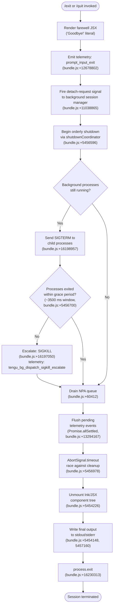

# `/exit`

> Analysis basis: CC v2.1.168 bundle.js (AST extraction + Claude interpretation)
> Minimum version: v2.1.168

---

## Overview

The `/exit` command (aliased as `/quit`) terminates the current Claude Code CLI session immediately. When invoked, it performs an orderly shutdown sequence: it emits a farewell message ("Goodbye!"), fires telemetry, flushes pending I/O, tears down background processes, and ultimately calls `process.exit`. The command is classified as `local-jsx` and is marked `immediate`, meaning it does not wait for any ongoing agent turn before executing.

---

## Registration

| Field | Value |
|---|---|
| type | `local-jsx` |
| name | `exit` |
| description | `null` |
| aliases | `["quit"]` |
| immediate | `true` |
| module_id | `MKK` |
| load_inline | `true` |
| loc_byte | `12679365` |
| loc_byte_end | `12679561` |
| loc_line | `9080` |
| arbor_handler.name | `ixf` |
| arbor_handler.fqn | `claude-2.1.168::ixf` |
| arbor_handler.kind | `AsyncFunction` |
| arbor_handler.resolution_path | `module_id` |
| arbor_handler.n_hits | `1` |

Analysis basis: CC v2.1.168 bundle.js:+12679365

---

## Input Branching

The exit flow has more than three distinct execution branches (UI render, orderly cleanup, forced kill path, post-exit telemetry flush), so a Mermaid flowchart is used.



---

## Behavioral Spec

### Handler Entry — `ixf` (AsyncFunction)

The Arbor-resolved handler is `ixf` (resolved via `module_id → MKK`), an `AsyncFunction`.

Analysis basis: CC v2.1.168 bundle.js:+12678614

```
async function exitCommandHandler(appContext):
    # Step 1: Render the farewell UI component
    farewell_element = createElement(FarewellComponent, props)
    # "Goodbye!" string literal at bundle.js:+12678578
    renderJSXFarewell(farewell_element)

    # Step 2: Signal background/daemon layer
    signalDetachRequest(appContext)          # literal "detach-request" at +11038865
    notifyBackgroundManager(appContext)      # calls backgroundSessionCoordinator

    # Step 3: Initiate shutdown coordinator
    await shutdownCoordinator(appContext)    # ident A9, loc +5456596

    # Step 4: Emit session_end telemetry marker
    emitTelemetryMarker("session_end")       # literal at +5457090
    emitTelemetryMarker("prompt_input_exit") # literal at +12678802
```

### Farewell UI Rendering — `nxf` / `c2`

Analysis basis: CC v2.1.168 bundle.js:+12678569, +12678784

```
function renderFarewellComponent():
    # Outputs the "Goodbye!" string to the terminal via JSX/Ink
    return JSXElement(textComponent, { content: "Goodbye!" })
    # "Goodbye!" literal at bundle.js:+12678578
```

### Background/Daemon Notification — `oMH`

Analysis basis: CC v2.1.168 bundle.js:+12678630, +11038831, +11038865

```
function notifyBackgroundLayer(context):
    signalType = "detach-request"   # literal at +11038865
    writeToBackgroundChannel(signalType, context)
    # calls backgroundWriteHelper (Ae) which uses _e.write
    # calls backgroundStateHelper (S9H)
```

### Shutdown Coordinator — `A9`

This is the central async orchestrator. It manages graceful teardown with a timeout race.

Analysis basis: CC v2.1.168 bundle.js:+5456596

```
async function shutdownCoordinator(context):
    # 1. Initiate a short delay to let UI settle
    await Promise.resolve()
    await setTimeout(shortDelay)            # brief yield

    # 2. Begin unmounting JSX tree and writing final terminal bytes
    await terminalCleanupWriter(context)    # oyH: unmount + writeSync at +5454226, +5454148
    await scrollSummaryWriter(context)      # vR_: writes scroll summary at +5454436
    # telemetry: tengu_scroll_summary at +5455982

    # 3. Drain the NPA (notification/plugin adapter) queue
    await drainNPAQueue()                   # ipH → NPA.drain at +60412

    # 4. Race cleanup against AbortSignal.timeout
    timeoutSignal = AbortSignal.timeout(3500)   # +5456978, constant 3500 at +5456700
    await Promise.race([
        flushAllSettled(context),               # fN9: Promise.allSettled at +13294167
        timeoutRacePromise(500)                 # r8: 500 ms race leg at +5456271
    ])

    # 5. Clear any pending timers, then call process.exit
    clearTimeout(pendingTimer)                  # +5456890
    await forcedExitIfNeeded(context)           # IR_: process.exit at +5454813

    # 6. Emit final telemetry payload
    await telemetryFlush(context)               # Af6 at +5457014
    # tengu_startup_perf at +217609

    # 7. Additional shutdown helpers
    await sessionEndEmitter("session_end")      # P6 at +5457087
    await parallelCleanup(context)              # gz8: Promise.all / Promise.race at +5456124
```

### Terminal Cleanup Writer — `oyH`

Analysis basis: CC v2.1.168 bundle.js:+5454148, +5454226, +5454260

```
function terminalCleanupWriter(state):
    # Write final bytes synchronously
    RfH.writeSync(finalOutputBytes)         # +5454148
    # Look up active Ink instance
    inkInstance = _L.get(instanceKey)       # +5454175
    if inkInstance:
        inkInstance.unmount()               # +5454226
    # Run terminal cursor/screen restore logic (xC)
    restoreTerminalState()                  # xC at +5454260
    # Platform-specific cleanup (cL8)
    platformCleanup()                       # cL8 at +5454308
```

### Platform Cleanup — `cL8`

Analysis basis: CC v2.1.168 bundle.js:+3789061, +3789215, +3789226

```
function platformCleanup():
    # Restore terminal saved cursor position (ESC 7 / ESC 8 sequences)
    # "\x1b7" (save) and "\x1b8" (restore) literals at +3789215, +3789226
    Ea.writeSync(cursorRestoreSequence)     # +3789061
    # Check terminal type: ghostty >= 1.2.0, iTerm.app >= 3.6.6
    # literals at +3516832, +3516862, +3516901, +3516933
    terminalInfo = detectTerminalCapabilities()  # MIH at +3789235
    # Handle tmux escape wrapping (QW, replaceAll "\x1b\x1b" at +3437394)
    # Handle screen multiplexer (literal "screen" at +3437421)
    adjustForMultiplexer()                  # QW at +3789285
    # Write final output segment (O$ at +3789306)
    writeFinalSegment()
```

### Forced Exit — `IR_`

Analysis basis: CC v2.1.168 bundle.js:+5454732, +5454813, +5454838, +5454880

```
function forcedExitIfNeeded(exitCode):
    clearTimeout(exitWatchdog)              # +5454732
    inkInstance = _L.get(instanceKey)       # +5454765
    # Attempt clean exit first
    process.exit(exitCode)                  # +5454813
    # If still running (unreachable under normal conditions), escalate:
    # literal "unreachable" at +5454886
    process.kill(process.pid, signal)       # +5454838
    # Throws Error if neither path terminates cleanly
```

### Background Process Kill Escalation — `w` (via `D`)

Analysis basis: CC v2.1.168 bundle.js:+16197050, +16198957, +16230313

```
function backgroundProcessManager(sessions):
    for session in sessions.values():
        session.kill("SIGTERM")             # "SIGTERM" at +16198957
    # Grace period (30 s / 15 s constants at +16196957, +16196968)
    await waitForGracePeriod()
    if stillRunning:
        session.kill("SIGKILL")             # "SIGKILL" at +16197050
        # telemetry: tengu_bg_dispatch_sigkill_escalate at +16197002

function forcedShutdownHandler():
    # literal "forced shutdown" at +16230294
    IJ()                                    # pre-exit hook
    process.exit(exitCode)                  # +16230313
    z.abort()                               # abort any live AbortControllers +16230334
```

### Telemetry Flush — `Af6` / `y0A`

Analysis basis: CC v2.1.168 bundle.js:+215923, +216167, +217609

```
async function telemetryFlush(config):
    # Collect all pending telemetry via qn8 dispatcher
    pendingEvents = collectPendingEvents()   # qn8 at +217574
    # Build perf report if startup profiling is enabled
    # "startup-perf" literal at +216407, "main_after_run" at +216658
    report = buildPerfReport()              # y0A at +216167
    # Write profiling data to file if over 1 MiB threshold
    # 1048576 constant at +217088
    if report.byteLength > 1048576:
        writeReportToFile(report)           # V0A at +216015, jOH uses fsyncSync
    # Emit tengu_startup_perf event
    emitEvent("tengu_startup_perf")         # +217609
    # Flush log file via appendFile + rename pattern
    # ll8: ny.stat → endsWith(".txt") → ny.rename at +205407, +205500, +205563
    flushLogRotation()
```

---

## State & Side Effects

| Item | Detail |
|---|---|
| Telemetry: `prompt_input_exit` | Fired on command invocation (bundle.js:+12678802) |
| Telemetry: `session_end` | Fired during shutdown coordinator (bundle.js:+5457090) |
| Telemetry: `tengu_scroll_summary` | Fired during scroll-summary write phase (bundle.js:+5455982) |
| Telemetry: `tengu_startup_perf` | Fired during final telemetry flush (bundle.js:+217609) |
| Telemetry: `tengu_cache_eviction_hint` | Fired from cache management layer (bundle.js:+5457052) |
| Telemetry: `tengu_amber_creek` | Fired from UI mode detection layer (bundle.js:+3447047) |
| Telemetry: `tengu_pewter_brook` | Fired from UI mode detection layer (bundle.js:+3446955) |
| Telemetry: `tengu_bg_dispatch_sigkill_escalate` | Fired when a background process requires SIGKILL (bundle.js:+16197002) |
| Telemetry: `tengu_bg_dispatch_low_mem` | Fired when low-memory condition detected during BG teardown (bundle.js:+16197603) |
| Telemetry: `tengu_bg_spare_enable` | Fired when spare background session is enabled (bundle.js:+16198307) |
| Telemetry: `tengu_bg_spare_claim` | Fired when spare session is claimed (bundle.js:+16198435) |
| Telemetry: `tengu_bg_spare_claim_fail` | Fired when spare session claim fails (bundle.js:+16198701) |
| Telemetry: `tengu_daemon_config_reload` | Fired when daemon config reloaded during shutdown (bundle.js:+16212414) |
| Telemetry: `tengu_feature_sad` | Fired from feature-flag / sad-path branch (bundle.js:+1011093) |
| Ink JSX unmount | `inkInstance.unmount()` called on the active Ink render tree (bundle.js:+5454226) |
| Terminal state restore | ESC-7 / ESC-8 cursor save/restore sequences written to stdout (bundle.js:+3789215, +3789226) |
| NPA queue drain | `NPA.drain()` called to flush notification pipeline (bundle.js:+60412) |
| Background session teardown | SIGTERM → SIGKILL escalation for all tracked background sessions (bundle.js:+16198957, +16197050) |
| AbortController abort | All live AbortControllers aborted via `z.abort()` (bundle.js:+16230334) |
| Log rotation | Pending log file flushed and rotated (`.txt` suffix check, `ny.rename`) (bundle.js:+205511, +205563) |
| `process.exit` call | Final call terminates the Node/Bun process (bundle.js:+5454813, +16230313) |
| Sound | <!-- TODO: not found in depth-2 traversal; needs --depth 4 --> |
| appState changes | Session state marked as ended; background session map cleared (bundle.js:+16198573) |

---

## Version History

| Version | Change |
|---|---|
| v2.1.168 | Initial analysis |

---

## Common Mistakes

1. **Expecting `/exit` to wait for an active agent turn.** The command is registered with `immediate: true`, meaning it interrupts any in-progress operation and begins shutdown immediately without waiting for a response.
2. **Assuming `/quit` behaves differently from `/exit`.** The alias `"quit"` is registered at the same registration object and resolves to the identical handler (`ixf`). There is no behavioral difference.
3. **Expecting an instant process termination.** The shutdown sequence involves multiple async phases (NPA drain, telemetry flush, `Promise.allSettled` over cleanup tasks, a 3500 ms AbortSignal timeout race). The process may remain alive for up to a few seconds after the command is issued.
4. **Relying on all background sessions being cleanly terminated.** If background processes do not exit within the grace period (~30 s / 15 s), they receive SIGKILL. The `tengu_bg_dispatch_sigkill_escalate` telemetry event is the indicator this occurred.
5. **Ignoring multiplexer-specific behavior.** Under `tmux` or `screen`, terminal escape sequences are wrapped/rewritten by `platformCleanup` (`cL8`). Cursor restore may not behave identically to a raw terminal session.

---

## Appendix — Identifier Mapping

> For bundle debugging only. Identifiers change across versions.

| Identifier | Role |
|---|---|
| `ixf` | Main exit command handler (AsyncFunction, Arbor-resolved via module_id MKK) |
| `J9` | Process-type / background mode classifier (checks "bg", "daemon", "daemon-worker" literals) |
| `dYH` | Background mode sub-classifier |
| `H` | HTTP bootstrap / fetch utility (also reused as generic local variable) |
| `v` | Debug-level logger / header builder |
| `snK` | Log-level filtering helper |
| `IPA` | Log entry constructor |
| `RH` | JSON serializer wrapper |
| `G4` | Log message formatter / truncator (uses "[REDACTED]" literal) |
| `K0A` | Log field mapper |
| `EUH` | Stream write dispatcher |
| `nWA` | Low-level stream writer |
| `_iK` | Log rotation / file persistence orchestrator |
| `npH` | Timer-managed log batch flusher (clearTimeout / setTimeout / setImmediate) |
| `YKH` | Log file path builder (uses IHH.join) |
| `B76` | EISDIR-safe directory guard |
| `$0A` | Log file path resolver |
| `ll8` | Log file rotation helper (stat / endsWith(".txt") / rename / unlink) |
| `HiK` | Log file append writer (mkdir / appendFile) |
| `j9` | NPA queue registration helper (NPA.register) |
| `Y3` | Bootstrap fetch header assembler |
| `mj_` | URL path parser / splitter |
| `lHH` | Feature-flag set membership tester (o74.has) |
| `uj` | User-agent string sanitizer (H.replace) |
| `H9` | Model/token resolution dispatcher |
| `m6H` | Model capability resolver |
| `Q0` | Model tier lookup |
| `aqH` | Model alias expander |
| `qB` | Token budget / model parameter builder |
| `s9` | Model string normalizer (toLowerCase, trim, replace) |
| `Y2` | Model name regex helper |
| `h4H` | Model family membership checker (y4H.includes) |
| `CI` | Consumption-model selector |
| `DdH` | Downstream model selector |
| `bT` | First-party model builder |
| `lP1` | Model parameter wrapper |
| `lM` | Anthropic-AWS model mapper |
| `NH8` | Model inclusion list checker (AKL.includes) |
| `wdH` | Model override dispatcher (_6) |
| `FJ` | Model resolution entry point |
| `_G` | Gateway/mantle model dispatcher |
| `o6` | Feature SAD (sad-path feature) reporter |
| `l` | Generic utility / shared helper |
| `J6` | Error reporter (hm6) |
| `hm6` | Issue-reporting URL builder ("report the issue at …" literal) |
| `oMH` | Background session detach-request sender |
| `xH8` | Background channel state reader |
| `Cpq` | Background task type resolver ("task" literal) |
| `By8` | Background task builder |
| `b8` | Background session stopper |
| `Ae` | Background channel writer (_e.write) |
| `S9H` | Background session state helper |
| `GM` | Generic module getter |
| `Xh8` | Scheduled-task display renderer ("scheduled task" literal) |
| `jT` | Timer value formatter (tv) |
| `tv` | Time formatting primitive |
| `nwf` | Scheduled-task time calculator (Math.max, Date.now, getTime) |
| `RN` | Cron expression parser (parseInt, match, getUTCDay, setUTCHours) |
| `K` | Padding / column formatter (padEnd, map) |
| `w` | Background session lifecycle manager (spawn, kill, freemem, SIGKILL) |
| `L` | Async operation tracker (q.add, q.delete, f.finally) |
| `j` | Session kill helper (A.values, S.kill) |
| `D` | Forced shutdown executor (process.exit, z.abort, "forced shutdown") |
| `$` | DLK dispatcher |
| `J` | Day-of-week UTC calculator |
| `Dk` | Cron schedule text parser (H.trim, HsL, A.push) |
| `HsL` | Cron field range parser (split, match, parseInt, K.add, Array.from) |
| `ZoH` | Time schedule matcher (setSeconds, setMinutes, getMonth, setDate …) |
| `O` | Background session b8 / stopped state holder |
| `f` | Active session / file-handle map |
| `$9` | Duration humanizer (Math.floor, Math.round) |
| `a9` | String width-aware truncator (indexOf, substring, H8) |
| `H8` | Visual string width calculator (Bun.stringWidth) |
| `W1` | Multi-line width-aware formatter (H8, aY) |
| `aY` | Line-break helper |
| `nxf` | Farewell JSX wrapper (c2) |
| `A9` | Shutdown coordinator (AsyncFunction; main teardown orchestrator) |
| `oyH` | Terminal cleanup writer (writeSync, unmount, restoreTerminalState) |
| `xC` | Terminal cursor/screen restore primitive |
| `cL8` | Platform-specific terminal cleanup (ESC7/8, tmux/screen, ghostty/iTerm) |
| `MIH` | Terminal capability detector (ghostty, iTerm.app version checks) |
| `evH` | Terminal environment variable reader |
| `QW` | Tmux escape sequence wrapper (replaceAll "\x1b\x1b") |
| `O$` | Final output segment writer |
| `vR_` | Scroll summary builder / writer (wT, Cx, R6, j6.dim, replaceAll) |
| `wT` | Scroll content accumulator |
| `Cx` | Scroll content formatter |
| `R6` | Timer primitive (tv) |
| `AG6` | Directory stat helper (statSync, ND.join, d6) |
| `uR` | Timer constructor (tv) |
| `W_` | Timer destructor (tv) |
| `s$` | Resource cleanup helper (R6, r4) |
| `r4` | NPA registration cleanup (j9) |
| `tV9` | Scroll summary text assembler |
| `IR_` | Forced exit executor (clearTimeout, process.exit, process.kill, Error) |
| `ipH` | NPA queue drainer (NPA.drain) |
| `Y` | Supervisor / render-loop manager (write, T.stop, E.stop, E.start, V.start) |
| `$GH` | Telemetry payload builder (V9, V8, pfA, GH, x9, mfA, Object.keys) |
| `V9` | Async-local-storage context getter (eNL.getStore) |
| `V8` | Telemetry value serializer |
| `pfA` | Telemetry field formatter (mfA) |
| `GH` | Telemetry string coercer (String) |
| `UfK` | Telemetry column-width calculator (Object.keys, Math.max, bD) |
| `T` | Heartbeat timer manager (ly6, Y46) |
| `ly6` | Heartbeat start helper |
| `Y46` | Heartbeat stop helper |
| `E` | MCP / connection config manager (stop, updateConfig, start) |
| `TUK` | Supervisor state reporter (S8H) |
| `S8H` | Supervisor state snapshot builder |
| `V` | Render-loop / display start helper |
| `fN9` | Parallel cleanup awaiter (Promise.allSettled, Array.from) |
| `Af6` | Telemetry flush dispatcher (qn8, V0A) |
| `qn8` | Telemetry event collector (y0A, l) |
| `y0A` | Telemetry payload assembler (px, q.set/get, Object.entries, Math.round, Number.parseInt) |
| `V0A` | Perf report writer (I0A, k0A, jOH, G0A, px, JSON.stringify, y0A) |
| `I0A` | Perf report path resolver (e76.join, t8, R6) |
| `jOH` | Sync file writer (openSync, writeFileSync, fsyncSync, closeSync) |
| `G0A` | Startup profiling report formatter (px, A.push, _.entries, wB6, _.at, jr, A.join) |
| `px` | `perf_hooks` require wrapper |
| `k0A` | Alternate perf report path resolver |
| `Fz8` | Session-end summary renderer (wT, sV9, l, aV9, $1) |
| `sV9` | Summary content builder |
| `aV9` | Duration/stats calculator (Date.now, Math.max, Math.round, Object.assign, rV9) |
| `rV9` | Stats sub-calculator |
| `$1` | UI-mode and fullscreen configuration resolver (lHH, NW_, qa, v, VW_, l_, kIL, D6) |
| `NW_` | Fullscreen disable reason builder (_6) |
| `qa` | UI mode resolver (IIL) |
| `VW_` | Platform/mode validator (r6, Boolean) |
| `l_` | Fullscreen state reader (gU) |
| `kIL` | Configuration key lookup (D6) |
| `D6` | App configuration store accessor (cj6, lj6, hu, HwH.has, cq8, Qj6.add, IB.has, IB.get, C6) |
| `wL6` | Shutdown watchdog timer |
| `P6` | Session-end event emitter (hm6) |
| `gz8` | Parallel async cleanup runner (Promise.all, Promise.race, QI, no, H, _, r8) |
| `r8` | Timeout race promise builder (K, Error, q, setTimeout, O, clearTimeout, L.unref) |

---

Note: index built via Arbor fallback; some signals (telemetry, literals) may be missing — see arbor-fallback.js.