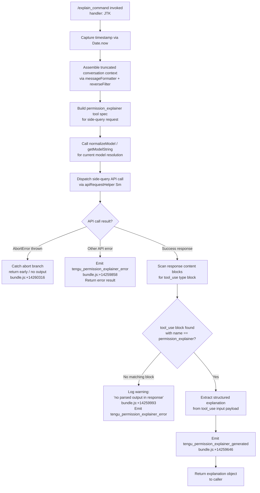

# `/explain_command`

> Analysis basis: CC v2.1.168 bundle.js (AST extraction + Claude interpretation)
> Minimum version: v2.1.168

---

## Overview

`/explain_command` is a `tool`-type slash command that generates a human-readable explanation of why a particular tool or MCP command requires the permissions it does. It invokes an internal "permission explainer" sub-agent (identified as `permission_explainer` in the bundle) via a side-query API call, parses the structured response, and surfaces the explanation to the user. The command is the backing implementation for the in-context permission explanation feature shown when Claude Code asks for user approval on a tool call.

---

## Registration

| Field | Value |
|---|---|
| type | `tool` |
| name | `explain_command` |
| description | `null` (not set in registration object) |
| loc_byte | `14259163` |
| loc_byte_end | `14259199` |
| loc_line | `11300` |
| arbor_handler.name | `JTK` |
| arbor_handler.fqn | `claude-2.1.168::JTK` |
| arbor_handler.kind | `AsyncFunction` |
| arbor_handler.resolution_path | `direct` |
| arbor_handler.n_hits | `1` |

Analysis basis: CC v2.1.168 bundle.js:+14259163

---

## Input Branching

The handler has 4+ distinct paths depending on: whether the conversation history can be assembled, whether the side-query API call succeeds, whether the response contains a parseable `tool_use` block with a `permission_explainer` name, and whether the call is aborted. A Mermaid flowchart is used.



---

## Behavioral Spec

### Top-Level Handler (`JTK`)

```
async function explainCommandHandler(toolInput, context):
    startTime = Date.now()                         // bundle.js:+14258882

    // 1. Build conversation context window
    truncatedHistory = buildTruncatedHistory(      // __5 / A_5 helpers
        conversationMessages,
        maxAssistantMessages = 2,                  // bundle.js:+14258383
        maxCharsPerMessage = 1000,                 // bundle.js:+14258427
        contentType = "text"                       // bundle.js:+14258565
    )

    // 2. Filter to last N assistant turns, reverse order, prepend "..."
    filteredHistory = filterAndReverseHistory(     // A_5 helper
        truncatedHistory,
        role = "assistant"                         // bundle.js:+14258462
    )
    if filteredHistory.length > 3:                 // bundle.js:+14258482
        filteredHistory = filteredHistory.slice(0, 3)
    filteredHistory.unshift("...")                 // bundle.js:+14258666

    // 3. Normalize model identifier for current session
    modelString = normalizeModelId(context.model) // H9 helper, bundle.js:+14259068

    // 4. Build side-query request targeting permission_explainer tool
    sideQueryRequest = buildSideQueryRequest(
        model       = modelString,
        messages    = filteredHistory,
        toolName    = "permission_explainer",      // bundle.js:+14259221
        queryType   = "side_query",                // bundle.js:+13499326
        toolInput   = toolInput
    )

    // 5. Dispatch API call via shared request helper
    try:
        response = await apiRequest(sideQueryRequest) // Sm helper, bundle.js:+14259081

        // 6. Scan response for tool_use block
        explanationBlock = null
        for block in response.content:
            if block.type == "tool_use"            // bundle.js:+14259376
               and block.name == "permission_explainer":
                explanationBlock = block
                break

        if explanationBlock is null:
            log("Permission explainer: no parsed output in response") // bundle.js:+14259993
            emitTelemetry("tengu_permission_explainer_error")
            return errorResult("no_parsed_output")

        // 7. Emit success telemetry and return structured result
        emitTelemetry("tengu_permission_explainer_generated") // bundle.js:+14259646
        return buildSuccessResult(explanationBlock.input)

    catch AbortError:                              // bundle.js:+14260316
        return abortedResult()

    catch apiError:                                // bundle.js:+14260387
        emitTelemetry("tengu_permission_explainer_error") // bundle.js:+14259858
        return errorResult(apiError)
```

Analysis basis: CC v2.1.168 bundle.js:+14258858 (JTK→yzA call), +14259081 (JTK→Sm call), +14259068 (JTK→H9 call)

---

### Conversation History Truncator (`__5` / messageFormatter)

```
function buildTruncatedHistory(messages, maxAssistant, maxCharsEach):
    result = []
    for msg in messages:
        if msg.role != "assistant":                // bundle.js:+14258462
            continue
        textContent = extractTextContent(msg)      // RH helper, bundle.js:+14258373
        truncated = truncateToCharLimit(           // String coerce, bundle.js:+14258399
            textContent,
            limit = maxCharsEach                   // 1000, bundle.js:+14258427
        )
        result.push({ role: msg.role, content: truncated })
    return result
```

Analysis basis: CC v2.1.168 bundle.js:+14258903

---

### History Filter and Reverser (`A_5`)

```
function filterAndReverseHistory(messages, targetRole):
    filtered = messages.filter(m => m.role == targetRole) // bundle.js:+14258439
    reversed = filtered.reverse()                          // bundle.js:+14258507
    // Truncate emoji/surrogate boundary with zr helper    // bundle.js:+14258650
    joined = safeJoin(reversed)                            // bundle.js:+14258699
    return joined
```

Analysis basis: CC v2.1.168 bundle.js:+14258921

---

### Side-Query API Request Dispatcher (`Sm`)

```
async function sideQueryApiRequest(request):
    // Sm is the shared API client used for side queries (non-main-thread requests)
    // It attaches x-app: "cli-bg" header                 // bundle.js:+2973432
    // and X-Claude-Code-Session-Id                       // bundle.js:+2973465
    // Calls globalThis.fetch internally                  // bundle.js:+13499379
    // Emits tengu_api_success on successful completion   // bundle.js:+13500907
    response = await fetchWithAuthAndRetry(request)
    return response
```

Analysis basis: CC v2.1.168 bundle.js:+13499294

---

### Model Identifier Normalizer (`H9`)

```
function normalizeModelId(rawModelString):
    // Applies model alias mapping (opusplan, sonnet, haiku, opus, best)
    // bundle.js:+2247508, +2247549, +2247588, +2247627, +2247664
    // Handles versioned model names like claude-opus-4-*, claude-sonnet-4-*, etc.
    // bundle.js:+2244474 through +2245363
    normalized = applyAliasMap(rawModelString)
    normalized = applyVersionSuffix(normalized)
    return normalized
```

Analysis basis: CC v2.1.168 bundle.js:+14259068

---

### Result Emitter / Response Formatter (`v` / output helpers)

```
function buildSuccessResult(explanationPayload):
    // Wraps structured explanation in the tool result envelope
    // Calls SH (success renderer) and CH (completion handler)
    // bundle.js:+14259745, +14260352
    return {
        type: "tool_result",
        content: explanationPayload
    }

function buildErrorResult(reason):
    // Calls GH (error renderer), bundle.js:+14260197
    return {
        type: "tool_result",
        isError: true,
        content: reason
    }
```

Analysis basis: CC v2.1.168 bundle.js:+14259261 (JTK→v), +14259454 (JTK→RH)

---

## State & Side Effects

| Item | Detail |
|---|---|
| Telemetry — success | `tengu_permission_explainer_generated` (bundle.js:+14259646) |
| Telemetry — error | `tengu_permission_explainer_error` (bundle.js:+14259858) |
| Telemetry — API success (shared) | `tengu_api_success` (bundle.js:+13500907) |
| Side-query HTTP request | Dispatches a background API request with header `x-app: cli-bg` (bundle.js:+2973432) and `X-Claude-Code-Session-Id` (bundle.js:+2973465) |
| Tool name constant | `"permission_explainer"` embedded in request (bundle.js:+14259221) |
| Query type constant | `"side_query"` (bundle.js:+13499326) |
| appState changes | None observed in depth-2 traversal |
| Hook registration | None observed in depth-2 traversal |
| Sound | None observed in depth-2 traversal |
| Abort handling | Catches `AbortError` (bundle.js:+14260316) and returns early without emitting error telemetry |
| Timestamp capture | `Date.now()` recorded at handler entry (bundle.js:+14258882) — likely used for latency telemetry |

---

## Version History

| Version | Change |
|---|---|
| v2.1.168 | Initial analysis |

---

## Common Mistakes

1. **Assuming `/explain_command` is user-facing prose output**: It is a `tool`-type command, not a `prompt`-type. It returns a structured `tool_result` envelope rather than streaming plain text to the terminal.
2. **Expecting a description field**: The `description` field in the registration is `null` (bundle.js:+14259163). Do not rely on it for display or routing logic.
3. **Confusing it with `/help`**: `/explain_command` specifically explains *why a tool needs its permissions*, not what a slash command does in general.
4. **Not handling the abort path**: The handler silently exits on `AbortError` without emitting `tengu_permission_explainer_error`. Callers that key on that telemetry event will miss aborted invocations.
5. **Assuming the response is always a text block**: The handler specifically scans for a `tool_use` content block named `permission_explainer` (bundle.js:+14259376, +14259221). A response containing only text blocks will trigger the "no parsed output" warning path.
6. **Passing the full conversation history**: The handler intentionally truncates to the last 3 assistant messages (bundle.js:+14258482) each capped at 1000 characters (bundle.js:+14258427). Passing long histories is handled gracefully but excess content is discarded.

---

## Appendix — Identifier Mapping

> For bundle debugging only. Identifiers change across versions.

| Identifier | Role |
|---|---|
| `JTK` | Main async handler for `explain_command` (arbor: direct resolution) |
| `yzA` | First-level dispatch helper called by JTK |
| `C6` | Configuration/context accessor |
| `d6` | Low-level config reader |
| `nP_` | Config namespace resolver |
| `LwH` | Config file loader (reads/parses config from disk, handles backups) |
| `U6` | JSON parse wrapper |
| `Hu` | Config header/prefix parser |
| `No1` | Config backup directory scanner |
| `V8` | Config value serializer |
| `v` | General output/render helper (used in multiple contexts) |
| `l` | Logger / low-level emit helper |
| `tP_` | Path join helper for config directories |
| `w` | Background session/worker manager |
| `hVL` | Config file watcher (watchFile/unwatchFile) |
| `co` | Config observation helper |
| `j9` | Hook registration helper (NPA.register) |
| `__5` | Conversation message truncator |
| `RH` | JSON stringify / text content extractor |
| `A_5` | Conversation history filter and reverser |
| `H` | Bootstrap fetch / conversation message manager |
| `mj_` | String split/trim/slice utility |
| `lHH` | Set membership checker |
| `uj` | String replace utility |
| `H9` | Model identifier normalizer |
| `m6H` | Model alias map builder |
| `s9` | Model string canonicalizer |
| `FJ` | Model string formatter |
| `o6` | Feature flag / output helper |
| `J6` | Low-level render helper (hm6 wrapper) |
| `A` | Array/collection helper |
| `f` | Stream/connection close manager |
| `L` | Promise/task set manager |
| `zr` | Safe string truncation (surrogate-aware) |
| `Sm` | Side-query API request dispatcher |
| `PB` | Core API request builder |
| `KD` | AsyncLocalStorage context accessor |
| `J9` | Session ID resolver |
| `dYH` | Session type discriminator |
| `bo` | Auth context getter |
| `vH8` | Auth store accessor |
| `R6` | Request header builder |
| `tv` | Header value formatter |
| `JM_` | URL encode helper |
| `_6` | String coerce / identity helper |
| `B3` | OAuth token checker orchestrator |
| `qJ_` | OAuth token refresh lock manager |
| `sP1` | Boolean coerce wrapper |
| `GY` | Auth profile selector |
| `O4` | Auth configuration reader |
| `Bj` | OAuth profile builder |
| `aL` | Auth method abstraction (MA wrapper) |
| `pX` | Provider context helper |
| `GO` | Auth provider dispatcher |
| `nw6` | No-credentials helper |
| `qlH` | Auth config null-checker |
| `D3` | Debug logger |
| `J2L` | Streaming request builder |
| `acH` | Request timestamp stamper |
| `U_` | URL builder |
| `co6` | Proxy auth helper |
| `sZH` | Proxy auth string builder |
| `k_1` | Proxy auth secondary builder |
| `kd4` | Integer parser with NaN guard |
| `Jh` | Proxy credential formatter |
| `tP` | Proxy timeout helper |
| `Z2L` | HTTP response parser / streaming handler |
| `MA` | Auth method base |
| `Lf` | Response header logger |
| `M` | MCP server registry |
| `bpH` | Response body helper |
| `wW1` | Config reload trigger |
| `Bj_` | Config-based reload helper |
| `V2L` | Header sanitizer (redacts authorization) |
| `E2L` | Debug log emitter |
| `G2L` | Timeout/retry calculator |
| `T2L` | Streaming byte watchdog |
| `jY` | Auth provider lookup |
| `lO6` | Provider config loader |
| `WAL` | Provider prefix checker |
| `ct6` | Provider name normalizer |
| `wY` | Proxy config resolver |
| `dd` | URL scheme parser |
| `MgH` | Proxy credential builder |
| `y_1` | Proxy port resolver |
| `jK_` | Proxy host/IP classifier |
| `PK_` | Proxy bypass checker |
| `X2L` | Environment config reader |
| `N18` | Config env-var merger |
| `_I` | Env var reader |
| `opH` | Config option parser |
| `FTH` | Git bare-repo detector |
| `F1` | OAuth endpoint validator |
| `iYH` | Gateway token refresher |
| `Vd8` | Token expiry checker |
| `sKL` | Gateway refresh HTTP call |
| `mp6` | Gateway response validator |
| `Zd8` | Token timestamp helper |
| `xw6` | Header entry normalizer |
| `UDH` | SDK error/warn logger |
| `R` | Output writer (write/transient handler) |
| `Y` | Supervisor output handler |
| `h` | Background worker sweep manager |
| `k` | Chokidar file watcher wrapper |
| `d` | Scheduled task / grace clock manager |
| `QC6` | Free memory checker |
| `OMK` | Memory threshold calculator |
| `eX6` | Plugin/extension loader |
| `hH` | Hook emitter (logError, push) |
| `B` | Background session set |
| `a8` | Argument resolver |
| `c` | Connection handler (DS6/dgq) |
| `nx8` | Memory threshold helper |
| `D6` | Config reload dispatcher |
| `r` | Voice recording / worker respawn handler |
| `y` | Away-summary controller |
| `_N8` | App state reader |
| `GL5` | Away-summary cache params resolver |
| `_hK` | Away-summary rate-limit checker |
| `V` | Away-summary abort controller |
| `oz8` | Away-summary API call dispatcher |
| `CH` | Completion handler (l + J6) |
| `ybq` | UUID generator (randomUUID) |
| `g` | Output debounce timer |
| `SH` | Success handler (l + J6) |
| `E` | Error/close stream handler |
| `xW` | Auth-based worker launcher (GO wrapper) |
| `oYH` | Provider token exchange orchestrator |
| `kdH` | WIF credential resolver / HTTP fetcher |
| `$4L` | WIF scope checker |
| `T` | Token store (getToken) |
| `ly6` | Token store sub-helper A |
| `Y46` | Token store sub-helper B |
| `X` | Background IPC socket manager |
| `J` | Worker process reference |
| `X5` | Socket end/flush helper |
| `o$5` | Main IPC protocol handler |
| `a$5` | IPC message assembler |
| `$` | PTY/socket write stream |
| `K` | Column formatter |
| `Sz` | Config snapshot accessor |
| `FwA` | Heartbeat helper |
| `HUK` | Lease timeout manager |
| `r8` | Retry-with-backoff helper |
| `P` | TUI repaint controller |
| `e9` | File state tracker |
| `RK` | File path resolver |
| `tHH` | Context link scanner |
| `i$5` | Attach stall detector |
| `m` | PTY flush timer |
| `b` | PTY heartbeat sender |
| `S9H` | Session state reporter |
| `r$5` | Session lifecycle manager |
| `n` | MCP server update handler |
| `U` | Interval cleaner |
| `a` | MCP connection manager |
| `G` | Global MCP connect orchestrator |
| `Cu6` | Raw PTY write helper |
| `W` | Notification helper |
| `GH` | String coerce wrapper |
| `eNH` | Anthropic model version filter |
| `e1` | Model string normalizer |
| `nt6` | Language/locale entry builder |
| `tX` | Header replacement helper |
| `Lc8` | Content filter |
| `Xh` | Provider method wrapper (MA) |
| `dlf` | Conversation role finder |
| `O$A` | SHA-256 hasher |
| `kH8` | Context header builder |
| `jK` | String identity (String coerce) |
| `wM_` | Agent context header builder |
| `$K8` | Config-backed header builder |
| `hhH` | Main API request assembler |
| `GA` | Tool filter builder |
| `DC` | Array/string inclusion checker |
| `_c8` | Cache configuration helper |
| `Ac8` | Cache suffix checker |
| `_N` | HIPAA/compliance filter |
| `oj_` | Compliance config loader |
| `tNH` | Compliance string builder |
| `AM_` | Model inclusion filter |
| `ZzK` | Surrogate pair sanitizer |
| `u18` | Temperature config builder |
| `$2` | Message map helper |
| `TjH` | Tool call formatter |
| `ZB` | Sub-agent spawner |
| `X8` | Sub-agent session manager |
| `kL` | Sub-agent config builder |
| `aWA` | Assistant message transformer |
| `HB6` | Image content detector |
| `ZW` | Deep clone helper (structuredClone) |
| `AB6` | User message transformer |
| `oWA` | Image content replacer |
| `t3H` | API metrics collector |
| `y1` | hm6 callback wrapper A |
| `hm6` | Core render primitive |
| `IW6` | Cache hash calculator |
| `mJ9` | Cache entry manager |
| `YH7` | Cache hit/miss evaluator |
| `_aH` | Cache key builder |
| `kx` | hm6 callback wrapper B |
| `vW6` | Cache version resolver |
| `I38` | SHA hash stream (RJ9.createHash) |
| `Nl` | Agent context prefix resolver |
| `zH7` | Agent name prefix stripper |
| `k38` | Agent name sub-parser |
| `BI_` | Agent name index-of/slice helper |
| `c_H` | Agent name startsWith helper |
| `JL6` | Cache control header builder |
| `u9` | Tool name prefix checker (mcp__ / mcp_tool) |
| `P6` | hm6 callback wrapper C |