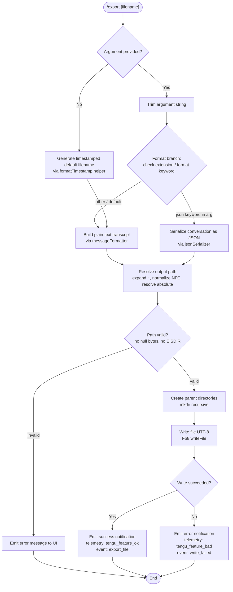

# `/export`

> Analysis basis: CC v2.1.168 bundle.js (AST extraction + Claude interpretation)
> Minimum version: v2.1.168

---

## Overview

The `/export` command serializes the current conversation session to a file on disk. It accepts an optional filename argument; when no filename is provided, a timestamped default name is generated automatically. The command strips ANSI escape codes from message content, formats messages into a human-readable transcript, resolves the output path (including `~` expansion), creates any missing parent directories, and writes the result as UTF-8 text.

---

## Registration

| Field | Value |
|---|---|
| type | `local-jsx` |
| name | `export` |
| description | Export the current conversation to a file or clipboard |
| argumentHint | `[filename]` |
| module_id | `vKK` |
| load_inline | `true` |
| loc_byte | `12695694` |
| loc_byte_end | `12695890` |
| loc_line | `9083` |
| arbor_handler.name | `$uf` |
| arbor_handler.fqn | `claude-2.1.168::$uf` |
| arbor_handler.kind | `AsyncFunction` |
| arbor_handler.resolution_path | `module_id` |
| arbor_handler.n_hits | `0` |

Analysis basis: CC v2.1.168 bundle.js:+12695694

---

## Input Branching

The command has four distinct behavioral branches based on the argument string and the resulting output path, making a Mermaid flowchart the appropriate representation.



Analysis basis: CC v2.1.168 bundle.js:+12695126, +12695166, +12695175, +12695238, +12695373

---

## Behavioral Spec

### 1. Main Handler — `exportCommandHandler` (`$uf`)

The Arbor-resolved handler is the async function `$uf` (FQN: `claude-2.1.168::$uf`, resolved via `module_id` path).

```
async function exportCommandHandler(commandInput, appContext):
    rawContent = buildConversationText(commandInput)       // calls messageBuilder
    trimmedArg = commandInput.args.trim()

    if trimmedArg contains "json" keyword:
        outputText = jsonSerializer(rawContent)            // calls jsonSerializer
    else:
        outputText = rawContent

    if trimmedArg is empty:
        filename = formatTimestamp(new Date())             // calls timestampFormatter
    else:
        filename = trimmedArg

    resolvedPath = resolveOutputPath(filename)             // calls pathResolver

    if resolvedPath is invalid:
        showErrorNotification("Unknown error")
        emit telemetry write_failed
        return

    writeResult = await writeToFile(resolvedPath, outputText, "utf-8")

    if writeResult succeeded:
        showSuccessNotification("export_file")
        emit telemetry tengu_feature_ok
    else:
        showErrorNotification(writeResult.error or "Unknown error")
        emit telemetry tengu_feature_bad
```

Analysis basis: CC v2.1.168 bundle.js:+12695126, +12695135, +12695166, +12695175, +12695193, +12695238, +12695336, +12695373, +12695391, +12695419

---

### 2. Conversation Text Builder — `messageBuilder` (`db8` / `Luf`)

This sub-routine collects all messages from the current conversation and assembles the export body.

```
function buildConversationText(context):
    messages = []
    for each message in conversationHistory:
        role = message.role          // "user" or "assistant"
        textParts = extractTextContent(message)
        cleaned = stripANSI(textParts)    // calls ansiStripper (p4 → Bun.stripANSI)
        messages.push(formatLine(role, cleaned))
    return messages.join(separator)
```

Analysis basis: CC v2.1.168 bundle.js:+12694100, +12694118, +12694125, +12694145, +12693258

---

### 3. Message Content Extractor — `messageContentExtractor` (`Luf` / `Kuf`)

Handles the heterogeneous structure of conversation message objects.

```
function extractTextContent(message):
    if Array.isArray(message.content):
        parts = message.content
            .filter(part => part.type === "text")
            .map(part => part.text)
        return parts
    else:
        return [message.content]
```

The role strings `"user"` and `"assistant"` are literal constants used in filtering.
(Analysis basis: CC v2.1.168 bundle.js:+12694629, +12693258, +12693398)

---

### 4. ANSI Stripper — `ansiStripper` (`p4`)

Delegates directly to `Bun.stripANSI` to remove terminal color/control codes from message text before export.

```
function stripANSI(text):
    return Bun.stripANSI(text)
```

Analysis basis: CC v2.1.168 bundle.js:+12694004, +3847320

---

### 5. Timestamp Filename Generator — `timestampFormatter` (`fuf`)

When no filename argument is supplied, a default filename is constructed from the current wall-clock time.

```
function formatTimestamp(date):
    year   = String(date.getFullYear())
    month  = String(date.getMonth() + 1).padStart(2, "0")
    day    = String(date.getDate()).padStart(2, "0")
    hour   = String(date.getHours()).padStart(2, "0")
    minute = String(date.getMinutes()).padStart(2, "0")
    second = String(date.getSeconds()).padStart(2, "0")
    return "claude-export-{year}{month}{day}-{hour}{minute}{second}.txt"
```

Analysis basis: CC v2.1.168 bundle.js:+12695391, +12694334, +12694352, +12694359, +12694400, +12694438, +12694477, +12694518

---

### 6. Output Path Resolver — `pathResolver` (`_uf` / `T1`)

Validates and fully resolves the target file path before any write is attempted.

```
function resolveOutputPath(inputPath):
    ext = path.extname(inputPath)           // gb8.extname
    if ext is empty:
        inputPath = inputPath + ".txt"      // default extension

    if inputPath contains null bytes:
        throw TypeError("Path contains null bytes")

    normalized = inputPath.normalize("NFC") // Unicode normalization

    if normalized.startsWith("~/"):
        homedir = os.homedir()              // sc6.homedir
        normalized = path.join(homedir, normalized.slice(2))

    if platform === "windows":
        // apply Windows-specific path transformation
        pass

    if path.isAbsolute(normalized):
        return path.resolve(normalized)
    else:
        return path.resolve(cwd, normalized)
```

Default extension applied when none provided: `.txt` (bundle.js:+205511)

Analysis basis: CC v2.1.168 bundle.js:+12690521, +12690561, +1053474, +1053520, +1053727, +1053761, +1053824, +1053842, +1053871, +1053917, +1053984, +1054038

---

### 7. File Writer — `fileWriter` (`Qb8`)

Creates the destination directory tree if needed, then writes the file.

```
async function writeToFile(resolvedPath, content, encoding):
    parentDir = path.dirname(resolvedPath)      // gb8.dirname
    await fs.mkdir(parentDir, { recursive: true })  // Fb8.mkdir
    await fs.writeFile(resolvedPath, content, encoding)  // Fb8.writeFile, "utf-8"
```

Encoding is always `"utf-8"` (bundle.js:+12690692).

Analysis basis: CC v2.1.168 bundle.js:+12690597, +12690617, +12690627, +12690664, +12690692

---

### 8. JSON Serializer — `jsonSerializer` (`RH`)

When the argument includes the `"json"` format keyword, the conversation is serialized via `JSON.stringify`.

```
function jsonSerializer(conversationData):
    return JSON.stringify(conversationData)
```

Analysis basis: CC v2.1.168 bundle.js:+206652, +185264

---

### 9. Message Selection Helper — `messageSelector` (`VKK`)

Filters conversation messages prior to formatting, applying role-based and content-type-based criteria.

```
function selectMessages(allMessages, options):
    userMessages = allMessages.find(m => m.role === "user")
    trimmedArg   = options.args.trim()

    if Array.isArray(userMessages.content):
        textPart = userMessages.content.find(p => p.type === "text")
    else:
        textPart = userMessages.content

    preview = textPart.substring(0, 50)   // limit: 50 chars (bundle.js:+12694847)
    // preview capped at 49 chars in alternate branch (bundle.js:+12694866)
    return selectedMessages
```

Message preview truncation limit: 50 characters (bundle.js:+12694847); alternate branch: 49 characters (bundle.js:+12694866).

Analysis basis: CC v2.1.168 bundle.js:+12694608, +12694724, +12694741, +12694765, +12694832, +12694847, +12694852, +12694866

---

### 10. Streamed File Write Path — `streamedFileWriter` (`_iK` / `HiK`)

A secondary write path handles large or streamed content, using append-based chunked writing with a temporary file and atomic rename.

```
async function streamedFileWriter(content, targetPath):
    tmpPath = targetPath + ".tmp"
    dirPath = path.dirname(targetPath)        // IHH.dirname

    await fs.mkdir(dirPath, { recursive: true })   // ny.mkdir
    byteLength = Buffer.byteLength(content)

    await fs.appendFile(tmpPath, content)          // ny.appendFile

    // atomic swap
    if tmpPath.endsWith(".txt"):
        sliced = tmpPath.slice(0, -4)              // ny.rename source
    await atomicRename(tmpPath, targetPath)        // ll8 → ny.rename
    // on rename error, unlink tmp                 // ny.unlink
```

`.txt` suffix detection literal: `".txt"` (bundle.js:+205511). Rename slice offset: `4` (bundle.js:+205533).

Analysis basis: CC v2.1.168 bundle.js:+206082, +206107, +206115, +206145, +206235, +206252, +206284, +206290, +206323, +206340, +206349

---

### 11. Success / Error Notification — `notificationHelpers` (`SH`, `CH`, `o6`)

Three distinct notification states are emitted via the UI helper chain `l → J6 → hm6`.

```
function notifySuccess(context):
    // tengu_feature_ok path
    displayNotification(context, "export_file", SUCCESS)

function notifyWriteError(context, error):
    // tengu_feature_bad path
    message = error.message or "Unknown error"
    displayNotification(context, "write_failed", ERROR)

function notifyGenericError(context, error):
    // tengu_feature_sad path
    displayNotification(context, error, SAD)
```

Telemetry event literals: `"export_file"` (bundle.js:+12695178), `"write_failed"` (bundle.js:+12695255), `"Unknown error"` (bundle.js:+12695336).

Analysis basis: CC v2.1.168 bundle.js:+12695175, +12695238, +1010948, +1010983, +1011010, +1011046, +1011091

---

## State & Side Effects

| Item | Detail |
|---|---|
| Telemetry — `tengu_feature_ok` | Emitted on successful file write (bundle.js:+1010950) |
| Telemetry — `tengu_feature_bad` | Emitted on write failure (bundle.js:+1011012) |
| Telemetry — `tengu_feature_sad` | Emitted on notification/display error path (bundle.js:+1011093) |
| File system — `mkdir` | Creates parent directory tree recursively before writing |
| File system — `writeFile` | Writes UTF-8 encoded transcript or JSON to resolved path |
| File system — `appendFile` + `rename` | Streamed/chunked write path uses tmp file + atomic rename |
| File system — `unlink` | Cleans up tmp file if atomic rename fails |
| ANSI stripping | All message text is passed through `Bun.stripANSI` before serialization |
| Path normalization | Unicode NFC normalization applied; `~` home expansion performed |
| UI notification | Success or error toast displayed in terminal UI after write attempt |
| No appState mutation | Command does not appear to modify persistent application state beyond emitting UI notifications |
| Sound | <!-- TODO: not found in depth-2 traversal; needs --depth 4 --> |
| Hook registration | <!-- TODO: not found in depth-2 traversal; needs --depth 4 --> |

---

## Version History

| Version | Change |
|---|---|
| v2.1.168 | Initial analysis |

---

## Common Mistakes

1. **Omitting the file extension**: If no extension is included in the filename argument, the command automatically appends `.txt`. Explicitly passing a `.json` extension or `json` keyword is required to trigger JSON serialization.
2. **Relative paths without context**: Relative paths are resolved against the current working directory at invocation time. Running `/export` from different working directories will produce different output locations.
3. **Assuming clipboard output**: Despite the registration description mentioning "clipboard", the analyzed implementation writes exclusively to disk. Clipboard behavior is <!-- TODO: not found in depth-2 traversal; needs --depth 4 -->.
4. **Using paths with null bytes**: The path resolver explicitly rejects paths containing null bytes, throwing a `TypeError`. Paths must be clean UTF-8 strings.
5. **Expecting ANSI codes in output**: All terminal color and control sequences are stripped via `Bun.stripANSI` before writing. The exported file is always plain text regardless of terminal rendering.
6. **Large sessions and temp files**: For large conversations the command may use a chunked append + atomic rename strategy through a `.tmp` file. Interrupting the process mid-write may leave a `.tmp` artifact in the output directory.

---

## Appendix — Identifier Mapping

> For bundle debugging only. Identifiers change across versions.

| Identifier | Role |
|---|---|
| `$uf` | Main export command async handler (Arbor-resolved entry point) |
| `Muf` | Inner dispatch wrapper called by `$uf` |
| `db8` | Conversation text assembler (collects and joins message parts) |
| `Luf` | Message iteration and text extraction loop |
| `quf` | Format-selection helper (export vs prompt branch) |
| `RF` | Command accessibility / plan-mode guard check |
| `GH6` | Event listener / React element creator for UI feedback |
| `Kuf` | Array content type checker for message parts |
| `O` | Background session state accessor |
| `p4` | ANSI strip wrapper (delegates to `Bun.stripANSI`) |
| `Qb8` | File write orchestrator (mkdir + writeFile) |
| `_uf` | Path extension resolver (extname → `.txt` default) |
| `T1` | Full path resolver (normalize, `~` expansion, absolute/relative) |
| `u6` | Platform/OS detection utility |
| `jO` | NFC Unicode normalizer wrapper |
| `SH` | Success notification emitter (`tengu_feature_ok`) |
| `CH` | Write-error notification emitter (`tengu_feature_bad`) |
| `o6` | Generic error notification emitter (`tengu_feature_sad`) |
| `fuf` | Timestamp-based default filename generator |
| `VKK` | Message selector / preview truncator |
| `NKK` | Format-keyword normalizer (lowercases argument) |
| `iL` | Content substring extractor helper |
| `d1` | indexOf + slice utility for content extraction |
| `v` | Export format dispatcher (json vs plain-text branch) |
| `snK` | Plain-text message formatter |
| `IPA` | Individual message line formatter |
| `RH` | JSON serializer (`JSON.stringify` wrapper) |
| `_` | Format keyword string (uppercased for display) |
| `G4` | Filename sanitizer / extension handler |
| `K0A` | Message map transformer |
| `EUH` | Write-stream coordinator |
| `nWA` | Stream write executor |
| `_iK` | Streamed/chunked file write path orchestrator |
| `npH` | Async write scheduler (setTimeout / setImmediate batching) |
| `YKH` | Clipboard / alternate output path handler |
| `d6` | Directory existence check utility |
| `B76` | EISDIR error guard |
| `$0A` | Path join utility for output directory |
| `ll8` | Atomic rename helper (tmp → final, with unlink on failure) |
| `HiK` | Chunked append-write + rename finalizer |
| `j9` | NPA (notification/progress area) registration |
| `Y3` | Session context accessor |
| `mj_` | Argument string parser (split, trim, indexOf, slice) |
| `lHH` | Feature-flag / capability set checker |
| `uj` | String replacement utility |
| `H9` | Markdown/plain-text format router |
| `m6H` | Model name resolver |
| `Q0` | Model tier identifier |
| `aqH` | API provider resolver |
| `qB` | Message text block parser |
| `s9` | Model string normalizer (trim, lowercase, replace) |
| `Y2` | Model alias lookup |
| `h4H` | Anthropic-domain model checker |
| `CI` | Opus/plan model classifier |
| `DdH` | N5 tier dispatcher |
| `bT` | firstParty model resolver |
| `lP1` | Model tier wrapper |
| `lM` | anthropicAws/gateway provider mapper |
| `NH8` | AKL-set inclusion checker |
| `wdH` | `_6` utility dispatcher |
| `FJ` | Format-branch entry (routes to `s9` and `_G`) |
| `_G` | Composite model/provider metadata assembler |
| `l` | UI render helper (base notification component) |
| `J6` | Notification display dispatcher |
| `hm6` | Issue-report URL embedder |
| `O0A` | Output buffer accumulator |
| `fB6` | Promise chain for deferred write |
| `HiK` | (see above — chunked append finalizer) |

---

Note: index built via Arbor fallback; some signals (telemetry, literals) may be missing — see arbor-fallback.js.