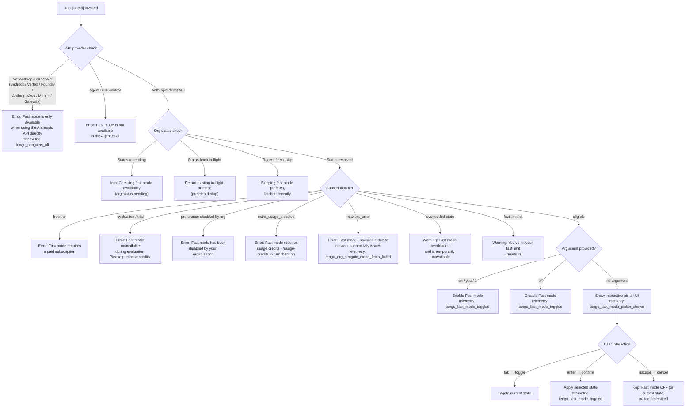

# `/fast`

> Analysis basis: CC v2.1.168 bundle.js (AST extraction + Claude interpretation)
> Minimum version: v2.1.168

---

## Overview

`/fast` toggles Fast mode (a research preview feature) on or off for the current Claude Code session. When invoked, it checks eligibility against the active API provider and subscription tier, then either applies the toggle immediately or displays an interactive picker UI with status information. The command dispatches a `control-request` to the thin-client layer and emits a `tengu_fast_mode_toggled` telemetry event on every state change.

---

## Registration

| Field | Value |
|---|---|
| type | `local-jsx` |
| name | `fast` |
| description | `Toggle fast mode ( ... )` |
| argumentHint | `[on\|off]` |
| immediate | `null` |
| thinClientDispatch | `control-request` |
| isHidden | `null` |
| module_id | `u_K` |
| load_inline | `true` |
| loc_byte | `12454761` |
| loc_byte_end | `12455033` |
| loc_line | `8843` |
| arbor_handler.name | `hRf` |
| arbor_handler.fqn | `claude-2.1.168::hRf` |
| arbor_handler.kind | `AsyncFunction` |
| arbor_handler.resolution_path | `module_id` |
| arbor_handler.n_hits | `3` |

Analysis basis: CC v2.1.168 bundle.js:+12454761

---

## Input Branching

The command has more than three distinct paths depending on provider, subscription state, network availability, and the optional `[on|off]` argument. A Mermaid flowchart is used below.



Analysis basis: CC v2.1.168 bundle.js:+12453795 (handler entry `hRf`), +2232734 (provider error string), +2232999 (SDK error string), +2232253 (subscription-tier strings), +12453929 (picker render)

---

## Behavioral Spec

### 1. Handler Entry — `fastModeCommandHandler` (`hRf`)

```
async function fastModeCommandHandler(commandInput, appState):
    rawArg = commandInput.argument?.trim()
    
    // Step 1: validate eligibility (checkFastModeAvailability)
    eligibilityResult = await checkFastModeAvailability(appState)
    
    if eligibilityResult.unavailable:
        return renderErrorMessage(eligibilityResult.reason)
    
    // Step 2: resolve desired new state
    if rawArg in ["on", "yes", "1"]:
        desiredState = true
    elif rawArg == "off":
        desiredState = false
    else:
        desiredState = showInteractivePicker(appState)   // async, returns bool or cancel
        emit telemetry("tengu_fast_mode_picker_shown")
    
    if desiredState is CANCELLED:
        return renderMessage("Kept Fast mode OFF")
    
    // Step 3: apply state
    applyFastModeState(desiredState, appState)
    emit telemetry("tengu_fast_mode_toggled", {newState: desiredState})
    
    return renderStatusMessage(desiredState)
```

Analysis basis: CC v2.1.168 bundle.js:+12453795

---

### 2. Provider & Availability Check — `checkFastModeAvailability` (`C6H`)

```
function checkFastModeAvailability(appState):
    provider = resolveApiProvider(appState)   // returns bedrock|vertex|foundry|anthropicAws|mantle|gateway|firstParty|…
    
    if provider != "firstParty":
        emit telemetry("tengu_penguins_off")
        return {unavailable: true, reason: "Fast mode is only available when using the Anthropic API directly"}
    
    authMethod = resolveAuthMethod(appState)   // oauth | api-key
    
    if authMethod == "sdk_agent":
        return {unavailable: true,
                reason: "Fast mode is not available in the Agent SDK"}
    
    orgStatus = fetchOrgPenguinStatus(appState)   // may be async/cached
    
    if orgStatus == "pending":
        return {unavailable: false, reason: "pending", status: "Checking fast mode availability"}
    
    return evaluateSubscriptionTier(orgStatus)
```

Analysis basis: CC v2.1.168 bundle.js:+12453809

---

### 3. Subscription Tier Evaluation — `evaluateSubscriptionTier` (inside `C6H`)

```
function evaluateSubscriptionTier(orgStatus):
    tier = orgStatus.tier
    
    switch tier:
        case "free":
            return {unavailable: true, reason: "Fast mode requires a paid subscription"}
        case "evaluation":
            return {unavailable: true,
                    reason: "Fast mode unavailable during evaluation. Please purchase credits."}
        case "preference" (org-disabled):
            return {unavailable: true,
                    reason: "Fast mode has been disabled by your organization"}
        case "extra_usage_disabled":
            return {unavailable: true,
                    reason: "Fast mode requires usage credits · /usage-credits to turn them on"}
        case "network_error":
            emit telemetry("tengu_org_penguin_mode_fetch_failed")
            return {unavailable: true,
                    reason: "Fast mode unavailable due to network connectivity issues"}
        default:
            return {unavailable: false}
```

Analysis basis: CC v2.1.168 bundle.js:+2232227 through +2232645

---

### 4. Org Status Prefetch / Deduplication — `orgStatusPrefetch` (`zdH`)

```
async function orgStatusPrefetch(appState):
    if inFlightPromise exists:
        log("Fast mode prefetch in progress, returning in-flight promise")
        return inFlightPromise
    
    lastFetchTimestamp = readFromCache()
    elapsed = Date.now() - lastFetchTimestamp
    
    if elapsed < recentThreshold:
        log("Skipping fast mode prefetch, fetched recently")
        return cachedResult
    
    auth = resolveAuth(appState)
    if auth is null:
        throw Error("No auth available")
    
    inFlightPromise = fetchOrgStatus(auth)
    
    try:
        result = await inFlightPromise
        writeToCache(result, Date.now())
        emit event via eventEmitter("fM_")
        return result
    catch AxiosError where status in [401, 403]:
        // handle OAuth recovery (see OAuth 401 sub-system)
        ...
    catch NetworkError:
        emit telemetry("tengu_org_penguin_mode_fetch_failed")
        return {status: "network_error"}
    finally:
        clear inFlightPromise
```

Analysis basis: CC v2.1.168 bundle.js:+12453857

---

### 5. Interactive Picker UI — `fastModePickerComponent` (`Yb8` + `Db8`)

```
function fastModePickerComponent(eligibilityResult, appState):
    // Rendered as JSX (local-jsx type)
    currentFastMode = appState.fastMode   // boolean
    
    render panel titled " Fast mode (research preview)"
    
    render toggle row:
        label = "Fast mode"
        valueDisplay = currentFastMode ? "ON " : "OFF"
    
    if eligibilityResult.status == "overloaded":
        render warning: "Fast mode overloaded and is temporarily unavailable"
    
    if eligibilityResult.fastLimitHit:
        render warning: "You've hit your fast limit · resets in <countdown>"
        // countdown uses time-formatting helper ($9) with units:
        //   86400000 ms = days, 3600000 ms = hours, 60 s = minutes
    
    render doc link: "https://code.claude.com/docs/en/fast-mode"
    
    keyboard bindings:
        "tab"    → action "toggle"    (cycles ON/OFF)
        "enter"  → action "confirm"   (applies selection)
        "escape" → action "cancel"    (dismisses, keeps current)
    
    on confirm:
        if newState != currentFastMode:
            emit telemetry("tengu_fast_mode_toggled")
            appState.fastMode = newState
        else:
            render "Kept Fast mode OFF"
    
    return JSX element
```

Analysis basis: CC v2.1.168 bundle.js:+12453929, +12452056, +12452763, +12452832, +12452838, +12453004, +12453058

---

### 6. Fast Mode State Persistence — `applyFastModeState` (`LM_`)

```
function applyFastModeState(enabled, appState):
    // Writes the fastMode flag into application state
    timestamp = Date.now()
    appState.fastMode = enabled
    
    if enabled:
        appState.fastModeActivatedAt = timestamp
        appState.fastModeStatus = "active"
    else:
        appState.fastModeStatus = null
    
    emit CP1 event (internal state-change event bus)
```

Analysis basis: CC v2.1.168 bundle.js:+2233958 (timestamp), +2234059 (CP1 emit), +2234408 ("active" literal)

---

### 7. Cooldown Re-enable — `fastModeCooldownReenableCheck` (`LM_` secondary path)

```
function checkCooldownExpiry(appState):
    if appState.fastModeCooldown and Date.now() > appState.fastModeCooldown.expiresAt:
        log("Fast mode cooldown expired, re-enabling fast mode")
        appState.fastMode = true
        appState.fastModeCooldown = null
        emit CP1 event
```

Analysis basis: CC v2.1.168 bundle.js:+2233946 ("cooldown" literal), +2233999

---

### 8. Flag-Settings Override — `applyFlagSettings` (`i0H`)

The picker component (`Yb8`) also invokes an `applyFlagSettings` path (literal at +12449829) that maps several session flags from incoming configuration onto `appState`:

- `cacheBreakerPhrase` (string)
- `autoCompactWindow` (number)
- `briefTranscript` (boolean/string)
- `isBriefOnly` (boolean)
- `fastMode` (boolean — can forcibly override the toggle)
- `model` (string)

Analysis basis: CC v2.1.168 bundle.js:+12449829, +12449459 ("fastMode" field literal)

---

## State & Side Effects

| Item | Detail |
|---|---|
| Telemetry — `tengu_fast_mode_toggled` | Emitted on every confirmed toggle (on→off or off→on); loc +12450196 |
| Telemetry — `tengu_fast_mode_picker_shown` | Emitted when no `[on\|off]` argument is given and the interactive picker is displayed; loc +12454020 |
| Telemetry — `tengu_penguins_off` | Emitted when the active provider is not the direct Anthropic API; loc +2232840 |
| Telemetry — `tengu_org_penguin_mode_fetch_failed` | Emitted when the org-status network request fails; loc +2237928 |
| appState changes | `fastMode` (boolean), `fastModeStatus` ("active" or null), `fastModeActivatedAt` (timestamp), `fastModeCooldown` object |
| Internal event bus | `CP1.emit` fires after each appState mutation (loc +2234059); `fM_.emit` fires after org-status cache write (loc +2237559) |
| thinClientDispatch | `control-request` — the registration routes the command result back to the thin client layer |
| Config persistence | Fast mode state is part of global/project settings written via the `saveConfigWithLock` path (`sP_`/`X8`) |
| Hook registration | `j9` → `NPA.register` is called from the file-watch subsystem reached through `_iK`; not directly triggered by `/fast` itself |
| Sound | None observed in depth-2 traversal |
| Doc link rendered in picker | `https://code.claude.com/docs/en/fast-mode` (loc +12453278) |

---

## Version History

| Version | Change |
|---|---|
| v2.1.168 | Initial analysis |

---

## Common Mistakes

1. **Using `/fast` on a non-Anthropic provider** — Bedrock, Vertex, Foundry, AnthropicAws, Mantle, and Gateway deployments will always receive the "only available when using the Anthropic API directly" error; the check is provider-type, not model-level.
2. **Expecting immediate effect without a subscription** — Free-tier and evaluation-tier users receive a hard error; no toggle is applied. Use `/usage-credits` to enable extra usage if the `extra_usage_disabled` message appears.
3. **Not waiting for the `pending` state to resolve** — When the org status is `pending`, the command shows a "Checking fast mode availability" message but does not yet apply the toggle. Re-run the command once the org status resolves.
4. **Passing an unsupported argument** — Only `on`, `off`, `yes`, and `1` (truthy) are recognised. Any other string falls through to the interactive picker.
5. **Assuming cooldown is permanent** — An overloaded or rate-limited Fast mode state is temporary; the cooldown expiry logic (`LM_`) will automatically re-enable it once the reset window passes. The picker displays a live countdown.
6. **Agent SDK usage** — When Claude Code is embedded via the Agent SDK, Fast mode is explicitly disabled at the dispatch layer; the `thinClientDispatch: "control-request"` path handles the SDK context separately.

---

## Appendix — Identifier Mapping

> For bundle debugging only. Identifiers change across versions.

| Identifier | Role |
|---|---|
| `hRf` | Main async handler for `/fast` command (`fastModeCommandHandler`) |
| `A4` | Argument normalisation / parsing utility |
| `MA` | String / value mapping helper |
| `_6` | Low-level string coercion utility |
| `H` | Bootstrap/API fetch utility; also used as generic variable across scopes |
| `v` | Terminal output / write helper |
| `snK` | Terminal stream setup |
| `IPA` | TTY initialisation helper |
| `RH` | JSON serialisation wrapper |
| `G4` | Path/filename utility |
| `K0A` | Path map helper |
| `EUH` | Write-stream flush helper |
| `nWA` | Stream write helper |
| `_iK` | Log-file / append-file sink |
| `npH` | Debounced write scheduler |
| `YKH` | Log path builder |
| `d6` | Config directory resolver |
| `B76` | Config value accessor |
| `$0A` | Settings join utility |
| `ll8` | Settings file rotation helper |
| `HiK` | Settings append-file handler |
| `j9` | Hook registrar (`NPA.register`) |
| `mj_` | Message/header parser |
| `lHH` | Feature-flag cache checker |
| `uj` | String replace utility |
| `H9` | Model-selection / resolution entry |
| `m6H` | Model alias resolver |
| `qB` | Model string normaliser |
| `s9` | Model canonicalisation function |
| `Y2` | Model regex helper |
| `h4H` | Model family inclusion check |
| `CI` | Model capability helper |
| `DdH` | Model availability helper |
| `bT` | Model tier helper |
| `lP1` | Model tier wrapper |
| `lM` | Model string formatter |
| `NH8` | Model allowlist checker |
| `wdH` | Model string coercion |
| `FJ` | Model dispatch router |
| `_G` | Model orchestration helper |
| `o6` | Output renderer |
| `J6` | JSX element factory helper |
| `hm6` | Core JSX runtime |
| `C6H` | Fast mode availability checker (`checkFastModeAvailability`) |
| `D6` | Config session loader |
| `cj6` | Config loader helper A |
| `lj6` | Config loader helper B |
| `hu` | Config parse utility |
| `yu` | Config decode utility |
| `cq8` | Config cache / dedup helper |
| `hP_` | Config event emitter |
| `uP_` | Config update applicator |
| `C6` | Settings read/write orchestrator |
| `nP_` | Settings path normaliser |
| `LwH` | Settings file reader/writer with backup |
| `hVL` | Settings file watcher |
| `x8` | App-state selector hook |
| `vn6` | App-state cache lookup |
| `tXA` | App-state cache get |
| `___` | App-state initialiser |
| `eXA` | App-state cache set |
| `kd` | App-state hook builder |
| `W_` | App-state subscribe helper |
| `RL6` | App-state field getter A |
| `Xd8` | App-state field getter B |
| `kL6` | App-state field getter C |
| `kTH` | App-state field getter D |
| `yTH` | App-state field getter E |
| `bL6` | App-state field getter F |
| `TzH` | App-state field getter G |
| `EzH` | App-state field getter H |
| `i8_` | App-state field getter I |
| `kpA` | App-state field getter J |
| `ir` | App-state field getter K |
| `_36` | App-state environment resolver |
| `U_` | Auth token accessor |
| `BpH` | Auth token helper |
| `Sx` | Auth scope validator |
| `TH8` | Token/header formatter |
| `gqL` | Request header builder |
| `zdH` | Org-status prefetch function (`orgStatusPrefetch`) |
| `MM_` | Prefetch cache manager |
| `$q` | Traffic-class selector |
| `dRA` | Traffic-class string helper |
| `xW` | API request executor |
| `GO` | Anthropic API client core |
| `O4` | Request option builder |
| `AN` | API request assembler |
| `cw6` | API helper C |
| `pX` | API helper D |
| `eO6` | API key file descriptor reader |
| `Bj` | OAuth profile helper |
| `aL` | Response mapper |
| `wC` | Response slicer |
| `aV` | Response include-check |
| `cqL` | Access-token extractor |
| `F1` | OAuth endpoint resolver |
| `jIA` | OAuth URL builder A |
| `HM4` | OAuth URL builder B |
| `AB` | In-flight request map manager |
| `AWL` | OAuth 401 recovery orchestrator |
| `uo` | Wh-wrapper |
| `PL6` | Refresh helper A |
| `SH` | Output channel helper A |
| `HlH` | Token expiry checker |
| `CH` | Output channel helper B |
| `sU` | AO1 wrapper |
| `z4` | U21 wrapper |
| `Ar` | Recovery step A |
| `hL6` | Recovery step B |
| `hH` | Error log helper |
| `_WL` | Recovery step C |
| `zp1` | Retry-delay calculator |
| `B3` | qJ_ wrapper (process exit scheduler) |
| `o_` | Settings-load orchestrator |
| `eO` | Settings-load entry |
| `NzH` | Settings path builder |
| `oP` | Settings read helper |
| `Br` | File content reader with encoding |
| `h8` | V8 serialisation helper |
| `e6_` | Settings timestamp writer |
| `IZH` | Settings load validator |
| `Nn6` | Settings path resolver |
| `O$6` | Atomic file writer |
| `LY` | Cache clear utility |
| `hl6` | Gitignore / file-filter helper |
| `u6` | pc6 + W_ wrapper |
| `u6_` | d4 wrapper |
| `yl6` | C_ helper A |
| `GZ4` | Path expansion helper |
| `yuA` | C_ helper B |
| `qu` | Settings join helper |
| `gU` | Settings load-from-disk entry (`loadSettingsFromDisk`) |
| `aE` | Settings pre-load hook |
| `b9` | Memory-usage snapshot helper |
| `A__` | Settings load-completed logger |
| `wp6` | Post-load hook |
| `X8` | Global config save orchestrator |
| `sP_` | Config-with-lock writer |
| `R21` | Config object merger |
| `aj6` | Config lock helper |
| `tP_` | Config backup path builder |
| `dlH` | Config diff helper |
| `Vo1` | Config entries iterator |
| `qK8` | Config timestamp helper |
| `aP_` | Config atomic write helper |
| `Yb8` | Fast mode picker + toggle component |
| `zb8` | Picker sub-component orchestrator |
| `UYH` | Picker header component |
| `eP` | oL wrapper |
| `oL` | uTH wrapper |
| `OdH` | z2 wrapper (model-display helper) |
| `z2` | Model label formatter |
| `i0H` | Flag-settings applicator (`applyFlagSettings`) |
| `PO` | Model picker sub-component |
| `n0H` | Theme/display helper |
| `Cu` | Theme context lookup |
| `ZJ6` | OIL wrapper |
| `tK8` | Theme name validator |
| `zwH` | Theme string parser |
| `ts1` | Theme fallback helper |
| `u4` | App-state + model selector hook |
| `gV` | Model set manager |
| `ZA` | Foreground colour helper |
| `WwH` | ANSI colour string mapper |
| `hc` | Colour helper |
| `_B` | Picker list component |
| `e1` | Model display name formatter |
| `nt6` | l_ wrapper (settings walker) |
| `l_` | Settings-load trigger |
| `tX` | Model string normaliser B |
| `Lc8` | Model label cache |
| `jC` | Token-count formatter (`QP1` wrapper) |
| `QP1` | Number formatter (integer/fixed) |
| `WVH` | Usage display component |
| `Db8` | Fast mode React component (full picker render) |
| `Y6` | App-state context selector |
| `CT_` | App-state context accessor |
| `KA` | App-state context hook |
| `LM_` | Fast mode state applier / cooldown handler |
| `P6` | hm6 wrapper (JSX helper) |
| `DLK` | Telemetry dispatcher |
| `Yo` | b4H wrapper |
| `b4H` | Telemetry payload builder |
| `V9` | Async-local-storage store getter |
| `YC6` | Daemon-status path builder |
| `TA` | MCP handler registrar |
| `nj` | MCP context hook |
| `M` | MCP server manager |
| `xbH` | MCP connection orchestrator |
| `sl` | MCP slot connector |
| `kk` | MCP connection state machine |
| `a8` | MCP config reader |
| `ly6` | MCP filter helper |
| `hhq` | MCP tool discovery |
| `BD8` | MCP tool dispatcher |
| `mD8` | z4 wrapper (MCP) |
| `M8` | MCP debug logger |
| `wk8` | MCP OAuth tool handler |
| `jk8` | MCP OAuth callback handler |
| `phq` | MCP reconnect helper |
| `Ze_` | MCP error handler |
| `tN` | MCP D6 wrapper |
| `hx_` | MCP include checker |
| `v7` | MCP error logger |
| `GH` | String coercion (MCP) |
| `bhq` | MCP auth-flow helper |
| `L16` | parseInt wrapper A |
| `lk8` | parseInt wrapper B |
| `PF8` | MCP connection result applier |
| `bbH` | MCP tool-update helper |
| `Ay` | MCP cleanup orchestrator |
| `cDA` | MCP state reconciler |
| `nD8` | MCP permission checker |
| `r8` | Retry-with-timeout helper |
| `q16` | tXH wrapper |
| `$9` | Time-duration formatter (days/hours/minutes/seconds) |

---

Note: index built via Arbor fallback; some signals (telemetry, literals) may be missing — see arbor-fallback.js.