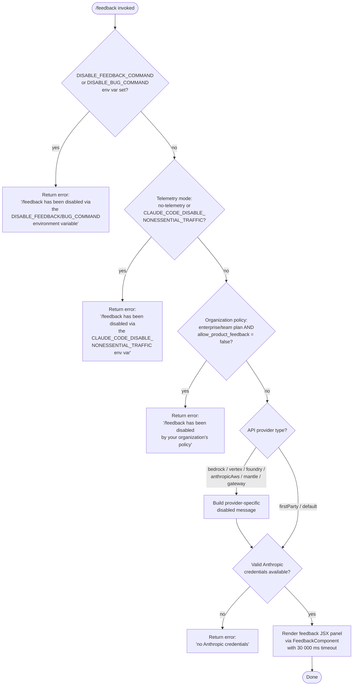

# `/feedback`

> Analysis basis: CC v2.1.168 bundle.js (AST extraction + Claude interpretation)
> Minimum version: v2.1.168

---

## Overview

The `/feedback` command (also aliased as `/share` and `/bug`) opens a UI panel that allows users to submit feedback, report bugs, or share their current conversation with Anthropic. Before presenting the feedback UI, the command performs a multi-layered gate check — examining environment variables, telemetry settings, API provider type, and organizational policy — and refuses to open the panel if any gate disables the feature.

---

## Registration

| Field | Value |
|---|---|
| type | `local-jsx` |
| name | `feedback` |
| description | `Submit feedback, report a bug, or share your conversation` |
| argumentHint | `[report]` |
| aliases | `share`, `bug` |
| module_id | `gmq` |
| load_inline | `true` |
| loc_byte | `11004793` |
| loc_byte_end | `11005016` |
| loc_line | `7299` |
| arbor_handler.name | `Owf` |
| arbor_handler.fqn | `claude-2.1.168::Owf` |
| arbor_handler.kind | `AsyncFunction` |
| arbor_handler.resolution_path | `module_id` |
| arbor_handler.n_hits | `0` |

Analysis basis: CC v2.1.168 bundle.js:+11004793

---

## Input Branching

The handler passes through **five distinct gate branches** before rendering the feedback UI, making a Mermaid flowchart the required representation.



---

## Behavioral Spec

### Top-level Handler — `HandlerOwf`

`HandlerOwf` (`Owf`) is an `AsyncFunction` resolved by Arbor via `module_id → gmq`. It delegates immediately to the JSX renderer `FeedbackRenderer` (`Fmq`).

Analysis basis: CC v2.1.168 bundle.js:+11004624

```
async function HandlerOwf(context):
    return FeedbackRenderer(context)
```

### Environment-Variable Gate — `EnvVarGate`

`EnvVarGate` (`AxH`) is called first inside `FeedbackRenderer` and checks two named environment variables.

Analysis basis: CC v2.1.168 bundle.js:+11004326

```
function EnvVarGate(env):
    if env.DISABLE_FEEDBACK_COMMAND == "disabled":
        return DisabledError(
            "/feedback has been disabled via the DISABLE_FEEDBACK_COMMAND environment variable"
        )
    if env.DISABLE_BUG_COMMAND == "disabled":
        return DisabledError(
            "/feedback has been disabled via the DISABLE_BUG_COMMAND environment variable"
        )
    return null   // gate passed
```

- Disabled string literal: `"disabled"` (bundle.js:+10982668)
- DISABLE_FEEDBACK error string (bundle.js:+10982686)
- DISABLE_BUG error string (bundle.js:+10982827)

### Telemetry / Non-Essential Traffic Gate

After the env-var gate, `EnvVarGate` also calls the telemetry-mode resolver (`$q` → `dRA` → `_6`) to obtain the current traffic policy string. Two values cause a block:

| Policy value | Meaning | loc_byte |
|---|---|---|
| `"no-telemetry"` | Telemetry entirely disabled | +1015052 |
| `"essential-traffic"` | Non-essential traffic disabled | +1014993 |

When either value is active:

```
function TelemetryGate(trafficPolicy):
    if trafficPolicy in ["no-telemetry", "essential-traffic"]:
        return DisabledError(
            "/feedback has been disabled via the CLAUDE_CODE_DISABLE_NONESSENTIAL_TRAFFIC environment variable"
        )
    return null
```

Analysis basis: CC v2.1.168 bundle.js:+10982945, +1015052, +1014993

### Organizational Policy Gate — `OrgPolicyGate`

`OrgPolicyGate` (`X9`) inspects the subscription plan and the `allow_product_feedback` policy flag.

Analysis basis: CC v2.1.168 bundle.js:+10983050

```
function OrgPolicyGate(session):
    plan = session.plan   // e.g. "enterprise", "team", "default"
    if plan in ["enterprise", "team"]:
        if session.policy.allow_product_feedback == false:
            return DisabledError(
                "/feedback has been disabled by your organization's policy"
            )
    return null
```

- `"enterprise"` literal: bundle.js:+4185526
- `"team"` literal: bundle.js:+4185561
- `"allow_product_feedback"` key: bundle.js:+4185827
- Org-policy error string: bundle.js:+10983109

### Provider Identity Resolution — `ProviderResolver`

`ProviderResolver` (`MA` via `AxH`) maps the active API backend to a human-readable provider name string used in the disabled message for third-party providers.

Analysis basis: CC v2.1.168 bundle.js:+10983177

```
function ProviderResolver(providerKind):
    switch providerKind:
        case "bedrock":      return "Amazon Bedrock"
        case "vertex":       return "Vertex AI"
        case "foundry":      return "Microsoft Foundry"
        case "anthropicAws": return "Claude Platform on AWS"
        case "mantle":       return "Amazon Bedrock (Mantle)"
        case "gateway":      return "an API gateway"
        default:             return null   // firstParty / default — not blocked here
```

- `"Amazon Bedrock"` (bundle.js:+10983241)
- `"Vertex AI"` (bundle.js:+10983316)
- `"Microsoft Foundry"` (bundle.js:+10983387)
- `"Claude Platform on AWS"` (bundle.js:+10983471)
- `"Amazon Bedrock (Mantle)"` (bundle.js:+10983554)
- `"an API gateway"` (bundle.js:+10983639)

Third-party provider string keys in `MA`: `"bedrock"` (+2100952), `"foundry"` (+2101002), `"anthropicAws"` (+2101058), `"mantle"` (+2101112), `"vertex"` (+2101160), `"firstParty"` (+2101169).

### Credentials Gate — `CredentialsGate`

`CredentialsGate` (`EB`) checks whether valid Anthropic credentials exist before allowing the feedback panel to open.

Analysis basis: CC v2.1.168 bundle.js:+10983678

```
function CredentialsGate(authContext):
    if authContext is third-party provider:
        // "Anthropic auth not used on third-party providers" (+3039689)
        // Still checked for OAuth token presence
        if not authContext.oauthToken:
            return DisabledError("no Anthropic credentials")

    if authContext uses cloud gateway:
        // "Not available when using a Cloud gateway" (+3039954)
        return DisabledError("no Anthropic credentials")

    if not authContext.apiKey and not authContext.oauthToken:
        // "No API key available" (+3040039)
        return DisabledError("no Anthropic credentials")

    return null   // credentials present
```

- `"no_creds"` tag (bundle.js:+10983716)
- `"no Anthropic credentials"` error (bundle.js:+10983733)

### Feedback UI Renderer — `FeedbackRenderer`

After all gates pass, `FeedbackRenderer` (`Fmq`) creates a JSX element via `I_A.createElement` and wires a 30 000 ms timeout.

Analysis basis: CC v2.1.168 bundle.js:+11004406, +11004182

```
function FeedbackRenderer(context):
    // Run gates sequentially
    envError     = EnvVarGate(process.env)
    if envError: return envError

    telError     = TelemetryGate(resolveTelemetryMode())
    if telError: return telError

    orgError     = OrgPolicyGate(context.session)
    if orgError: return orgError

    providerName = ProviderResolver(context.provider)
    credError    = CredentialsGate(context.auth)
    if credError: return credError

    timestamp = Date.now()   // captured at render time (+11004163)

    return createElement(FeedbackJSXComponent, {
        provider:    providerName ?? "public",   // "public" (+11004599)
        timeout:     30000,
        onSubmit:    submitFeedbackPost,
        context:     context
    })
```

- `Date.now()` call: bundle.js:+11004163
- 30 000 ms timeout constant: bundle.js:+11004182
- `"public"` provider fallback label: bundle.js:+11004599
- HTTP method `"post"` for submission: bundle.js:+10983773

### Feedback Submission Transport — `SubmitFeedbackPost`

The feedback payload is sent via a `"post"` HTTP action (bundle.js:+10983773). The transport layer reuses the same HTTP bootstrap infrastructure (`H` → `v`) used for other API calls, with a 5 000 ms inner fetch timeout (bundle.js:+15797859) and a `"Content-Type: application/json"` header (bundle.js:+15797743, +15797758).

```
async function submitFeedbackPost(payload):
    headers = {
        "Content-Type": "application/json",
        "User-Agent":   buildUserAgent()
    }
    response = await fetchWithTimeout(feedbackEndpoint, {
        method:  "post",
        headers: headers,
        body:    JSON.stringify(payload),
        timeout: 5000
    })
    return response
```

Analysis basis: CC v2.1.168 bundle.js:+10983773, +15797743, +15797858

### Log-rotation Subsystem — `LogRotator`

The feedback command touches the log-rotation helpers (`_iK` → `HiK`, `ll8`, `B76`, `$0A`) when capturing conversation context to attach to the report. Key behaviors observed:

- Checks file existence via `ny.stat` (bundle.js:+205407)
- Renames `.txt` log segments (`.txt` suffix: bundle.js:+205511; rotation count 4: bundle.js:+205533)
- Appends to log file via `ny.appendFile` (bundle.js:+205895)
- Measures buffer size via `Buffer.byteLength` (bundle.js:+206290)
- Enforces a write-queue with `setTimeout` (1 000 ms: bundle.js:+59671) and batching (100 items: bundle.js:+59692)

Analysis basis: CC v2.1.168 bundle.js:+206284, +205407

### API Key Sanitization in Debug Headers

When constructing debug/auth headers, the value `"[REDACTED]"` (bundle.js:+198252) is substituted for the last two characters (constant `2`: bundle.js:+198281) of a credential string to prevent accidental leakage.

Analysis basis: CC v2.1.168 bundle.js:+198252

---

## State & Side Effects

| Item | Detail |
|---|---|
| Telemetry | `tengu_feature_sad` fired on feedback-sad path (bundle.js:+1011093) |
| HTTP request | `POST` to Anthropic feedback endpoint when submission proceeds (bundle.js:+10983773) |
| Log file I/O | Conversation log segments read/rotated/appended for attachment (bundle.js:+205407, +205895) |
| Write queue | Async write queue with 1 000 ms flush timer and 100-item batch limit (bundle.js:+59671, +59692) |
| `Date.now()` | Timestamp captured at render time for the submission payload (bundle.js:+11004163) |
| Environment reads | `DISABLE_FEEDBACK_COMMAND`, `DISABLE_BUG_COMMAND`, `CLAUDE_CODE_DISABLE_NONESSENTIAL_TRAFFIC` checked at invocation (bundle.js:+10982668, +10982827, +10982945) |
| Session/policy reads | `plan` field and `allow_product_feedback` policy flag read from session (bundle.js:+4185526, +4185827) |
| `NPA.register` | Hook registration call observed in write-queue setup (bundle.js:+60369) |

---

## Version History

| Version | Change |
|---|---|
| v2.1.168 | Initial analysis |

---

## Common Mistakes

1. **Invoking `/feedback` on a third-party provider and expecting it to work** — providers such as Amazon Bedrock, Vertex AI, Microsoft Foundry, and others will cause the credentials gate to refuse the command unless valid Anthropic OAuth/API credentials are also present alongside the third-party credentials.
2. **Setting `DISABLE_FEEDBACK_COMMAND` without realising `/bug` is also blocked** — the command is registered under both aliases; the env-var gate checks a separate `DISABLE_BUG_COMMAND` variable, so both must be set to suppress both aliases.
3. **Expecting feedback to work under a `no-telemetry` or `CLAUDE_CODE_DISABLE_NONESSENTIAL_TRAFFIC` configuration** — the telemetry gate blocks the command entirely in those modes; no partial submission is attempted.
4. **Enterprise/team administrators forgetting `allow_product_feedback` controls this command** — setting the organization policy flag to `false` silently disables `/feedback` for all users on the plan.
5. **Assuming `/share` is a separate command** — it is simply an alias for `/feedback` registered at the same entry (bundle.js:+11004793) and shares all gate logic.

---

## Appendix — Identifier Mapping

> For bundle debugging only. Identifiers change across versions.

| Identifier | Role |
|---|---|
| `Owf` | Top-level async handler for `/feedback` (Arbor-resolved, FQN `claude-2.1.168::Owf`) |
| `Fmq` | JSX feedback renderer / main orchestrator function |
| `AxH` | Environment-variable gate + telemetry-mode check |
| `$q` | Telemetry/traffic-policy resolver |
| `dRA` | Traffic-policy value lookup helper |
| `_6` | Low-level string / value utility |
| `X9` | Organizational policy gate (plan + allow_product_feedback) |
| `Df9` | Policy flag accessor |
| `sIH` | Policy sub-checker (calls `cC`, `LP6`, `b7H`) |
| `cC` | Session/plan classifier |
| `MA` | Provider-identity resolver (maps kind strings to display names) |
| `Lf` | Plan label helper |
| `GO` | Auth credential builder / validator |
| `Bj` | OAuth token handler |
| `ILH` | Policy-lookup inner helper |
| `EB` | Credentials gate (OAuth / API key presence check) |
| `Wc` | Third-party provider auth bypass helper |
| `aL` | Auth context accessor |
| `GA` | OAuth token retrieval |
| `GY` | OAuth flow orchestrator |
| `DC` | Array/header inclusion checker |
| `xW` | Cloud-gateway credentials path handler |
| `H` | Bootstrap fetch / HTTP client |
| `v` | Core fetch wrapper |
| `snK` | HTTP request builder |
| `IPA` | Platform/encoding helpers |
| `RH` | JSON.stringify wrapper for request body |
| `G4` | User-agent / header string builder |
| `K0A` | Header map constructor |
| `A` | URL/path string utility |
| `EUH` | Stream/write helper |
| `nWA` | Write-stream wrapper |
| `_iK` | Log-file write-queue manager |
| `npH` | Async write-queue flusher (setTimeout/setImmediate) |
| `YKH` | Log-rotation entry writer |
| `d6` | Directory path resolver |
| `B76` | File-exists / EISDIR guard |
| `$0A` | Log file path builder |
| `ll8` | Log file rotation handler (stat / rename / unlink) |
| `HiK` | Log append + rotation orchestrator |
| `j9` | Hook registration (NPA.register) |
| `Y3` | Response status checker |
| `mj_` | Command argument parser (split / trim / indexOf / slice) |
| `lHH` | Known-command set membership test |
| `uj` | Input string sanitizer |
| `H9` | Conversation context builder |
| `m6H` | Message formatter |
| `Q0` | Message type classifier |
| `aqH` | Conversation segment extractor |
| `qB` | Message content normalizer |
| `s9` | Model-ID resolver |
| `Y2` | Model alias expander |
| `h4H` | Model family membership test |
| `CI` | Model tier selector (lM / N5) |
| `DdH` | Default model selector |
| `bT` | Model name builder |
| `lP1` | Preferred-model resolver |
| `lM` | Primary model accessor |
| `NH8` | Model inclusion list checker |
| `wdH` | Model string transformer |
| `FJ` | Full model resolution pipeline |
| `_G` | Model context assembler |
| `o6` | Sad-path / error reporter (fires `tengu_feature_sad`) |
| `l` | Low-level event emitter |
| `J6` | Error notification dispatcher |
| `hm6` | Issue-report URL builder (`https://github.com/anthropics/claude-code/issues`) |
| `Bmq` | Timestamp capture (`Date.now()`) at render start |

---

Note: index built via Arbor fallback; some signals (telemetry, literals) may be missing — see arbor-fallback.js.