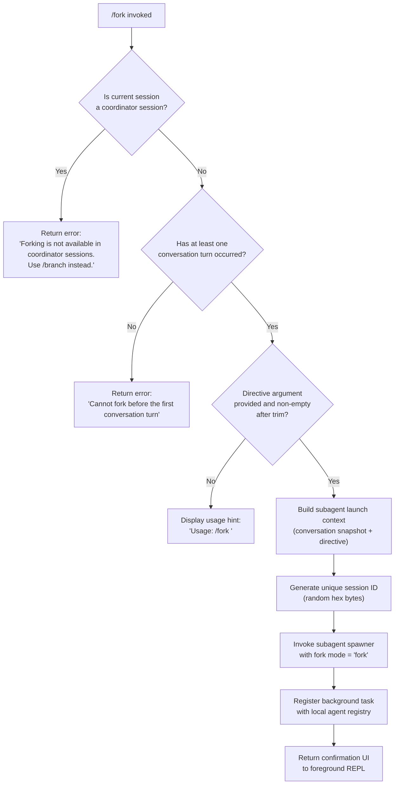

# `/fork`

> Analysis basis: CC v2.1.168 bundle.js (AST extraction + Claude interpretation)
> Minimum version: v2.1.168

---

## Overview

`/fork` spawns a background agent that inherits the full current conversation context and executes an independent directive. The forked agent runs asynchronously as a subagent, taking a snapshot of the conversation messages up to the point of invocation as its starting state, then pursuing the user-supplied directive autonomously.

---

## Registration

| Field | Value |
|---|---|
| type | `local-jsx` |
| name | `fork` |
| description | `Spawn a background agent that inherits the full conversation` |
| argumentHint | `<directive>` |
| module_id | `uAK` |
| load_inline | `true` |
| loc_byte | `12512168` |
| loc_byte_end | `12512371` |
| loc_line | `8941` |
| arbor_handler.name | `KCf` |
| arbor_handler.fqn | `claude-2.1.168::KCf` |
| arbor_handler.kind | `AsyncFunction` |
| arbor_handler.resolution_path | `module_id` |
| arbor_handler.n_hits | `0` |

Analysis basis: CC v2.1.168 bundle.js:+12512168

---

## Input Branching

The handler has four distinct branches based on session state and argument presence.



Analysis basis: CC v2.1.168 bundle.js:+12511727, +12511865, +12511938, +12511751

---

## Behavioral Spec

### Argument Validation

```
function validateForkInput(rawArgument):
    trimmed = rawArgument.trim()
    if trimmed is empty:
        display "Usage: /fork <directive>"
        return INVALID
    return trimmed
```

Analysis basis: CC v2.1.168 bundle.js:+12511727, +12511751

### Session Guard Checks

Before any fork attempt, two pre-conditions are evaluated in order:

1. **Coordinator session guard** — If the current session is a coordinator session, the command aborts immediately with the literal message `"Forking is not available in coordinator sessions. Use /branch instead."` (Analysis basis: CC v2.1.168 bundle.js:+12511865)

2. **First-turn guard** — If no conversation turns have occurred yet, the command aborts with `"Cannot fork before the first conversation turn"` (Analysis basis: CC v2.1.168 bundle.js:+12511938)

### Conversation Snapshot Construction

```
function buildForkContext(currentSession, directive):
    appState = currentSession.getAppState()
    messages = collectConversationMessages(appState)
    // Trim to last 50 messages (indices 49 and below) for snapshot
    snapshotMessages = messages.slice(-50)
    contextRef = { type: "fork-context-ref", messages: snapshotMessages }
    return { directive, contextRef }
```

Analysis basis: CC v2.1.168 bundle.js:+10967264, +10967562, +13220476

The slice bound constants `50` and `49` appear at bundle.js:+10967261 and +10967274, indicating a message window limit on the inherited context.

### Subagent Launch

```
function launchForkedAgent(forkContext):
    sessionId = generateRandomHex(8)          // 8 random bytes → hex string
    timestamp = Date.now()
    launchParams = {
        mode: "fork",
        sessionId: sessionId,
        timestamp: timestamp,
        type: "local_agent",
        status: "running",
        agentType: "general-purpose",
        messages: forkContext.snapshotMessages,
        directive: forkContext.directive,
        permissionMode: inheritFromParent(),
        allowedTools: inheritFromParent(),
        disallowedTools: inheritFromParent(),
        flagSettings: inheritFromParent()
    }
    registerTask(launchParams)               // adds to local agent registry
    spawnSubagentProcess(launchParams)       // async; does not block foreground
    return launchConfirmationUI(sessionId)
```

Analysis basis: CC v2.1.168 bundle.js:+12511819, +10967318, +10967331, +6870510, +10530039, +10530084, +10967076

The literal `"fork"` at bundle.js:+10967076 confirms the mode flag passed into the subagent launch infrastructure. The literal `"resume"` at bundle.js:+10967195 suggests a complementary resume path that reuses the same launcher.

### System Prompt Injection for Forked Agent

The forked agent receives a `"system"` role message (bundle.js:+12511791) whose content is assembled by the system-prompt builder (`buildSystemPrompt`). Relevant prompt components identified in the call graph include:

- Memory prompt segments (memory load, team memory if enabled)
- Environment info block (`env_info_static`, `env_info_simple`)
- Output style and language instructions
- Context management settings (brief, scratchpad, focus)
- Agent-thread note: `"- Agent threads always have their cwd reset between bash calls, as a result please only use absolute file paths."` (Analysis basis: CC v2.1.168 bundle.js:+13437613)

### Background Agent Lifecycle

Once spawned, the forked agent is managed by the subagent supervisor loop (`supervisorLoop`). Key lifecycle constants observed in the call graph:

- Stall timeout: 600,000 ms (10 minutes) — bundle.js:+6961935
- Maximum turns before telemetry fires: see `tengu_forked_agent_default_turns_exceeded` — bundle.js:+10943424
- Terminal states: `"subagent_complete"`, `"subagent_stall_timeout"`, `"killed"`, `"cancelled"` — bundle.js:+6963063, +6963083, +6964890, +6965047

The forked agent reports progress through `query_progress` events (bundle.js:+6963325) and sends `subagent_end` on termination (bundle.js:+6959492).

### Coordinator Mode Detection

```
function isCoordinatorSession(sessionContext):
    launchMode = sessionContext.get("subagent_fork_coordinator_mode")
    return launchMode is truthy
```

Analysis basis: CC v2.1.168 bundle.js:+10966903

The literal `"subagent_fork_coordinator_mode"` confirms that coordinator sessions carry a distinguishing flag that `/fork` checks. The related `"subagent_launch"` literal at bundle.js:+10966885 is the general launch-type discriminator.

---

## State & Side Effects

| Item | Detail |
|---|---|
| Telemetry | `tengu_forked_agent_default_turns_exceeded` (bundle.js:+10943424); `tengu_async_agent_stall_timeout` (bundle.js:+6962826); `tengu_agent_tool_completed` (bundle.js:+6958911); `tengu_agent_tool_terminated` (bundle.js:+6965071); `tengu_slim_subagent_claudemd` (bundle.js:+9553905); `tengu_shale_finch` (bundle.js:+6955501); `tengu_quartz_heron` (bundle.js:+5368530) |
| Hook registration | Forked agent participates in `SubagentStart` and `SubagentStop` hook events; `TaskCompleted` hook fires on subagent completion (bundle.js:+13363131, +13363151) |
| appState changes | Parent session appState is read (not mutated) to build the snapshot. The local agent registry is updated with a new entry (type `local_agent`, status `running`). |
| File system | A subagent directory is created via `xe.mkdir`; a symlink for the subagent is created/removed with `xe.symlink`/`xe.unlink`; transcript files are written to a `transcriptSubdir` (bundle.js:+13292700, +9561865) |
| Sound | No sound side-effect found in depth-2 traversal |
| Process | A new subprocess is spawned via `YQ.spawn` (bundle.js:+16198764) carrying the forked agent's work |
| AbortSignal | A per-fork `AbortController` is created; it is wired to the stall-timeout path so the subagent can be killed after 600 000 ms of silence |

---

## Version History

| Version | Change |
|---|---|
| v2.1.168 | Initial analysis |

---

## Common Mistakes

1. **Running `/fork` before any message exchange** — The command requires at least one completed conversation turn. Attempting it on a fresh session produces the error `"Cannot fork before the first conversation turn"`.

2. **Using `/fork` inside a coordinator session** — Coordinator sessions (used for multi-agent orchestration) block `/fork` entirely and redirect users to `/branch`. The error message names `/branch` explicitly.

3. **Omitting the directive argument** — Without a non-empty directive, the command only echoes the usage hint `"Usage: /fork <directive>"` and does nothing. The argument is trimmed before the emptiness check, so whitespace-only strings are also rejected.

4. **Expecting the fork to share live state** — The forked agent receives a static snapshot of up to the last 50 messages. Any state changes in the parent session after `/fork` is issued are not visible to the forked agent.

5. **Assuming the fork blocks the foreground** — The forked agent runs fully asynchronously. The parent REPL returns to the prompt immediately; results arrive later via background task notifications.

6. **Expecting working-directory inheritance to be automatic for all tools** — The forked agent's cwd is reset between bash calls; only absolute file paths are reliable inside the forked agent.

---

## Appendix — Identifier Mapping

> For bundle debugging only. Identifiers change across versions.

| Identifier | Role |
|---|---|
| `KCf` | Main handler for `/fork` command (AsyncFunction) |
| `K_A` | Subagent launch orchestrator; builds context and triggers spawn |
| `bDf` | Fork context builder; reads appState and assembles message snapshot |
| `b_` | Message snapshot helper; calls `getAppState`, uses `findLast` |
| `GE` | System-prompt assembler for subagent |
| `mS` | Core REPL/subagent main-loop function |
| `jtH` | Subagent supervisor / watchdog loop |
| `d_6` | Local agent registration helper |
| `LbH` | Subagent directory and symlink setup |
| `Uu8` | Pending-set manager for in-flight subagents |
| `WS` | Random bytes generator (produces session ID hex) |
| `Omq` | Directive-trim helper |
| `Pp` | System-prompt retrieval wrapper |
| `Yv8` | Message-history packager for subagent context |
| `xs` | Model/context normalization for subagent invocation |
| `sd` | AsyncLocalStorage runner wrapper |
| `KD` | AsyncLocalStorage store getter |
| `PT6` | Individual subagent turn executor |
| `EG` | Model stream event processor inside subagent turn |
| `wT6` | Auto-mode classifier for tool permission decisions |
| `Nw8` | Handoff classifier and output emitter |
| `ADf` | Main agent query function (drives LLM calls) |
| `hP` | Hook execution engine |
| `VMH` | Background session manager |
| `QI6` | Session initialiser for background agent |
| `W6` | Bridge/worker session lifecycle manager |
| `W3A` | Bridge transport layer (reads/writes internal events) |
| `fH` | MCP session transport |
| `M6` | MCP session scheduler |
| `mj_` | Conversation message parser/splitter |
| `lHH` | Hook-set membership checker |
| `H9` | System-prompt section builder |
| `m6H` | Model-selection resolver |
| `s9` | Model string normaliser |
| `snK` | Bootstrap fetch helper |
| `_iK` | Transcript/log file writer |
| `HiK` | Log-file append-and-rotate helper |
| `ll8` | Log file stat and rename helper |
| `YKH` | Log path builder |
| `npH` | Streaming I/O buffer manager |
| `v` | HTTP bootstrap fetch function |
| `RH` | JSON stringifier wrapper |
| `G4` | Conversation truncation/redaction helper |
| `K0A` | Message map builder |
| `EUH` | Stream write helper |
| `nWA` | Raw write wrapper |
| `B76` | EISDIR-safe file writer |
| `$0A` | Path joiner for log files |
| `R6` | `tv`-based logging utility |
| `W_` | `tv`-based logging utility (variant) |
| `uR` | `tv`-based logging utility (variant) |
| `lZ` | Path/environment resolver for subagent sockets |
| `Kb` | AbortController factory with max-listeners guard |
| `TY9` | Signal bind helper |
| `lq` | Max-listeners setter |
| `a2` | Pending-record timestamp helper |
| `e$` | Socket path builder |
| `RMA` | Subagent work-directory creator |
| `R86` | Subagent socket-file opener |
| `hH` | Error logger with PFH push |
| `DU9` | OpenTelemetry span manager for subagent spawn |
| `LPH` | Tracing context enter-with helper |
| `PS` | Active span getter |
| `vhH` | Span-type attribute setter |
| `Xp` | Subagent exit/cleanup handler |
| `zD8` | Subagent exit state recorder |
| `wU9` | Span end/attribute finaliser |
| `fPH` | Tracing context restore helper |
| `NhH` | Span status setter |
| `SG6` | Stale-entry cleanup helper |
| `wtH` | Subagent task-state updater (on completion) |
| `SAH` | Speculation abort handler |
| `pHA` | Task timestamp recorder |
| `Dz` | Log flush helper |
| `DPH` | Task-state updater (on progress) |
| `vw8` | Task-state updater (on intermediate update) |
| `Iw8` | Compact-boundary message filter |
| `YPH` | Tool-call result batcher |
| `ubH` | Permission-mode resolver for tool calls |
| `GT6` | Task update dispatcher |
| `H5H` | Task watcher trigger |
| `WT6` | Scheduled task watcher |
| `Vw8` | Combined progress + watcher updater |
| `MtH` | Heartbeat/progress timer |
| `Ew8` | Subagent completion/error classifier |
| `cZ` | Last-assistant-message finder |
| `Pk` | Tool-name case normaliser |
| `h4` | Telemetry event emitter |
| `DfH` | Tool-type lower-case mapper |
| `TJ7` | Handoff-result cache checker |
| `ChH` | Token-budget progress emitter |
| `bhH` | Cache-key resolver |
| `hK` | Recursive cache key builder |
| `sK` | Text-type message filter |
| `RhH` | Token-count formatter |
| `QU9` | Subagent output classifier (entry) |
| `wT6` | Classifier model call loop |
| `PU` | Classifier prompt builder |
| `y1` | `hm6`-based render helper |
| `GH` | String converter utility |
| `_OH` | Stall-timeout state setter |
| `Q` | Process-kill / reconnect helper |
| `U` | Interval clear helper |
| `b4H` | Output trimmer |
| `C` | Rate-limit event enqueuer |
| `g` | Transient display writer |
| `j` | Active-process kill sweeper |
| `k` | Chokidar/stream renderer |
| `R` | TTY write helper |
| `h` | Watchdog sweep function |
| `d` | Grace-clock and retirement manager |
| `QC6` | Memory usage reporter |
| `OMK` | Memory log emitter |
| `eX6` | Smaps/status file reader |
| `nx8` | Memory threshold log helper |
| `D6` | Telemetry dispatch function |
| `r` | Voice-recording finisher (unrelated branch reached via BFS) |
| `Fp9` | Absolute-value delta checker |
| `gp9` | Per-process timing cache getter/setter |
| `Sj7` | Process-thread name recorder |
| `qw8` | Tracing metadata writer |
| `rfH` | System-prompt getter for subagent |
| `gI6` | Subagent CLAUDE.md loader |
| `cu9` | Subagent socket path setter |
| `mo_` | Token-cache entry deleter |
| `lu9` | Socket path deleter |
| `ZhH` | Fx-cache entry deleter |
| `wB9` | Shale-finch telemetry helper |
| `Ru9` | bF-cache deleter / DhH transcript writer |
| `DhH` | Transcript directory + file writer |
| `gl` | Vu9 cache getter |
| `po_` | Post-agent cleanup sweep |
| `nfH` | Per-agent state updater |
| `bp9` | All-agent state sweep |
| `VG` | Agent state value object |
| `a26` | Supplemental appState reader |
| `RXH` | Final appState merge helper |
| `iHf` | In-process tool registration helper |
| `ju9` | Auxiliary tool init |
| `CN8` | Context-name resolver |
| `U_6` | Skill-progress cache manager |
| `Vk6` | Skill-name trimmer |
| `J0` | Tool-result collector |
| `ZOf` | Tool-result store getter |
| `VOf` | Tool-result batch writer |
| `Mh6` | Tool-result message builder |
| `QfH` | Deferred-tool filter |
| `fJ` | Tool-status getter |
| `$w7` | Tool find-by-id helper |
| `n2q` | Task-state observer |
| `SP` | State-pointer resolver |
| `mbH` | Micro-batch helper |
| `VMH` | Background session pipeline entry |
| `Dv` | Session context builder |
| `KOK` | Object-value iterator for session events |
| `LOK` | Session event mapper |
| `QH` | Message-window slicer |
| `oH` | Message writer for background session |
| `nHf` | MCP tool loader for subagent |
| `pF` | MCP scope filter |
| `al` | MCP entry object builder |
| `eoH` | Hook-entry object builder |
| `FfH` | Tool-search feature checker |
| `nN` | Tool-search standard path |
| `Ns` | Vertex AI tool-search suppressor |
| `MbH` | Y4-membership checker |
| `gs_` | Deferred-tools pool change handler |
| `FY8` | C6-based feature-flag evaluator |
| `C6` | Feature-flag lookup |
| `bN8` | Context initialiser for new subagent session |
| `RN8` | MCP tool permission resolver |
| `uk6` | Bundled MCP tool filter |
| `Sn` | MCP tool-set builder |
| `JAH` | Tool permission checker |
| `_Nq` | Token-budget cache read/write |
| `HN` | Max-turns integer parser |
| `nS_` | Tool-name deduplication and ranking |
| `tyH` | Exponential-backoff timer |
| `AG` | Combined model + tool normalisers caller |
| `Uo_` | r4 registration wrapper |
| `r4` | j9 hook registrar |
| `A9H` | vbH + r4 combined hook setup |
| `vbH` | Hook filter and batch builder |
| `F_6` | Fork-context meta file writer (`.meta.json`, `.jsonl`) |
| `n$K` | Socket path resolver for fork context |