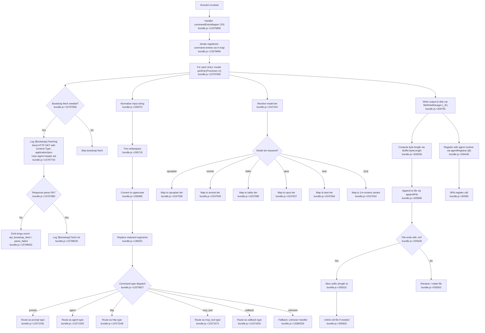

# `/function`

> Analysis basis: CC v2.1.168 bundle.js (AST extraction + Claude interpretation)
> Minimum version: v2.1.168

---

## Overview

The `/function` command is a `function`-type slash command that dispatches a mapped set of registered sub-commands to the Claude Code agent. Its core mechanism iterates over a collection of command entries (via `H.map`) and, for each entry, routes through a multi-stage input processing pipeline that normalizes, resolves, and writes output to disk, ultimately registering the result with the agent runtime.

---

## Registration

| Field | Value |
|---|---|
| type | `function` |
| name | `function` |
| description | `null` |
| loc_byte | `13380215` |
| loc_byte_end | `13380248` |
| loc_line | `10710` |
| arbor_handler.name | `Tcf` |
| arbor_handler.fqn | `claude-2.1.168::Tcf` |
| arbor_handler.kind | `Function` |
| arbor_handler.resolution_path | `direct` |
| arbor_handler.n_hits | `1` |

Analysis basis: CC v2.1.168 bundle.js:+13380215

---

## Input Branching

The command's call graph reveals 5+ distinct branches within the core input-processing function (command-type dispatch, content-type header routing, model-tier resolution, file rotation logic, and error/fallback paths). A Mermaid flowchart is used.



---

## Behavioral Spec

### Top-Level Handler: commandEntryMapper

The primary handler `Tcf` is resolved directly within the registration byte range (resolution path: `direct`, 1 hit).

```
function commandEntryMapper(commandList):
    // bundle.js:+13379896
    results = commandList.map(entry => perEntryProcessor(entry))
    // Also dispatches to resultFinalizer (Z$H) at bundle.js:+13379967
    resultFinalizer(results)
    return results
```

Analysis basis: CC v2.1.168 bundle.js:+13379896

---

### Sub-feature: Per-Entry Processor

The per-entry processor `v` handles bootstrap fetching, input normalization, type dispatch, model-tier resolution, file I/O, and agent registration for each command entry.

```
async function perEntryProcessor(entry):
    // bundle.js:+15797656

    // 1. Bootstrap fetch if needed
    if bootstrapRequired(entry):
        log("[Bootstrap] Fetching")   // bundle.js:+15797658
        response = httpGet(entry.url, {
            "Content-Type": "application/json",   // bundle.js:+15797743
            "User-Agent": agentString              // bundle.js:+15797777
        })
        wait up to 5000 ms                         // bundle.js:+15797859
        if not parseable(response):
            emitEvent("api_bootstrap_fetch", "parse_failed")  // bundle.js:+15798002
        else:
            log("[Bootstrap] Fetch ok")            // bundle.js:+15798032

    // 2. Query registered module map
    cached = moduleMap.get(entry.id)               // bundle.js:+15797694

    // 3. Parse and normalize entry identifier
    normalized = identifierParser(entry.name)      // bundle.js:+15797798, via mj_

    // 4. Check reserved identifier set
    if reservedIdentifiers.has(normalized):        // bundle.js:+15797829, via lHH
        normalized = sanitizeIdentifier(normalized) // via uj, bundle.js:+15797841

    // 5. Apply model-tier resolution and type dispatch
    processed = typeAndModelProcessor(entry, normalized)  // via H9, bundle.js:+15797844

    return processed
```

Analysis basis: CC v2.1.168 bundle.js:+15797656

---

### Sub-feature: Input String Normalizer

The input normalization chain operates on raw string input, transforming it through several sequential steps.

```
function inputNormalizer(rawInput):
    // bundle.js:+206570
    if debugMode:
        log("debug", rawInput)                       // bundle.js:+206570

    // Check if rawInput is in known set
    isKnown = knownSet.includes(rawInput)            // bundle.js:+206634

    // Build JSON representation for unknown inputs
    if not isKnown:
        jsonForm = jsonStringifier(rawInput)         // via RH → JSON.stringify, bundle.js:+185264

    // Uppercase transform
    upper = rawInput.toUpperCase()                   // bundle.js:+206696

    // Apply redaction replacement
    redacted = extensionResolver(upper)              // via G4, bundle.js:+206716
    // G4 replaces redacted segments (literal "[REDACTED]", bundle.js:+198252)
    // Uses lastIndexOf to find extension boundary (bundle.js:+198336)
    // Slices result (bundle.js:+198362)

    // Trim
    trimmed = redacted.trim()                        // bundle.js:+206719

    // Debug-level format emit
    debugEmit(trimmed)                               // via iy, bundle.js:+206735

    // Write normalized form to output channel
    outputWriter(trimmed)                            // via EUH → nWA → H.write, bundle.js:+193301

    return trimmed
```

Analysis basis: CC v2.1.168 bundle.js:+206570

---

### Sub-feature: Identifier Parser

Parses a raw identifier string into its canonical component parts for use in dispatch.

```
function identifierParser(raw):
    // bundle.js:+2979391, via mj_
    parts = raw.split(delimiter)
    candidate = parts[0].trim()                      // bundle.js:+2979430
    sepIndex = candidate.indexOf(separator)          // bundle.js:+2979454
    if sepIndex >= 0:
        return candidate.slice(0, sepIndex)          // bundle.js:+2979494
    return candidate
```

Analysis basis: CC v2.1.168 bundle.js:+2979391

---

### Sub-feature: Type and Model Processor

Dispatches on command type and resolves model tier using keyword matching.

```
function typeAndModelProcessor(entry, normalized):
    // bundle.js:+2243492, via m6H

    // 1. Normalize and classify
    canonical = canonicalizer(normalized)            // via Q0, bundle.js:+2243339
    annotated = annotator(canonical)                 // via aqH, bundle.js:+2243373
    modelTierObj = modelTierResolver(annotated)      // via yA, bundle.js:+2243423

    // 2. Model tier resolution (via s9, bundle.js:+2247412)
    lowerInput = normalized.trim().toLowerCase()     // bundle.js:+2247412, 2247423
    modelTier = modelKeywordMapper(lowerInput)       // via Y2 → R4H, bundle.js:+2247441

    // Keyword → tier mapping:
    //   "opusplan" → opusplan tier  (bundle.js:+2247508)
    //   "[1m]"     → 1m-context     (bundle.js:+2247534)
    //   "sonnet"   → sonnet tier    (bundle.js:+2247549)
    //   "haiku"    → haiku tier     (bundle.js:+2247588)
    //   "opus"     → opus tier      (bundle.js:+2247627)
    //   "best"     → best tier      (bundle.js:+2247664)

    // 3. Vendor/provider-prefix check
    if lowerInput.includes("anthropic."):            // bundle.js:+2241469
        entry.isFirstParty = true                    // bundle.js:+2243716

    // 4. Type dispatch
    switch entry.type:
        case "prompt":   routeAsPrompt(entry)        // bundle.js:+12471491
        case "agent":    routeAsAgent(entry)         // bundle.js:+12471520
        case "http":     routeAsHTTP(entry)          // bundle.js:+12471548
        case "mcp_tool": routeAsMCPTool(entry)       // bundle.js:+12471572
        case "callback": routeAsCallback(entry)      // bundle.js:+12471634
        default:         routeAsUnknown(entry)       // bundle.js:+13380329

    return entry
```

Analysis basis: CC v2.1.168 bundle.js:+2243492

---

### Sub-feature: File Write Manager

Manages persistent file I/O for command output, including directory creation, appending, file rotation, and cleanup.

```
async function fileWriteManager(content, targetPath):
    // bundle.js:+206082, via _iK

    // 1. Clear any pending write timeout
    clearTimeout(pendingTimer)                       // bundle.js:+59783

    // 2. Compute target directory
    dir = path.dirname(targetPath)                   // bundle.js:+206115

    // 3. Check file existence (stat)
    stat = await fs.stat(targetPath)                 // bundle.js:+205407

    // 4. Ensure directory exists
    await fs.mkdir(dir, { recursive: true })         // bundle.js:+205836

    // 5. Append content to file
    await fs.appendFile(targetPath, content)         // bundle.js:+205895

    // 6. Check for rotation trigger
    byteSize = Buffer.byteLength(content)            // bundle.js:+206290

    if targetPath.endsWith(".txt"):                  // bundle.js:+205500
        // Strip ".txt" suffix (4 chars)             // bundle.js:+205522, literal 4
        basePath = targetPath.slice(0, -4)           // bundle.js:+205522
    else:
        // Rename to rotated path
        await fs.rename(targetPath, rotatedPath)     // bundle.js:+205563
        await logRotationEvent()                     // via h8, bundle.js:+205591
        await fs.unlink(oldPath)                     // bundle.js:+205603

    // 7. Build final output path
    finalPath = path.join(dir, baseName)             // bundle.js:+205767, via $0A

    // 8. Check EISDIR condition and handle
    try:
        validationCheck(finalPath)                   // via B76 → V8, bundle.js:+175684
    catch err if err.code == "EISDIR":               // bundle.js:+175692
        handleDirectoryConflict(finalPath)

    // 9. Schedule deferred write flush
    //    Batch window: 1000 ms max, 100 entries max   // bundle.js:+59671, 59692
    timer = setTimeout(flushBatch, 1000)             // bundle.js:+59947
    pendingEntries.push(content)                     // bundle.js:+59982

    // 10. Register with agent runtime
    agentRegistrar(finalPath)                        // via j9 → NPA.register, bundle.js:+60369
```

Analysis basis: CC v2.1.168 bundle.js:+206082

---

### Sub-feature: Model Keyword Mapper (Detail)

This function normalizes model-related string tokens to typed tier descriptors, supporting both exact matches and substring-based fuzzy recognition.

```
function modelKeywordMapper(lowerStr):
    // bundle.js:+2247441, via Y2 → R4H

    // Exact/prefix checks (ordered by priority)
    if contains(lowerStr, "opusplan"):  return { tier: "opusplan" }    // +2247508
    if contains(lowerStr, "[1m]"):      return { tier: "1m_context" }  // +2247534
    if contains(lowerStr, "sonnet"):    return { tier: "sonnet" }      // +2247549
    if contains(lowerStr, "haiku"):     return { tier: "haiku" }       // +2247588
    if contains(lowerStr, "opus"):      return { tier: "opus" }        // +2247627
    if contains(lowerStr, "best"):      return { tier: "best" }        // +2247664

    // Provider routing (via lM → MA)
    if providerType == "anthropicAws":  return { provider: "aws" }     // +2101625
    if providerType == "gateway":       return { provider: "gateway" } // +2101645
    if providerType == "mantle":        return { provider: "mantle" }  // +2244357
    if providerType == "firstParty":    return { provider: "first" }   // +2243716

    return { tier: "default" }
```

Analysis basis: CC v2.1.168 bundle.js:+2247441

---

### Sub-feature: Output Write Finalizer

The write finalizer (`nWA`) handles the final stream write of normalized content.

```
function outputWriteFinalizer(channel, content):
    // bundle.js:+193301, via nWA
    channel.write(content)
```

Analysis basis: CC v2.1.168 bundle.js:+193301

---

### Sub-feature: Agent Registrar

Registers the processed command output path with the agent's native plugin adapter (NPA).

```
function agentRegistrar(outputPath):
    // bundle.js:+60369, via j9
    NPA.register(outputPath)
```

Analysis basis: CC v2.1.168 bundle.js:+60369

---

### Sub-feature: Result Finalizer

After all entries are processed, the result finalizer `Z$H` performs cleanup or downstream dispatching on the collected results array.

```
function resultFinalizer(results):
    // bundle.js:+13379967, via Z$H
    // <!-- TODO: not found in depth-2 traversal; needs --depth 4 -->
    processResults(results)
```

Analysis basis: CC v2.1.168 bundle.js:+13379967

---

## State & Side Effects

| Item | Detail |
|---|---|
| Telemetry | `tengu_feature_sad` (bundle.js:+1011093) — emitted during feature-sad path inside `o6 → l` |
| Bootstrap telemetry | `api_bootstrap_fetch` with property `parse_failed` emitted on JSON parse failure (bundle.js:+15797980, +15798002) |
| HTTP fetch | Bootstrap GET request with `Content-Type: application/json` and `User-Agent` header, 5000 ms timeout (bundle.js:+15797743, +15797777, +15797859) |
| File I/O | `fs.mkdir`, `fs.appendFile`, `fs.rename`, `fs.unlink`, `fs.stat` — manages output file lifecycle including rotation (bundle.js:+205407, +205563, +205603, +205836, +205895) |
| NPA registration | `NPA.register(outputPath)` — registers resolved path with native plugin adapter (bundle.js:+60369) |
| Deferred batch timer | `setTimeout` with 1000 ms window; up to 100 entries batched before flush (bundle.js:+59671, +59692, +59947) |
| `setImmediate` flush | Used to yield the event loop during batch processing (bundle.js:+60040) |
| `clearTimeout` | Active timer is cancelled on each new write initiation (bundle.js:+59783) |
| EISDIR guard | Detects directory-collision errors during file validation; error code `"EISDIR"` handled explicitly (bundle.js:+175692) |
| Path truncation | `.txt` suffix stripped (4 characters) when detected (bundle.js:+205511, +205522) |
| Content redaction | `"[REDACTED]"` literal substituted during normalization (bundle.js:+198252) |
| Identifier reservation | `reservedIdentifiers` set checked via `lHH → o74.has` (bundle.js:+844383) |
| appState changes | <!-- TODO: not found in depth-2 traversal; needs --depth 4 --> |
| Sound | <!-- TODO: not found in depth-2 traversal; needs --depth 4 --> |

---

## Version History

| Version | Change |
|---|---|
| v2.1.168 | Initial analysis — `function`-type command handler `Tcf` resolved via direct Arbor resolution |

---

## Common Mistakes

1. **Assuming `/function` maps to a single action.** The command is a dispatcher that iterates over all registered entries via `H.map`; each entry is independently processed through the full normalization and type-dispatch pipeline.
2. **Ignoring command-type routing.** The five recognized type values — `prompt`, `agent`, `http`, `mcp_tool`, `callback` — each invoke distinct downstream handlers. Unrecognized types fall through to the `unknown` fallback (bundle.js:+13380329), not an error.
3. **Overlooking the bootstrap fetch.** The 5000 ms HTTP bootstrap fetch (bundle.js:+15797859) occurs conditionally per entry. Parse failures emit a telemetry event silently rather than throwing; callers should not expect an exception.
4. **Misinterpreting `.txt` file rotation.** Files ending in `.txt` are handled by suffix-stripping (4 chars, bundle.js:+205522), not renamed. Non-`.txt` paths undergo `fs.rename` followed by `fs.unlink` of the old path.
5. **Not accounting for the 1000 ms deferred write batch.** File writes are coalesced with a `setTimeout(1000)` timer (bundle.js:+59947); content is not immediately flushed to disk on every call.
6. **Confusing model tier with provider.** Keywords like `"sonnet"`, `"opus"`, `"haiku"` select model tiers, while `"anthropicAws"`, `"gateway"`, `"mantle"`, `"firstParty"` select provider routing; these are orthogonal properties resolved in the same pipeline stage.

---

## Appendix — Identifier Mapping

> For bundle debugging only. Identifiers change across versions.

| Identifier | Role |
|---|---|
| `Tcf` | Top-level command entry mapper (main handler for `/function`); resolved via Arbor direct path |
| `H` | Per-entry processor driver; orchestrates bootstrap fetch, module-map lookup, normalization, and model resolution |
| `v` | Core per-entry processing function; called for each mapped command entry |
| `snK` | Sub-processor invoked from `v`; delegates to `KI`, `M0A`, `IPA` |
| `IPA` | Inner processor; calls `edK` and `HcK` |
| `RH` | JSON stringifier wrapper; delegates to `JSON.stringify` |
| `_` | Raw input string variable in normalization context |
| `G4` | Extension/redaction resolver; handles `[REDACTED]` substitution, `lastIndexOf`, and `slice` |
| `K0A` | Extension map builder; calls `inK.map` |
| `q` | File path or candidate string variable; also references `opK.unlinkSync` |
| `A` | String variable used in extension resolution and `toLowerCase` context |
| `EUH` | Output write dispatcher; delegates to `nWA` |
| `nWA` | Output write finalizer; calls `H.write` on the output channel |
| `_iK` | File write manager; orchestrates mkdir, appendFile, rename, unlink, stat, buffer sizing, and agent registration |
| `npH` | Deferred batch write scheduler; manages `clearTimeout`, `setTimeout`, `setImmediate`, push/join queues |
| `YKH` | Path composition helper; calls `r76`, `IHH.join`, `t8`, `R6` |
| `d6` | Auxiliary value or config parameter used in file write manager |
| `B76` | File validation function; delegates to `V8`; catches `EISDIR` errors |
| `$0A` | Final output path builder; calls `IHH.join` and `R6` |
| `ll8` | File rotation handler; performs stat, endsWith, slice, rename, unlink |
| `HiK` | Append-write handler; calls mkdir, appendFile, B76, $0A, ll8, Buffer.byteLength, O0A |
| `j9` | Agent registrar; calls `NPA.register` |
| `Y3` | Auxiliary step in per-entry processor chain |
| `mj_` | Identifier parser; performs split, trim, indexOf, slice |
| `lHH` | Reserved-identifier set checker; calls `o74.has` |
| `uj` | Identifier sanitizer; calls `H.replace` |
| `H9` | Type-and-model processor coordinator; calls `m6H`, `s9`, `FJ` |
| `m6H` | Model-entry builder; calls `Q0`, `aqH`, `yA`, `qB` |
| `Q0` | Canonical form builder |
| `aqH` | Entry annotator |
| `qB` | Command-entry classifier; performs trim, startsWith, includes, maps over entries |
| `s9` | Model keyword and tier resolver; trim/toLowerCase + keyword dispatch |
| `Y2` | Model tier keyword mapper entry point; delegates to `R4H` |
| `h4H` | Model keyword inclusion checker; calls `y4H.includes` |
| `CI` | Model tier constructor variant 1; calls `lM`, `N5` |
| `DdH` | Model tier constructor variant 2; calls `N5` |
| `bT` | Model tier constructor variant 3; calls `lM`, `N5`, `MA` |
| `lP1` | Tier wrapper; delegates to `bT` |
| `lM` | Provider mapper; delegates to `MA` |
| `NH8` | Inclusion guard for provider list; calls `AKL.includes` |
| `wdH` | Provider routing helper; calls `_6` |
| `FJ` | Full type-dispatch coordinator; calls `s9` and `_G` |
| `_G` | Type-dispatch switch body; calls `GA`, `g6H`, `gYH`, `jdH`, `bT`, `z2`, `lM`, `MA`, `N5`, `CI` |
| `o6` | Feature-sad path handler; calls `l` and `J6`; emits `tengu_feature_sad` |
| `l` | Feature-sad inner handler |
| `J6` | Feature-sad secondary handler; calls `hm6` |
| `hm6` | Lowest-level feature-sad utility (bundle.js:+3628) |
| `Z$H` | Result finalizer; processes the mapped results array after all entries complete |

---

Note: index built via Arbor fallback; some signals (telemetry, literals) may be missing — see arbor-fallback.js.