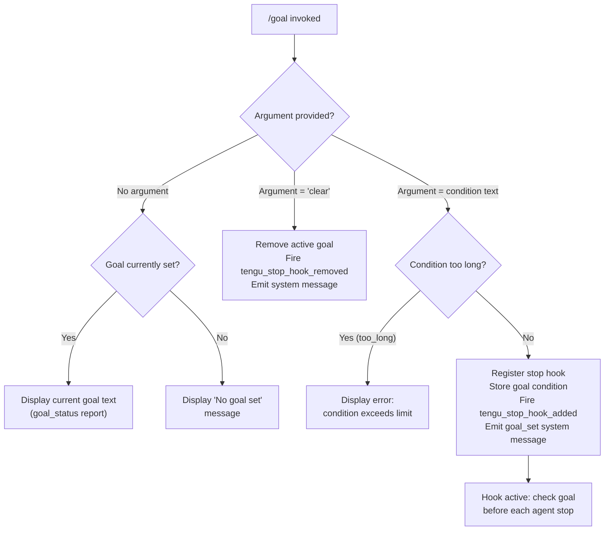

# `/goal`

> Analysis basis: CC v2.1.168 bundle.js (AST extraction + Claude interpretation)
> Minimum version: v2.1.168

---

## Overview

The `/goal` command allows users to set a persistent condition that Claude evaluates before stopping an agentic session. When a goal is active, Claude checks the condition at each potential stop point and only halts if the goal has been met. The command also supports clearing the currently active goal and reporting goal status.

---

## Registration

| Field | Value |
|---|---|
| type | `local-jsx` |
| name | `goal` |
| description | `Set a goal Claude checks before stopping` |
| argumentHint | `[<condition> \| clear]` |
| immediate | `true` |
| module_id | `I5K` |
| load_inline | `true` |
| loc_byte | `13014382` |
| loc_byte_end | `13014568` |
| loc_line | `9628` |
| arbor_handler.name | `GFf` |
| arbor_handler.fqn | `claude-2.1.168::GFf` |
| arbor_handler.kind | `AsyncFunction` |
| arbor_handler.resolution_path | `module_id` |
| arbor_handler.n_hits | `0` |

Analysis basis: CC v2.1.168 bundle.js:+13014382

---

## Input Branching

The command has four distinct input paths based on the argument supplied and the current goal state:



Analysis basis: CC v2.1.168 bundle.js:+13013065, +13013083, +13013111, +13013136, +13013222, +13013233

---

## Behavioral Spec

### 1. Argument Parsing and Normalization

The handler `GFf` first trims whitespace from the raw user argument string.

```
function parseGoalArgument(rawArg):
    trimmed = rawArg.trim()                      // GFf → A.trim @ +13012977
    if trimmed is empty:
        return { mode: "STATUS" }
    if trimmed.toLowerCase() == "clear":         // Sy8 → H.toLowerCase @ +10829076
        return { mode: "CLEAR" }
    return { mode: "SET", condition: trimmed }
```

Analysis basis: CC v2.1.168 bundle.js:+13012977, +13013083

### 2. Status Display (No Argument)

When called with no argument, the handler reads the current goal from application state via `getAppState` and either renders the stored goal text or displays the literal string `"No goal set"`.

```
function displayGoalStatus(appState):
    currentGoal = appState.getGoal()
    if currentGoal is null or empty:
        renderMessage("No goal set")            // literal @ +13013136
    else:
        renderMessage(currentGoal)
```

Analysis basis: CC v2.1.168 bundle.js:+13013136

### 3. Clear Mode

When the argument is `"clear"` (case-insensitive), the active stop hook is unregistered and the goal is removed from application state. A `"system"` category message is emitted to the conversation.

```
function clearGoal(context):
    removeStopHook()                            // Z16 → H.setAppState @ +10830401
    emitSystemMessage("goal cleared")          // literal "system" @ +13013180
    fireTelemetry("tengu_stop_hook_removed")   // @ +10830527
```

Analysis basis: CC v2.1.168 bundle.js:+13013180, +10830401, +10830527

### 4. Validation — Condition Length

Before registering a new goal, the handler validates that the condition text does not exceed an internal length limit. If validation fails, the handler returns a `"too_long"` error result without modifying state.

```
function validateCondition(condition):
    if condition.length > MAX_GOAL_LENGTH:
        return { valid: false, reason: "too_long" }   // literal @ +13013233
    return { valid: true }
```

The exact `MAX_GOAL_LENGTH` constant was not surfaced in the depth-2 traversal.
<!-- TODO: not found in depth-2 traversal; needs --depth 4 -->

Analysis basis: CC v2.1.168 bundle.js:+13013233

### 5. Set Mode — Stop Hook Registration

When a valid non-empty condition is supplied, the handler calls the stop-hook registration subsystem (`E16`) to install a new hook. The hook type is `"Stop"` and the role is `"prompt"`. After registration a `"goal_set"` system message and a telemetry event are emitted.

```
async function setGoal(condition, context):
    validation = validateCondition(condition)
    if not validation.valid:
        return renderError(validation.reason)

    hookId = generateUUID()                         // zxq → Mxq.randomUUID @ +10830621
    hookPayload = {
        type:    "Stop",                            // literal @ +10829477
        role:    "prompt",                          // literal @ +10829584
        content: condition,
    }

    // Apply hook to app state
    context.setAppState(...)                        // E16 → _.setAppState @ +10830056
    context.applyMessageOp("append", hookPayload)  // E16 → _.applyMessageOp @ +10830098
                                                    // literal "append" @ +10830493

    // Persist goal reference
    context.setAppState({ goal: condition })        // literals "goal" @ +10830561

    emitSystemMessage("goal_set")                  // literal @ +13013222
    fireTelemetry("tengu_stop_hook_added")         // @ +10830155

    // Report goal_status attachment
    attachGoalStatus()                             // literal "goal_status" @ +10830690
                                                    // literal "attachment" @ +10830603
```

Analysis basis: CC v2.1.168 bundle.js:+13013097, +13013111, +13013222, +10829477, +10829584, +10830056, +10830098, +10830155, +10830493, +10830561, +10830603, +10830621, +10830690

### 6. Goal Evaluation at Stop Points (Hook Execution)

Once registered, the stop hook (`T16` / `n2H`) fires each time the agent reaches a potential stopping point. It evaluates the stored condition against the current conversation state and allows or blocks the stop accordingly.

```
function evaluateGoalAtStop(conversationState, goal):
    result = checkGoalCondition(conversationState, goal)  // T16 → n2H @ +10829469
    if result.met:
        allowStop()
    else:
        continueExecution()
```

The hook stores its evaluation record via `K.set` and `Qzq` (map operations at +9005328, +9005097).

Analysis basis: CC v2.1.168 bundle.js:+10829469, +10829593, +9005328, +9005336

### 7. Bootstrap / Context Fetch

The handler calls `H` which initiates a bootstrap fetch sequence. This logs `"[Bootstrap] Fetching"` at the start and `"[Bootstrap] Fetch ok"` on success, sets `Content-Type: application/json` and a `User-Agent` header, and times out after **5000 ms**.

```
function bootstrapFetch(url):
    log("[Bootstrap] Fetching")               // literal @ +15797658
    response = fetch(url, {
        headers: {
            "Content-Type": "application/json",  // @ +15797743, +15797758
            "User-Agent":   <agent string>,      // @ +15797777
        },
        timeout: 5000,                           // literal @ +15797859
    })
    if response.ok:
        log("[Bootstrap] Fetch ok")             // literal @ +15798032
        fireTelemetry("api_bootstrap_fetch")    // literal @ +15797980
    else:
        fireTelemetry("api_bootstrap_fetch", { status: "parse_failed" })
                                                 // literal @ +15798002
```

Analysis basis: CC v2.1.168 bundle.js:+15797658, +15797743, +15797758, +15797777, +15797859, +15797980, +15798002, +15798032

### 8. File-System Persistence (Write Path)

The `_iK` subsystem handles appending goal data to disk. It creates required directories via `ny.mkdir`, appends to a file via `ny.appendFile`, and handles rotation/rename via `ny.rename` / `ny.unlink`. Buffer size is measured with `Buffer.byteLength`. The `.txt` extension is used for rotated files (literal at +205511). A maximum pad width of **40** characters applies to formatted output (literal at +16223773).

Analysis basis: CC v2.1.168 bundle.js:+205836, +205895, +205563, +205603, +206290, +205511, +16223773

---

## State & Side Effects

| Item | Detail |
|---|---|
| Telemetry: `tengu_stop_hook_added` | Fired when a new goal condition is successfully registered (bundle.js:+10830155) |
| Telemetry: `tengu_stop_hook_removed` | Fired when the active goal is cleared (bundle.js:+10830527) |
| Telemetry: `tengu_feature_ok` | Fired on successful feature path execution (bundle.js:+1010950) |
| Telemetry: `tengu_feature_sad` | Fired on failed/error feature path (bundle.js:+1011093) |
| Telemetry: `api_bootstrap_fetch` | Fired on bootstrap context fetch, with optional `parse_failed` status (bundle.js:+15797980) |
| Hook registration | Registers a `"Stop"`-type, `"prompt"`-role hook via `E16` / `T16` / `n2H`; hook executes at every agent stop point |
| appState changes | `setAppState` called to store the `goal` string (bundle.js:+10830056, +10830401); `applyMessageOp("append", ...)` used to inject hook payload (bundle.js:+10830098, +10830470) |
| Message op | An `"attachment"` message of kind `"goal_status"` is appended to the conversation (bundle.js:+10830603, +10830690) |
| File I/O | Goal data is persisted via `ny.mkdir` + `ny.appendFile`; rotation uses `ny.rename` / `ny.unlink` (bundle.js:+205836, +205895, +205563, +205603) |
| UUID generation | Each registered hook receives a UUID from `Mxq.randomUUID` (bundle.js:+10830621) |
| Sound | <!-- TODO: not found in depth-2 traversal; needs --depth 4 --> |

---

## Version History

| Version | Change |
|---|---|
| v2.1.168 | Initial analysis |

---

## Common Mistakes

1. **Passing a condition without quotes** — the entire argument after `/goal` is treated as the raw condition string; shell-style quoting is not needed inside the Claude Code UI, but extra leading/trailing whitespace is trimmed automatically.
2. **Using `/goal` to query status while no goal is set** — this returns `"No goal set"` rather than an error; it is not a bug.
3. **Expecting the goal to persist across sessions without explicit re-setting** — the goal is stored in `appState` and the stop hook must be re-registered each session; running `/goal clear` at session end is good practice to avoid stale hooks.
4. **Supplying an extremely long condition** — conditions that exceed the internal length limit are rejected with a `"too_long"` error and no hook is registered; keep conditions concise.
5. **Confusing `/goal clear` with `/goal` (no args)** — the former removes the goal; the latter reports the current goal status.

---

## Appendix — Identifier Mapping

> For bundle debugging only. Identifiers change across versions.

| Identifier | Role |
|---|---|
| `GFf` | Main async handler for `/goal` command (arbor_handler) |
| `A` | Trimmed argument string / generic local variable |
| `f` | File/stream handle in persistence subsystem |
| `q` | Secondary file/stream or Set handle |
| `L` | Tracked-write helper (add/delete/finally lifecycle) |
| `H` | Bootstrap fetch orchestrator; also generic context ref |
| `v` | HTTP fetch wrapper with header construction |
| `snK` | Sub-fetch helper (content-type, user-agent setup) |
| `IPA` | Inner fetch dispatcher |
| `RH` | JSON serialisation helper (JSON.stringify) |
| `G4` | Response body parser / slicer |
| `K0A` | Map-based response processor |
| `EUH` | Write-stream wrapper |
| `nWA` | Underlying write caller |
| `_iK` | File-system persistence controller (mkdir/append/rotate) |
| `npH` | Async queue / batch scheduler (setTimeout/setImmediate) |
| `YKH` | Path construction helper |
| `d6` | Directory resolution utility |
| `B76` | EISDIR guard / file-type checker |
| `$0A` | Path join helper |
| `ll8` | File rotation handler (stat/rename/unlink) |
| `HiK` | Append-file operation with rotation support |
| `j9` | Hook registration dispatcher (NPA.register) |
| `Y3` | App-state accessor |
| `mj_` | String splitter / key-value parser |
| `lHH` | Known-host / allowlist checker |
| `uj` | String replacement utility |
| `H9` | Model-name resolution pipeline |
| `m6H` | Model metadata builder |
| `Q0` | Model config reader |
| `aqH` | Model alias resolver |
| `qB` | Model string parser (trim/split/classify) |
| `s9` | Model selector / normaliser |
| `Y2` | Model registry lookup |
| `h4H` | Provider-prefix checker |
| `CI` | Plan-tier classifier |
| `DdH` | Model-tier resolver |
| `bT` | First-party model builder |
| `lP1` | Model wrapper factory |
| `lM` | AWS/gateway model builder |
| `NH8` | Model-family inclusion checker |
| `wdH` | Provider config resolver |
| `FJ` | Full model resolution entry point |
| `_G` | Model dispatch pipeline |
| `o6` | Feature flag / telemetry router |
| `l` | Base telemetry emitter |
| `J6` | Structured telemetry event builder |
| `hm6` | Low-level event sink |
| `Sy8` | Argument normalisation ("clear" detection) |
| `Z16` | Goal-clear handler (remove stop hook, update state) |
| `R6` | App-state reader helper |
| `tv` | State snapshot utility |
| `T16` | Stop-hook evaluator (checks goal condition) |
| `n2H` | Hook state recorder (K.set / Qzq map) |
| `K` | Hook state map / pad formatter |
| `Qzq` | Hook result map processor |
| `zxq` | UUID generator wrapper |
| `P6` | Post-hook telemetry emitter |
| `E16` | Goal-set handler (register hook, update state) |
| `G8A` | Gate checker orchestrator (hooks_gate / trust_gate) |
| `kB` | Policy settings reader |
| `x8` | Config loader (vn6/kd) |
| `cD` | Settings deserialiser |
| `U_` | Trust gate evaluator |
| `Of` | Hooks gate evaluator |
| `NVL` | Permission resolver (llH/Wd/u6/dD.resolve) |
| `yD` | Output-token tracker (outputTokens) |
| `SH` | Feature-result reporter (ok/sad) |
| `Ry8` | Final cleanup / teardown after command |