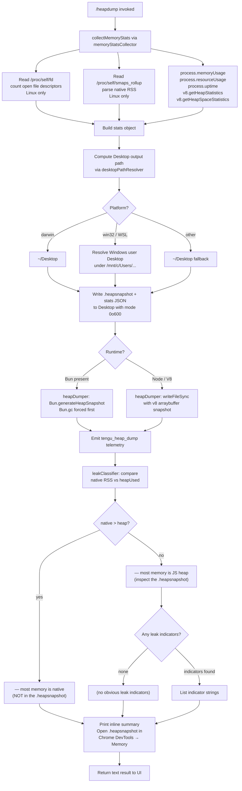

# `/heapdump`

> Analysis basis: CC v2.1.168 bundle.js (AST extraction + Claude interpretation)
> Minimum version: v2.1.168

---

## Overview

`/heapdump` is a hidden diagnostic command that captures the current JavaScript heap state to `~/Desktop`, writes a detailed memory-statistics report alongside it, and prints an inline summary to the terminal. It is intended for developer-level memory leak investigation and requires no user arguments. The command also collects native-memory metrics, V8 heap-space statistics, and open file-descriptor counts to provide a holistic picture of the process's memory footprint.

---

## Registration

| Field | Value |
|---|---|
| type | `local` |
| name | `heapdump` |
| description | `Dump the JS heap to ~/Desktop` |
| supportsNonInteractive | `true` |
| isHidden | `true` |
| module_id | `B9K` |
| load_inline | `true` |
| loc_byte | `12612797` |
| loc_byte_end | `12613225` |
| loc_line | `9063` |
| arbor_handler.name | `Sbf` |
| arbor_handler.fqn | `claude-2.1.168::Sbf` |
| arbor_handler.kind | `AsyncFunction` |
| arbor_handler.resolution_path | `module_id` |
| arbor_handler.n_hits | `0` |

Analysis basis: CC v2.1.168 bundle.js:+12612797

---

## Input Branching

The command follows a multi-stage flow with several distinct branches (platform detection, leak classification, Bun vs. V8 snapshot path). A Mermaid flowchart is used.



---

## Behavioral Spec

### Top-level handler: `heapdumpCommandHandler` (`Sbf`)

```
async function heapdumpCommandHandler(commandArgs):
    lines = []
    summary = await heapdumpCore(commandArgs)
    lines.push(summary)
    return lines.join("\n")
```

Analysis basis: CC v2.1.168 bundle.js:+12611785 – +12611934

---

### Core orchestrator: `heapdumpCore` (`CLA`)

```
async function heapdumpCore(args):
    // 1. Trigger GC and collect memory snapshot
    statsBundle = await memoryStatsCollector()       // p9K

    // 2. Resolve Desktop path (platform-aware)
    desktopPath = desktopPathResolver()              // gCA

    // 3. Build output filename (timestamp + .heapsnapshot)
    outputPath = path.join(desktopPath, ...)        // RLA.join

    // 4. Write stats JSON alongside snapshot (mode 384 = 0o600)
    await fs.writeFile(outputPath + ".json",
                       JSON.stringify(statsBundle), { mode: 384 })  // jq6.writeFile

    // 5. Generate heap snapshot file
    await heapDumper(outputPath)                     // hbf

    // 6. Classify leak signals and build inline report
    report = leakClassifier(statsBundle)             // Rbf / l / AA / O$

    // 7. Log to error reporter on failure
    // hH — logError path

    return report
```

Analysis basis: CC v2.1.168 bundle.js:+12610328 – +12611174

---

### Memory statistics collector: `memoryStatsCollector` (`p9K`)

```
async function memoryStatsCollector():
    stats = {}

    // Node/Bun built-ins
    stats.memoryUsage    = process.memoryUsage()
    stats.heapStats      = v8Module.getHeapStatistics()       // kb8.getHeapStatistics
    stats.resourceUsage  = process.resourceUsage()
    stats.uptime         = process.uptime()
    stats.heapSpaces     = v8Module.getHeapSpaceStatistics()  // kb8.getHeapSpaceStatistics

    // Active handle / request counts (internal Node APIs)
    stats.activeHandles   = process._getActiveHandles().length
    stats.activeRequests  = process._getActiveRequests().length

    // Linux-specific: open file descriptor count via /proc/self/fd
    if platform == "linux":
        try:
            fds = await fs.readdir("/proc/self/fd")           // jq6.readdir
            stats.openFdCount = fds.length
        catch: pass

    // Linux-specific: native RSS from /proc/self/smaps_rollup
    if platform == "linux":
        try:
            smaps = await fs.readFile("/proc/self/smaps_rollup", "utf8")  // jq6.readFile
            stats.nativeRSS = parseSmapsRollup(smaps)
        catch: pass

    // bun:jsc module if available
    if bunJsc available:
        stats.jsc = require("bun:jsc")                        // literal "bun:jsc"

    // Uptime threshold: 3600 s; memory unit: 1048576 bytes (1 MiB)
    // stats are normalised to MiB for display

    stats.warnings = []
    if stats.nativeRSS > stats.heapStats.used_heap_size:
        stats.warnings.push(
            "Native memory > heap - leak may be in native addons (node-pty, sharp, etc.)"
        )

    return stats
```

Constants:
- Open-FD path: `/proc/self/fd` (bundle.js:+12608072)
- smaps path: `/proc/self/smaps_rollup` (bundle.js:+12608135)
- Encoding: `utf8` (bundle.js:+12608161)
- JSC module identifier: `bun:jsc` (bundle.js:+12608220)
- Uptime reference threshold: `3600` seconds (bundle.js:+12608361)
- Memory normalisation divisor: `1048576` bytes = 1 MiB (bundle.js:+12608366)
- Native-addon leak warning string sourced at bundle.js:+12608599

---

### Desktop path resolver: `desktopPathResolver` (`gCA`)

```
function desktopPathResolver():
    home = os.homedir()                         // hH_.homedir
    base = path.join(home, "Desktop")           // E5.join, literal "Desktop"

    if platform == "win32" or isWSL():
        // Walk /mnt/c/Users looking for a real Windows user directory
        // Skip: "Public", "Default", "Default User", "All Users"
        candidates = fs.readdirSync("/mnt/c/Users")
        for entry in candidates:
            if entry not in ["Public", "Default", "Default User", "All Users"]:
                return path.join("/mnt/c/Users", entry, "Desktop")

    return base
```

Constants:
- WSL path root: `/mnt/c/Users` (bundle.js:+1061954)
- Excluded dirs: `Public` (+1061998), `Default` (+1062017), `Default User` (+1062037), `All Users` (+1062062)
- Subdirectory name: `Desktop` (bundle.js:+1061732)

Analysis basis: CC v2.1.168 bundle.js:+1061679

---

### Heap snapshot writer: `heapDumper` (`hbf`)

```
async function heapDumper(outputPath):
    if runtime == "Bun":
        // Force garbage collection first
        Bun.gc(true)                                   // Bun.gc
        snapshot = Bun.generateHeapSnapshot()          // Bun.generateHeapSnapshot
        fs.writeFileSync(outputPath, snapshot, "v8")   // literal "v8", "arraybuffer"
    else:
        // V8 / Node path
        v8Snapshot = v8.writeHeapSnapshot(outputPath)
        // (uses m9K.writeFileSync internally)
```

Constants:
- Snapshot format hint: `"v8"` (bundle.js:+12611391)
- Buffer type hint: `"arraybuffer"` (bundle.js:+12611396)

Analysis basis: CC v2.1.168 bundle.js:+12611346 – +12611423

---

### Leak classifier and report builder: `leakClassifier` (`Rbf`)

```
function leakClassifier(statsBundle):
    lines = []

    heapUsedMiB   = statsBundle.memoryUsage.heapUsed / 1_048_576
    nativeRSSMiB  = statsBundle.nativeRSS / 1_048_576   // if available

    if nativeRSSMiB > heapUsedMiB:
        lines.push("— most memory is native (NOT in the .heapsnapshot)")
    else:
        lines.push("— most memory is JS heap (inspect the .heapsnapshot)")

    if statsBundle.warnings.length == 0:
        lines.push("  (no obvious leak indicators)")
    else:
        for w in statsBundle.warnings:
            lines.push("  " + w)

    // Append Chrome DevTools usage hint
    lines.push(
        "Open the .heapsnapshot in Chrome DevTools → Memory → Load to inspect retainers."
    )

    // Memory threshold marker at 1 GiB = 1073741824 bytes
    // Controls whether a "high memory" badge is shown in the summary
    if statsBundle.memoryUsage.heapUsed > 1_073_741_824:
        lines.push("auto-1.5GB")   // literal "auto-1.5GB" at +12610984

    return lines.join("\n")
```

Constants:
- JS-heap branch string (fragment): `"— most memory is JS heap"` (bundle.js:+12612109)
- Native branch string (fragment): `"— most memory is native"` (bundle.js:+12612169)
- No-indicator string (fragment): `"  (no obvious leak indicators)"` (bundle.js:+12612306)
- Chrome DevTools hint (fragment): `"Open the .heapsnapshot in Chrome"` (bundle.js:+12611822)
- 1 GiB threshold: `1073741824` (bundle.js:+12612715)
- Auto label: `"auto-1.5GB"` (bundle.js:+12610984)

Analysis basis: CC v2.1.168 bundle.js:+12612041 – +12612353

---

### Heapdump result formatter: `heapdumpResultBuilder` (`Sbf` tail section)

```
function heapdumpResultBuilder(reportLines):
    // Wraps classifier output in a "text" result object
    // literal "text" at +12611698
    return { type: "text", content: reportLines }
```

Analysis basis: CC v2.1.168 bundle.js:+12611698

---

## State & Side Effects

| Item | Detail |
|---|---|
| Telemetry | `tengu_heap_dump` (bundle.js:+12610918) — fired once per successful dump invocation |
| Telemetry (indirect, call graph) | `tengu_daemon_control` (+16233972), `tengu_daemon_config_reload` (+16212414), `tengu_bg_*` family — these originate from daemon/background-worker utilities reachable in the call graph but are NOT fired by `/heapdump` itself |
| File system writes | `.heapsnapshot` binary + `.json` stats file written to `~/Desktop` (or Windows Desktop via WSL path); file mode `0o600` (decimal `384`) (bundle.js:+12610811) |
| GC side effect | `Bun.gc(true)` is called before snapshot generation on Bun runtime — forces a synchronous GC cycle |
| Hook registration | `NPA.register` called via `j9` (bundle.js:+60369) — registers a process-exit / cleanup hook; not heapdump-specific |
| appState changes | None observed in depth-2 traversal |
| Sound | None observed |
| Platform branch | `"darwin"` detection (bundle.js:+12609872); `"macos"` label used in report (bundle.js:+12609453) |
| Fallback message | `"No obvious leak indicators. Check heap snapshot for retained objects."` (bundle.js:+12609718) shown when no heuristics trigger |

---

## Version History

| Version | Change |
|---|---|
| v2.1.168 | Initial analysis |

---

## Common Mistakes

1. **Expecting output on non-Desktop systems** — on headless Linux servers `~/Desktop` may not exist; the command will still attempt to write there and may fail silently if the directory is absent.
2. **Opening the snapshot before the command returns** — `Bun.generateHeapSnapshot` is synchronous internally but the overall handler is `async`; wait for the command to finish before loading the file in Chrome DevTools.
3. **Confusing the two output files** — the command writes both a `.heapsnapshot` (binary, loadable in Chrome DevTools) and a `.json` stats file (human-readable text metrics). Only the `.heapsnapshot` is loadable in DevTools → Memory → Load.
4. **Running in non-interactive mode expecting rich output** — `supportsNonInteractive: true` means the command will execute, but terminal formatting may be stripped; redirect stdout if capturing metrics programmatically.
5. **Interpreting "native > heap" as definitive** — the native RSS heuristic depends on `/proc/self/smaps_rollup` being readable (Linux only); on macOS or Windows the native branch may not fire even if native memory is high.
6. **Assuming Bun runtime on Node installs** — the `Bun.generateHeapSnapshot` path only activates when the process is running under Bun; on standard Node.js the V8 fallback path is used instead.

---

## Appendix — Identifier Mapping

> For bundle debugging only. Identifiers change across versions.

| Identifier | Role |
|---|---|
| `Sbf` | Top-level heapdump command handler (AsyncFunction); Arbor-resolved entry point |
| `CLA` | Core heapdump orchestrator — coordinates stats, path resolution, file writing, and reporting |
| `p9K` | Memory statistics collector — aggregates `process.memoryUsage`, V8 heap stats, /proc reads |
| `hbf` | Heap snapshot writer — branches between Bun (`Bun.generateHeapSnapshot`) and V8 paths |
| `Rbf` | Leak classifier and inline report builder — compares native vs JS heap, emits diagnostic lines |
| `gCA` | Desktop path resolver — platform-aware `~/Desktop` / WSL Windows path logic |
| `R6` | Utility: likely async wrapper or result-type constructor (reused across many call sites) |
| `tv` | Utility called from `R6`; role unclear from depth-2 traversal |
| `W` | Shared utility reached from `memoryStatsCollector`; likely a logging or formatting helper |
| `nV6` | TeammateMailbox `markMessagesAsRead` — unrelated to heapdump; reachable via shared utility `W` |
| `P` | Background-session / supervisor object — reachable via shared daemon utilities |
| `J` | Sub-utility of `P`; role unclear at depth 2 |
| `j` | Process-kill helper (`S.kill`) reachable from `P` |
| `H` | Bootstrap fetch / config poller — reachable from supervisor path |
| `z` | Daemon stop/start controller (`SH`, `CH`) |
| `Y` | Supervisor config-change handler (`E.stop`, `E.start`, `E.updateConfig`) |
| `h` | Background-worker sweep scheduler (idle/stale/retire logic) |
| `w` | Daemon worker spawner (`YQ.spawn`, memory-pressure checks) |
| `EOA` | Vim-mode operator dispatcher (operator, find, replace, indent, etc.) |
| `C` | Rate-limit event enqueuer (`k.enqueue`, `rate_limit_event`) |
| `X` | IPC/stream framing utility — buffer concat, timeout, subarray slicing |
| `X5` | Stream-end helper called from `X` |
| `o$5` | Full IPC protocol handler — attach, respawn, resize, snapshot, ping, kill, etc. |
| `GH` | String coercion helper |
| `v` | Logging sink / output formatter — normalises and writes log entries |
| `snK` | Log-entry constructor |
| `IPA` | Log-entry field populator |
| `RH` | JSON serialiser wrapper (`JSON.stringify`) |
| `_` | Generic utility; role varies by call site |
| `G4` | Path-component extractor / basename helper |
| `K0A` | Path-map builder |
| `q` | Temp-file unlink helper (`opK.unlinkSync`) |
| `A` | String lowercaser / general array utility |
| `EUH` | Write-to-handle helper |
| `nWA` | Raw `H.write` wrapper |
| `_iK` | Log-file rotation / append manager (mkdir, appendFile, rename, unlink) |
| `npH` | Batched-output flusher (setTimeout, setImmediate, join queues) |
| `YKH` | Log-directory path builder (`IHH.join`, `R6`) |
| `d6` | Date/time formatter used in file naming |
| `B76` | V8-error helper |
| `$0A` | Log file path builder |
| `ll8` | File rotation: stat → rename → unlink cycle |
| `HiK` | Log-rotation orchestrator (mkdir, appendFile, stat, rename) |
| `j9` | Process-exit hook registrar (`NPA.register`) |
| `K` | Column formatter (`L.map`, `f.padEnd`) |
| `L` | Promise-set manager (`q.add`, `q.delete`, `f.finally`) |
| `f` | Resource closer (`A.close`, `q.close`) |
| `l` | Generic small utility; role unclear at depth 2 |
| `AA` | Error/String coercion pair constructor |
| `O$` | Output-cell builder used in report construction |
| `hH` | UI error logger (`pr.logError`, ring-buffer push) |
| `_6` | String coercion primitive |
| `$q` | Log-drain helper |
| `dRA` | Log-drain sub-routine |
| `DG4` | Ring-buffer push/shift manager |
| `Jq6` | Utility called from `leakClassifier`; likely a number formatter |

---

Note: index built via Arbor fallback; some signals (telemetry, literals) may be missing — see arbor-fallback.js.