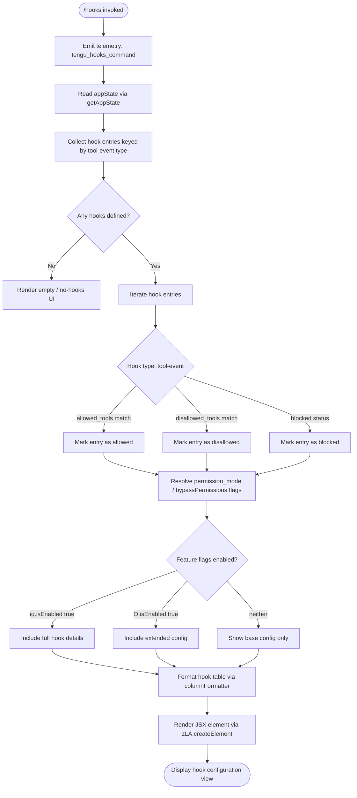

# `/hooks`

> Analysis basis: CC v2.1.168 bundle.js (AST extraction + Claude interpretation)
> Minimum version: v2.1.168

---

## Overview

The `/hooks` command displays the current hook configurations registered for tool events in Claude Code. It is a read-only, immediately-rendered JSX command that retrieves the active application state, collects hook definitions keyed by tool-event type, and presents them as a formatted inline view without requiring any agent interaction.

---

## Registration

| Field | Value |
|---|---|
| type | `local-jsx` |
| name | `hooks` |
| description | `View hook configurations for tool events` |
| immediate | `true` |
| module_id | `EAK` |
| load_inline | `true` |
| loc_byte | `12501759` |
| loc_byte_end | `12501909` |
| loc_line | `8941` |
| arbor_handler.name | `oRf` |
| arbor_handler.fqn | `claude-2.1.168::oRf` |
| arbor_handler.kind | `AsyncFunction` |
| arbor_handler.resolution_path | `module_id` |
| arbor_handler.n_hits | `0` |

Analysis basis: CC v2.1.168 bundle.js:+12501759

---

## Input Branching

The command has more than three distinct internal branches based on hook-entry inspection, tool-permission filtering, enabled-flag checks, and daemon-state conditions. A Mermaid flowchart is used below.



Analysis basis: CC v2.1.168 bundle.js:+12501557, +12501591, +12501599, +12501629

---

## Behavioral Spec

### Handler Entry Point (`oRf`)

The primary handler is the async function resolved as `oRf` via Arbor `module_id` path.

```
async function hooksCommandHandler(context):
    emit telemetry("tengu_hooks_command")          // bundle.js:+12501559
    appState = readAppState()                      // calls getAppState via b_
    hookMap  = collectHookEntries(appState)        // calls Xv pipeline
    element  = renderHooksView(hookMap, context)   // zLA.createElement
    return element
```

Analysis basis: CC v2.1.168 bundle.js:+12501557, +12501591, +12501599, +12501629

---

### App-State Reading (`b_`)

Reads the current live app-state snapshot, extracting several well-known keys used to filter and annotate hook entries.

```
function readAppState(state):
    workingDir  = state["working_directory"]       // bundle.js:+10944655
    allowedTools    = state["allowed_tools"]       // bundle.js:+10944710
    disallowedTools = state["disallowed_tools"]    // bundle.js:+10944765
    avoidPrompts    = state["avoid_prompts"]       // bundle.js:+10944826
    permissionMode  = state["permission_mode"]     // bundle.js:+10944928
    bypassPerms     = state["bypassPermissions"]   // bundle.js:+10944959
    session         = state["session"]             // bundle.js:+10945258
    effort          = state["effort"]              // bundle.js:+10945283
    model           = state["model"]               // bundle.js:+10945296
    maxThinkingTok  = state["max_thinking_tokens"] // bundle.js:+10945308
    flagSettings    = state["flag_settings"]       // bundle.js:+10945334

    mostRecentEntry = findLast(state.entries)      // A.findLast, bundle.js:+10944630
    return normalizedState
```

Analysis basis: CC v2.1.168 bundle.js:+10944550, +10944630

---

### Hook Entry Collection and Rendering (`Xv` pipeline)

`Xv` is the central orchestration function that assembles the complete hooks view. It calls a chain of sub-functions to build the output JSX tree.

```
function buildHooksView(appState, featureFlags):

    // Step 1: Construct session context
    sessionCtx = buildSessionContext(appState)     // wG, bundle.js:+9882212
    push(sessionCtx)                               // Y.push, bundle.js:+9882284

    // Step 2: Attach async render callbacks
    asyncRenderer1 = makeAsyncRenderer(context)    // As_, bundle.js:+9882299
    permScopeCtx   = buildPermScope(appState)      // zP, bundle.js:+9882313

    // Step 3: Filter hooks by tool-event type
    filteredHooks = filterToolEventHooks(appState) // K9H, bundle.js:+9882335

    // Step 4: Build query scope
    queryScope = buildQueryScope(context)          // qs_, bundle.js:+9882350

    // Step 5: Build subcommand context
    subCmdCtx = buildSubCommandContext(appState)   // y4, bundle.js:+9882362

    // Step 6: Push output items
    push(outputItems)                              // z.push, bundle.js:+9882422

    // Step 7: Agent teams / multi-agent view
    agentView = buildAgentTeamsView(appState)      // Vg, bundle.js:+9882520

    // Step 8: Feature flag gate checks
    if appState has required feature set:          // A.has, bundle.js:+9882538
        if any(K.some()):                          // bundle.js:+9882566
            applyFeatureView(Y4)                   // bundle.js:+9882578
    if iq.isEnabled():                             // bundle.js:+9882589
        expandedHookDetails = collectExpanded()
    filteredView = K.filter(KoH.has)               // bundle.js:+9882665, +9882680
    mappedView   = K.map(O.isEnabled)              // bundle.js:+9882708, +9882719
    gpView       = buildGPView(appState)           // GP, bundle.js:+9882761
    if $.includes(hookId):                         // bundle.js:+9882806
        includeEntry()

    return createElement(assembledView)            // zLA.createElement, bundle.js:+12501629
```

Analysis basis: CC v2.1.168 bundle.js:+9882212 – +9882806

---

### Tool-Event Hook Filtering (`K9H` / `Xk6`)

Filters and classifies tool-event hooks according to permission scope and tool-narrowing rules.

```
function filterToolEventHooks(hookList):
    filtered = hookList.filter(isRelevantHook)     // H.filter, bundle.js:+9881518
    return filtered.flatMap(entry =>               // at → wy8.flatMap, bundle.js:+10676888
        classifyEntry(entry)                       // Xk6, bundle.js:+9881533
    )

function classifyHookEntry(entry):
    base = lookupToolEvents(entry)                 // at, bundle.js:+10677702
    if entry.source == "deny":                     // bundle.js:+10676965
        return { ...base, status: "blocked" }      // bundle.js:+9881579
    annotated = annotateWithScope(base)            // y6A, bundle.js:+10677718
        // sub-calls: n$6, i$6, VZH, omA, $Z
    categorized = categorizeByScope(annotated)     // VCq, bundle.js:+10677742
    return categorized
```

`Xk6` distinguishes two source labels found in literals: `"cliArg"` (bundle.js:+10677639) and `"toolsNarrowing"` (bundle.js:+10677660), used to annotate the origin of the hook constraint.

Analysis basis: CC v2.1.168 bundle.js:+9881518, +9881533, +10677702, +10677718

---

### Permission-Disable Side-Effect (`aB`)

When the permission mode is set to `"disable"`, a telemetry event is emitted and the bypass-permissions state is cleared.

```
function handlePermissionDisable(currentMode):
    if currentMode == "disable":                   // bundle.js:+4204713
        emit telemetry("tengu_disable_bypass_permissions_mode")
        // bundle.js:+4204612
        disableBypassPermissions(appState)         // D6 pipeline
```

Analysis basis: CC v2.1.168 bundle.js:+10944981, +4204609, +4204612

---

### Session Context Builder (`wG`)

Builds the session/environment context object from current state, distinguishing CLI vs. remote execution contexts.

```
function buildSessionContext(state):
    clientType = resolveClientType(state)         // jK, _6
    if clientType == "cli":                       // bundle.js:+4802284
        context = buildCLIContext(state)
    else if clientType == "remote":               // bundle.js:+4802295
        context = buildRemoteContext(state)
    emit telemetry("tengu_slate_harbor")          // bundle.js:+4802314
    permState = registerPermissions(context)      // D6
    return context
```

Analysis basis: CC v2.1.168 bundle.js:+4802132, +4802149, +4802194, +4802284, +4802295, +4802311

---

### Column Formatter for Hook Table (`UfK`)

Formats the hook list into a fixed-width column table for display.

```
function formatHookTable(hookEntries):
    keys   = Object.keys(hookEntries)             // bundle.js:+12967695
    maxW   = Math.max(columnWidths)               // bundle.js:+12967740
    rows   = buildRows(hookEntries, maxW)         // bD, bundle.js:+12967939
    // Column separator constant: "  " (two spaces), bundle.js:+16221802
    // padEnd width constant: 40, bundle.js:+16223773
    return rows
```

Analysis basis: CC v2.1.168 bundle.js:+12967695, +12967740, +16223773

---

### Daemon and Background Session Interactions

The hooks view intersects with the daemon subsystem when background sessions are active. A daemon configuration reload is triggered on relevant state changes.

```
function handleDaemonInteraction(sessionState):
    if sessionState == "stopped":                 // bundle.js:+16233806
        handleDaemonStop()                        // SH, bundle.js:+16233894
        // emits "daemon_stop" or "daemon_stop_failed"
                                                  // bundle.js:+16233897, +16233934
    if sessionState == "background session":      // bundle.js:+16233849
        emit telemetry("tengu_daemon_control")    // bundle.js:+16233972
        reloadDaemonConfig()                      // triggers tengu_daemon_config_reload
                                                  // bundle.js:+16212414
```

The daemon status file is `"daemon.status.json"` (bundle.js:+12780353). Shutdown uses a `Promise.race` over `Promise.all` with a 500 ms timeout constant (bundle.js:+16229015).

Analysis basis: CC v2.1.168 bundle.js:+16233806, +16233849, +16233894, +16233972, +16212414

---

### Agent Teams View (`Vg`)

When the `--agent-teams` feature is active, an extended multi-agent view is constructed alongside the standard hooks list.

```
function buildAgentTeamsView(state):
    agentTeamsFlag = resolveFlag("--agent-teams") // bundle.js:+5490909
    if agentTeamsFlag active:
        emit telemetry("tengu_amber_flint")       // bundle.js:+5491021
        agentCtx = buildLocalAgentContext(state)  // "local-agent", bundle.js:+5359991
        emit telemetry("tengu_cobalt_ridge")      // bundle.js:+4918944
        normalizeCtx = normalizeAgentContext()    // fb, y4
    return agentTeamsView
```

Analysis basis: CC v2.1.168 bundle.js:+9881225, +5490909, +5491021, +5359991, +4918944

---

## State & Side Effects

| Item | Detail |
|---|---|
| Telemetry: `tengu_hooks_command` | Fired immediately on command invocation (bundle.js:+12501559) |
| Telemetry: `tengu_disable_bypass_permissions_mode` | Fired when permission mode is `"disable"` (bundle.js:+4204612) |
| Telemetry: `tengu_slate_harbor` | Fired during session-context construction (bundle.js:+4802314) |
| Telemetry: `tengu_daemon_config_reload` | Fired when daemon config is reloaded (bundle.js:+16212414) |
| Telemetry: `tengu_workflows_enabled` | Fired when workflow feature flag is active (bundle.js:+4187455) |
| Telemetry: `tengu_cobalt_ridge` | Fired during agent context normalization (bundle.js:+4918944) |
| Telemetry: `tengu_feature_ok` | Fired on successful feature check (bundle.js:+1010950) |
| Telemetry: `tengu_feature_sad` | Fired on feature unavailability (bundle.js:+1011093) |
| Telemetry: `tengu_feature_bad` | Fired on feature error (bundle.js:+1011012) |
| Telemetry: `tengu_daemon_control` | Fired on background-session daemon interaction (bundle.js:+16233972) |
| Telemetry: `tengu_amber_flint` | Fired when agent-teams branch is active (bundle.js:+5491021) |
| appState changes | Read-only access via `getAppState`; no writes observed in the command handler itself |
| Hook registration | `immediate: true` — renders inline without entering the agent loop |
| JSX rendering | Output element created via `zLA.createElement` (bundle.js:+12501629) |
| Daemon status file | Reads `daemon.status.json` when daemon interactions are triggered (bundle.js:+12780353) |
| Sound | None observed in traversal |

---

## Version History

| Version | Change |
|---|---|
| v2.1.168 | Initial analysis |

---

## Common Mistakes

1. **Expecting editable output** — `/hooks` is a read-only display command (`immediate: true`). It does not accept arguments or enter an interactive editing flow; use the settings files to change hook configurations.
2. **Confusing hook entries with tool permissions** — The command displays hook configurations (scripts/processes bound to tool events), not the allowed/disallowed tools list, even though both are read from the same app-state object.
3. **Assuming daemon must be running** — The command reads hook state from the in-process app-state; daemon interactions are only triggered if a background session is detected. The command works without a running daemon.
4. **Expecting the agent-teams view without the flag** — Extended multi-agent hook entries only appear when the `--agent-teams` feature is explicitly enabled; the base view omits them.
5. **Missing hooks for `disallowed_tools`** — Hooks bound to tools that appear in the `disallowed_tools` list are shown with a "blocked" status rather than being silently omitted; do not interpret their presence as a permission grant.

---

## Appendix — Identifier Mapping

> For bundle debugging only. Identifiers change across versions.

| Identifier | Role |
|---|---|
| `oRf` | Main async handler for `/hooks` command |
| `l` | Telemetry/logging utility (called at entry point and render) |
| `b_` | App-state reader; extracts hook-relevant fields from live state |
| `v` | Debug-level log formatter / string formatter for hook display |
| `snK` | Sub-formatter called inside debug-level formatting pipeline |
| `RH` | JSON serializer helper (wraps `JSON.stringify`) |
| `G4` | String path/label formatter (uses `replace`, `lastIndexOf`, `slice`) |
| `EUH` | Auxiliary string encoder |
| `_iK` | File/buffer hook-content reader (uses `Buffer.byteLength`, `dirname`) |
| `Y3` | State sub-field accessor |
| `mj_` | String-splitting utility (splits, trims, indexes) |
| `lHH` | Set membership checker |
| `uj` | String replacement helper |
| `H9` | Composite string-normalization entry point |
| `m6H` | Multi-step string normalization pipeline |
| `s9` | Lowercase/trim/replace string canonicalizer |
| `FJ` | Compound canonicalizer wrapping `s9` |
| `o6` | Feature-check utility (emits `tengu_feature_ok/bad/sad`) |
| `J6` | Inner feature-check helper |
| `A` | Array/stream holding hook result items |
| `f` | File/stream handle object |
| `L` | Promise/set lifecycle manager |
| `ty8` | Hook entry type resolver (path A) |
| `ey8` | Hook entry type resolver (path B) |
| `L1` | Shared type-resolution helper called by `ty8` and `ey8` |
| `aB` | Permission-disable handler; fires bypass-permissions telemetry |
| `D6` | Permission-state registration core |
| `cj6` | Permission-state sub-initializer A |
| `lj6` | Permission-state sub-initializer B |
| `hu` | Permission-state helper |
| `cq8` | Permission-set deduplication guard |
| `C6` | Permission context constructor (uses `Date.now`) |
| `Xv` | Central hooks-view orchestrator |
| `wG` | Session-context builder (CLI vs. remote) |
| `Yd` | Session-context sub-builder |
| `jK` | Boolean/flag string coercer ("yes"/"on"/"no"/"off") |
| `_6` | String-to-typed-value coercer |
| `Y` | Output item accumulator array / supervisor context |
| `$GH` | MCP/tool-event entry builder |
| `V9` | Async-store accessor |
| `V8` | MCP entry sub-builder |
| `pfA` | MCP formatter helper |
| `GH` | String coercer for MCP names |
| `K` | Column-width / hook-entry map |
| `UfK` | Hook table column formatter |
| `T` | Spinner/progress indicator (stop lifecycle) |
| `ly6` | Spinner stop sub-handler A |
| `Y46` | Spinner stop sub-handler B |
| `E` | Config object with `stop/updateConfig/start` lifecycle |
| `TUK` | Config reload orchestrator |
| `S8H` | Config reload sub-step (heartbeat) |
| `V` | Secondary progress/display controller |
| `As_` | Async renderer factory |
| `y_` | React/Ink render bootstrapper |
| `km6` | Render bind helper |
| `zP` | Permission-scope context builder |
| `rf8` | Scope initializer |
| `aE` | Scope finalizer/accessor |
| `jf9` | Feature-flag scope resolver |
| `X9` | Feature-flag evaluator (allow_product_feedback, allow_workflows) |
| `mZ_` | Workflow-scope builder |
| `dgL` | Workflow entry constructor |
| `QgL` | Scope cleanup helper |
| `K9H` | Tool-event hook list filterer |
| `Xk6` | Hook-entry classifier (deny/allow/blocked) |
| `at` | Tool-event flat-mapper |
| `y6A` | Hook-entry scope annotator |
| `VCq` | Hook-entry categorizer by scope |
| `qs_` | Query-scope builder |
| `fb` | Agent-context normalizer (Windows-aware) |
| `y4` | Sub-command context builder |
| `z` | Daemon-interaction output array |
| `SH` | Daemon-stop success handler |
| `CH` | Daemon-stop failure handler |
| `uh` | Daemon-control first-party handler |
| `yu` | Daemon base-control helper |
| `EvH` | Daemon event emitter |
| `yP_` | UUID-based daemon event dispatcher |
| `sp` | Process shutdown orchestrator (Promise.race + exit) |
| `RLH` | SLH shutdown wrapper |
| `pLH` | Timeout canceller for shutdown |
| `r8` | Timed-abort helper |
| `Vg` | Agent-teams view builder |
| `GP` | Local-agent context constructor |
| `$d8` | Agent-context sub-field builder |
| `ow` | Agent flag coercer |
| `LA6` | Agent-teams label builder |
| `B9` | Agent-teams flag processor |
| `z47` | Agent-teams config sub-step |
| `uAf` | Async agent render helper A |
| `mAf` | Async agent render helper B |
| `nN` | Nested-tool / multi-model scope builder |
| `sC_` | Tool-scope initializer (standard/tst/tst-auto modes) |
| `MA` | Cloud-provider resolver (bedrock/vertex/foundry etc.) |
| `Lf` | Final scope assembler |
| `Y4` | Feature-view applicator |
| `O` | Feature-flag object with `isEnabled` |
| `b8` | Feature-flag backing store |
| `$` | Hook-ID inclusion list |
| `DLK` | Daemon-status loader |
| `Yo` | Daemon-status sub-reader |
| `YC6` | Daemon-status file path builder (joins with `daemon.status.json`) |

---

Note: index built via Arbor fallback; some signals (telemetry, literals) may be missing — see arbor-fallback.js.