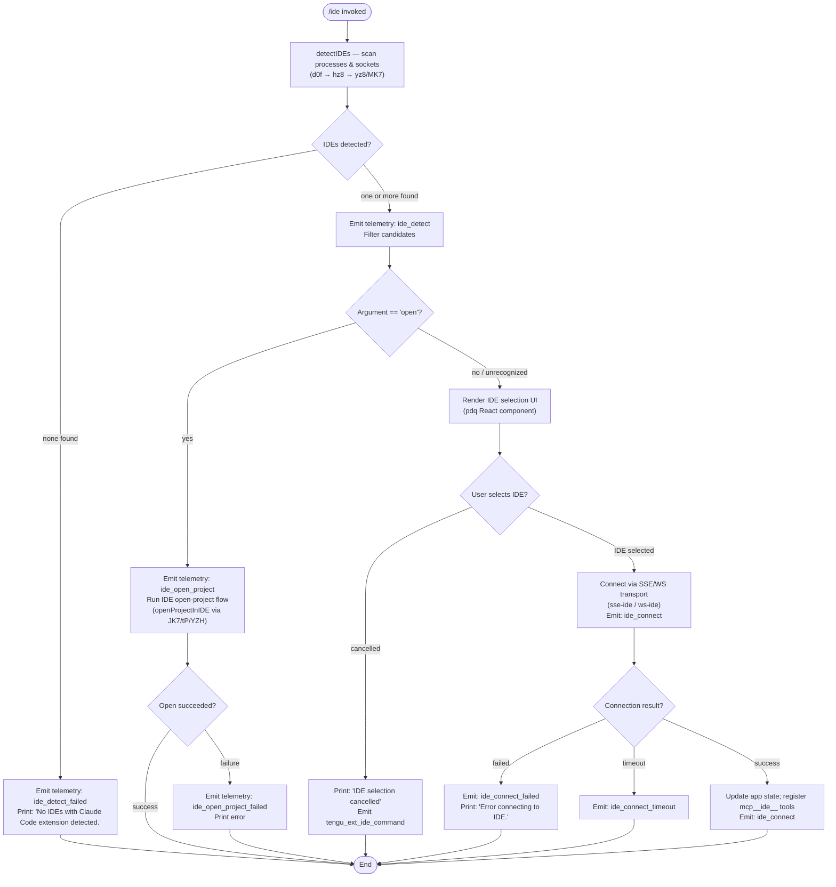

# `/ide`

> Analysis basis: CC v2.1.168 bundle.js (AST extraction + Claude interpretation)
> Minimum version: v2.1.168

---

## Overview

The `/ide` command manages IDE integrations for Claude Code, allowing users to detect connected IDEs, select an active IDE, and open the current project in the chosen editor. It serves as the primary interface for IDE-extension connectivity, covering detection, selection, connection/disconnection lifecycle, and optional project-open actions.

---

## Registration

| Field | Value |
|---|---|
| type | `local-jsx` |
| name | `ide` |
| description | `Manage IDE integrations and show status` |
| argumentHint | `[open]` |
| module_id | `Udq` |
| load_inline | `true` |
| loc_byte | `11585618` |
| loc_byte_end | `11585774` |
| loc_line | `7542` |
| arbor_handler.name | `d0f` |
| arbor_handler.fqn | `claude-2.1.168::d0f` |
| arbor_handler.kind | `AsyncFunction` |
| arbor_handler.resolution_path | `module_id` |
| arbor_handler.n_hits | `0` |

Analysis basis: CC v2.1.168 bundle.js:+11585618

---

## Input Branching

The command has 5+ distinct execution paths depending on whether IDEs are detected, whether the user selects one, and whether the `open` subcommand argument is present.



Analysis basis: CC v2.1.168 bundle.js:+11581734 (handler entry `d0f`)

---

## Behavioral Spec

### 1. Command Entry and Argument Parsing

The async handler `d0f` is the main entry point. It is resolved via `module_id = Udq` (Arbor resolution path: `module_id`).

```
async function ideCommandHandler(args, context):
    telemetry.emit("tengu_ext_ide_command")           // +11581736
    subcommand = args.slice(...)                       // parse "open" or empty
    ideList = await detectIDEs(context)               // calls detectIDEs (hz8)
    if ideList is empty:
        print("No IDEs with Claude Code extension detected.")  // +11581951
        return
    if subcommand == "open":                           // +11581842
        return await openProjectFlow(ideList, context)
    return await ideSelectionFlow(ideList, context)
```

Analysis basis: CC v2.1.168 bundle.js:+11581734

---

### 2. IDE Detection (`detectIDEs` / `hz8`)

This sub-routine discovers running IDE processes. It uses platform-specific strategies and resolves real paths to match against known IDE identifiers.

```
async function detectIDEs(context):
    // Identify running processes
    // On linux: executes shell command scanning for known IDE process names  (+5429301)
    //   pattern: "ps aux | grep -E 'code|cursor|windsurf|devin-desktop|idea|...' | grep -v grep"
    // On macOS: uses platform-native process enumeration
    
    rawEntries = await gatherProcessEntries()         // yz8 + MK7
    
    candidates = []
    for each entry in rawEntries:
        resolve real path, check for ".claude" marker (+5422460)
        skip WSL system user dirs: "Public", "Default", "Default User", "All Users" (+5422761–5422825)
        skip paths under "/mnt/c/Users" on WSL (+5422667)
        detect IDE type: windsurf, devin, cursor, insiders, vscode, vscodium, codium, jetbrains (+5427401–5427852)
        if entry is a directory, check for isDirectory / isSymbolicLink (+5422703/5422721)
        collect valid candidates
    
    emit telemetry "ide_detect" on success  (+5425931)
    emit telemetry "ide_detect_failed" on error  (+5425995)
    return candidates
```

Known IDE keyword matching (via `wV9`, `Sz8`):
- `windsurf`, `devin`, `cursor`, `insiders`, `vscode`, `vs code`, `visual studio code`, `vscodium`, `code - oss`, `codium`, `jetbrains`, `appcode` (Analysis basis: CC v2.1.168 bundle.js:+5427371–5427895)
- Windows `.cmd` suffix handling (+5427984)
- "Devin Desktop" string match (+5427721)

---

### 3. Open-Project Flow (`openProjectInIDE` / `YR_` → `JK7`)

When the user passes `open` as the argument:

```
async function openProjectInIDE(selectedIDE, context):
    emit telemetry "ide_open_project"               // +11582287
    determine context type: "worktree" or "project" // +11582321, +11582332
    
    // Resolve launch command via JK7 → tP → YZH (process spawning layer)
    launchResult = await spawnIDEOpen(selectedIDE, projectPath)
    
    if launchResult == "Exited without opening IDE":  // +11582684
        emit telemetry "ide_open_project_failed"      // +11582394
        print error
    else:
        print bold IDE name + success message         // j6.bold  +11582348
        suggest "restart your IDE" if extension missing // +11582952
```

Analysis basis: CC v2.1.168 bundle.js:+11582208 (`hS8.basename`), +11582187 (`R8`)

---

### 4. IDE Selection UI (`pdq` React Component)

When no `open` argument is given, a JSX selection component `pdq` is rendered:

```
function IDESelectionComponent(props):
    [selectedIDE, setSelectedIDE] = useState(null)   // b5.useState +11583620
    appState = useAppState()                          // Y6 +11583640
    ideRef = useRef()                                 // b5.useRef +11583698

    useEffect(() => {
        // Trigger connection once IDE is chosen
    }, [selectedIDE])                                // b5.useEffect +11583712

    handleSelect = useCallback((ide) => {            // b5.useCallback +11584119
        setSelectedIDE(ide)
        connectToIDE(ide)
    })

    // Filter IDEs whose names start with known prefix
    // Check for mcp__ide__ prefix in tool names  (+11584427)
    // If j.startsWith("ws:") → use WebSocket transport  (+11584634, +11584647)
    // else use SSE transport

    return <IDEListView ides={filteredIDEs} onSelect={handleSelect} />
```

Analysis basis: CC v2.1.168 bundle.js:+11583620–11585000

---

### 5. IDE Connection Flow (`pdq` connection callbacks)

```
async function connectToIDE(ide):
    emit telemetry "ide_connect"                     // +11583837
    
    transportType = ide.url.startsWith("ws:") ?
        "ws-ide" :                                   // +11579741
        "sse-ide"                                    // +11579721
    
    try:
        connection = await establishTransport(transportType, ide.url)
        // "Connecting to " + ide.url  (+11584867)
        
        on success:
            register mcp__ide__ prefixed tools       // +11584427
            update app state (Nf context store)
            emit telemetry "ide_connect"
        
        on failure:
            emit telemetry "ide_connect_failed"      // +11583924
            print "Error connecting to IDE."         // +11584149
        
        on timeout:
            emit telemetry "ide_connect_timeout"     // +11584031
    
    on disconnect (idle):
        emit telemetry "ide_disconnect"              // +11584530
```

Analysis basis: CC v2.1.168 bundle.js:+11583834 (`SH`), +11583907 (`CH`)

---

### 6. IDE Disconnection and Cleanup

When the IDE disconnects or the session ends:

```
function handleIDEDisconnect(ide):
    emit telemetry "ide_disconnect"                  // +11584530
    remove mcp__ide__ tools from active registry     // +11584427
    update app state to reflect disconnection
    // Display reconnect prompt if applicable
```

Analysis basis: CC v2.1.168 bundle.js:+11584530

---

### 7. Maximum IDE List Display Limit

The display layer caps the list before rendering overflow indication:

- Limit value: `100` items (bundle.js:+11585076)
- Offset: `0` base (bundle.js:+11585095)
- Separator: `", "` between names (+11585374); overflow indicator `", …"` (+11585388)
- Normalized form: `"NFC"` Unicode normalization applied to paths (+11585217)

Analysis basis: CC v2.1.168 bundle.js:+11585076

---

## State & Side Effects

| Item | Detail |
|---|---|
| Telemetry: `tengu_ext_ide_command` | Fired at handler entry (+11581736) |
| Telemetry: `ide_detect` | IDE scan succeeded (+5425931) |
| Telemetry: `ide_detect_failed` | No IDE found or scan error (+5425995) |
| Telemetry: `ide_open_project` | Open-project subcommand invoked (+11582287) |
| Telemetry: `ide_open_project_failed` | Open failed (+11582394) |
| Telemetry: `ide_connect` | Connection established or attempted (+11583837) |
| Telemetry: `ide_connect_failed` | Connection error (+11583924) |
| Telemetry: `ide_connect_timeout` | Connection timed out (+11584031) |
| Telemetry: `ide_disconnect` | IDE disconnected (+11584530) |
| MCP tool registration | `mcp__ide__*` tools registered on successful connect (+11584427) |
| App state changes | IDE selection stored via `Y6` / `Nf` context providers (+11583640, +11583993) |
| Transport type | SSE (`sse-ide`) or WebSocket (`ws-ide`) chosen per URL scheme (+11579721, +11579741) |
| Process scan (Linux) | Shell command execution via `sh -c` (+2252391, +2252397) |
| Path normalization | NFC Unicode normalization on detected paths (+11585217) |
| Sound | None observed in depth-2 traversal |

---

## Version History

| Version | Change |
|---|---|
| v2.1.168 | Initial analysis |

---

## Common Mistakes

1. **Passing `open` without an IDE extension installed** — The command will detect no IDEs and print `"No IDEs with Claude Code extension detected."` even if the IDE binary is present; the extension must be active in the IDE.
2. **WSL path confusion** — Paths under `/mnt/c/Users/Public`, `/mnt/c/Users/Default`, `/mnt/c/Users/Default User`, and `/mnt/c/Users/All Users` are intentionally skipped during IDE scanning; IDE installations in those directories will not be detected.
3. **WebSocket vs SSE transport mismatch** — The connection transport is auto-selected based on whether the IDE URL begins with `ws:`. Manually specifying or misconfiguring the IDE extension endpoint can cause a protocol mismatch and result in `ide_connect_failed`.
4. **Disconnection clears MCP tools** — All `mcp__ide__*` tools registered during connection are removed on disconnect; any in-flight tool calls will fail silently if the IDE disconnects mid-session.
5. **Cancelling the selection dialog** — If the user exits the IDE selector without choosing, the output is `"IDE selection cancelled"` and no telemetry for a successful connect is fired; this is not an error state.

---

## Appendix — Identifier Mapping

> For bundle debugging only. Identifiers change across versions.

| Identifier | Role |
|---|---|
| `d0f` | Main async handler for `/ide` command (arbor_handler) |
| `F1A` | IDE list render/display helper; constructs display string with truncation |
| `u6` | App-state store accessor (get current state) |
| `pc6` | State-store getter with context check |
| `BQ` | State-store subscribe/notify helper |
| `W_` | App-state setter utility |
| `tv` | Reactive store update trigger |
| `H` | General-purpose bootstrap / fetch module (multi-role) |
| `v` | File write / logging utility |
| `snK` | Log-entry formatter |
| `IPA` | Debug log emitter |
| `RH` | JSON stringify wrapper |
| `G4` | Path manipulation / basename extractor |
| `K0A` | Path segment mapper |
| `EUH` | File write coordinator |
| `nWA` | Raw file write helper |
| `_iK` | Structured log / append-file pipeline |
| `npH` | Debounced log flush scheduler |
| `YKH` | Log entry builder |
| `d6` | Async filesystem stat helper |
| `B76` | File existence check utility |
| `$0A` | Path join wrapper for log dir |
| `ll8` | Atomic file rename helper |
| `HiK` | File append-with-rotation handler |
| `j9` | Signal/hook registration helper |
| `mj_` | URL/header parser |
| `lHH` | Known-header set lookup |
| `uj` | Header value normalizer |
| `H9` | HTTP response parser |
| `m6H` | Response body processor |
| `qB` | HTTP body line parser |
| `s9` | Model name resolver |
| `Y2` | Model alias resolver |
| `h4H` | Model family membership checker |
| `CI` | Model tier classifier |
| `DdH` | Model capability probe |
| `bT` | Model metadata builder |
| `lP1` | Model wrapper factory |
| `lM` | Provider map lookup |
| `NH8` | Allowlist membership checker |
| `wdH` | String formatter utility |
| `FJ` | HTTP response combinator |
| `_G` | Full HTTP response assembler |
| `o6` | Feature flag / capability query |
| `l` | Logger instance |
| `J6` | Logger write method dispatcher |
| `hm6` | Low-level log write |
| `D` | Process shutdown / forced-exit handler |
| `IJ` | Shutdown cleanup step |
| `z` | Process lifecycle manager |
| `SH` | Success/ok branch logger |
| `CH` | Error branch logger |
| `uh` | Daemon control message emitter |
| `yu` | IPC socket connector |
| `EvH` | Daemon event emitter |
| `yP_` | UUID-tagged daemon message builder |
| `sp` | Graceful shutdown coordinator |
| `RLH` | MCP server shutdown caller |
| `pLH` | Timeout-cancel helper for shutdown |
| `r8` | Timeout-with-abort utility |
| `w` | Background worker / session manager |
| `b` | Process spawn options builder |
| `lx8` | Memory check utility |
| `D6` | Background session dispatcher |
| `cj6` | Session connection validator |
| `lj6` | Session lookup helper |
| `hu` | Session IPC connector |
| `cq8` | Session dedup cache |
| `C6` | Session state updater |
| `eX6` | Pins file reader |
| `ZZ_` | Pins file path resolver |
| `sT` | Jobs directory path builder |
| `U6` | JSON parse wrapper |
| `h8` | Error code checker (ENOENT/EISDIR) |
| `V8` | Error type classifier |
| `SgL` | Session directory enumerator |
| `K` | Directory entry padder / formatter |
| `_f9` | Session state file writer |
| `fz` | Session state file reader |
| `hH` | Error handler / error logger |
| `AA` | Error constructor helper |
| `_6` | String coercion utility |
| `$q` | Telemetry event batcher |
| `dRA` | Telemetry event formatter |
| `DG4` | Telemetry ring-buffer manager |
| `Q` | Background job lifecycle manager |
| `U` | Interval-clear helper |
| `b4H` | Job state transition helper |
| `_6H` | Job output slicer |
| `C` | Job output enqueue handler |
| `b6K` | Output buffer initializer |
| `k` | Output queue manager |
| `R6` | Reactive store updater |
| `g` | TTY / terminal output writer |
| `B` | Output buffer manager |
| `Y` | Terminal renderer |
| `m` | Timer-managed write buffer |
| `j` | Worker kill scheduler |
| `S` | Worker process supervisor |
| `pwA` | Daemon socket claim handler |
| `T$A` | Auth token file writer |
| `PS6` | Socket path resolver |
| `w1A` | Auth dir path builder |
| `GH` | String cast utility |
| `F$5` | Claim connection dialer |
| `g$5` | Low-level socket connection helper |
| `B$5` | Claim frame builder |
| `Tf` | Error-is-retryable checker |
| `f` | Socket connection wrapper |
| `L` | Promise tracking set helper |
| `My` | Binary frame encoder (length-prefix) |
| `dwA` | Session lifecycle orchestrator (connect/disconnect/roster) |
| `RK` | Session socket path builder |
| `e9` | Session state file watcher/reader |
| `VY` | Session state aggregator |
| `GN` | Session state normalizer |
| `zf` | Atomic state file writer |
| `XY` | Atomic file write (random-suffix rename) |
| `oj` | State file entry remover |
| `e16` | Roster file reader/writer |
| `Qg` | Roster file parser |
| `PWf` | Roster file writer |
| `q$H` | PTY PID file path resolver |
| `NxH` | PTY directory path builder |
| `yE` | PTY PID file reader |
| `gg` | PTY session path builder |
| `z1A` | PTY socket name builder |
| `s16` | PTY socket path builder |
| `GM` | IDE argument string formatter |
| `hz8` | IDE detection orchestrator |
| `yz8` | IDE socket/process enumerator |
| `MK7` | IDE process path scanner |
| `t1` | Filesystem error suppressor |
| `LK7` | IDE candidate normalizer |
| `XM_` | Process entry parser |
| `C_` | Child process spawner (sh -c) |
| `P49` | Path pattern matcher |
| `G` | MCP server connection manager |
| `Y46` | MCP server type router |
| `X` | MCP server transport handler |
| `J` | MCP supervisor writer |
| `X5` | MCP transport end handler |
| `o$5` | MCP server protocol handler (main message loop) |
| `a$5` | MCP capability negotiator |
| `$` | MCP output stream |
| `M` | MCP session state store |
| `Sz` | Background service error wrapper |
| `FwA` | MCP request timeout manager |
| `HUK` | MCP request awaiter |
| `P` | Terminal UI repaint controller |
| `tHH` | Symlink scan helper |
| `nx8` | Session upgrade dispatcher |
| `i$5` | Session stall detector |
| `V` | Terminal resize handler |
| `S9H` | Session health monitor |
| `r$5` | Session respawn handler |
| `y` | Away-summary generator |
| `n` | MCP server list manager |
| `a` | MCP server enablement checker |
| `d` | Scheduled task runner |
| `r` | Voice transcription handler |
| `c` | MCP dynamic server handler |
| `Cu6` | MCP transport write/destroy helper |
| `W` | Notification/overlay manager |
| `OV9` | Process kill helper |
| `jV9` | IDE path normalizer (Windows `.cmd`) |
| `K0` | IDE binary name extractor |
| `d1` | String index/slice helper |
| `wV9` | IDE keyword matcher (windsurf/devin/cursor) |
| `Sz8` | IDE keyword matcher (VSCode/Codium/JetBrains) |
| `R8` | Process spawner with stdio config |
| `YR_` | Open-project flow dispatcher |
| `JK7` | IDE launch command builder |
| `tP` | IDE process spawner |
| `YZH` | Child process lifecycle manager |
| `Es` | Extension install prompt renderer |
| `p0f` | IDE status display component |
| `pdq` | IDE selection React component (main UI) |
| `Y6` | App-state context reader hook |
| `CT_` | App-state context accessor |
| `KA` | App-state write hook |
| `Nf` | MCP/IDE context store hook |
| `Ay` | MCP tool hash/cleanup helper |
| `q16` | MCP tool hash builder |
| `tXH` | MCP tool descriptor hasher |
| `tN` | MCP skill sync helper |
| `O` | Background service state reader |
| `b8` | Background service state initializer |