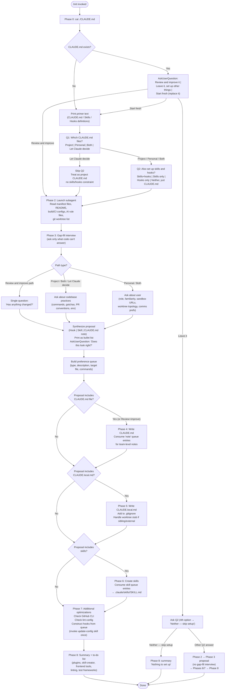

# `/init`

> Analysis basis: CC v2.1.168 bundle.js (AST extraction + Claude interpretation)
> Minimum version: v2.1.168

---

## Overview

The `/init` command bootstraps a new `CLAUDE.md` file (and optionally skills and hooks) for the current repository by walking the user through an eight-phase interactive workflow. It inspects the codebase, interviews the user about team conventions and personal preferences, then writes one or more persistent instruction files that future Claude Code sessions load automatically. The prompt body is conditionally assembled from two template variables at invocation time (a 20 920-character primary template and a 1 592-character secondary template).

---

## Registration

| Field | Value |
|---|---|
| type | `prompt` |
| name | `init` |
| description | `Initialize new CLAUDE.md file(s) and optional skills/hooks with codebase documentation \| Initialize a new CLAUDE.md file with codebase documentation` |
| loc_byte | `11608957` |
| loc_byte_end | `11609350` |
| loc_line | `7784` |
| handler_method | `getPromptForCommand` |
| handler_method_start | `11609273` |
| handler_method_end | `11609349` |
| prompt_body.length | `22519` characters |
| prompt_body.trace | `conditional; identifier→i0f (var template, 20920 chars); identifier→n0f (var template, 1592 chars)` |
| arbor_handler.name | `getPromptForCommand` |
| arbor_handler.fqn | `claude-2.1.168::getPromptForCommand` |
| arbor_handler.kind | `Method` |
| arbor_handler.resolution_path | `direct` |
| arbor_handler.n_hits | `2` |

Analysis basis: CC v2.1.168 bundle.js:+11608957

---

## Input Branching

The command's eight-phase flow contains more than three distinct decision branches (existing vs. absent `CLAUDE.md`, user Q1/Q2 answers, "Review and improve" vs. "Leave it" vs. "Start fresh", worktree topology, hook target scope, etc.), so a Mermaid flowchart is used.



---

## Behavioral Spec

### Handler dispatch (`getPromptForCommand`)

The Arbor symbol graph resolves the handler as `getPromptForCommand`, an `ObjectMethod` living directly inside the registration object (byte range `11609273`–`11609349`). The call graph's synthetic entry `__handler_init` is BFS bookkeeping only; `getPromptForCommand` is the real handler.

```
function getPromptForCommand(commandContext):
    templateText = selectTemplate(commandContext)   // conditional branch over i0f / n0f
    return { type: "text", content: templateText }
```

Analysis basis: CC v2.1.168 bundle.js:+11609279

The return type is `"text"` (literal found at bundle.js:+11609321), meaning the assembled prompt is delivered as a plain text message to the agent.

---

### Template selection

The prompt body is conditionally assembled from two variables:

| Variable | Size | Role |
|---|---|---|
| `i0f` | 20 920 chars | Full eight-phase init workflow (new/start-fresh path) |
| `n0f` | 1 592 chars | Shortened CLAUDE.md creation prompt (legacy/fallback path) |

Total serialised length: 22 519 characters.

Analysis basis: CC v2.1.168 bundle.js:+11608957 (registration block)

---

### Phase 0 — Existence check

```
function checkExistingClaudeMd(projectRoot):
    path = join(projectRoot, "CLAUDE.md")
    exists = tryReadFile(path)          // cat ./CLAUDE.md; only root counts
    return exists != null
```

The agent is instructed to read only the project-root file, not traverse the directory tree. This result gates all of Phase 1.

Analysis basis: CC v2.1.168 bundle.js:+11608957 (prompt_body Phase 0 section)

---

### Phase 1 — Interactive setup selection

```
function askSetupIntent(claudeMdExists):
    printPrimer()    // explains CLAUDE.md, Skills, Hooks to first-time users

    if claudeMdExists:
        answer = askUserQuestion("I found an existing CLAUDE.md. What would you like to do?",
                                  options=["Review and improve it",
                                           "Leave it, set up other things",
                                           "Start fresh (replace it)"])
        return routeExistingFile(answer)
    else:
        q1 = askUserQuestion("Which CLAUDE.md files should /init set up?",
                              options=["Project CLAUDE.md",
                                       "Personal CLAUDE.local.md",
                                       "Both project + personal",
                                       "Let Claude decide"])
        if q1 == "Let Claude decide":
            return { scope: "project", skillsHooks: "unrestricted", skipQ2: true }

        q2 = askUserQuestion("Also set up skills and hooks?",
                              options=["Skills + hooks", "Skills only",
                                       "Hooks only", "Neither, just CLAUDE.md"])
        return { scope: q1, skillsHooks: q2 }
```

Q1 and Q2 are always sent in separate `AskUserQuestion` calls. "Let Claude decide" causes Q2 to be skipped entirely.

Analysis basis: CC v2.1.168 bundle.js:+11608957 (prompt_body Phase 1 section)

---

### Phase 2 — Codebase exploration (subagent)

```
function exploreCodebase(projectRoot):
    files = [
        "package.json", "Cargo.toml", "pyproject.toml", "go.mod", "pom.xml",
        "README*", "Makefile", "build configs", "CI config",
        "CLAUDE.md", ".claude/rules/", "AGENTS.md",
        ".cursor/rules", ".cursorrules",
        ".github/copilot-instructions.md",
        ".devin/rules/", ".windsurf/rules/", ".windsurfrules",
        ".clinerules", ".mcp.json"
    ]
    subagent.read(files)

    detect = {
        buildTestLintCommands,
        languagesFrameworksPackageManager,
        projectStructure,          // monorepo | multi-module | single
        nonDefaultCodeStyleRules,
        gotchasEnvVarsQuirks,
        existingSkillsAndRulesDirectories,
        formatterConfig,           // prettier | biome | ruff | black | gofmt | rustfmt | unified script
        gitWorktrees               // git worktree list (relevant for CLAUDE.local.md)
    }

    gapItems = itemsCodeCannotAnswer(detect)
    return { findings: detect, gaps: gapItems }
```

Analysis basis: CC v2.1.168 bundle.js:+11608957 (prompt_body Phase 2 section)

---

### Phase 3 — Gap-fill interview and proposal synthesis

```
function gapFillAndPropose(setupIntent, codebaseFindings, gaps):
    // Interview
    if setupIntent.path == "review_and_improve":
        answer = askUserQuestion("Has anything changed about how the team works?",
                                  options=["No, nothing's changed", "Yes — let me describe"])
    else:
        if setupIntent.scope in ["project", "both", "let_claude_decide"]:
            askAboutCodebasePractices(gaps)     // non-obvious commands, gotchas, PR conventions
        if setupIntent.scope in ["personal", "both"]:
            askAboutUser(gaps)                  // role, familiarity, sandbox URLs, worktree topology, comms

    // Proposal synthesis: pick artifact type per evidence item
    proposal = []
    for item in (codebaseFindings + gapAnswers):
        if isDeterministicFastShellCommand(item):
            proposal.append(Hook(item))
        elif isOnDemandMultiStepWorkflow(item):
            proposal.append(Skill(item))
        else:
            proposal.append(ClaudeMdNote(item))

    printBulletList(proposal)    // printed as normal assistant text, not inside tool call
    confirmation = askUserQuestion("Does this look right?",
                                    options=["Looks good — proceed", "Drop the hook",
                                             "Drop the skill"])
    acceptedProposal = applyUserEdits(proposal, confirmation)

    // Build preference queue
    queue = []
    for item in acceptedProposal:
        queue.append({
            type: item.type,
            description: item.description,
            targetFile: item.targetFile,
            sourceDetails: item.phase2Data
        })
    return queue
```

If the user's Q2 hint conflicts with what the evidence supports, the agent notes the deviation in one line at the top of the proposal and proposes the better-fitting artifacts regardless.

Analysis basis: CC v2.1.168 bundle.js:+11608957 (prompt_body Phase 3 section)

---

### Phase 4 — Write CLAUDE.md

```
function writeClaudeMd(path, queue, reviewAndImprove, phase2Findings):
    if reviewAndImprove:
        existing = readFile(path)
        diffs = computeDiffs(existing, phase2Findings)    // additions/removals with one-line reason each
        printDiffs(diffs)
        answer = askUserQuestion("Apply these edits?",
                                  options=["Apply all", "Let me pick which", "Skip — leave it as is"])
        if answer == "Skip":
            return

    content = buildMinimalContent({
        header: "# CLAUDE.md\n\nThis file provides guidance to Claude Code...",
        include: [
            nonObviousBuildTestLintCommands,
            nonDefaultCodeStyleRules,
            testingInstructionsAndQuirks,
            repoEtiquette,
            requiredEnvVarsAndSetup,
            nonObviousGotchasAndArchitecture,
            importantAiToolConfigContent   // AGENTS.md, .cursor/rules, .cursorrules, etc.
        ],
        exclude: [
            fileByFileStructureLists,
            standardLanguageConventions,
            genericAdvice,
            detailedApiDocs,             // use @path/to/import instead
            frequentlyChangingInfo,      // use @path/to/import instead
            longTutorials,
            manifestObviousCommands
        ],
        notes: queue.filter(e => e.type == "note" && e.targetFile == "CLAUDE.md")
    })

    atomicWrite(path, content)   // via writeFileWithLock (sP_ / O$6 chain)

    // Suggest .claude/rules/ for multi-concern projects
    // Offer subdirectory CLAUDE.md files for monorepos
```

File content rule: every line must survive the test "Would removing this cause Claude to make mistakes?" Lines that fail are cut.

Analysis basis: CC v2.1.168 bundle.js:+11608957 (prompt_body Phase 4 section)

Lock acquisition timeout: 60 000 ms (bundle.js:+3266273). If contention exceeds 100 ms the `tengu_config_lock_contention` event fires (bundle.js:+3265592). A backup rotation keeps at most 5 backups (bundle.js:+3266522) under a `backups/` subdirectory (bundle.js:+3267104) using `.backup.` filename fragments (bundle.js:+3266389).

---

### Phase 5 — Write CLAUDE.local.md

```
function writeClaudeLocalMd(projectRoot, queue, worktreeTopology):
    path = join(projectRoot, "CLAUDE.local.md")

    if worktreeTopology == "sibling_or_external":
        // Upward file walk won't find this file from all worktrees
        personalPath = "~/.claude/<project-name>-instructions.md"
        writeFile(personalPath, personalContent)
        stub = "@" + personalPath
        writeFile(path, stub)    // one-line import stub
    else:
        content = buildPersonalContent({
            notes: queue.filter(e => e.type == "note" && e.targetFile == "CLAUDE.local.md"),
            include: [userRoleAndFamiliarity, sandboxUrlsAndAccounts, workflowPreferences]
        })
        if fileExists(path):
            proposeAdditionsOnly(path, content)   // never silently overwrite
        else:
            writeFile(path, content)

    addToGitignore(projectRoot, "CLAUDE.local.md")
```

The import stub (`@~/.claude/...`) must never be placed inside the project-level `CLAUDE.md`, as that would check a personal reference into the team-shared file.

Analysis basis: CC v2.1.168 bundle.js:+11608957 (prompt_body Phase 5 section)

---

### Phase 6 — Create skills

```
function createSkills(queue, existingSkillsDir, phase2Findings):
    existing = listExistingSkills(existingSkillsDir)   // do not overwrite

    // First: consume skill queue entries
    for entry in queue.filter(e => e.type == "skill"):
        skillName = deriveNameFromPreference(entry.description)
        body = buildSkillBody(entry, phase2Findings)
        if underspecified(entry):
            clarify = askFollowUp(entry)
        skillPath = ".claude/skills/" + skillName + "/SKILL.md"
        writeSkillFile(skillPath, {
            name: skillName,
            description: entry.description,
            disableModelInvocation: hasSideEffects(entry),
            arguments: "$ARGUMENTS" if hasSideEffects(entry) else null,
            body: body
        })

    // Then: suggest additional skills from Phase 2 findings
    for opportunity in findRepeatableWorkflows(phase2Findings):
        if not overlaps(opportunity, existing):
            suggestSkill(opportunity)   // name + one-line purpose + why it fits
```

Skills are written to `.claude/skills/<skill-name>/SKILL.md` with YAML frontmatter. Side-effect workflows receive `disable-model-invocation: true`.

Analysis basis: CC v2.1.168 bundle.js:+11608957 (prompt_body Phase 6 section)

---

### Phase 7 — Additional optimizations (hooks, GitHub CLI, linting)

```
function suggestOptimizations(queue, setupIntent, phase2Findings):
    // GitHub CLI check
    ghPresent = runShell("which gh")   // "where gh" on Windows
    if not ghPresent and usesGitHub(phase2Findings):
        askUserQuestion("Install GitHub CLI?", ...)

    // Lint config check
    if not lintConfigFound(phase2Findings):
        askUserQuestion("Set up linting for this codebase?", ...)

    // Hooks from preference queue
    hookEntries = queue.filter(e => e.type == "hook")
    if not hookEntries and formatterFound(phase2Findings):
        hookEntries.append(formatOnEditFallback(phase2Findings))

    if hookEntries:
        targetFile = resolveHookTargetFile(setupIntent)
        // project → .claude/settings.json
        // personal → .claude/settings.local.json
        // both/ambiguous → ask once for all hooks

        // Load hook schema ONCE per /init run
        invokeSkillTool("update-config",
                        args="[hooks-only] " + hookSummary)

        for hook in hookEntries:
            event, matcher = mapPreferenceToEvent(hook)
            // "after every edit"          → PostToolUse / Write|Edit
            // "when Claude finishes"      → Stop
            // "before running bash"       → PreToolUse / Bash
            // "before committing" (gate)  → NOT a settings hook → git pre-commit hook

            constructHook(hook, event, matcher, targetFile)
            // dedup → construct → pipe-test raw → wrap → write JSON
            // → jq -e validate → live-proof (PreToolUse/PostToolUse) → cleanup
```

"Before committing" as a literal git-commit gate cannot be expressed as a settings hook (matchers cannot filter Bash by command content); the agent must route that case to `.git/hooks/pre-commit`, husky, or the pre-commit framework instead.

Analysis basis: CC v2.1.168 bundle.js:+11608957 (prompt_body Phase 7 section)

---

### Phase 8 — Summary and next steps

```
function summarizeAndSuggestNextSteps(writtenArtifacts, phase2Findings, gaps7):
    printRecap(writtenArtifacts)    // which files were written + key points in each
    remindUserToTweak()             // "these are a starting point; run /init again anytime"

    toDoList = buildToDoList({
        frontend:      detectedFrontendFramework(phase2Findings),
        missingGhCli:  gaps7.ghCli and userDeclinedGhCli,
        missingLint:   gaps7.linting and userDeclinedLint,
        missingTests:  testsAbsentOrSparse(phase2Findings),
        alwaysInclude: [
            "/plugin install skill-creator@claude-plugins-official",
            "/plugin  (browse official plugins)"
        ]
    })
    printToDoList(sortByImpact(toDoList))
```

The `"onboarding_project_complete"` telemetry event fires once the `SH` (onboarding-completion handler) path is reached (bundle.js:+4031539).

Analysis basis: CC v2.1.168 bundle.js:+4031539

---

### Atomic file-write subsystem (`writeFileWithLock`)

The config and CLAUDE.md file writes use an atomic write helper reached via the `sP_` → `O$6` call chain:

```
function atomicWrite(targetPath, content, permissions):
    lockPath = targetPath + ".lock"
    acquire(lockPath, timeout=60000ms)         // tengu_config_lock_contention if > 100ms

    tmpPath = targetPath + ".backup." + randomHex(6) + ".tmp"
    writeToTemp(tmpPath, content)
    setPermissions(tmpPath, originalPerms)     // fchmod; logged: "Applied original permissions to temp file"
    fsync(tmpPath)
    rename(tmpPath, targetPath)                // atomic on POSIX

    pruneOldBackups(backupsDir, keep=5)        // ".backup." pattern; max 5 retained
    release(lockPath)
```

Auth-loss guard: before committing any write the helper re-reads the config and aborts if the cached auth is present but the re-read copy is missing it, emitting `tengu_config_auth_loss_prevented` (bundle.js:+3266071). The matching fallback message literal is `"saveConfigWithLock: re-read config is missing auth…"` (bundle.js:+3265919).

Analysis basis: CC v2.1.168 bundle.js:+3265881 (`sP_` call to `LwH`), +3265087 (`aP_` call to `O$6`)

---

### Workspace empty-state hint

When `/init` is run inside an empty workspace (no files), a secondary path surfaces the literal strings `"workspace"` (bundle.js:+4031065) and `"Ask Claude to create a new app or clone a repository"` (bundle.js:+4031082) as an onboarding hint, and sets a `"claudemd"` UI marker (bundle.js:+4031186) with the message `"Run /init to create a CLAUDE.md file with instructions for Claude"` (bundle.js:+4031202).

Analysis basis: CC v2.1.168 bundle.js:+4031065

---

## State & Side Effects

| Item | Detail |
|---|---|
| Telemetry — `tengu_config_parse_error` | Fired when the config JSON cannot be parsed (bundle.js:+3268167) |
| Telemetry — `tengu_config_lock_contention` | Fired when lock acquisition takes longer than 100 ms (bundle.js:+3265592) |
| Telemetry — `tengu_config_stale_write` | Fired when a stale write is detected during config save (bundle.js:+3265728) |
| Telemetry — `tengu_config_auth_loss_prevented` | Fired when a write is aborted to prevent wiping auth credentials (bundle.js:+3266071) |
| Telemetry — `tengu_feature_sad` | Fired on feature-flag failure path (bundle.js:+1011093) |
| Telemetry — `tengu_feature_ok` | Fired on feature-flag success path (bundle.js:+1010950) |
| Telemetry — `tengu_slate_harbor_experiment` | Fired during experiment-variant selection for the init prompt (bundle.js:+11585848) |
| Telemetry — `growthbook_experiment` | GrowthBook experiment event emitted via `Qo.emit` during variant assignment (bundle.js:+3238039) |
| File writes | `CLAUDE.md`, `CLAUDE.local.md`, `.claude/skills/<name>/SKILL.md`, `.claude/settings.json` or `.claude/settings.local.json` (hooks), `~/.claude/<project-name>-instructions.md` (sibling-worktree path) |
| .gitignore mutation | `CLAUDE.local.md` is appended to `.gitignore` in Phase 5 |
| Config backup rotation | Old backups pruned to 5 maximum under `backups/` subdirectory (bundle.js:+3267104, +3266522) |
| Experiment variant assignment | `tengu_slate_harbor_experiment` indicates an A/B branch on the prompt template (i0f vs. n0f); variant influences prompt length (20 920 vs. 1 592 chars) |
| Hook schema loaded | `update-config` skill invoked once per `/init` run before first hook is constructed |
| onboarding_project_complete | String literal at bundle.js:+4031539; emitted when the onboarding completion handler (`SH` → `J6` → `hm6`) fires |
| appState — `claudemd` marker | Set to `"Run /init to create a CLAUDE.md file with instructions for Claude"` on empty workspace (bundle.js:+4031202) |

---

## Version History

| Version | Change |
|---|---|
| v2.1.168 | Initial analysis — eight-phase interactive init workflow; conditional prompt template (i0f/n0f) via A/B experiment; atomic file writes with auth-loss guard; skills, hooks, and CLAUDE.local.md creation support |

---

## Common Mistakes

1. **Running `/init` inside a subdirectory.** Phase 0 reads only the project-root `CLAUDE.md`. If invoked from a subdirectory the root file will not be found even if it exists, causing the "no file" branch to activate incorrectly.
2. **Putting the worktree import stub in `CLAUDE.md`.** The `@~/.claude/<project-name>-instructions.md` import line belongs in `CLAUDE.local.md` only. Placing it in the shared `CLAUDE.md` checks a personal file reference into version control.
3. **Expecting Q2 to act as a hard filter.** Q2 ("skills and hooks?") is a hint. Phase 3 will propose whatever fits the codebase evidence and will note any deviation from the hint at the top of the proposal.
4. **Trying to gate on specific `git commit` content via a settings hook.** Matchers in `PostToolUse`/`PreToolUse` cannot filter Bash commands by their content; a "before committing" gate must be implemented as a git pre-commit hook, not a `.claude/settings.json` hook.
5. **Re-invoking the `update-config` skill for every hook.** It must be loaded exactly once per `/init` run; subsequent hooks reuse the already-loaded schema.
6. **Ignoring the auth-loss guard.** The atomic write path aborts and emits `tengu_config_auth_loss_prevented` if re-reading the config reveals missing auth credentials. Callers should not retry unconditionally after seeing this event.
7. **Assuming the prompt template is constant.** The `tengu_slate_harbor_experiment` event indicates the prompt is A/B-tested; the 1 592-character `n0f` variant omits several phases present in the full 20 920-character `i0f` variant.

---

## Appendix — Identifier Mapping

> For bundle debugging only. Identifiers change across versions.

| Identifier | Role |
|---|---|
| `__handler_init` | Synthetic BFS entry point for the `/init` command handler (not a real bundle symbol) |
| `FiH` | Top-level init orchestrator; calls codebase-explore, file-write, and onboarding-complete helpers |
| `qz` | Config file watcher / reader coordination function |
| `C6` | Config read-with-watch entry point |
| `d6` | Config path resolver utility |
| `nP_` | Config namespace/prefix helper |
| `LwH` | Config file reader with backup and ENOENT handling |
| `hVL` | File-watch registration and debounce handler |
| `l49` | CLAUDE.md path locator (joins project root + `"CLAUDE.md"` literal) |
| `VE_` | Project-root resolver used by CLAUDE.md locator |
| `u6` | Workspace root detection helper |
| `Al6` | Alternate path utility called from project-root resolver |
| `TY` | Primary CLAUDE.md write orchestrator (lock, backup, atomic-write sequence) |
| `sP_` | Core save-config-with-lock function (60 000 ms timeout, 5-backup limit) |
| `_` | General string/path utility (used across multiple call sites) |
| `L` | Async task tracker / cleanup registry (`add`, `delete`, `finally`) |
| `R21` | Config merge / `Object.assign` wrapper |
| `v` | Log/debug emitter (emits `"debug"` level) |
| `l` | Logger instance used for structured output |
| `V8` | Error-normalisation utility |
| `aj6` | Auth-loss guard — compares cached auth against re-read config |
| `A` | String normaliser (`.toLowerCase`) |
| `RH` | JSON serialiser wrapper (`JSON.stringify`) |
| `tP_` | Backup-file path builder (joins `backups/` dir + timestamp + `.backup.` fragment) |
| `V` | Config value accessor with `.startsWith` check |
| `P` | Text-editor / input component (INSERT/NORMAL mode, offset, onChange) |
| `E` | Array/slice utility |
| `O$6` | Atomic write implementation (temp file → fchmod → fsync → rename → unlink) |
| `f` | File-handle close manager |
| `H` | Bootstrap fetch handler (`[Bootstrap] Fetching` / `Content-Type` / `User-Agent`) |
| `Y3` | Bootstrap response processor |
| `mj_` | String-split / trim / indexOf / slice utility for prompt tokenisation |
| `lHH` | Feature-flag set membership check (`o74.has`) |
| `uj` | String replacement helper (`H.replace`) |
| `H9` | Feature-flag evaluation (calls `m6H`, `s9`, `FJ`) |
| `o6` | Feature telemetry dispatcher (routes to `tengu_feature_ok` / `tengu_feature_sad`) |
| `dlH` | Directory-listing helper called during CLAUDE.md write |
| `qK8` | Timestamp helper (`Date.now`) |
| `aP_` | Save-current-project-config with auth-loss fallback guard |
| `SH` | Onboarding-completion signal emitter (fires `"onboarding_project_complete"`) |
| `J6` | Onboarding event dispatch helper |
| `hm6` | Low-level onboarding event emitter |
| `l0f` | Experiment-variant selector; emits `tengu_slate_harbor_experiment` |
| `_6` | String coercion utility (`String(...)`) |
| `D6` | Experiment cache lookup and assignment coordinator |
| `cj6` | Experiment config loader |
| `lj6` | Experiment registry reader |
| `hu` | Experiment evaluation entry point |
| `yu` | GrowthBook client accessor |
| `cq8` | Experiment-result cacher (uses `RP_` set + `HwH` map) |
| `hP_` | GrowthBook experiment runner; emits `GrowthbookExperimentEvent` / `growthbook_experiment` |
| `uP_` | Experiment post-processor (calls `Ep1`, `l_`, `zo1`, `lHH`) |

---

Note: index built via Arbor fallback; some signals (telemetry, literals) may be missing — see arbor-fallback.js.