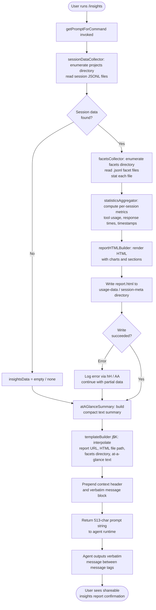

# `/insights`

> Analysis basis: CC v2.1.168 bundle.js (AST extraction + Claude interpretation)
> Minimum version: v2.1.168

---

## Overview

The `/insights` command generates a comprehensive HTML usage-analytics report from the user's historical Claude Code session data, writes the report to disk, and then instructs the agent to output a single pre-composed confirmation message (verbatim) pointing the user to the generated file. The command is a `prompt`-type slash command: its handler builds the prompt text at invocation time by collecting session facets, computing statistics, and injecting them into a fixed message template before handing control to the agent.

---

## Registration

| Field | Value |
|---|---|
| type | `prompt` |
| name | `insights` |
| description | `Generate a report analyzing your Claude Code sessions` |
| loc_byte | `13186580` |
| loc_byte_end | `13187884` |
| loc_line | `10611` |
| handler_method | `getPromptForCommand` |
| handler_method_start | `13186754` |
| handler_method_end | `13187883` |
| prompt_body.length | `513` |
| prompt_body.trace | `call→j$K(...) (1 literals)` |
| arbor_handler.name | `getPromptForCommand` |
| arbor_handler.fqn | `claude-2.1.168::getPromptForCommand` |
| arbor_handler.kind | `Method` |
| arbor_handler.resolution_path | `direct` |
| arbor_handler.n_hits | `1` |

Analysis basis: CC v2.1.168 bundle.js:+13186580

---

## Input Branching

The command has several distinct branches: (1) normal success path with insights data present, (2) no insights data generated (fallback message), (3) report HTML write path, (4) facets directory enumeration. A Mermaid flowchart is used because there are 3+ distinct paths.



---

## Behavioral Spec

### 1. Handler Entry — `getPromptForCommand`

The registration object carries the handler inline as an `ObjectMethod` named `getPromptForCommand`. The Arbor resolver confirmed a single direct hit at the registration byte range.

```
function getPromptForCommand(context):
    insightsBundle = sessionDataCollector(context)       // w$K
    reportPaths    = reportWriter(insightsBundle)        // YQf / OQf
    atAGlance      = buildAtAGlanceSummary(insightsBundle) // jQf → at_a_glance key
    promptText     = templateBuilder(                    // j$K
                         insightsBundle,
                         reportPaths.reportURL,
                         reportPaths.htmlFile,
                         reportPaths.facetsDir,
                         atAGlance)
    return promptText
```

Analysis basis: CC v2.1.168 bundle.js:+13186760

---

### 2. Session Data Collector — `sessionDataCollector` (`w$K`)

Discovers all project directories under the `projects` path, slices to the most recent batch, and in parallel reads per-session metadata.

```
async function sessionDataCollector(context):
    projectDirs = enumerateProjectDirectories()     // ZQf → readdir + isDirectory filter
    recentDirs  = projectDirs.slice(0, MAX_RECENT)  // literal: 50 (bundle.js:+13173536)

    sessionRecords = await Promise.all(
        recentDirs.map(dir => readSessionRecord(dir))  // zQf per dir
    )

    // For each dir also collect facet files (.jsonl filter)
    facetData = await facetsCollector(projectDirs)  // oq6

    // Sort sessions
    sorted = sessionRecords.sort(byTimestamp)        // q.sort at +13173448

    // Compute statistics
    stats = statisticsAggregator(sorted)             // Du8

    return { projectDirs, sessionRecords: sorted, facetData, stats }
```

- Maximum recent directories sliced: **50** (bundle.js:+13173536)
- Secondary slice limit seen in literals: **200** (bundle.js:+13173541)
- Session directories are sorted with `setImmediate`-deferred sort to avoid blocking (bundle.js:+13173424)

Analysis basis: CC v2.1.168 bundle.js:+13186853

---

### 3. Directory Enumeration — `projectDirectoryEnumerator` (`ZQf`)

```
async function projectDirectoryEnumerator(basePath):
    entries = await fs.readdir(basePath, { withFileTypes: true })  // XR.readdir +13173144
    dirs    = entries.filter(e => e.isDirectory())                  // +13173212
    paths   = dirs.map(d => path.join(basePath, d.name))           // OQ.join +13173238

    for each path p:
        facets = await facetsCollector(p)      // oq6 +13173302
        push result

    await setImmediate()                        // yield to event loop +13173424
    return results.sort(comparator)             // +13173448
```

- The `projects` string literal is used as the top-level subdirectory name (bundle.js:+6745739).

Analysis basis: CC v2.1.168 bundle.js:+13173517

---

### 4. Facets File Collector — `facetsCollector` (`oq6`)

```
async function facetsCollector(dirPath):
    entries = await fs.readdir(dirPath)            // wL.readdir +13259927
    files   = entries.filter(e => e.isFile()
                  && hasJsonlExtension(e))          // isFile +13260004, ".jsonl" +13260033
    basenames = files.map(f => path.basename(f))   // ND.basename +13260061

    results = []
    await Promise.all(files.map(async f =>
        stat = await fs.stat(path.join(dirPath, f)) // wL.stat +13260236
        results.push({ name: basename, stat })
    ))

    return results
```

- Only `.jsonl` files are collected (bundle.js:+13260033).

Analysis basis: CC v2.1.168 bundle.js:+13173302

---

### 5. Session Record Reader — `sessionRecordReader` (`zQf`)

```
async function sessionRecordReader(projectDir):
    usageDataPath   = path.join(projectDir, "usage-data")    // literal +13112469
    sessionMetaPath = path.join(projectDir, "session-meta")  // literal +13112565

    rawBytes = await fs.readFile(usageDataPath, "utf-8")     // XR.readFile +13118576, "utf-8" +13118600
    parsed   = jsonSafeParse(rawBytes)                       // U6 → JSON.parse +186041

    return sessionMetaBuilder(parsed)                        // z$K + U6
```

Analysis basis: CC v2.1.168 bundle.js:+13173670

---

### 6. Statistics Aggregator — `statisticsAggregator` (`Du8`)

Aggregates per-session records into cross-session metrics consumed by the HTML report builder.

```
function statisticsAggregator(sessionRecords):
    // Per-session chain walk
    for each session in sessionRecords:
        if not alreadySeen(session.uuid):     // G.has +13260762
            chainData = sessionChainWalker(session)   // r1H
            push to results

    // Collect tool usage, response times, timestamps, etc.
    toolStats    = toolUsageAccumulator(chainData)   // KMH
    facetsSummary = facetMapper(chainData)            // H3K
    timeStats    = timeOfDayBuckets(chainData)        // n86 → H.map +13224840
    textSummary  = markdownToHtmlConverter(chainData) // wMA

    return {
        toolStats, facetsSummary, timeStats, textSummary,
        sessionCount, totalMessages, ...
    }
```

Analysis basis: CC v2.1.168 bundle.js:+13174120

---

### 7. HTML Report Builder — `htmlReportBuilder` (`TQf`)

Produces the full HTML string for `report.html`.

```
function htmlReportBuilder(stats):
    // Sanitize HTML entities in all string values
    sanitized = htmlEscape(stats)        // K5 → F7 → H.replaceAll with &amp; &lt; &gt; &quot; &apos;

    // Build individual chart/section HTML fragments
    toolErrorsSection  = toolErrorsHtml(stats.toolStats)     // F$H
    responseTimeSection = responseTimeHtml(stats.timeStats)  // PQf
    timeOfDaySection   = timeOfDayHtml(stats.timeOfDay)      // WQf
    chartSection       = chartHtml(stats)                    // GQf → RH (JSON.stringify)

    // Inject color palette literals
    colors = ["#2563eb", "#0891b2", "#10b981", "#8b5cf6",   // +13167352..+13167805
              "#dc2626", "#16a34a", "#eab308"]               // +13171068..+13171810

    // Bullet-point and bold markdown conversion
    content = content.replace(boldPattern, "<strong>$1</strong>")  // +13131393
    content = content.replaceAll("• ", "• ")                       // +13131436
    content = content.replaceAll(newlines, "<br>")                 // +13131466

    return fullHtmlDocument
```

- Response-time buckets used in the report: `2-10s`, `10-30s`, `30s-1m`, `1-2m`, `2-5m`, `5-15m`, `>15m` (bundle.js:+13129687–+13129747).
- Time-of-day buckets: `Morning (6-12)`, `Afternoon (12-18)`, `Evening (18-24)`, `Night (0-6)` (bundle.js:+13130535–+13130688).
- Maximum HTML template token budget: **8192** (bundle.js:+13128856).
- Empty-state placeholder: `<p class="empty">No data</p>` (bundle.js:+13129178).

Analysis basis: CC v2.1.168 bundle.js:+13175496

---

### 8. Report Writer — `reportWriter` (`YQf` / `OQf`)

```
async function reportWriter(insightsBundle, htmlContent):
    // Ensure output directory exists
    await fs.mkdir(outputDir, { recursive: true })   // XR.mkdir +13175515 / +13119117

    // Compute timestamped filename
    now     = new Date()
    datePart = String(now.getFullYear())             // +13175575
               + padMonth(now.getMonth())             // +13175627
               + padDay(now.getDate())               // +13175648
    timePart = padHours(now.getHours())              // +13175666
               + padMinutes(now.getMinutes())         // +13175684
               + padSeconds(now.getSeconds())         // +13175704

    outputPath = path.join(outputDir, "report.html") // literal +13175774

    await fs.writeFile(outputPath, htmlContent)      // XR.writeFile +13175802

    return { reportURL, htmlFile: outputPath, facetsDir }
```

- Output filename is always `report.html` (bundle.js:+13175774).

Analysis basis: CC v2.1.168 bundle.js:+13174358

---

### 9. Prompt Template Builder — `promptTemplateBuilder` (`j$K`)

Called directly from `getPromptForCommand` to produce the final 513-character prompt string.

```
function promptTemplateBuilder(insightsData, reportURL, htmlFile, facetsDir, atAGlance):
    if insightsData is empty or null:
        return NO_INSIGHTS_FALLBACK   // literal "_No insights generated_" +13187651

    summary = atAGlance ?? ""
    separator = " · "                 // literal +13187212

    prompt = buildPromptString(
        insightsData,
        reportURL,
        htmlFile,
        facetsDir,
        summary,
        separator
    )
    // prompt instructs agent to output verbatim <message> block
    return prompt    // length = 513 chars
```

- Fallback when no data: `_No insights generated_` (bundle.js:+13187651).
- The separator literal ` · ` is used in the at-a-glance summary line (bundle.js:+13187212).
- The prompt body instructs the agent: output the text between `<message>` tags verbatim as the entire response, with no omissions.
- The `<message>` block contains the shareable report URL and an invitation to explore sections or suggestions.

Analysis basis: CC v2.1.168 bundle.js:+13187786

---

### 10. At-a-Glance Summary Builder — `atAGlanceSummaryBuilder` (`jQf`)

```
function atAGlanceSummaryBuilder(stats):
    // Collect all session values
    allValues = Array.from(stats.values())      // +13125179
    rounded   = Math.round(aggregateMetric)     // +13125633

    // Per-session entry
    for each [key, value] in Object.entries(stats):  // +13125700
        line = RH(value)                             // JSON.stringify for safe embedding

    // Parallel render of all session entries
    rendered = await Promise.all(
        sessionList.map(s => perSessionRenderer(s))  // M$K +13126098
    )

    atAGlance = rendered.join(separator)
    if atAGlance is empty:
        atAGlance = "None captured"                  // literal +13126048

    return { key: "at_a_glance", value: atAGlance }  // "at_a_glance" +13126714
```

- The key `"at_a_glance"` is emitted into the prompt context (bundle.js:+13126714).
- Fallback when no sessions: `"None captured"` (bundle.js:+13126048).

Analysis basis: CC v2.1.168 bundle.js:+13175485

---

### 11. Chain Walker — `sessionChainWalker` (`r1H`)

Walks the JSONL conversation chain for a single session, indexing messages by UUID and reconstructing the parent→child turn sequence.

```
function sessionChainWalker(sessionDir):
    // Read raw JSONL via low-level reader
    rawRecords = jsonlFileReader(sessionDir)   // Jdf / jdf
    // Also reads via wL.readFile +13248839

    // Detect and skip phantom parents
    // telemetry: tengu_transcript_phantom_parent (+13245518)
    // telemetry: tengu_transcript_parent_cycle   (+13249320)

    // Build maps keyed by metadata type strings:
    // "summary", "last-prompt", "custom-title", "ai-title", "tag",
    // "agent-name", "agent-color", "agent-setting", "mode",
    // "permission-mode", "worktree-state", "pr-link",
    // "bridge-session", "file-history-snapshot",
    // "attribution-snapshot", "content-replacement",
    // "fork-context-ref", "marble-origami-commit",
    // "marble-origami-snapshot", "marble-origami-reset"

    return { messages, metadata, stats }
```

Analysis basis: CC v2.1.168 bundle.js:+13246459

---

## State & Side Effects

| Item | Detail |
|---|---|
| Telemetry | `tengu_transcript_phantom_parent` (bundle.js:+13245518) — fired when a phantom parent UUID is detected during chain walking |
| Telemetry | `tengu_transcript_parent_cycle` (bundle.js:+13249320) — fired when a cyclic parent reference is detected |
| Telemetry | `tengu_chain_parent_cycle` (bundle.js:+13227009) — fired in chain-ordering sub-routine |
| Telemetry | `tengu_chain_timestamp_fallback` (bundle.js:+13227158) — fired when timestamp ordering falls back |
| Telemetry | `tengu_chain_parallel_tr_recovered` (bundle.js:+13229024) — fired when parallel transcript recovery succeeds |
| Telemetry | `tengu_relink_walk_broken` (bundle.js:+13225236) — fired when a relink walk finds a broken link |
| File writes | `report.html` written to the usage-data/session-meta output directory via `fs.writeFile` (bundle.js:+13175802) |
| File reads | Session JSONL files read from per-project `usage-data` and `session-meta` subdirectories (bundle.js:+13112469, +13112565) |
| Directory creation | Output directory created with `fs.mkdir({ recursive: true })` before writing report (bundle.js:+13175515) |
| appState changes | None directly observed in depth-2 traversal |
| Sound | None observed |
| Hook registration | None observed |
| Agent output constraint | Prompt instructs agent to output the `<message>` block verbatim with no omissions |

---

## Version History

| Version | Change |
|---|---|
| v2.1.168 | Initial analysis |

---

## Common Mistakes

1. **Running `/insights` in a project with no session history** — the command will fall back to `_No insights generated_` (bundle.js:+13187651) and the agent will indicate no data is available rather than generating a report.
2. **Expecting live/real-time data** — the report is generated from on-disk JSONL facet files and session metadata; it reflects historical sessions, not the current live session.
3. **Assuming the agent will add commentary** — the prompt body explicitly instructs the agent to output only the verbatim `<message>` block. Any follow-up analysis requires a second user turn.
4. **Expecting a specific file path** — the output file is always named `report.html` (bundle.js:+13175774) inside the computed output directory; the exact parent path depends on the user's Claude Code data directory.
5. **Modifying facet files while `/insights` runs** — the command reads `.jsonl` files in a parallel `Promise.all` pass; concurrent writes to those files may produce incomplete or inconsistent statistics.

---

## Appendix — Identifier Mapping

> For bundle debugging only. Identifiers change across versions.

| Identifier | Role |
|---|---|
| `__handler_insights` | Synthetic BFS entry point for the `/insights` command handler |
| `w$K` | Session data collector — top-level orchestrator for the insights pipeline |
| `ZQf` | Project directory enumerator — reads and filters project subdirectories |
| `Ql` | Path join helper using `projects` subdirectory literal |
| `oq6` | Facets file collector — enumerates `.jsonl` files and stats them |
| `BF` | JSONL extension tester (regex `.test`) |
| `zQf` | Session record reader — reads and parses `usage-data` / `session-meta` files |
| `F5A` | Usage-data path builder |
| `Hb6` | Session-meta path builder |
| `z$K` | Session metadata parser helper |
| `U6` | JSON safe-parse wrapper (`JSON.parse`) |
| `Du8` | Statistics aggregator — accumulates cross-session metrics |
| `r1H` | Session chain walker — reconstructs conversation turn sequences from JSONL |
| `QQf` | Chain walk helper (called from chain walker) |
| `Jdf` | Low-level JSONL file reader (Buffer-based, sync reads via `PR.openSync`) |
| `Xdf` | Alternate low-level file reader |
| `jdf` | Secondary JSONL record parser |
| `p$K` | Relink / parent-pointer resolver |
| `KMH` | Tool-usage accumulator |
| `qdf` | NaN-safe numeric helper for chain statistics |
| `Kdf` | Chain ordering and deduplication |
| `_df` | Chain shift and sort helper |
| `H3K` | Facet mapper — indexes facets by key |
| `n86` | Time-of-day mapper (`H.map`) |
| `wMA` | Markdown-to-text converter with `replaceAll` normalization |
| `SR6` | String substitution helper used by markdown converter |
| `JMA` | Attachment/image filter |
| `Ldf` | Array/trim validation helper |
| `fdf` | Array membership test helper |
| `Vu8` | Session value getter/setter |
| `Nu8` | Session values-from-array builder |
| `TQf` | HTML report builder — renders the full `report.html` document |
| `K5` | HTML entity escaper (delegates to `F7`) |
| `F7` | HTML entity replacement via `H.replaceAll` |
| `zu8` | Secondary HTML escaper |
| `GQf` | Chart data JSON serializer (`RH` → `JSON.stringify`) |
| `F$H` | Tool-errors section HTML builder |
| `PQf` | Response-time section HTML builder |
| `WQf` | Time-of-day section HTML builder |
| `YQf` | Report file writer (primary) — `mkdir` + `writeFile` |
| `OQf` | Report file writer (secondary) — `mkdir` + `writeFile` |
| `RH` | JSON stringify wrapper |
| `$Qf` | Alternative session file reader with unlink support |
| `Yu8` | Session-meta path builder (used in `$Qf` and `OQf`) |
| `J$K` | Session file cleanup helper |
| `DQf` | Insights report orchestrator — calls chain walkers, HTML builder, and API layer |
| `MQf` | Multi-session batch processor |
| `KQf` | Per-session statistics processor |
| `o_6` | API call dispatcher for per-session LLM analysis |
| `K4` | Session API context builder |
| `aI8` | LLM API request builder (hashes, reads files, calls API) |
| `u8` | Request UUID generator |
| `fuH` | LLM response extractor |
| `nT` | Post-processing step after API response |
| `$$K` | Insights-type gate (checks `"insights"` literal) |
| `bT` | First-party module selector |
| `sK` | Message filter (`H.filter`) |
| `M$K` | Per-session renderer (called in `atAGlanceSummaryBuilder`) |
| `sgf` | Per-session first-party router |
| `jQf` | At-a-glance summary builder |
| `D$K` | Cross-session statistics compiler (percentiles, floor/round) |
| `rq6` | Object-entries helper for stats |
| `d1` | String index/slice helper |
| `Y$K` | Finite-number accumulator with set deduplication |
| `AQf` | NaN guard for numeric aggregation |
| `Q5A` | Per-session metric normalizer |
| `O$K` | Session record field extractor and classifier |
| `_Qf` | File extension extractor (`OQ.extname`) |
| `DXH` | Diff computation helper (`RV9.diff`) |
| `eC6` | Miscellaneous string classifier |
| `t4` | Array index helper |
| `S$` | String trim utility |
| `g5A` | Session cache lookup helper |
| `AA` | Error/string coercion utility |
| `VQf` | Object-keys enumerator for report sections |
| `j$K` | Prompt template builder — produces the final 513-char prompt string |
| `GZH` | Compact-summary dispatch helper |
| `hH` | Error logger (calls `pr.logError`) |
| `v7` | MCP error logger (calls `pr.logMCPError`) |
| `M8` | MCP debug logger (calls `pr.logMCPDebug`) |
| `xbH` | MCP connection manager (broad; reached via `M.push`) |
| `PF8` | MCP connection result applier |
| `cDA` | MCP client collection updater |
| `wk8` | OAuth flow handler |
| `jk8` | OAuth callback handler |
| `Ze_` | MCP connection state handler |
| `phq` | MCP post-connect handler |
| `hhq` | MCP date/time handler |
| `BD8` | MCP timestamp builder |
| `mD8` | MCP metadata builder |
| `bhq` | MCP auth-flow helper |
| `L16` | Port parseInt helper |
| `lk8` | Secondary parseInt helper |
| `DLK` | Session-keepalive dispatcher |
| `_6` | String coercion wrapper |
| `t1` | Version-8 validator |
| `GH` | String coercion via `String()` |
| `tN` | D6 dispatcher |
| `hx_` | Array-includes guard |
| `HH` | Voice recording session manager |
| `r` | Voice recording finisher |
| `s` | Notification manager |
| `y` | Away-summary generator |
| `g` | MCP write-timeout manager |
| `m` | Write-timeout inner handler |
| `C` | Rate-limit event enqueuer |
| `Q` | Background session process manager |
| `w` | Background worker lifecycle manager |
| `D` | Forced-shutdown handler |
| `Ay` | MCP cleanup orchestrator |
| `bbH` | MCP connection timestamp helper |
| `q16` | tXH dispatcher |
| `$GH` | Supervisor write handler |
| `UfK` | Supervisor column-width calculator |
| `TUK` | Heartbeat trigger |

---

Note: index built via Arbor fallback; some signals (telemetry, literals) may be missing — see arbor-fallback.js.