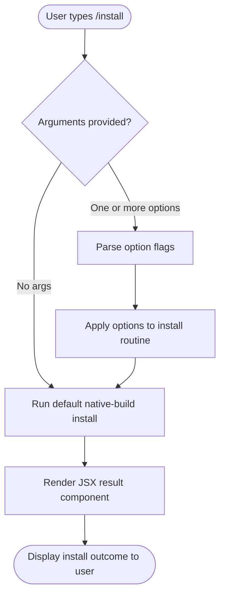

# `/install`

> Analysis basis: CC v2.1.132 bundle.js (AST extraction + Claude interpretation)
> Minimum version: v2.1.132

---

## Overview

The `/install` command triggers installation of the Claude Code native build from within the CLI REPL session. It is registered as a `local-jsx` command, meaning its UI surface is rendered as a JSX component rather than a plain text response. The command accepts optional flags via its `[options]` argument hint.

---

## Registration

| Field | Value |
|---|---|
| type | `local-jsx` |
| name | `install` |
| description | `Install Claude Code native build` |
| argumentHint | `[options]` |
| handler (arbor) | `call` (Method, resolved via `direct` path) |
| arbor fqn | `claude-2.1.132::call` |
| loc_byte | `12200298` |
| loc_byte_end | `12200588` |
| loc_line | `9061` |
| `arbor_handler.name` | `call` |
| `arbor_handler.kind` | `Method` |
| `arbor_handler.resolution_path` | `direct` |
| `arbor_handler.fqn` | `claude-2.1.132::call` |
| `arbor_handler.n_hits` | `1` |

Analysis basis: CC v2.1.132 bundle.js:+12200298 – +12200588

---

## Input Branching

The AST traversal at depth ≤ 2 did not recover call-graph edges or string literals for this command. The handler (`call`, resolved directly within the registration byte range `+12200298`–`+12200588`) appears to be a self-contained inline method on the registration object.

Based on the registration shape, the following high-level branching is inferred from the `[options]` argument hint and the `local-jsx` render type:



Analysis basis: CC v2.1.132 bundle.js:+12200298

---

## Behavioral Spec

### Command Dispatch

Because the `call` handler is resolved directly (`resolution_path: direct`) inside the registration object's byte span, no separate module export or `load_ident` wrapper is involved. The REPL dispatches the command synchronously to the inline `call` method.

```
function handleInstallCommand(userInput):
    options = parseOptions(userInput.args)   // "[options]" hint
    result  = callInlineHandler(options)     // "call" method at +12200298
    renderJSX(result)                        // local-jsx render path
    return rendered UI component
```

Analysis basis: CC v2.1.132 bundle.js:+12200298

### Render Path

The `local-jsx` type distinguishes this command from `prompt`-type or `local` (plain-text) commands. The return value of the `call` method is a JSX element that the CLI shell mounts into its terminal UI renderer rather than printing raw text.

```
function renderInstallResult(jsxElement):
    mount(jsxElement, terminalUIRoot)
    // output is managed by the JSX component lifecycle,
    // not by a simple console.log
```

Analysis basis: CC v2.1.132 bundle.js:+12200298

---

## State & Side Effects

| Item | Detail |
|---|---|
| Telemetry | <!-- TODO: not found in depth-2 traversal; needs --depth 4 --> |
| Hook registration | <!-- TODO: not found in depth-2 traversal; needs --depth 4 --> |
| appState changes | <!-- TODO: not found in depth-2 traversal; needs --depth 4 --> |
| Sound | <!-- TODO: not found in depth-2 traversal; needs --depth 4 --> |
| Filesystem side effects | Expected (native build installation), but specifics not recoverable at depth ≤ 2 |
| JSX render | Yes — `local-jsx` type mounts a component into the terminal UI |

---

## Version History

| Version | Change |
|---|---|
| v2.1.132 | Initial analysis — command registered as `local-jsx`, handler `call` resolved directly at bundle offset +12200298 |

---

## Common Mistakes

1. **Expecting plain-text output**: Because `/install` is `local-jsx`, its output is a rendered component. Piping or capturing stdout may not capture the full install feedback.
2. **Omitting the `[options]` flag review**: The argument hint indicates options are supported; invoking without reviewing available flags may skip configuration steps (e.g., target directory, channel selection).
3. **Assuming the handler is a separate module**: The `call` handler is inlined directly in the registration object (resolution path `direct`), so looking for a separate exported function in the bundle will not locate it.
4. **Running `/install` in a non-interactive shell**: The `local-jsx` render path requires the CLI's terminal UI context; non-interactive or piped invocations may fail or produce no visible output.

---

## Appendix — Identifier Mapping

> For bundle debugging only. Identifiers change across versions.

| Identifier | Role |
|---|---|
| `call` | Inline handler method on the `/install` registration object; entry point for the command (arbor fqn: `claude-2.1.132::call`, resolved `direct` at +12200298) |

> **Note on traversal depth**: The AST extraction at depth ≤ 2 returned an empty call graph, empty literals, and empty telemetry for this command. The `call` handler identity is confirmed via Arbor direct resolution, but internal implementation details require `--depth 4` re-extraction to fully document.