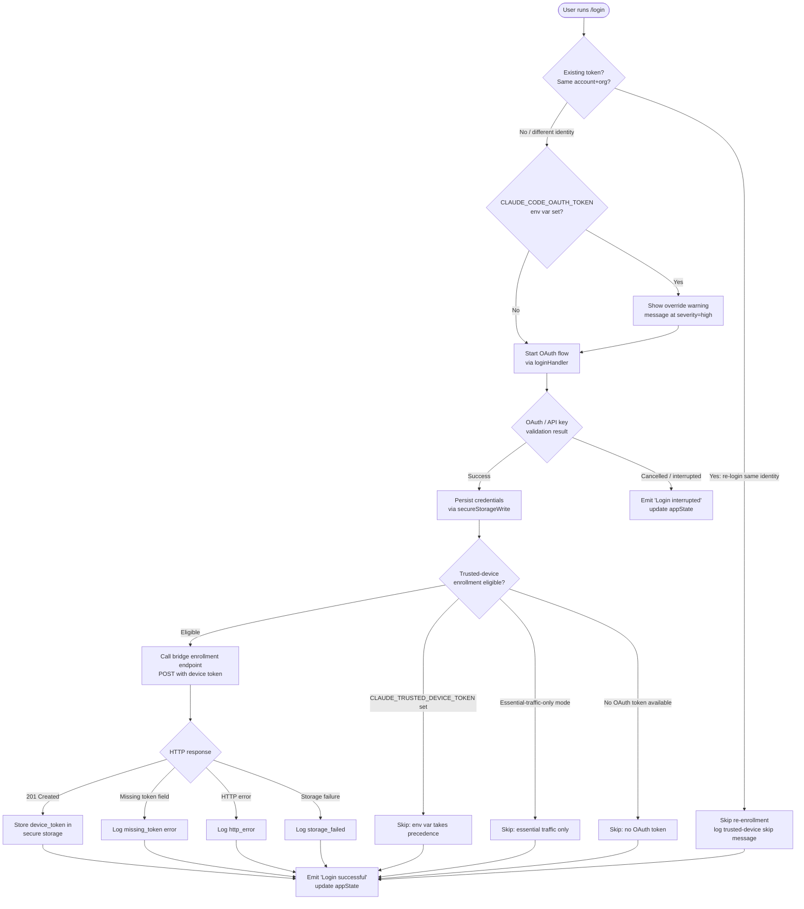

# `/login`

> Analysis basis: CC v2.1.168 bundle.js (AST extraction + Claude interpretation)
> Minimum version: v2.1.168

---

## Overview

The `/login` command presents an interactive authentication flow that allows the user to sign in with or switch to a different Anthropic account. It renders a JSX-based UI component (`Fs7`) that orchestrates OAuth token exchange, API key validation, trusted-device enrollment, and credential persistence, then updates global app state on success or cancellation.

---

## Registration

| Field | Value |
|---|---|
| type | `local-jsx` |
| name | `login` |
| description | `Switch Anthropic accounts \| Sign in with your Anthropic account` |
| loc_byte | `11620859` |
| loc_byte_end | `11621079` |
| loc_line | `8026` |
| module_id | `GJq` |
| load_inline | `true` |
| arbor_handler.name | `edq` |
| arbor_handler.fqn | `claude-2.1.168::edq` |
| arbor_handler.kind | `Function` |
| arbor_handler.resolution_path | `direct` |
| arbor_handler.n_hits | `2` |

Analysis basis: CC v2.1.168 bundle.js:+11620859 – +11621079

---

## Input Branching

The login flow has more than three distinct branches (account-switch detection, OAuth env-var override warning, trusted-device skip conditions, enrollment outcome, cancellation), so a Mermaid flowchart is used.



Analysis basis: CC v2.1.168 bundle.js:+9339742, +9340116, +9340491, +9340510, +7009097, +7009411, +7009524, +7010001, +7010120, +7010198, +7010299, +7010460, +7010507

---

## Behavioral Spec

### Top-Level Component (`loginComponent` / `Fs7`)

The registration `load_inline: true` pattern means the handler is resolved at module load time. Arbor identifies the primary handler as `edq` (resolution: `direct`). The React component tree visible at the call-graph root is the function referred to in the index as `Fs7`; it is also the `handler_name` field.

```
function loginComponent(props):
    state = useAppState()
    setAppState = useSetAppState()

    // Render the inner login form component (OWH)
    return createElement(
        loginForm,          // inner JSX component
        {
            onDone: handleDone,
            ...props
        }
    )

function handleDone(result):
    if result.success:
        setAppState({ ...state, authenticated: true, account: result.account })
        emit("Login successful")   // literal at +9340491
    else:
        emit("Login interrupted")  // literal at +9340510
```

Analysis basis: CC v2.1.168 bundle.js:+9340458, +9340487, +9340491, +9340510

---

### Account-Switch / Re-login Guard (`loginGuard` / `BV8`)

Before starting the full OAuth flow the implementation checks whether the incoming credentials identify the same account and organization as the currently stored token.

```
function loginGuard(currentToken, incomingCredentials):
    if currentToken exists
       AND incomingCredentials.accountId == currentToken.accountId
       AND incomingCredentials.orgId     == currentToken.orgId:
        log("[trusted-device] Same account+org re-login with existing token, skipping re-enrollment")
        // literal at +9339742
        return SKIP_ENROLLMENT
    else:
        proceed to full OAuth flow
```

Analysis basis: CC v2.1.168 bundle.js:+9339734, +9339742

---

### OAuth Environment-Variable Override Warning

If `CLAUDE_CODE_OAUTH_TOKEN` is present in the process environment when `/login` is invoked, the UI renders a persistent warning banner before the login form is shown. The warning text advises unsetting the variable for the new credentials to take effect.

```
function checkOAuthEnvOverride():
    if process.env.CLAUDE_CODE_OAUTH_TOKEN is set:
        displayNotification(
            type    = "warning",         // literal at +9338887
            level   = "high",            // literal at +9338906
            content = WARNING_TEXT       // literal at +9340116
        )
```

The notification type literal `"auto-mode-gate-notification"` is reused for the banner container.

Analysis basis: CC v2.1.168 bundle.js:+9338844, +9338887, +9338906, +9340116

---

### Bootstrap Fetch (`bootstrapFetch` / `v`)

Before the interactive form is shown, the handler performs a bootstrap network fetch to obtain server-side configuration.

```
function bootstrapFetch(url, apiKey):
    log("[Bootstrap] Fetching")   // literal at +15797658

    headers = {
        "Content-Type": "application/json",    // literal at +15797743, +15797758
        "User-Agent":   userAgentString        // literal at +15797777
    }

    response = await httpGet(url, headers, timeout=5000)  // timeout literal at +15797859

    if parse fails:
        recordEvent("api_bootstrap_fetch", status="parse_failed")  // literals at +15797980, +15798002
        return null

    log("[Bootstrap] Fetch ok")   // literal at +15798032
    return parsedConfig
```

Analysis basis: CC v2.1.168 bundle.js:+15797656, +15797658, +15797743, +15797980

---

### API Key / Auth Resolution (`authResolver` / `GO`)

Resolves which authentication method is active. Supported credential types are checked in priority order.

```
function authResolver(config):
    if env ANTHROPIC_API_KEY set:         // literal at +3004183
        return { type: "api_key", value: env.ANTHROPIC_API_KEY }

    if config.apiKeyHelper set            // literal at +3004277
       AND config.apiKeyHelper != "none": // literal at +3004316
        return { type: "api_key_helper", value: runHelper() }

    if env CLAUDE_CODE_API_KEY_FILE_DESCRIPTOR set:  // literal at +2123361
        fd = parseInt(env.CLAUDE_CODE_API_KEY_FILE_DESCRIPTOR)
        return { type: "api_key", value: readFd(fd) }

    if oauthToken available:
        return { type: "user_oauth", value: oauthToken }   // literal at +3001228

    if WIF env vars (ANTHROPIC_FEDERATION_RULE_ID + ANTHROPIC_ORGANIZATION_ID) set:
        return { type: "wif" }                             // literal at +7002798

    throw Error(AUTH_REQUIRED_MESSAGE)
    // literal at +3004652:
    // "ANTHROPIC_API_KEY, ANTHROPIC_AUTH_TOKEN, CLAUDE_CODE_OAUTH_TOKEN,
    //  or WIF env vars (ANTHROPIC_FEDERATION_RULE_ID + ANTHROPIC_ORGANIZATION_ID) required"
```

Analysis basis: CC v2.1.168 bundle.js:+3004096, +3004183, +3004277, +3004316, +3004652, +2123361, +3001228, +7002798

---

### Credential Persistence (`credentialWriter` / `_iK` → `HiK`)

Once valid credentials are obtained they are written to disk atomically.

```
function writeCredentials(credentialData, configDir):
    targetPath = join(configDir, credentialFileName)
    tempPath   = targetPath + ".tmp"

    mkdir(configDir, { recursive: true })
    appendFile(tempPath, serialize(credentialData))

    byteLen = Buffer.byteLength(serialized)
    if byteLen > 0:
        atomicRename(tempPath, targetPath)  // via ll8 → ny.rename
    else:
        unlink(tempPath)                    // via ll8 → ny.unlink

    registerCleanupHandler()               // via j9 → NPA.register
```

Rotation logic (`ll8`): if the target file name ends with `.txt` (literal at +205511), it applies a slice offset of `4` characters (literal at +205533) and renames atomically.

Analysis basis: CC v2.1.168 bundle.js:+206082, +206115, +206145, +206252, +206284, +206290, +205511, +205533, +205563, +205603

---

### Trusted-Device Enrollment (`trustedDeviceEnroll` / `VtH`)

After credential storage, the implementation attempts to enroll the device for trusted-device tokens.

```
function trustedDeviceEnroll(oauthToken, config):
    // Skip conditions (checked in order):
    if env CLAUDE_TRUSTED_DEVICE_TOKEN set:
        log("[trusted-device] CLAUDE_TRUSTED_DEVICE_TOKEN env var is set, skipping enrollment")
        // literal at +7009097
        return

    if essentialTrafficOnly(config):
        log("[trusted-device] Essential traffic only, skipping enrollment")
        // literal at +7009411
        return

    if not oauthToken:
        log("[trusted-device] No OAuth token, skipping enrollment")
        // literal at +7009524
        return

    if platform == "darwin":              // literal at +7009720
        timeout1 = 10000                  // literal at +7009813
        timeout2 = 500                    // literal at +7009839
    else:
        timeout1 = DEFAULT_TIMEOUT
        timeout2 = DEFAULT_TIMEOUT

    response = await POST(enrollEndpoint, { oauthToken }, timeout=timeout1)
    recordEvent("bridge_trusted_device_enroll", ...)  // literal at +7009915

    if response.status == 201:            // literal at +7010001
        deviceToken = response.body.device_token
        if deviceToken missing:
            recordOutcome("missing_token")  // literal at +7010299
            return
        writeToSecureStorage(deviceToken)
    else:
        recordOutcome("http_error")       // literal at +7010120

    if storageFails:
        recordOutcome("storage_failed")   // literal at +7010507
```

Analysis basis: CC v2.1.168 bundle.js:+7009097, +7009274, +7009297, +7009411, +7009524, +7009625, +7009697, +7009720, +7009813, +7009839, +7009915, +7010001, +7010120, +7010198, +7010299, +7010460, +7010507

---

### Secure Credential Storage (`secureStorageWriter` / `z4` → `U21`)

Credentials are written to the OS secure store with a plaintext fallback path.

```
function secureStorageWrite(key, value):
    try:
        success = await primarySecureStore.write(key, value)
        if success:
            recordEvent("secure_storage_credentials_write")  // literal at +2284848
            return
        // Primary succeeded but flagged transient skip
        recordEvent("primary_transient_skip_fallback")       // literal at +2284946
    catch:
        pass

    try:
        await plaintextFallbackStore.write(key, value)
        recordEvent("plaintext_fallback_used")               // literal at +2285095
    catch:
        recordEvent("primary_and_fallback_failed")           // literal at +2285198
        throw
```

Analysis basis: CC v2.1.168 bundle.js:+2284823, +2284848, +2284946, +2285095, +2285198

---

### Policy Limits Loader (`policyLimitsLoader` / `CT6` → `vF9`)

After login, policy limits are fetched from the server to enforce plan-level restrictions.

```
function loadPolicyLimits(authToken):
    cachedHash = readCachedHash()
    headers    = { "If-None-Match": cachedHash }   // literal at +7044923

    response = await GET(policyEndpoint, headers)
    recordEvent("tengu_policy_limits_fetch")        // telemetry

    switch response.status:
        case 200:                                   // literal at +7045017
            applyNewRestrictions(response.body)
            log("Policy limits: Applied new restrictions successfully")
            recordEvent("policy_limits_load")       // literal at +7004974
        case 204:                                   // literal at +7045026
            log("Policy limits: No restrictions (cached empty)")
        case 304:                                   // literal at +7045035
            log("Policy limits: Cache still valid (304 Not Modified)")
        case 401:                                   // literal at +7045957
            forceAuthRefresh()
        case 404:                                   // literal at +7045044
            deleteLocalCache()
        default:
            log("Policy limits: Using stale cache after error")
            recordEvent("unexpected_error")         // literal at +7005703
```

Analysis basis: CC v2.1.168 bundle.js:+7004708, +7004731, +7004836, +7045017, +7045026, +7045035, +7045957, +7004974, +7005703

---

### Remote Managed Settings Refresh (`remoteManagedSettingsRefresh` / `fm_`)

Login also triggers a pull of remote managed settings.

```
function refreshRemoteSettings(authToken):
    hash = computeHash(currentSettings)          // via UF9 → pF9.createHash, sha256 at +7016290

    response = await fetchRemoteSettings(authToken, etag=hash)
    recordEvent("remote_managed_settings_pull")  // literal at +7047057

    switch response.status:
        case 200:
            validateAndApply(response.body)
            log("Remote settings: Applied new settings successfully")
                                                 // literal at +7047676
        case 304:
            log("Remote settings: Cache still valid (304 Not Modified)")
                                                 // literal at +7047308
        case 401:
            recordEvent("tengu_remote_settings_401_force_refresh_retry")
        case 404:
            deleteCache()
            log("Remote settings: Deleted cached file (404 response)")
                                                 // literal at +7047841
        default:
            if cachedSettingsAvailable:
                log("Remote settings: Using stale cache after fetch failure")
                                                 // literal at +7047139
            else:
                recordEvent("remote_managed_settings_unexpected")
                                                 // literal at +7048142
```

Analysis basis: CC v2.1.168 bundle.js:+7047027, +7047057, +7047088, +7047139, +7047308, +7047676, +7047841, +7048142

---

### App-State Update on Completion (`appStateUpdate`)

```
function finalizeLogin(result, setAppState):
    newState = currentAppState()
    if result == "success":
        newState.loginState = "authenticated"
        setAppState(newState)                    // via BV8 → H.setAppState at +9339993
        display("Login successful")              // literal at +9340491
    else:
        display("Login interrupted")             // literal at +9340510
```

Analysis basis: CC v2.1.168 bundle.js:+9339897, +9339993, +9340491, +9340510

---

## State & Side Effects

| Item | Detail |
|---|---|
| Telemetry | `tengu_feature_ok` (+1010950), `tengu_feature_bad` (+1011012), `tengu_feature_sad` (+1011093), `tengu_remote_settings_401_force_refresh_retry` (+7046026), `tengu_managed_settings_security_dialog_shown` (+7041993), `tengu_managed_settings_security_dialog_accepted` (+7041645), `tengu_managed_settings_security_dialog_rejected` (+7041695), `tengu_policy_limits_fetch` (+7004836), `tengu_disable_bypass_permissions_mode` (+10705217), `tengu_auto_mode_config` (+10703107), `tengu_daemon_config_reload` (+16212414) |
| Credential file write | Atomic write via temp-file rename to config directory (via `_iK` / `HiK`); cleanup handler registered via `j9 → NPA.register` |
| Secure storage | Primary OS keychain attempted; plaintext fallback used on failure; events recorded per outcome |
| Trusted-device token | POST to bridge enrollment endpoint on Darwin (10 s / 500 ms timeouts); device_token stored in secure storage on HTTP 201 |
| Remote managed settings | Pulled and applied or stale-cache used after any fetch failure |
| Policy limits | Fetched and applied; background polling initiated after login via `Ig9 → Uw8` (setInterval / clearInterval) |
| appState changes | `H.setAppState` called (+9339993) to record authentication outcome |
| React hooks | `useReducer`, `useEffect`, `useMemo`, `useCallback`, `useRef`, `useState`, `useSyncExternalStore` — all used within login UI tree |
| Sound | <!-- TODO: not found in depth-2 traversal; needs --depth 4 --> |
| Process lifecycle | `process.off`, `process.removeListener`, `clearInterval` called on cleanup (`mlH` / `pP_`) |

---

## Version History

| Version | Change |
|---|---|
| v2.1.168 | Initial analysis |

---

## Common Mistakes

1. **`CLAUDE_CODE_OAUTH_TOKEN` env var left set**: Running `/login` while this variable is set will show a high-severity warning. The new credentials will not take effect at runtime until the variable is unset — the env var takes precedence over the newly stored token.
2. **Same-account re-login skips trusted-device enrollment**: If the user re-authenticates with the same account and organization, trusted-device re-enrollment is intentionally skipped. To force re-enrollment, log out first or use a different account.
3. **`CLAUDE_TRUSTED_DEVICE_TOKEN` env var interferes with enrollment**: If this variable is set, trusted-device enrollment is bypassed silently. Users who want enrollment to run must unset this variable before invoking `/login`.
4. **Network timeout on non-Darwin platforms**: The 10 000 ms / 500 ms trusted-device enrollment timeouts apply only on `darwin`. Other platforms use default timeouts; slow networks may cause silent enrollment failures without user-visible errors.
5. **Plaintext fallback is silent**: If the OS keychain is unavailable, credentials are stored in plaintext with only a telemetry event (`plaintext_fallback_used`) — no interactive warning is displayed to the user.

---

## Appendix — Identifier Mapping

> For bundle debugging only. Identifiers change across versions.

| Identifier | Role |
|---|---|
| `edq` | Arbor-resolved top-level login handler (direct resolution) |
| `Fs7` | Login React component (handler_name); wraps inner login form, handles `onDone` |
| `OWH` | Inner login form JSX component; renders OAuth UI, manages local state |
| `BV8` | Login guard / account-switch detection; calls API key change handler and app-state setters |
| `v` | Bootstrap fetch function; fetches server config with `Content-Type`/`User-Agent` headers |
| `snK` | HTTP utility invoked from bootstrap fetch |
| `IPA` | Inner HTTP helper (calls `edK`, `HcK`) |
| `EUH` | Credential write dispatcher; calls `nWA → H.write` |
| `nWA` | Low-level file writer |
| `_iK` | Credential persistence orchestrator; calls `npH`, `YKH`, `HiK`, `ll8`, `B76`, `$0A` |
| `npH` | Timer-based write scheduler (clearTimeout / setTimeout / setImmediate) |
| `YKH` | Path resolution helper for credential files |
| `HiK` | Atomic credential file writer (mkdir, appendFile, rename, unlink) |
| `ll8` | File rotation helper (stat, endsWith `.txt`, rename, unlink) |
| `B76` | Backup path builder (calls `V8`) |
| `$0A` | Path join helper for config files |
| `j9` | Cleanup handler registrar (calls `NPA.register`) |
| `G4` | URL / string sanitization utility (replaces, slices, lastIndexOf) |
| `RH` | JSON serializer wrapper (calls `JSON.stringify`) |
| `H9` | Model / token string normalizer |
| `m6H` | Model descriptor builder |
| `s9` | Token string normalizer; maps model names (opus, sonnet, haiku, best) |
| `qB` | Token string parser; checks `anthropic.` prefix, splits on `[1m]` |
| `CtH` | Post-auth orchestrator; calls `gs`, `Kj8`, `fm_`, `v`, `oKH`, `Ig9` |
| `gs` | Auth state builder; constructs token object from OAuth/API key |
| `GO` | Auth-method resolver; checks `ANTHROPIC_API_KEY`, `apiKeyHelper`, FD, OAuth, WIF |
| `AN` | API key helper invoker |
| `Bj` | OAuth profile builder; sets `profile-implicit`, `user_oauth` |
| `aL` | Provider mapper (`anthropicAws`, `gateway`) |
| `C6` | Config persister (calls `d6`, `qZ`, `Date.now`) |
| `Kj8` | Policy settings notifier (calls `Hm.notifyChange`, `hH`) |
| `hH` | Settings change dispatcher; routes updates to handler queue (`DG4`, `PFH`) |
| `DG4` | Handler queue manager (shift/push on `Rc6`) |
| `fm_` | Remote managed settings refresh orchestrator |
| `VzH` | Settings cache invalidator (calls `LY`) |
| `LY` | Cache clear helper (`Dp6.clear`, `_Q8.clear`) |
| `UF9` | Settings hash computer (`pF9.createHash`, sha256) |
| `Fu_` | Recursive object serializer for hashing |
| `BX7` | Settings fetch dispatcher; calls `Ng9`, `pAH`, `r8` |
| `Ng9` | Remote settings HTTP fetch; checks ETag (`If-None-Match`), handles 200/204/304/401/404 |
| `pAH` | Exponential back-off calculator (Math.min/pow/random, max 32000) |
| `r8` | Abort-aware retry wrapper (setTimeout, clearTimeout, abort signal) |
| `Wg9` | Managed-settings security check orchestrator |
| `rw8` | Settings key extractor (`Object.keys`) |
| `ktH` | Settings header normalizer (Object.entries, toUpperCase) |
| `iF9` | Settings diff/merge helper |
| `Pg9` | Security dialog renderer |
| `RX7` | Dialog result queue manager (`RtH.push/filter`) |
| `QB` | Write-permission checker (`wT_`, `IT_`, `Va`) |
| `An` | Settings applicator (calls `hX7`) |
| `Gg9` | Settings change emitter (calls `eK`) |
| `eK` | Change event dispatcher (`A9`, `oyH`, `vR_`, `IR_`) |
| `FX7` | Atomic settings file writer (open, writeFile, datasync, close) |
| `s$6` | Settings file path builder (`FpA.join`, `t8`) |
| `Ig9` | Policy-limits background poll initializer (calls `Uw8`, `QX7`, `j9`) |
| `Uw8` | Poll interval manager (setInterval / clearInterval) |
| `QX7` | Poll tick handler; calls `gs`, `VzH`, `fm_`, `Kj8` |
| `CT6` | Policy-limits load orchestrator; calls `hu_`, `Fw8`, `cC`, `Qw8` |
| `hu_` | Policy-limits state holder (`Cu_`, `b7H`, clearTimeout) |
| `b7H` | Auth-type checker (`yP1`, `ecH`, `_.includes`) |
| `Fw8` | Policy-limits HTTP fetch wrapper (cC, setTimeout) |
| `cC` | Policy fetch executor (`MA`, `Lf`, `GO`, `Bj`, `r1`) |
| `Qw8` | Policy-limits refresh cycle controller |
| `vF9` | Policy-limits response handler; handles 200/304/401/404/error |
| `NF9` | Cache freshness checker (Math.max, Date.now, statSync) |
| `LP6` | Policy-limits file reader (`readFileSync`, `XjH`) |
| `OX7` | Policy-limits payload parser (`GO`, `Bj`, `GA`) |
| `zX7` | Policy-limits retry scheduler (`pAH`, `r8`) |
| `DX7` | Policy-limits cache writer (`ghH.writeFile`) |
| `IF9` | Policy-limits poll-loop manager (`Uw8`, `wX7`, `j9`) |
| `wX7` | Poll-tick fetch handler (`cC`, `KP6`, `vF9`) |
| `y8H` | Cleanup orchestrator on logout/exit; emits event, calls `mlH`, `hH`, `AA` |
| `mlH` | Full cleanup: clears all maps/sets, removes process listeners, clears intervals |
| `pP_` | Process-exit listener cleanup (clearInterval, removeListener) |
| `kL` | API call utility (calls `GY`, `C6`) |
| `GY` | HTTP GET wrapper (`O4`, `Bj`, `GO`, `pX`) |
| `nw6` | Query-string builder |
| `qlH` | Query parameter formatter |
| `mu_` | Session initializer; sets up `y_`, `aL`, `L5H`, `z4` |
| `y_` | Module init helper (wTH, Sg8, Im6.call, km6.bind) |
| `L5H` | Session config loader (calls `D6`) |
| `D6` | Session config reader; checks HwH, cq8, Qj6, IB |
| `cq8` | Rate-limit state accessor (RP_.has/get/add, hP_, uP_) |
| `z4` | Secure storage accessor (calls `U21`) |
| `U21` | Credential read/write/delete dispatcher; handles primary + fallback stores |
| `yVH` | Async credential reader (QKL, H.readAsync) |
| `VtH` | Trusted-device enrollment function; checks skip conditions, POSTs to bridge, stores device_token |
| `ph` | Session permission checker (cj6, lj6, hu, C6, cq8, Yo1) |
| `Yo1` | Feature-gate checker (lT, IB.has/get, L.getFeatureValue, cq8) |
| `jX7` | Session token refresher (ZS, y_) |
| `bu_` | Background token renewal (y7, y_) |
| `F1` | OAuth URL builder (jIA, HM4, Cd6.includes) |
| `GH` | String coercer wrapper |
| `XI6` | Permission manager initializer (UV8, FT6) |
| `UV8` | Bypass-permissions mode guard (mP_, tengu_disable_bypass_permissions_mode) |
| `mP_` | Permission mode flag reader (cj6, lj6, hu, C6) |
| `FT6` | Permission update dispatcher (oM) |
| `oM` | Permission-op applier (setMode, addRules, replaceRules, removeRules, addDirectories, removeDirectories) |
| `b_` | Launch-restriction reader; reads working_directory, allowed_tools, disallowed_tools, avoid_prompts, permission_mode, effort, model, max_thinking_tokens, flag_settings |
| `PI6` | Permission-state initializer (WI6) |
| `WI6` | Full permission subsystem init; calls H9, HvH, X16, Y, oM, QMH, st, UR, YfH |
| `HvH` | Model-string validator (e1, MA, Uw6) |
| `e1` | Application-inference-profile checker |
| `Uw6` | Model prefix stripper |
| `X16` | Permission-mode resolver (yd) |
| `Y` | Supervisor/heartbeat manager; manages `f` (connections), `T`, `E`, `V` |
| `TUK` | Heartbeat sender (S8H) |
| `YfH` | Event emitter setup for permission changes (h4) |
| `h4` | Permission-change event emitter (LyH, QL6, nQ8, iQ8) |
| `QMH` | Bulk permission entries applicator (Object.entries, oM) |
| `Lj` | Login UI sub-component; uses `Y6`, `wJq`, `s9`, `_G` |
| `Y6` | App-state consumer (CT_, useSyncExternalStore) |
| `CT_` | Context guard (dwH.useContext, ReferenceError) |
| `wJq` | Login form state manager (useReducer, useEffect, Nc) |
| `Nc` | Store subscription helper (xlH.subscribe, Lo1, queueMicrotask) |
| `Lo1` | Async dispatch helper (Promise.resolve, hH) |
| `oD` | Context consumer (QIH.useContext) |
| `T_` | Keyboard handler registrar (nj, KjH.useRef/useEffect, L.registerHandler) |
| `nj` | Key context accessor (qjH.useContext) |
| `iM` | Input method / autocomplete component (y79) |
| `y79` | Suggestion list renderer (wZ_, useMemo) |
| `wZ_` | Text input with suggestions (sc, useState, useMemo, gC, useCallback) |
| `gC` | Debounced input handler (w1, useRef, useCallback, useEffect, Date.now) |
| `M` | Model selector renderer (xbH, PF8, L.get/values) |