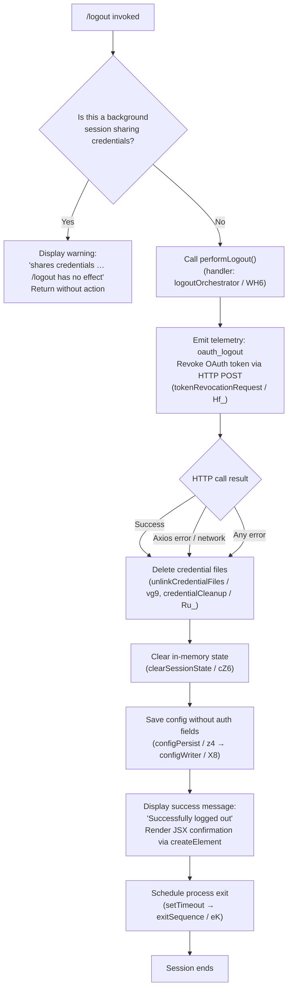

# `/logout`

> Analysis basis: CC v2.1.168 bundle.js (AST extraction + Claude interpretation)
> Minimum version: v2.1.168

---

## Overview

The `/logout` command signs the user out of their Anthropic account by revoking the active OAuth token via an API call, clearing stored credentials from disk and in-memory state, and then terminating the current session. If the command is run inside a background session that shares credentials with a parent terminal, it refuses to perform any action and surfaces an informational message instead.

---

## Registration

| Field | Value |
|---|---|
| type | `local-jsx` |
| name | `logout` |
| description | Sign out from your Anthropic account |
| loc_byte | `11621140` |
| loc_byte_end | `11621424` |
| loc_line | `8026` |
| module_id | `$g_` |
| load_inline | `true` |
| arbor_handler.name | `sx7` |
| arbor_handler.fqn | `claude-2.1.168::sx7` |
| arbor_handler.kind | `AsyncFunction` |
| arbor_handler.resolution_path | `module_id` |
| arbor_handler.n_hits | `0` |

Analysis basis: CC v2.1.168 bundle.js:+11621140

---

## Input Branching

The command has three distinct execution paths depending on session context and token-revocation outcome, so a Mermaid flowchart is used.



Analysis basis: CC v2.1.168 bundle.js:+7947010 – +7947905

---

## Behavioral Spec

### Background-session guard

The handler `sx7` first checks whether the current process context is a background session (literal check against process-type markers `"bg"`, `"daemon"`, `"daemon-worker"` — Analysis basis: CC v2.1.168 bundle.js:+2256766). If so, it renders the message:

> "This background session shares credentials with other sessions; /logout here has no effect. Run /logout from your main terminal to sign out."
> (Analysis basis: CC v2.1.168 bundle.js:+7948237)

No credential mutation or network call is made when this branch is taken.

```
async function logoutCommandHandler(appContext):
    if isBackgroundSession(appContext):
        renderMessage(WARNING, BACKGROUND_SHARES_CREDS_MESSAGE)
        return

    logoutResult = await performLogout(appContext)
    renderResult(logoutResult)
    scheduleExit()
```

Analysis basis: CC v2.1.168 bundle.js:+7948127

---

### OAuth token revocation (`tokenRevoke` / `Hf_`)

When the session is foreground, the orchestrator calls the token-revocation helper.

```
async function tokenRevoke(oauthState):
    endpoint = resolveOAuthEndpoint()          // F1 — determines prod/staging/local URL
    response = await httpClient.post(          // qA.post
        endpoint,
        { grant_type: "refresh_token", ... }
    )
    if isAxiosError(response):                 // qA.isAxiosError
        // log error category (network / auth / timeout / http)
        // but continue with local credential removal regardless
    return response
```

Token revocation posts the current `refresh_token` to the OAuth endpoint.
Analysis basis: CC v2.1.168 bundle.js:+2112525

The OAuth base URL selection (`F1`) supports the following environment values (Analysis basis: CC v2.1.168 bundle.js:+852924 – +854263):

| Env / flag | Base URL |
|---|---|
| `prod` (default) | Anthropic production endpoint |
| `staging` | `http://localhost:4000` |
| `local` | `http://localhost:8000` / `http://localhost:3000` |
| `CLAUDE_CODE_CUSTOM_OAUTH_URL` | Custom URL — must match an approved list, otherwise throws |

A telemetry event `oauth_token_revoke` is emitted regardless of success or failure (Analysis basis: CC v2.1.168 bundle.js:+2112693).

---

### Credential file removal (`unlinkCredentialFiles` / `vg9`, `credentialCleanup` / `Ru_`)

After the network call (success or error), the handler removes stored credential artifacts from disk.

```
function unlinkCredentialFiles(paths):
    buildCredentialPath()          // kg9 + Km_ (gpA)
    resolveStoragePath()           // s$6: joins oKH + FpA path segments via t8
    fs.unlink(credentialFilePath)  // ihH.unlink

function credentialCleanup():
    clearRunningLockFile()         // hu_: clearTimeout; Cu_ + b7H checks
    fs.unlink(lockFilePath)        // ghH.unlink
    resolveSocketPath(XjH)         // joins Yf9.join + t8
```

Analysis basis: CC v2.1.168 bundle.js:+7046660 (vg9), +7006365 (Ru_)

The `q.unlinkSync` primitive (Analysis basis: CC v2.1.168 bundle.js:+16174065) is used for synchronous removal of the primary credentials file.

---

### In-memory state clearance (`clearSessionState` / `cZ6`)

```
function clearSessionState():
    resetPrimaryConfig(pT6)
    resetEnvironmentConfig(ecH)
    clearCacheStore(p18)           // sm1.clear
    resetNetworkState(nDH)
    teardownMetrics(y8H):
        shutdownMetricsHub(hu → yu → kC)
        clearIntervalRegistry(mlH):
            process.off(event)     // removes "exit" and "beforeExit" listeners
            HwH.clear()
            Qq8.clear()
            Qj6.clear()
            RP_.clear()
            IB.clear()
            pP_: clearInterval(); process.removeListener()
        xlH.emit(teardownEvent)
        logTeardown(lT)
        notifyErrorHandlers(hH)
    resetAgentContext(vg9)
    clearRunnerState(Ru_)
```

Analysis basis: CC v2.1.168 bundle.js:+7947077

The literals `"exit"` (Analysis basis: CC v2.1.168 bundle.js:+3245240) and `"beforeExit"` (Analysis basis: CC v2.1.168 bundle.js:+3246000) identify the process event listeners that are removed during teardown.

---

### Configuration persistence without auth (`configPersist` / `z4` → `configWriter` / `X8`)

After clearing in-memory state the handler persists the global config with auth fields removed.

```
async function configPersist():
    currentConfig = configReader.read(U21)     // reads via H.read / _.read
    // strip auth-bearing fields
    saveGlobalConfig(X8):
        acquireLock(sP_)
        if re-read config is missing auth that cache has:
            // Safety guard — refuses to write; emits tengu_config_auth_loss_prevented
            // Message: "saveGlobalConfig fallback: re-read config is missing auth…"
            return
        writeAtomicFile(O$6)                   // write + fchmod + fsync + rename
        rotateLockBackups(LwH)
```

Maximum backup rotation count: 5 (Analysis basis: CC v2.1.168 bundle.js:+3266522).
Lock acquisition timeout: 60 000 ms (Analysis basis: CC v2.1.168 bundle.js:+3266273).
Write retry back-off levels: 10 ms, 100 ms, 1 000 ms, 15 000 ms (Analysis basis: CC v2.1.168 bundle.js:+2283520 – +2283561).

Auth-provider mapping checked before stripping (Analysis basis: CC v2.1.168 bundle.js:+2100952 – +2101169):

| Key | Provider |
|---|---|
| `bedrock` | AWS Bedrock |
| `foundry` | Azure Foundry |
| `anthropicAws` | Anthropic AWS |
| `mantle` | Mantle |
| `vertex` | GCP Vertex AI |
| `firstParty` | Anthropic first-party |

---

### Success rendering and exit (`sx7` post-logout JSX + `exitSequence` / `eK`)

```
function renderLogoutSuccess():
    jsx = Mg_.createElement(...)     // builds confirmation UI element
    display("system", SUCCESS_MESSAGE)
    // SUCCESS_MESSAGE = "Successfully logged out from your Anthropic account."

function scheduleExit():
    setTimeout(exitSequence, 200)    // 200 ms delay before exit
    exitSequence(eK):
        shutdownInk(A9):
            unmountInkRenderer(oyH)
            writeExitOutputs(cL8)
            drainStdio(ipH)          // NPA.drain
            finalizeSession(Y)       // supervisor teardown
            exitProcess(IR_):
                process.exit()
```

The 200 ms delay value is found at Analysis basis: CC v2.1.168 bundle.js:+7948499.
The success string is at Analysis basis: CC v2.1.168 bundle.js:+7948436.
The "Signing out…" transient label is at Analysis basis: CC v2.1.168 bundle.js:+7948590.

---

## State & Side Effects

| Item | Detail |
|---|---|
| Telemetry — oauth_logout | Emitted by `logoutOrchestrator` (WH6) at end of logout sequence (bundle.js:+7947908) |
| Telemetry — oauth_token_revoke | Emitted by token-revocation helper `Hf_` (bundle.js:+2112693) |
| Telemetry — tengu_feature_ok / tengu_feature_bad / tengu_feature_sad | Emitted by notification/error handler `hH` (bundle.js:+1010950, +1011012, +1011093) |
| Telemetry — tengu_config_lock_contention | Emitted when config lock acquisition takes longer than expected (bundle.js:+3265592) |
| Telemetry — tengu_config_stale_write | Emitted on stale-write detection in config writer (bundle.js:+3265728) |
| Telemetry — tengu_config_auth_loss_prevented | Emitted when write is aborted to protect auth fields (bundle.js:+3266071) |
| Telemetry — tengu_config_parse_error | Emitted on config parse failure during read-back (bundle.js:+3268167) |
| Telemetry — tengu_cache_eviction_hint | Emitted during cache cleanup in exit sequence (bundle.js:+5457052) |
| Telemetry — tengu_scroll_summary | Emitted by scroll/rendering teardown (bundle.js:+5455982) |
| Telemetry — tengu_startup_perf | Emitted during startup profiling drain on exit (bundle.js:+217609) |
| Credential files | Unlinked from disk by `vg9` (ihH.unlink) and `Ru_` (ghH.unlink) |
| Lock / socket files | Removed by `Ru_` (ghH.unlink + socket path via XjH) |
| In-memory caches | `sm1.clear()`, `HwH.clear()`, `Qq8.clear()`, `Qj6.clear()`, `RP_.clear()`, `IB.clear()` |
| Process event listeners | Removed via `process.off` / `process.removeListener` for `"exit"` and `"beforeExit"` |
| Intervals | All registered intervals cleared via `pP_` → `clearInterval` |
| Global config | Rewritten to disk without auth fields via atomic write in `X8`/`sP_`/`O$6` |
| appState changes | Auth state cleared; agent context reset; network/API state reset |
| Process | `process.exit()` called after 200 ms via `IR_` inside `eK` → `A9` |
| Sound | None detected |

---

## Version History

| Version | Change |
|---|---|
| v2.1.168 | Initial analysis |

---

## Common Mistakes

1. **Running `/logout` in a background or daemon session** — the command will print a no-op warning and return immediately without clearing any credentials. Always run `/logout` from the primary foreground terminal.

2. **Expecting instant re-login in the same process** — `/logout` schedules `process.exit()` after 200 ms. Any follow-up commands issued in the same session window will likely be dropped before they execute.

3. **Assuming the token is always revoked server-side** — the handler continues with local credential removal even if the HTTP token-revocation call fails (e.g. due to a network error). After a network failure the refresh token may still be valid server-side; users should revoke it manually via the Anthropic console if needed.

4. **Confusing API-key authentication with OAuth logout** — `/logout` targets the OAuth flow only. If Claude Code is configured with a plain `ANTHROPIC_API_KEY` environment variable or a Bedrock/Vertex provider, the command removes stored OAuth tokens but does not invalidate the API key.

5. **Config backup interference** — the atomic config writer keeps at most 5 backup files (`.backup.*` pattern). If the backup directory is unexpectedly large or the lock file is stale from a crashed prior run, the logout config-write step may emit `tengu_config_lock_contention` and block for up to 60 seconds before proceeding.

---

## Appendix — Identifier Mapping

> For bundle debugging only. Identifiers change across versions.

| Identifier | Role |
|---|---|
| `sx7` | Main logout command handler (AsyncFunction; Arbor-resolved entry point) |
| `WH6` | Logout orchestrator — sequences token revocation, state clear, config save, and exit |
| `tx7` | Logout JSX renderer — builds the "Signing out…" / success UI element |
| `cZ6` | Session state clearance — calls pT6, ecH, p18, nDH, y8H, vg9, Ru_ |
| `y8H` | Metrics / telemetry teardown coordinator |
| `hu` | Metrics hub shutdown (calls yu → kC) |
| `yu` | Intermediate metrics flush |
| `mlH` | Interval registry and process listener cleanup (clears HwH, Qq8, Qj6, RP_, IB) |
| `pP_` | Per-interval cleaner — clearInterval + process.removeListener |
| `hH` | Error/notification handler — emits tengu_feature_ok/bad/sad |
| `AA` | Error formatter helper |
| `_6` | String coercion utility |
| `$q` | Essential-traffic queue checker |
| `DG4` | Ring-buffer manager (Rc6.shift / Rc6.push) |
| `vg9` | Credential file unlinker (ihH.unlink) |
| `kg9` | Credential path segment builder |
| `Km_` | Path resolver helper (calls gpA) |
| `gpA` | Base path provider |
| `oKH` | Storage root accessor |
| `s$6` | Storage path joiner (FpA.join + t8) |
| `Ru_` | Lock-file and socket-file cleanup (hu_ + ghH.unlink + XjH) |
| `hu_` | Running-lock file clearer (Cu_ + b7H + clearTimeout) |
| `Cu_` | Lock state checker |
| `b7H` | Lock inclusion checker (yP1, A.some, _.includes, ecH) |
| `XjH` | Socket path resolver (Yf9.join + t8) |
| `MA` | Auth-provider type mapper (bedrock/foundry/vertex/etc.) |
| `z4` | Config read-then-write coordinator (calls U21) |
| `U21` | Config store accessor (H.read, _.read, H.readAsync, H.update, _.delete, etc.) |
| `H` | Primary config store object |
| `v` | Config value parser / validator |
| `mj_` | Config line parser (split/trim/indexOf/slice) |
| `lHH` | Config key presence checker (o74.has) |
| `uj` | Config value string replacer |
| `H9` | Config sub-section accessor (m6H, s9, FJ) |
| `yVH` | Async config reader with store context (QKL) |
| `QKL` | Async storage writer with lock and retry (b21.getStore, m21.mkdir, WO) |
| `SH` | Storage helper dispatcher (l + J6) |
| `CH` | Storage delete helper (l + J6) |
| `J6` | Storage operation executor (hm6) |
| `Hf_` | OAuth token revocation HTTP caller (qA.post, F1, SH, v, o6) |
| `F1` | OAuth endpoint URL builder (jIA, HM4, _.replace, Cd6.includes, Error) |
| `jIA` | OAuth endpoint environment selector |
| `HM4` | OAuth client-id provider |
| `Ar` | Post-logout app-state reset helper |
| `WJ_` | Session workspace writer (Op1, X8, H68) |
| `Op1` | Workspace path initialiser (fO1, v, GH) |
| `fO1` | Filesystem workspace creator (hI, tP, sV, Error) |
| `hI` | Path normaliser + SHA-256 hasher (NFC, sha256, hex) |
| `tP` | Workspace token helper (YZH) |
| `sV` | OS user-info checker (Me6.userInfo, bAL.test) |
| `GH` | String coercion wrapper |
| `X8` | Global config atomic writer (sP_, qZ, H, dlH, Vo1, qK8, v, LwH, aj6, l, aP_) |
| `sP_` | Atomic file-write with backup rotation (O$6, LwH, dD.dirname, L.mkdirSync, R21) |
| `R21` | Config merge helper (QM_, Object.assign) |
| `V8` | File-exists checker |
| `LwH` | Backup file reader/writer (q.readFileSync, q.copyFileSync, dD.basename, tP_) |
| `aj6` | Config serialiser |
| `RH` | JSON stringifier wrapper |
| `tP_` | Backup path joiner (dD.join + t8) |
| `O$6` | Atomic rename writer (openSync, writeFileSync, fchmodSync, fsyncSync, renameSync) |
| `aP_` | Fallback config writer path (qK8, qZ, d6, dD.dirname, xJ, RH, O$6) |
| `dlH` | Config directory helper |
| `Vo1` | Config entries iterator (Object.entries) |
| `qK8` | Timestamp snapshot helper (Date.now) |
| `H68` | Session metadata recorder |
| `K` | In-memory mutation store (K.mutate, K.delete) |
| `RTH` | Post-logout render reset |
| `fyH` | JSX component builder for logout UI (Zj, h4) |
| `Zj` | Inline string formatter (GH) |
| `h4` | Logout panel component (LyH, QL6, nQ8, M.emit, iQ8, v) |
| `LyH` | Telemetry attribute builder (ZB, R6, R38, yW6, UJ9, Object.assign) |
| `ZB` | Session ID generator (C6, vo1.randomBytes, X8, v) |
| `R6` | Runtime version accessor |
| `R38` | OTEL resource builder (D3, STH, wH7, Object.freeze) |
| `yW6` | Attribute filter (removes non-user./non-identity. keys) |
| `kL` | Metrics channel helper (GY, C6) |
| `UJ9` | OTEL attribute mapper (JH7, jH7) |
| `QL6` | Logout panel layout helper |
| `nQ8` | Logout panel signal dispatcher |
| `M` | MCP/event emission bus (xbH, PF8, L.get, v, L.values, $, cDA) |
| `xbH` | MCP server connection initiator |
| `PF8` | MCP connection result applier (H.applyMcpUpdate, bbH, M8, A.cleanup, Ay, sD) |
| `cDA` | MCP server config diff applier (Object.entries, A.filter, _.getClients, xbH, PF8) |
| `iQ8` | Logout panel extra-data formatter |
| `eK` | Exit-sequence coordinator (A9, v, oyH, vR_, IR_) |
| `A9` | Ink/terminal shutdown orchestrator (oyH, vR_, IR_, Y, gz8, Af6, Fz8, etc.) |
| `oyH` | Ink renderer unmount helper (RfH.writeSync, _L.get, H.unmount, xC, cL8) |
| `xC` | Terminal cursor restore |
| `cL8` | Terminal output flusher (Ea.writeSync, MIH, evH, QW, O$) |
| `vR_` | Terminal cleanup writer (wT, Cx, R6, AG6, s$, _.replaceAll, tV9, RfH.writeSync) |
| `wT` | Terminal stream reference |
| `Cx` | Cursor-position saver/restorer |
| `AG6` | Working-directory stat helper (uR, SO, W_, ND.join, d6, q.statSync) |
| `s$` | Shell path helper (R6, r4) |
| `tV9` | Terminal dim-text helper |
| `IR_` | Hard-exit dispatcher (clearTimeout, _L.get, process.exit, process.kill, Error) |
| `ipH` | Stdio drain helper (NPA.drain) |
| `Y` | Supervisor / render-loop terminator (T.stop, E.stop/start, TUK, V.start, l) |
| `$GH` | Supervisor state inspector (V9, V8, pfA, GH, x9, mfA, Object.keys) |
| `UfK` | Render-layout calculator (Object.keys, Math.max, bD) |
| `T` | Render-loop timer (ly6, Y46) |
| `TUK` | Heartbeat helper (S8H) |
| `fN9` | Async cleanup settler (Promise.allSettled, Array.from) |
| `Af6` | Startup profiling drain (qn8, V0A) |
| `qn8` | Profiling event writer (y0A, l) |
| `V0A` | Profiling report serialiser (I0A, e76.dirname, d6, jOH, G0A, px, k0A, JSON.stringify) |
| `Fz8` | Scroll-summary emitter (wT, sV9, l, aV9, $1) |
| `aV9` | Scroll metrics calculator (Date.now, Math.max, Math.round, Object.assign, rV9) |
| `$1` | Fullscreen/display mode detector (lHH, NW_, qa, v, VW_, l_, kIL, D6) |
| `wL6` | Late-exit warning helper |
| `P6` | Post-exit cleanup (hm6) |
| `gz8` | Concurrent shutdown runner (Promise.all, Promise.race, QI, no, H, _, r8) |
| `r8` | Timeout-with-abort wrapper (K, Error, q, setTimeout, O, clearTimeout, L.unref) |
| `p18` | In-memory cache store clearer (sm1.clear) |
| `nDH` | Network state reset helper |
| `pT6` | Primary config reset helper |
| `ecH` | Environment config reset helper |
| `dYH` | Session-type discriminator used by J9 |
| `J9` | Session-type resolver (calls dYH; used by sx7 and WH6) |