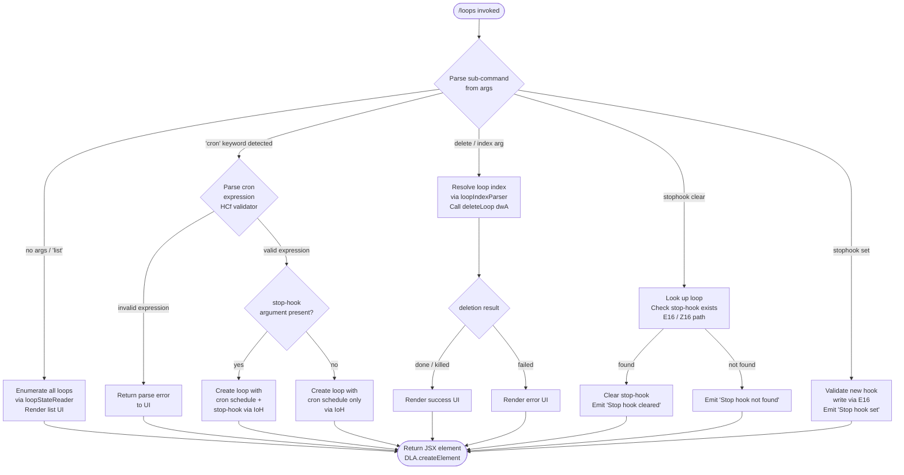

# `/loops`

> Analysis basis: CC v2.1.168 bundle.js (AST extraction + Claude interpretation)
> Minimum version: v2.1.168

---

## Overview

The `/loops` command is the primary management interface for Claude Code's background loop (agent) system. It provides sub-commands to **list** all running or stopped loops, **create** a new loop with a scheduled cron expression and an optional stop-hook, and **delete** an existing loop by index. The command renders a JSX-based interactive UI and interacts with the daemon process manager to spawn, configure, and retire background agent sessions.

---

## Registration

| Field | Value |
|---|---|
| type | `local-jsx` |
| name | `loops` |
| description | `List, create, and delete loops` |
| loc_byte | `12511277` |
| loc_byte_end | `12511434` |
| loc_line | `8941` |
| immediate | `true` |
| module_id | `hAK` |
| load_inline | `true` |
| arbor_handler.name | `_Cf` |
| arbor_handler.fqn | `claude-2.1.168::_Cf` |
| arbor_handler.kind | `AsyncFunction` |
| arbor_handler.resolution_path | `module_id` |
| arbor_handler.n_hits | `0` |

Analysis basis: CC v2.1.168 bundle.js:+12511277

---

## Input Branching

The handler inspects user-supplied arguments (sub-command keyword plus optional parameters) and routes to one of five distinct execution paths: list, create (with cron + optional stop-hook), delete, clear-stop-hook, and set-stop-hook. A Mermaid flowchart is used because there are more than three branches.



Analysis basis: CC v2.1.168 bundle.js:+12510232 (main handler entry), +12510280 (cron branch), +12510784 (cron validator), +12510882 (loop creator), +12510363 (delete branch), +12510658 (stop-hook clear), +12510970 (stop-hook set)

---

## Behavioral Spec

### 1. Main Handler Entry (`_Cf`)

```
async function loopsCommandHandler(context):
    emit telemetry("tengu_loops_command")          // +12510234
    appState = context.getAppState()               // +12510284
    existingLoops = appState.loops or []

    parsedSubCommand = parseSubCommand(context.args)  // n_H → +12510272
    scheduleMap = buildScheduleMap()                  // T16 → +12510280

    if parsedSubCommand is LIST or no sub-command:
        return renderLoopListUI(existingLoops, scheduleMap)

    if parsedSubCommand.kind == "cron":
        cronExpr = parsedSubCommand.cronExpression
        validated = validateCronExpression(cronExpr)   // HCf → +12510784
        if validated.error:
            return renderErrorUI(validated.error)
        stopHook = parsedSubCommand.stopHook or null
        newLoop = createLoop(validated.expr, stopHook) // IoH → +12510882
        updatedLoops = [...existingLoops, newLoop]
        context.setAppState({loops: updatedLoops})
        return renderLoopListUI(updatedLoops, scheduleMap)

    if parsedSubCommand.kind == "delete":
        index = parseLoopIndex(parsedSubCommand.raw)   // RN → +12510363
        result = deleteLoop(existingLoops[index])      // dwA (via w) → +12510363
        return renderResultUI(result)

    if parsedSubCommand.kind == "stophook-clear":
        return clearStopHook(context, existingLoops)   // Z16 → +12510658

    if parsedSubCommand.kind == "stophook-set":
        return setStopHook(context, parsedSubCommand)  // E16 → +12510970
```

Analysis basis: CC v2.1.168 bundle.js:+12510232

---

### 2. Sub-command Parser (`n_H`)

```
function parseSubCommand(rawArgs):
    trimmed = rawArgs.trim()
    if trimmed is empty:
        return { kind: "list" }
    tokens = tokenize(trimmed)      // ckH → +12510272, jT → +4881094
    keyword = tokens[0].toLowerCase()
    if keyword == "cron":
        return { kind: "cron", cronExpression: tokens[1..], stopHook: extractStopHook(tokens) }
    if keyword matches delete pattern:
        return { kind: "delete", raw: trimmed }
    if keyword == "stophook" and tokens[1] == "clear":
        return { kind: "stophook-clear" }
    if keyword == "stophook" and tokens[1] == "set":
        return { kind: "stophook-set", hookBody: tokens[2..] }
    return { kind: "list" }
```

Analysis basis: CC v2.1.168 bundle.js:+12510272 (`n_H`), +4881094 (`jT`)

---

### 3. Cron Expression Validator (`HCf`)

```
function validateCronExpression(expr):
    // Parses a cron string into fields
    // Maximum field values enforced:
    //   minutes: 0–59  (+12509999)
    //   hours:   0–23  (+12510070)
    //   days:    0–31  (+12510123)
    //   uses Math.max, Math.ceil, Math.round for range clamping
    match = expr.match(cronPattern)             // +12509820
    if no match:
        return { error: "invalid cron" }
    minuteValue = parseInt(match.minute)        // +12509857
    minuteNorm  = Math.max(0, Math.ceil(minuteValue))  // +12509942, +12509953
    rounded     = Math.round(...)               // +12510026
    // Delegates to Dk (schedule-text builder) for human-readable label
    scheduleText = buildScheduleText(expr)      // Dk → +12510190
    return { ok: true, expr: expr, label: scheduleText }
```

Human-readable schedule labels observed in literals:
- `"Every minute"` (bundle.js:+4876961)
- `"Every hour"` (bundle.js:+4877178)
- Range pattern `"1-5"` (bundle.js:+4877885)

Analysis basis: CC v2.1.168 bundle.js:+12510784

---

### 4. Schedule-Text Builder (`Dk` / `HsL`)

```
function buildScheduleText(cronExpr):
    trimmed = cronExpr.trim()              // +4875670
    fields = splitCronFields(cronExpr)     // HsL → +4875756
    // HsL internals:
    //   split on whitespace               // +4875090
    //   match each field against pattern  // +4875110
    //   parseInt individual values        // +4875155
    //   accumulate into Set K             // +4875216
    //   return Array.from(K)              // +4875618
    //   max parsed range width: 5         // +4875706
    //   base radix for parse: 10          // +4875169
    segments = []
    for each field:
        segments.push(describeField(field))   // A.push → +4875791
    return segments.join(" ")
```

Analysis basis: CC v2.1.168 bundle.js:+4875670

---

### 5. Schedule-Map Builder (`T16` / `n2H` / `Qzq`)

```
function buildScheduleMap():
    // Builds a Map<id, label> for rendering the loop list
    entries = n2H()                    // +10829469
    map = new Map()
    for entry in entries:
        map.set(entry.id, entry.label) // K.set → +9005328
    // Qzq maps over raw schedule objects to produce label strings
    labels = Qzq(entries)              // +9005336 → H.map +9005097
    return map
```

Column padding width: 40 characters (bundle.js:+16223773), separator: `"  "` (bundle.js:+16221802)

Analysis basis: CC v2.1.168 bundle.js:+10829469

---

### 6. Loop Creator (`IoH`)

```
async function createLoop(cronExpr, stopHook):
    id   = crypto.randomUUID()          // pD9.randomUUID → +4880397
    ts   = Date.now()                   // +4880459
    meta = buildLoopMeta(id, ts)        // bTH → +4880505
    // Read existing loop config file
    existing = readLoopConfig()         // ckH → +4880549
    newEntry = {
        id:        id,
        cron:      cronExpr,
        stopHook:  stopHook,
        createdAt: ts,
        ...meta
    }
    // Persist loop directory under .claude/  (+4880238)
    ensureDir(path.join(projectRoot, ".claude"))   // voH: m$8.mkdir → +4880217
    writeLoopFiles(newEntry)                        // voH: m$8.writeFile → +4880314
    return newEntry
```

Analysis basis: CC v2.1.168 bundle.js:+12510882, +4880397

---

### 7. Loop Config Reader (`ckH`)

```
async function readLoopConfig(projectRoot):
    configPath = buildConfigPath(projectRoot)   // _fH → +4879080
    // _fH uses path.join (p$8.join → +4879000) and config-dir resolver ($4 → +4879012)
    rawBytes = fs.readFile(configPath, "utf-8") // _.readFile → +4879069, encoding literal +4879097
    if readError:
        // Tolerates ENOENT (+176093), EACCES (+176107), EPERM (+176121),
        //             ENOTDIR (+176134), ELOOP (+176149), EROFS (+176162)
        handle = errorCodeHandler(err.code)     // t1 → +4879119  (V8 → +176076)
        logError via hH                         // +4879141
    parsed = parseConfigBytes(rawBytes)         // hH, x9, Array.isArray → +4879213
    // If result is not an array, wraps in array
    return Array.isArray(parsed) ? parsed : [parsed]
```

Analysis basis: CC v2.1.168 bundle.js:+4879050

---

### 8. Loop Index Parser / Delete Dispatcher (`RN`)

```
function parseLoopIndex(rawArg):
    trimmed = rawArg.trim()                    // +4876841
    matchResult = trimmed.match(indexPattern)  // K.match → +4876982
    index = parseInt(matchResult[1])           // +4877017
    // Handles cron schedule text: "Every minute" / "Every hour"
    // Interprets day-of-week fields via Date UTC methods:
    //   getUTCDay   → +4877718
    //   setUTCDate  → +4877737
    //   getUTCDate  → +4877750
    //   setUTCHours → +4877768
    //   getDay      → +4877797
    return index
```

Analysis basis: CC v2.1.168 bundle.js:+12510363 (dispatch), +4876841 (RN internals)

---

### 9. Loop Deletion (`dwA`)

```
async function deleteLoop(loopEntry):
    // Mark as pending removal
    pendingSet.add(loopEntry.id)               // q.add → +16202979
    try:
        // Resolve state file path
        statePath = resolveStatePath(loopEntry) // RK → +16203090 (y2.join → +4166415)
        status = readLoopStatus(statePath)      // e9 → +16203264
        // Attempt graceful stop states: done / killed / failed
        //   literals: "done" +16203115, "killed" +16203133, "failed" +16203152
        if status in ["done", "killed", "failed"]:
            // Remove roster entry
            _.rosterEntry (unregister) → +16204424
            // Remove state directory
            fs.rm(stateDir)                     // ID.rm → +16203205
            // Unlink socket
            fs.unlink(socketPath)               // ID.unlink → +16204268
        else:
            // Send kill signal via daemon worker w
            worker = getWorkerForLoop(loopEntry) // w → via RN → +12510363
            worker.kill("SIGKILL")               // b.kill → +16197043 (literal +16197050)
        // Wait up to 300 000 ms for final state (+16204682)
        await waitWithTimeout(300000)
        // Clean up session directory
        Y.delete(loopEntry.id)                  // +16204669
        H.delete(loopEntry.id)                  // +16204724
    finally:
        pendingSet.delete(loopEntry.id)         // q.delete → +16203002
```

Analysis basis: CC v2.1.168 bundle.js:+16203043 (`dwA` internals)

---

### 10. Stop-Hook Management

#### Clear stop-hook (`Z16`)

```
function clearStopHook(context, loops):
    appState = context.getAppState()           // H.getAppState → +10830272
    matchedLoop = findLoopByContext(appState)
    if matchedLoop is null:
        return renderMessage("Stop hook not found")  // literal +12510676
    updatedLoop = { ...matchedLoop, stopHook: null }
    newState = applyMessageOp(appState, "append", updatedLoop)  // H.applyMessageOp → +10830470
    context.setAppState(newState)              // H.setAppState → +10830401
    emit telemetry("tengu_stop_hook_removed")  // +10830527
    return renderMessage("Stop hook cleared")  // literal +12510698
```

Analysis basis: CC v2.1.168 bundle.js:+12510658

#### Set stop-hook (`E16`)

```
async function setStopHook(context, parsedArgs):
    // Verify hooks gate and trust gate
    checkHooksGate()   // G8A → kB ("hooks_gate" literal +10829665)
    checkTrustGate()   // G8A → ("trust_gate" literal +10829719)
    appState = context.getAppState()           // _.getAppState → +10829854
    // Determine goal and status
    goal = resolveGoal(appState)               // "goal" +10830561, "goal_status" +10830690
    yD(appState)                               // object.values → +43806
    newState = applyMessageOp(appState, "append", {
        type: "attachment",                    // literal +10830603
        hookBody: parsedArgs.hookBody
    })                                         // _.applyMessageOp → +10830098
    zxq(newState)                              // randomUUID → +10830621
    context.setAppState(newState)              // _.setAppState → +10830056
    emit telemetry("tengu_stop_hook_added")    // +10830155
    return renderMessage("Stop hook set")      // literal +12510994
```

Analysis basis: CC v2.1.168 bundle.js:+12510970

---

### 11. Loop List Renderer (JSX)

```
function renderLoopListUI(loops, scheduleMap):
    rows = loops.map((loop, index) => {
        label = scheduleMap.get(loop.id) or loop.cron
        // Pad label to 40 chars
        paddedLabel = label.padEnd(40)          // f.padEnd → +16221781
        return buildTableRow(index, paddedLabel, loop.status)
    })
    element = DLA.createElement(               // +12511037
        LoopListComponent,                     // L → +12511087
        { loops: rows },
        ...children                            // f → +12511111
    )
    return element
```

The `"stophook"` sub-command keyword is recognised literally (bundle.js:+12510416). The `"cron"` keyword routes to cron creation (bundle.js:+12510330). The `"system"` scope is also referenced in this handler region (bundle.js:+12510565).

Analysis basis: CC v2.1.168 bundle.js:+12511037

---

## State & Side Effects

| Item | Detail |
|---|---|
| Telemetry | `tengu_loops_command` (+12510234) — fired on every invocation |
| Telemetry | `tengu_stop_hook_added` (+10830155) — fired when a stop-hook is set |
| Telemetry | `tengu_stop_hook_removed` (+10830527) — fired when a stop-hook is cleared |
| Telemetry | `tengu_bg_dispatch_sigkill_escalate` (+16197002) — fired if SIGKILL is sent during delete |
| Telemetry | `tengu_bg_spare_claim` (+16198435), `tengu_bg_spare_claim_fail` (+16198701) — loop-worker claim events |
| Telemetry | `tengu_bg_sendclaim_failed` (+16176740) — IPC claim failure |
| Telemetry | `tengu_bg_state_read_transient` (+4167839) — transient loop state read |
| Telemetry | `tengu_daemon_config_reload` (+16212414) — daemon config change |
| appState changes | `getAppState` / `setAppState` / `applyMessageOp` called to persist loop list and stop-hook fields |
| File system | Reads loop config via `fs.readFile` (utf-8); creates `.claude/` directory and writes loop files on create; removes state dir / socket via `fs.rm` / `fs.unlink` on delete |
| IPC / daemon | Claims worker sessions via `YQ.claim` / `YQ.spawn`; sends kill frames via `My` (Buffer framing); uses Unix socket (`xF8.connect`) |
| Hook registration | `stophook` keyword arms a stop-hook into `appState`; E16 writes the hook as an `attachment`-typed message-op |
| Timeout | Delete waits at most **300 000 ms** (5 minutes) for loop termination (bundle.js:+16204682) |
| Timer | Idle-exit timer managed by daemon supervisor (`tengu_daemon_idle_exit` +16217667) |

---

## Version History

| Version | Change |
|---|---|
| v2.1.168 | Initial analysis |

---

## Common Mistakes

1. **Omitting the sub-command keyword**: invoking `/loops` with no arguments produces the list view. To create a loop you must include the `cron` keyword followed by a valid cron expression (e.g. `/loops cron * * * * *`).
2. **Malformed cron expression**: the validator (`HCf`) enforces strict numeric ranges (minutes 0–59, hours 0–23, days 0–31). Expressions that fail parsing return an error UI without modifying state.
3. **Deleting by name instead of index**: the delete path (`RN`) expects a numeric index resolved from the displayed list, not a loop ID string or name. Run `/loops` first to obtain the index.
4. **Setting a stop-hook on a non-existent loop**: if the loop context cannot be resolved, `Z16` returns `"Stop hook not found"` and no state change occurs.
5. **Assuming immediate process termination**: deletion sends SIGKILL only after graceful state checks; the command waits up to 300 000 ms (5 min) before declaring the loop cleaned up.
6. **Confusing `stophook` with a cron field**: `stophook` is a separate positional keyword parsed by `n_H` and must appear as its own token, not embedded in the cron expression.

---

## Appendix — Identifier Mapping

> For bundle debugging only. Identifiers change across versions.

| Identifier | Role |
|---|---|
| `_Cf` | Main async handler for `/loops` command |
| `n_H` | Sub-command argument parser (tokenises raw input) |
| `ckH` | Loop config file reader (reads and parses JSON config) |
| `_fH` | Config file path builder (joins project root + config dir) |
| `$4` | Config directory resolver |
| `t1` | File-read error code handler |
| `V8` | Generic error normaliser |
| `hH` | Config parse and validation helper |
| `AA` | Error constructor wrapper |
| `_6` | String coercion utility |
| `$q` | Essential-traffic filter |
| `DG4` | Queue shift/push helper (rotating buffer) |
| `v` | HTTP fetch / bootstrap fetch utility |
| `snK` | Fetch option builder |
| `H` | Bootstrap fetch dispatcher |
| `RH` | JSON.stringify wrapper |
| `G4` | URL path builder / trimmer |
| `EUH` | Network retry helper |
| `_iK` | Content-length / buffer helper |
| `Dk` | Schedule-text builder (cron → human label) |
| `HsL` | Cron field tokeniser (split / match / parseInt) |
| `A` | General array accumulator (context-dependent) |
| `L` | General collection / set wrapper |
| `q` | Pending-deletion set / socket unlink utility |
| `f` | Lifecycle / finally handler |
| `jT` | Secondary tokeniser for sub-command parsing |
| `tv` | Telemetry emit helper |
| `T16` | Schedule-map builder entry |
| `n2H` | Schedule-map populator (K.set loop) |
| `K` | Map / column-pad helper (context-dependent) |
| `Qzq` | Schedule label mapper (H.map over raw entries) |
| `R6` | Telemetry / state helper |
| `RN` | Loop index parser and delete dispatcher |
| `w` | Background worker / daemon session manager |
| `b` | Process handle for worker kill |
| `r8` | Abort / timeout helper |
| `O` | Abort signal subscriber |
| `CH` | Feature-ok event emitter |
| `J6` | Telemetry event dispatcher |
| `SH` | Feature-bad event emitter |
| `lx8` | Memory check helper (macOS freemem) |
| `D6` | Low-memory dispatch / memory-guard |
| `eX6` | Pins.json reader / pinned-session loader |
| `ZZ_` | pins.json path builder |
| `U6` | JSON.parse wrapper |
| `h8` | File-read error handler (V8-based) |
| `SgL` | Session directory reader (readdir + readFile) |
| `Q` | Worker retire-if-settled / process-kill manager |
| `U` | Interval-clear helper |
| `b4H` | Output-token trim helper |
| `C` | Rate-limit event enqueuer |
| `g` | Supervisor heartbeat / idle-exit timer |
| `j` | Worker kill-all helper |
| `pwA` | Daemon worker claim orchestrator |
| `T$A` | Daemon session initialiser (mkdir + writeFile) |
| `F$5` | Send-claim timeout / retry logic |
| `B$5` | Claim-frame builder |
| `Tf` | Generic validator (V8-based) |
| `GH` | String coercion / label formatter |
| `My` | IPC frame serialiser (Buffer allocation + writeUInt32BE) |
| `dwA` | Loop deletion orchestrator |
| `RK` | State-path resolver (y2.join + sT) |
| `e9` | Loop state file reader / cache manager |
| `VY` | Active-state marker (GN) |
| `zf` | Socket-path builder + RH formatter |
| `e16` | Async dispatch with Date.now timing |
| `q$H` | Path join + NxH helper |
| `yE` | H.split path builder |
| `gg` | z1A / s16 path builder |
| `PS6` | w1A / OO.join directory initialiser |
| `Y` | Session config/lifecycle manager (start/stop/updateConfig) |
| `D` | Forced-shutdown handler (process.exit + z.abort) |
| `IJ` | Shutdown reason builder |
| `z` | Daemon control abort/stop dispatcher |
| `B` | Disposable resource manager |
| `$` | DLK telemetry + daemon.status.json writer |
| `DLK` | Daemon status writer (Date.now + RH) |
| `Yo` | b4H output-token helper |
| `V9` | AsyncLocalStorage getStore |
| `YC6` | daemon.status.json path builder |
| `J` | Date UTC wrapper referencing worker `w` |
| `l_H` | Loop-filter and creation coordinator |
| `THH` | Has-check helper |
| `voH` | Loop directory and file writer (.claude mkdir + writeFile) |
| `Z16` | Stop-hook clear handler (getAppState / setAppState / applyMessageOp) |
| `zxq` | UUID generator for message-op |
| `P6` | hm6 wrapper |
| `hm6` | Low-level telemetry primitive |
| `HCf` | Cron expression validator (parseInt + Math.max/ceil/round) |
| `IoH` | Loop creation entry point (randomUUID + Date.now + bTH + ckH) |
| `bTH` | Loop metadata builder |
| `M` | MCP / session manager (xbH + PF8) |
| `xbH` | MCP connection handler (per-slot connect/disconnect) |
| `sl` | MCP slot config builder |
| `kk` | MCP config key builder (qz + xx_) |
| `a8` | _ (underscore utility) |
| `ly6` | MCP filter helper |
| `hhq` | MCP tool registration helper |
| `BD8` | MCP tool-use tracker (UD8 + EP) |
| `mD8` | MCP z4 state helper |
| `M8` | MCP debug log pusher |
| `wk8` | MCP OAuth authenticate tool builder |
| `jk8` | MCP OAuth complete-authentication tool builder |
| `phq` | MCP gk8 then-chain |
| `Ze_` | MCP EP/z4/M8/GH chain |
| `tN` | MCP D6 capability mapper |
| `hx_` | MCP X8 include-check |
| `k` | chokidar file-watcher skill handler |
| `v7` | MCP error log pusher |
| `bhq` | MCP AF helper |
| `L16` | MCP parseInt slot index parser |
| `lk8` | MCP parseInt lk8 variant |
| `PF8` | MCP applyConnectionResult handler |
| `bbH` | MCP tXH helper |
| `Ay` | MCP cleanup orchestrator (q16 + K.cleanup + tN) |
| `cDA` | MCP client roster / retry manager |
| `nD8` | MCP Jj7/Sx_ has-check |
| `q16` | MCP tXH wrapper |
| `E16` | Stop-hook set handler (G8A gates + appState mutation) |
| `G8A` | Gate checker (hooks_gate + trust_gate via kB/cD) |
| `kB` | policySettings x8 reader |
| `x8` | vn6/kd policy reader |
| `cD` | x8/yA policy helper |
| `U_` | Trust-gate validator |
| `Of` | NVL resolver |
| `NVL` | _6/QpH/J9/C6/llH/Wd/u6/dD.resolve chain |
| `o6` | Feature-sad event emitter |
| `yD` | hpH + Object.values appState inspector |

---

Note: index built via Arbor fallback; some signals (telemetry, literals) may be missing — see arbor-fallback.js.