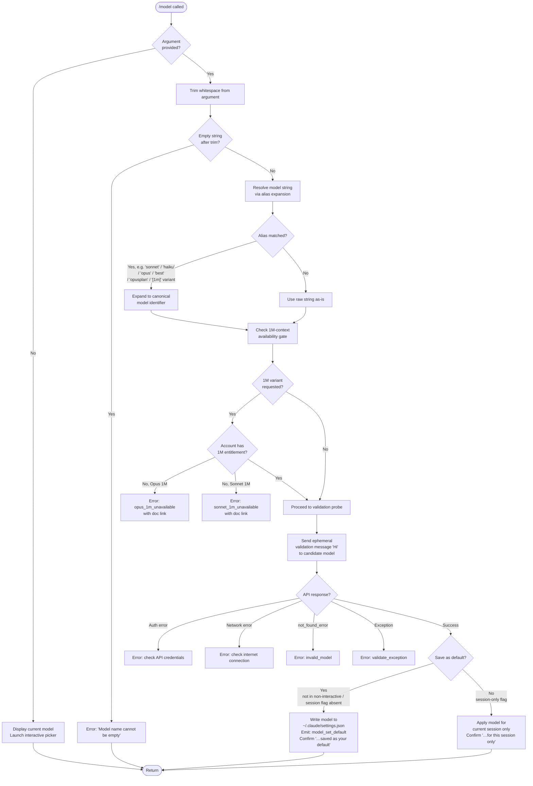

# `/model`

> Analysis basis: CC v2.1.168 bundle.js (AST extraction + Claude interpretation)
> Minimum version: v2.1.168

---

## Overview

`/model` sets the active AI model for a Claude Code session. When invoked with a model name argument, it validates and resolves that model string (including alias expansion and 1M-context variant checks), performs a live API probe to confirm availability, then either applies the model for the current session only or saves it as the default for new sessions. When invoked with no argument it displays the currently active model and presents an interactive model-selection picker.

---

## Registration

| Field | Value |
|---|---|
| type | `local` |
| name | `model` |
| description | `Set the AI model for Claude Code` |
| argumentHint | `<model>` |
| supportsNonInteractive | `true` |
| module_id | `hKK` |
| load_inline | `true` |
| loc_byte | `12731333` |
| loc_byte_end | `12731507` |
| loc_line | `9094` |
| arbor_handler.name | `zuf` |
| arbor_handler.fqn | `claude-2.1.168::zuf` |
| arbor_handler.kind | `AsyncFunction` |
| arbor_handler.resolution_path | `module_id` |
| arbor_handler.n_hits | `0` |

Analysis basis: CC v2.1.168 bundle.js:+12731333

---

## Input Branching

Four distinct major branches exist (no argument vs. argument; and within the argument path: alias resolution, 1M-context gating, validation probe outcome). A Mermaid flowchart is used.



Analysis basis: CC v2.1.168 bundle.js:+12695965, +12696048, +12656950, +12657326, +12659018, +12659237, +12660315

---

## Behavioral Spec

### 1. Entry Point — Handler Dispatch (`zuf`)

```
async function modelCommandHandler(args, context):
    rawInput = args.trim()                          // +12695965

    if context.inputMode is "text":                 // +12696032
        emit telemetry("tengu_model_command_inline")  // +12696123
        // inline text-mode path — show current model inline

    if DFH includes rawInput:                       // +12695981
        // likely a flag check (e.g. --help)
        pass

    appState = context.getAppState()               // +12696004

    if rawInput is empty:
        // No-argument path: display picker
        return showModelPicker(appState)

    return modelValidateAndApply(rawInput, appState, context)
```

Analysis basis: CC v2.1.168 bundle.js:+12695965

---

### 2. Alias Resolution (`resolveModelAlias`)

The handler delegates to a resolution function (reached via `bb8` → `YR` → `yz6`/`_G`) that normalises short aliases to canonical model IDs.

```
function resolveModelAlias(inputString):
    normalized = inputString.trim().toLowerCase()

    // Short-name alias table (literals from bundle):
    aliasMap = {
        "sonnet"   -> canonicalSonnetId,
        "haiku"    -> canonicalHaikuId,
        "opus"     -> canonicalOpusId,
        "best"     -> canonicalBestId,          // +2247664
        "opusplan" -> "Opus Plan" model,        // +2247508
        "[1m]"     -> 1M-context variant,       // +2247534
        "sonnet[1m]"     -> sonnet 1M variant,  // +12660852
        "sonnet-4-6[1m]" -> sonnet-4-6 1M,     // +12660878
    }

    if normalized in aliasMap:
        return aliasMap[normalized]

    // Vendor-prefix check: if string starts with "anthropic."  (+2241469)
    // pass through as firstParty model (+2243716)

    return inputString   // use verbatim
```

The description string `"Opus in plan mode, else Sonnet"` is associated with the `opusplan` alias.
Analysis basis: CC v2.1.168 bundle.js:+2247508, +2246038, +2241469, +2243716

---

### 3. 1M-Context Availability Gate (`checkOneMContext` — via `Cb8` → `Txf` / `Exf`)

```
function checkOneMContextAvailability(resolvedModel, accountCapabilities):
    modelLower = resolvedModel.toLowerCase()      // +12660713, +12660810

    if modelLower indicates Opus 1M variant:
        if NOT accountCapabilities.includes(opus1MEntitlement):  // +12660749
            raise UnavailableError(
                code = "opus_1m_unavailable",         // +12658980
                message = "Opus with 1M context is not available for your account. "
                          + "Learn more: https://code.claude.com/docs/en/model-config"
                          + "#extended-context-with-1m"   // +12659018
            )

    if modelLower indicates Sonnet 1M variant:
        if NOT accountCapabilities.includes(sonnet1MEntitlement): // +12660841
            raise UnavailableError(
                code = "sonnet_1m_unavailable",        // +12659197
                message = "Sonnet 4.6 with 1M context is not available for your account. "
                          + "Learn more: https://code.claude.com/docs/en/model-config"
                          + "#extended-context-with-1m"  // +12659237
            )

    return resolvedModel  // passed gate
```

Analysis basis: CC v2.1.168 bundle.js:+12658980, +12659197

---

### 4. Live Validation Probe (`validateModelViaApiProbe` — via `Sb8`)

A minimal ephemeral message is sent to the API to confirm the model actually exists under the caller's credentials.

```
async function validateModelViaApiProbe(candidateModel, apiClient):
    try:
        response = await apiClient.sendMessage(
            model   = candidateModel,
            role    = "user",                 // +12657361
            content = "Hi",                   // +12657395
            cache   = "ephemeral"             // +12657420
        )

        // Inspect response for error shapes:
        if response.type == "not_found_error":   // +12657907
            // model: field present in error message  // +12657989
            raise ModelError(code = "invalid_model",  // +12659480
                             message = response.message)

        return SUCCESS

    catch AuthenticationError:
        raise ModelError(
            message = "Authentication failed. Please check your API credentials."  // +12657686
        )
    catch NetworkError:
        raise ModelError(
            message = "Network error. Please check your internet connection."  // +12657788
        )
    catch Exception as e:
        raise ModelError(code = "validate_exception",   // +12659577
                         message = e)
```

The `UqK` map (`UqK.has` / `UqK.set`) is used as a result cache to avoid re-probing the same model string within a session.
Analysis basis: CC v2.1.168 bundle.js:+12657276, +12657231, +12657439

---

### 5. Apply Model & Persist (`applyModelSetting` — via `oLA`)

```
async function applyModelSetting(resolvedModel, saveDefault, appState):
    // Determine provider type (firstParty / anthropicAws / bedrock / vertex / gateway / foundry / mantle)
    providerType = detectProvider(resolvedModel)    // +2101625 anthropicAws, +2100952 bedrock, etc.

    if saveDefault:
        // Persist to ~/.claude/settings.json  (+1272961, +1272971)
        writeSettingToFile("model", resolvedModel)  // +12660362
        emitTelemetry("model_set_default")          // +12660315
        confirmMessage = resolvedModel
                         + " and saved as your default for new sessions"  // +12659957

    else:
        // Session-only
        appState.setModel(resolvedModel)
        confirmMessage = resolvedModel
                         + " for this session only"   // +12660003

    // Build display annotation string:
    annotation = ""
    if fastModeEnabled:
        annotation += " · Fast mode ON"    // +12660121
    if drawsFromUsageCredits:
        annotation += " · Draws from usage credits"  // +12660172
    if fastModeDisabled:
        annotation += " · Fast mode OFF"   // +12660218

    // For managed/policy settings, prefix display with "Managed settings"  // +12660524

    displayConfirmation(confirmMessage + annotation)
```

Analysis basis: CC v2.1.168 bundle.js:+12659957, +12660003, +12660315, +12660362

---

### 6. Bootstrap / Settings Fetch (`bootstrapFetch` — via `H`)

The handler reaches a network fetch helper that retrieves account capability data used by the 1M gate.

```
async function bootstrapFetch(endpoint, timeout = 5000):  // +15797859
    log("[Bootstrap] Fetching", endpoint)   // +15797658
    headers = {
        "Content-Type": "application/json",   // +15797743, +15797758
        "User-Agent":   userAgentString       // +15797777
    }
    response = await fetch(endpoint, { headers, timeout })
    if ok:
        log("[Bootstrap] Fetch ok")           // +15798032
        return parsedData
    else:
        emitTelemetry("api_bootstrap_fetch", { result: "parse_failed" })  // +15797980, +15798002
```

Analysis basis: CC v2.1.168 bundle.js:+15797658

---

### 7. Logging Subsystem (`logWriter` — via `_iK` → `npH`)

The command routes debug output through an async log-queue writer that batches entries, uses `setTimeout`/`setImmediate` scheduling, and appends to a `.txt` log file.

```
function enqueueLogEntry(level, message):
    if level == "debug":              // +206570
        entry = formatEntry(message)
        pendingQueue.push(entry)      // +59982
        scheduleFlush()               // uses setTimeout(+59947) and setImmediate(+60040)

function flushLogQueue():
    clearTimeout(flushTimer)          // +59783
    joined = pendingQueue.join(...)   // +59857
    writeToFile(joined)              // via nWA → H.write (+193301)
    pendingQueue = []
```

Log files use a `.txt` extension (+205511) with a 4-byte slice offset (+205533) and a 40-character path truncation limit (+16223773).
Analysis basis: CC v2.1.168 bundle.js:+206570, +59783, +205511

---

## State & Side Effects

| Item | Detail |
|---|---|
| Telemetry: `tengu_model_command_inline` | Fired when `/model` is invoked in inline text mode (bundle.js:+12696123) |
| Telemetry: `tengu_api_success` | Fired on successful API validation probe (bundle.js:+13500907) |
| Telemetry: `tengu_lone_surrogate_sanitized` | Fired when lone Unicode surrogates are sanitised from a response (bundle.js:+13500656) |
| Telemetry: `tengu_feature_ok` | Fired on successful feature execution path (bundle.js:+1010950) |
| Telemetry: `tengu_feature_bad` | Fired on feature error path (bundle.js:+1011012) |
| Telemetry: `tengu_feature_sad` | Fired on feature degraded/partial path (bundle.js:+1011093) |
| Settings persistence | `~/.claude/settings.json` written when save-as-default path taken; key `"model"` (+12660362, +1272961, +1272971) |
| Session state mutation | `appState.model` updated in-memory for session-only path |
| API probe side effect | One ephemeral message (`"Hi"`) sent to the candidate model; result cached in `UqK` map to avoid repeat probes (+12657231, +12657439) |
| Log file writes | Debug entries appended to `.txt` log via async queue (+205511, +193301) |
| Validation error codes emitted | `model_switch`, `not_allowed`, `opus_1m_unavailable`, `sonnet_1m_unavailable`, `invalid_model`, `validate_exception` |

---

## Version History

| Version | Change |
|---|---|
| v2.1.168 | Initial analysis |

---

## Common Mistakes

1. **Passing an empty string** — `/model ` (with only spaces) triggers the "Model name cannot be empty" error (+12656987) because the argument is trimmed before the empty check. Always supply a non-whitespace model name or omit the argument entirely to get the interactive picker.
2. **Requesting a 1M-context variant without entitlement** — Appending `[1m]` to a model name (e.g. `sonnet[1m]`) when the account does not have the extended-context feature results in a hard error with a documentation link, not a silent fallback to the standard context window.
3. **Assuming the model persists across sessions by default** — Whether the change is persisted to `settings.json` (default) or limited to the current session depends on invocation context. Non-interactive mode and certain flags can alter this behaviour.
4. **Using vendor-prefixed IDs in the wrong provider context** — Model strings are routed differently depending on detected provider type (`firstParty`, `anthropicAws`, `bedrock`, `vertex`, `gateway`, `foundry`, `mantle`). A Bedrock ARN supplied in a first-party context will fail validation.
5. **Expecting instant confirmation without an API round-trip** — `/model` always performs a live probe (`"Hi"` message) before accepting a model name. This adds latency and requires network access even in non-interactive mode.

---

## Appendix — Identifier Mapping

> For bundle debugging only. Identifiers change across versions.

| Identifier | Role |
|---|---|
| `zuf` | Main `/model` command async handler (arbor_handler; module `hKK`) |
| `H` | Bootstrap / settings-fetch orchestrator |
| `v` | Log-writer orchestration function |
| `snK` | Log entry formatter / file-path builder |
| `IPA` | Log rotation helper |
| `RH` | JSON serialisation utility (wraps `JSON.stringify`) |
| `G4` | File-path normalisation / truncation helper |
| `K0A` | Path-segment mapper |
| `EUH` | File-write dispatcher |
| `nWA` | Low-level file write wrapper |
| `_iK` | Async log-queue manager |
| `npH` | Log-queue flush scheduler (uses `setTimeout` / `setImmediate`) |
| `YKH` | Log entry renderer / joiner |
| `B76` | Byte-length guard for log entries |
| `$0A` | Path join helper for log directory |
| `ll8` | Log-file rotation / rename utility |
| `HiK` | Log-file append-and-rotate handler |
| `j9` | Signal / hook registration helper |
| `mj_` | Model string splitter / trimmer |
| `lHH` | Feature-flag / capability set membership checker |
| `uj` | String replace utility |
| `H9` | Model display-name resolver |
| `m6H` | Model metadata aggregator |
| `qB` | Model string parser (splits aliases, checks prefix) |
| `s9` | Canonical model-ID normaliser |
| `Y2` | Model ID regex / pattern matcher |
| `h4H` | First-party model list membership checker |
| `CI` | Context-window size classifier |
| `DdH` | Model feature-flag decoder |
| `bT` | Model tier classifier (`firstParty` etc.) |
| `lP1` | Model tier lookup wrapper |
| `lM` | Provider-type resolver |
| `NH8` | Allowlist membership checker |
| `wdH` | Model metadata field extractor |
| `FJ` | Model display-object builder |
| `_G` | Full model descriptor assembler |
| `bb8` | Capability-fetch and model-list retriever |
| `YR` | Account model-list fetcher |
| `yz6` | Model-list entry constructor |
| `Az` | Model feature-flag attachment helper |
| `nD` | SHA-256 hash utility (for cache keying) |
| `kx` | Hash initialiser |
| `BqK` | Model validate-and-apply orchestrator |
| `Cb8` | Model validation dispatcher (routes to Txf / Exf / Gxf / Sb8) |
| `CH` | Feature telemetry helper (ok/bad path) |
| `Txf` | Opus-1M entitlement checker |
| `Us` | Entitlement token extractor |
| `z2` | Model descriptor composer |
| `Exf` | Sonnet-1M entitlement checker |
| `q5H` | Sonnet entitlement token extractor |
| `Gxf` | First-party inclusion checker for model name |
| `Sb8` | Live API validation probe executor |
| `Sm` | API side-query / message sender |
| `Pxf` | Validation-result formatter |
| `GH` | String coercion wrapper |
| `oLA` | Apply-model-setting and confirmation-display function |
| `eR6` | Settings-file write orchestrator |
| `o_` | Settings JSON read/write utility |
| `SH` | Feature telemetry dispatcher |
| `A4` | Model display-annotation builder |
| `MA` | Provider-type label resolver |
| `_6` | String coercion / Boolean truthy helper |
| `UYH` | Confirmation message formatter |
| `PO` | Model display-string builder (with fast-mode annotation) |
| `q0H` | Interactive model picker / selector |
| `GA` | Generic async result handler |
| `aLA` | Post-apply display renderer (managed settings / dim/bold formatting) |
| `kZH` | Config directory path resolver |
| `x8` | Settings file path resolver |
| `qu` | Settings path joiner (`.claude/settings.json`) |
| `Oo` | Model description / label renderer |

---

Note: index built via Arbor fallback; some signals (telemetry, literals) may be missing — see arbor-fallback.js.