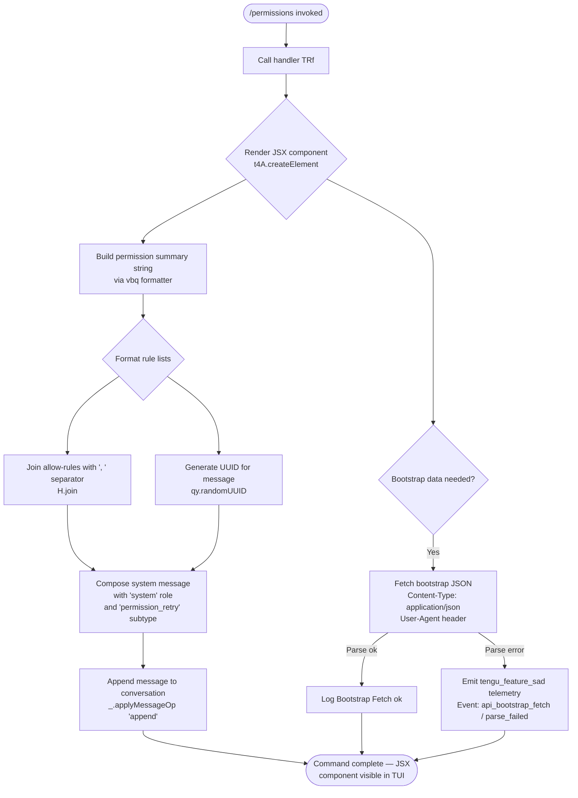

# `/permissions`

> Analysis basis: CC v2.1.168 bundle.js (AST extraction + Claude interpretation)
> Minimum version: v2.1.168

---

## Overview

The `/permissions` command (also aliased as `/allowed-tools`) provides an interactive interface for inspecting and managing the allow and deny rules that govern which tools Claude Code may invoke during a session. It renders a JSX component into the conversation and appends a system-level message describing the current permission state, enabling users to review and modify tool-access policies without leaving the CLI.

---

## Registration

| Field | Value |
|---|---|
| type | `local-jsx` |
| name | `permissions` |
| description | Manage allow and deny tool permission rules |
| aliases | `["allowed-tools"]` |
| module_id | `V_K` |
| load_inline | `true` |
| loc_byte | `12446263` |
| loc_byte_end | `12446435` |
| loc_line | `8843` |
| arbor_handler.name | `TRf` |
| arbor_handler.fqn | `claude-2.1.168::TRf` |
| arbor_handler.kind | `AsyncFunction` |
| arbor_handler.resolution_path | `module_id` |
| arbor_handler.n_hits | `0` |

Analysis basis: CC v2.1.168 bundle.js:+12446263

---

## Input Branching

The command's top-level flow has three distinguishable paths based on the call graph: (1) rendering a JSX component for display, (2) appending a system message via `applyMessageOp` with the `"append"` operation, and (3) delegating to the permission-rule formatter (`vbq`) which itself resolves current allow/deny state. A Mermaid diagram is used because there are 3+ distinct branches.



Analysis basis: CC v2.1.168 bundle.js:+12446081, +12446134, +12446176, +10778754, +10778843

---

## Behavioral Spec

### Handler Entry Point (`TRf`)

The main handler is an `AsyncFunction` resolved by Arbor via the `module_id` path (`V_K → TRf`).

```
async function permissionsCommandHandler(context):
    // 1. Build the JSX tree for the interactive permissions panel
    element = createJSXElement(PermissionsPanel, context)

    // 2. Produce a formatted summary of current permission rules
    summaryText = formatPermissionsSummary(context.tools, context.rules)

    // 3. Append a system-level message to the conversation history
    applyMessageOperation("append", {
        role:    "system",
        subtype: "permission_retry",
        content: summaryText
    })

    return element
```

Analysis basis: CC v2.1.168 bundle.js:+12446081, +12446134, +12446157

---

### Permission Summary Formatter (`vbq`)

Produces a human-readable summary of active allow and deny rules, used as the body of the appended system message.

```
function formatPermissionsSummary(allowRules, denyRules):
    // Join individual allow-rule strings with ", " delimiter
    allowList = allowRules.join(", ")

    // Join individual deny-rule strings with ", " delimiter
    denyList  = denyRules.join(", ")

    // Stamp with a fresh UUID for message de-duplication
    messageId = crypto.randomUUID()

    // Emit an informational log line
    log("info", "permission_retry", allowList, denyList)

    return buildSystemMessage(messageId, allowList, denyList)
```

Analysis basis: CC v2.1.168 bundle.js:+10778754, +10778761, +10778786, +10778716, +10778843

---

### Tool-Name Resolution Pipeline (`v` → `snK` → `G4`)

When the permissions panel needs to display a canonical tool name, it passes through a multi-step resolution chain.

```
function resolveToolDisplayName(rawName):
    // Step 1: normalise to uppercase for comparison
    upper = rawName.toUpperCase()

    // Step 2: check whether the name appears in the known-tool list
    if knownToolList.includes(upper):
        return formatKnownTool(upper)        // path through RH / JSON.stringify

    // Step 3: apply regex replacement for sanitisation
    sanitised = upper.replace(sanitisePattern, "")

    // Step 4: trim whitespace
    trimmed = sanitised.trim()

    // Step 5: call the structured-name builder (G4)
    structuredName = buildStructuredName(trimmed)
    return structuredName
```

`buildStructuredName` (`G4`) performs:
- A base-offset lookup starting at index `0` (bundle.js:+198178)
- A regex replacement for bracket/separator normalisation (bundle.js:+198200)
- Positional access via `.at()` on the token array (bundle.js:+198310)
- `lastIndexOf` + `slice` to extract the leaf segment (bundle.js:+198336, +198362)
- Redacts sensitive fragments as `"[REDACTED]"` when found (bundle.js:+198252)

Analysis basis: CC v2.1.168 bundle.js:+206594, +206634, +206652, +206696, +206716, +206719, +198173

---

### Config-File Reader (`_iK`)

Reads and parses the on-disk permissions configuration (allow/deny lists stored in the Claude Code settings file).

```
async function readPermissionsConfig(configPath):
    // Resolve directory from path
    dir = path.dirname(configPath)

    // Read raw bytes and check size
    rawBytes = readFileBytes(configPath)
    byteLen  = Buffer.byteLength(rawBytes)

    if byteLen > 1000:           // bundle.js:+206401
        truncate to first 100 lines   // bundle.js:+206420

    // Parse and return structured rule object
    parsed = parseConfigFormat(rawBytes)

    // Bind callback for post-parse processing
    result = await parsed.then(postProcessConfig.bind(context))

    // Write back any normalised changes
    await persistNormalisedConfig(result)    // j9

    return result
```

Analysis basis: CC v2.1.168 bundle.js:+206082, +206115, +206145, +206290, +206323, +206340, +206349, +206401, +206420, +206445

---

### Bootstrap Fetch (`H` / `o6`)

When the command panel requires remote configuration data (e.g., to list available MCP tools), it performs a JSON fetch.

```
async function fetchBootstrapData(url):
    log("debug", "[Bootstrap] Fetching", url)    // bundle.js:+15797658

    response = await fetch(url, {
        headers: {
            "Content-Type": "application/json",   // bundle.js:+15797743, +15797758
            "User-Agent":   buildUserAgent()       // bundle.js:+15797777
        },
        timeout: 5000                              // bundle.js:+15797859
    })

    try:
        data = JSON.parse(response.body)
        log("debug", "[Bootstrap] Fetch ok")       // bundle.js:+15798032
        return data
    catch ParseError:
        emitTelemetry("api_bootstrap_fetch", "parse_failed")  // bundle.js:+15797980, +15798002
        throw
```

Analysis basis: CC v2.1.168 bundle.js:+15797656, +15797694, +15797790, +15797798, +15797841, +15797844, +15797868, +15797977

---

### Model-Alias Normaliser (`s9`)

Used during rule editing to normalise model references embedded in tool-permission strings.

```
function normaliseModelAlias(rawAlias):
    trimmed = rawAlias.trim().toLowerCase()

    switch trimmed:
        case "opusplan": return resolveOpusPlan()    // bundle.js:+2247508
        case "[1m]":     return resolveLatestModel() // bundle.js:+2247534
        case "sonnet":   return resolveSonnet()      // bundle.js:+2247549
        case "haiku":    return resolveHaiku()       // bundle.js:+2247588
        case "opus":     return resolveOpus()        // bundle.js:+2247627
        case "best":     return resolveBest()        // bundle.js:+2247664
        default:
            replaced = trimmed.replace(aliasPattern, "")
            return replaced
```

Analysis basis: CC v2.1.168 bundle.js:+2247412, +2247423, +2247441, +2247451, +2247487, +2247508, +2247534

---

## State & Side Effects

| Item | Detail |
|---|---|
| Telemetry | `tengu_feature_sad` (bundle.js:+1011093) — fired on bootstrap parse failure |
| Conversation mutation | Appends a `"system"` / `"permission_retry"` message via `applyMessageOp("append", …)` (bundle.js:+12446134, +12446157) |
| UUID generation | Each invocation stamps the appended message with a fresh `crypto.randomUUID()` (bundle.js:+10778843) |
| Config file I/O | Reads and may rewrite the on-disk permissions config; byte-length cap of 1000 bytes / 100 lines enforced (bundle.js:+206401, +206420) |
| Network I/O | Optional bootstrap fetch (timeout: 5000 ms) to retrieve remote tool configuration (bundle.js:+15797859) |
| Logging | Emits `"debug"` log lines during bootstrap fetch; `"info"` log during permission summary construction (bundle.js:+206570, +10778786) |
| File deletion (indirect) | Call graph reaches `opK.unlinkSync` via `q` (bundle.js:+16174065) — likely for temp-file cleanup during config rewrite |

---

## Version History

| Version | Change |
|---|---|
| v2.1.168 | Initial analysis |

---

## Common Mistakes

1. **Confusing `/permissions` with a read-only inspector.** The command also appends a `system`/`permission_retry` message to the conversation history; avoid calling it inside automated pipelines where side-effects on message state are undesirable.
2. **Ignoring the `/allowed-tools` alias.** Both names invoke the same handler (`TRf`). Tooling that only recognises `/permissions` will miss invocations recorded under the alias.
3. **Assuming instantaneous execution.** The command may perform a network bootstrap fetch (up to 5 000 ms timeout) and disk I/O before returning the JSX component; do not treat it as synchronous.
4. **Expecting unchanged config files.** When the config byte-length exceeds 1 000 bytes or 100 lines, the handler normalises and rewrites the file; manual edits beyond those thresholds may be silently truncated.
5. **Missing the `[REDACTED]` substitution.** The tool-name resolution pipeline redacts certain token patterns (bundle.js:+198252); displayed tool names in the panel may not exactly match the raw internal names.

---

## Appendix — Identifier Mapping

> For bundle debugging only. Identifiers change across versions.

| Identifier | Role |
|---|---|
| `TRf` | Main async handler for `/permissions` command (Arbor-resolved, `claude-2.1.168::TRf`) |
| `vbq` | Permission summary formatter — joins allow/deny rule lists and builds the system message payload |
| `H` | Permission rule list / bootstrap data container; holds allow/deny arrays and provides `.join`, `.includes`, `.replace` operations |
| `v` | Tool-name resolution pipeline entry — normalises raw tool names through uppercase, sanitisation, and structured-name building |
| `snK` | Intermediate normalisation step in tool-name pipeline; delegates to `KI`, `M0A`, `IPA` |
| `RH` | Known-tool formatter; serialises tool descriptor via `JSON.stringify` |
| `G4` | Structured-name builder — performs offset lookup, regex replacement, positional access, and leaf-segment extraction |
| `EUH` | Supplementary name normalisation helper; calls `nWA` |
| `_iK` | Async permissions config file reader/writer |
| `Y3` | Bootstrap data sub-processor (called from `H`) |
| `mj_` | Rule-string parser — splits, trims, and slices individual rule tokens |
| `q` | Low-level file utility; exposes `unlinkSync` for temp-file cleanup |
| `lHH` | Known-tool set membership check using `o74.has` |
| `uj` | String replacement helper for rule normalisation |
| `H9` | High-level rule-parsing coordinator; delegates to `m6H`, `s9`, `FJ` |
| `m6H` | Rule object builder; assembles structured rule from parsed tokens via `Q0`, `aqH`, `yA`, `qB` |
| `s9` | Model-alias normaliser — lowercases and maps alias strings to canonical model references |
| `FJ` | Rule finaliser; post-processes parsed rule and resolves `_G` fallback |
| `o6` | Bootstrap fetch orchestrator; calls lower-level fetch helper `l` / `J6` and emits telemetry |
| `l` | Low-level HTTP fetch wrapper |
| `J6` | HTTP request executor; delegates to `hm6` |