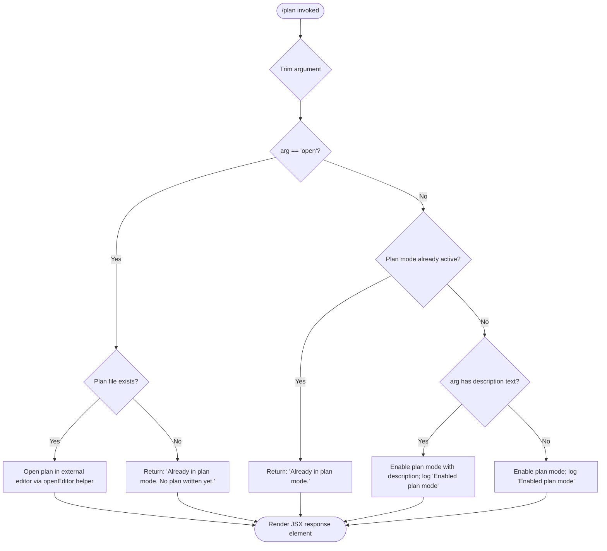

# `/plan`

> Analysis basis: CC v2.1.168 bundle.js (AST extraction + Claude interpretation)
> Minimum version: v2.1.168

---

## Overview

The `/plan` command enables **plan mode** for the current Claude Code session, or displays the session's existing plan if one has already been written. When invoked with the `open` argument (or when a plan already exists), it can launch an external editor or viewer to inspect the plan document. The command is a `local-jsx` type that renders a JSX response element back to the terminal UI.

---

## Registration

| Field | Value |
|---|---|
| type | `local-jsx` |
| name | `plan` |
| description | `Enable plan mode or view the current session plan` |
| argumentHint | `[open\|<description>]` |
| module_id | `y_K` |
| load_inline | `true` |
| loc_byte | `12448077` |
| loc_byte_end | `12448276` |
| loc_line | `8843` |
| arbor_handler.name | `VRf` |
| arbor_handler.fqn | `claude-2.1.168::VRf` |
| arbor_handler.kind | `AsyncFunction` |
| arbor_handler.resolution_path | `module_id` |
| arbor_handler.n_hits | `0` |

Analysis basis: CC v2.1.168 bundle.js:+12448077

---

## Input Branching

The handler `VRf` contains at least four distinct logical branches depending on the current plan-mode state and the argument passed by the user. A Mermaid flowchart is used here.



Analysis basis: CC v2.1.168 bundle.js:+12447190 through +12447854

---

## Behavioral Spec

### Top-level Handler (`VRf`)

The primary handler is the `AsyncFunction` `VRf`, resolved via `module_id → y_K`.

```
async function planCommandHandler(context, argument):
    rawArg = context.argument ?? ""
    trimmedArg = rawArg.trim()                          // +12447457

    // Step 1: Retrieve session state
    sessionState = getSessionState(context)             // calls tqH (+12447239)
    appState    = getAppState(context)                  // calls K    (+12447253)

    // Step 2: Check if 'open' sub-command requested
    if trimmedArg == "open":                            // +12447476
        planFilePath = getPlanFilePath(sessionState)    // calls Lq6  (+12447539)
        if planFileExists(planFilePath):
            openEditorOnPlanFile(planFilePath)          // calls tZ   (+12447586)
                                                        // calls cg   (+12447736)
        else:
            return renderResponse("Already in plan mode. No plan written yet.")
                                                        // +12447635
        return renderResponse(null)

    // Step 3: Check if already in plan mode
    alreadyInPlanMode = checkPlanModeActive(appState)   // calls sZ   (+12447593)
    if alreadyInPlanMode:
        return renderResponse("Already in plan mode.")  // +12447415

    // Step 4: Enable plan mode
    enablePlanMode(appState, trimmedArg)                // calls oM   (+12447289)
                                                        // calls A86  (+12447292)
    logInfo("Enabled plan mode")                        // +12447395 ("info" +10706821)

    // Step 5: Render result as JSX element
    jsxElement = buildResponseElement(context)          // calls eP   (+12447379)
                                                        // calls zV.createElement (+12447854)
    return jsxElement
```

Analysis basis: CC v2.1.168 bundle.js:+12447190

---

### Plan File Path Resolution (`Lq6`)

```
function getPlanFilePath(sessionState):
    basePath = getSessionDirectory(sessionState)    // calls HOH (+13268814)
    filePath = joinPath(basePath, "plan")           // calls R6  (+13268827)
    return filePath
```

Analysis basis: CC v2.1.168 bundle.js:+12447539

---

### Plan File State Query (`sZ`)

`sZ` reads the on-disk plan file (or an in-memory state map) to determine whether a plan is currently active and whether any plan content has been written.

```
function checkPlanModeAndContent(sessionState):
    stateKey  = buildStateKey(sessionState)         // calls R6  (+13268920)
    entry     = stateMap.get(stateKey)              // calls ZWH (+13268916)
    if entry exists:
        return { active: true, hasContent: entry.hasContent }
    return { active: false, hasContent: false }
```

Analysis basis: CC v2.1.168 bundle.js:+12447593

---

### External Editor Launch (`cg`)

When the `open` sub-command is issued and the plan file exists, `cg` suspends the Ink/terminal renderer, spawns an external process (the user's `$EDITOR` or a detected IDE), and then resumes rendering after the process exits.

```
function openEditorOnPlanFile(filePath):
    inkInstance = getInkInstance()                  // calls _L.get (+11559149)
    if inkInstance is null:
        throw Error("Ink instance not found - cannot pause rendering")
                                                    // +11559190
    editorCommand = resolveEditorCommand(filePath)  // calls mp  (+12447820)
                                                    // calls K0  (+12447829)

    inkInstance.enterAlternateScreen()              // +11559343
    inkInstance.pause()                             // +11559373
    inkInstance.suspendStdin()                      // +11559383

    args = buildEditorArgs(editorCommand, filePath) // calls P0f (+11559331)
    result = spawnSync(editorCommand, args,
                       { stdio: "inherit" })        // +11559465, +11559497

    planContent = readFileSync(filePath, "utf-8")   // +11559767, +13269073

    inkInstance.exitAlternateScreen()               // +11559845
    inkInstance.resumeStdin()                       // +11559874
    inkInstance.resume()                            // +11559890

    return planContent
```

Analysis basis: CC v2.1.168 bundle.js:+12447736

---

### Permission / Mode Guard (`oM`)

Before actually activating plan mode, `oM` validates that the session is not running under `bypassPermissions` mode restrictions. If `bypassPermissions` is set but disallowed, it logs a warning and skips the mode change.

```
function setPermissionMode(appState, newMode):
    if newMode == "bypassPermissions":              // +4760395
        if bypassPermissionsDisabled(appState):
            log("Ignoring permission update: setMode 'bypassPermissions' rejected"
                + " — mode is not available ...")   // +4760461
            return
    applyModeChange(appState, "setMode", newMode)  // +4760373
    updateRules(appState)                           // calls A.set (+4761655)
                                                   //        K.filter (+4762052)
                                                   //        A.delete (+4762354)
```

Analysis basis: CC v2.1.168 bundle.js:+12447289

---

### Tool-list / Context Assembly (`A86`, `Rp`, `QMH`)

`A86` and its callees assemble the allowed-tools list and session context that plan mode operates within. This includes merging policy settings, flag settings, user settings, and local settings (string constants at +1285272, +1285322, +1285370, +1285418).

```
function buildPlanModeContext(appState, description):
    settings = mergeSettings([
        "policySettings",   // +1285272
        "flagSettings",     // +1285322
        "userSettings",     // +1285370
        "localSettings"     // +1285418
    ])                                              // calls d6A (+10706523)
                                                   //        z__ (+10706458)

    allowedToolsContext = buildAllowedToolsList(    // calls Rp  (+10706719)
        settings, description)                     //        QMH (+10706625)

    // Rp iterates Object.entries of tool definitions,
    // resolves each tool's session/cliArg source,   // +10695948, +10694658
    // and filters against --allowed-tools flag      // +10694707

    return allowedToolsContext
```

Analysis basis: CC v2.1.168 bundle.js:+12447292

---

### JSX Response Element Construction (`J_q`, `GH6`, `QB`)

The final rendered element is a JSX tree constructed via `zV.createElement`. It streams subprocess output lines from an event emitter (`K.on` at +7955444) and strips ANSI codes via `Bun.stripANSI` (+3847320).

```
function buildOutputElement(stream):
    lines = []
    stream.on("data", chunk =>                      // +7955444, +7955449
        lines.push(chunk.toString()))               // +7955481
    element = createElement(OutputComponent,        // +7955511
        { lines, stripAnsi: Bun.stripANSI })        // +3847320
    return element
```

Analysis basis: CC v2.1.168 bundle.js:+12447850

---

### Editor Resolution (`K0`, `mp`)

`K0` and `mp` detect whether the session is running inside an IDE environment and resolve the appropriate editor binary.

```
function resolveEditorBinary(context):
    env = process.env

    if env["TERM_PROGRAM"] == "IDE"                 // +5430140
        or isIDEEnvironment(context):
        return resolveIDEEditor(context)            // calls nY  (+11558461)
                                                   //        J0f (+11558475)

    editorPath = env["VISUAL"] ?? env["EDITOR"] ?? "vi"
    baseName   = path.basename(editorPath)          // calls QN.basename (+5430253)
                                                   //        d1 (+5430239)
    lowerName  = baseName.toLowerCase()             // +5430195
    return { binary: editorPath, name: lowerName }
```

Analysis basis: CC v2.1.168 bundle.js:+12447820, +12447829

---

## State & Side Effects

| Item | Detail |
|---|---|
| Telemetry | `tengu_feature_sad` (bundle.js:+1011093); `tengu_native_cursor` (bundle.js:+3819466) |
| Plan mode flag | `appState` plan-mode flag toggled to active via `oM` / `setMode` (+4760373) |
| Plan file | Written/read at session-scoped file path resolved by `Lq6` / `HOH` / `R6` (+13268814) |
| External process | `spawnSync` with `stdio: "inherit"` launched when `open` argument used (+11559465, +11559497) |
| Ink renderer | `pause` / `suspendStdin` / `enterAlternateScreen` called before editor spawn; `resume` / `resumeStdin` / `exitAlternateScreen` called after (+11559343–+11559890) |
| Allowed-tools list | Rebuilt from merged settings layers (`policySettings`, `flagSettings`, `userSettings`, `localSettings`) when plan mode is activated (+10706523) |
| Log output | String `"Enabled plan mode"` logged at level `"info"` when mode is newly activated (+12447395, +10706821) |
| `bypassPermissions` guard | If `bypassPermissions` is disallowed, mode change is silently skipped with a warning log (+4760461) |

---

## Version History

| Version | Change |
|---|---|
| v2.1.168 | Initial analysis |

---

## Common Mistakes

1. **Invoking `/plan open` with no prior plan** — if plan mode has been enabled but no plan file has been written yet, the command returns "Already in plan mode. No plan written yet." rather than opening an editor. Ensure the agent has produced at least one plan document before using `open`.
2. **Expecting synchronous activation** — `VRf` is an `AsyncFunction`; callers that do not `await` the handler may observe stale plan-mode state immediately after invocation.
3. **Running in `bypassPermissions` context when it is disabled** — the `oM` guard silently no-ops the mode change and logs a warning instead of throwing; this can cause `/plan` to appear to succeed while the session remains in its previous mode.
4. **Assuming `/plan` works identically inside an IDE** — `K0` detects IDE environments (`TERM_PROGRAM == "IDE"`) and alters the editor-launch path, which may open a different editor than the user's shell `$EDITOR` variable.
5. **Passing a description that contains leading/trailing whitespace** — the handler calls `trim()` on the argument (+12447457) before evaluation; however, callers should still sanitize input to avoid unexpected empty-string behaviour.

---

## Appendix — Identifier Mapping

> For bundle debugging only. Identifiers change across versions.

| Identifier | Role |
|---|---|
| `VRf` | Main plan command handler (AsyncFunction) |
| `q` | File-unlink / utility helper (calls `opK.unlinkSync`) |
| `tqH` | Session-state accessor |
| `K` | App-state accessor (calls `L.map`, `f.padEnd`) |
| `L` | Async task/queue item wrapper (calls `q.add`, `f.finally`, `q.delete`) |
| `f` | Connection/stream object (calls `A.close`, `q.close`) |
| `A` | String/stream helper (calls `f.toLowerCase`) |
| `oM` | Permission-mode setter / `setMode` guard |
| `v` | Bootstrap fetch / network utility |
| `snK` | Sub-fetch helper (calls `KI`, `M0A`, `IPA`) |
| `IPA` | Inner fetch step (calls `edK`, `HcK`) |
| `H` | HTTP/bootstrap fetch orchestrator (calls `qA.get`, `Y3`, `mj_`, etc.) |
| `Y3` | URL or header builder |
| `mj_` | String parser (split / trim / indexOf / slice) |
| `lHH` | Set-membership check (`o74.has`) |
| `uj` | String replacer (calls `H.replace`) |
| `H9` | String processing pipeline (calls `m6H`, `s9`, `FJ`) |
| `o6` | Feature-flag / sad-path reporter (emits `tengu_feature_sad`) |
| `RH` | JSON serializer (calls `JSON.stringify`) |
| `_` | Generic parameter / loop variable |
| `G4` | Path or string formatter (calls `K0A`, `H.replace`, `q.at`, etc.) |
| `K0A` | Map helper (calls `inK.map`) |
| `EUH` | Write wrapper (calls `nWA`) |
| `nWA` | Raw write helper (calls `H.write`) |
| `_iK` | File-write / append pipeline orchestrator |
| `npH` | Debounced / batched write scheduler (setTimeout / setImmediate / clearTimeout) |
| `YKH` | Path-join + write-commit helper (calls `r76`, `IHH.join`, `t8`, `R6`) |
| `d6` | Path join / directory utility |
| `B76` | EISDIR error handler (calls `V8`) |
| `$0A` | Path resolver (calls `IHH.join`, `R6`) |
| `ll8` | File-rename / rotate helper (calls `ny.stat`, `ny.rename`, `ny.unlink`) |
| `HiK` | Append-file worker (calls `ny.mkdir`, `ny.appendFile`, `B76`, `$0A`, `ll8`) |
| `j9` | Signal/process registration (calls `NPA.register`) |
| `jM` | Shell-escape / string sanitiser (calls `WV4`) |
| `WV4` | Regex-escape helper (calls `H.replaceAll`) |
| `A86` | Plan-mode context builder (calls `d6A`, `UR`, `QMH`, `Rp`, `v`) |
| `d6A` | Settings merger (calls `yd`, `QG`, `z__`) |
| `yd` | Settings reader |
| `QG` | Settings layer combiner (calls `U6A`, `HvH`, `H9`) |
| `U6A` | User-settings loader (calls `yA`) |
| `HvH` | Model-family classifier (calls `e1`, `MA`, `Uw6`, `_.includes`) |
| `z__` | Settings hierarchy resolver (calls `x8`) |
| `x8` | Per-layer settings fetcher (calls `vn6`, `kd`) |
| `UR` | Utility / result accumulator |
| `QMH` | Tool-entries mapper (calls `Object.entries`, `oM`, `K.map`) |
| `Rp` | Allowed-tools list builder (calls `Object.entries`, `w$`, `u6A`, `v`, `jM`, `mCq`) |
| `w$` | Tool-descriptor formatter (calls `TV4`, `IT`, `EV4`, `GV4`, `H.substring`) |
| `TV4` | Tool name formatter |
| `IT` | `Object.hasOwn` wrapper |
| `EV4` | Tool-entry encoder |
| `GV4` | String replacer (calls `H.replaceAll`) |
| `u6A` | Tool-source resolver (calls `aRH`, `x6A`, `q.match`) |
| `aRH` | Cache lookup/store (calls `rOq.get`, `Xv6`, `Wv6`, `Yn_`, `rOq.set`) |
| `x6A` | Relative-path tool resolver (calls `CCq.relative`, `eO`, `u6`) |
| `mCq` | Session-tool registry (calls `fOf`, `q.get`, `M.push`, `q.set`, `oM`) |
| `fOf` | Tool-inclusion checker (calls `HC.includes`) |
| `M` | Tool-registry map accessor (calls `xbH`, `PF8`, `L.get`, `v`, etc.) |
| `eP` | Response element builder (calls `oL`) |
| `oL` | Inner element factory (calls `uTH`) |
| `uTH` | Base UI component constructor |
| `Lq6` | Plan file-path resolver (calls `HOH`, `R6`) |
| `HOH` | Session directory accessor |
| `R6` | Path-join utility (calls `tv`) |
| `tv` | Low-level path concatenator |
| `tZ` | Plan-file open orchestrator (calls `sZ`, `d6`, `h8`, `hH`) |
| `sZ` | Plan-mode state reader (calls `ZWH`, `R6`, `zQ.join`, `xY`) |
| `ZWH` | State-map entry reader/writer (calls `R6`, `HOH`, `q.get`, `xY`, `UP_`, `plH`, `iq8`, `zQ.join`, `d6`, `q.set`) |
| `UP_` | String replacer utility (calls `H.replace`) |
| `plH` | Plan-content formatter (calls `nj6`) |
| `iq8` | Alternative plan formatter (calls `nj6`) |
| `h8` | ENOENT / EISDIR error handler (calls `V8`) |
| `V8` | Error-code checker |
| `hH` | File-write error handler / logger (calls `AA`, `_6`, `$q`, `DG4`, `PFH.push`, `pr.logError`) |
| `AA` | Error constructor helper |
| `_6` | String coercion wrapper |
| `$q` | Log-entry builder (calls `dRA`) |
| `dRA` | String formatter (calls `_6`) |
| `DG4` | Ring-buffer log manager (calls `Rc6.shift`, `Rc6.push`) |
| `cg` | External editor launcher (Ink pause / spawnSync / resume) |
| `mp` | IDE/editor detection helper (calls `nY`, `J0f`) |
| `nY` | IDE environment checker |
| `P0f` | Editor argument builder (calls `R1A`) |
| `R1A` | File-path argument formatter (calls `IS8.basename`, `d1`, `Y0f.find`, `_.includes`) |
| `d1` | String slice/index helper |
| `K0` | Editor binary resolver (calls `H.toLowerCase`, `d1`, `QN.basename`, `myH`) |
| `J_q` | Output-stream element factory (calls `GH6`, `p4`) |
| `GH6` | Stream-to-lines adapter (calls `K.on`, `f.toString`, `QB`, `Z1H.createElement`) |
| `QB` | Output React component (calls `wT_`, `IT_`, `Va`) |
| `IT_` | React element creator (`G99.createElement`) |
| `Va` | Terminal cursor component (emits `tengu_native_cursor`) |
| `p4` | ANSI-strip wrapper (calls `Bun.stripANSI`) |

---

*Note: index built via Arbor fallback; some signals (telemetry, literals) may be missing — see arbor-fallback.js.*