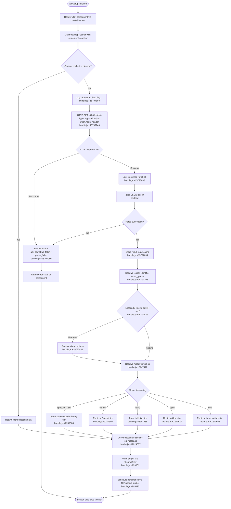

# `/powerup`

> Analysis basis: CC v2.1.168 bundle.js (AST extraction + Claude interpretation)
> Minimum version: v2.1.168

---

## Overview

`/powerup` is an interactive discovery command that surfaces Claude Code features through short, guided lessons. It renders a JSX component and orchestrates a bootstrap fetch sequence to retrieve lesson content, then delivers that content as a system-scoped message to the active agent session. The command is intended as a lightweight onboarding and feature-awareness tool for users who want to explore Claude Code capabilities incrementally.

---

## Registration

| Field | Value |
|---|---|
| type | `local-jsx` |
| name | `powerup` |
| description | `Discover Claude Code features through quick interactive lessons` |
| module_id | `Boq` |
| load_inline | `true` |
| loc_byte | `12024135` |
| loc_byte_end | `12024315` |
| loc_line | `8316` |
| arbor_handler.name | `ONf` |
| arbor_handler.fqn | `claude-2.1.168::ONf` |
| arbor_handler.kind | `AsyncFunction` |
| arbor_handler.resolution_path | `module_id` |
| arbor_handler.n_hits | `0` |

Analysis basis: CC v2.1.168 bundle.js:+12024135

---

## Input Branching

The command involves 4+ distinct execution paths: normal bootstrap fetch success, fetch parse failure, content already cached, and lesson delivery routing. A Mermaid flowchart is used.



---

## Behavioral Spec

### Handler Entry Point — `powerupHandler` (ONf)

The Arbor-resolved handler is an `AsyncFunction` reached via `module_id → Boq`. It is the sole entry point for the command.

```
async function powerupHandler(context):
    element = createElement(pqA, context)        // JSX mount
    result  = await bootstrapFetcher(element)    // fetch lesson data
    deliver lesson as system-scoped message
    return rendered element
```

Analysis basis: CC v2.1.168 bundle.js:+12024009, +12024044, +12024057

---

### Bootstrap Fetch Subsystem — `bootstrapFetcher` (H → v)

Responsible for retrieving remote lesson content with an in-memory cache to avoid redundant network calls.

```
async function bootstrapFetcher(tag):
    log("[Bootstrap] Fetching", tag)             // +15797658
    if cacheMap.has(tag):
        return cacheMap.get(tag)                 // +15797694
    response = await httpGet(
        headers = {
            "Content-Type": "application/json",  // +15797743
            "User-Agent":    <agent_string>       // +15797777
        },
        timeout = 5000                           // +15797859
    )
    if not response.ok:
        emit tengu event "api_bootstrap_fetch"   // +15797980
        return errorState("parse_failed")        // +15798002
    data = JSON.parse(response.body)
    if parse fails:
        emit tengu event "api_bootstrap_fetch / parse_failed"
        return errorState
    log("[Bootstrap] Fetch ok")                  // +15798032
    cacheMap.set(tag, data)
    return data
```

Analysis basis: CC v2.1.168 bundle.js:+15797656, +15797694, +15797790

---

### Lesson Identifier Parsing — `lessonIdParser` (mj_)

Splits and trims the raw lesson string to extract a clean identifier.

```
function lessonIdParser(rawInput):
    parts = rawInput.split(separator)
    part0 = parts[0].trim()
    idx   = part0.indexOf(marker)
    if idx >= 0:
        return part0.slice(0, idx)
    return part0
```

Analysis basis: CC v2.1.168 bundle.js:+2979391, +2979430, +2979454, +2979494

---

### Known-Lesson Gate — `lessonKnownCheck` (lHH)

Guards routing: only lesson IDs present in the known-lessons `Set` (`o74`) proceed to full model-tier resolution.

```
function lessonKnownCheck(lessonId):
    return knownLessonsSet.has(lessonId)         // +844383
```

Analysis basis: CC v2.1.168 bundle.js:+15797829

---

### Input Sanitizer — `inputSanitizer` (uj)

Applied when a lesson ID is not in the known set; performs a string replacement to neutralise unexpected characters before further processing.

```
function inputSanitizer(rawString):
    return rawString.replace(sanitizePattern, replacement)  // +2249044
```

Analysis basis: CC v2.1.168 bundle.js:+15797841

---

### Model-Tier Resolver — `modelTierResolver` (s9)

Maps a normalised model-name string to an internal routing tier. String is trimmed and lowercased before comparison.

```
function modelTierResolver(modelName):
    name = modelName.trim().toLowerCase()        // +2247412, +2247423
    name = applyReplacementRules(name)           // +2247451
    if isExtendedThinkingVariant(name):          // h4H check +2247487
        return extendedThinkingTier
    tier = selectTierByKeyword(name):
        "[1m]"     → extendedThinkingTier        // +2247534
        "opusplan" → opusPlanTier                // +2247508
        "sonnet"   → sonnetTier                  // +2247549
        "haiku"    → haikuTier                   // +2247588
        "opus"     → opusTier                    // +2247627
        "best"     → bestAvailableTier           // +2247664
    return tier
```

Analysis basis: CC v2.1.168 bundle.js:+2247412

---

### API Provider Routing — `apiProviderRouter` (m6H, _G)

Determines the API back-end (first-party Anthropic, AWS Bedrock, gateway, or mantle) based on model configuration.

```
function apiProviderRouter(modelConfig):
    provider = detectProviderClass(modelConfig)
    switch provider:
        "firstParty"   → use Anthropic direct endpoint   // +2243716
        "anthropicAws" → use AWS Bedrock endpoint        // +2101625
        "gateway"      → use gateway endpoint            // +2101645
        "mantle"       → use mantle endpoint             // +2244357
    applyProviderHeaders(provider, modelConfig)
    return routedRequest
```

Analysis basis: CC v2.1.168 bundle.js:+2243492, +2244247

---

### File-Persistence Pipeline — `filePersistenceHandler` (_iK, HiK, ll8)

After lesson content is resolved it is appended to a log file. The pipeline handles directory creation, atomic rename, and rotation.

```
async function filePersistenceHandler(content):
    dir = path.dirname(targetPath)               // +206115
    byteLen = Buffer.byteLength(content)         // +206290

    // Rotation check
    stats = fs.stat(targetPath)                  // +205407 (ll8)
    if targetPath.endsWith(".txt"):              // +205500
        rotatedPath = targetPath.slice(0, -4)   // +205522 (trim 4 chars) +205533
        fs.rename(targetPath, rotatedPath)       // +205563
        if error: fs.unlink(targetPath)          // +205603

    // Write path (HiK)
    fs.mkdir(dir, { recursive: true })           // +205836
    fs.appendFile(targetPath, content)           // +205895
    checkRotation(byteLen)                       // B76 at +205927
    updatePointers()                             // $0A at +205944

    // Output stream flush (npH / nWA)
    clearTimeout(pendingFlush)                   // +59783
    if pendingQueue.join() ready:
        streamWriter.write(output)               // +193301
    setTimeout(flushCallback, 1000)             // +59671, +59947
    setImmediate(drainCallback)                  // +60040
```

Analysis basis: CC v2.1.168 bundle.js:+206082, +205836, +205895, +193301

---

### Telemetry Emission — `featureSadTelemetry` (o6 → l)

Fired on command invocation error or unsatisfied feature state.

```
function featureSadTelemetry(context):
    emit("tengu_feature_sad", context)           // +1011093
    recordErrorDetails(context)                  // J6 → hm6 at +1011127
```

Analysis basis: CC v2.1.168 bundle.js:+1011091

---

### Hook Registration — `hookRegister` (j9)

Registers lifecycle hooks associated with the powerup lesson session.

```
function hookRegister(sessionId):
    NPA.register(sessionId, hookDefinition)      // +60369
```

Analysis basis: CC v2.1.168 bundle.js:+206445

---

### EISDIR Guard — `eiSdirGuard` (B76 → V8)

Protects the file-persistence pipeline from accidentally treating a directory path as a writable file.

```
function eiSdirGuard(filePath):
    try:
        openFile(filePath)
    catch err:
        if err.code === "EISDIR":                // +175692
            throw DirectoryConflictError(filePath)
```

Analysis basis: CC v2.1.168 bundle.js:+175684, +175692

---

### Debug Logging — `debugLogger` (v → snK)

Conditional debug-level log written during bootstrap and lesson delivery.

```
function debugLogger(message, payload):
    if logLevel === "debug":                     // +206570
        buildLogEntry(message, payload)          // KI at +205174
        formatEntry(payload, 1)                  // M0A at +205288, value 1 at +205186
        writeEntry via IPA                       // +205301
```

Analysis basis: CC v2.1.168 bundle.js:+206570

---

## State & Side Effects

| Item | Detail |
|---|---|
| Telemetry | `tengu_feature_sad` (bundle.js:+1011093) — emitted on feature error/unsatisfied state |
| Telemetry (inline literal) | `api_bootstrap_fetch` / `parse_failed` (bundle.js:+15797980, +15798002) — emitted on bootstrap HTTP or parse failure |
| HTTP network call | Bootstrap GET with `Content-Type: application/json` and `User-Agent` headers; 5000 ms timeout (bundle.js:+15797859) |
| In-memory cache | `qA` map caches bootstrap responses keyed by tag; avoids duplicate fetches (bundle.js:+15797694) |
| File system writes | `fs.appendFile` to lesson log path; `fs.mkdir` with recursive flag; atomic rename/unlink rotation (bundle.js:+205895, +205836, +205563) |
| Output stream | `streamWriter.write` flushed via `setTimeout(1000)` + `setImmediate` (bundle.js:+193301, +59671, +60040) |
| Hook registration | `NPA.register` called with session identifier (bundle.js:+60369) |
| appState changes | Lesson delivery injects a `system`-role message into the active conversation context (bundle.js:+12024057) |
| Sound | <!-- TODO: not found in depth-2 traversal; needs --depth 4 --> |
| Rotation limits | Flush queue batch size: 1000 ms debounce, 100-item cap (bundle.js:+59671, +59692) |
| Truncation limit | Filesystem path segment truncation at 40 characters (bundle.js:+16223773) |

---

## Version History

| Version | Change |
|---|---|
| v2.1.168 | Initial analysis |

---

## Common Mistakes

1. **Invoking `/powerup` in an environment with no network access** — the bootstrap fetch will time out after 5000 ms (bundle.js:+15797859), triggering `api_bootstrap_fetch` telemetry and returning an error state with no lesson content displayed.
2. **Expecting immediate file output** — lesson content is buffered and written via `setImmediate` / `setTimeout(1000)` debounce (bundle.js:+59671, +60040); the log file may not be updated synchronously after the command returns.
3. **Collision with an existing directory at the target log path** — the `EISDIR` guard (bundle.js:+175692) will throw rather than silently overwrite; ensure the log path is a file path, not a directory.
4. **Assuming all model names route to a single tier** — the resolver performs trim + lowercase + pattern replacement before matching; passing model names with unexpected casing or prefixes may fall through to the default `best` tier (bundle.js:+2247664).
5. **Re-invoking `/powerup` expecting fresh content** — the bootstrap response is cached in the `qA` map for the lifetime of the process (bundle.js:+15797694); restart Claude Code to force a fresh fetch.

---

## Appendix — Identifier Mapping

> For bundle debugging only. Identifiers change across versions.

| Identifier | Role |
|---|---|
| `ONf` | `powerupHandler` — async main handler for `/powerup`; Arbor-resolved entry point |
| `H` | `bootstrapFetcher` — fetches and caches remote lesson content |
| `v` | `bootstrapCore` — inner bootstrap logic including debug logging and stream routing |
| `snK` | `debugLogBuilder` — constructs debug-level log entries |
| `IPA` | `logEntryWriter` — writes formatted log entries |
| `RH` | `jsonStringifyHelper` — wraps `JSON.stringify` for safe serialisation |
| `_` | `rawInputString` — raw lesson/model input string variable |
| `G4` | `pathSegmentProcessor` — processes filesystem path segments with truncation |
| `K0A` | `pathSegmentMapper` — maps over path segment array (`inK.map`) |
| `q` | `fileUnlinkHelper` — calls `fs.unlinkSync` for file removal |
| `A` | `lowercasePathHelper` — lowercases path components |
| `EUH` | `streamFlushCoordinator` — coordinates output stream flushing via `nWA` |
| `nWA` | `streamWriter` — performs the actual `H.write` to the output stream |
| `_iK` | `filePersistencePipeline` — orchestrates file append, rotation, and hook registration |
| `npH` | `debouncedFlushScheduler` — manages `setTimeout`/`setImmediate`/`clearTimeout` for flush debounce |
| `YKH` | `lessonOutputFormatter` — joins and formats lesson output segments (`IHH.join`) |
| `d6` | `persistenceConfigReader` — reads persistence configuration |
| `B76` | `rotationChecker` — checks byte length against rotation threshold; calls `V8` |
| `$0A` | `pointerUpdater` — updates file position pointers (`IHH.join`, `R6`) |
| `ll8` | `fileRotationHandler` — stats, renames, and unlinks log files for rotation |
| `HiK` | `fileAppendHandler` — creates directory and appends content to log file |
| `j9` | `hookRegister` — registers lifecycle hooks via `NPA.register` |
| `Y3` | `bootstrapTagResolver` — resolves the tag key used for cache lookup |
| `mj_` | `lessonIdParser` — splits and trims raw input to extract lesson identifier |
| `lHH` | `lessonKnownCheck` — checks membership in the known-lessons Set (`o74`) |
| `uj` | `inputSanitizer` — replaces unexpected characters in unknown lesson IDs |
| `H9` | `lessonDispatcher` — top-level dispatcher combining model resolution and routing |
| `m6H` | `apiProviderRouter` — routes to first-party / AWS / gateway / mantle back-end |
| `Q0` | `providerClassDetector` — detects provider class for routing |
| `aqH` | `providerHeaderApplicator` — applies provider-specific HTTP headers |
| `qB` | `modelConfigParser` — parses model configuration object |
| `s9` | `modelTierResolver` — normalises and maps model name string to routing tier |
| `Y2` | `modelNameNormaliser` — applies regex normalisation via `R4H` |
| `h4H` | `extendedThinkingDetector` — checks membership in extended-thinking model list (`y4H`) |
| `CI` | `sonnetTierRouter` — routes to Sonnet-class tier (`lM`, `N5`) |
| `DdH` | `haikuTierRouter` — routes to Haiku-class tier (`N5`) |
| `bT` | `opusTierRouter` — routes to Opus-class tier (`lM`, `N5`, `MA`) |
| `lP1` | `bestTierRouter` — delegates to `bT` for best-available routing |
| `lM` | `anthropicAwsProviderBuilder` — builds provider config for `anthropicAws` / `MA` |
| `NH8` | `modelListChecker` — checks against allowed-model list (`AKL`) |
| `wdH` | `modelOverrideApplier` — applies model overrides via `_6` |
| `FJ` | `fullModelResolver` — combines `s9` and `_G` for complete model resolution |
| `_G` | `compositeModelBuilder` — assembles composite model object from multiple tier components |
| `o6` | `telemetryErrorReporter` — emits `tengu_feature_sad` and records error details |
| `l` | `telemetryEmitter` — low-level telemetry emission function |
| `J6` | `errorDetailRecorder` — records structured error details (`hm6`) |
| `hm6` | `errorDetailStore` — stores error detail records |

---

Note: index built via Arbor fallback; some signals (telemetry, literals) may be missing — see arbor-fallback.js.