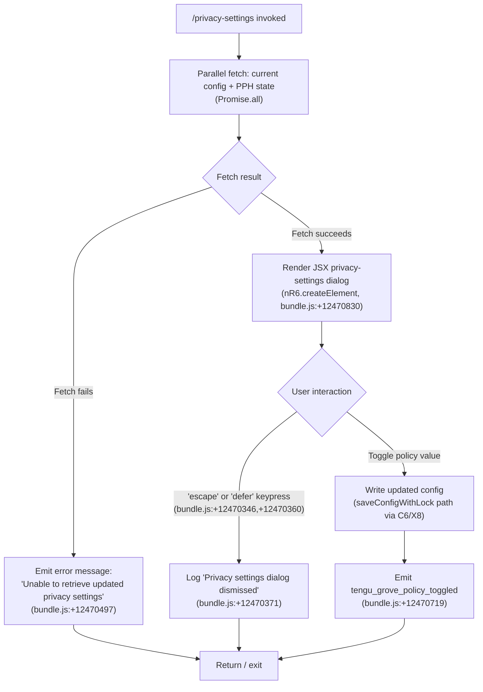

# `/privacy-settings`

> Analysis basis: CC v2.1.168 bundle.js (AST extraction + Claude interpretation)
> Minimum version: v2.1.168

---

## Overview

`/privacy-settings` is a local JSX command that opens an interactive dialog allowing the user to view and update their privacy settings within Claude Code. The handler (`URf`) fetches current privacy policy state in parallel, then renders a JSX component that presents the settings; dismissal or changes are propagated back to configuration via config-write primitives with lock contention protection. A telemetry event (`tengu_grove_policy_toggled`) is emitted whenever a policy toggle is actioned.

---

## Registration

| Field | Value |
|---|---|
| type | `local-jsx` |
| name | `privacy-settings` |
| description | `View and update your privacy settings` |
| loc_byte | `12471183` |
| loc_byte_end | `12471375` |
| loc_line | `8853` |
| module_id | `r_K` |
| load_inline | `true` |
| arbor_handler.name | `URf` |
| arbor_handler.fqn | `claude-2.1.168::URf` |
| arbor_handler.kind | `AsyncFunction` |
| arbor_handler.resolution_path | `module_id` |
| arbor_handler.n_hits | `0` |

Analysis basis: CC v2.1.168 bundle.js:+12471183

---

## Input Branching

The command handler has four observable branches based on the result of the parallel data-fetch and the user's interaction with the rendered dialog:



---

## Behavioral Spec

### Handler Entry Point (`URf`)

Analysis basis: CC v2.1.168 bundle.js:+12470183

```
async function privacySettingsHandler(context):
    # Retrieve current app state header (H) and current config snapshot
    currentConfig = getConfig(context)          # calls configReader (NtH)
    policyState   = getPolicyHeader(context)    # calls PPH

    # Parallel resolution to minimise latency
    [configResult, policyResult] = await Promise.all([currentConfig, policyState])
                                                # bundle.js:+12470223

    if fetchFailed(configResult, policyResult):
        displayError("Unable to retrieve updated privacy settings")
                                                # bundle.js:+12470497
        return

    # Build and render the JSX dialog
    element = createElement(PrivacySettingsComponent, {
        config: configResult,
        policy: policyResult,
        onEscape:  () => logDismissal("escape"),   # bundle.js:+12470346
        onDefer:   () => logDismissal("defer"),    # bundle.js:+12470360
        onChange:  (delta) => applyPolicyChange(delta)
    })                                          # bundle.js:+12470830
    renderComponent(element)                    # nR6.createElement
```

### Config Read Sub-system (`NtH` → `GLH` / `kL` / `C6` / `X8`)

Analysis basis: CC v2.1.168 bundle.js:+7013283 (NtH), +3025915 (GLH), +7013304 (kL)

```
function fetchPrivacyConfig(context):
    # GLH: resolve current subscription tier
    tier = resolveSubscriptionTier()     # literals "max", "pro" — bundle.js:+3025877,+3025888
                                         # calls configAccessor (Aq) and configStateReader (GA)

    # kL: read global config via configReader (C6) with file-watch (hVL)
    rawConfig = readGlobalConfig()       # C6 → LwH (readFileSync, bundle.js:+3267592)
                                         # guards against "Config accessed before allowed."
                                         #   bundle.js:+3267536

    if rawConfig is missing (ENOENT):    # bundle.js:+3267766
        rawConfig = defaultConfig()

    # X8: read and validate project-level config
    projectConfig = readProjectConfig()  # sP_ path — bundle.js:+3262406
                                         # lock acquisition warning if slow:
                                         # "Lock acquisition took longer than expected..."
                                         #   bundle.js:+3265503

    # Merge: project overrides global
    return merge(rawConfig, projectConfig)
```

### Config Write / Policy Change (`C6` → `sP_` / `X8`)

Analysis basis: CC v2.1.168 bundle.js:+3264284 (C6), +3265419 (sP_), +3262522 (X8)

```
function applyPolicyChange(delta):
    # Re-read config to get freshest state before writing
    freshConfig = readConfigWithLock()

    if freshConfig is missing auth fields that cache has:
        # Safety guard — refuse write to prevent auth wipe
        # "saveConfigWithLock: re-read config is missing auth that cache has..."
        #   bundle.js:+3265919
        logAndAbort()
        return

    # Back up existing config (up to 5 backup files, 60 s lock timeout)
    # Max backups: 5   bundle.js:+3266522
    # Lock timeout: 60000 ms   bundle.js:+3266273
    createBackup(freshConfig)

    mergedConfig = applyDelta(freshConfig, delta)
    writeConfigAtomic(mergedConfig)              # q.copyFileSync → rename pattern

    # Emit telemetry
    emit("tengu_grove_policy_toggled")           # bundle.js:+12470719
```

### Dialog Dismissal

Analysis basis: CC v2.1.168 bundle.js:+12470346, +12470360, +12470371

```
function handleDismissal(reason):
    # reason ∈ {"escape", "defer"}
    log("Privacy settings dialog dismissed")    # bundle.js:+12470371
    # No config write occurs on dismissal
    return
```

### Grove / Policy Cache (`NtH` → `xF9` cache paths)

Analysis basis: CC v2.1.168 bundle.js:+7013478 (xF9)

```
function resolveGrovePolicy():
    if noCacheExists():
        log("Grove: No cache, fetching config in background (dialog skipped this session)")
                                    # bundle.js:+7013398
        fetchInBackground()
        return cachedOrDefault()

    if cacheStale():
        log("Grove: Cache stale, returning cached data and refreshing in background")
                                    # bundle.js:+7013518
        refreshInBackground()
        return cachedData()

    log("Grove: Using fresh cached config")  # bundle.js:+7013624
    return cachedData()
```

### MCP State Aggregation (`M` → `xbH` → `cDA`)

Analysis basis: CC v2.1.168 bundle.js:+15879305 (xbH), +15880143 (cDA)

The privacy-settings handler also loads the full MCP connection map (`M`, bundle.js:+12470440) to display active server states alongside privacy controls. The aggregation enumerates all configured MCP slots (enterprise, mcp, user, project tiers — bundle.js:+6843860,+6844075,+6844102) and collects their current connection status (approved/pending/needs-auth/failed). This data is passed read-only to the dialog for display; it is not mutated by the `/privacy-settings` command.

---

## State & Side Effects

| Item | Detail |
|---|---|
| Telemetry: `tengu_grove_policy_toggled` | Fired on each successful policy toggle write (bundle.js:+12470719) |
| Telemetry: `tengu_config_parse_error` | Fired if config JSON cannot be parsed during read (bundle.js:+3268167) |
| Telemetry: `tengu_config_lock_contention` | Fired when config lock acquisition exceeds expected duration (bundle.js:+3265592) |
| Telemetry: `tengu_config_stale_write` | Fired when a stale config write is detected and blocked (bundle.js:+3265728) |
| Telemetry: `tengu_config_auth_loss_prevented` | Fired when an auth-wiping write is refused (bundle.js:+3266071) |
| Telemetry: `tengu_feature_sad` | Fired on unexpected feature-level error (bundle.js:+1011093) |
| Config file read | Global config read via `readFileSync` (utf-8); project config via stat+read (bundle.js:+3267592, +3267639) |
| Config file write | Atomic copy-rename pattern with up to 5 backups; 60 s lock timeout (bundle.js:+3266522, +3266273) |
| File watcher | `hVL` registers/deregisters a `watchFile` / `unwatchFile` pair around config reads (bundle.js:+3263787, +3264120) |
| Hook registration | `j9` calls `NPA.register` — registers a cleanup hook after dialog close (bundle.js:+60369) |
| appState changes | Privacy policy field(s) in global/project config updated on confirmed toggle |
| JSX render | `nR6.createElement` used to mount the dialog component (bundle.js:+12470830) |
| Sound | None observed in depth-2 traversal |
| Dismissal log | String literal `"Privacy settings dialog dismissed"` written to log on escape/defer (bundle.js:+12470371) |

---

## Version History

| Version | Change |
|---|---|
| v2.1.168 | Initial analysis |

---

## Common Mistakes

1. **Invoking `/privacy-settings` in a non-interactive context** — the command renders a JSX dialog; it will silently fail or produce no output in pipe/headless sessions where there is no TTY to render to.
2. **Expecting immediate persistence without confirmation** — pressing `escape` or `defer` logs a dismissal and makes no config changes; only an explicit toggle action triggers a write.
3. **Concurrent Claude instances** — if another Claude instance holds the config lock, write operations will surface a "Lock acquisition took longer than expected" warning (`tengu_config_lock_contention`). Users should close other instances before toggling privacy settings to avoid contention.
4. **Interpreting the "Unable to retrieve updated privacy settings" error as permanent** — this message (bundle.js:+12470497) indicates a transient fetch failure; retrying the command after a moment typically succeeds.
5. **Assuming MCP server state is editable here** — the MCP connection map displayed alongside privacy controls is read-only within this dialog; changes to MCP servers require `/mcp` or direct config edits.

---

## Appendix — Identifier Mapping

> For bundle debugging only. Identifiers change across versions.

| Identifier | Role |
|---|---|
| `URf` | Main handler for `/privacy-settings` (AsyncFunction) |
| `NtH` | Config fetch orchestrator called by handler |
| `GLH` | Subscription tier resolver (reads "max"/"pro" literals) |
| `Aq` | Config accessor / field reader |
| `s7_` | Config sub-field reader A |
| `a7_` | Config sub-field reader B |
| `GY` | Config state reader (reads ANTHROPIC_API_KEY, apiKeyHelper) |
| `GA` | Config state aggregator |
| `DC` | Array/include-based config discriminator |
| `wp1` | Config post-processor / writer helper |
| `kL` | Global config reader entry point |
| `C6` | Config read-with-lock coordinator |
| `d6` | Config path resolver |
| `nP_` | Config normaliser / parser |
| `LwH` | Low-level file read (readFileSync, utf-8) with backup logic |
| `hVL` | Config file watcher (watchFile / unwatchFile) |
| `v` | Logging / debug output utility (emits "debug" level) |
| `snK` | Log formatter |
| `IPA` | Log sink initialiser |
| `H` | HTTP / bootstrap fetch utility |
| `Y3` | Bootstrap response validator |
| `mj_` | String parser (split/trim/indexOf/slice) |
| `lHH` | Cache hit-checker |
| `uj` | String sanitiser (replace) |
| `H9` | Header builder (m6H, s9, FJ) |
| `o6` | Output formatter |
| `RH` | JSON serialiser (JSON.stringify) |
| `G4` | Path/string manipulation utility |
| `K0A` | Mapped-path builder |
| `EUH` | Write flusher (nWA → H.write) |
| `nWA` | Stream write wrapper |
| `_iK` | Transcript / log-file writer |
| `npH` | Debounced batch logger (clearTimeout / setTimeout / setImmediate) |
| `YKH` | Log file path builder |
| `B76` | Log rotation helper |
| `$0A` | Log directory path builder |
| `ll8` | Log file rename/unlink helper |
| `HiK` | Log file append (mkdir + appendFile) |
| `j9` | Cleanup hook registrar (NPA.register) |
| `xF9` | Grove/policy cache resolver (stale/fresh/background logic) |
| `X8` | Project config reader |
| `sP_` | Config save-with-lock implementation |
| `dlH` | Config diff helper |
| `Vo1` | Object.entries enumerator for config slots |
| `qK8` | Timestamp helper (Date.now) for config locking |
| `aj6` | Config merge / assign helper |
| `aP_` | Project config atomic-write helper |
| `M` | MCP state aggregator (top-level) |
| `xbH` | MCP connection map builder |
| `sl` | MCP slot enumerator |
| `qT6` | MCP slot type handler (XS, aKH) |
| `bs` | MCP server connection processor (enterprise/mcp/user/project tiers) |
| `al` | MCP SDK client list builder |
| `cD8` | MCP error colour formatter (red/yellow) |
| `AT6` | MCP transport-type router (sse/http/stdio) |
| `kk` | MCP config store accessor |
| `qz` | Config store reader (llH, C6, x9) |
| `xx_` | MCP config secondary accessor |
| `K` | MCP server list mapper (padEnd) |
| `L` | Async task set (add/delete/finally) |
| `f` | Connection handle (close operations) |
| `a8` | Utility wrapper (underscore alias) |
| `ly6` | MCP list filter helper |
| `hhq` | MCP tool schema validator / hasher |
| `NHA` | Tool schema normaliser |
| `tXH` | Tool schema hasher (SHA-256 via Pp9.createHash) |
| `UD8` | Tool definition validator (Object.keys) |
| `BD8` | Tool batch validator |
| `EP` | Tool entry hasher (Mp9.createHash) |
| `mD8` | Tool map initialiser |
| `z4` | Tool registry entry builder |
| `M8` | MCP debug log emitter (pr.logMCPDebug) |
| `wk8` | MCP client connector (main connection loop) |
| `Y7f` | Connection pre-flight checker |
| `vd` | Transport factory (Au, ZK) |
| `X9H` | MCP connection handler (Jkq, QLf) |
| `P9H` | Connection parameter builder |
| `W9H` | Full MCP connection lifecycle manager (OAuth, SSE, stdio) |
| `dA6` | In-flight connection tracker (Lk8 map) |
| `D` | Process exit / abort controller |
| `Jk8` | MCP cache reader (V9, ck8) |
| `an` | MCP reconnection orchestrator |
| `Au` | Transport base class constructor |
| `Y` | Active-connection supervisor (start/stop/updateConfig) |
| `v7` | MCP error log emitter (pr.logMCPError) |
| `GH` | String coercion utility |
| `D7f` | Connection race-condition resolver |
| `z7f` | SSH/URL transport discriminator |
| `jk8` | MCP client session handler |
| `QA6` | Kk8 map getter for connection slots |
| `cA6` | Lk8 map getter for in-flight slots |
| `phq` | MCP needs-auth cache checker |
| `V9` | AsyncLocalStorage getStore accessor |
| `ck8` | Needs-auth cache path builder (dk8.join) |
| `Ze_` | MCP auth state resolver |
| `j` | Process signal handler (SIGTERM / kill) |
| `S` | Background worker manager (VUK, O$, D35) |
| `tN` | Skill/tool notification dispatcher (D6) |
| `D6` | Skill change event emitter (cj6, lj6, cq8, IB) |
| `hx_` | MCP include-filter checker |
| `k` | File-watcher chokidar wrapper |
| `P6` | Platform helper (hm6) |
| `R` | Output stream writer |
| `bhq` | Async iterator mapper (AF) |
| `AF` | Generic async iterator / mapper utility |
| `L16` | parseInt-based config version parser (radix 10) |
| `lk8` | parseInt-based secondary version parser (radix 20) |
| `PF8` | MCP connection-result applier (applyMcpUpdate) |
| `bbH` | MCP update batch processor (tXH) |
| `Ay` | MCP slot cleanup orchestrator (q16, tN) |
| `q16` | Per-slot cleanup runner (tXH) |
| `$` | Daemon status writer (DLK) |
| `DLK` | Daemon status JSON writer (daemon.status.json) |
| `Yo` | Status entry builder (b4H) |
| `YC6` | Status path builder (YLK.join, t8) |
| `cDA` | MCP config-reload orchestrator (xbH, PF8) |
| `nD8` | MCP server suppression checker (Jj7, Sx_ sets) |
| `r8` | Timed async operation wrapper (setTimeout/clearTimeout) |
| `O` | Background session marker |

---

Note: index built via Arbor fallback; some signals (telemetry, literals) may be missing — see arbor-fallback.js.